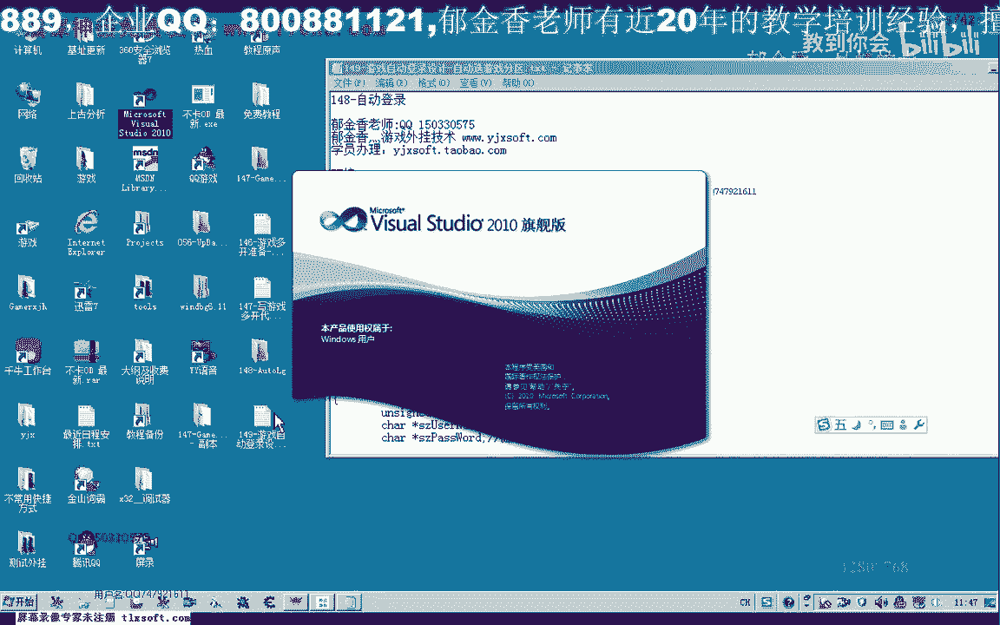
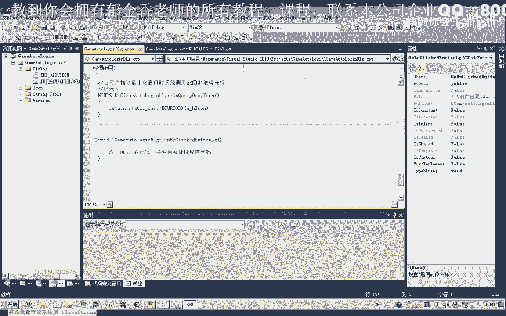
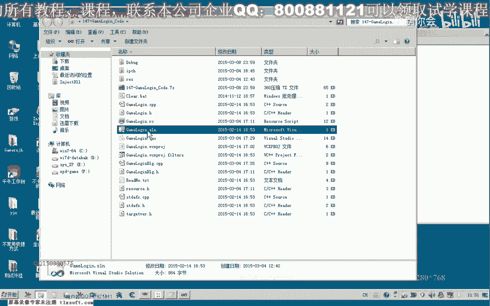
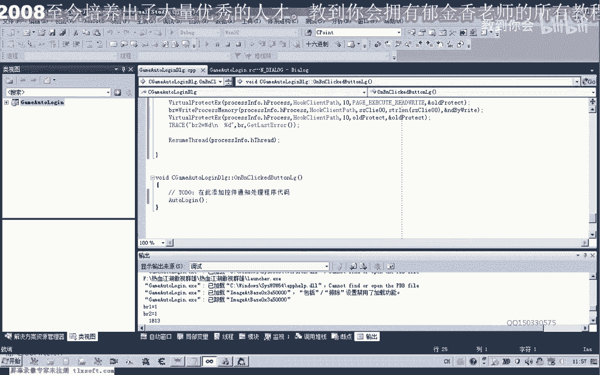
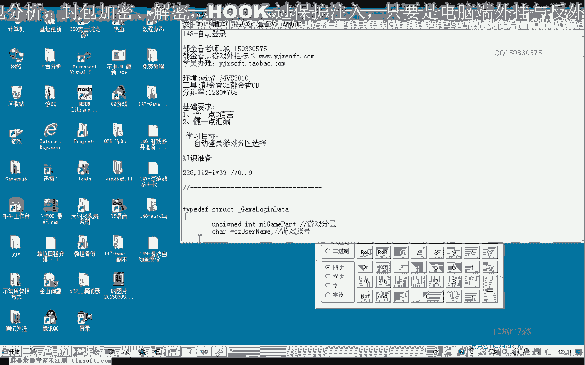
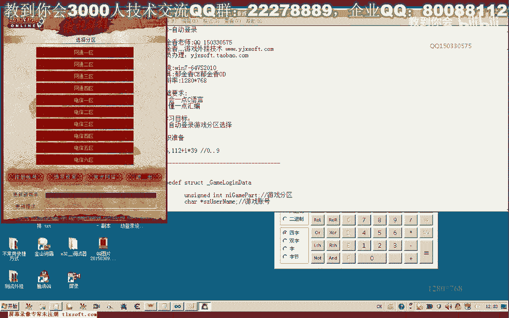
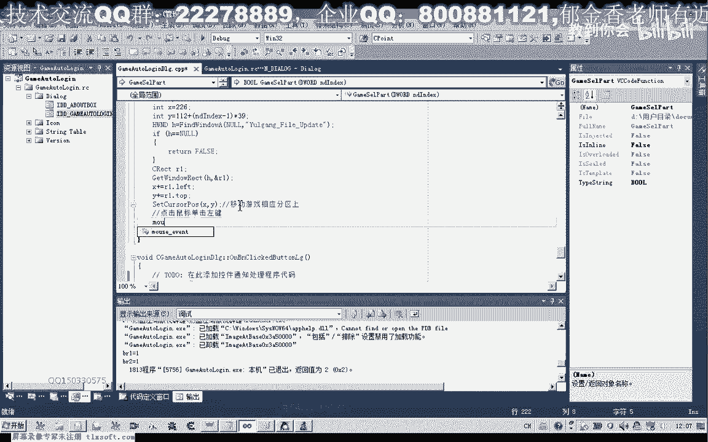
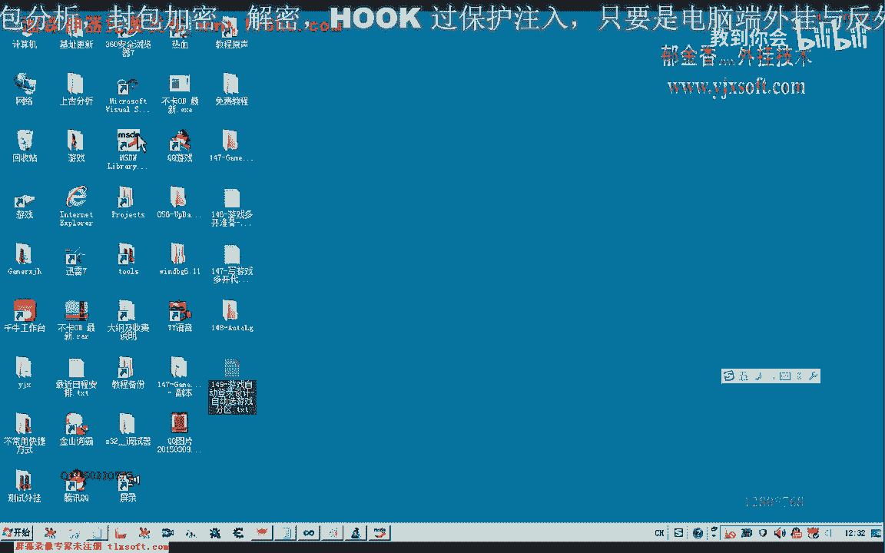
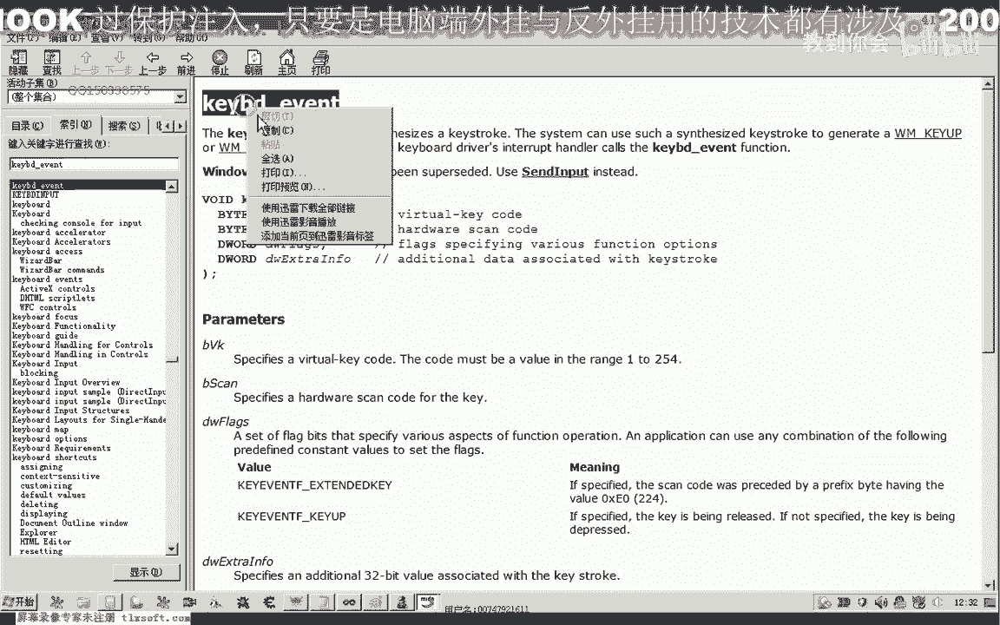

# P138：149-游戏自动登录设计-自动选游戏分区 - 教到你会 - BV1DS4y1n7qF

大家好，我是郁金香老师，那么这节课呢我们来编写自动登录呃里面的游戏分区，分区选择的这一部分代码，那么我们先打开vs 2010。

那么新建一个工程，那么这个工程呢我们就叫做自动登录，哈哈哈，那么为了方便我们代码的遗址呢，我们都把自动登录相关的呃代码呢把它封装成函数的形式啊，方便后边呢我们把它进行代码的一个移植，你好。

那么首先呢我们把147个的代码代码打开，那么里边的有关于游戏多开的这部分呢。

我们直接把它移植过来，那么这一部分呢是关于我们游戏多开的啊，呃我们把这段数据呢啊直接把它复制一下，然后粘贴过来，然后我们先编译一下，看还有没有其他的数据呢，呃需要进行移植。

那么关于这里呢有红线提示的这一部分呢，那么这几个变量的定义呢，我们需要把它呃复制过来，相关的一个数据，那么我们找一下，那么这一段呢我们也先把它注释掉，那么这相关的这个参数的话。

我们另外的定义一个把它定义成一个静态的一个变量，这里，做一下修改，好再次编译生成一下，感觉，好了设置好之后呢，我们再次编译生成一项，编译通过了之后呢。

这个时候我们先测试一下是否能够正常的打开我们的客户端，呃那么说明我们的路径哈可能设置还有一些问题，我们再来看一下。

对了这里我们还需要呢在我们的这个按钮里边的关联，相相应的这个函数需要调用一些，好的再次我们测试一下，好那么这个时候登录器打开之后呢，我们接下来要编写的代码就是选择这个分区。

那么现在它的分区的话一共有十个分区，那么我们因为是通过鼠标来模拟呢，需要取得这些啊分区的鼠标点击的一个位置，那么这个呢我们可以呢呃借助一些软件来获取它的一个位置。

那么这里我采用的方法呢是先把这个图片啊先保存下来，那么保存下来之后。

我们可以利用一些工具呢来确定它的一个坐标的一个位置，当然我们也可以自己编程实现嗯，那样显得的话要相对的复杂一些，那么这里呢我利用的这个画图的程序里边，它有一个相应的坐标。

那么这里呢就是它相应的呃零零点坐标的一个起始位置，那么这里面比如说我要点击这个网通一区，我们从这下面这里呢它会显示一个坐标，那么现在坐标的位置的话是216115啊。

那么我们这就是我们这个游戏分区的第一个分区啊，网通一区的位置，那么我们就可以把这个位置呢先记录下来，是226112，那么后面的位置呢我们也可以全部把它固化，当然还有另外一种比较简单的方式呢。

我们可以来呃把这里的坐标记一下，它的y坐标是100左右，我们可以看到，那么这里的y坐标呢我们看到的是多少呢，是大概是400啊，394的样子，那么我们394减掉100的话，就有一个差值，大概是294啊。

大概在295的样子啊，那么我们再来看一下是这个位置啊，99大概是到这个位置，396，那么396到我们的99之间的话，大概是有400左右的，约等于嘛，我们说的约等于400，这样的一个像素的一个距离。

那么400的话我们除以它十个分期的话，十个分区，那么每一个分区它占用的这个，也就是说这个点与这个点之间的一个距离的话，那大概来就是40啊或者是39都可以，那么也就是说它的一个呃分区的坐标计算方式呢。

我们可以这样来给他表示，就是后面呢就是一个i乘以三九或者是四零都可以啊，这里我们取三九，那么这个i的值就等于我们的0~9啊，或者是呃1~9都可以，那么理论说理论上来说应当是0~9才对啊。

因为后面第一个坐，标的话它后面的数值应当被啊忽略掉，好的，那么接下来呢我们通过这个坐标取得的坐标，来来编写一个啊选择分区的呃一个函数，那么我们所需要准备的主要用到的api函数呢。

就是这个鼠标相关的，那么鼠标呢它有一个呃按下按左键的一个动作，或一个弹起左键的一个动作啊，这里有一个lion和lift up，那么我们需要有这两个动作，好的。

那么我们嗯先回到我们的这个v s010 那边，那么写一个相应的函数，那么这个n d n d x呢就是我们的分区，那么这里呢我们写为一到12，这样方便理解，好的，那么我们接下来呢需要用到两个函数。

一个呢是设置我们的鼠标的一个坐标，那么需要调用一个设置鼠标位置的一个函数，那么这个位置呢就是我们需要用到一个xy的一个坐标，我们之前呢可以定义这个x和y，那么我们来看一下我们记录的啊，226112。

226，112，那么把它写在这里，但是这个坐标的话是相对于我们窗口的一个坐标，但是我们在设置这个坐标呢，它是针对整个屏幕啊，桌面的，那么所以说我们还需要转换一下，在这之前呢。

我们需要来取得这个窗口的一个左上角的一个坐标，也就是我们再次把震动器打开。

我们需要取得这个位置的坐标啊，如果它本身是在这个位置的话，我们就可以直接调用。

但是呢我们所取得的这个坐标的话是相对于这个登录窗口的，所以说我们需要取得登录窗口的左上角的一个坐标，那么这个呢我们可以先取得我们窗口的一个距离，那么打开我们的工序啊，派加一下，那么取得它的一个标题啊。

匿名，这个我们可以省略掉取得它的一个标题，然后呢我们找到之后哈，那么如果这个窗没有找到，没有找到的话，它等于零啊，返回的句柄的为空，那么我们直接就返回啊fs，那么如果找到了。

那么我们就用其他的这个函数来获取该window，我们获得一个这个窗口的指定窗口的这个矩形上下左右的一个坐标，那么它另外还需要一个参数，那我在这边打，啊这样的话我们可以取得一个上下左右的一个距离。

保存在这个结构里面，那么这个xy的话我们还要什么呢，要加上这个窗口的他的x呢需要加上它的left题啊，也就是我们左边的这个边界的这个坐标，那么y呢我们要加上他还是一点拓扑啊。

那么top的话也就是这个顶点的这个y坐标，内地的是这个边的一个x坐标，那么我们加上之后呢，呃加上之前的这个226和112的这个偏移的话，那么这样加上呃，它现在的这个边界呢就组成了它在屏幕上的这个位置啊。

也就是在某个点的啊，这个网通一区的啊，屏幕上的一个位置，它就过去了，那么获取了之后呢，我们然后呢可以把鼠标移动到这里，移动到这里好的，那么我们接下来我们可以先测试一下。

当然这里呢我们的y坐标还需要加上一个参数，加上我们的nd index t减一，因为它是从零开始的，这里要减一，然后再乘以我们的三九，这是我们所分析的这个数据，啊这是它的坐标的一个公式。

那么这样的话我们就能够把我们的鼠标移动到移动到游戏相应的分区，散，那么移动到这个分区上之后呢，我们还要还要就是说呃，点击点击鼠标左键，或者说鼠标单击左键，那么这个时候呢我们需要用到另外一个api函数。

那么我们再来看一下我们sdn。

那么它的第一个参数我们需要来左键按下传递一下，那么后面呢我们都可以省略掉，后边这些参数呢我们用不到呃，因为这里呢我们用的是一个绝对的一个坐标，不是相对坐标，所以说后面的他这个什么dx dy y呢。

我们就用不上了，那么另外呢它还需要一个动作，按一下之后呢，我们还要弹琴，好，需要这两个动作，那么这两个动作之间呢，我们最后呢再加上一个sleep，好的，那么我们测试一下，另外啊用一个按钮来测试它。

选择分区，比如说我们选择啊分区一，当然我们也可以把这个常量来把把它定义成红啊，定义成这个网通一区，网通二区啊，这样的红啊也可以，比如说在这里听一下，啊也可以这样的定义，好，那么我们再次来看一下。

那么这个时候呢我们点击这里的时候呢，它首先它会自动的把鼠标移动到这个地方啊，然后呢再点击一下，再点击一下，当然如果你想要这个鼠标的指针啊，没有这个显示的话。

可以来先把这个鼠标的指针呢呃用另外的一个函数来把它保存起来，我们可以用先用get，先用这个函数呢把我们的鼠标呢那指针的位置先保存一下，那么调用完了之后呢，我们再把它移动回来，哈哈哈，咳咳咳。

啊这个类型当然是不一样啊，sor，这个类型好的，那么我们再次来测试一下，啊这样的话啊如果时间比较短暂的话，他感觉视觉上来就感觉到这个鼠标它它是没有移动的啊，直接就点开了。

这个时候呢我们可以把选择分区这个函数呢，把它加到呃我们的自动登录里面，好这个是我们登录器打开哦，那么这个呢我们需要前置做一个说明啊，在它的前面做一个说明，这样才能够最终的调用。

因为这个函数呢我们现在写到它的后边去了，好，那么我们再次测试，那么这里呢我们还需要等待一段过程的，好那我们再去测试一下，那么我们还需要做到一点啊，就是需要把我们的这个分区呢窗口打开之后呢，需要把它前值。

那如果不把它前置的话，呃，这个时候呢它也会点击不到我们相应的这个分区，好的，那么这个时候呢我们再做一些修改，测试的时候，我们再让这个等待的时间稍微长一点，主要是我们要让它显示出我们的这个登录界面之后呢。

我们才能够选择这个分区，那么我们可以加一个循环，那么加一个循环的作用是什么呢，就是直到我们的这个窗口呢，它出现之后，我们嗯再选择这个相应的分区，那么在这个循环里面呢，我们一直查找这个窗口。

看这个窗口呢它是否创建的啊，那么如果我们找到了这个窗口，这个窗口呢它不为空，那么在这里的话，我们呃sleep呃，然后再退出，那么也就是说等待一个登录器打开哈，然后呢我们再进行一个分区的一个选择。

那么接下来我们再测试一下，然后我们在这里呢输出相应的调试信息，我们看一下它是否选择了相应的这个分区，那么这个时候的话我们看到我们这段调试信息呢，呃没有被执行，那么应该是我们可能循环里面出了一些问题。

没有正常的退出，那么我们在到这个循环信息这里呢，再加上一段调试信息啊，哈哈，那么我们看它是否检测到这个登录器是否已经打开，如果打开的话，它应当啊会执行到这一句，那么这个循环的话。

我们也要给它加上一个实力谱啊才对啊，60ms的时间，如果没有加上实力谱的话，可能他很快就把这个循环呢完成了，外面我们还应该要加上你的实力吧，好那么这个时候的话呃，这个分区呢应当是正常的选择了啊。

正常的选择，好那么我们再次测试一下，那么在这里呢我们选择分区2号试一下，四分区啊，我们看一下，我们把它移开一点，那么鼠标尺寸呢在这个位置上，那么我们看到他闪了一下，然后就回到了这个位置。

从这里的话我们看不到，那我们要登录游戏之后呢，才能够从里面能看到它的一个分区，那么我们就进入游戏之后呢，再来看一下，那，么这个时候的话可能是他的这个分区的话选错了啊，所以说呢他说这个相应的账号没有激活。

我们再来看一下它的一个坐标的一个选择呃，657328，这是x坐标328，我们来看一下啊，那么我们最好呢是在测试阶段呢，把这个还原鼠标位置的这个把它去掉啊，这一段还有这个保存我们鼠标信息的这一段呢。

我们先把它去掉，那这样呢我们能够直接的看到鼠标的一个位置，然后移动到这个分区上面之后啊，移动到这里之后呢，我们这里的延迟呢我们加长一点，方便我们观察它移动的位置是否正确。

啊这个时候呢他选的是电信的一区啊，它什么呢，他少选了，应该是下移了一位，在这里的话应该是这个nd的话要减二才对，乘以39i乘以39y坐标26112，我们再来看一下26 1120，要不叫我。

这个位置到这个位置三三十九的样子啊，那是加上39，加上九的话就是这个位置，不是幺幺，那么我们把它写成211106的样子，再做一下更改，然后你们就，这里我们传进来的分区，我们看一下是几分区。

这里是四四的话，应该是往这里剪了之后呢，就是3106+3，这里看起来的话是没有错的啊，我们再次进行一下测试，那么从我们选择的结果来看的话，应当是我们所处的这个位置应当是取错了。

那么我们在选择一分区的时候，看会不会输错，但是这个之间的距离呢我们计算错了，那么一分区的时候呢，它是没有出错的，那么我们再来看一下它的距离呃，那么这个位置到这个位置之间的距离呢，我们要把它计算出来。

我们再来看一下现在这个位置的一个这个顶点的啊，这里的一个y坐标大概是100左右，在这里的话是396啊，刚才我们是用396除以的10，这样得得出来的39，但是我们忘记了，还要减掉前面的这个100。

那么实际上他这个位置应当等于29左右吧，我们再把它进行一下修改，这里应该是29啊，而不是三九，做一下测试，那么这个时候移动的位置的话应当是正确的正确的，那么下一步呢我们就要点击这个游戏开始。

那么开始这个位置的话，我们来看一下在什么地方，在这个注册账号，这个地方大概是六六啊，48，那么我们一起在选择这个分区里面完成66428，我们把它记录一下，这里是二九，然后游戏开始的位置。

66428这个位置，那么66428的话，我们也需要再次改变我们x坐标和y坐标，那么这个时候x坐标等于我们的嗯r一点left，加上我们的六六这个偏移y坐标呢我们要重新复制啊。

因为之前呢我们做了一些修改为r leder top，加上我们的48这个位置，然后我们再移动我们的鼠标，这个时候是移动到游戏开始的位置，然后呢我们再次模拟一次鼠标的单机。

啊当然这个测试呢我们可以这个延迟呢我们可以去掉了，刚才测试已经成功了，好那么我们再次编译申请一下，在运行测试，那么这个时候呢我们就能够打开登录器了，但是我们还要注意一点呃，它登录器打开的时候呢。

在这里呢它需要一段反应的时间啊，如果这里的反应时间不够的话，它初始化没有完成，再单击我们的游戏开始的话，可能呢呃这个时候呢打不开我们的游戏客户端，那么实际上我们应当在这个游戏的开始前面呢。

我们还要隔一段时间要让我们的这个游戏开始了，等待游戏开始的这个按钮显示出来，那么这个呢我们可以用sleep来把这个舒适的设置比较大就可以了，那么另外一种比较保险的做法呢。

也就是我们可以另外的写代码来来检测这个按钮是否显示出来，但是现在呢我们直接用实例先写，那么后面呢我们可以通过这个窗口的这个颜色这一类的来做一些判断。

或者是一些找一些呃这个相应的这个人能够判断它的一些机制，来判断它是否我完成了一个相应的初始化，那么完成了之后呢，我们再来打印，打开它的一个这个客户端，好的。

那么下一节课呢我们再来完成这个账号和密码的一个输入啊，所用到的这个api函数的话，就是这个k，啊嗯也就是这个api函数。

它是用来模拟我们键盘输入的。

好的，那么这节课呢我们暂时就讨论到这里。

