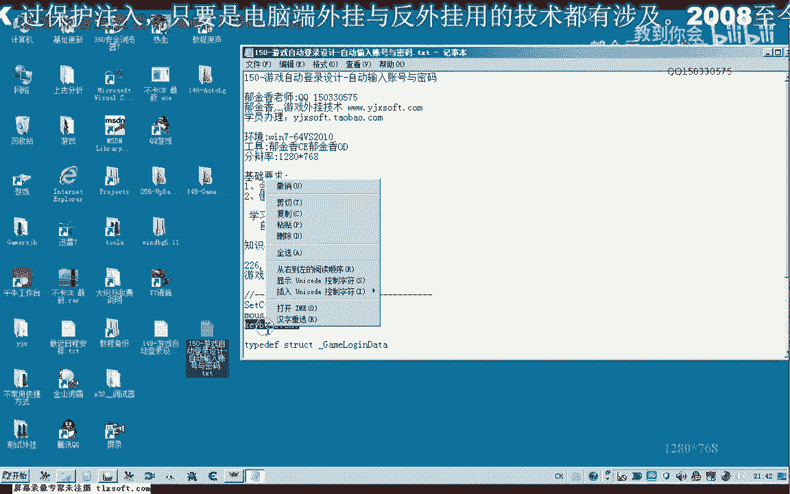
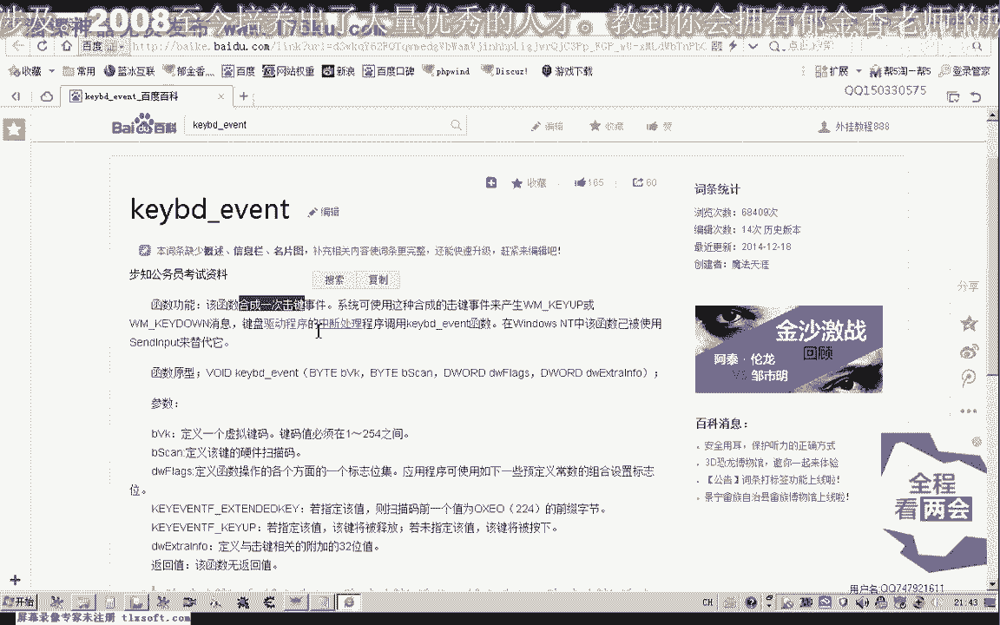
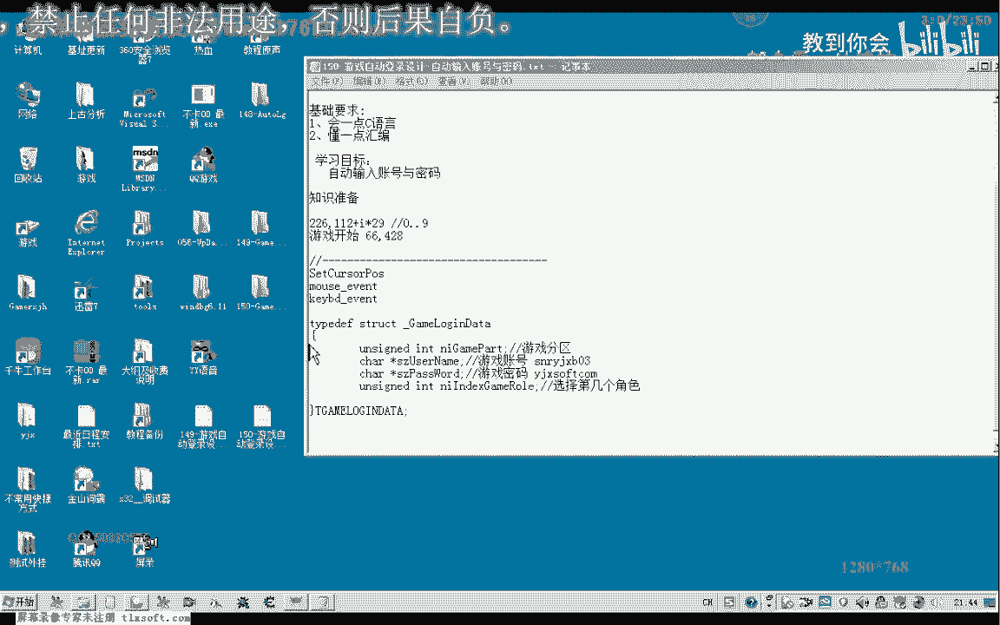
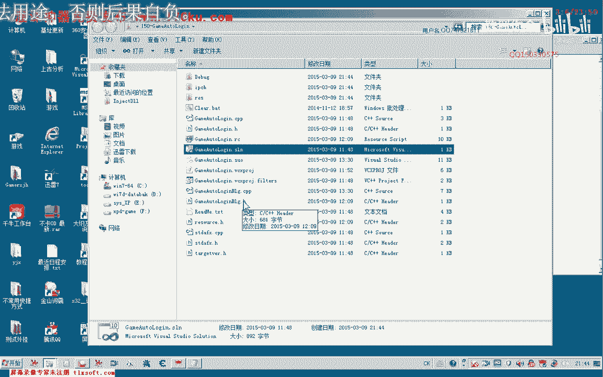
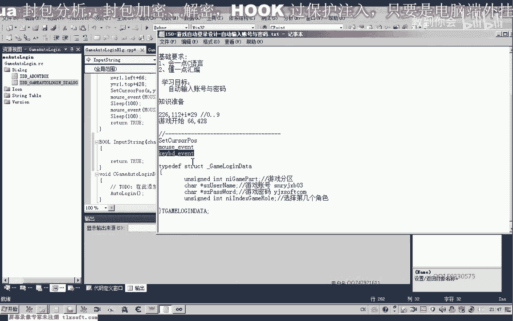
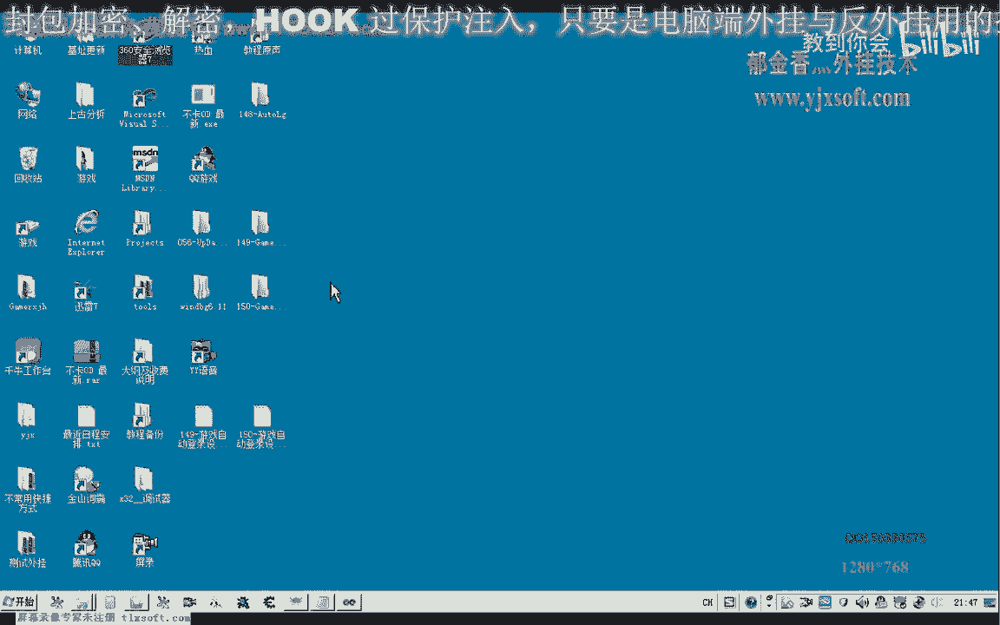
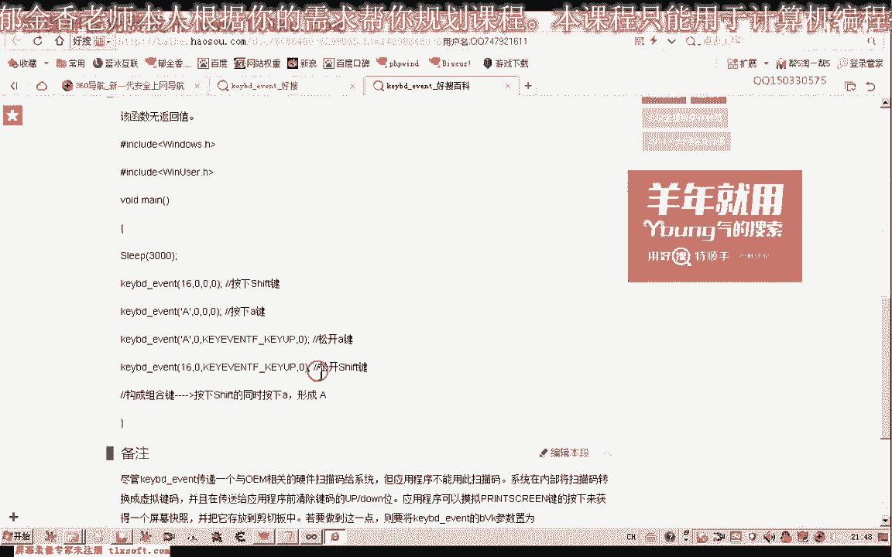
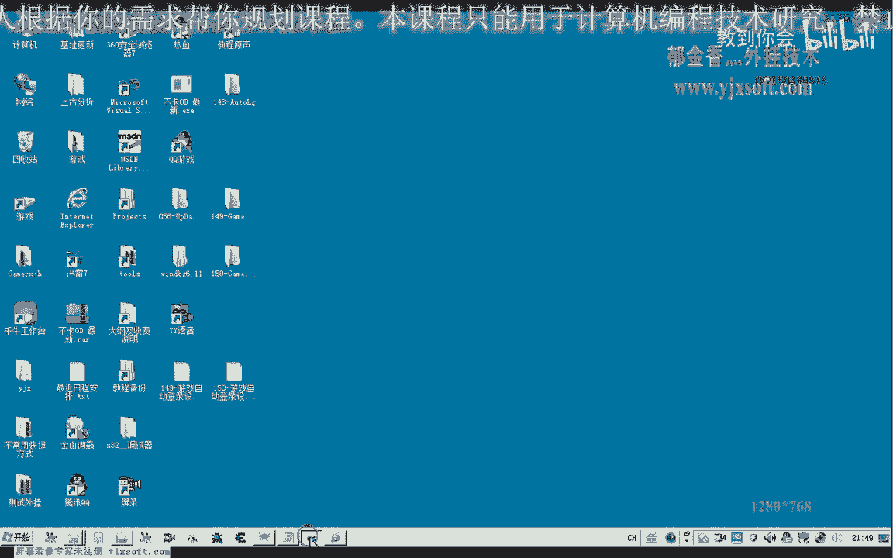
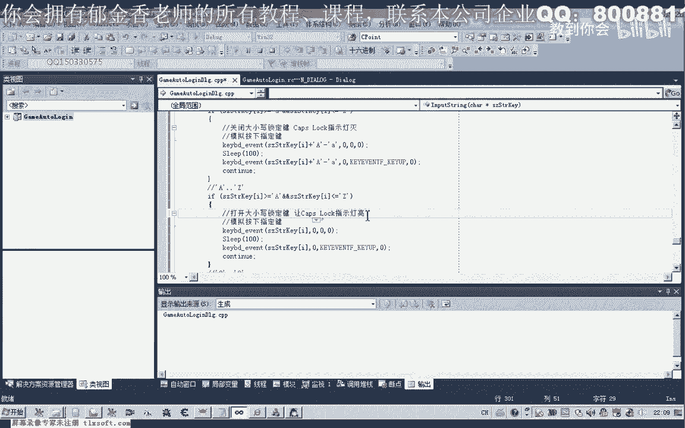

# P139：150-游戏自动登录设计-自动输入账号与密码 - 教到你会 - BV1DS4y1n7qF

大家好，我是郁金香老师，那么这节课呢我们一起来呃进行这个自动登录设计啊，输入账号与密码这一部分，那么自动输入账号和密码呢，一般我们都不是通过扩来实现的，因为如果我们通过q来实现的话，它的这个数据啊。

这些都是加密的啊，这个密码呢是不能够直接找到的，嗯那么所以说如果是早课的话，呃，它通用性不强，另外呢就是说呃它的分析呢比较复杂，那么所以说我们大部分游戏的自动登录的话。

都是通过呃我们键盘的一个模拟来输入我们的账号和密码，那么这节课呢我们主要是来讨论一下，怎么通过这个k b d r u n t r这个函数来模拟一个键盘，输入我们的一个账号和密码。

那么这个函数的话我们可以在百度上可以查一下呃。

它的一些相关的说明，那么也可以看一下msdn，那么这个呢它主要是用来活成一次啊这个旗舰的这个事件啊。

那那么它的第一个参数呢就是一个虚拟键嘛，啊也就是1~254之间啊，一共有二个这个键值，那么我们所要用到的这个账号和密码的话，一般是由字母语与这个数字啊组成的，那么我们今天的一个模拟呢。

也主要是针对一个呃数字和这个字母的一个组合组合，那么我们举个例子吧，呃我们先定义一个结构啊，这样方便呢存放我们账号密码以及分区的一些信息，还有角色的，那么我们举个例子，如果游戏账号。

是sn啊哈这个y j x p03 ，如果游戏密码是用今天说看，那么我们以这个为例子来说明一下怎么输入我们的账号和密码，好的我们继续打开我们149克的代码。

在159克的代码上呢，我们它的基础上呢，我们进行修改。

那么首先呢我们要设计一个函数用来输入我们的账号和密码，那么我们的账号和密码呢，在这里呢我们都是用一个字符串来表示的啊，都是一个字符串，那么所以说我们在设计函数的时候呢。

实际上也就是要把这个字符串呢呃输入到我们的这个游戏里边啊，进行一个按键的呃，一个操作，一个按键的一个模拟好的，那么在这里呢我们写出一个嗯写一个相应的函数，23322，那么在设计这个函数的时候呢。

肯定这里它传进来的呢，也就是我们要输入的一个字符串啊，那么这个字符串的话，我们最初呢要通过这个函数来模拟，但是我们这个函数的话呃，它一次来只能模拟一个啊某一个键的一个按下和抬起的一个操作。

那么我们需要用到一些案件的信息。

那么首先呢我们第一次按下的时候呢，呃需要传入的一个是他的一个虚拟键码，1~254之间，还有一个呢是我们要指定一个值啊，cup，那么cup呢表示是释放啊，如果没有指定这个值的话，表示是按下啊，看一下。

也就是说第二次的时候呢，我们需要了嗯，需要释放一下啊，它的格式的话，我们可以按照这种格式来写，这种格式，那么这里呢举了一个例子，我们可以参照这个格式来写，比如说按下的a键啊。

当然这个呢它实际上按下的话是一个小写的a键啊，这个时候大写的话，我们需要呢呃把大小写这个开关呢把它打开，这一点我们要区别的对待对待啊，如果是大写的，一个是除了按下我们的大小写键。

另外一个呢我们是配合这个上档键来使用，也就是需要一个组合键啊，这样的来使用。

好的，那么我们来看一下哈。

是不是，在这里呢首先呢我们要进行一个区分，看似数字键呢还是我们的嗯这个字母键做一个区分，那么我们首先来做一个判断啊，首先呢我们是一个小写的字母a到我们的zz。

那么另外一种情况呢是大写的a到我们的大写的z，因为这样的话它的模拟方式呢，呃如果它的范围不一样，我们模拟输入的方式呢也有一点小的一个区别，另外呢还有就是一个0~9的一个数字，0~9的一个数字。

那么这里呢我们可以进行一个判断，首先呢我们需要用一个循环来进行一个判断啊，啊，那么这个for循环的话，它的一个大小的话应当是要小于嗯，等于他的一个字符串的一个结束啊。

应该是应该是小于等于n t r n size，然后呢i加加，然后我们依次的在这里边呢来建立整个字符串，把字符串里面的每一个字符呢我们取出来进行判断啊，做一个衣服结构是啥子，这是t r k i。

那么这样就取出它的这个字符数组里面的某一个字符，那么我们对它进行一个判断，当它大于等于a那么并且，这个i呢在小于等于我们的小写的z啊，在这个范围之内大于等于，那么这个时候呢我们用一种输入的方式。

那么这个时候呢我们就需要把我们的大小写这个锁定键的关掉，啊这个时候呢我们需要关闭大小写锁定键，嗯，然后呢在模拟，按下锁定键，那么这个时候按下的话，我们就是这个size，这是tk my这个数字传进来。

那么自然也就是它的一个虚拟码啊，传进来的，那么后面呢我们这里呢这里呢表示的是按下按下，那么按下来之后呢，我们再等待一段时间啊，然后呢我们再释放掉相应的这个键值，然后这里呢它释放的时候呢。

还有一个这个cup释放，松开相应的这个键值，但是要注意一点，如果这个时候它传进来的本身就是一个小写字母，那么这个时候按键的话，它是不会有反应的，那么所以说在这里的话。

我们要把这个小写的还需要把它转换成大写，才是它真正的这个蓄力键嘛，啊需要有一个转换，那么这个我们可以通过大写的字母a减掉我们小写的字母a，它中间呢有一个差值，那么我们加上这个差值之后呢。

它就成了我们大写的这个字母的a啊，也就成了他相应的也就是字母a的一个虚拟键嘛，实际上它输入的大小写取决于我们的大小写，锁定键啊，也就是键盘上有一个，cs lock这个键，那么这个键打开之后呢。

相应的这个copy lock的这个指示灯呢，他会练，指示灯亮的话，我们输的就是大型啊，指示灯灭了，那我们就是输入小写啊，那么我们关于这个大小写锁定键的呃，它的一个这个开关呢，我们啊等一会儿再讨论啊。

那么我们先输入这种嗯小写的情况，那么如果他本来就是输入的字母是大写的话，那么就是另外一种情况在这里，那么如果这个大写它本来就是在a到大写的z之间的话，那么这里呢我们就不需要这个转换了啊。

就直接它的这个x码呢，也就是它的一个虚拟建模，直接这样我们就可以来模拟一次啊，这个键盘的按下和或抬起就完成了某一个键的嗯这个输入，那么当然还有另外的一种情况，也就是是字符啊，字符的这种情况。

那么是这种情况的话，它就是0~9，0~9，那么是0~9的话，我们直接呢就按下相应的这个0~9的这个数字键就可以了，它本身这个0~9呢就是它的这个虚拟建模啊，直接这样按下就可以了。

当然还有其他的这种情况啊，那么其他的这种情况的话，我们在在申请这个账号的时候呢，我们就呃申请的账号和密码呢就要求呃是这个字母或数字来组成的啊，其他的任务，所以说其他的情况呢我们暂时不考虑好。

那么这样的话我们就能够完成呢，呃到这里的话就是我们的这个for循环结束four，那么理论上的话，这样呢我们就能够完成呢，呃账号或者是密码的一个输入，好的，那么我们在自动登录里边呢。

我们加上我们相应的代码，那么这里呢是选择分区，那么选择分区之后呢，我们等待这个时候我们要等待进入游戏，那么这里呢我们尽量的把时间给它设置长一点，后面我们再来讨论一下怎么准确的判断这个时间。

那么这里呢我们把它设成八秒的这个时间，让他呃进入这个输入的界面，然后呢我们再输入我们的账号，pdt啊，那么这个账号呢我们说了，我们这里呢给他设计了一个结构，那么既然设计了这个结构的话。

我们在这个登录的时候呢，我们就传入这个结构，那么这里面呢就包含了我们的账号密码信息啊，然后我们在这里呢就输入嗯，我们的账号信息显示using name，那么输入完成之后呢，我们再按下tab键。

合法键盘切换到密码，密码可以解，然后呢我们再输入我们的密码，嗯嗯password，好那么tab键呢我们在这里呢我们可以直接用k或者用来实现，这里我们有它的vk嗯。

tab然后呢在这里呢我们后面传入零就可以了，然后呢我们再释放掉我们的tab键，好那么这里完成了之后呢，我们再按一下我们的回车键，那么回车键的话，这里呢我们也有它的这个相应的虚拟键盘的一个定义，这是碳。

啊这是按下我们的回车键，当然这之间呢我们可以用个sleep呢，最好是有一定的这个间隔好，那么我们编译生成一下，那么这个input的尺寸呢，我们把它前置声明一下，这样我们才能够在前面的函数这里的呃。

调用它，那么这里的话我们还需要定义一个结构，那么首先呢我们是游戏的分区，我们选c啊，这里嗯，然后呢是他的账号，然后是他的密码，嗯嗯嗯，还有我们选择的这个角色啊，这里呢我们也有设置。

默认呢我们选第一个角色，然后呢再传相应的数值进去，那么这里边呢我们选择选择分区这一行呢我们也可以进行一些改动，那么这里呢我们都从这个结构参数里边呢把它传送进来啊，这是相应的这个分区好再编译生成一下应。

好，好接下来我们进行测试，那么这个时候呢我们发现了它每一个字符呢都输入了两次啊，而且tab键呢也没有按下，那么我们来看一下是出现了什么样的这个问题。

那么说明我们这个input string这里应当是出了问题，那么这里代码呢我们还应当进行一些修改，那么这里呢我们一般加一个continue啊，让他继续进行下一次循环。

那么另外呢可能是我们这里的这个按键的这个处理啊，他up的时候呢可能呃被认为是再一次的按下了这个键啊，那么我们在这里面修改一下它的这个参数，这个参数好像是第三个这个位置，我们把它的这个位置来放错了，啊。

好的，那么我们再重新编译生成一下，这个呃还有一点tab键，关于table键和回车键，这里呢我们也需要进行一些修改，好再重新申请一下，哈哈，好那么这个时候呢我们看一下。

这个时候呢全部就是由我们的代码来完成的这个自动登录啊，那么下一节课呢我们再来呃实现这个选区啊，也就是进入到这个服务器啊，这里呢我们选区啊啸天或者是这个碧海这一类的选区啊，然后呢这里选线啊。

选择保存一个线，那么选项进去之后呢，我们还要需要来选择我们的角色啊，选择角色一，角色二或者最多呢，它可以有四个角色，那么角色选完了之后呢，这里呢还有个双击这个角色呢，呃进入江湖啊，可以双击这个角色。

或者是点下面的这个进入进入江湖都可以啊，那么还有这些我们需要通过嗯操作我们的鼠标模拟来完成，当然我们说的还有一点呢，我们需要完善的，也就是这个输入输入我们账号和密码的时候呢，我们要需要一个完善的地方。

也就是要关闭一个大小写锁定键，那么下面这里的话我们要输入大写的情况呢，应当是要打开，打开我们的大小写锁文件啊，那么关于这个大小写锁定键的这个控制呢，我们在下一节课呢嗯再来完成。

那么这节课呢我们暂时就到这里。

