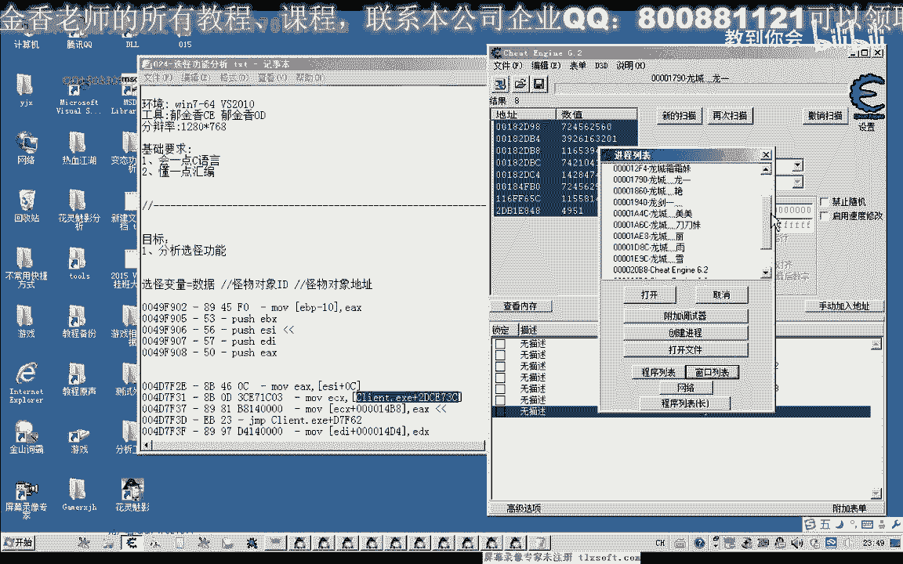
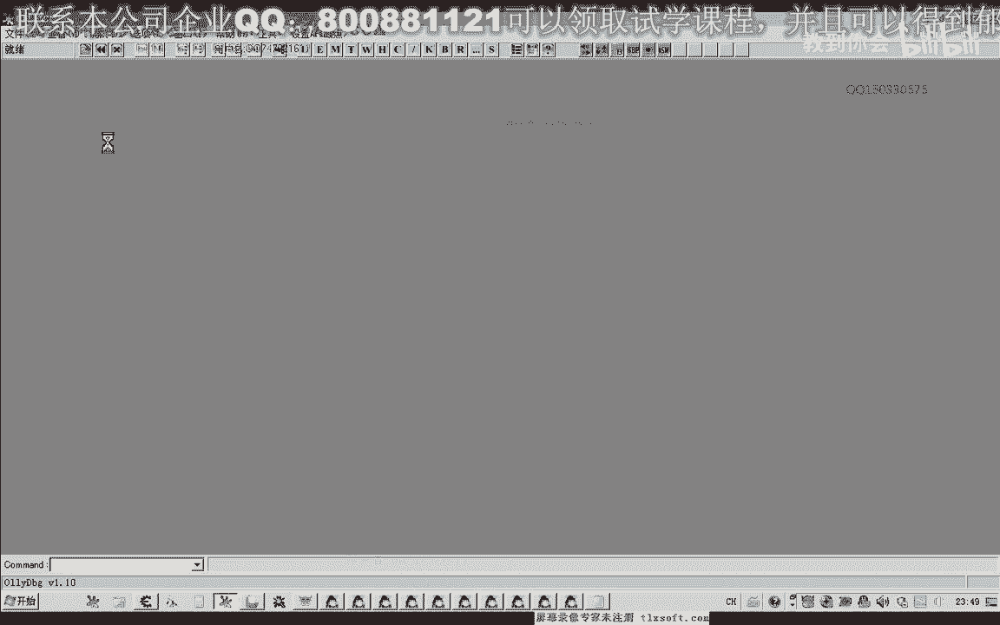
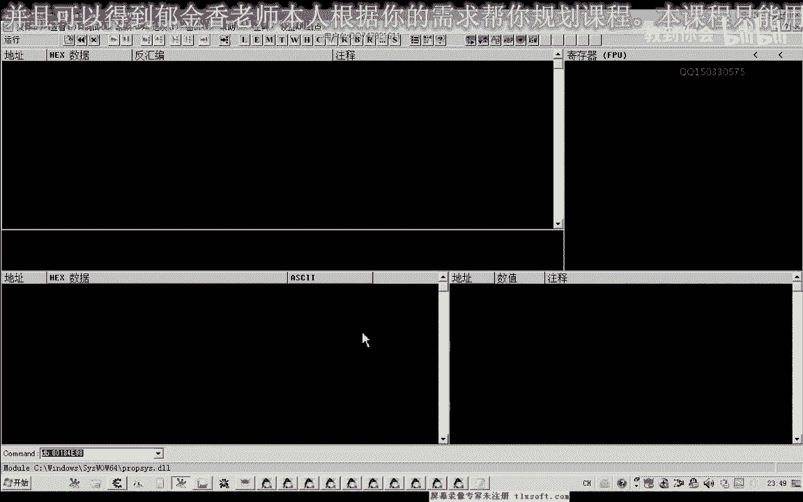
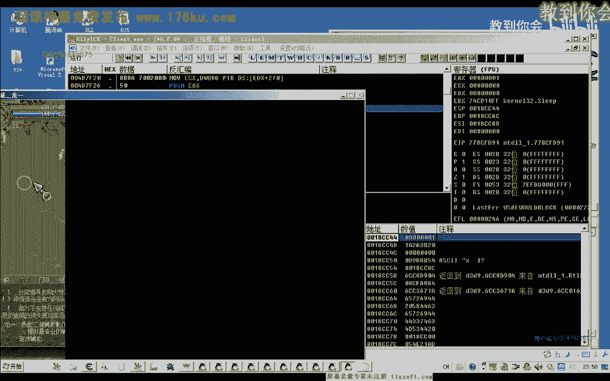
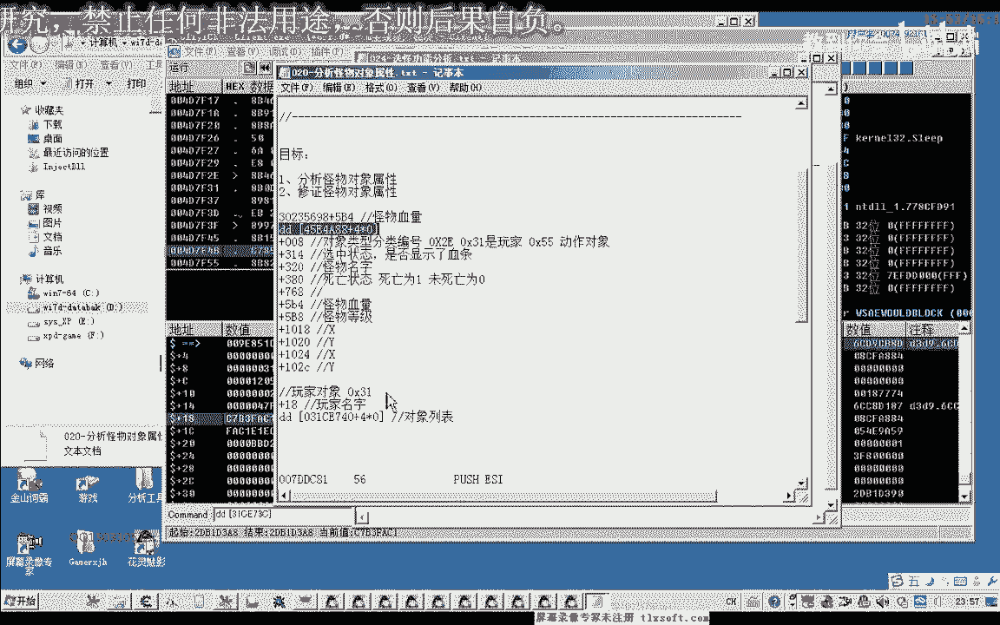
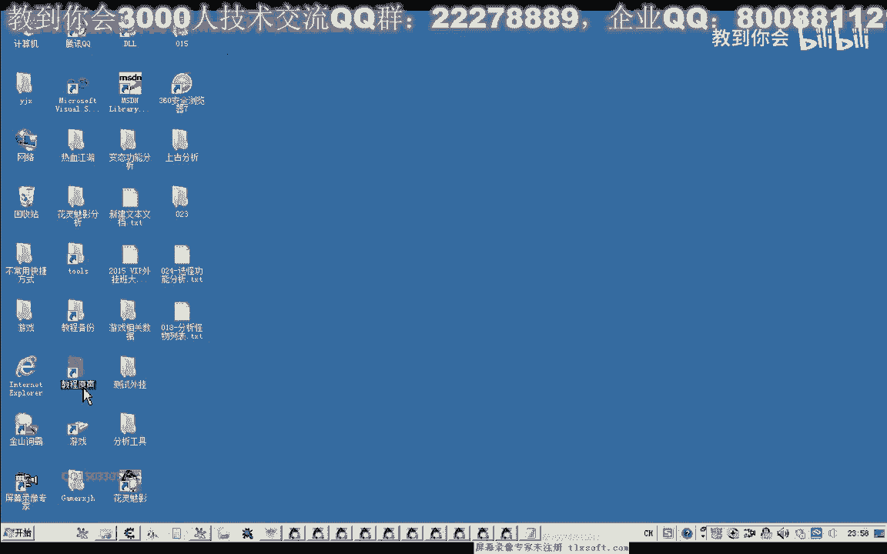
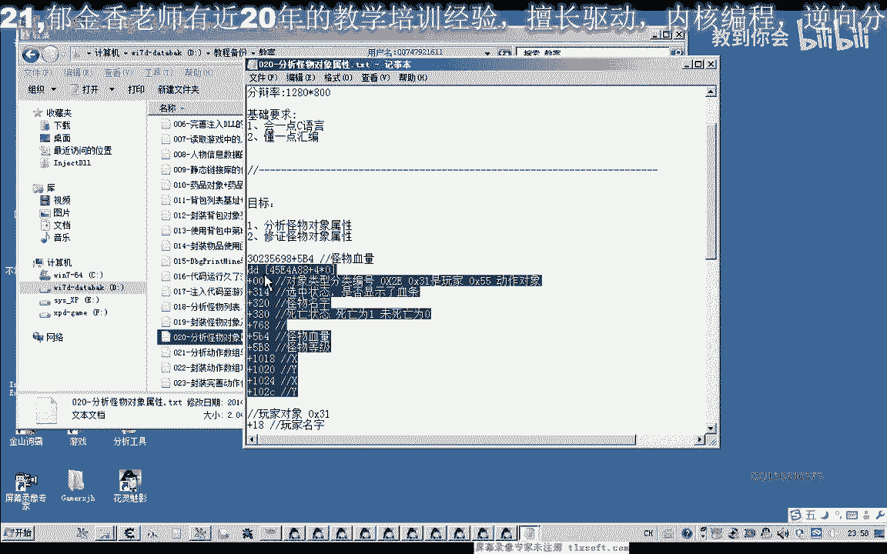
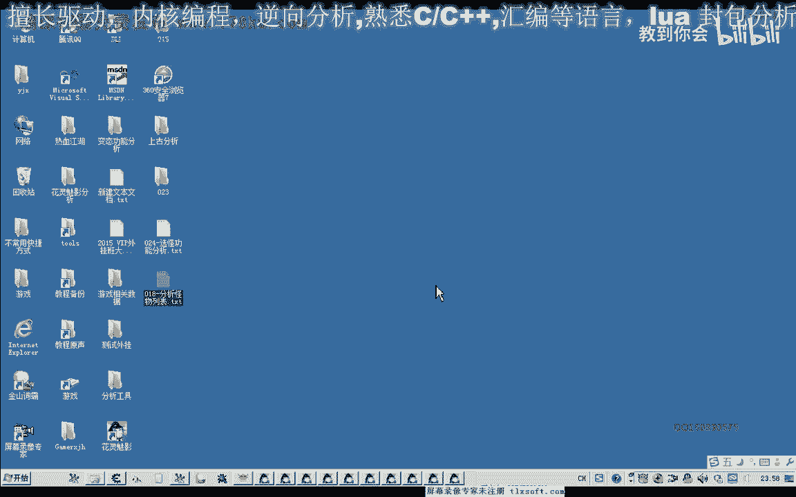

# P13：024-选怪功能分析 - 教到你会 - BV1DS4y1n7qF

大家好，我是郁金香老师，qq英文33057，那么今天呢这节课呢我们一起来分析一下呃，选怪的一个风筝，那么选会呢它有两种可能，一种呢就是往某一个选会的一个变量里面写入我们对象的一个地址。

那么另外一种可能呢就是写对象里面的某个属性，经济啊，对象属性里面的，比如说呃怪的一个怪对象的一个i t，或者一个能够表明他是个关于对象的一个标识，这样进去，那么这两种情况呢比较常见。

那么我们打开c来搜一下啊，它是哪一种情况，但是无论它是哪一种情况呢，只要我们在呃选怪的时候呢，或者是更换这个怪物的时候，更换选中怪物的时候，那么这个变量里面的数据呢，它可能就会被写入，就会变动。

那么我们就可以通过这一点来一项分析的，那么首先我们试一下未知的初始值，因为这个时候我们不知道它具体的数值是多少，那么收敛之后呢，那么我们没有去改变它的时候呢，它就是一个未变动的一个数值。

那么未变动的这个数值呢我们可以收多次，只要我们没有去更改这个选中的怪物呢，我们都可以收，但这种方式来说的比较慢，那么我们快一点的办法呢，我们就是更换一根，更改一下所选的这个怪物，选择一个怪物之后呢。

我们收入变动的数值，这样就会过滤到很多，哈好，那么我们再一次啊更改选中的怪物，再搜变动的数值，然后再次更改，不断的更改选中的怪物头，然后呢我们也可以选选中这个血条，这里变化只能是一次啊变动的数值。

但是这个未变动的数值呢，在我们没有更改选中怪物之前，我们可以做多次，那么在选中人的怪物选项变动的数值，然后再搜未转动的数值，然后再选中自己只有变动的数字，然后我们再选中怪物则变动的属性，在选中之前。

那么这一卷来选中自己，它也有可能是零嗯，当然这几个数据它都有可能是我们先把它添加进来，然后我们对第一个地址进行一个，找一下访问了这个地址的大夫，选中怪物，那么这个时候我们可以看到哪些代码。

它都是对这个堆栈进行操作的，堆栈进行操作，那么这种情况下的话，它可能性比较低啊，这种因为这个时候我们所写入的地址呢，它也是我们的usp和e p p，e s p呢是从182开始。

那么证明这些幺八日开始的机制了吗，5184开始的这个地址，他可能性这个相对要低一些，要听一些，但这个数值我们看到它也在不停的变化，所以说我们也要把它删除掉，因为这个时候我们根本就没有改变。

那么也就是说这两段地址可能性比较大，还，有一个也就是这个地址，我们共16进制，能看见1376，那么我们在选中一下，拜你把选中怪物来执行了一次的代码，在后面这样解决写入的人只只有这一个。

那么我们说的我们是要找像我们这个选位的变量写入的这个地址，那么所以说这个可能性呢比较大一些，比较大一些，你先把它复制出来，着重点分析这两个地址，先关掉，那么这个地址的话，ec x呢看来应用前面这个机子。

那么所以说它的地址也能够取到，那么接下来我们先把调试器切切掉，切割掉了，我们需要再次附加这个境界。

那就卸载卸载掉了调试器，然后我们接下来用og来分析它。

哈哈哈。

那么附加之后呢，我们先转到这个写入的地址，那么是不是这一句啊，关系到我们的选中会了，我们可以在这里跟他加上一个logo，可以去那，那么然后呢我们再到系列，那这个时候呢它也显示我们的血条。

那时候我们发现了显示血条呢，它就有一些几个怪的，都会显示一个血条，就会有一些错误的一些错误。

那么如果我们去攻击这个怪物能力，这个时候呢我们发现了攻击不了它了啊啊无论如何，你鼠标双击都攻击不能，那么说明的话，这一段代码的话，他可能就是我们的选中怪物的这个功能。

就是往这个变量里面写的一个东西就行了，那么这个呢是它的基础，那么是不是呢，我们可以做一些测试，加幺四平方，那么这个写入的这个值呢，现在是f f啊，也就是我们双字节的-1，那么这个时候呢未选中罐子的时候。

他5f r你把它背出一小，那么选中怪物，我们看它这个ex的来源是来源于ei，那么这个e si究竟是一个什么东西，我们在这里下一个段，那么在选怪的时候呢，它会断下来，我们来看一下a t e 12。

那么我们发现了ec这个偏移呢就是137608，这个偏移量是二一，那r e这个偏移的话我们很熟悉啊，为什么要说很熟悉呢，我们在之前分析的时候呢就遇到过哈，这个呢代表一个怪物的一个分类啊。

加八这个位置我在之前分析的时候，那么这个时候我们知道了啊，也就是说加在这个地方的，它有一个可能就是，我们对象的id往这个地方一写，就能够实现我们的血外功能就如此，那么我们也可以做一些测试。

现在这个怪物的功能我们看是多少，嗯，在1376，这个呢1357，那我们改成1376，看一眼会有什么效果，那么改了之后呢，我没有看到任何的效果，但是我们把ctrl f呢把这个动作显示出来。

去攻击它的时候呢，我们发现了会选中的人，有显示血条的那个呢不会被攻击，而这个呢我们改写的最后的这个怪物呢，它被攻击了，那么说明的话它这里呢它是通过我们怪物的加零碎这个标识了，去对它进行攻击。

那么我们是以后要选中怪物的时候，我们就可以，这样来选择第20课的时候，因为我们有分析才20克，18克，你看那么18课这里，然后我们就分析啊一些怪物的属性，看一下应该是20克，这个网站里面的，20克。

这里呢我们分析加八这个位置，它是一个对象类型的一个分类，编号二一呢是我们的怪物，三一呢是玩家，然后我们在前几课啊，前几天我们分析课是一个无，那么这个五五呢它是我们的动作对象，刚刚在分析的时候都发现了。

有一个无论是这个玩家对象也不在了，这个三要设计740，这里面，还有我们的这些动作的对象呢，那么他这个id的话，我想也有可能就是这个大的一个对象列表里的一个下标志啊，那这个我们留在后边来证实。

那么现在我们选怪的话，我们可以怎么办呢，你们就可以这样就先骗你这个怪物的数据，比如说这是零啊，那么要选中这个怪物的话，我们就是把幺二，零五这个数字给它改写出来，当距离远了之后呢，可能选不中啊。

我们看一下，在这里复制120进去看没有效果，然后再选我们的板块，这有什么东西啊，那么我们在这里呢，我们可以选一下攻击啊，可能是距离太远了，没有效，距离太远，超出一个工具范围。

但是所以说我们还要在选会的时候，我们应该加上一个距离的一个判断，距离过远之后呢，我们不能够去选择了啊，那么这个具体功能的一个测试呢，我们留到下一节课了再对它进行一个测试。

那么这个对象究竟是一个什么对象呢，他加幺四平八这个地方呢是我们的选中怪物，那么我们移到头部来看一下，那么这里呢我们发现它加八，这里的分数平衡呢是三幺，那为什么是问我一个玩家里面啊，写出了群众怪人。

那么这个玩家的话其实可能是我们自己，我们用dc来，显示一下，第四呢加幺八这个位置为就是我们自己的一个名字，自己的一个名字，那么说明我们这个对象的话，它就是一个玩家的一个对象，就是我们角色的一个对象。

这个机子里面存存方法，好了，那么今天我们所分析的呢，就是这一些这个地址栏是我们的玩家对象地址，那么加上幺四比八这个地方是我们的选中怪物，那么加上幺八这个位置是玩家的名字。

啊当时我们也分了加八这个位置的，加1+1发，这图在第20课的时候，我们就已经分析，当然当时有这个是玩家的一个对象啊，是其他的一个玩家，那没有想到的是我们自己角色的这个对象呢，它也是同样的一个要编号好的。

那么下一节课呢我们再对我们选中怪物呢的一些功能啊进行一个封装，当然还有一个显示血条的这个功能，那么显示血条的话，我们当时我们发现啊。

在前面我们就有分析了，在第，日式的课的时候，这里有个三要四，那么如果我们这里值一的话，那么这个怪物呢就会显示这个血条了，那么所以说我们选中怪物的时候的同时呢，我们也可以向怪物都像314这个地方写入一啊。

请勿进，好了，那么下一节课呢我们再对玄幻功能来进行一个封装啊，这节课对数据来进行一个分析，好的。

