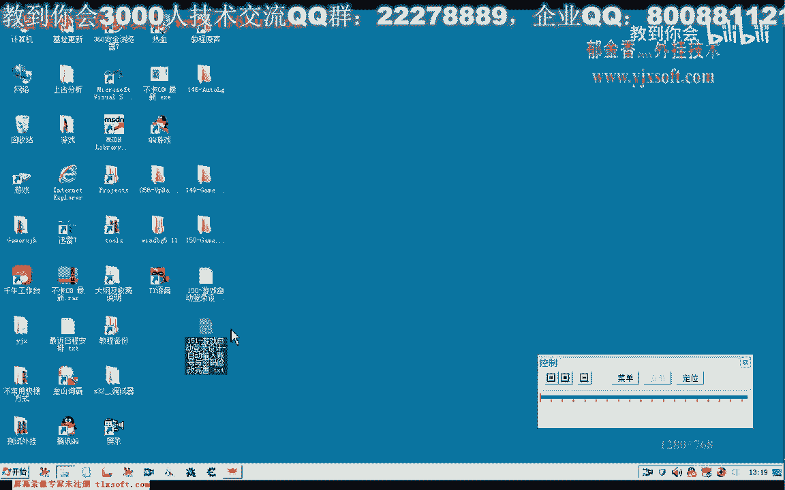
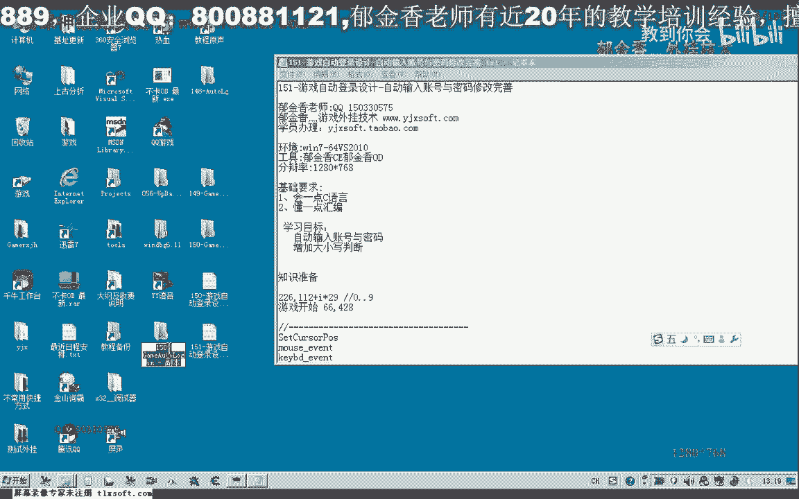
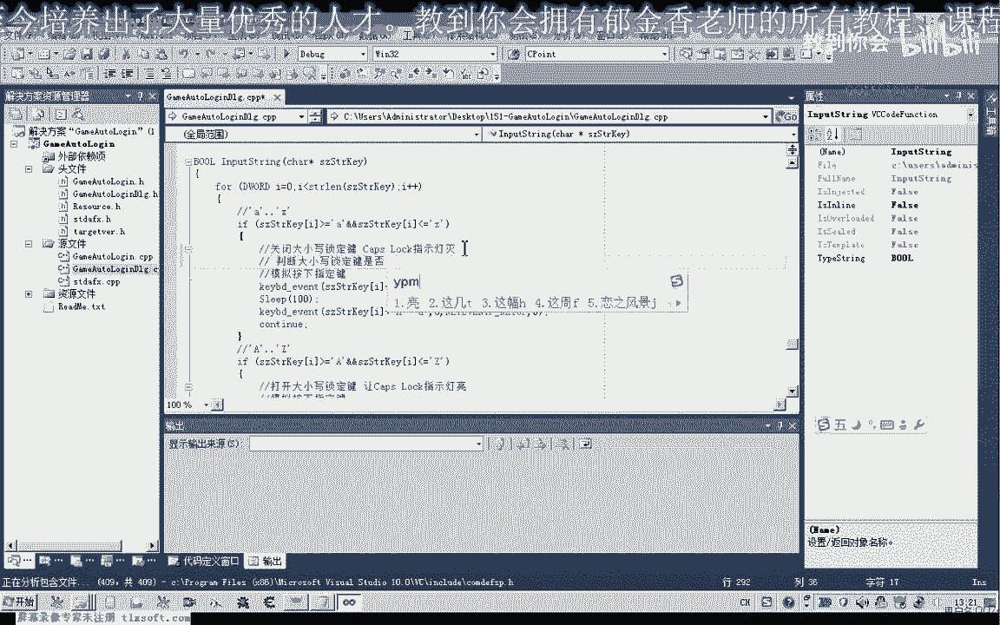
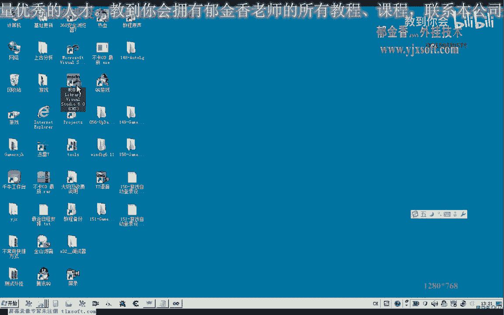
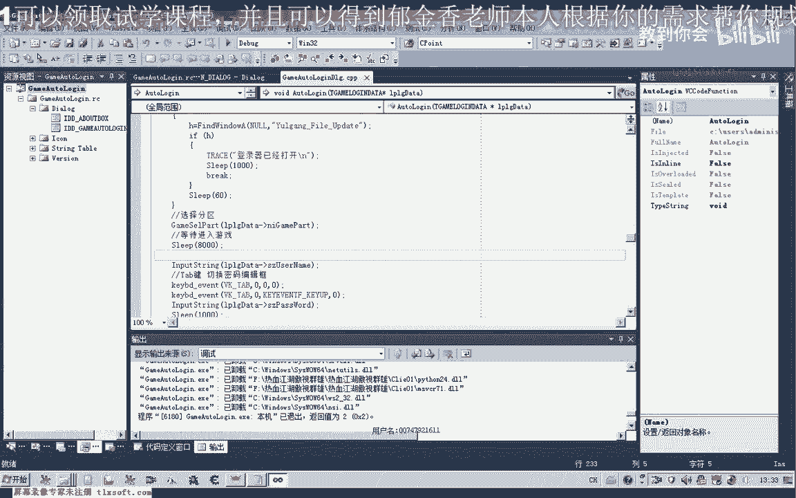
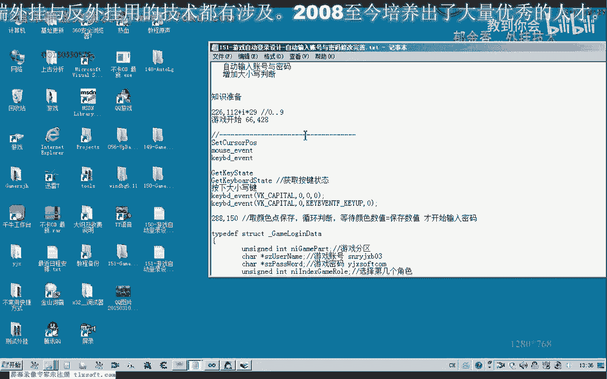
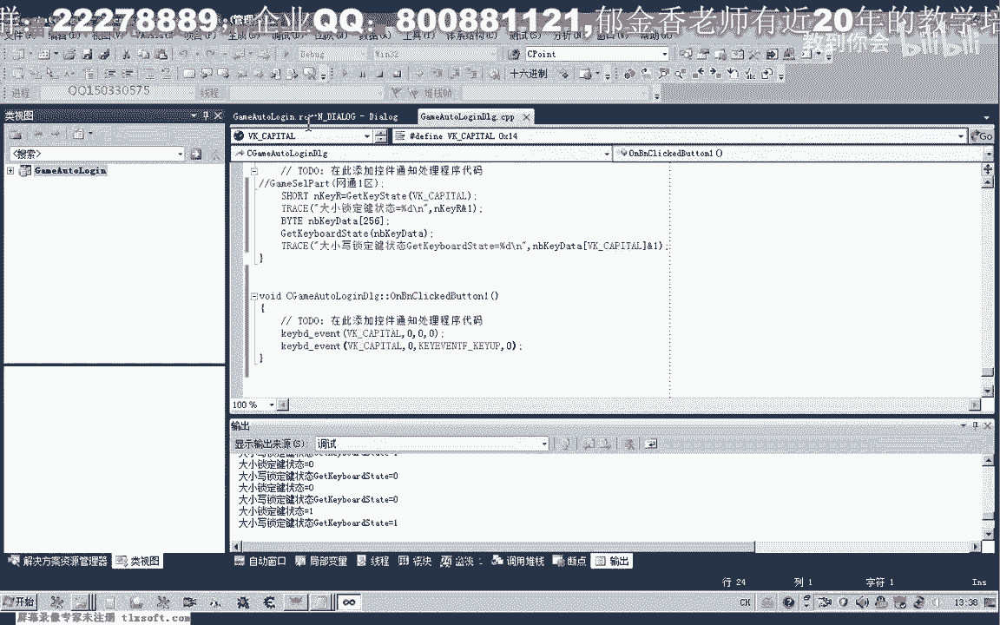

# 郁金香老师C／C++纯干货 - P140：151-游戏自动登录设计-自动输入账号与密码修改完善 - 教到你会 - BV1DS4y1n7qF

大家好。

我是郁金香老师，那么这节课呢我们来完善一下账号密码啊的这个自动输入的，这个函数的一个完善，首先呢我们先打开150克的代码。

那么我们在他的基础上来进行一些修改，嗯嗯，那么在这个地方我们对我们的这个字串来进行判断，如果它是小写的字母的话，那么这个时候呢我们键盘输入的话呃，实际上我们需要做一个判断，就是判断如果我们大写呃。

大小写锁定键嗯的这个灯它是亮着的，那么我们输入的这个时候就是大写啊，就容易出错，就会造成我们输入的账号和密码不对，那么所以说我们在这里呢需要加上一个判断，判断大小写锁定键是否就是这个灯是否亮啊。

那么这个判断呢我们可以调用一个相应的api函数。

来判断一个键的一个状态啊，实际上是一个k d，那么以通过这个键盘传入一个虚拟的键子啊，然后呢他返回的是一个呃shot类型的一个整数，然后我们判断它的低位是否为一啊。

那么如果他的高位为一来表示了这个键来按下，那么其他的情况呢表示这个价呢就是说已经释放掉了，那么它的第一位啊，它的这个低位的这个字节如果为一的话，呃那么呢我们就表示了这个价呢。

他已经就是说这个灯接下来它会开启啊的一个状态啊，表示，那么所以说我们要判断的是这个第一位的这个字节啊，嗯的这个数字是否为一，那么我们可以来先调用一下它，来看一下，那么我们在添加这段代码之前呢。

我们可以先测试一下这个状态，那么我们把这个注释掉，好那么这里呢我们就调用啊，我们刚才的这个函数，那么这里呢传入它的这个虚拟键值，大小写锁定键的，那么传入之后呢，我们再用twice打印出它的一个返回值。

哎，那么现在我键盘上的大小写锁定键呢，它的这个灯的话是灭掉的，那么我们看一下它的这个返回值的是零，然后呢我再把这个大小写锁定键呢，那按一下，那么打开我们的这个大写状态，然后我们再来测试了。

它的返回值呢是一啊，返回值是一，然后我们再关掉之后呢，它的返回值是零，但是我们要取它的返回值的话，实际上是要取它的低位，那么低位的话实际上呢这里呢我们要进行一个呃这个且运算啊。

那么我们在这里呢要把它与我们的这个一呢进行一个这个位运算啊，那么这样取出来的值呢才是正确的啊，理论上当然我们也可以从它的这个返回值来说呢，他本来也是返回的一，但是我们在写表达式的时候呃。

最后呢我们判断这个键盘的灯啊，就是大小写是否点亮的时候呢，我们是应该是用这个值啊，还表示大小写锁定键的状态，那么这是一种方式，好按下啊，这个灯开启的时候呢，这个时候v1 v一啊。

那么正确的表达式的写法的话，应该是这种啊写法，那么我们要取他的低位的一个状态啊，按照这里的一个说法啊，应该是高位啊，就是低位，这样来判断，好的，那么另外一种方法呢，我们除了这种方法之外呢。

我们还有另外一个键，它可以获得整个这个键盘的一个状态，还有一个k board study，那么这个呢是去的整个键盘256个呃，这个虚拟键的一个状态啊，0~255之间的所有这个序列。

那么这里呢它的这个参数的话是一个256啊，大体的一个数组，那么我们也可以用它来啊获得一个渐进的一个状态，那么在这里呢我们需要先定义一个数组by的微信，再把这个数组呢传送进他的地址啊，传进去。

然后它的一个返回值啊，这个时候呢就能够表示一个大小写的一个状态，好然后呢我们再以这个我们的虚拟键值呢为为它的这个下标再来取，再来就取它的这个低位啊，嗯我们再来看一下啊，相应的这个结果。

好那么这个时候呢当大小写锁定键这个键没有按下，也就是说它这个指示灯没有亮的时候呢，它返回的状态呢都是零，当按下之后呢，这两个状态呢都是一都是一，所以说通过这两种方式，实际上呢都能够判断某个键啊。

他是否能他的一个就是这个指示灯的一个状态啊，是否已经被按下了哈，那么具体的说明的话，实际上可以从这一句里面能够能够看出，他说那要比如这个大小写锁定键啊，它的这个开关被按下之后的话。

那么它的这个被关掉的时候呢，它的这个低位栏为零，如果这个键它被按下啊，呃好像它的这个定位呢呃就是一这个就就是一，那么大概是这个意思啊，我的英文也不是挺好，所以说我们在这里呢。

我们再回过头来就可以用这个绿色的这个代码来来判断，当然选用前一种方式呢，这个选择呢比较简单一些，那么我们在前面的定义一个相应的变量，然后在这里呢做一个判断，啊，那么如果这个大小写键它是呃。

就是说它的指示灯量是亮的啊，那么就会执行到这里，嗯，那么如果这个指示灯它的这个状态是开着的啊，这个指示灯，那么这个开关是开着的话，那么我们再次按下这个按键呢，关掉啊，相应的这个指示灯，打。

当然如果是另外的情况，那么我们就不用管它啊，然后再把这一段来复制一下，那么是大写的这个情况呢，我们也需要来做一个判断，但是他的情况呢相反啊，相反，那么如果这个词的没有打开的情况下，这里呢我们的相反。

如果他没有打开这个为零的时候呢，那么我们需要再次按下这个大消息锁定键，那么如果是其他的情况呢，啊我们就不用啊啊打开这个大小写中，这里是当时打开看大型大小写状态，大写状态啊，这里是关闭大写状态，好的。

那么这样的话我们理论上呢我们的这个呃相应的这个就完善了啊，输入密码，那么如果不加上这一句的话，那么可能呢我们输入的大写的话，他可能就是有目的啊，在我们的这个大小写按键呃，这个开关就是说呃他开着的情况下。

那么可能呢就会有布啊，那么现在的话他有了这个判断之后，来否认我们是按照大写还是小写的，他都能够正常的输入好的，那么我们再做一次相应的测试，那么刚才的测试呢，他就是说呃失败了。

因为是我们的这个等待的时间太短了啊，在输入账号之前，那么我们再把这个时间呢给它改长一点，那么最好呢我们在这里呢是另外的写一个函数，来判断它是否就是说正常的进进入这个登录的界面，那么我们很简单的啊。

可以做一些处理，比如说我们可以从窗口的这个登录界面，这个窗口的这个颜色来来进行一个判断，那么那个正常的进入这个窗口之后的话，这上面的这个点的颜色的话，它是不一样的，那么比如说我们取这这个点的这个颜色啊。

呃来进行一个判断就可以，那，么我们可以取一下它相应的这个坐标，或者我们可以抓一下这个窗口的图片，然后保存一下，看一下，看一下它相应的这个点的这个颜色。

那么比如说我们在289150这个地方的这个颜色啊，我们把它记录一下，当然这里呢它取不到他的颜色，我们可以把那个这个坐标呢嗯坐标点可以去下呃，取一下288152，那么这里的颜色的话。

它可能呢应该是这个黄色的啊，我们从这里能够看出来，288150啊，那么我们把这个坐标记一下，那么我们可以先取一下这个地方的颜色，取出来，那么下次我们就是说循环判断，那么等待这个颜色的数字。

啊等于我们保存的这个数字，那么呢我们才开始输入我们的电，那么这样来做的话，理论上来就不会出错了啊，这样就不会出错了，那么关于这段内容呢，我们就在下一节课呢我们继续来呃交流讨论一下。

那么这节课呢我们暂时呢呃就交流到这里。

嗯，那么一种方法的话，实际上就是让他等待足够长的这个时间，那么另外一种方法呢，也就是呃来判断它的这个游戏的窗口，这个界面的这个颜色它显示出来了，或者是判断一些机制也是可以的，但是判断颜色来说的话。

这个是最简单的，那么这一段呢也可以单独的测试一下，它是一个开启我们大小写这个锁定键的，我们可以在这里再添加一个按钮来测试一下，啊这是tab键盘嗯，当我们这里是，大小写锁定键能可以做一个判断。

那么我们现在呢这个灯它是灭着的啊，如果我们这个呢按下了这个大小写锁定键之后呢，我们再来开的时候呢，它的状态呢是唯一，同时呢这个键盘上的指示灯呢它会亮啊，再次按下它的时候呢，它为零。

同时呢这个键盘上的大小写此事件呢这个指示灯呢它会略掉了，好的，那么我们这节课就到这里。

