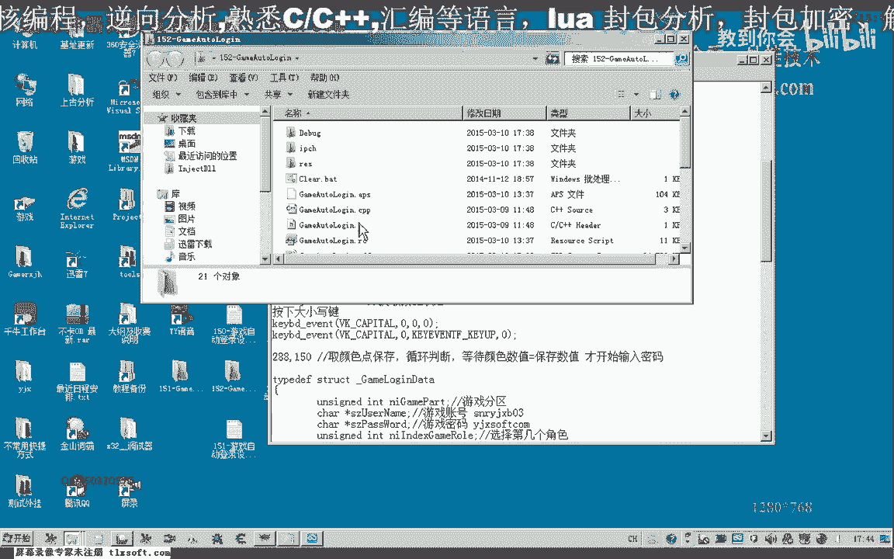
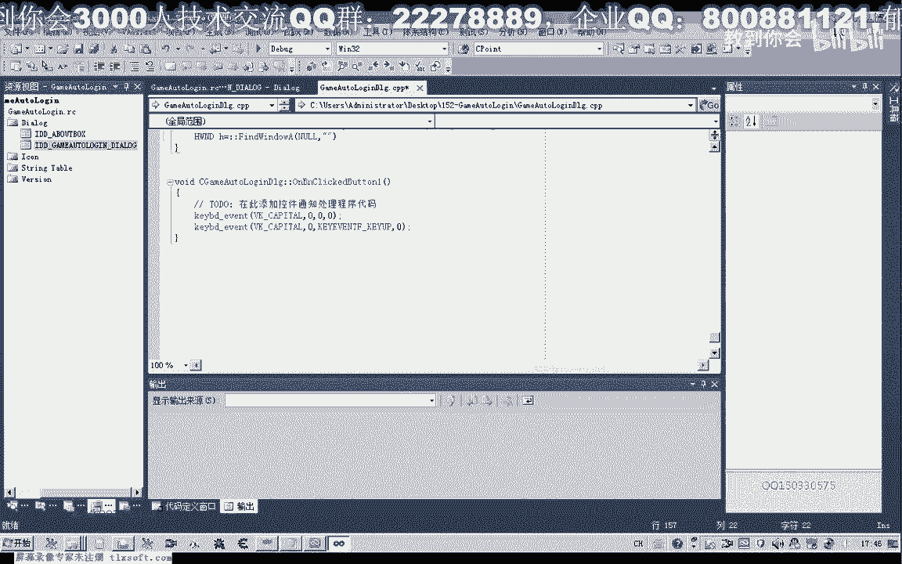
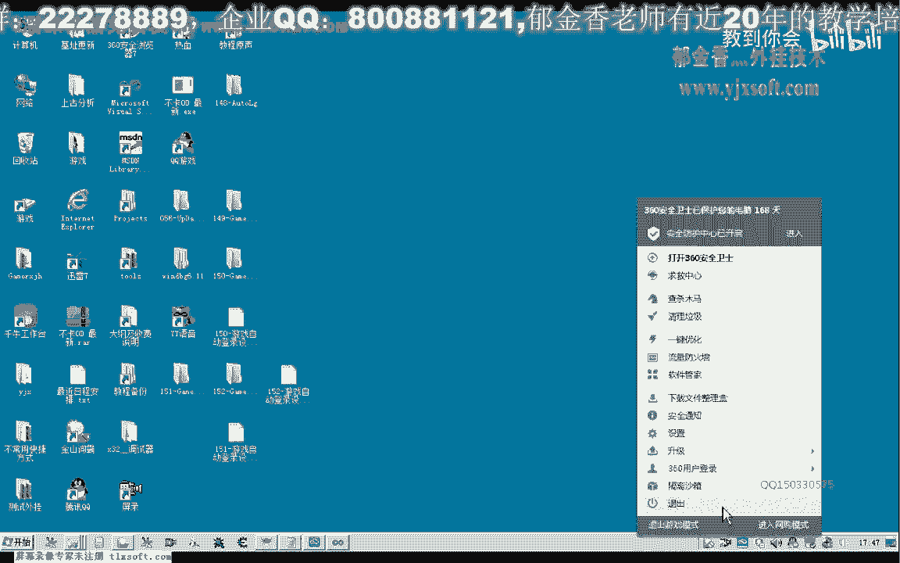
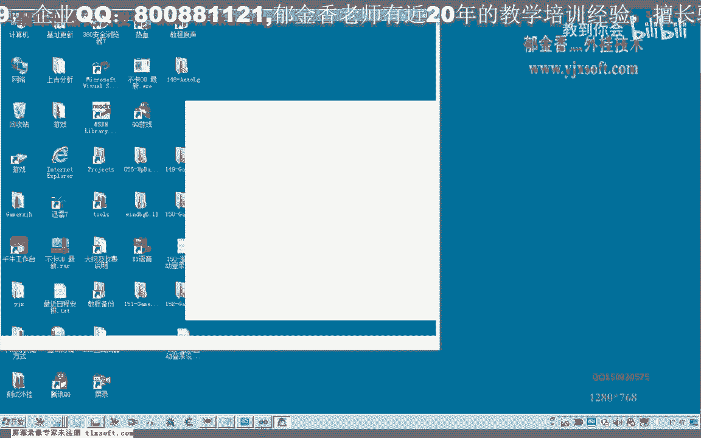
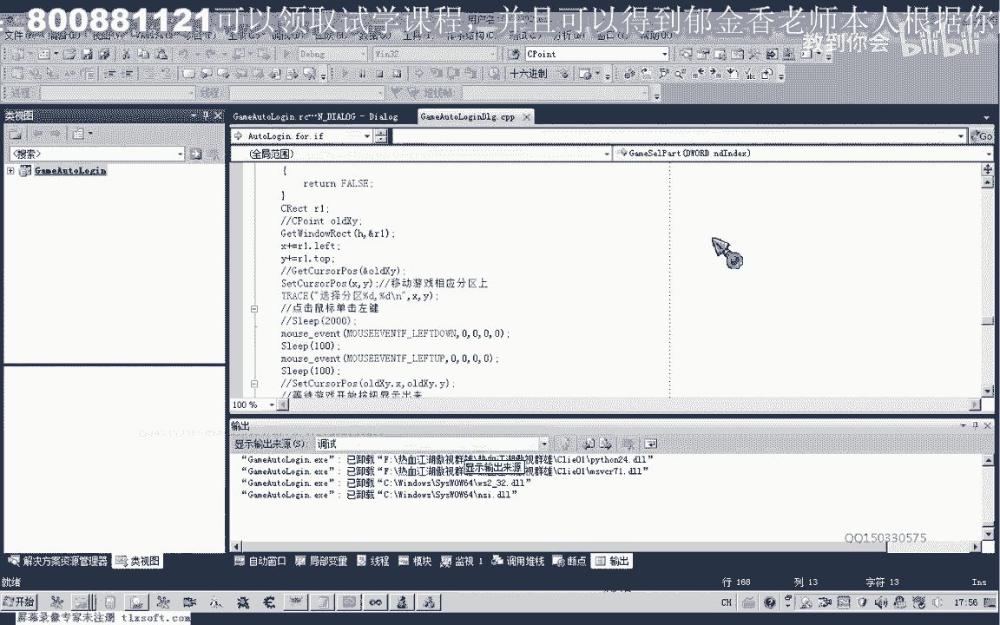
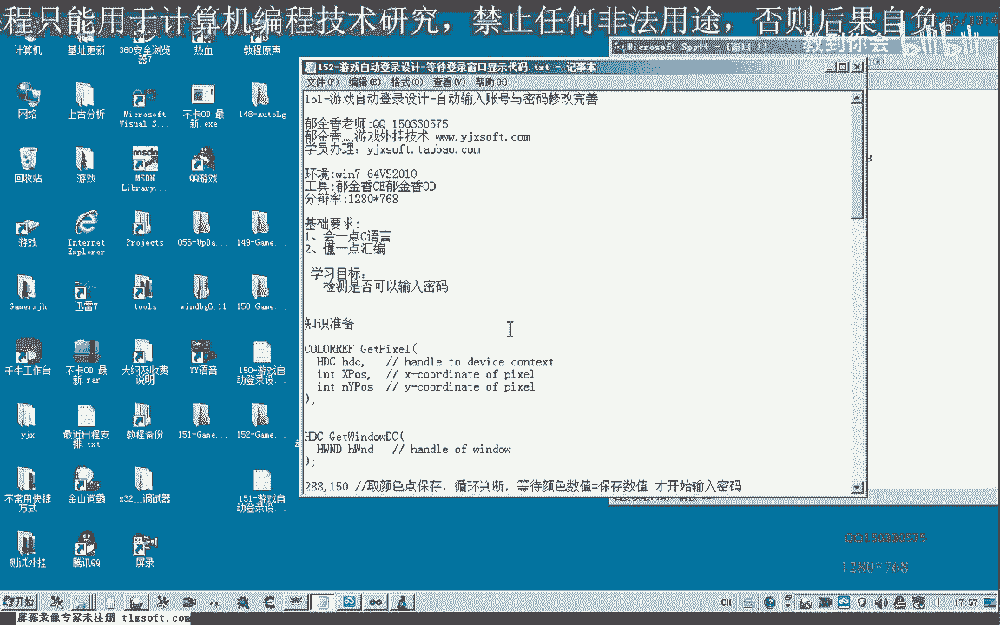

# P141：152-游戏自动登录设计-等待登录窗口显示代码 - 教到你会 - BV1DS4y1n7qF

大家好，我是郁金香老师，那么这节课呢我们主要探讨一下呃，就是等待的等待，我们登录界面显示这段时间啊，我们编写一段代码来等待他的这个界面窗口的显示出来，然后呢再去进行这个账号和密码的一个输入。

因为这个时间换的话，在不同的电脑上，它的时间由于我们电脑或系统配置不相同，它的时间呢呃肯定也不一样，那么在这里呢我们编写代码来来等待的话，它就能够呃修复这个问题，好的我们打开152号。

151克的代码，在它的基础上呢我们进行修改，那么我们找到输入密码的前篇，这里有一个选择我们的分区，然后呢是等待进入游戏，那么这个等待时间呢我们用一个代码啊来检测它，检测我们的这个是否正常的登录到了游戏。

是否可以输入了密码，那么这就是我们这一节课的内容，那么上一节课呢我们取了一个坐标啊，288150这个地方，那么我们先把它这个点的颜色呢呃取下来，那么另外呢我们添加一个测试按钮。

这里呢我们选这个颜色的这个数字，那么要取这个颜色的话，我们需要先取得这个窗口的设备啊，绘图的设备，那么首先呢我们需要取得他的那窗口句柄，你当成正常的，那么首先呢我们先取得一下它的这个窗口标题。

打开我们的工具派。

加强，把窗口的标题哈复制下来，二，那么找到啊，如果没有找到窗口的话，那么我们这里给出一段调试信息啊，就是说这个窗口呢呃客户端会打开，然后从这里呢我们返回就可以了，那么如果我们的客户端正常的打开了啊。

然后呢我们取得他的这个设备啊，绘图的这个设备，那么注意这里我们是它的这个绿的里边它有它的一个成员函数，我们要加一个作用呃，前面要加一个啊作用域的啊，限定，然后取得了这个设备之后呢，我们用这个标题啊。

嗯这个p i x e l的话，这个函数，那么用它呢第一个参数是传入我们的这个窗口的设备啊，然后呢我们就是这里取得的两个坐标x轴y啊，ktpx，2881把它的这个颜色值呢呃取出来，好我们先编译生成一下。

知道，然后我们把这个点的颜色呢打印出来，当然也可以显示在我们的呃这个窗口上边，那么我们测试看一下，这个时候他报的是客户端为正常的进入，啊我们这里能当当它等于空的时候呢，我们才报这个信息。

这个时候的窗口呢不能够被遮挡，被遮挡的话，它就不能够啊出现正确的数字，这个时候是它的这个颜色的数值，那么我们把这个颜色点到这个数字呢，那可以取出来，然后呢我们就可以它作为一个判断。

当然我们还可以加上一些窗口前置的一些呃代码，或者是我们就是说呃后台选颜色的一些代码配合使用好，那么这个颜色取出来了之后，我们接下来呢就可以完善啊，之前的这个代码。

那么这里的等待呢我们就可以设置为一个for循环，然后这个循环呢我们这边呢也用一个sleep啊，但是呢这里呢我们呃每次呢只是等待50ms的时间，然后呢我们就做这个相应的检测。

就检测这个坐标点它的颜色呢是否等于这个颜色，那么如果等于这个颜色的话，我们呢就表示了正常的进入了这个客户端，我们再把下边的这一段代码复制一下，这个sleep sleep了，可以放在后边啊。

然后这里呢我们，对这个颜色来做一个判断，那么如果这个颜色取出来的数值啊，等于这个数值，那么说明呢已经进到了客户端，我们这里呢就blg退出我们的这个循环，然后呢就进行了我们键盘的一个输入就可以了。

那么这里这个return应该要去掉啊，因为我们需要等待一段时间呢，它的这个窗口了才会显示出来，如果直接从这里返回的话，后面的所有代码呢呃就不能够被执行，这里呢写成continue啊，继续啊。

我们的下一次循环，好那么我们再次测试一下，嗯那么下面呢会不断地显示啊这个它的这个颜色的数值，那么一直呢等到这个颜色的数值呢，等于我们所取得的这个数字呢，它才输入账号，那么之前的这个颜色的话。

他都不会啊去输入我们的账号，那么关于这几个呃，这个我们颜色的获取方取点取色的这个相关的教程的话，可以回顾一下这个c加加的这个教程里面啊，相关的章节嗯好的，那么这节课呢我们就到这里啊。

呃下一节课呢我们再继续，当然其他的我们比如说我们之前的一个初始化。

嗯，在我们这个分区选择之后，这里它会显示一个开始的按钮，那么这里的话它也可以用这种颜色来来判断进行一个等待啊，当然这个例子呢我就不一一写了，大家下去之后呢，可以帮他呃进行逐步的完成嗯。

那么下一节课呢我们再进行后面的这个选项啊，以及我们的人物角色的这个选择啊，的相关代码的这个设计好的。

