# 郁金香老师C／C++纯干货 - P143：154-游戏自动登录设计-等待与出错处理 - 教到你会 - BV1DS4y1n7qF

大家好，我是郁金香老师傅，那么这节课呢我们继续呃进行自动登录的设计。

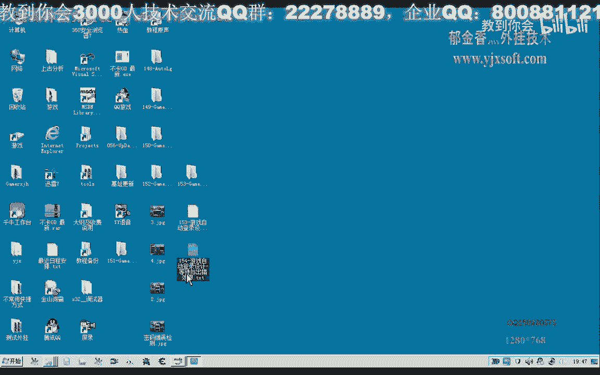

那么主要我们是这节课的目标呢，是等待与出错的这方面的一些处理和完善，那么首先我们打开153课的代码，那么我们移动到登录函数这里，那么首先呢我们在这里呢给他来一个返回值，那么如果是执行完的话。

在这里来返回一个增值，那么容易出错的就是在分区之后，我们输入的这个账号，这里呢可能这个密码呢可能会出错，那么我们看一下，那么在这里呢我们是输入密码前，我们在判断，那么这个密码是否可以输入。

那么如果我们输入的这个密码正确的话，那么288150这个点的这个颜色的话应该会变化，因为它画面切换了，那么所以说呢呃会变化，那么在这里的话，我们啊输入了账号与我们的这个密码之后呢。

在这个等待这个位置的话，呃我们可以加一个判断，那么我们再把在前面的这段代码复制下来啊，就可以，那么这段代码呢也可以再进行一下修改，那么如果我们就是说呃这个窗口它会一直寻找这个窗口。

那么如果这个窗口一直没有打开，那么并且呢这个循环的次数也快达到啊，1000次之后，这里的话呃我们可以呢就判定这个客户端呢没有打开，那么就可以直接返回，不用进行后面的操作。

那么这里呢我们还可以加上一个条件，那么这个条件呢就是这个i的值当它大于等于999之后啊，那么我们给它一个条件，那么这个循环呢我们还可以稍微设置设置大一点，就可不是设置为2000。

那么在这里的话大于等于1000，那么我们就跟他呃做一个结论哈，下一个结论就是说我们客户端打开失败，那么在这里呢直接return，当然这个因为是我们自动登录失败了啊，这个时候呢我们返回一个价值。

那么这是我们撼动我们的分区之后，游戏开始是否正确正常的呃登录了我们的这个游戏客户端，那么这个1000呢就相当于呃是因为下面这里有个实力谱五零，那么就相当于的话在这里等待了50秒的时间啊。

50秒的一个超时啊检测，那么如果是超过了50秒都还没有检测到我们的这个客户端存在的话，那么在这里呢就直接判断我们打开了啊这个登录器啊，客户端啊失败啊，还有这个客户端就判断我们的自动登录失败啊。

那么这段代码的话，我们可以把它复制一下，还可以用在后边就是输入账号完成之后，那么在这里呢检测我们的这个密码是否了输入正确，那么在这里的话，我们就因为前面都都已经执行了。

那么说明的话这个窗口肯定是已经找到的，那么这一段呢我们可以把它省略掉，那么在前面的这一段呢，我们可以直接的把这个定义成一个全局的一个变量，把它定义到我们的头部，啊这里已经有一个全局的这个句柄可以使用。

那么另外呢还有我们的一个这个htc，那么在这里呢我们也把它移到头部这个客户端的htc，好那么我们再来看一下，那么后面这一类的变量呢，我们就可以呃就可以直接的使用啊。

因为前面我们已经打开了这个相应的呃设备，那么在这里呢我们可以直接的呃获取它猛一点的这个颜色，当然在这里的一个判断的话，因为是引擎，我们密码引擎进行输入了，那么输入如果是正常的情况下的话。

这个画面肯定它是电的啊，应该是零点几秒的时间呢，呃它这个画面呢就会发生这个改变，那么所以说在这里的话，我们呢嗯或者是这个sleep呢，我们都可以把它去掉，也可以啊，或者把它设设置小一点，应该也是可以的。

那么在这里的话，我们就要检测它的这个画面，如果这个画面呢一直等于我们的，还是等于我们这个颜色点的话，那么说明的话我们的密码的话应该是输入错了，那么一种呢反正是没有正常登录的情况下，可能是重复登录了。

或者是账号密码不对，或者是相应的这个账号呢没有激活造成了啊，登陆失败啊，那么这里的话我们就直接return啊，就是bk了，直接return fans，那么这里的话甚至都不需要这个循环来进行一个检测。

那么如果是加了这个循环的话，我们也可以给它加上一个延迟，再多加一个条件的一个判断呃，多加一个这个变量i的一个判断，它的次数大于等于10，那么大概的话或者大于等于20，的一个延迟的一个判断。

那么如果是另外一种情况，另外一种情况的话，也就是说它的这个颜色不相等，那么在颜色不相等的时候呢，我们再break，退出这个循环，那么如果是相等的情况下呢，那么我们在这里呢，嗯sleep。

那么这里的话50x20，大概也是一秒冲到4000啊，不断的检测，那么实际上之前的这个判断呢，都是可以的，那么在这里为了有的电脑反应慢的话，我们可以来把这个数值来设置大一点，这里呢我们应该是检测。

检测我们的账号密码是否输入正确，那么如果这里的颜色啊，它产生了这个变化，那么你就判断嗯账号对面正确，继续下一步操作，好那么这是我们的账号和密码的一个输入，那么还有我们后边哈。

这里呢上一节课我们呃忘了加上这个括号啊，这里呢我们给它加上，这是在后面的时候我发现了，所以说当时没有跟成这个错误啊，这里如果是不加括号的话，它相当于是简单一减的是一啊，那么如果我们是要减的是啊。

在这里的话应该是要减掉21个啊，这个像素的这个距离才是正确的，所以说我们在后面的这个选项的话，应当要用括号把它括起来啊，同样的这里也需要用括号括起来，那么呃游戏呃我们点了之后，人物角色也选了之后呢。

那么在这个位置的话，我们需要了嗯进行一个判断，判断我们这个游戏啊正常登录之后呢，我们才可以啊，比如说游戏正常进入啊，比如说我们可以开始挂机啊，比如说挂机打怪啊这一类的。

可以启用其他的这个动作或者是脚本这一类的，那么所以说这里呢我们也需要一个检测，那么这里的这个检测的话，我用的是这个人物机制来完成的，啊用了这段代码，那么这里呢已经完成了之后的话。

我们可以来啊关掉相应的这个距离，那么之前的这段代码我们来看一下它的一个逻辑，那么这一段呢我们都是用来等待我们的这个人物角色正常的进入了，当然这段呢我们在之前他已经有找这个窗口句柄，这段我们可以取消掉啊。

那么我们在这里呢直接获取它的一个进程句柄，那么我们在这里呢是通过人物角色的一个机制来进行一个判断的，因为经过测试的话，我们发现啊这个人物角色的这个机制呃，那么如果在未进入我们的游戏画面之前呢。

它是为它是一个空子层啊，是一个空值值里面的数据来为零，那么如果正常的进入游戏之后呢，它就是我们角色的对象，地址，那么这个对象地址加八呢，这里就是我们人物角色的名字。

那么所以说我们可以先打开这个进程的句柄啊，具有一个读写权限的，那么执行到这里之后呢，我们也可以把它的标题了，就设置我为我们人物角色的名字，那么或者是呃如果是要设置为人物角色的名字呢。

我们需要在这后边来添加完成，那么在这里呢我们是把它设置为我们的登录账号的这个名字，然后我们在这里呢也是用一个循环来判断啊，每个60ms的时间让我们去读一次呢这个人物角色的这个机制。

当然这里呢我们需要先更新一下机制，那么更新之后呢，我们最好是把我们的这个嗯相应的这个单元哈。

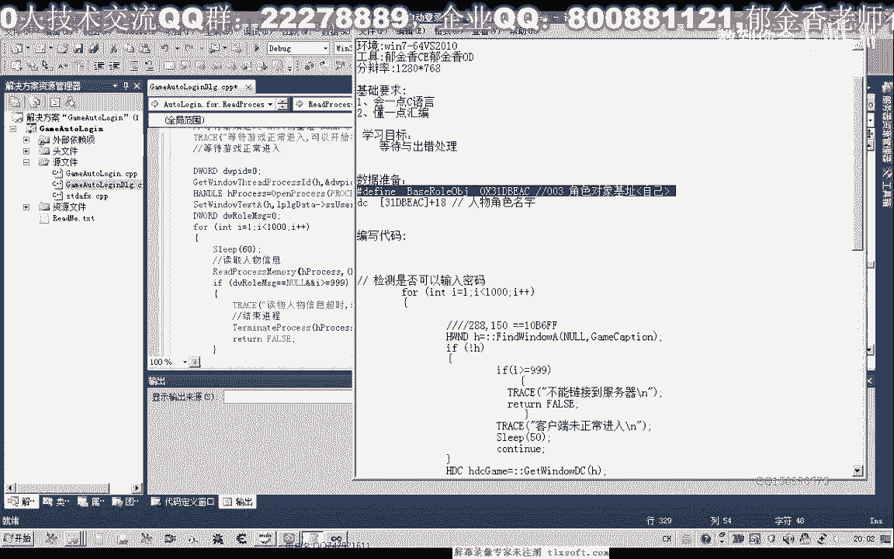

那么我们就只需要一个头文件，把这里生成的这个bs根啊。

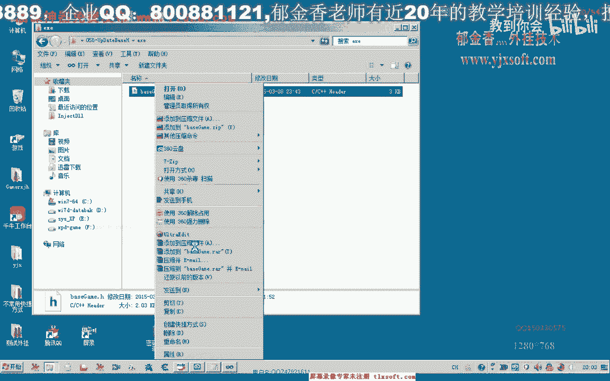

这个bg，它就能够认识啊这个相应的机制，那么这呃这个时候呢我们就读出这个机子里面的数据，然后呢保存在这个人物角色的相关信息里面，那么如果我们读取出来的这个数字呢一直为零啊。

那么并且这个i的数值这个是用来计算超时的，那么如果大于等于1000的时候呢，这个是呃随意我们后面的这个岩石延迟哈，那么也就是60秒的时间，一分钟的时间，如果都还没有进入游戏的话。

那么我们就结束了呃这个客户端的这个进程，然后呢就退出啊，也就打印一段调试信息，说这个登录失败，那么如果是另外的一种情况啊，如果他读出来的这个信息大于零，说明我们的这个人物角色的这个指针它读取成功了啊。

那么这里我们可以输出一段调试信息，正确读取屏幕信息，那么这里我们就说明了我们的游戏引擎正常的进入，那么后边的话我们就可以来进行其他的一些操作，比如说在这后边我们嗯开启，外挂啊，挂机打怪。

或者是执行我们的挂机任务啊，这类的就可以做一些其他的一个动作啊，大致就是这样一个流程，好的，我们先生成一下，看代码有没有错误，然后我们先测试一下，看能不能够正常的登录。

那么这个时候我们看一下它的标题名呢已经设置好了啊，但是我们这里我们看一下它的一个输出的一个调试信息，来看一下，那么呢我们大概是执行在这个位置，说明还没有真正的登录，那么这个时候登录真正的登录之后呢。

他就说啊正确的读取了这个人物的信息啊，牛批已经正常登登录啊，以及呢正常的进入游戏，那么这个时候我们也可以来看一下，这个客户端把我们的这个机子加进来看一下。

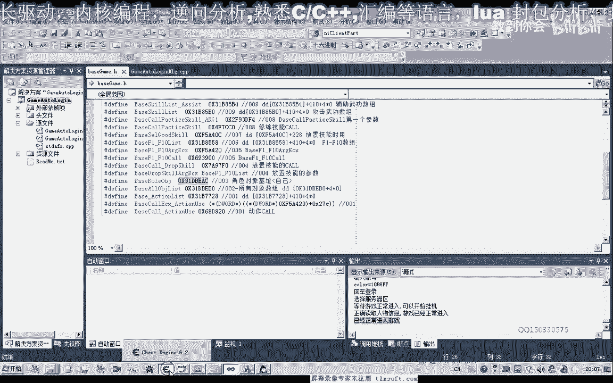

那么现在的话它里面肯定是放存放到我们对象角色的这个指针，不是这个指针，他的加幺八，这个位置就是我们的人物角色名，就是我们的人物角色名，那么如果我们重新再进一次看一下，那么这个时候我们附加进我们的客户端。

那么它的这个机子的话是零的，而在这里面的这个数据呢，所有数据我们看它都是不能够正常读出的。

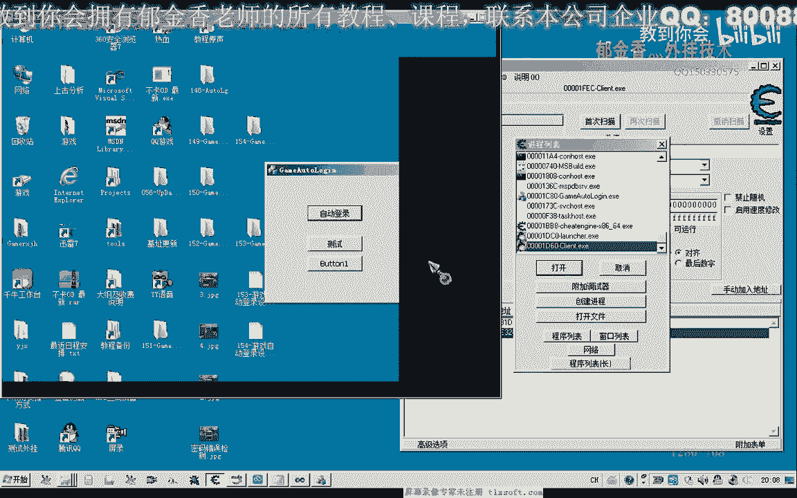

握手变大，输入一下，那么这个时候的话我们看一下呃，到了这个界面的话，实际上它的这个尺子呢呃都是为零，或或者是呢不能够读出啊，那么直到了我们这个画面啊，还没有正常的进入游戏之前呢。

这里的这个数字呢它都是文明。

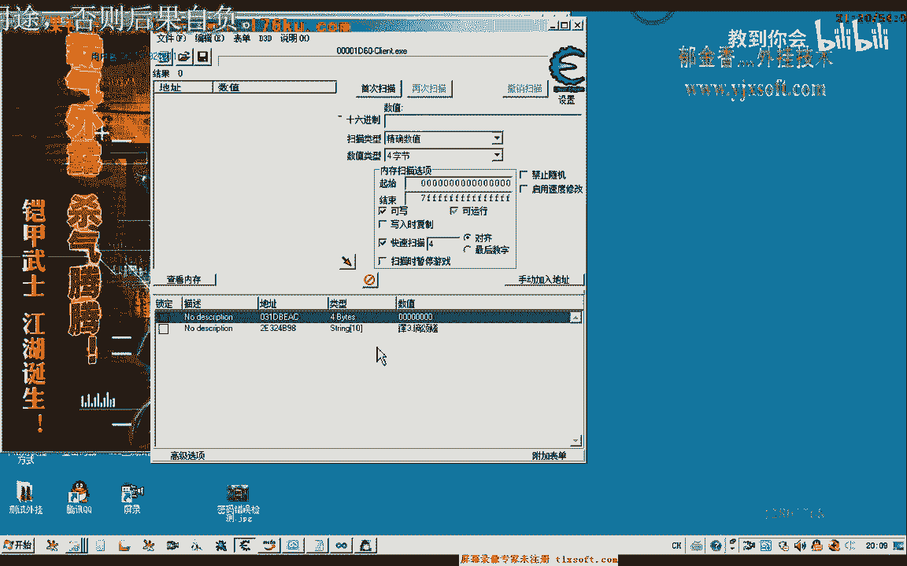

那么一直到我们的这个游戏了，正常读出来，这个纸质呢才被初始化，那么这里呢我们也是对这个数值来进行初始化的，那么即使他读不出正确的信息呢，它的这个数值呢都是为零的啊，所以说他能够正常的判断。

那么如果这里呢它读取这个信息失败，最终呢他就会呃结束掉这个进程，那么我们再换一下，在这个登录信息里面，那么如果我们账号和密码输入错了的时候呢，我们嗯也结束一下相应的这个进程，我们把这个代码再改一下。

那么把这段代码呢我们再进行一下修改，把这个数据呢也前置一下进程具备的这种，那么这一段呢我们也把它前置，那这个的话我们暂时在在在这个地方定义，就是就考一考，也应该是考虑的，还是把它前置一下，复制。

我们看一下我们输入密码，这里，那么如果这里我们输入的账号或者密码错了的话，那么我们就，3030我们看大概是1。5秒的时间进行了一个判断，那么我们就把这个进程把它结束掉。

那么这一段呢我们可以把它放在这个外边检测账号密码，这，好那么我们再次编译生成一下，然后切换到我们的资源视图，那么我们可以把这个账号或者是密码啊，故意的啊把它输错，那么我们看一下它能否检测到。

那么这个时候我们等待一段时间，看它的检测的这个结果，那么这个时候的话我们发现了他没有呃正常的结束它呃，而是来继续的在执行后面的这个代码，那么说明我们的这个代码的这个检测的话应当是有问题。

啊可能是那这里还有一个这个客户端呢，他应该是找到另外一个客户端那里去了，那么我们把它关掉之后再来进行测试，那么这里的检测啊应当是错的，那么我们再来看一下它的一个输出，账号密码输入正确，继续下一步操作。

幺零比f1 f，那么这个条件呢我们加错了，那么应当是加在这里边才正确，那么应该这样写才可以啊，不然的话当这个i呢它等于30的时候，那么也会转到这里来啊，而且当这个颜色呢它等于这个值的时候。

但是呢i的值然它不符合条件的时候，也会转到这里，所以说我们在这里呢得另外的写一行啊，大于等于30的时候，这样呢进行一个判断，那么这个是账号密码输入了之后呢，他没有按下这个回车键。

那么我们再来检测一下我们的这个代码，那么回车键呢他在我们这下一步哈哈，我们应当把这个嗯回车登录呢放在它的前边啊，这个逻辑上才是正确的，那么这个时候呢他已经退出这个自动登录。

但是呢他没有结束的这个游戏进程，这个地方，那么我们看一下这个游戏进程的这个作品，那么这个要关闭我们的游戏进程的话，它需要这一个权限，我们在这个open，open process里面来看一下。

他需要的是这个权限啊，那是我们的这个所有访问权限的话，那么我们再来进行一下尝试，在这里呢我们在关闭的时候，我们把这个进程的距离打印出来看一下，嗯嗯，那么我们看一下这个函数呢，它是否执行成功了。

好的为了方便测试了，这里我们把它的这个数字呢呃延迟的时间呢改小一点，那么我们可以看到这个时候他应当是这个进程打开失败啊，呃我们再来检测，可能是我们的p i d这个时候还没有出来。

那也就是说我们的这个p i d在之前的话他没有出来，我，那么我们看一下之前有有没有对这个窗口句柄进行一个复制，这个地方我们应该说之前的这一句应当放在前边，那么我们应当把这两句呢都放在前边啊。

进行一个初始化，这里我们把它注释掉，在这个位置，我们再看一下，这里有一个find the window，在前面呢也有对这个finder window h来进行一个赋值，但是这里是登录器的。

那么我们后边呢我们再找一次这个地方，好的，那么再重新生成一下，那么这个时候呢我们看到如果是没有正常登录的话，它就会自动的退出，好的，那么我们再次把密码改成正确啊，再试一次。

那么这个时候呢他也判断了一个账号密码输入的有误，那么应当是我们等待的这个时间太短，那么这里的话至少我们可能要设置为50以上啊，那么50我们加上50的话，大概是2。5秒的时间左右。

那么或者是尽量的把它设置大一点，这个数字，对了这个sleep呢在后边来了啊，呃我们在continue之前呢，应当是把这个实力放在这个地方对啊，不然的话他的这个循环的话很快呢就会执行完。

那么如果是执行过快了的话，他也会啊一瞬间就执行了几十次，那么这个i的值呢变得非常大，它就会判断了输入不正确啊，因为这个颜色没有变化，那么这个时候看起来的话应该会正常的登录账号。

密码输入有优化也被结束掉了，那么这里35的话大概是1。5秒的时间，我们把这个时间扩展到五秒钟的时间，再来做一下测试，那么五秒钟的时间的话，刚才实际上我们看到这个颜色的话是呃，实际上已经有变化了。

应该是执行到这个地方来，退出这个循环才做的，啊这个时候呢我们是注意看了一下呃，因为当时这个画面呢它的这个颜色呢实际上是没有改变的，这个点来说，因为他取得这个点的话。

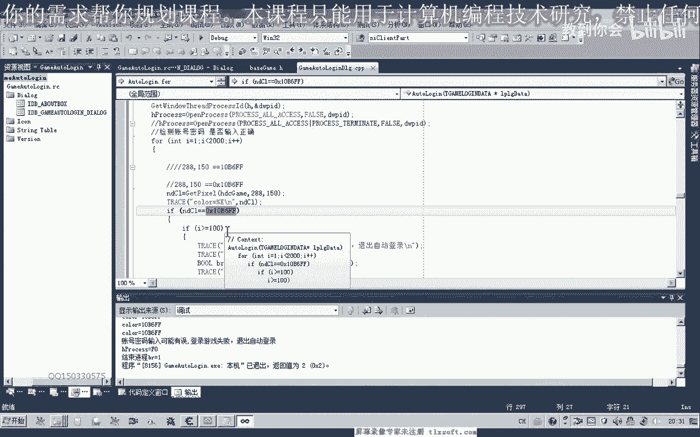

呃，跟录的这个界面我们再来看一下啊，因为这个这个我们取得大概是这个点的颜色哈，但是他登录之后照这个点，但是这个点的话，它的颜色呢同样没有变化，我们选的点有问题啊，我们到另外选一个点，登录前后的一个区别。

那么实际上我们可以选选这一个点啊，通知这两这个点的颜色，那么这个点的颜色的话，它登录之后的话，它肯定有变化。

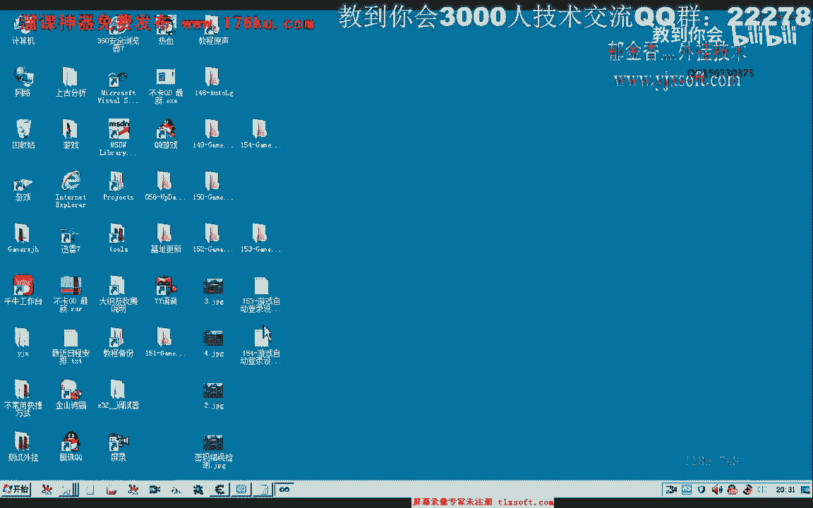

好的，那么我们把这个坐标呢啊得把这个坐标来改一下啊，那么在测试这里呢。

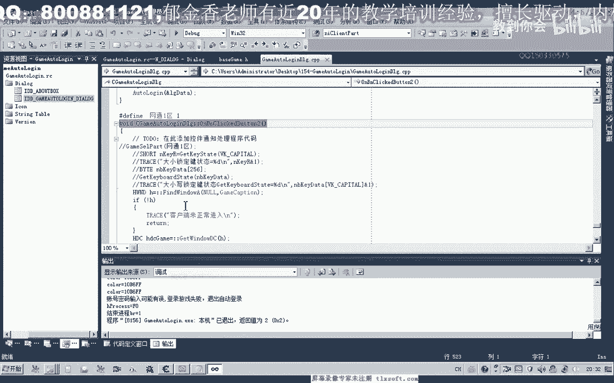

我们有取它的这个点的颜色，那么我们看一下刚才这个点的颜色应该是多少，我们必须要找一个有变化的啊，这个颜色，在这个位置的话，大概是呃29296418这个位置。

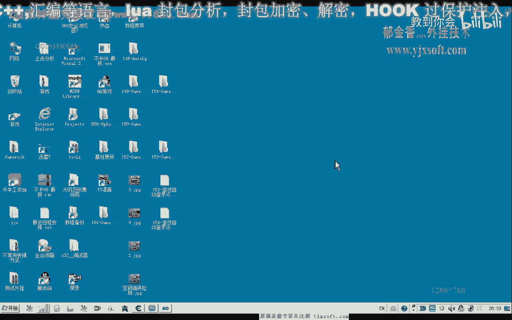

那么我们这里选296，这里是418。

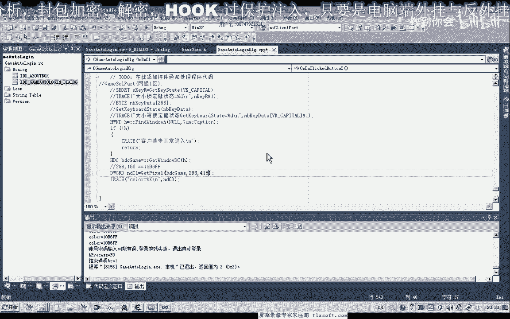

再看一下，对不对，大概是296418，好的，我们再次启动一下游戏。

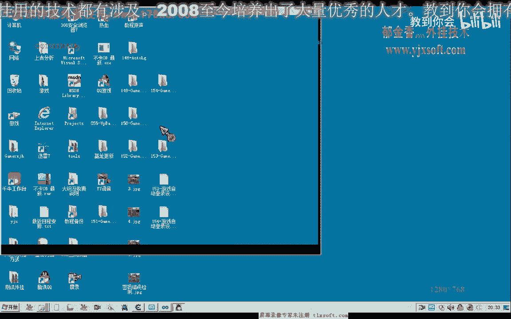

那么我们这个时候测试一下，点一下测试，看一下这里的啊canon的颜色，那么实际上我们可以把这个坐标，这两个点的坐标颜色来一起把它打出来啊，296468，这样好，然后把麦克，那么这里呢我们需要选调试。

查看的是调试信息，那么然后我们再输入一下我们的账号密码，那么我们现在再来取一下它的这个颜色，那么这个时候呢我们的颜色呢变成了这个数值啊，这是，账号密码正确，正确的话，这个是选服务器的这个鉴定啊。

这是账号密码界面的颜色，那么我们再取一次，看这个颜色它会不会变化，那么我们取了很多次之后来发现这个颜色的话非常的稳定啊，都是这个颜色，那有了这个颜色的话，我们实际上判断的话就更加的简单了。

这个时候啊我们先退出一下，那么在移到我们前面的这个判断这里，那么之前的这个颜色的话应该还是可以用的，在之前的之前呢，我们可以不改，但是这个地方呢我们必须要改，它的坐标在965，然后呢这里的颜色我们。

要改一下啊，这是之前的这个颜色，那么我们如果等于这个颜色的话，需要的在这里啊进行一下判断，那么如果是另外一种情况的话，我们在这里呢也可以加一个判断啊，控制，那么如果这个颜色它直接就等于这个数值啊。

那么我们直接来就可以停止这个循环，那么这是另外一种情况，当然这个也可以不加在这个20里面，也可以把这个去掉也是可以的，好的，那么我们再次进行调试，那么甚至我们还还有一些值得改进的地方，就是这里了。

等待这个服务器界面啊，这个8000的话我们可以把它注释掉，对我们只需要对这个颜色啊进行判断，那么如果是等于这个颜色的话，才跳到这个地方的话，那么我们在这个等待时间的啊，直接可以去掉啊。

直接可以去掉到这里，这个等待时间呢就不用药了，因为这个时候了，它已经检测这个颜色的话，已经等于我们的这个服务器什么颜色啊，好的，那么我们最后进行一下测试，直接就过去了，因为我们呃判断的话更加的准确一些。

因为这个时候已经停在了我们选择服务器啊，选择这个服务器相应的这个线啊的时候，那这个界面，那么我们在这里等待了。

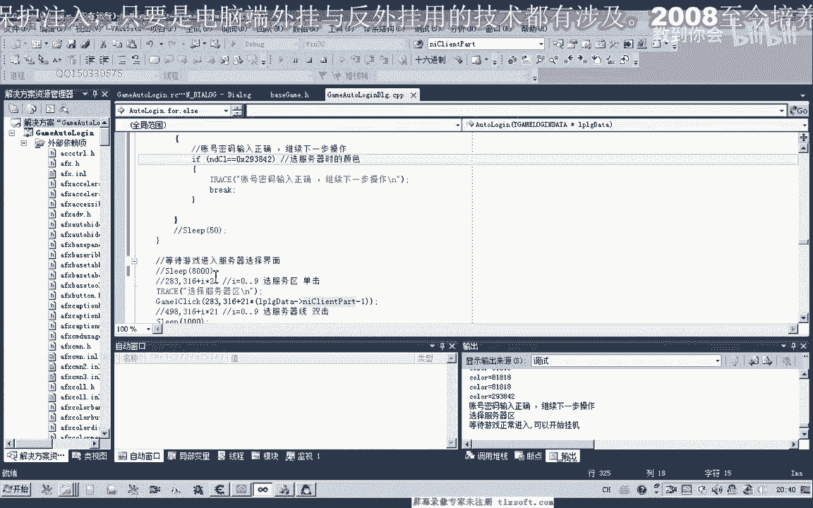

就可以把它取消掉啊，选区选项啊。

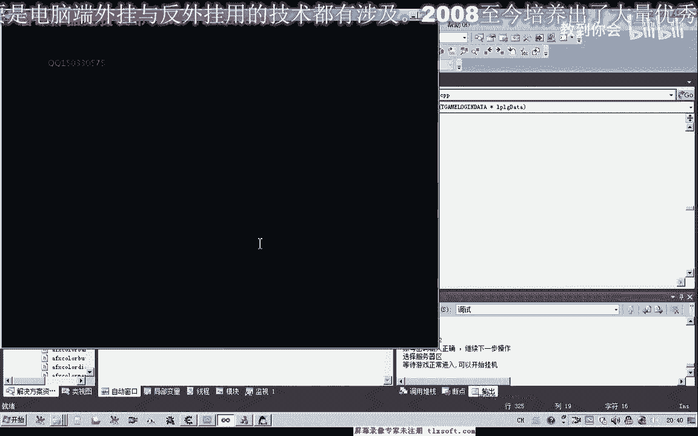

好的，那么我们再次把这个账号和密码把它输出啊，呃再进行一下测试，它实际上还有一种更准确的方法，就是我们判断啊，这个时候呢我们的进程已经成功地结束了啊，从这里看到，从画面上也能够看到。

那么实际上还有另外的一种判断的一种方法。

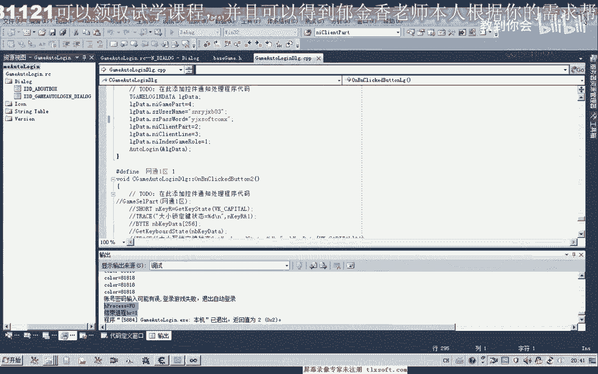

因为如果我们输错了这个账号密码的话，这个位置呢它会出现一个通知，那么这里的颜色它是变化的啊，那么我们只需要判断这个点的颜色，就能够判断它是否密码是否输错了，因为密码输错和这个账号不对。

它弹空的位置都是一样的啊，这种方法你会了之后呢，你，可以自己去完善你自己的代码，好的，那么这节课呢我们就交流到这里。

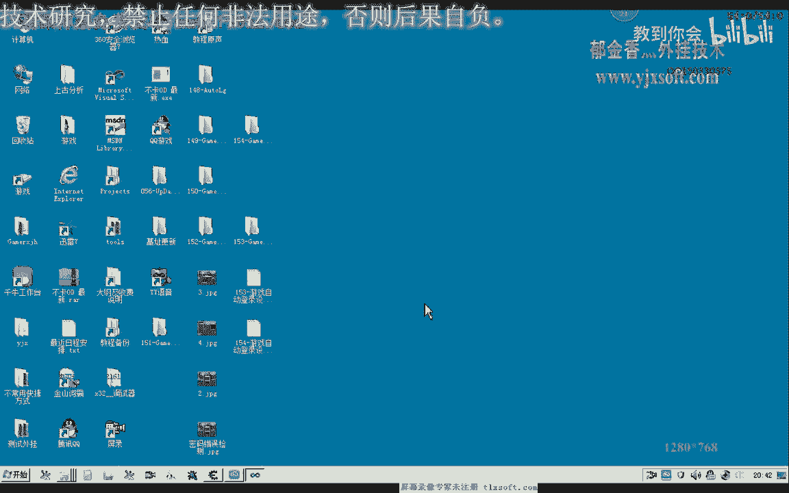