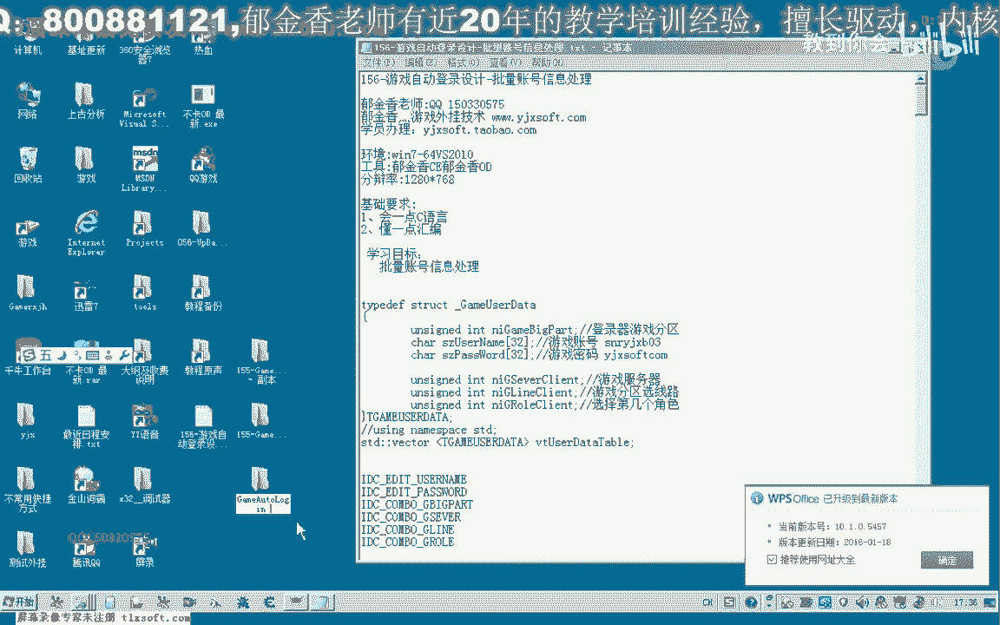
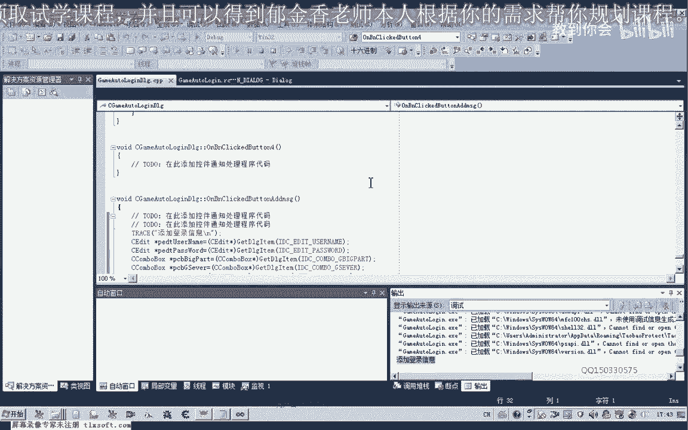
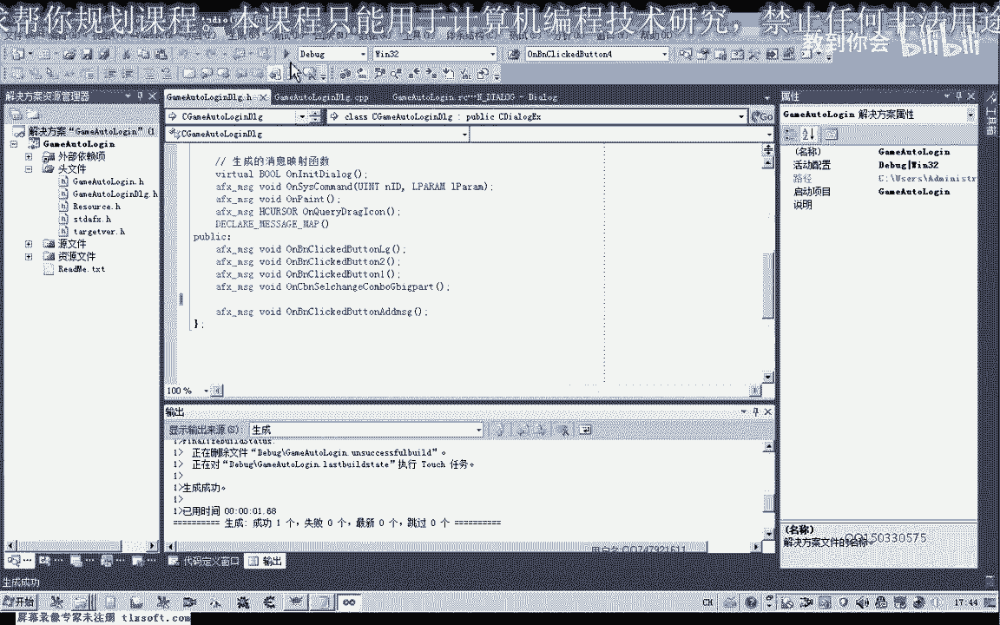
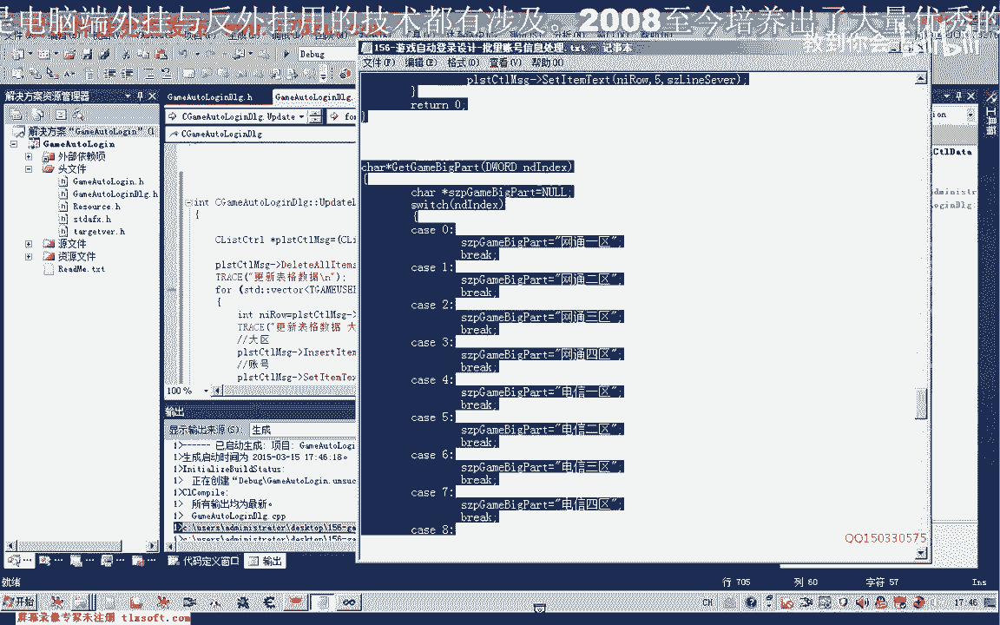
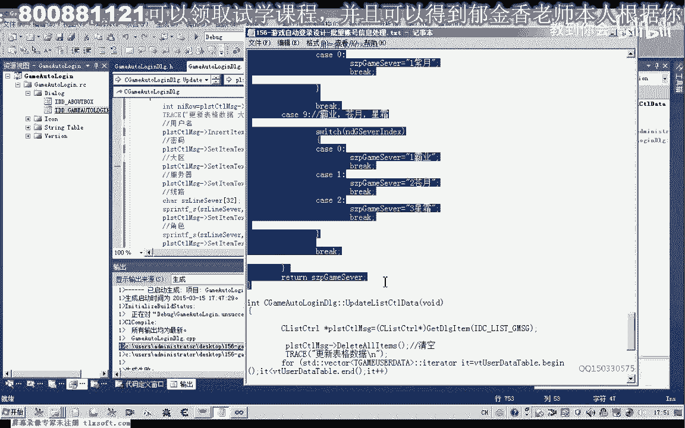
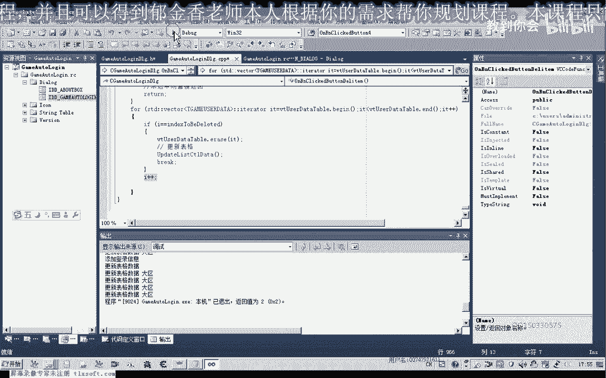

# 郁金香老师C／C++纯干货 - P145：156-游戏自动登录设计-批量账号信息处理 - 教到你会 - BV1DS4y1n7qF

大家好，我是郁金香老师，这一节课呢我们一起来呃，编写批量账号啊，信息处理的相关的代码，那么首先复制一下155克的代码。

打开，那么首先呢我们把账号密码以及我们这些游戏登录的啊，这六个部分的信息呢添加到我们的这张表格里边去啊，在添加登录信息这里，这里呢我们首先改变一下好i d的一些信息，好的。

然后呢我们双击在这里呢添加代码，那么在设计代码之前呢，我们需要定义一些结构啊，那么这个结构的话实际上与之前的嗯这个登录账号时候的这个结构呢，他的信息是一样的啊，只是这个名字呢我们把它修改了一下。

好的我们先复制一下这个结构，那么这个结构呢我们主要是要定义一个vcd的呃，这个动态数组用来存放多个账号的这个信息，这个用来用于存放多个账号信息，那么也就是表格里面显示的这些信息的话，就存在里面，好的。

然后呢我们在这里呢相当于定义了一个全局变量，我们把这个定义的结构呢放在它的头部，然后呢我们需要来这里用到了这个vector，然后我们需要包含相关的头文件，那么接下来呢我们需要用到一些呃相关的控件呢。

因为我们没有关联相关的变量，那么所以说在这里的话，我们就是呃在添加信息的时候呢，我们需要先把这几个控件啊，这个是账号的密码的啊，大分区的，然后这是服务器的，然后这是服务器选项的，这是人物角色的。

那么这些控件呢我们需要呢呃或者它相关的这个指针啊，控件的，然后取出相关的这个信息啊，保存到我们的呃这个结构里边，然后呢添加到这个表里边啊，好的，我们先把这一行代码复制一下，添加登录信息这里。

那么所以这个函数呢我们是把这个表格里边的维克的这个表格里边，动态数组里边的这个数据呢更新到我们这个控件里边去啊，这个函数呢我们等会儿一起来写，那么现在我们还要注意的是一个问题呢。

呃这段代码呢它并没有被执行到，我们看一下，那么可能平时的时候呢，我们如果是改掉了这个id的话，也会出现这样的问题，那么我们看点击这里的时候的话，那么实际上这里呢没有调试信息的输出。

那么实际上这下边的所有代码都没有被执行到，那么这是什么原因呢，啊像这种的话我们也经常出现这种情况，一般来说就是我们修改了这里的i d，但是之前呢它有一个呃有一个这个数值相同的id呢。

关联了另外的一个函数，那么我们一起去看一下，比如说之前的这个啊呃克里克8x4啊，这个呢它实际上我们搜索一下就能够找到啊，他前面的关联了另外的一个函数。

那么我们可以看到这个i d c8 乘四与我们的这个登录信息的，这两个的话，它的职能都是1011啊，相当于是他的i d，那么实际上我们我们就是说单机的时候呢，它转到了这个啊8x4这个函数里面去执行。

后面的呢就被省略掉了，所以说在这个地方呢我们需要把它注释掉啊，或者是删掉这一行信息，那么同样的这样删掉之后呢，后面的函数体呢我们也需要啊给它删掉，当然这个函数体不删掉的话。

实际上这个时候呢它也能够呃执行到我们的这个代码里边来了啊，因为消息的映射的话，它已经映射到我们的函数里面了。

当然我们也可以把这一段代码多余的代码删掉，另外我们转到他的头文件里面啊，也把这个相应的函数定义呢也给它处理掉。

那么这个时候我们添加的登录信息呢，实际上是添加到了我们的这个动态数组，维克的动态数组里面的，但是呢我们还需要来把这个动态数组里边的数据，显示在我们这个表格里边哈，因为这样的设计。

而不是直接把数据添加到这个表格来，是考虑到后边后边我们需要把它呃设置成一个啊配置信息啊，保存到文件里边啊，所以说有这样的一个设计好。

那么我们继续来看一下，那么这里呢我们将写一个函数啊，用来把我们的这个数据呢呃更新到这个list country啊，这个表格里面去啊，那么我们来看一下这个函数我们需要怎么写，咳咳，好了。

那么我们再次回到我们的这个vs 20100，那么首先呢我们这个函数的话，它必须作为一个这个绿的一个成员函数，那么是类的成员函数呢，我们还需要到头文件里边的那进行一下定义。

啊那么这里呢我们没有消息的映射啊，所以说呢我们啊直接这样写，加上一个封号就可以了，但是这个时候编译呢是通不过的啊，因为它里边呢还涉及到呃其他的几个函数。

他应该是这一段代码，那么我们看一下还有哪些地方我们需要进行修改的，那么这里呢有两个啊，我们另外又写了两个函数，那么我们先来熟悉一下它的逻辑，那么在更新这个数据到我们的这个表格的时候呢，实际上我们也是呃。

那么我们再切换到这个资源窗口看一下，那么实际上呢我们在这里呢呃这个表格里边呢有六个单元，那么我们实际上是需要在这六个单元里边呢添加不同的这个数据啊，应该是大区的啊，那么大学的我们在这一个呢。

我们首先呢在这里呢呃这个应该是我们首先是日复明，然后呢再是我们的密码，然后呢再是我们的账号，是这样来的，那么主要是我们的，用户名密码和账号啊，这个应当是我们的大区，选服务器的这个大区。

但这个大区的话它传进来的我们获得的是他的一个嗯，保存的时候呢，我们保存的是它的一个这个下标，那么所以说我们要把它转换成文字啊，那么这里呢我们需要用一个函数来进行转换。

那么我们来看一下这个函数我们是怎么写的啊，啊，那么这个函数呢也很简单，我们根据它传进来的这个序号，然后呢给它返回一个相应的字串啊，比如说是零的时候呢，我们就返回网通一区啊，这个很简单，是九的时候呢。

我们就返回我们电信的六区啊，就是这样一个简单的函数，那么我们把它复制一下啊，那么这是这是一个这个游戏啊，游戏分区的相关信息，那么另外一个呢是这个登录进我们游戏客户端之后啊。

它有一个客户端里面有一个选服务器，那么这个服务器的话要稍微复杂一点，它要根据我们的首先要判断是哪一个大区啊，所以说它需要有两个参数，一个是这个游戏的一个大的一个分区的参数。

那么另外一个呢是他选择了这个服务器的这个编号啊，是第几号，那么我们来看一下这个函数的设计，那这个函数呢我们用两个开始结构啊，那么如果是前面大区，比如说是一，那么我们就在这里面去找。

那么它的这个第二个下标如果是二啊，如果是一，就是这个服务器，如果是零的，就是这个，那么所以说这里呢我们用了两个开始结构，这里用到两个开始结构，外外层的这个case结构呢是一个这个大的一个分区的一个分支。

那么每一个这个大的一个分区里边呢，我们给它另外啊设计了一个小的这个十witch开始的一个结构化，然后来选，比如说我们这里是呃网通一区啊，如果是传入的是零一的话，那么也就是龙争虎斗啊。

这个服务器如果是传入的是一一，那么就是雄霸啊，这个如果是传递的是三和一，那么就是电信四区的呃，这个啸天这个服务器啊，就这样的一个设计好的，我们把这段代码复制一下，我拍的。

好那么我们在编译生成。

这个时候我们再来看一下它的一个效果，咳咳添加登录信息啊，这里是账号的信息密码的啊，然后选的是网通四区啊，服务器是必行线路啊，是一啊，第一个角色，那么这里呢我们就可以选其他的啊，比如说我们选电信六区啊。

那么电信六区呢我们选心酸啊，这个线路呢我们选六角色呢，比如说选三啊，那么这样呢我们都是可以添加的啊，但是还要涉及到一个重复添加的一个这个问题重复添加，那么最好呢我们有这方面的这个项链。

也就是看一下有没有账号啊，相同的啊，这个账号账号它是不能够相同的，这里呢我们可以写一个相关的检测，也可以不写，那么另外一个呢就是这个选中算出这个选中行，比如说某一个信息我们输错了哈。

那么我们要把它删除啊，那么我们看一下这段代码我们应该怎么写呢。

那么这一段呢是我们删除这个相应行的这个相关的代码。

那么首先呢我们是通过呃，首先呢我们获得他的第一个选中的一个位置啊，位置信息，然后通过这个位置呢来获得它这个选中的这个行号啊，也就是我们要删除的某一行啊，然后我们可以把这段信息打印出来。

那么接下来的话如果他选中了这个行号啊，如果是没有选中的话，那么他取得的信息呢可能是-1啊，-1的话就是小于零的，那么我们就不处理，直接返回，那么如果是大于等于零的啊，它的行号因为是从零开始。

那么大于等于零的呢，我们就去删除相应的这个数据数据，那么删除的数据的话，我们用这个啊s啊这个函数函数来删除这个维克特里面的原，那么删除之后的话，我们的这个数据呢它也变动了。

那么我们需要了把这个表格里面的数据需要更新到我们的表格里边啊，等一会我们再来看一下是怎么更新的，然后我们这里呢必须要加一个break退出，那么如果这个它相应的这个微课里面数组的数据它变动了啊，移动了。

那么你再按照这个循环去再按照之前的一个循环去循环的话，那么就有可能出错啊，所以说这里呢一定要加一行不对口啊，那么如果他这个行号我没有找到啊，这里呢我们这个i的指南我们需要加一啊，就是继续搜索这个行号。

因为本身呢我们这个呃微课程设计的时候呢，我们在它的这个元素里面没有设计行号这个，但是呢我们可以呢呃顺序的去骗你的啊，因为它也是一个顺序的一个结构啊，相当于是就是说它是不断的压榨，它也是有一定的顺序的啊。

好的，那么我们再来看一下啊。

它能不能够删除我们的相应的数据，好那么比如说我们专属的第三行，最后一行，第一行，啊那么这里呢它都会显示出这个相应的行号啊，获得的好，那么最后我们再来看一下怎么把数据啊更新到我们的这个表格的。

那么这个表格的话，这里呢很简单，实际上呢就是我们刚才我们也说了一下啊，就是插入这个数据啊，把这个相应的数据来啊插入进去啊，如果它本身是字符串类型的直接差异，那么不是字符串类型的。

我们用这个相应的函数呢把它转换一下啊，那么这里呢我们呃选线路的时候呢，我们再把它格式化一下，那么这个线路呢替换这个百分之s的位置，那么2%d的啊，它替换，那么后面这里呢一定要加一啊。

还有这里的这个角色也要加一，因为呃我们在这个获取的时候呢，它是从零开始的啊。

那么我们只有加一之后呢。

这个呢呃考读性呢会更高一些，那么如果是不加这个一的话，那么这里呢可能就会显示线路零，那我们来这里呢可能就会呃显示这个角色的话，可能就会显示嗯第一个角色啊，因为这里的它的这个缩缩影的话是从01234。

0123这样来排列的啊，好的，那么这节课呢我们就到这里，那么下一节课呢我们这里呢给大家留一个作业啊，就是这个比如说这个账号添加重复的情况下呢，我们给出一个提示啊，就是说这个账号信息呢重复的输入啊。

那么如果我们在这里的时候，他去反复的登录同一个账号的话，这样也会出错啊，那么这个信息呢流成一个作业啊，大家下去完成一下，哈哈，那么重复检测的这个账号信息的话，我们密码这些都可以呃，不检测啊。

需要检测这个账号就行了，账号的名字如果一样，那么我们就不能够听在咨询，如果在那么检测的时候要注意，我们不用去检测这个表格啊，那么我们检测的是这个动态的这个数据，因为我们的数据呢从这里边更新进去的。

那么另外呃我们下一节课所要做的呢，可能就是把我们的这个数据啊，因为我们不可你说我们这个程序啊退出了之后。

那么我们下次嗯再去启动这个软件的时候。

我们又要重复去输入这个账号的信息，这样显得比较麻烦，那么所以说我们在这个程序出的时候，或者是在添加信息的时候呢，我们就把我们的这个账户信息呢保存到文件里面，那么下次我们打开这个呃软件的时候呢。

我们自动的就从文件里面来加入我们相关的数据，到这个我高低给啊。