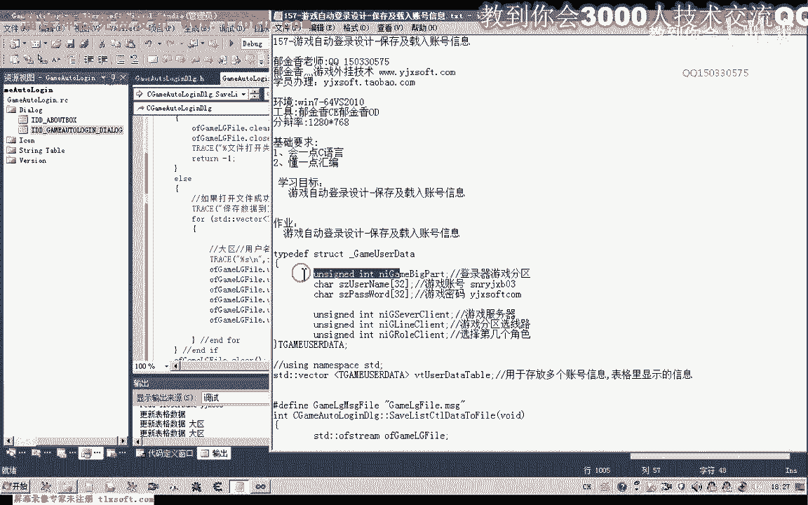

# P146：157-游戏自动登录设计-保存及载入账号信息 - 教到你会 - BV1DS4y1n7qF

大家好，我是郁金香老师，那么这节课呢我们进行哈这个账号信息的一个保存，以及呃账号信息的一个自动的一个载入相关代码的设计。

那么首先我们打开156克的代码，当当当。

那么打开之后为了方便测试呢，在这里呢我们添加两个按钮做一个测试，那么一个是我们保存这个列表里面的一个信息到我们的配置文件，保存我们的账号信息嗯，那么另外一个我们用来是测试啊。

就是读取读取我们的账号信息存文件，那么最后我们调试成功的话，我们就可以了，给他把这相应的代码放到我们窗口的初始化的函数里边，那么以及我们在添加登录信息的时候呢。

把这个账号的信息呢更新到我们的文件里面就可以了，那么首先呢我们来设计一下啊，保存账号的这个信息。

当然这个函数呢在这里呢我已经把它写好了哈，那么我们一起来看一下它的一个原理，那么这里呢我们是直接把内存里边的这个数据啊，字节数据，那么直接以二进制的方式啊，也就是说原封不动的啊。

这个数据呢从内存里面写到我们的文件里面，那么我们这里呢需要用到这个二进制的这个格式，那么在写入的时候呢，我们这里呢呃它的这个参数呢是out啊，那么一个是二进制，一个是out啊。

那么这两这两个参数呢我们都需要用到，那么这里呢我们是用的这个啊o fs啊，这个就是输出啊，输出的一个流，用了一个流文件来操作的，它啊首先呢我们就是打开这个文件，然后呢对它进行一个写入的一个操作。

那么我们在这里呢这个账号信息的一个配置文件呢，我们保存在啊这个文件名里边，当然这个后缀名我们可以随意的变啊，随意的变或者不要后缀名都是可以的，或者叫txt或者叫i n i都可以，这个后缀名随便变啊。

这里我把它写成的是啊b n或者是cfg都可以啊，欢迎大这个后缀名我们是可以随便变的，然后呢在这里呢，那么我们还是首先把这个代码复制进去。

我们在来解释一下这个相应的代码，那么我们在这个地方呢进行复制，那么因为我们写的时候呢是写的这个内层面的函数，那么这样复制进去的话呃直接编译肯定是通不过的啊。

那么我们需要把这个相关的头文件呢来把它进行一个前置啊，把这个函数的说明复制一下，那么还有这前面的这个函数的说明啊，我们都需要对它进行复制，那么复制好了之后呢，我们把它放到图文件里面进行一个说明。

把它说明成是一个类的成员函数，好那么在这个public啊，这个位置呢我们加上我们的说明，这后面呢再加上分号好，那么这个时候呢我们编译实际上就已经能够通过了，对了还需要包含我们的一个图文件。

不然的话他也不能够认识啊，嗯那么我们再转过来到原文件里边，因为我们用到了文件流的一个操作，那么这里呢我们需要把相应的头文件也需要包含进来，等着，那么文件流的一个操作啊，需要包含这个图文件。

好那么这个时候我们就能够编译通过了。

那么我们可以来先来测试一下，再做解释，那么这里呢一共呢我们写了两个函数，那么一个函数呢，它的功能呢是把我们的账号信息保存到前面的这个文件里面，那么后边这个函数呢是从这个配置文件把这个数据来读取出来啊。

然后呢更新到我们的窗口。

好的，那么我们先进行测试啊，那我们再来说明，首先我们是save file保存信息，那么另外一个呢是读取信息是re，嗯by date to list country，好的，那么我们先来测试一下。

那么我们每次启动的话，我们都是要要手动的去输入这个账号，那么这样呢显然很麻烦啊，那么我们可以来把这个账号信息的保存在文件里面，那么下次的时候呢，我们就从这个文件里面读取。

那么比如说我们第二次在运行的时候。

那么我们就可以了，直接从这个文件里面读取我们的这个账号信息，好这样我们就能够把它读出来了，那么有了这个真解，我们也可以了，继续的把它添加进去。

那我保存信息，那么第二次的时候呢，我们就直接可以从文件里边呢把这个信息呢读取出来啊。

这样的话我们就很方便。

那么或者的话我们还可以来呃，直接的把这个从文件里面读取信息的这个函数呢，把它添加到我们的这个窗口初始化函数里面，那么这样的话就不用我们每次去手动的进行操作，这个感觉。

那这样的话我们自自己的自动的啊，他就会去读取啊。

那么这个保存账号信息呢，我们也可以来把它添加到我们的这个登录信息里边，不用每次都去呃，单击这个保存我们的信息，直接从这里啊。

好的，那么这个时候的话我们直接对还有文件这个选中行的时候呢，我们也需要把这个函数呢更新到里面了，啊，只要相应的数据有了这个变化。

那么我们就更新一次它的这个数据，好那么这个时候比如说我们把这一行的删掉，那么在新增加一个六，那么在这里呢再输入我们的密码，那么添加我们的登录信息，那么这个时候呢我们就用不着再来保存账号信息。

这里一共有四个账号，那么我们直接把它关闭掉啊。

第二次的时候呢，它就会自动的啊载入这些信息，那么这样的话使用起来就非常的方便啊，使用起来就非常的方便。

当然这两个呢我们也可以来呃，可以不显示这两个账号啊，最后我们测试成功之后。

那么直接我们就可以使用。

好那么这个时候读取都是自动的，那么这个时候我们相应的公认我们已经演示完毕了，那么我们接出来来看一下函数设计的一个原理，那么首先呢我们是对了啊，用这个呃文件流对这个文件进行操作。

那么文件流呢他的第一个啊我们需要打开我们的文件啊，那么打开文件的时候呢，第一个参数呢就是文件的名字啊，那么如果这个文件它没有在我们的当前目录下，那么我们需要用全路径的一个名字。

当然这个时候呢我们e x e来和这个文件呢它是在同一个呃路径下啊，也就是当前的呃这个进程的一个运行的一个路径的下边好的，那么后面呢这里呢这个参数来表示是二进制啊，这个out了表示是写入。

那么首先呢我们打开之后呢，我们用一个fire函数来判断是否打开失败啊，那，么如果打开失败的话，我们需要来做一些这个牛的一个清理工作，啊哈哈，那么清空我们的流，然后呢我们关掉了嗯。

这个呃进行一个关闭的操作，相当于是关掉啊这个相应的句柄啊，这一类的，然后呢我们就只能够直接返回了，因为我们这个时候的话，肯定我们文件打开失败之后呢，就不能够对这个文件进行操作。

那么如果当然这里的还可以的，打印一些调试信息，好那么如果打开成功的情况下，啊那么如果打开成功呢，我们就骗你这个维克特这个表，那么这个表头啊，前面我们已经介绍了，它里边就是存放的我们账号的信息。

那么实际上我们只要骗你这个表，把表里边的所有数据保证基这个二进制的形式，也就是内存里面它是什么形式呢，我们这个时候就以什么形式呢，把它保存到我们的文件，那么下次我们涂的时候呢。

也以二进制的形式来把它读出来就可以了，然后呢一个for循环进行偏离，偏离它里面的所有这个元素，那么偏离的时候呢，我们取出它的这个呃，这个指针，那么管里面的我们的呃大区用户名密码。

服务器陷入角色的这些信息，来依次的写入到我们的这个二进制的文件里面啊，一式的写入，那么注意，那么这里写入的这个顺序，那么读取的时候也要用这个顺序呢去读取。

当然我这里设计的话就是按照这个结构的顺序来的啊，那么这个结构啊。

最新的这里的一个游戏分区，我们是一一对应起来的，因为它读取的时候呢，就就是直接按照这个结构的大小来读取的，那么这样呢更快一些啊，更快一些，读取的时候可以一次性的读取，这样一个结构啊出来。

那么写入的时候呢是按照这个次序的，挨着挨着的来写入的啊，写入之后保存到我们的这个文件，它也相当于是一环内城区域这样来操作的吧，那么写入完成之后呢，当然也要进行一些清理工作啊，后面的啊，啊关闭一个文件里。

那么这就是我们呃写入数据到我们的这个流文件，那么在读取的时候呢，我们用另外一个啊这个s t d这个实际上它表示是读取啊这个i了，它实际上是可能是这个in啊这个字母的一个所有缩写。

那么同样的后面的这个打开的参数呢也要改变一下，那么这里呢它的这个参数呢也是in，那么in的话，这里呢表示的是读取，那么这里呢是以二进制读取的方式来打开的，那么同样的打开失败的话。

我们也做一些清理的啊工作啊，好，那么如果打开文件成功，那么我们就可以从里边呢来读取我们的数据，那么首先如果这个读取成功的时候来这里呢，我们可以刚在测试的时候的话，这句是肯定要要的。

不然的话它会重复的向里面添加数据，当然这个时候的话呃，这句就显得可要可不要了，因为在如果我们只是在这个窗口初始化的时候再来调用这个函数的话，这一步呢就显得有些多余啊，这句当然你自己考虑要不要。

那么这个呢我们是对这个表的一个清空啊，对这个worker动态数组的一个做一个清理的一个工作啊，清空，那么接下来呢我们就开始来从这个文件里面来读取我们的数据，那么这个呢是它的一个读的一个指令。

那么读取出来之后呢，我们是放在这个缓冲区里面，那么这个缓冲区的话，我们在前面的定义的就是我们刚才的这个类型啊。

结构类型定义了这样一个结构，那么这个结构呢肯定就是用来存放这些信息的。

那么它相当于直接把那个文件里面的相关的这个数据呢，按照它的一个大小啊，在周五按照这个结构的大小来进行一个读取，读取之后呢啊放在这个结构里面，那么一次来只读取这么多啊。

然后呢我们再把这个数据来啊进行一个压战啊，添加相当于是添加到我们的动态数组里边，天价的账号信息好动态数组或者是掉头，那么如果在这里呢，它读取失败，说明读到了我们的文件末尾啊，那么则退出我们的循环。

这退出我们的y循环，那么开始的时候呢，我们可以加上这一句，那么实际上我们是要读取整个文件的话，这一句呢我们也可以直接把把它设置为一啊，理论上也是可以的，当然这种写法来更好一些。

那么这个函数呢e f呢是用来判断判断我们的文件啊，比如是否啊这个读取到是否这个指针呢，文件流指针是否指向文件bo啊，如果指向末尾的话，就是说里边它或者是没有数据，或者已经读到我们的最后了啊。

那么我们也退出循环，那么这里的话呢它是读取失败了，那么呢我们也退出，我们的循环，那么如果读取成功的话，那么我们就把这个读取出来的这个元素呢，呃添加到我们的这个呃这个表里给啊。

那么我们之前的操作来设计的时候，都是对这张表的一个操作。

相当于相当于我们是把这个表的数据来与我们的这个控件的数据呢。

进行了一些关联，因为我们在添加登录信息的时候呢，我们每次呢也要向这个表里面添加一个元素进去啊。

那么所以说我们最后呢我们再再回来一下，再看一下。

那么所以说在这里呢我们把这个数据看更新到表里面之后呢，最后这个函数的调用相当关键，那么最后呢我们是把这个wink动态数组里面的，这些所有的账号信息的元素来通过我们之前写的这个函数呢。

更新到我们的呃这个窗口界面里面啊，好的，那么我们再来测试一遍。

好的，那么这个时候我们发现呢它就能够自动的带入这些信息了，那么因为我们这个调试环境的话，它实际上它的工作目录的话不是这个e x e所在的这个目录。

那么所以说我们进去的话，在这个第八个里边的话，他只能找到e x e，他找不到这个b，那么这个文件啊，那么当时这个文件在哪里呢，在他的一个工作的这个目录里面啊，一到十，美美的事情看起来这一。

啊就在这个目录里边。

实际上我们保存的这个文件的话，就在这这个文件里面，因为我们这个调试器它设置的这个进程默认目录目录的时候呢，是设置它的上一层，但是如果我们单独运行的话，它实际上呢呃，单独运行的话。

它应当是要保存在这个目录里面，但是呢这个时候呢他找不到这个文件啊，应当是第一次运行的时候，啊写入的时候呢应该是呃打开这个文件可能是失败了，那么我们把这个文件删掉之后。

我们再做测试一下，看有没有问题，调试的时候，那么这个时候呢如果文件不存在的话啊，它会出现一个这个错误。

那么我们来看一下我们有哪些需要改进的地方，那么出错的文件的话，我们把这个行号工具来打开看一下，那么我们看一下它执行到了什么地方，那么可能是在这个位置打开的时候啊，出现了这个错误。

那么我们再重新编译生成一下，嗯。

这，那么这个时候呢我们可以开启这个调试运行。

好，那么从我们这个添加的语句来看的话，应该是打开文件这里，它出现了这个问题。

哦是读取文件的时候出去出了这个问题啊，应当不是在保存文件，因为我们在这个窗口初始化，这里呢我们添加的是这个函数的，啊是从里边啊读取我们的这个数据，那么这里呢他有个文件打开的失败的一个处理，好的。

那么我们在这里呢加上一个铝碳一试一下。

那么从这里返回的话就不会出错啊。

但是呢这里好像他打开了也没有失败，那么如果我们从这里返回来再看一下，这个时候呢就会出错啊，因为他打不开我们相应的这个文件。

啊。

应当是这个trs语句啊，这里出的错啊，因为这里的话它输出的后面的这个格式化字符呢，他认不认不了，那么实际上不是我们打开文件啊，这里出的错，那么打开文件它不存在的时候，我们的思路是没有错的。

因为这里的格式化字符呢少了一个s，那么它在呃这个后面的这个字符格式化字符呢，造成他认不到。

啊这个时候就不会有错了啊，那么我们再试一下，那么一定要注意在我们输出这个调试信息的时候。

那么这里呢嗯的这个格式化字串啊，一定不要弄错了，弄错了的话。

我们可能呢就会出错啊，当然现在这个文件呢它存在啊。

可能就不会出错，但这个文件它不存在的时候的话，肯定就会出错的啊，这个地方好的，那么这节课呢我们就焦虑到这里。

