# P149：160-游戏自动登录设计-分析断线判断标志 - 教到你会 - BV1DS4y1n7qF

大家好，我是郁金香老师，那么这节课我们继续分析啊，分析断线的这个标志，啊。

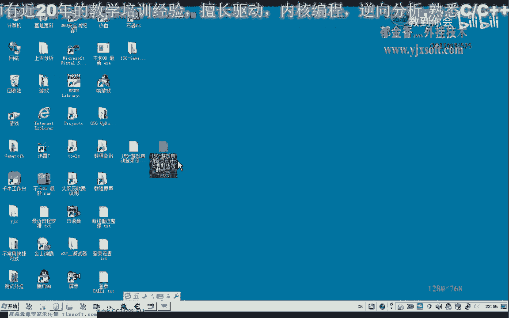

那么首先我们打开游戏。

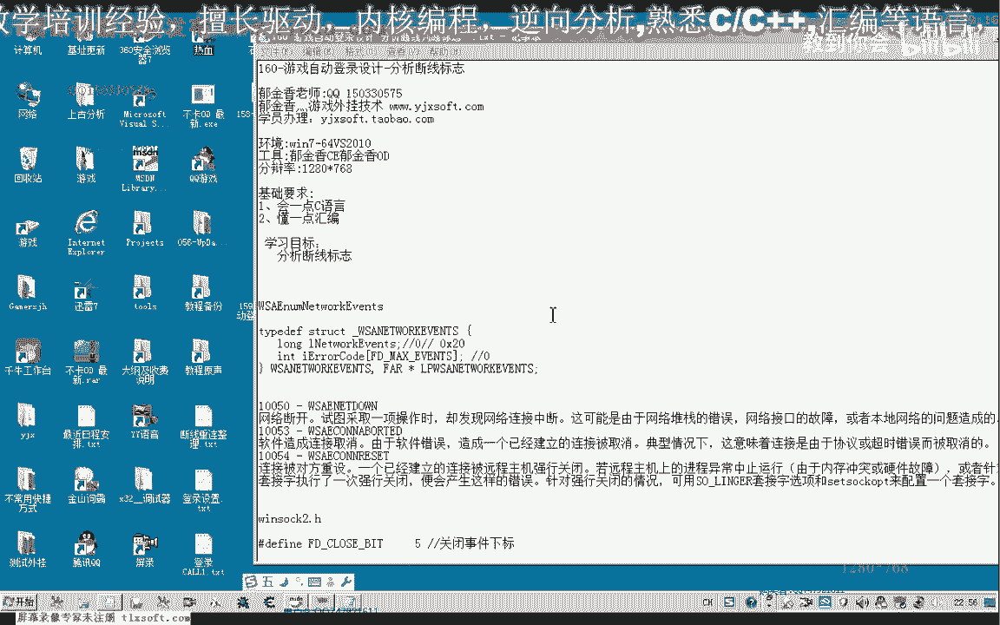

打开我们的游戏客户端之后呢，我们附加到游戏里边，因为我们在上一节课的话，应该已经分析到了我们的关键的数据周围嗯。

因为他需要这个相应的条件去判断。

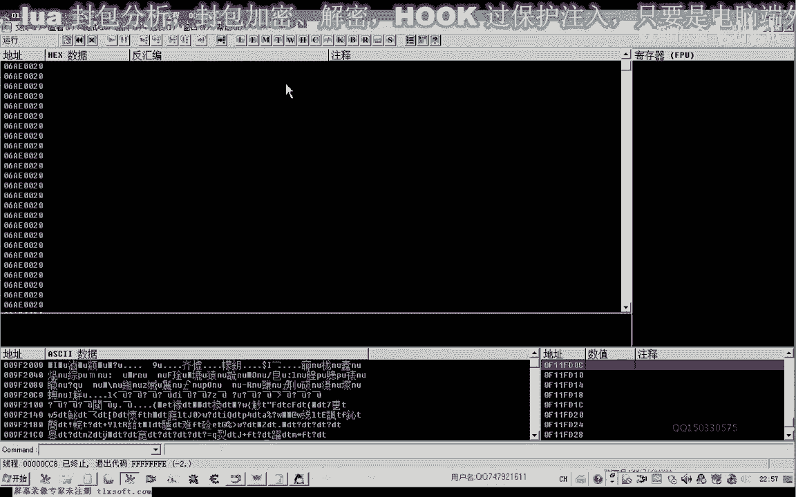

判断之后呢，我们再进行这个断开网络的这个操作，那么我们就在它的周围去分析啊立项，那么我们找到这个显示窗口的，函数啊，这里是我们的显示窗口，这是我们上一节课的分析。

那么实际上我们可以看到啊，还有其他的这个相应的这个判断，从这里来看的话，那么还有其他的地方呢，它也能够呃，可能也是要创建这个掉线的这个窗口，也可能是，那么显示的话，这里呢它也有也有显示，我们。

断线的这个窗口，那么因为我们做的这个测试的话，呃只是呃在这里禁用掉我们的适配器的这种情况。

那么因为它这个掉线的话，就是与我们的网络连接断开的话，都可能是有多种情况的嗯，那么也有可能是服务器啊，呃它关掉了，关掉了之后呢，我们连链接的时候来超时，那么也可能我们这里呢呃相应的适配器啊。

这个按键的问题，那么或者是网线被拔掉了啊，路由器啊这些相关的啊。

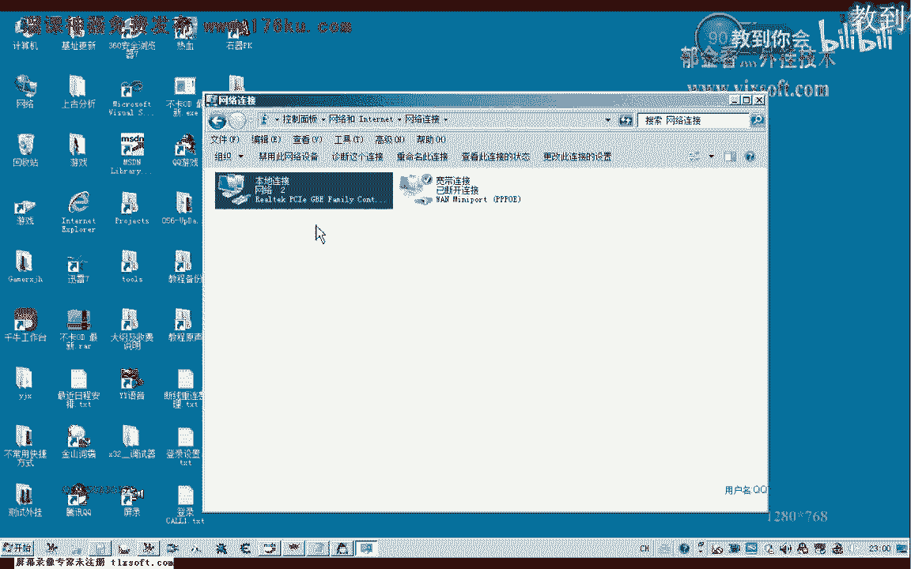

那么可能呢它下下边呢都有相应的一些判断，因为它这里面都调用了同一个函数，那么我们从这个位置来看的话，一控呢嗯它有三个啊，有三个相应的这个判断，那么我们来看一下它的一个执行嗯。

这是我们正常的这种情况下是在这里啊，这里是我们的，禁用网卡，那么还有另外的情况，我们来看一下它是怎么到达的，那么另外呢就是从这个地方跳过来的嗯，这个地方跳过来的话，腾配啊，接1v3 ，那么这里是为一。

然后这里呢有一个标志啊，可能是这个标志呃，它可能是为其他的这个数值了，当然这个呢我们呃因为这个时候服务器它没有掉线啊，我们不能够做更多的这个测试啊，那么可能与这个标志位它有一些关系。

那么我们可以找一下什么地方，忘了这个标志位里面有写这个数据的，搜索一下有没有，那么有往这个数据里面写字的话是从这个地方开始的啊，那么我们进去看一下这里来有往这里面来写入一个字节。

那么我们看一下e bx的一个数值，这里写的是bl啊，忘了前边找一下，那么这里的话我们从他来看的话，这里呢也是负责这个初值呃，零，那么我们再找下一个啊，这里有个a a，那么这里呢是写入的一。

但是我们不知道它是由于什么原因写入的一，好那么我们把这里呢啊复制过来备用，那么有兴趣的可以继续的呃，分析一下后面的这些标记，那么我们再看一下参考，这个地方cl呢它也有写入，那么我们看一下e4 x的数值。

那么这里呢也是写零啊，那么零的话从我们前面的判断来看的话，他应该是没有掉线，或者是没有错误啊，这个时候我们暂时不能够呃确定它是没有掉线的时候呢，呃是为零，那么我们接接着看一下cl啊。

这里还有一个a看一下，这里可能多半也是也是为零，那么再看一下参考啊。

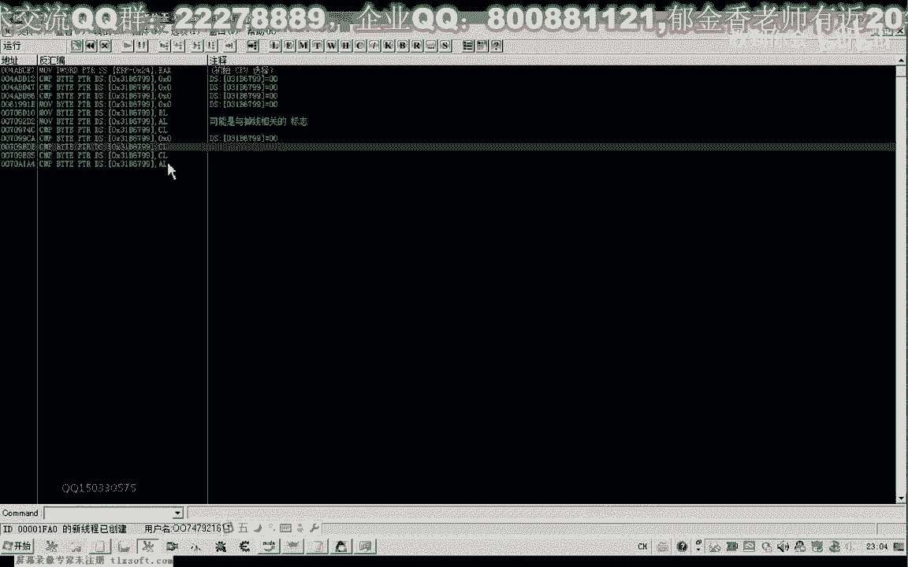

这两个地址呢是挨着挨得很近的，那我们再看一下这个a，以x啊，那么这里也是为零的，那么只有一个地方为一啊，就是这个地方比较特别的一个地方，我们再进去看一下，这里呢它是是直接对这个ex进行了赋值。

那么实际上复制之后呢，这个a或ax呢因为是他的呃低低位自己哈，所以说都是唯一的，然后呢往这个里边写入，那么这里边的话我们看一下吧，附近的一个判断的一个跳转，4a a910 嗯。

那么这个数字的话好像是发包的啊，我们来看一下这个数字呢。

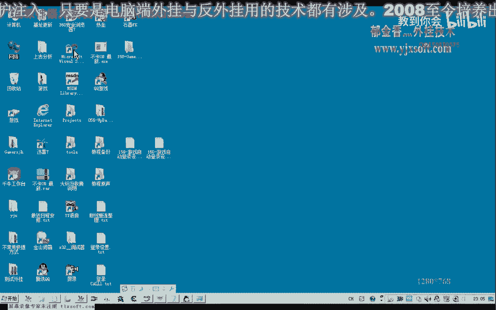

感觉比较熟悉。

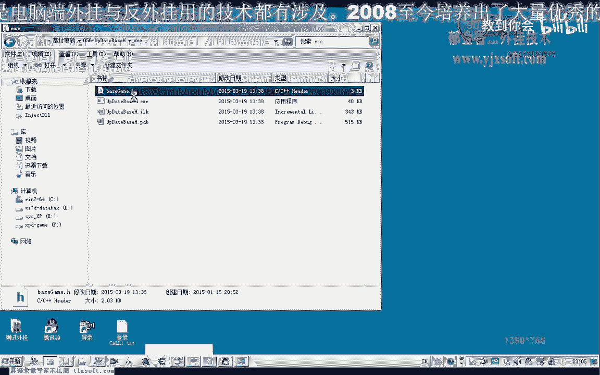

这是发包的这个库啊，这个地方是a910 ，啊还没有分析完成，让他分析一下，那我们在这里下个段看它会不会断一下，肯定是不会断的，这个地方，那这个地方它为什么会断在这里。

那么我们看这前面会不会会不会执行这个后，那么这里的话我们暂时不知道它是什么条件下会执行，但是这里呢是一个发包的一个孔，进来之后我们也能够看到我们的这个声道函数这一类的。

那么从这里呢能够找到一些字串的一个信息，那么可能是来发包过多的时候嗯，那么来可能会转到这个地方来，可能也不是哈哈这个应该呃，因为这个是很多地方都会断下的这个花苞的，这里的话肯定就会断下了，我们一直用啊。

这个时候就会断下嗯，所以说我们的这个原因的话，还是要到之前这个库里面来讲啊，好的，那么我们暂时不管它退回到我们之前的位置，嗯，那么首先呢它是从这个函数啊，呃这里开始，那么开始之后呢，他应当来说的话啊。

判断他已经呃掉线了，那么就应也就是说在显示了我们的这个窗口呃，之后的话，它应该呢嗯可能在某一个库里边啊，也可能就是在附近的一个代码里面，它应当对我们的这个掉线的相应的窗口呢。

呃应当有一个写入的一个操作啊，可能是写写这个标志哈，那么我们再找一下这个库附近啊，所有的这个写入的这个呃，找找一找这一类的机子，看有没有写入的啊，这也是比较的指令，那么我们往后边找。

那么这里呢也是比较的啊，没有写入我们的数值，这里也是比较的嗯，这里呢有有一个写入的呢，但是呢呃它不是对某个机子进行的一个写入啊，是一个局部的一个变量，那么我们后边继续找的话，这里都是读取的。

而且是一个循环，一般来说的话它不会在这个循环里边的，那么我们继续往前面找，在这里我们下一个段试一下嗯，我们看一下这个扩的话是会被反复的一个调用在循环，那么每一次下到你之后呢，立马就会断一下。

那么这个地方呢我们下一个段落，那么它也会反复的呃被断下了，但是这周围的话我们比较奇怪的是，都没有看到这个机子相关的，那么唯一有一条这个写入的这个木木的这个指令的话，写入的数字的话。

那么这个呢看起来比较靠谱，这里写出了一个-1，但是具体是不是这一个数字来判断的，那么我们呃还需要来进一步的求证，那么我们可以来嗯来看一下在这里这个加幺零的这个bx加一零的话，在前面这里哈。

我们注意在这个位置的话，它又取它的值，然后呢做一个判断啊，嗯这里呢有一个跳转，那么如果这里的数字呢等于这个-1，如果是按照我们的一个猜测的话，这里的话如果是写入-1的话，就是呃应该是已经掉下。

已经退断开哈，因为我们执行到了这个地方的话，这前面的这个嗯二零这里是我们的fty close，是这个事件，然后呢我们后边的它又有一个比较啊，24这里，但是这里的它的下标数下是01234。

那么这里的话相当于是我们的电，close dj相当于是我们的相应的这个数组的这个下标的位置，那么取出来如果这个地方它有这个关闭事件的时候，如果有错误啊发生的话，嗯那么这里的话它是与零比较啊。

肯定就不等于零啊，那么不等于等于零呢就直接跳过啊，那么不等于零的时候呢才会继续的啊，执行在下面的这个操作，当然这里呢我们看它大部分时间呢都是为零的，嗯，然后呢往下执行，这里呢就是我们的掉线的一个窗口。

然后呢如果我们这里呢它有一个判断，判断我们的对象窗口设创作成功，那么不成功的话，他可能返回的就是一个空指针啊，实际上是在判断这个ex是否是一个空指针，如果为空的话。

肯定就不能够调用这个显示掉线的这个窗口啊，好的，那么我们再次来看一下它的一个真正的数值是什么，从这个地方来看一下，那么我们现在看一下dd 5 dex加一零里面的数字是508啊，那么我们继续往下执行。

看一下这个ex的一个趋向，1c x，那么我们还发现一个问题，这个ex的话最后作为了我们的这个每一局哈网络事件的呃，第一个参数，那么我们再来看一下msd里边，来看一下它的第一个参数是什么。

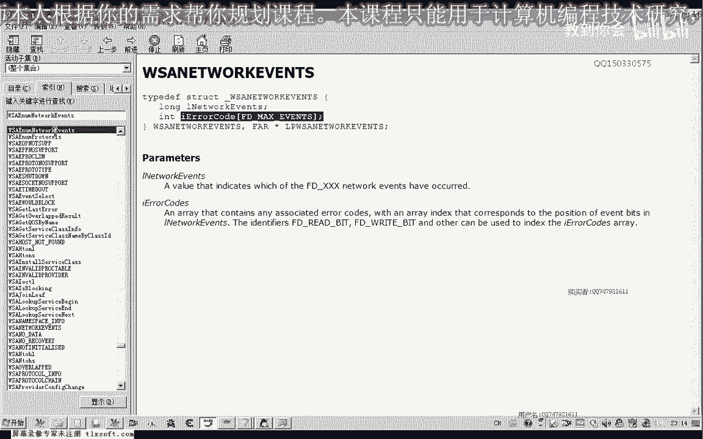

那么我们发现了它的第一个参数的话是这个套接字啊，那么也就是说我们在发包的时候也会调用到这个5v8 ，那么我们来看一下是不是这样八在这里下一个段，然后我们走上两步，那么我们看到这里的的确是这个套接字啊。

说不通啊，那么原来的话我们现在才知道了，他可能就是用这个套接字来做的一个判断，那么如果这个套接字呢，它这个距离不是为-1的话。

那么就判断它是没有掉线的，那么为-1的时候呢，掉下，那么大概是这样一个问题，那么我们可以来进行一下赏识啊。

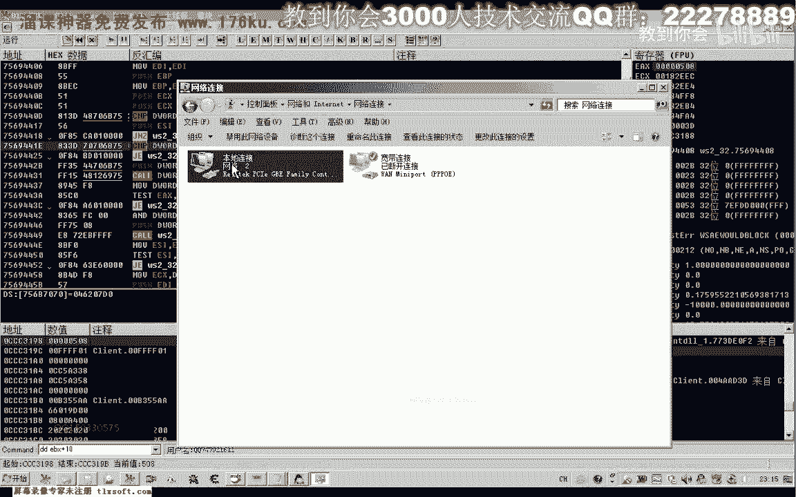

再按减号退回来，那么现在这个地方呢，下一个断点，禁用，那么禁用之后的话。

他所有的发包啊，应当来说都没有了，那么可能还有其他的一个标志会被打开，那么我们来看一下现在再次走路的时候，它会不会有相应的这个发泡，那么这个时候我们走路的时候，我们就发现了，他不会在这个地方断下来。

那么我们看一下它还有没有其他的标志啊，那么这个地方也为-1，当然这个地方呢它因为从前边这里的一个判断，我们看这个地方哈啊这个地方会被反复的执行到啊，因为这里的话它等于-1的，你比较哈，那么呃不等于负。

所以说这里就不会跳，就从这里来，一直会跳到这个函数的末尾就跳过了，那不然的话应该是这里边有相关的啊发包的这个内容啊，这里边可是我们的这个函数包可能就是从哦这里是js我们发包的啊。

好，好的，那么我们先把这个地方的机子先把它找到，可以在这个位置，在他前面啊，能够断下到这个位置，那么我们看一下1b x是多少，那么我们看一下什么地方对这个e b x有这个相应的访问啊。

用我们的c一角一小。

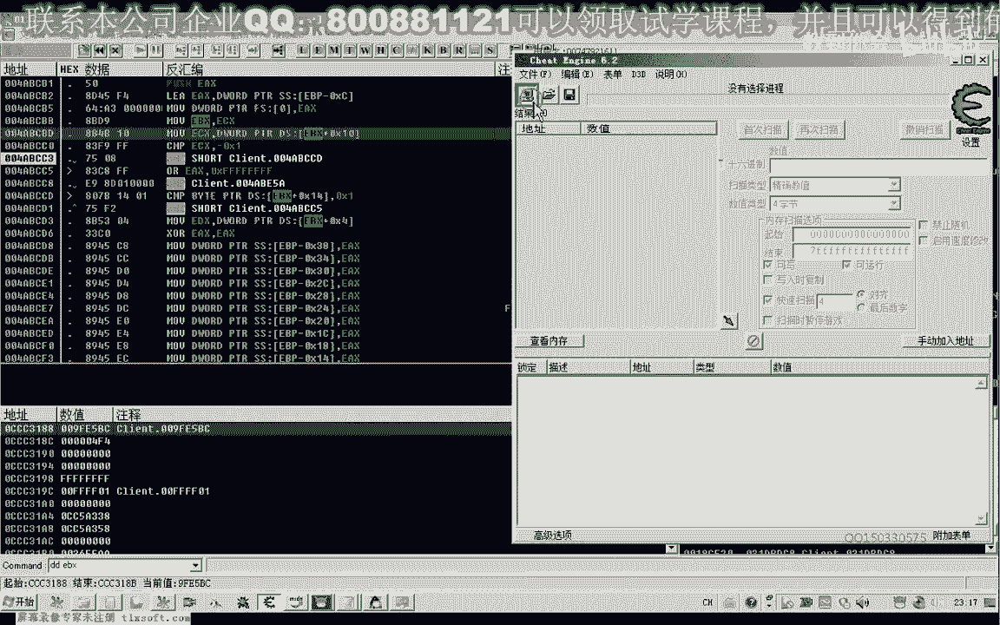

或者是直接在这里边，我们找一下有没有常亮，啊这里面是没有的。

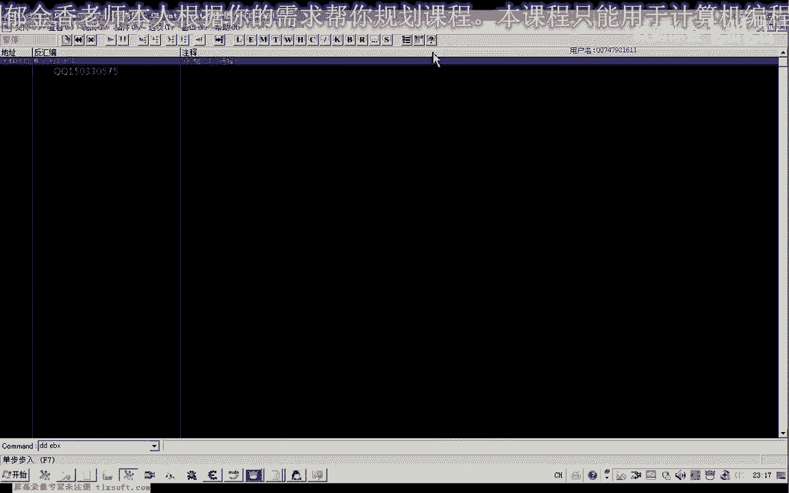

那么我们在c e里面搜索一下16进制。

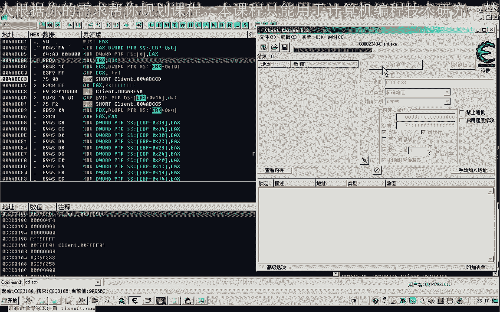

那么最后呢我们找到一个五一的一个f3233880 ，a f33880 ，我们看一下这个机子有没有，好这个机子呢，这里边好像还没有找到，嗯也有，那这个就是那个发包的ecx的这个参数啊，就是从这里来的。

那么实际上它就等于这个数值，那我们来试一下，那么也就是说发包的时候呢，他可能也会先判断这个套接字，那么如果这个套接字都都为-1了，他肯定就不会进行相应的这个发包的这个操作，好的，那么我们再来看一下。

可以接着分析一下s，包包的这个函数，那我随便找一个地方看看有没有这样的一个判断，那么这是它的这个ecx，这个地方应当还是会被调用才对，唉对它实际上走路的时候呢，它也会被调用，但是被调用之后呢。

他应该会对e4 x加一零这个地方呢进行一个判断啊，这里呢就有一个判断，我们执行下来看一下，啊按减号再退回来，那么实际上这里呢它也是对这个地方的判断呢，呃套接字是否可用，不可用的话，那么这里的话直接来。

就不发包了啊，这个地方实际上这个地方的e d i7810 ，就是这个-1 e d i的这个数字呢就是这个mc c3188 。

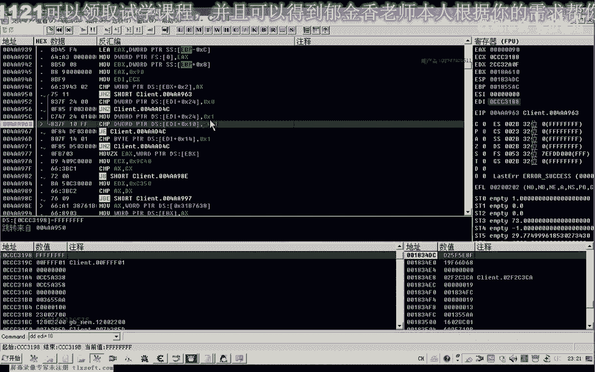

嗯，好的，那么这就是我们这节课呢分析的最终的一个成果，那么主要的是实际上这个机子的话应该是很好找，那么主要的是我们分析的这个啊过程啊，这些嗯，对oad的这些操作呢，呃大家要经常的把它熟悉一下，嗯嗯嗯。

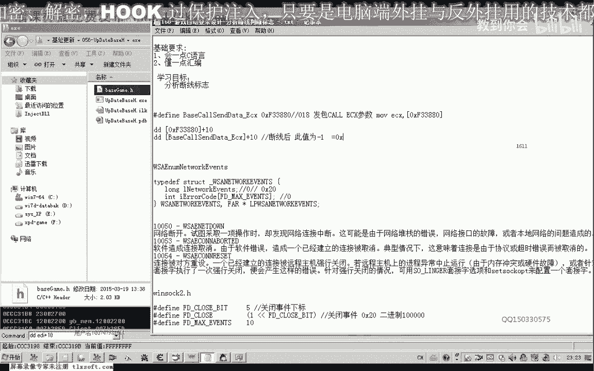

那么这一节课的分析呢。

我们就到这里，当然我们还可以进一步的用我们的c a e来来证实一下。

我们的这个想法，那么这个时候呢我们看一下啊，这是套接字的这个具体，那么如果掉线的情况啊，他肯定呢嗯这个数值呢就会为-1，啊这个时候呢它的数值呢马上就变为了-1啊。

这里的这个相应的这些图像呢也没有刷新出来，那么所以说我们只要读这个机子，读到它它的这个数值为-1的时候呢，我们就可以了嗯，当然我们是有符号数数，带符号数量是-1，那么如果是这个d word的类型呢。

就是啊八个这个f或者是十进制的话，就是这个4294967295，那么这个数值，那么好的，那么如果是出现这种情况的话，我们就可以直接的终止掉这个进程，那么关于相关的这个代码呢，我们下一节课一起来编写。

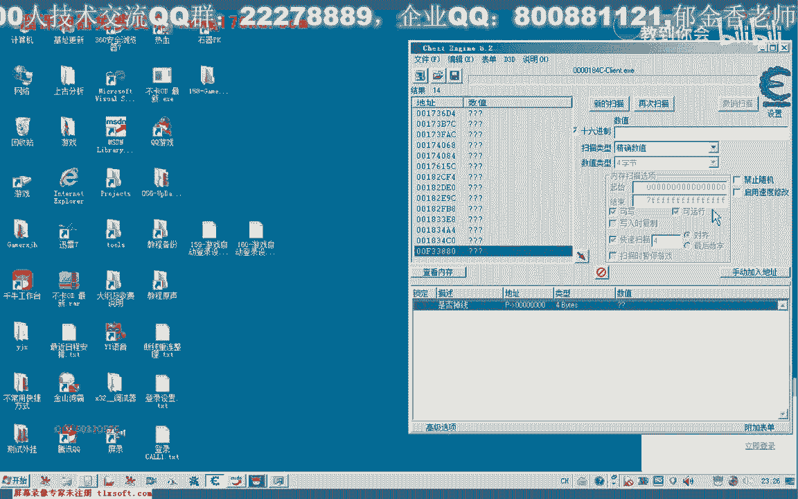