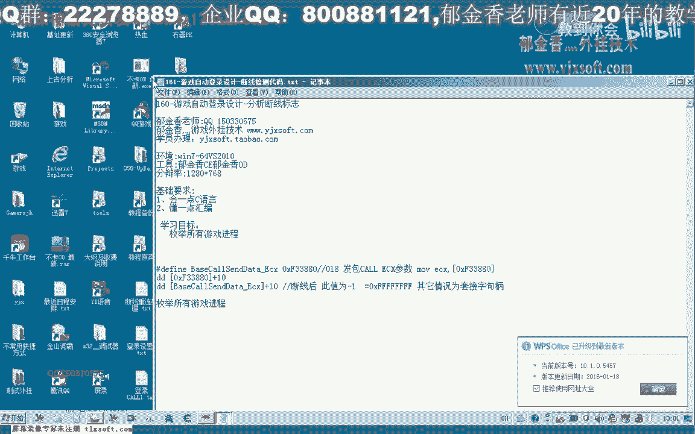
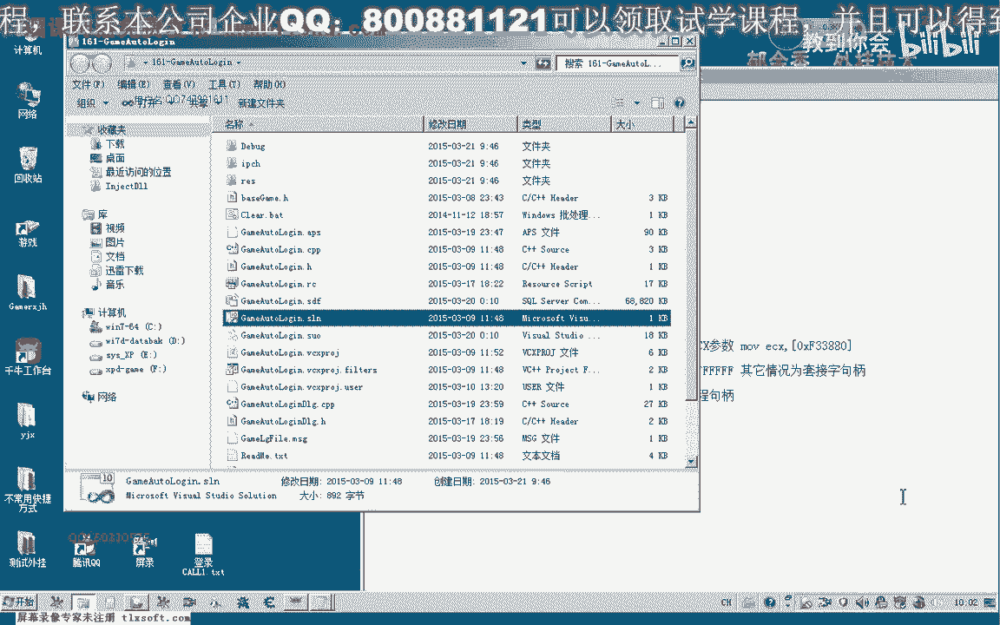
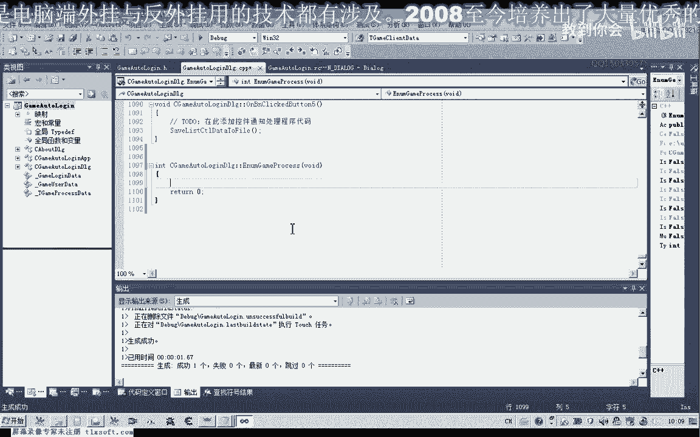
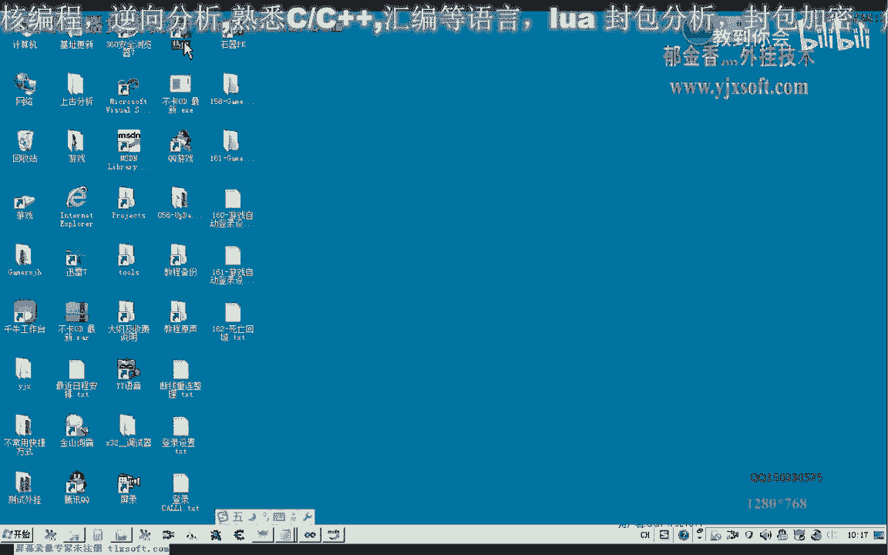
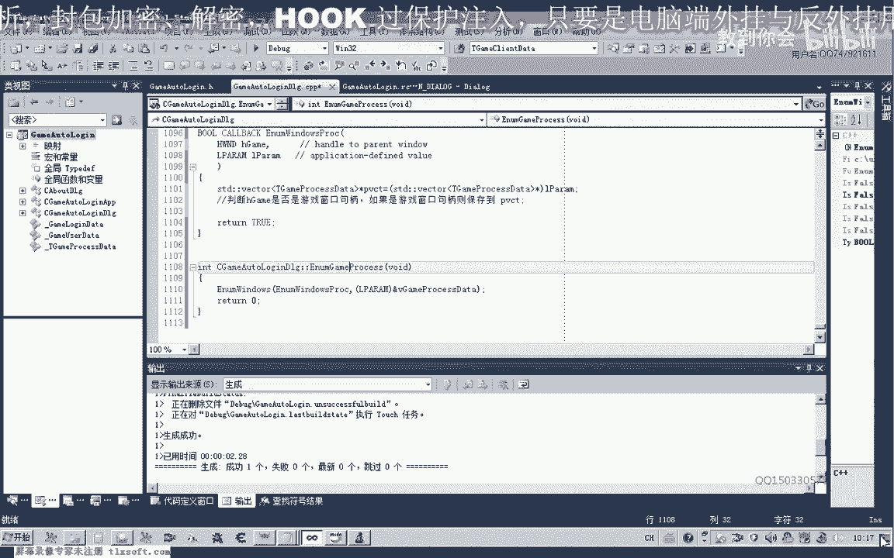
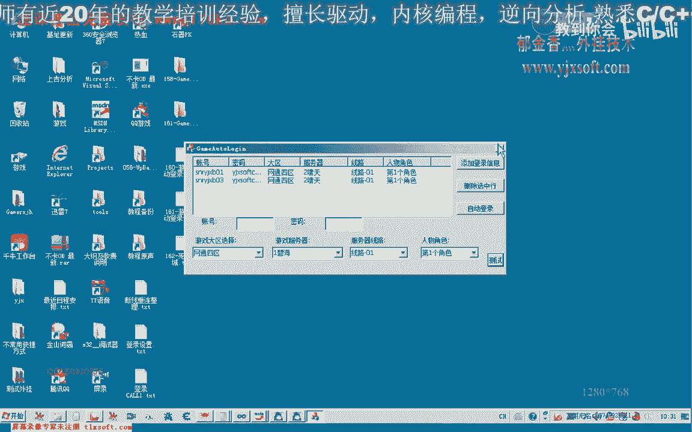

# 郁金香老师C／C++纯干货 - P150：161-游戏自动登录设计-遍历所有游戏进程-遍历所有游戏窗口 - 教到你会 - BV1DS4y1n7qF

那么这节课呢我们设计呃断线检测的这个代码啊。

也是自动登录呃的一部分，那么首先呢我们是要骗你所有的游戏，窗口啊，那么骗你这个所有的游戏窗口呢，我们可以根据它窗口的这个呃聚品，然后来获得这个进程的i d，然后呢才能够去读取它的一个呃。

就是说在线的一个状态，那么如果按这个数值呃等于-1的话，那么这个时候呢我们实际上就是检测到它的一个掉线状态，那么原理就是这样，那么首先呢我们需要枚举所有的游戏进程，那么我们在之前呢可以枚举，游戏窗口。

那么从游戏的窗口呢，然后呢再得到所有的这个游戏的进程，具体，应该是这样的一个过程啊，好的，那么我们也是打开158克的代码，打开之后呢，我们首先设计一个函数呃。

用来骗离我们所有的这个游戏的窗口，那么为了方便地使用它的这个呃窗口的控件哈这一类的，那么我们把它添加为这个类的一个成员函数，那么这里的话参数呢我们暂时呢呃可以不需要，那么直接呢我们就添加一个这样的函数。

用来了偏离所有的，这个窗口句柄，然后我们在这个成员函数里边呢添加我们的，或者是添加一个全局的变量啊，breakt用来存放我们的，用来存放我们的这个窗口句柄，那么我们在这里呢建立一个结构吧哈可以说是。

那么第一个呢我们这个结构里面呢包含的是游戏的窗口，具体那么第二项的话，我们在这里的包含的是体系的相应的这个进程的p i d，那么最后这一个呢是呃游戏进程的一个剧评，啊。

然后呢我们用这个这个类型来定义一个全局的一个变量啊，这个变量呢我们把它定在定义在这个路里面，这个我们包包含一下这个wink的，想到，咋了，那么定义好了这个数组之后呢，我们就可以来开始偏离。

把相关的这个数据定义到我们的哦，存到我们的这个变量里面去，然后在这个位置的话，我们可以开始骗离我们所有的这个窗口。

那么首先呢我们可以来来查一下mdn呃。

枚举窗口这个函数的，格式和引用的格式我们来看一下，那么首先呢它有一个可以传一个参数进去啊，这个是可以是一个结构指针，那么也可以是其他的任何的一个数据啊，那么这里呢是一个回调函数。

那么我们主要来看一下它回调函数的这个格式，好那么这里呢是它的一个回调函数啊，这里是窗口的一个距离，那么这是传进来的呃，这个参数，那么在这里呢这个参数我们因为呃定义的时候呢，我们定义的不是一个全局变量。

那么所以说要在这个回调函数里面来使用的话，呃我们需要把这个维克等的这个指针呢给它传送传送进去，好的那我们把这个格式好复制一下，那么如果我们就是说按照他的一个说明的话，这个返回值的话也很有讲究啊。

那么如果要继续的枚举后面的这个窗口的话，他的反馈自然必须是一个增值，那么如果要停止啊这个枚举的话，那么它返回的数值呢是一个价值，那么我们一直返回文针就可以了，哈哈哈，然后在这里的话。

我们呢首先呢要把这个传进来的参数呢呃进行一下转换，八，那么这里呢我们要限制它的这个作用域啊，加上s t d的这个前缀啊，因为我们前面的没有使用这个命名啊通道。

那么在这里呢我们需要把后面的这个参数呢跟他进行一下转换，八，那么这样呢我们就把它的这个返回值来，最后写进这个相应的这个结构里面啊，调用的时候呢，我们呢在这里呢呃简单的写一下啊。

那么第一个呢也就是我们的一个窗口的一个距离，你们问的吗，那么第一个呢是窗口的一个回调函数，那么第二个就是我们的这个维克的一个地址，好首先呢我们编译生成一下，好的那么大大致就是这样一个格式哈。

那么这里呢把我们的需要用来保存数据的呃，进程游戏进程的这个剧评啊，还有这个窗口的i d这一类的信息呢，就保存在这个动态数组里面，然后呢到了这里边呢，他用指针的方式呢对这个呃我们的成员变量来进行一个操作。

那么这里呢我们要加上一些判断，那么判断了我们这个剧评，是否是游戏的窗口区，那么如果是游戏窗口的句柄，那么只要保存到这个动态数组里面啊，不会开通的，那么判断的时候呢。

我们可以根据这个游戏窗口的录影名来进行一个判断。

那么当时这个标题的话，我们进入游戏之后呢，我们会更改它，那么所以说在这里的话，我们呢需要得到得到它，它这个游戏窗口的一个对比，绿的名字，我们把它复制下来。

那么要进行判断的话，首先呢我们要取得这个相应句柄的类的一个名字，那么我们先建立一块缓冲区的，哒哒哒，然后取得了之后呢，我们做一个比较啊，在这里，那么这里实际上我们还要做呃，做一个动作啊。

也就是我们需要来对我们传进来的这个动态数组，来先进行一个清空的一个操作，好那么从这个位置开始的话，我们就可以往里面添加我们的这个元素了，那么在添加之前呢，我们需要呢呃定义一个相应的结构。

那么这次呢我们需要取得他的这个进程的p i d，也是叫相应的api函数，啊，当然还有一个是我们进程的一个相关的一个距离，在这里呢我们对它进行一个初始化，相应的启动，打倒，好的，那么我们再次编译生成一下。

好的这样理论上来我们就可以了，嗯获得我们所有这个进程的这个剧评，那么我们在这后面呢写一个偏离的函数呃，来测试一下呃，相应的这个动态数组它是否被我们初始化了，那么我们在这边的啊测试按钮。

我们把它的属性设置为，visable设置为true啊，考件啊，然后我们在这里测试一下，明白，然后我们对这个动态数组来进行一下偏离的输出，它的所有信息，好的，这里是进程句柄，进程的id，进程的聚品啊。

这是我们窗口的句柄，那么我们再次原因深深影响，真的，那么后面的话这个时候呢我们偏离的话呃，他的这个进程数组呢相当于是为空的，那么在这里呢我们先自动的登录一下，那，好的。

那么这个时候呢我们可以来测试一下我们进程的相关信息，对了我们还少写了一段代码啊，造成了我们的这个呃片也没有成功嗯，因为我们在之前的，这个每一局的这个呃回调函数里边呢。

我们需要把这个相关的元素呢需要添加到我们的动态数组里面，还差这么一步，这个，那么在这里的话我们应当是用来获取这个呃窗口的这个录屏。

而不是获取它的一个标题名，那么所以说刚才这里呢它造成了一个比较的失败啊。

因为习惯性的啊失去嗯，我们习惯性的呢容易去取这个进程到这里，这个游戏窗口的这个标题好，那么这个时候呢我们的进程句柄就出来了，那么我们可以一起转到里面来看一下，这次的它的这个p i d，我们把它排一下序。

一个是529885928这个，那么另外一个呢是3404盘，这是我们的游戏的这个进程，当然这个句柄的话它是随机的啊，实际上我们打开之后呢，它就可以用啊，它在内核里边啊创建了相应的这个呃真实的句柄。

那么这里呢相当于是他的一个具体的一个在内核里面的一个索引啊，这一类的，那么游戏的这是游戏的一个窗口的一个区别啊，因为后面的取得的这个数据都是正确的话，那么这里肯定也是正确的。

那么我们还可以呢呃取得它的一个标题哈，添加到里面去，那么标题呢也就是他账号的这个名字，那么实际上这里我们还可以来继续的话添加一段信息，转到相应的头文件里面啊，在这里呢我们再增加一段信息。

因为这个游戏窗口的标题的话，我们已经改动了很多时候啊，很多时候呢这个游戏窗口标题的按照我们写的思路的话，它就是一个呃游戏的一个账号，来到了，好的，那么我们再次生成一下，同时我们在偏离的时候呢。

代码呢我们打印的信息呢也增加一个游戏的标题，哈哈哈哈。

啊那么这个时候呢他账号的兴起呢也会显示出来啊，相应的这个标题，当然这个有多个窗口的时候呢，肯定它也可以了，嗯，进行相应的一个偏离，那么比如说我们再一次打开一个窗口，因为这个时候多开哈。

只能从这里面来打开一个窗口，好的，那么其他的呢我们就不做过多的这个测试了。

它大致的原理呢都是这样，现在的话相当于我们就已经获得了这个进程的一个，呃相应的一个相关的一个信息，我们所要的啊进程句柄这一类的，那么下一节课呢我们再来骗你读取所有进程的这个在线的一个状态。

那么这节课呢我们就到这里。

好的。