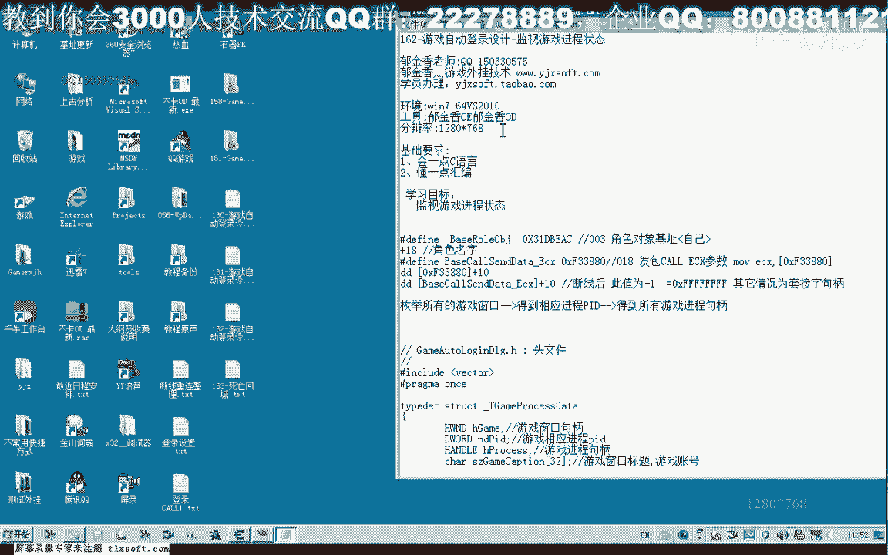
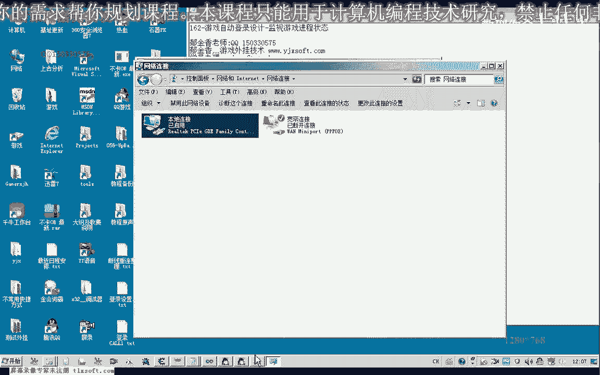
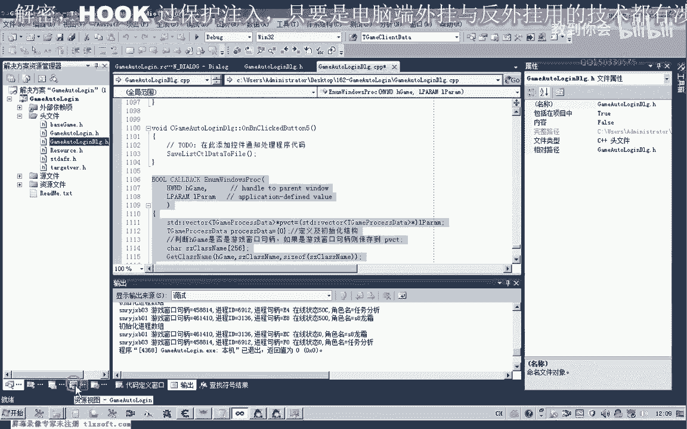

# P151：162-游戏自动登录设计-监视游戏进程状态 - 教到你会 - BV1DS4y1n7qF

大家好，我是郁金香老师，这节课呢我们嗯继续编写相关的代码呃，读出了我们游戏的一个在线状态，以及其他的一些呃相关的信息呢，我们都可以来呃读取到我们的这个结构里面，那么在这里呢我们再次来修改一下这个结构啊。

等会我们直接在代码里边呢进行一个修改，那么首先呢我们打开161克的代码。

哈哈哈哈，在这里呢我们为了方便管理呢，可以把这个机子的图文件呢把它添加进来，然后我们移到资源选项卡，测试这个位置，我们修改的代码的话，主要是在这个回调函数里面修改，那么在修改之前呢。

我们需要先修改一下这个结构啊，游戏进程信息的这个结构，那么我们可以直接转到这个头文件里边来修改，在这里的话，我们另外的建建一个布尔类型的变量，或者是一个呃d word 4字节的一个变量。

用来存放这个套接字啊，游戏里边的，那么也就是一个在线状态啊，实际上也是，啊然后呢我们在后边呢还可以呢呃显示一些其他的信息，比如说我们游戏的这个人物，角色的这个名字，这些呢我们都可以把它读出来啊。

那么人物角色的话最多32级，20多个字节来应该就够了，一般来说的话它支持呃五六个汉字的一个位置，那么所以说这里的话32个自己足够用了，我这角色一次，当然其他的信息如果有用的着的呢，也可以读取啊。

比如说血量啊这些啊，人物的一个死亡状态啊，这些呢我们都可以的把它读取出来啊，这个看领域程序了，怎么设计好的，那么这里呢只是举个例子啊，那么细节上的呢自己去实现一下，那么定义了这两个标志之后呢。

我们可以来借助了在它的弧调函数里面来进行一个修改，获取游戏标题之后呢，我们就可以了，在这里呢读取游戏啊，在线状态，然后来读题游戏冷落角色的手，那么前面我们已经有了这个进程的句柄。

在这个位置呢我们可以直接用the real process慢慢来来读取，那么第一个位置的话，这里呢就是它的一个机子，首先呢我们需要把它转换成一个指针，bicycon s的代替啊。

这个然后呢我们需要建立一个缓冲区来读取啊，这个指针在这里呢，我们在前面哈进行了一个d word类型的来读取这个尺寸，那么另外再建一个变量来读取它的一个数据，那么读取的都是四个字节在这里。

那么后边呢我们不需要和他实际读取的这个字节呢，我们不需要啊，直接就省略掉，然后呢我们再次读取，那么这个指针读出来之后，我们需要再次加上一个偏移来读取，哈哈哈。

因为它的这个偏移加上16进制的一零才是最终我们套接字的呃，这个地址，那么我们读出这个套接字的内容啊，这个时候，那么我们先编译一下，看有没有错误，那么有错误的话，我们及时来排除这个错误。

好那么这样的话如果是正常的情况下呢，我们就能够把对了，我们还需要一个缓冲区啊，在这里第八分，那么读出来之后呢，我们就可以如果是正常的情况下，我们可以直接来把这个数字来写到我们的这个标题里面去。

呃但是为了方便啊，就是说这里的设计的话呃为了一个可读性呢，我们最好的是呃我建议把这个地方呢把它设设置为一个布尔类型，我们都知道布尔类型的话就就是一个零和一个非零的一个状态，那么零的话就表示呃不在线。

那么在线的话就是一个非零的一个状态啊，但是这样设计的话，但是我们游戏里面呢它掉线的时候呢是-1，那么所以说在这里的话，我们还需要转换一下，那么如果这个buff的值，那么等于-1的情况下呢。

我们把它设置为一个掉线，知道知道你打的，那么这个变量命名的时候呢，nd来表示呢，它实际上还是一个四字节类型的啊，只是说变量的名字啊，类型在定义的时候定义的布尔类型，那么实际上这个大的这个不行呢。

它实际上同样的是一个整数，它的空间呢同样是四个字节的，那么在这里呢我们把它复制为呃掉线的情况呢，在线状态呢就只为fx，那么其他的这个情况，那么我们就可以不管他啊。

嗯直接的应该是复制为这个读取出来的这个八分，啊读取出来的好介词，好那么这样的话我们就能够正常的把在线状态来读取出来，那么另外我们还可以读取其他的信息。

那么这里呢我以这个游戏里边啊人物角色的这个名字来为例为例，来说明一下哈，读取其他数据的情况，那么人物角色的话，我们这里呢不是我不确定，然后呢我们也也是读取它的机制指针，读取出来之后呃，他的这个偏移的话。

在一八这个位置，名字的这个偏移，但是这里的话呃缓冲区的话，我们用这个四字节的显示是不够的，那么我们直接来把这个人物角色的啊名字的这个缓冲区来个map，32个字节的这个数据来跟它传送进进去。

当然这里呢肯定就是读取32个字节，那么可也可以用三个of来表达，因为我们在这里的话，为什么不去判断这个游戏里面的这个人物名的长短啊，因为这是完全是没有必要的，我们可以直接的尽可能多的读取这个字节啊。

几十个字节，20个字节实际上也是足够了啊，因为在读取的这个字串里面呢，它自动的就有这个字串的一个结束标志，所以说这个多读一点这个缓冲区数据出来了也是没有问题的，好那么这样的话我们就完成了。

我们注意一定要在这个啊put it back之前来读取这些信息，如果这个在后面去的话，他就加不进去好，那么读取成功之后呢，我们在测试的时候呢，可以呢把这些信息呢把它打印出来，那么嗯在线状态。

还有就是一个人物的一个名字，那么就是这两项啊，首先呢我们生成一下啊，编译生成，那么接下来的话我们就可以进行相关的测试。

那么首先呢我们自动登录一下，那么自动登录的这个过程有点慢啊，我就把这段过程呢先把它屏蔽掉啊，等它正常的登录之后，那么我们再来做一个测试，好的，那么登录成功之后呢，我们来读取一下啊相关的这个信息。

那么这个时候的话我们在线的状态啊，实际上它也出来了，但是呢这里呢我们是用十进制来显示的，我们还可以把它改一下啊，在线的状态呢我们用16进制来显示一下。

啊实际上这个呢就是我们的套接字的一个句柄，这是窗口的句柄进程的这些我们都可以在里面可以看一下，31366912哈，说明我们所有读取的这个信息呢都是正确的，那么我们再来测试一下啊，掉线状态下的啊。

这个检测看它能否检测到，当然也可以，你可以把这个网网线来把它拔掉啊，或者是路由器关掉，再来做这个相关的这个测试好，那么这个时候呢已经显示了呃。

断开，我们注意这里要调试信息，那么这个时候在线状态的话，就是您啊也就表示了啊，没有没有在线嗯好的，那么这节课的代码编写呢，我们就到这个地方嗯，那么下一节课呢我们再见，那么同时还有一个问题。

自动登录这里呢，我们会卡这个窗口啊，不能够操作这个窗口，我们可以来啊，把这个函数来放到我们的线程的原因啊，这样呢它就会卡这个窗口啊，那么这个呢大家自己下去完成一下，用这个cp se。

那么用这个函数去创建一个独立的线程，那么它就不会被影响到我们这个窗口的这个界面啊，也就不会有这个呃呃卡掉啊，窗口界面的这个这个动作好的，那么这节课呢我们就到这里。

