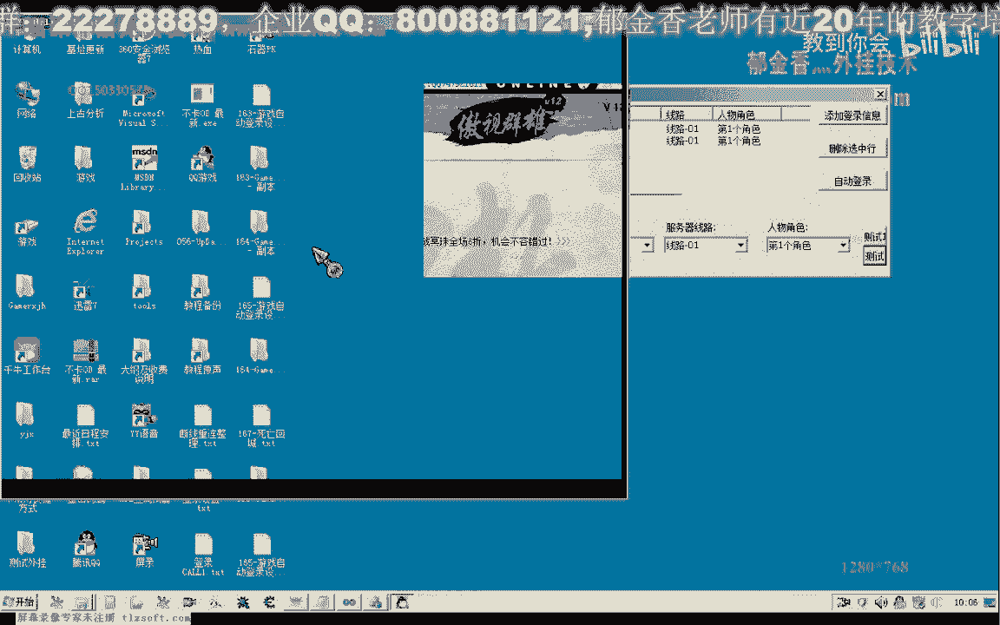

# P154：165-游戏自动登录设计-完善掉线重连功能-进程退出检测 - 教到你会 - BV1DS4y1n7qF

大家好，我是徐吉祥老师，那么这节课我们继续完善掉线重连的功能，那么这节课呢我们主要增加一个对已经登陆的这个账号的进程，它的一个异常退出的一个检测啊，那么首先呢我们打开165克，160 64克的代码。

那么首先呢我们找到啊离线登录的这个函数，那么我们也把它的功能呢加在这里边，那么之前呢我们是找出来他已经登录之后，这个进程呢它本身呢是在运行的啊，呃就是说他已经掉下啊这种情况的一个检测。

那么另外还有一种情况呢，就是这个呃进程呢他就是说已经由于某种原因，可能是由于我们手动的，那么可能也是由于登录的时候呢，他异常的已经在退出了这个登录账号的进程呢，它已经不存在了。

那么也就是说我们指定的账号，我指定的这个账户呢为正常的登陆，那么也可能与这种情况呢也是瑞士的，那么所以说这种账号的话，它没有正常的登录了，我们需要重新的跟他登录一下。

那么所以说我们需要来写一段代码来进行一个检测，那么这是之前的一个离线的一个检测，掉线啊，检测结束，那么这里呢我们检测为正常登录的这个账号，那么也可以这样的理解，或者是已经异常退出的这个进程。

那么我们来看一下它相关的代码，那么在这里呢我们首先呢第一个相应的呃，这个数组变量用来保存一个呃指定账号的一个运行的一个状态，那么如果指定的账号它已经正常的就是说登录了啊，不管它是掉线还是未掉线。

只要他是正常的啊，这个账号登录之后呢，只要这个进程还在运行，那么我们在这里呢这个数组里面呢，我们就给他啊，是一个增值啊，那么如果这个账号呢他没有指定的呃进程在运行，也就是说它未正常的登录了。

那么我们给它起一个假设嗯，好的，那么首先呢我们是依次来骗离我们需要登录的这个账号的数据，那么这个账号数组呢，比如说我们先从这个里面的账号一啊，那么取出来之后，我们保存到这个指针里边。

然后呢我们把这个指针里面的这个user类啊取出来，与我们这里的啊，重新的就是说已经在运行当中的这个进程账号来进行一个比较，那么如果整个这个循环，整个在运行当中的这个账号呢，我们都查找遍了。

都没有找到我们需要登陆的这个账号的话，那么说明这个账号呢他已经呢就是说呃异常退出了，或者说这个账号呢为正常的登录，那么如果找到了哈，在里面呢，我们这里呢正常登录的，那么我们做一个啊正常登录的一个标记。

那么等这两个循环完成之后呢，那么所有正常登录的这个账号的话，我们来都会在这个数组里面呢有一个对应的一个标记，那么接下来才是最关键的一个地方，接下来我们再次用一个循环，来检测这个标记数组。

那么这个标记数组呢我们呢主要是还有一个下标的一个限制，它的一个限制的话，就是我们的这个需要登录的这个账号的数组的一个大小啊，这里的一个size啊，零到size，注意这里不能加等号啊。

因为它的下标是从零开始，我是从一开始的，那么这样我们去偏离它，那么如果他指定的账号，他，未在线，或者说这里呢我们，等于fx，那么也就是说不在线这个条件未正常登录，哒哒哒哒哒，那么或者说另外一种说法呢。

就是说登录的这个账号信息的啊，这个进程呢以及异常退出相应进程，啊相应的包含了这个账号信息的进程呢已经异常退出，当然这里边取出来的呢，我们做了这个比较之后呢，他能够得到一个相应的呃数组的一个下标啊。

就是之前的，那么这个下标就是我们之前，实际上这里呢我们没有保存它的一个下标啊，就是我们在骗你的时候，他指定的这个账号的一个下标，但是这个下标呢我们可以通过这里的一个判断呢重新把它取出来。

当然我们也可以在这里设计的时候呢，直接保存相应的这个下标也是可以的，但是我们不用多此一举，那么直接在这里呢它等于fs的时候，就说明了它相应的这个账号呢已经异常退出了，那么遇到这种情况的话。

我们相应的账号呢就需要啊看这个接下标，我们直接就把这个用下标的表示方法，来取出这个动态数组的相应的这个元素，把它的分区账号密码啊重新取出来，存放到这个logo det里面。

然后呢我们重新的进行一下登录的一个链接啊，那么这里呢我们也需要改一下哈，嗯上一节课我们已经流血啊，bpm dex好用这个函数来改一下，那么我们这里呢也需要来获得一个可用的一个客户端的一个路径。

所以说这需要改，好的，然后呢，我们保存一下，重新生成，那么还有一个地方呢我们也可以做一个更改，那么上一节课呢我们呃说到了这个有一个指定进程，如果他已经结束了哈，那么呢我们就不需要再去等待。

那么这里呢我们另外写了一个函数，用来判断我们的游戏进程呢呃是否正常的在运行，那么它的原理呢也就是去读取我们的这个窗口句柄，那么如果读取的这个数值啊，它返回值为零的话。

那么说说明的话就是说这个指定的进程呢已经关闭了，那么如果读返回的数字是非礼，那么当然了，我们就是那个游戏进程了，他正常的运行，当然我们也可以加上后面这段代码啊，他可以的呃。

更详细的给出一些这个错误信息好，那我们就把它先放到前边，那么这一段呢是可要可不要的啊，也可以把这段注释来取消掉，也是可以的啊，那么在这里的话。

12b呢他表示了实际上就是这个windos的他只完成了一部分啊，那么另外一种你x6 的话就表示我们的呃传传送的这个剧本的话，它是一个啊五个效的一个句柄啊，那么这两种情况的话。

我们都返回这个fans都直接返回就行了啊，但是这个显得有一点多余啊，那么只是呢我们这样呢可以了，更清楚的了解这个标题，mau啊，这个获得最后的一个出错的一个代码啊，这段加上不加上都是可以的。

好那么这一段的话我们需要在什么地方用呢，我们需要在这个读取人物信息的时候啊，使用，嗯那么这里我们上一节课说了，要检测指定进程是否在运行啊，那么实际上也可以根据它的一个反馈值。

那么只是说我们在这里另外写一个函数呢，啊从性能的封装上来可能要好一点，那么如果我们在这里检测哈，它指定的进程都没有在运行当中已经退出了，那么我们这里的话就没有必要再去等待啊，几分钟的时间啊。

这里一直要等待两分钟的时间，那么呢我们就可以马上的返回，马上的反馈，好的，那么我们再次测试一下，那么首先呢这两个账号我们自动登录一下，来，那么这个时候好像是选线的时候刚出来一点问题。

可能是等待的时间不够还是还是什么问题，那么测试的时候呢，我们最后来把这个360这一类的话，我们把它退掉，那么这个时候来登录失败了哈，继续登录第二个，那么我们看一下，好孩子。

好那么第二次登录的时候登录成功了，那么这个时候呢我们就来测试一下我们的离线登录呃，离线登录的代码我们看有没有添加到零去，我这个时候呃要做一个离线的登录的话。

一般我们是用定时器或者是在在一个单独的线程里面开始啊。

那么这里是我们断线重连的底线登登录，那么我们再次测试一下啊，那么这个时候呢我们发现了，他马上就应当是发现我们第一个这个账号了，呃，这个进程呢没有运行，所以说呢他也把它重新的进行一个登录啊，账号机。

那么这个时候呢相当于进行一个补救，那么这个时候的话我们两个账号呢都正常的登录了，当然我们再次去测试的时候呢，由于我们这个列表里面的两个账号都是正常登录的时候，都是正常登录的，所以说它不会有任何的反应。

那么当时当我们这两个账号某一个它掉线了，或者是呃比如说这个账号会有飞机场的呃，非正常的结束掉了，那么我们再次测试的时候，它就会检测到哈，那么检测到这个账号来被正常的退出了。

那么所以说呢他会重新再登录一次，会反复的去检测啊，登录这个账号，那么这个大致是没有问题了，那么还有另外一种情况，就是呢这个他掉线了。

掉线的这种情况呢它又不一样，因为它服务器的话。

实际上呢这种掉线的话，它服务器的实际上它相应的这个套件自然没有关掉，那么所以说造成它检测的时候呢，他第一次登录的话，它不能够正常登录的，这个是分明是我们来看一下这种情况。

那么首先呢它会检测到这个呃零三这个账号呢断线啊，他会去尝试试去重新链接，但是这个时候呢它本身呢也会与我们的这个服务器断开，那么所以说这个时候的话，他的操作呢会造成我们的呃点击的时候呢。

会造成这个相应的账号呢啊都会被关掉，在离线的情况下，好像是操作这个鼠标，它也会被卖掉，那么所以说你看一下这个时候的话啊，只要我们反复的去检测它，它同样的也能够啊，再一次呢正常的登录。

只是说他登录了要重复几次这个时间，因为我们两种状态呢都有检测，一个是掉线的检测一个是进程啊，未正常呃，登录它也会检测没有在运行当中，但是我们要注意这个时候的话。

实际上我们这个窗口呢嗯这个窗口的话它是呃就是说不能够动的，是成一个假死状态，因为我们的这个离线检测的这个函数呢，它没有运行在单独的这个县城里边啊，我们实际上呢我们最好的办法呢。

需要把这个函数呢放到一个单独的线程里面进行一个运行。

这，那我可能是这个时候我们的这个录制教程的这个软件呢，它占用的cpu啊好像也不是很高啊，是我我已经忘了。

好的，那么我们再次检测一次，哈哈哈哈哈，那我可能也是一个网络速度的一个问题啊，我这边链接这个游戏的话比较慢啊，进入这个游戏，那么实际上现在这个整个操作的这个过程的话，它已经是没有任何的问题，这，哈哈哈。

好的这样呢，最终呢它就能够实现我们正常的登录了，那么如果他正常的登录之后，那么我们再单击这个按钮，它不会有更多的作用，但是当某一个游戏它掉下，那么或者是结束之后啊，那么我们再调用它。

它就会自动登录这个未在线啊，为正常运行的这个账号，好的，那么这节课呢我们的内容呢就到这里。