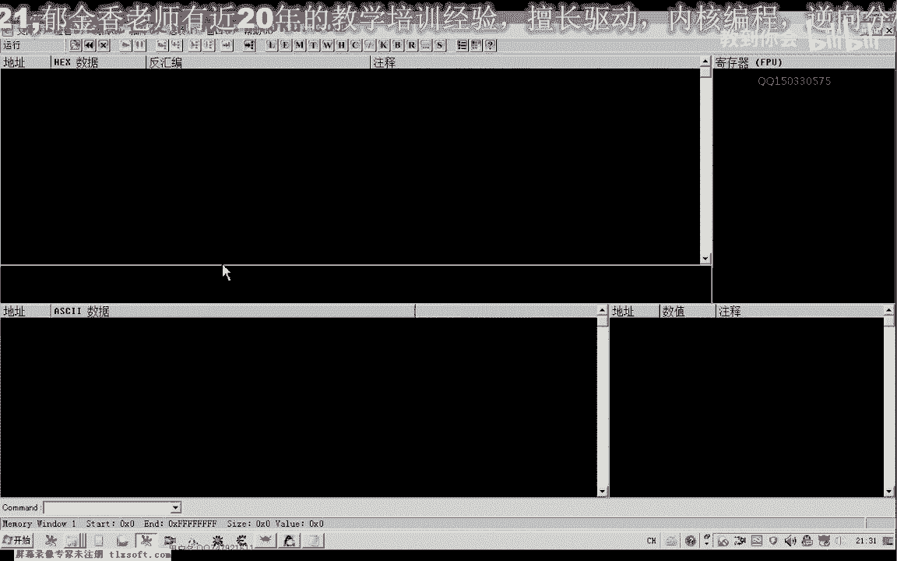
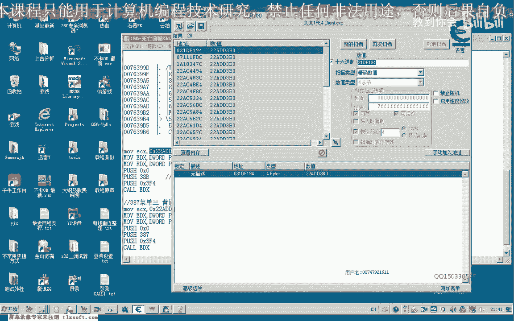
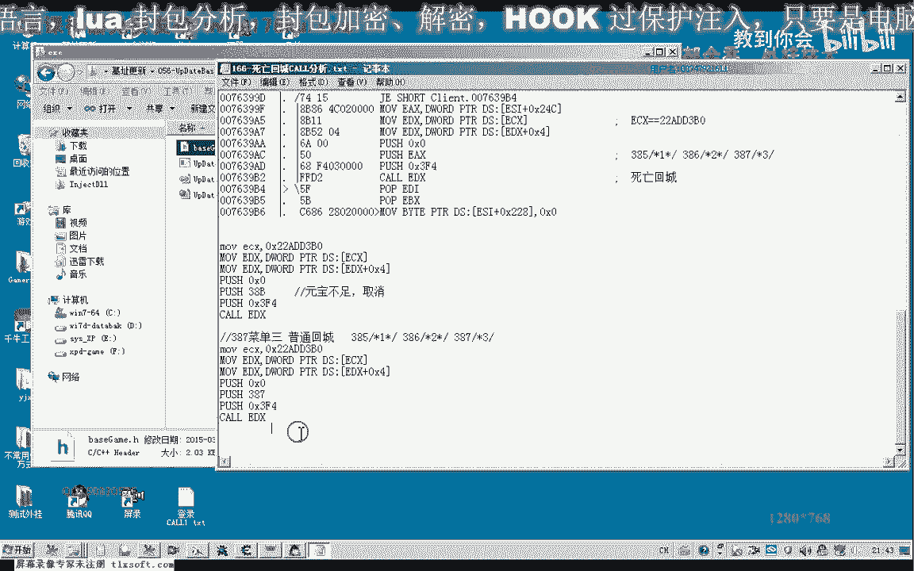
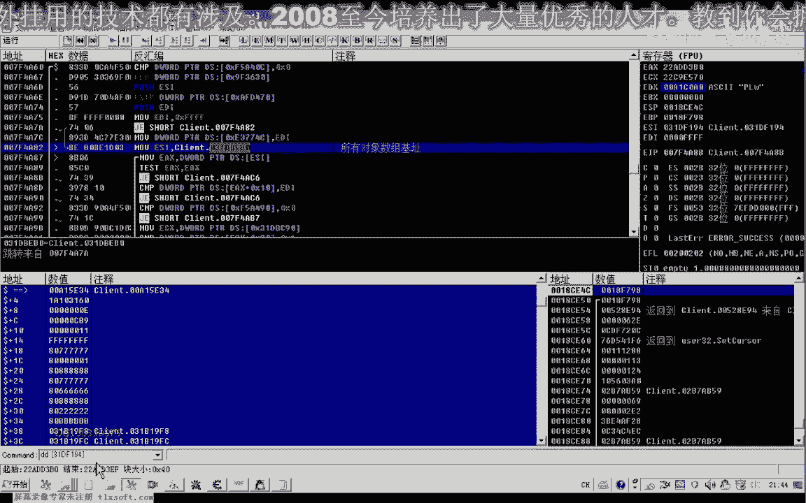

# P155：166-死亡回城CALL分析 - 教到你会 - BV1DS4y1n7qF

大家好，我是郁金香老师，那么今天呢我们一起来分析一下啊，死亡回城的一个分析。

那么我们首先打开我们的ot哈，和强大的游戏里比哈哈。

那么首先我们回程的话，这一类呢他肯定要向服务器发送我们的信息，那么比如说我们直接回城的话，取消了，他也会发一个信息到我们的服务器进行一个相应指令的传送，那么如果是这个死亡保护了，他也会啊发一个包啊。

我们选择的时候先把其他断点进去取消掉。

那么因为他会来去向服务器查询一下我们是否有足够的呃这个元宝，那么有足够的元宝呢，它才能够回城，那么如果这两项啊，因为前面两项都需要查询这个元宝的这个数值，那么如果是在有元宝的情况下。

那么我们这两种死亡回城的方式呢，呃相对比较好分析，那么我们再来看一下啊，下一个断点。

然后我们选菜单机，那么这个时候呢我们有两种方式可以回城啊，一种是选择菜单，那么菜单里边呢他肯定有一项啊，有一项就是应该有一项是回城的啊，那么回程成功了之后呢，嗯它在取消掉我们这个窗口。

那么如果是弧形的指令没有成功的话，也就是没有足够的元宝的情况下呢，嗯那么它就会显示另外的一个窗口出来，那么这个时候呢我们可以一层一层的呃找到我们发包的这个函数，首先那么在这里的话。

我们应该可以再上一层啊，在这个位置呢我们应该就可以通过啊发包啊，直接发包的话就能够进行一个嗯这个菜单一的一个指令的，向服务器发送一个指令，那么如果你足够元宝的情况下，那么呢也是能够回城的啊。

而且不会掉精炼，那么这是我们分析的第一个点子，把它处理下来，但这个的话就不用去测试了，我想的话应该是可以的啊，再次按下ctrl键加f9 键啊，就是菜单里边的执行到返回，那么这里呢也是一个死亡返回的。

一个点，把它复制下来，那么再次按下ctrl f9 会返回到这个位置，那么我们也把它复制一下，然后我们再，次返回到上一层，那么返回到这一层的时候的话哈，这个库呢我们就比较常见的呃，经常在这个地方调用。

那么这个地方的话他说很多地方呢都会断下，会反复的断线啊，所以说这个地方我们就不用考虑，那么我们再倒回来，主要看一下这个地方，那么平时的话它不会断下嗯，只有对我们的窗口进行操作的时候呢。

这个扩了才会断一下，而且它断下的话，不同的窗口呢应该是通过这个窗口的i d啊，就像我们的按钮的一个资源i d一样，它有一个i d的一个编号，用来分别用来区分不同的这个操作。

那么我们再次来看一下我们选择菜单一的时候，它的一个呃它的ip呢是1385，这个时候菜到一我们把它坐实一下，好，那么这是菜单的音，那么我们这里选取消的话是38b啊，也是这个地方。

而且它的e c x的值的话，这个时候呢没有变，把ec x取出来，但是这个取消我们可能用不到哈，这是选单一，选单二的话是386，那么注意一与二之间呢，它只相差了一个数字一啊，那么我们再选择三看一下。

要取消耗，这个时候取消，那么再看一下这个这个菜单的山，在这里的时候，我们按g按下，那么我们发现了他刚好是387，那么所以说我猜测的话，这个地方的话可能就是我们菜单选择的，那么我们先把它复制下来。

这个时候呢已经回到城里边了，我们再次到一个地方，让这个角色呢挂掉啊，死亡了啊，然后呢我们再来测试一下，这个空先写一下，那么首先呢把这几行数据复制一下，那么删掉这前面的特征码，我第一次，到，好的复制一下。

打开我们的代码输入器，那么首先这个ex我们要把初始化是一个对象的地址，我们刚才在这里呢也获得它的数值，不初始化的话，我们调用的话很有可能就会出错，好那么我们再次看到，到这个地方呢。

我们需要等待这个人物角色死亡，那么人物角色死亡之后啊，我们来看一下调用它的这个菜单，那么ex呢我们替换成385，先试一下，那么这个时候呢它就会显示了元宝不足，那么我们在6386再来试一下。

啊那么这个时候呢也有一个元宝播出啊，啊那么这里这里取消的时候好像是38b，啊也是可以的，那么如果元元宝不足的时候要取消来，就是38b，嗯这个我们也把它记录一下，这是元宝不足的时候啊。

那么我们再来看一下啊，还有一个是385，386387就是回城啊取消，那么这个时候呢我们看到呃人物角色来就回城了啊，好的，这里呢它是采到123，哈哈。

那么接下来呢我们还有一点呢就是需要找到这个ecx这个参数，那么我们来找一下，看能不能否找到这个ex的参数机制，那么好像是我们的运气好啊，一下子就找到了一个这个机子，那么我们来看一下那个。

三幺gf 194，看这个对象里面啊。

在我们的o d里边是否能够找到，咳咳咳咳咳咳咳咳，那么我们在用o d的时候呢，我们发现找不到啊，那么这个地址的话可能的话就不是真实的一个低机子啊，那么我们在这里呢能够找到三db啊，一比零。

那么这个是应当是所有对象，那么这说明这个呢它也是这个所有对象数组里面的，那么我们可以从他最新更新的这个机制来看一下。

那么所有对象的找一下，恰好就是这个31d b1 b0 啊，这就是所有对象的啊，那么所以说我们在这里的话，要找这个机子的话，应当要呃到这个所有对象机子里面去搜索，啊，那么这节课呢我们暂时就到这里。

那么我们看一下它这个对象里面存放的是什么，哈哈哈哈，这是所有对象数组里面的对象，那么这是对象里面的相关的这些数据，那么零八这个位置是它的类型，这里是它的id，那么后边呢这里是一些相关的数据。

那么这节课呢就给大家布置一个作业啊，就是想办法取得这个对象的地址mix。

那么只要找到它的这个数值就可以了，也可以编写一个函数，那么也可以用户口什么方法都可以啊，只要能够得到正确的这个e4 x的数值就行了，那么因为这个数值的话，肯定它会每次会变啊。

那么我们要找的就是这一个数字，但是这个三比零的话，游戏从重新启动的话，它应当是会变的啊，我们可以试一下，好那么这个我们在下一节课呢再测试了。

