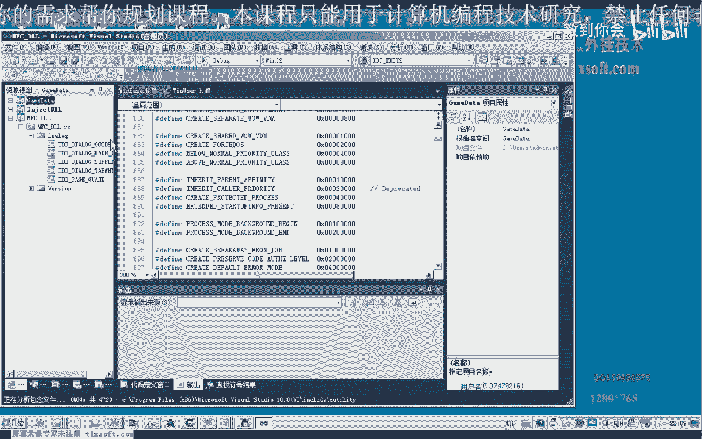

# 郁金香老师C／C++纯干货 - P156：167-死亡回城CALL参数分析(定位动态基址)及函数封装 - 教到你会 - BV1DS4y1n7qF

大家好，我是郁金香老师，那么这期课我们一起来分析一下，死亡回程，或者相关的参数，那么上一期课我们分析到这里的时候，EZX这个参数它应该是变化的，比如说我们重新登录一下游戏，那么重新登录游戏之后。

我们用Nokia附加到游戏里面，然后转到我们死亡回程的这个地址，转到这个地址之后。

我们再来看一下它的EZX的一个数值，那么这个时候EZX的数值的话，与我们上一期课所显示的数值的话，肯定就不一样，那么所以说我们，但是我们要来找一些相同的地方，那么我们看一下对象里面的数据。

复制一下对象的数据，那么这个数据，然后我们与上一期课的数据来进行一些比较，那么我们现在来看一下对象的数据，那么我们注意一下，从这个位置这个地方开始，那么我们发现它第一行的代码它没有变。

还有类型肯定没有变，没有变的这个地方，我们给它做一个标记，那么还有摇摇这个位置也是没有变的，这个地方，那么变的话有+4这个地方变了，这个地方没有变，当然下边的话这里看不太出来，这个地方也没有变。

那么这两个的话它应当也是一个某一个机制，我们可以搜索一下，我们看一下对象它是否是在所有对象里面，在31118这个地方，搜一下，再搜一下这一个数字，那么我们发现的话，这两个的话都是一个机制。

但这两个机制的话，我们暂时不知道它是一个什么意义，这两个机制里面，那么后边我们就可以暂时不去看它，40这个地方是0，44，那么后边我们就不用去看，就看前面的这些的话应当已经足够了，那么这里它是两个机制。

我们首先可以判断这三个地方应当是比较准确的，但是这个机制在游戏更新之后，它肯定也要变，但是这个机制我们可以通过这一类的特征，先把它定位出来。

或者找一下我们看是否跟我们已有的一些机制是相同的。

那么如果是跟我们已有的机制相同的话，那么我们在这里的话可能就更容易定位，那么我们找一下有没有这个机制，那么在这里是找不到的，另外一个机制我们看一下，那么也找不到，接着我们看一下这一个。

那么这个的话我们记得有一段代码，那么我们再按减号退回来，那么这里有一个代码是ezx，然后取出来之后，实际上就是EDX了，但是它又把EDX加了4，加4的话实际上就是再取出来是死亡回程的，那么我们再看一下。

它的这个CoreEDX的话指向的是这个Core的地址，那么这个Core的地址的话也是可以定位的，那么这里它有一个ezx取出来，加上4，那么这个地方取出来，它应当是等于我们的Core的地址。

那么我们再来看一下，那么恰好这里面是放的一个Core的地址，这里是放的6E6A50，这个地址的话，它与我们的另外有一个地址应当是一样的，与我们的对象角色所指向的Core的地址它相等。

那么我们把这里面的对象角色的地址给替换一下，那么它同样也是指向4E6A50这个地方，这里EDX是6E6A50，这好像不一样，我们看一下有没有Core的一个地址，那么Core的地址的话也可以做一个判断。

我们可以进到Core里面去看一下，有没有一些特殊的一个指令，比如说它头部这里有一个280z，那么这个长量的话可能是一个树竹的一个大小这一类的，那么特征码的话也可以作为一个判断，那么我们可以这样计算。

你这个280z作为一个特征码来定位它，那么这个280z我们看要怎么取出来，1234，恰好又是加上四字节，那么这个280z的话就是我们的ECX+4，然后再加4，这样取出来的就是280z。

但是我们再按减号退出来看一下，在这里再下段，那么看一下我们的ECX，然后这里来取出来，再加上一个4，我们看一下EDF0这个地址还没有算出来，这里多加了一个括号，这样加4。

这个时候的话我们用DP来显示一下，恰好就是280z，那么这里我们把它替换成ECX作为一个条件，那么最终的话也就是我们说的这个地址，等于280z，那么这个应该比较靠谱，这是第一个。

那么在这个我们的ECX+8这个地方，这里应当等于我们的Linux0e，当然这个的话应该是ID了，可能会变的，那么来说11这个暂时也不肯定，那么最肯定的应该是这两个，这前面这两个。

那么我们先试一下编程之后来尝试一下，用这两个是否能不能够定位到一个唯一的一个ECX对象，如果能的话后边这些数据对于我们来说就没有用了，如果不能的话，那么我们可以加上383z这些偏移，想办法取得。

再来进行定位，那么好的。

我们来看一下，打开我们139克的代码，那么首先我们也把最新的机子把它切换进去。

然后移到我们的测试的页面。

那么在这里，我们来骗您一下我们的死亡扩的ECX，直接或者直接就是测试按钮这里进行我们相应的测试，那么我们现在需要写一个函数，这个函数，首先要骗你所有对象，那么所有对象列表的话，它有一个相应的一个大小。

我们看一下之前的骗你所有对象的，有一个，输一下，现在到，我们来看一下，我们把这些对象列表的相应的大小，我们要把这个数据放到我们的计算机里面，那么我们再来看一下，我们把这个数据放到我们的计算机里面。

那么我们现在看到的这个数据是我们的最新的数据，这里所有对象的大小是2700，好的，那么这里也是一个骗你所有对象的代码，我们把这段代码复制一下，我们把这个数据复制一下，我们把这个数据复制一下。

我们把这个数据复制一下，我们把这个数据复制一下，我们把这个数据复制一下，我们把这个数据复制一下，我们把这个数据复制一下，我们把这个数据复制一下，我们把这个数据复制一下，我们把这个数据复制一下。

我们把这个数据复制一下，我们把这个数据复制一下，我们把这个数据复制一下，我们把这个数据复制一下，我们把这个数据复制一下，我们把这个数据复制一下，我们把这个数据复制一下，我们把这个数据复制一下。

我们把这个数据复制一下，我们把这个数据复制一下，我们把这个数据复制一下，我们把这个数据复制一下，我们把这个数据复制一下，我们把这个数据复制一下，我们把这个数据复制一下，我们把这个数据复制一下。

我们把这个数据复制一下，我们把这个数据复制一下，我们把这个数据复制一下，我们把这个数据复制一下，我们把这个数据复制一下，我们把这个数据复制一下，我们把这个数据复制一下，我们把这个数据复制一下。

我们把这个数据复制一下，我们把这个数据复制一下，我们把这个数据复制一下，我们把这个数据复制一下，我们把这个数据复制一下，我们把这个数据复制一下，我们把这个数据复制一下，我们把这个数据复制一下。

我们把这个数据复制一下，我们把这个数据复制一下，我们把这个数据复制一下，我们把这个数据复制一下，我们把这个数据复制一下，我们把这个数据复制一下，我们把这个数据复制一下，我们把这个数据复制一下。

我们把这个数据复制一下，我们把这个数据复制一下，我们把这个数据复制一下，我们把这个数据复制一下，我们把这个数据复制一下，我们把这个数据复制一下，我们把这个数据复制一下，我们把这个数据复制一下。

如果前面这个条件达成了，如果前面这个条件达成了，我们再来取第二个条件，(读解中)，(读解中)，如果到最后我们都没有找到的话，如果到最后我们都没有找到的话，如果到最后我们都没有找到的话。

证明的话就未找到这个窗口，证明的话就未找到这个窗口，就是失败的，就是失败的，就是失败的，就是失败的，就是失败的，那么还有一个了，那么还有一个了，那么还有一个了，我们是要找到这个280z。

我们是要找到这个280z，我们是要找到这个280z，(读解中)，(读解中)，(读解中)，(读解中)，我们修改的应该是这下边的这个框，刚才修改错了地方，那么我们来看一下，这个的4循环应当写在这里。

那么我们需要在这里来要取出对象+4+4，这个地方的数值，那么我们在这里再定义一个，ID=4X4，或者在这里我们嵌入一段规编，这样的话可能会更好一些，那么我们在这里再定义一个，ID=4X4。

或者在这里再定义一个，ID=4X4，或者在这里再定义一个，ID=4X4，或者在这里再定义一个，ID=4X4，或者在这里再定义一个，ID=4X4，或者在这里再定义一个，ID=4X4。

那么这个时候我们取出来之后，再进行一个判断，那么这个时候我们再来看一下，ECX的数字来是否找正确了，好的。

那么我们测试一下。

那么我们测试一下，好，那么我们测试一下，好，好，好，好，好，那么我们发现这个时候找到的对象的话，还真的不止一个，说明的话，我们实际上要找的应当是这一个，2001070好像是这个还是这一个。

也就是说我们现在的一个判断的话，还不具有一个唯一性，那么我们再来看一下，他们究竟有哪些相同，哪些不同，再加上10这个，判断一下，加8这个判断，再判断一个+10的，加10的，好，好，好，好，好，好。

(音樂播放)，(音樂播放)，(音樂播放)，(音樂播放)，(音樂播放)，(音樂播放)，(音樂播放)，(音樂播放)，(音樂播放)，(音樂播放)，(音樂播放)，(音樂播放)，(音樂播放)，(音樂播放)。

(音樂播放)，(音樂播放)，(音樂播放)，(音樂播放)，(音樂播放)，(音樂播放)，(音樂播放)，(音樂播放)，(音樂播放)，(音樂播放)，(音樂播放)，(音樂播放)，(音樂播放)，(音樂播放)。

(音樂播放)，(音樂播放)，(音樂播放)，(音樂播放)。

(音樂播放)。

(音樂播放)。

(音樂播放)。

(音樂播放)，(音樂播放)，(音樂播放)，(音樂播放)，(音樂播放)，(音樂播放)，(音樂播放)，(音樂播放)，(音樂播放)，(音樂播放)，(音樂播放)，(音樂播放)，(音樂播放)，(音樂播放)。

(音樂播放)，(音樂播放)，(音樂播放)，(音樂播放)。

(音樂播放)，(音樂播放)，(音樂播放)，(音樂播放)。