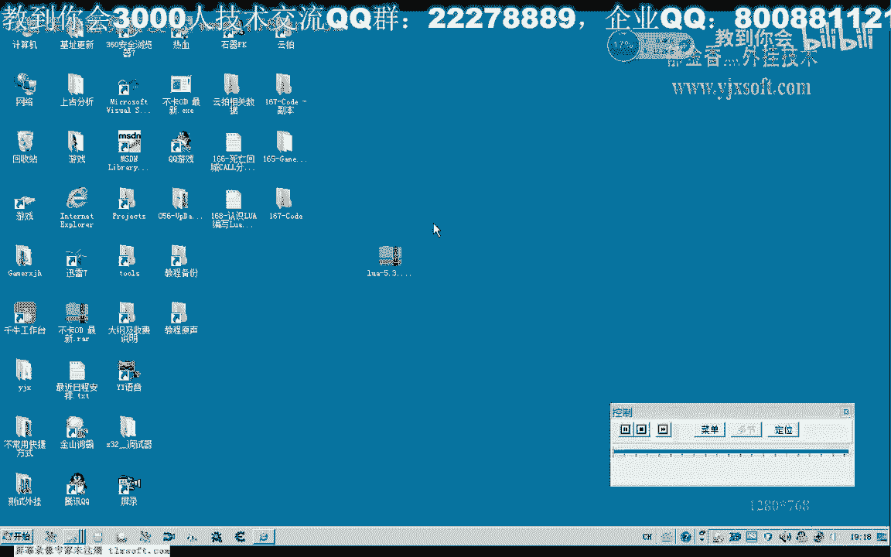
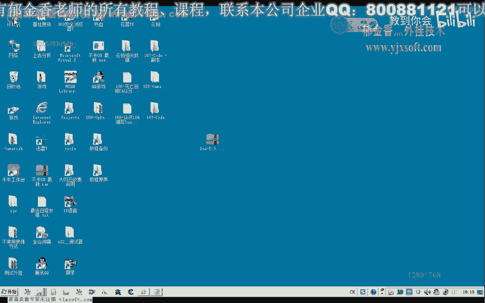
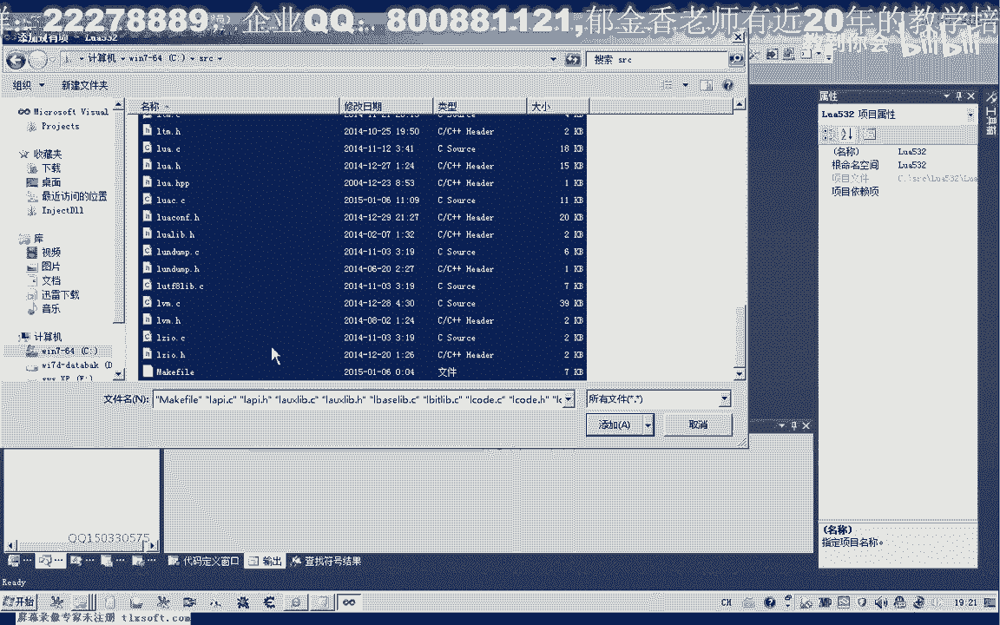
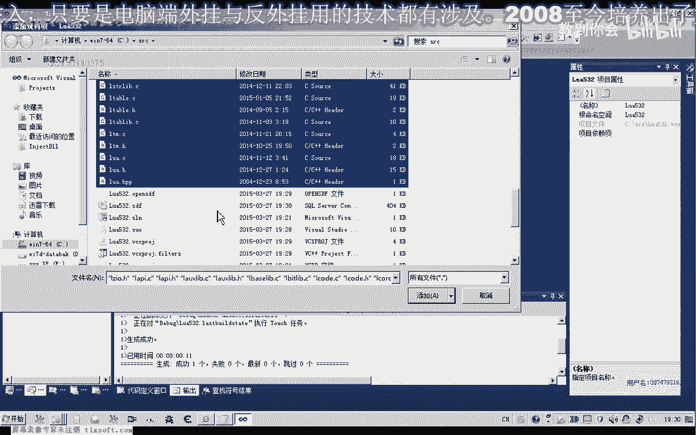
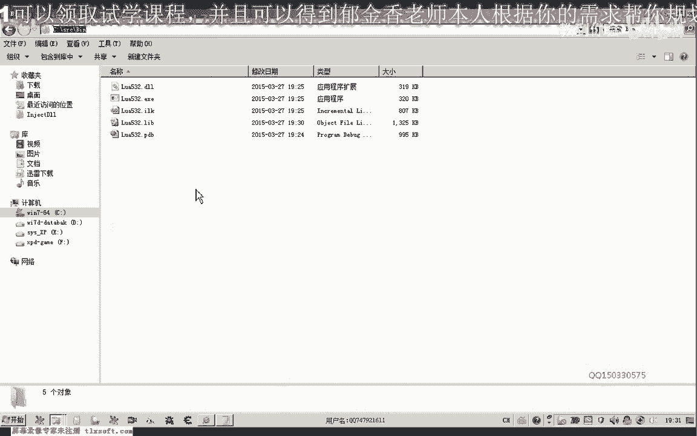
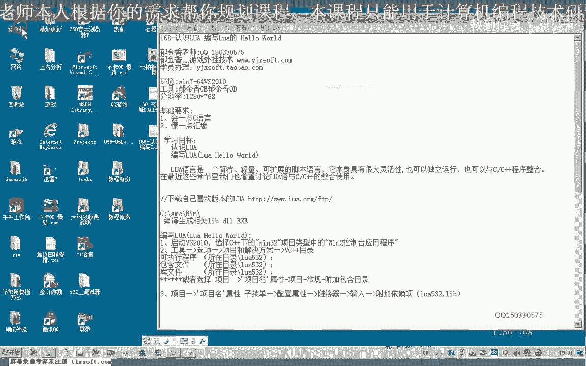
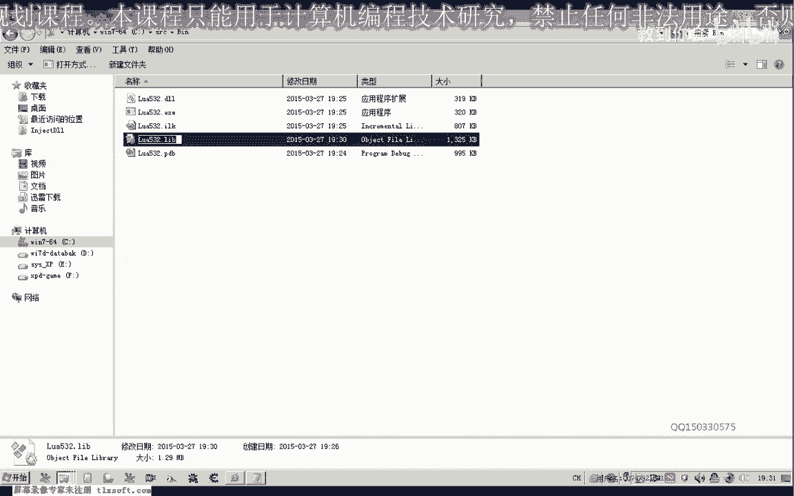
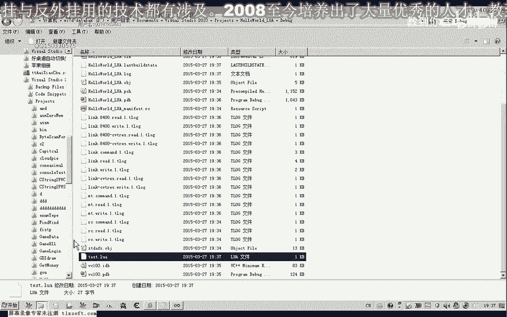
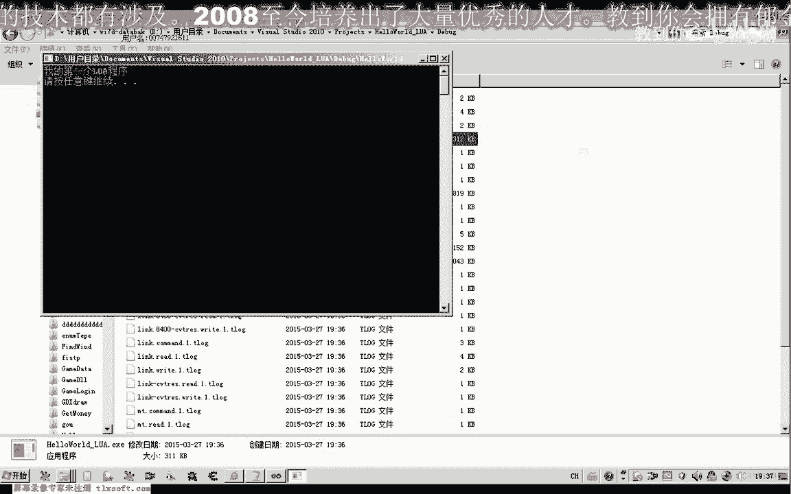
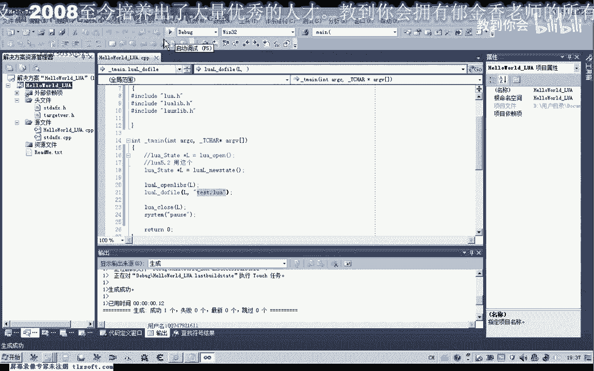

# P157：168-认识LUA 编写Lua的 Hello World - 教到你会 - BV1DS4y1n7qF

大家好，我是郁金香老师，那么这节课呢我们一起来认识一下脚本啊，后面的一个编程，那么我们主要是呃用这个脚本库啊撸啊，那么我们首先来来认识一下这个路网。

那么路网呢它本身是一个简洁轻量和口口扩展的一个脚本语言，那么它本身呢呃可以独立的这个运行，那么也可以与我们的这个c加加程序来整合，那么在这里的话我们主要探讨的是与我们的这个c加加整合使用。

那么首先呢我们可以到它的网站去下载这个最新的版本，那么这里呢它有很多很多的这个历史的版本，那么现在最新的这个版本是5。30的啊，那么除了在这里下载之外呢，也可以到我们的论坛来进行下载啊。

二那么都是可以的。

那么可以直接在这里下载也可以，那么下载了之后呃，我们需要呢先把它解下载到本地之后呢。

我们需要把它解压出来，但是我们只需要其中的一部分就可以了啊，只需要它这个源文件，这里面的所有的这个原文件，因为它都是开源的啊，这个代码，那么我们需要把原文件解压到一个地方。

那么在这里比如说我们选择的地方是c啊，c盘，那么立即解药。

那么解压了之后呢，我们来看一下它相关的一个目录情况。

那么就是这个src啊，下面呢就是所有的这些源文件啊，但是我们需要使用的时候呢，一般我们需要它的一个链接库啊，live啊，那么需要这个链接库的话，但是呢他没有直接的提供啊。

那么这个时候呢我们可以它有一个mc file，我们可以在这个dj k下面进行编译。

那么也可以用我们的呃任何的vs环境来编译，比如说我举个例子，那么我们可以在vs 2010下面的编译，生成它相关的这个库的一个支持。

那么我们可以在这里呢建一个空项目啊，可以因为它本身没有提供这个空的这个项目，那么这个项目呢可以保存在任何位置，那么在这里呢也可以保存在啊，为了方便使用的话，我们也可以保存在直接保存在它的这个环境下面啊。

那么这个工程呢我们就可以交通中文他的版本啊，想换人，让他名字啊，求为取名为这个卢旺532人或者三个人的这个版本，然后呢我们就存在他这个位置上面，当然存放在其他位置的话也是可以的，都是一样的，实际上。

那么存放到这根目录下边之后呢，我们把现有的这些项目把它添加进来，我这里另外生成了一个目录啊，相当于没有，现在嗯，这个向下边，那么我们可以先把它添加进来啊。

这里面所有的这个项添加心理，好但是我们直接这样编译的话，好像他有一些问题会出现，那么这个时候呢它会提示有一个或者是多个啊多重定义的这个符号，那么因为它有两个这个文件里面都有相应的这个马函数呃。

一个是这个人网带个c啊，这里边还有个马函数，另外是这个卢瓦斯啊，那么这两个呢有一点点区别啊，这两个编译库，具体有什么区别呢，我也不是非常的了解啊，我们来看一下，这里面我记得有一个相应的也有一个慢。

那么所以说呢我们只能拥有一个这个盲函数，才能够编译，或者是改一下它的这个后缀名，或者是先把它排除在外边，那么我们再重新编辑，那么这个时候呢他又会提示很多符号啊，我们的这个很多符号呢呃不能够找到。

那么我们需要来设置一下它的这个目录啊，这个时候那么这个呢我们还是先把他的名字取回来，把它直接排除就行了，从项目中排除排除，而不是删除啊，这个是删除文件啊，那么我们从这里面排除，那么排除了之后呢。

我们需要在项目里面需要设置一下，那么我们看一下我们的这个圆柱的这个路径，这里呢把它复制一下，那么首先呢我们的可以在这里添加我们相应的这个目录，包含目录，引用目录和我们的这个库的这个目录啊。

这几个呢我们都可以了呃，添加添加，为了我们相应的这个目录再来编译，那么这个时候呢就可以成功了，那么除了在我们这个库目录这里呢包含之外呢，我们还有其他的方式也是可以的，那么我们如果不在这个地方包含的话。

我们还可以在这里有一个附加包含目录，那么我们把把它包含在这里来，这样也是可以通过我们的编译生成的，那么我们编译生成了我们主要的是要获取它的一个lab库的一个支持，那么现在它编译生成的话。

实际上生成的是一个ex e文件啊，相当于是他的一个命令啊，行的一个平台的一个支持，那么所以说在这里的话，我们还需要改一下，当然这个生成了之后，我们也可以在这里看到它的输出目录呢，我们可以了。

把它调整一下，那么在这里呢我们输入s r z e x1 ，那么我们先编译生成一下，那么然后呢我们还可以把它用动态链接库的形式来形成，那么提供给我们使用也是可以的，那么动态链接库的话，这里呢我们，也有啊。

我们来看一下没有具体的生存好，那么这个时候呢就有两个文件啊，那么我们还需要的是一个level啊，静态链接库，那么我们再选静态链接库啊，再重新生成一下，那么我们最主要的就是需要这个静态链接库的一个支持啊。

这样他才能能够找到相应的这个符号，因为它很多符号呢他都没有在这个动态链接库里面掏出老角，那么我们需要用这个静态链接出来支持，那么生成了之后呢，我们就可以了呃，进行相应的这个开发了。

当然我们还有一种方式呢，也就是不要这个库啊，不要这个库的情况下呢，我们直接把这相关相应的这些图文件来源文件添加到我们的工程里面，那么一般呢我们是用的另外的一种方法啊，这个时候我们把这个项目工程保存一下。

那么保存之后的话，在这里的话呃，到时候我也可以打包发给大家看，这里边呢就直接有一个这样的一个工程，那么可以把这个工程呢把它添加到我们上一级目录，让它保存在同一个呃这个工程下边，那么这样的话打开之后呢。

我们就能够直接的来编译它。

那么出了同一个目录之后呢，我们这里呢就不需要所谓的这个附加目录，这里呢这个附加的目录呢我们就可以去掉了，那么我们直接就可以，这个时候就应该可以便宜，那么这个时候我们看一下它为什么会提示这个源文件啊。

把打开，因为它的这个原文件所包含的这个目录它可能不对呃，因为我们看它包含的一个目录是一个相对的一个路径，那么我们应该把这个相对的录进来给它取消掉啊，它是所有都要取消掉了。

我们因为这里的话它是用的它的一个上层的一个目录，的一个路径，那么这里有完整路径的话，就是错误的话，那么我们需要再重新的把这里边的这个原文件呢再包含一下，或者是把它再放回去啊，放到我们的这个目录下面。

因为他刚刚才实际上就是用的一个相对的一个路径里面包含，那么我们也有办法进行修改啊，这个时候，那我们先把里面的这些呃原文件，全部把它先排除一下，那么头文件呢我们也把它排除一下。

那么然后呢我们再重新把它添加进来就可，那么注意啊，这个我们不需要包含，我们只需要包含一个啊，那有这样盲含出来就可以了，好的，因为我们都包含了一个这个项目的这个文件。

那么这个时候呢我们再来看一下它的这个相对的这个路径的话，就是正确的，重新再需要包含强，性质就像。

好的，那么这样的话就可以直接的啊生成，那么到时候呢我会把这个代码来打o啊，发给大家，大家可以直接到时候呢打开这个项目文件来编译生成，那么这样的话就会很方便了。

当然也可以照之前所的方法直接到官方网站或者是我们的论坛论坛啊，下载这个源代码，然后来生成主要是这个文件啊，那么我们要把它分成好嗯，让我生成好了之后呢，我们在这里呢可以给他改改个名字，非常稳定。

认真制的代码用这个病来表示pr，那么也可以用刚才的这个部落名字是随意的，但是呢我们要把这个目录里呢要把它记住啊，因为在我们之后用的时候呢，我们可以用用这种方式来调用它。

那么我们先把这个目录的名字来先记录一下。

那么装好了之后呢，我们这个目录下面包含了我们的这个ip。

就是这个静态库的这个路径。

我们把它记录一下，那么另外呢就是我们其他原文件的一个路径，那么有了这个路径之后，那么我们接下来呢我们就可以了，来开发我们的这个脚本文件啊，那么我们再次新建一个工程啊。

嗯对，那么这个时候呢我们可以建一个c加加的一个控制台的一个项目，就叫toko，有我，那么在这里呢我们选择我们项目啊，保存到这个位置，然后呢点确定这里预编译图啊，这些可要可不要都可以，然后直接点完成。

那么我们要注意到我们的所有的这个logo程序呢，它都是用c它的后缀名呢都是c dc dc啊这一类的，那么这一类呢它是用c语言，是用纯粹的c语言来写的，那么所以说我们在包含它的相应的这个知识库的时候呢。

我们需要加一个tc啊，表示了他全部都是用的这个c的这个呃相应的一个规范，那么后面呢我们再来包含它的这个相应的一个库，那么一个是要在包含这个库之前呢，我们需要包含它的一个附加目录像啊。

那么就是我们刚才所准备的这个腹腔目录的像，那么我们需要把它包含进来，嗯，那么然后呢我们再需要包含这三个啊，相应的一个图文件，那么是在它的上一层的这个目录啊，好那么这样呢它就能够找到我们相应的一个图文件。

那么我们接下来来可以写上这样几句，在我们的这个min函数里面，当然我们要调用这个系统函数啊，系统的命令的话，那么我们需要的包含它的相应图文件，嗒嗒嗒嗒嗒好，这样我们就可以了，再编一下。

这样我们就有了一个相应的这个word，当然它需要符号，那么符号的时候我们的这个lab不如在这里，那么我们再次为他设置一下，那这个链接的输入项，那么在这个位置加入我们的这个相应影像，然后用封号进行分割。

然后他有一个附加的控步路，那么我们在这里来填写，当然我们也可以在这个vc加加，这里有个库目加在这个地方也是可以的，当然我我个人的话更喜欢你呃，在这里来加入这个负载库的这个目录好。

那么这样我们再次编译生成，那么这样就可以了，然后呢它会自动执行了我们的这个运行目录下面的，那么在我们这里的话，它就是这个调试目录下面的这个路啊，开始啊，这些里面的这个脚本，那么这里有一个公众目录。

就是这个工作目录下面的这个调试脚本，那么在这里呢我们比如说默认的他指定为c盘啊，那么指定为他的一个工作目录，那么呢我们就在这个下面呢跟他建立一个相应的这个脚本，当然也可以在其他的版嗯。

在这里的话我们也可以，在这个输出温度里面也是可以的，把它做一个调试目的话，可能这这样更好一些，工作目录，因为我们平时如果不进行设置的话，它的这个工作目录的话，因为我们的输出目录呢它不是一样的。

那么我们这个时候进去找一下啊，就在这个目录下面，那么这里这个时候我们用一个记事本建一个，也是类似于我们打印的一个脚本，然后把它保存一下，重新一名名字吧，novtest。

然后我们在这里运行的话，我们就能够看到它相应的这个文字。

我的第一个罗网程序就能够看到它的一个名字了，当然我们也可以直接在这里面运行也是可以的啊。

那么这样的话就很简单了，那么今天呢我们就呃啊这个la的这个评以及相应的这个库啊，这样搭建好了，那么后面呢我们就可以在这个环境，那下面呢呃开发我们的这个相应的这个脚本啊，那么这节课呢我们暂时呢就到这里。

