# 郁金香老师C／C++纯干货 - P158：169-认识LUA与C.C++的接口 - 教到你会 - BV1DS4y1n7qF

大家好，我是郁金香老师，那么这节课呢我们一起来看一下这个在lua脚本里面啊。

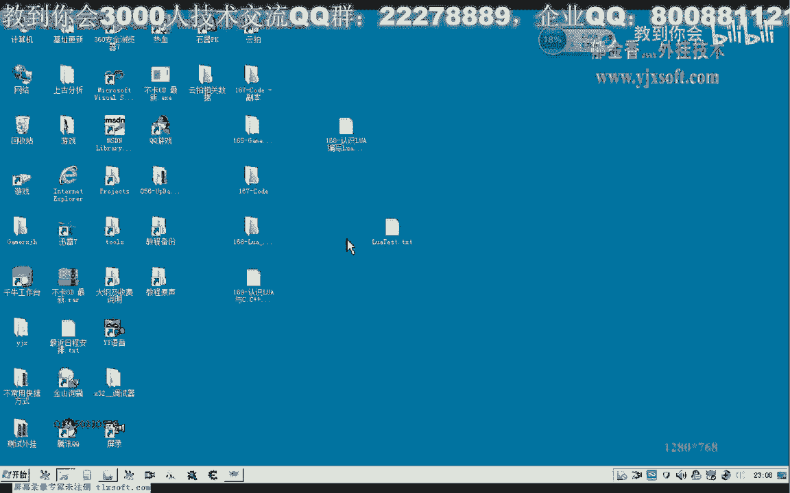

怎么来调用，我们有无戏里面的这个函数，或者是c加加里面的这个函数，那么首先呢我们打开vs 2010。

然后创建一个新的项目，控制坦克噗，那么完成之后呢，首先我们也要包含相应的这个链接器，这里面包含我们相应的库，哈哈哈哈哈哈哈哈，然后呢我们再用我们相应的头文件，那么第一个这个鲁莽的h呢。

它包含了我们这个脚本里面的所有的这个基础的啊，这些函数都在这里边，那么第二个呢是一个相应库函数的一个支持，就是他看文件，那么第三个图文件呢是一个辅助库的呃，一个图文件的一个支持好。

那么这些包含好了之后呢，我们就可以了，第一个先要给它创建一个lua工作的一个环境，我当你打开233，那么一般呢我们用l l这个变量呢来表示，当然后面也可以随便取一个它的一个变量值。

这里就是一般文物angel来表示，这样是一个比较统一的一个做法，那么后面呢它实际上是有一个函数来创建这个环境，那么这一局我们就把这个相应的这个路网工作的这个环境创造好。

然后呢一般我们还会打开它的这个所有库的一个支持，然后把这个尺寸呢传进来，我们唱，那么最后我们使用完了之后呢，我们需要来关掉，这个工作的这个环境，那么在这中间呢我们比如说我们要调用一个函数。

那么在这里呢我们可以随意地写一个啊，比如说我们写一个游戏的一个寻路的一个空翻的问题，那么这个函数呢我们什么也不做啊，暂时呢我们就只打印出一个曲面指令，哈哈哈哈，那么就只反映出这样的一段话。

但是我们在lol里面呢，它不能够直接调用这个函数啊，那么我们需要呢需要注册一个这个logo的这个函数，但是这个注册的函数的这个格式的话，它必须也要传入这个一个解释器的一个指针进去，它的格式类似于这样。

那么我们这里呢就需要另外的定义一个函数啊，那么在这个函数里面呢，我们再来调用的方位，当然这是没有参数的情况下啊，那么这个时候这个函数呢就可以是我们的一个注册注册函数的格式。

而且它的这个函数的格式化要求是c语言的，这个格式化相当于有这一个要求，那么在这里有了这个函数的格式呢，我们就可以开始注册了，那么注意这个没有，然后第一个呢也是传入的我们的这个解释器的指针。

那么第二个呢是我们要注入的这个注册的这个函数值，注意这里的函数名的话必须是英文的啊，是啊是中文的人，他不能够认识，当然这个5。1的这个版本的话，网上有一部分的修改，或者它可以支持这个中文的函数名注册啊。

好那么我们在这里，我们比如说也是注册一个端的位，哈那么这里的名字呢可以与后面的名字相同，那么也可以不同啊，这是我们注册的这个名字，然后注册好这个名字之后呢，我们在脚本里边呢就可以去调用它。

比如说我们可以用这个撸啊string的方法来交流to string，那么第一个参数也是它的指针，那么第二个参数呢就是我们的这个函数名专的位，如果这里是函数的话，这里要加上一个括号。

这样呢它才能够调用成功，好的我们在这后边呢还需要把它暂停下来，boss，那么这个系统函数呢我们需要包含另外一个文件，好的，那么我们运行一下。

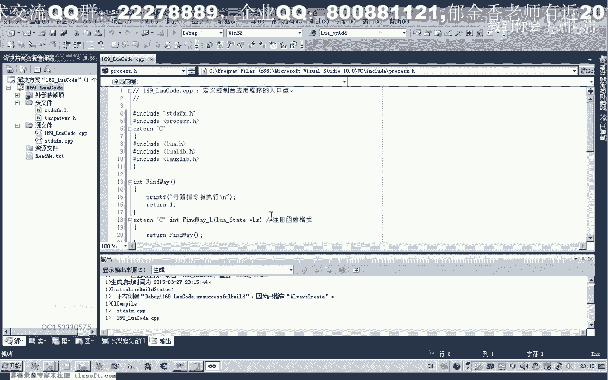

这个时候呢我们就发现它有一条呢寻路指令被执行。

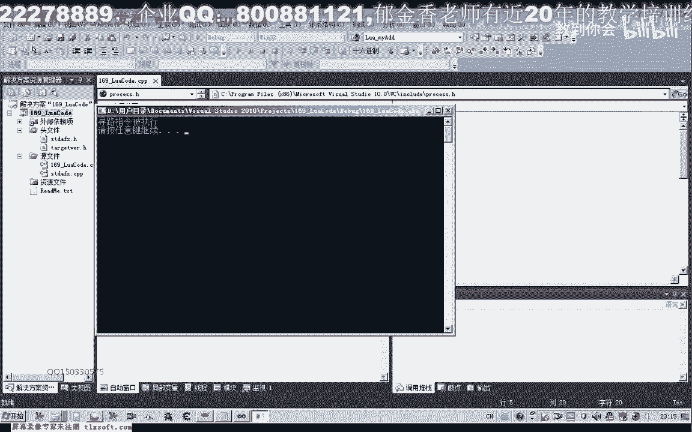

也就是说他通过这个执行一个脚本的一个语句了，它就可以执行到我们自己的这个寻路指令里面去，那么在后面的话，实际上我们就可以加上我们游戏里面的这个寻路的啊啊，相应的一个汇编代码，在这里的话它就能够被执行了。

就这个位置当然也可以，在这个位置下也是可以的啊，那么无论哪种方式都是可以的，但是这种形式的调用呢比较常见一点啊，这里呢另外呢我们需要再注册一下，当有多个函数的时候呢，这里呢我们就要注册多次啊，多次。

那么除了用这个dot的方式来调用呢，我们也可以用这个to fire的方式来调用，也就是我们上一节课就是用的这个debug的一个方式，那么to fire了所有的这个脚本呢就放在这个文件名里面。

那么我们这里如果开始这个后缀名也是任意的啊，只要是一个完整的一个文件名就行，当然也可以是一个全路径名，那么如果如果我们是在这个控制台下面运行的话，实际上呢他的一个工作目录呢是在这个地方。

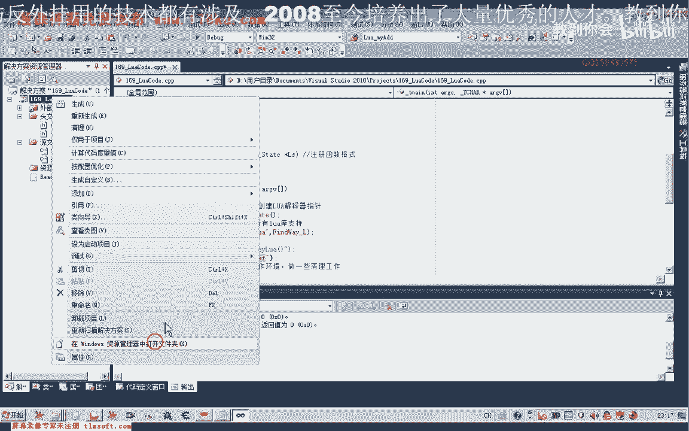

是在这个第八个的上一层，那么比如说我们就需要在这里来建立建立一个路网，那么在这里呢我们来find way to，那么我们可以调用两次，好的，那么我们再次运行看一下。

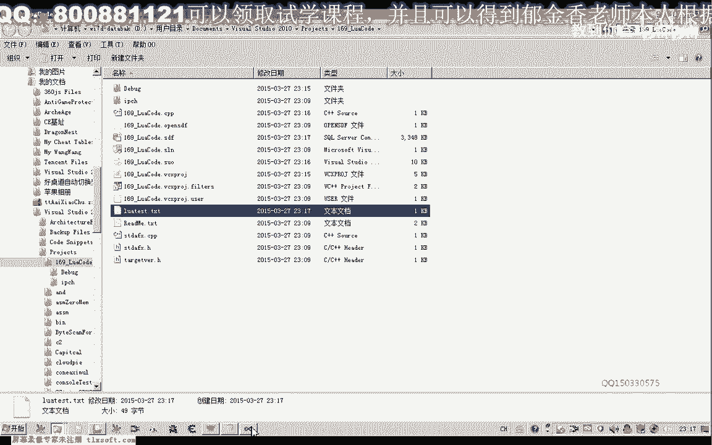

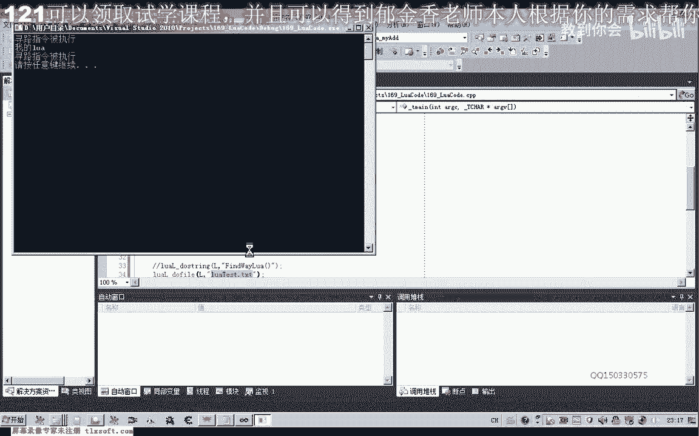

啊这是第一次被调用，这是第二次被调用啊，那么这就是我们的lure to fire，当然在这里的话，我们也可以用那个直接这样调用也是可以的，都可以一起调用，那么这个时候呢他就被执行了三次。

那么还有一点要注意我们的第八个啊。

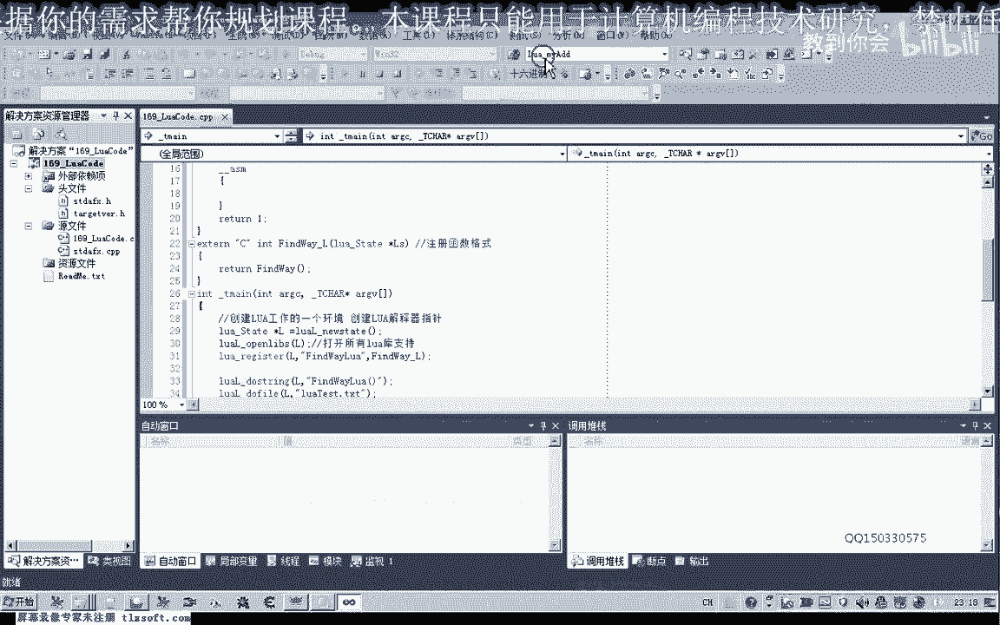

这个时候的话我们看它为什么会只会被执行一次了。

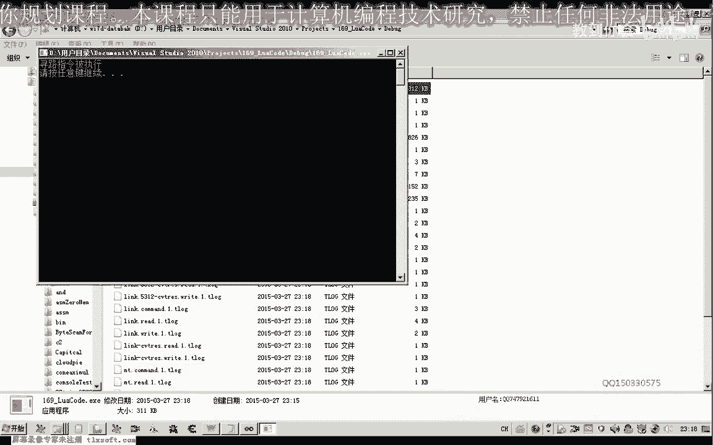

因为他在当前目录他找不到这个脚本文件。

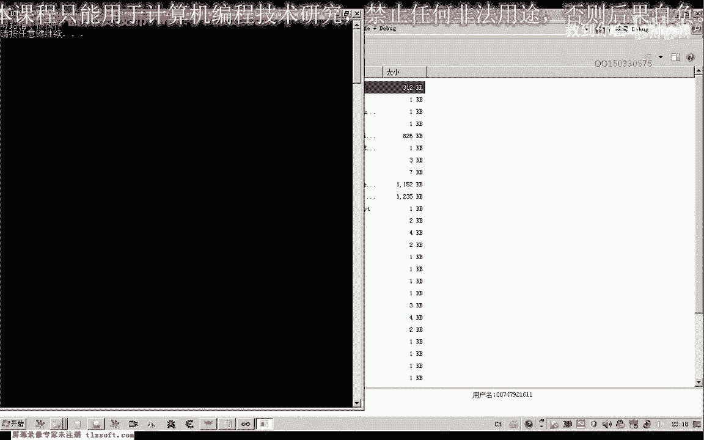

因为我们的脚本文件呢在这上一层，我们调试的时候呢，它的工作目录呢是在这一层，但是如果我们呃直接运行这个ex一的话，实际上它是在当前的这个目录来找这个脚本文件。

那么我们需要把这个脚本文件夹复制到这个e x。

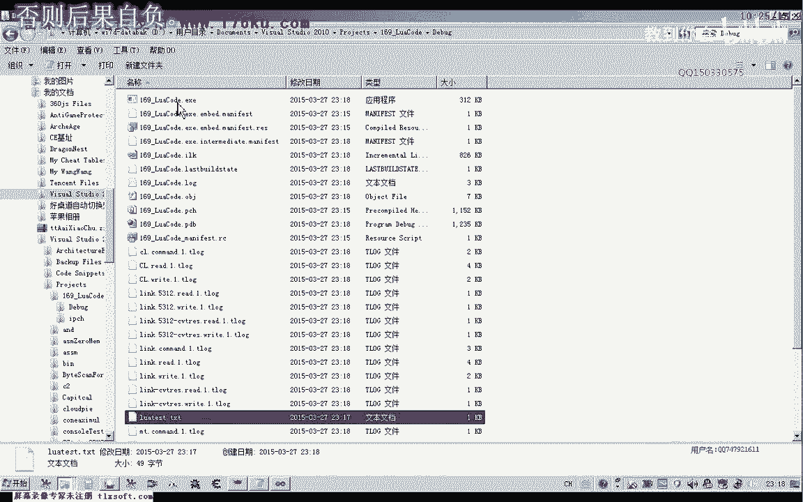

e所在的这个路径下啊。

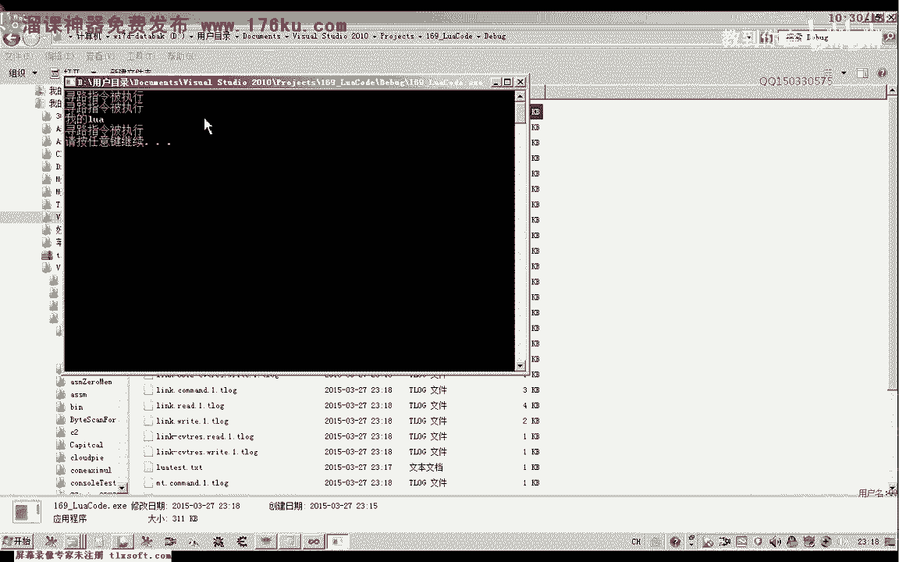

这样才可以，那么我们在这里还可以改一下，这是我们的ex旋转用一下，那么我们看一下，实际上这里他执行的结果啊。

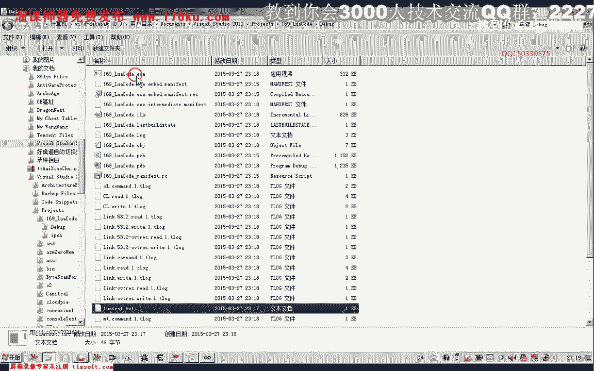

因为是调用的这一个文件，如果我们这里调试的。

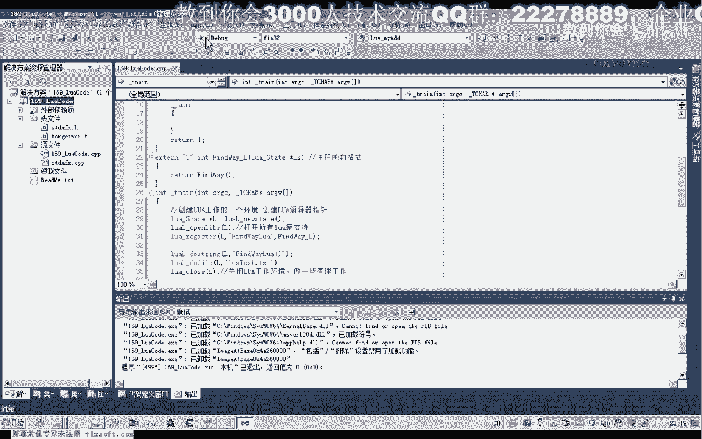

它实际上是调用第八个呃目录的上层的那一个文件。

但是呢我们可以通过在这里来改，在这个调试的这个目录以前我们也改过啊，这里的公众步骤我们可以把它改一下，那么公众部落呢我们把它嗯把它改为这个第八个啊，这个目录就行，把它改为这个输出的这个目的啊，调试这里。

那么我们这个时候呢它就能够一致了，那么这样呢我们就能够保证。

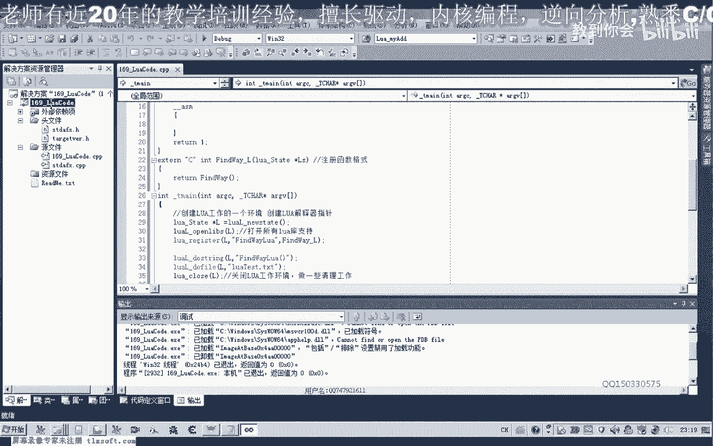

啊它所调用的这个ex一呢是在e x e的这个路径里面。

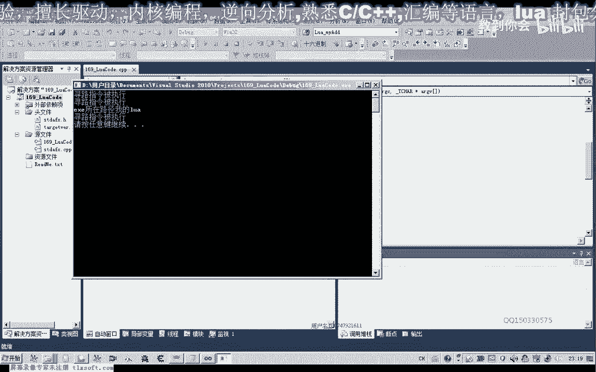

那么我们也可以这样改了，这是调色这个动路，好的再次保存一下，那么这节课呢我们就到这里了，那么有一个坐了下去，大家啊在网上去查一下可以，那么实际上很多资料的话，我们都可以在百度里面去搜索哈。

嗯那么另外这个作业呢我们就是大家先去看一下带参数的，怎么在这个撸啊脚本交流，那么我们下一节课呢再探探讨这个问题啊，大家可以去搜集一下相关的这些信息，那么实际上很多这个内容的话。

我们在网上都可以找到相关的这个知识，好的，那么如果不愿意到网上去搜集相应的这个资料了，可以直接看下一节课的呃，相应的这个课程，那么比如说我们这个方位，它需要两个参数，那么这个时候我们怎样传入这个参数。

好的，那么我们下一节课呢在探讨这个相应的这个问题，那么这节课呢我们就到这里。

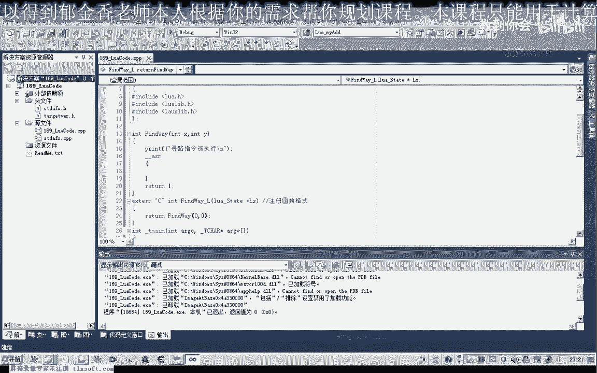