# 郁金香老师C／C++纯干货 - P159：170-LUA与C交互-调用带参数的CALL - 教到你会 - BV1DS4y1n7qF

大家好，我是郁金香老师，那么这节课呢我们研究一下路网里面的哈带参数的这个扩的一个调用，那么首先呢我们新建一个项目。

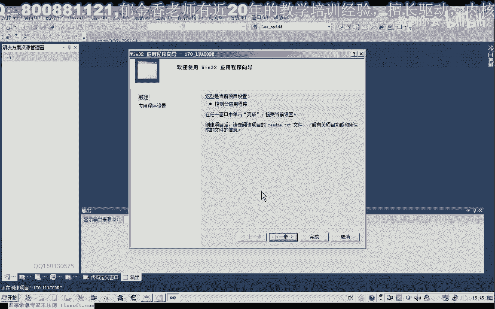

那么建好了之后呢，我们把上一节课的代码啊，呃复制进去，那么在这里呢哈我做了一下修改，那么上一节课呢，这里呢它并没有啊，在这个参数在执行这个脚本的时候，那么是这种情况，那么这种情况的话。

它只是来调用了这里面的代码，但是很多时候呢我们脚本语言里面呢，我们需要传递我们的参数来到对应的这个注册函数里边，那么这种形式的话，我们应当怎么传递我们的参数，而我们的这个注册函数里面。

那么注册函数里边又怎么去啊，获得这个相应的参数数据好，那么我们一起来看一下，那么首先呢我们在这里的话，实际上这里参数传递了多少的话，他传递多或者少都可以可以传递很多可怕的证。

那么关键是我们这些参数它传进去之后，在这个地方怎么来获得它，而且这里的话参数的个数呢它是可以任意传递的，那么传递了之后，我们即使不做相应的处理，它也不会出错啊，只是说我们相应的这个呃参数。

比如说这个123456，它没有传递到我们的这个注册函数的原来，而且注册函数里边来的这一节课，我们主要研究一下数字相关的这个数据的获得，那么他要用用一个撸啊。

to number one来获得相应的呃这个站里边的一个数据，而这个卢瓦的一个交换的话。

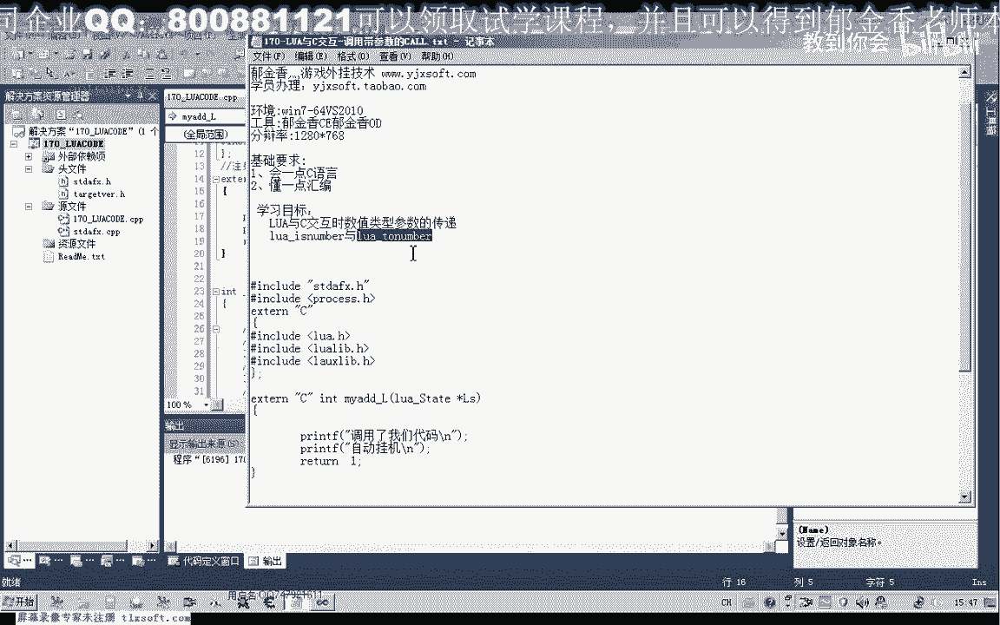

它都是相当于在一个特殊的一个站里边来完成的，那么就像我们的这个堆栈一样啊，它都是通过这个然后把这个相应的数据转换之后呢压榨，然后呢它有一个特殊的站，需要用一个相应的函数来来获取。

比如说我们可以用这个如果特朗普来获取里边啊。

这个站里边占领的这个元素占点的这个呢。

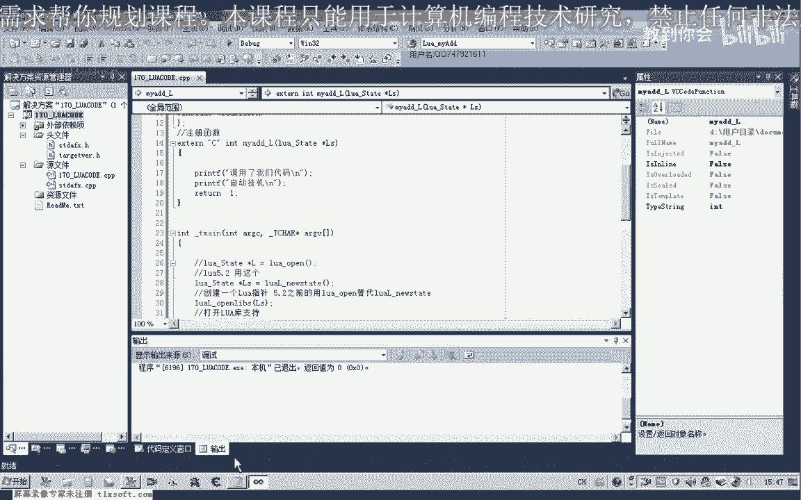

它标志它的下标呢是1234561，是这样编号的，那么要取哪一个参数来。

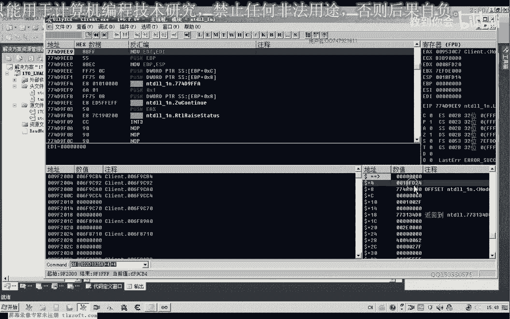

就取一个对应的一个参数，从一开始编号，那么比如说我们这里的话，要去他的第一个参数啊，那么如果我们当时取之前的话，我们需要进行一下判断，那么比如说我们要取的是数字数字。

那么我们先判断一下这个参数是否是我们所需要的这个数字类型的好，那么我们可以加上一个if条件语句，然后呢把这个环境指针啊，解释器的指针传进来，然后这个index ta就是它的堆栈的一个相应的下标。

注意这一点与我们的c c加加不一样，我们c加加的数组的话，边后来是从零开始的，但是它的编号呢是从一开始，那么我们取第一个参数，如果是的话，那么我们把它保存到，那么要注意它它的这个参数的话。

它没有呃整数与浮点数之分啊，它全部都是用火点数来表示的，这个数字好，那么我们这一点就算我们传进去的是整数啊，但是实际上他取得的数字呢是我们的浮点数啊，那么在这里呢我们先定义一个，double lg，他。

那么我们取一个数字，那么在这里的时候呢，我们这个参数呢我们可以用u啊，to number啊来获取相应的值，那么解释器的环境指针传进去，然后是它的一个相应堆栈里面的一个下标，那么取得了之后呢。

我们这里呢可以把它打印出来，好的，那么我们来看一下现在的一个执行的一个接口。

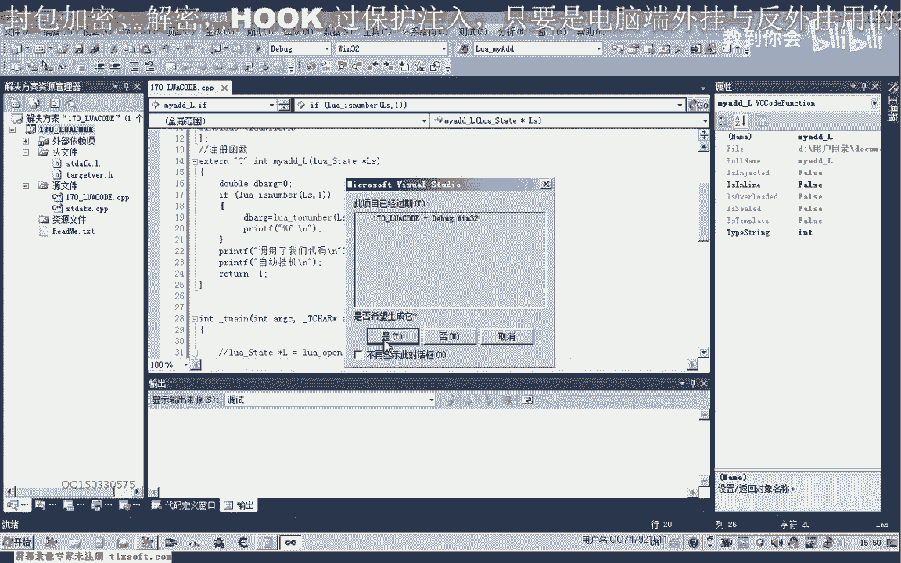

那么这个时候呢我们展现出来的是零啊。

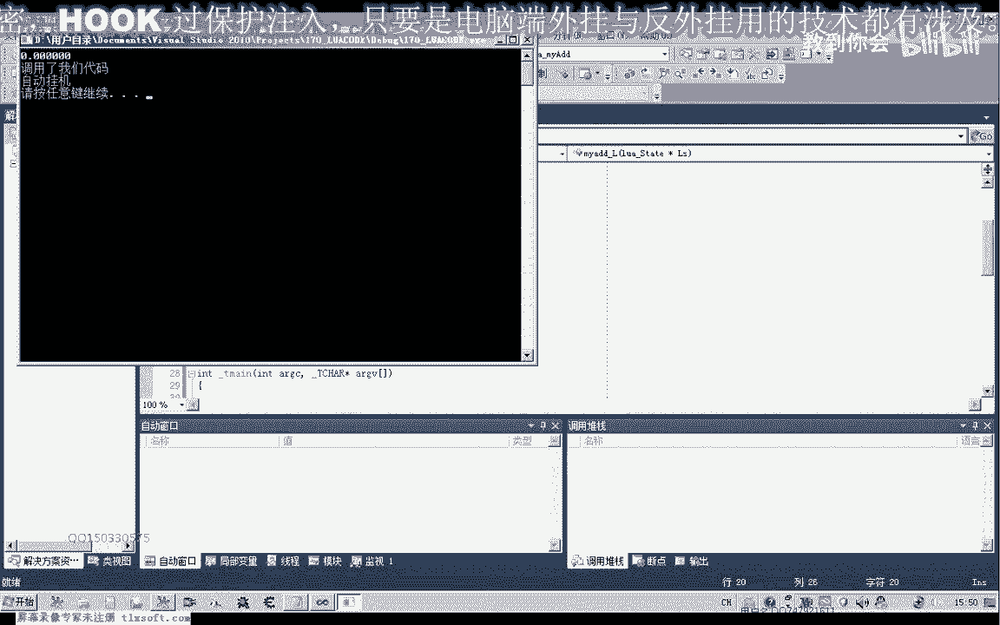

我们再来看一下我们的代码，那么这里我们传进来的话是一，因为我们后边呢这里还没有加上一个相应的参数，那么我们再来看一下。

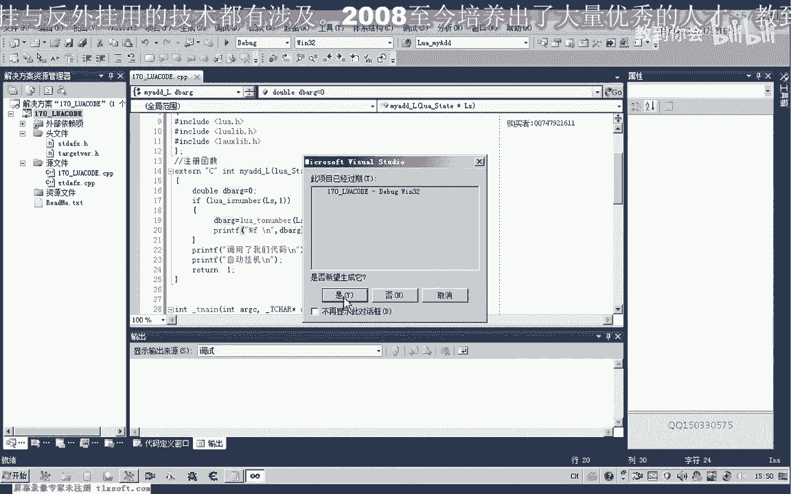

那么这个时候呢我们在相应的这个数字呢他就确定了。

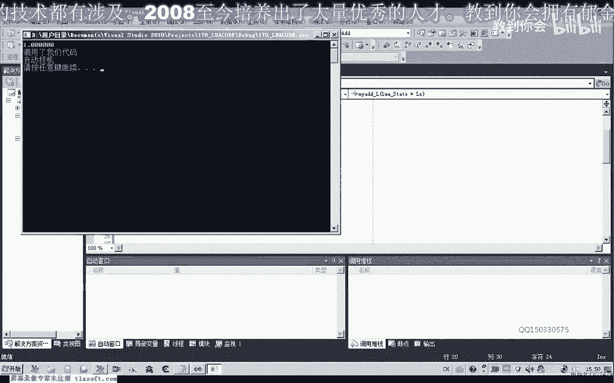

当然如果你本身是整形的啊，那么这个地方呢你可以了，定义为我们的the integration啊，整形，那么它会自动的强制转换啊，这个这那么我们也可以直接强制转化啊，这里呢用百分之d来表示。

而且我们这里还可以用一个循环来表示，怎么来表示呢，如果所有话，我们举个例子，那么我们保证哈整个对战里面的它都是这种数值类型的啊，没有其他的类型，那么我们这里可以用一个y语句好来取它的这个所有的参数列表。

如果我们就是传传递的这样一个序列的话，这个加法的话，那么我们可以呢依次的去他的这个呃所有的参数，那么这里呢我们就变成一个相应的数组的一个下标一体汉不足一，那么这里呢i加加就可以了。

这样我们就能够获得他所有的这个参数，但是这个时候比较多，我们看一下啊，太多了，下面的是数字的也比较多啊，所以说这里呢我们还是不能够用这个y循环，最好是用一个for循环，那么它不等于这个数字的话。

那么我们就继续循环，就这这样呢，我们就可以取得所有的这个参数，六个一三，这里是i啊，这应该是i的，当然这个时候我们看一下啊，这个地方怎么我，如果你是兰博啊，如果是等于零的情况下，那么我们在这里呢。

嗯继续下一次的循环，那么不是的话，我们就在这里了，取i的这个下标，而不是i加价，因为这里已经加了，引起了，那么刚才这里的写法你也应该是正确的，刚才的错误在于这里呢多加了一次这个下标的数字。

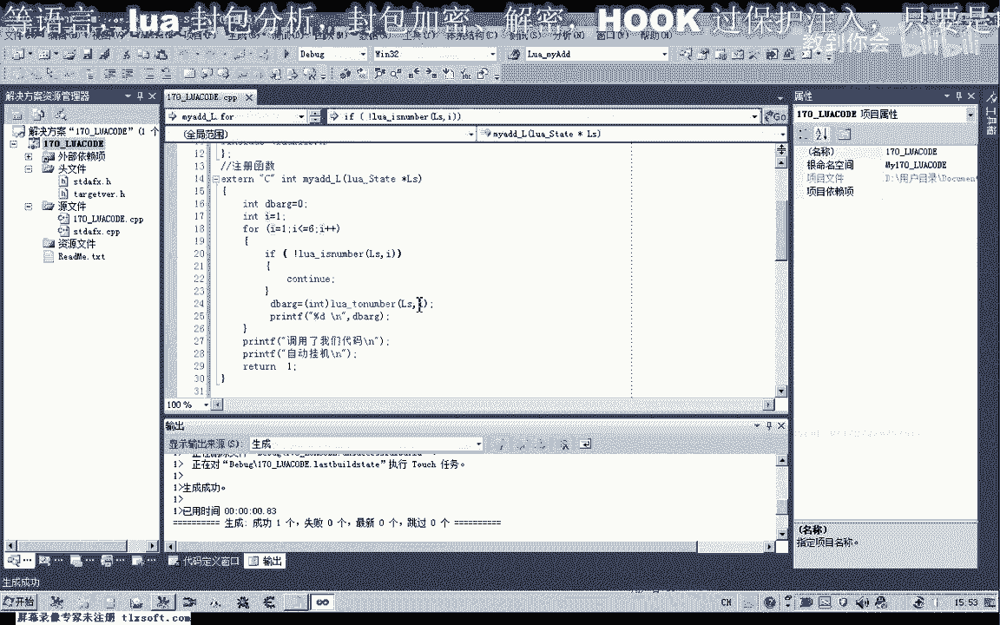

123456。

那么如果有更多的这个参数呢，我们可以在后面呢继续在写，当然这里的数字呢我们需要做相应的一个改变。

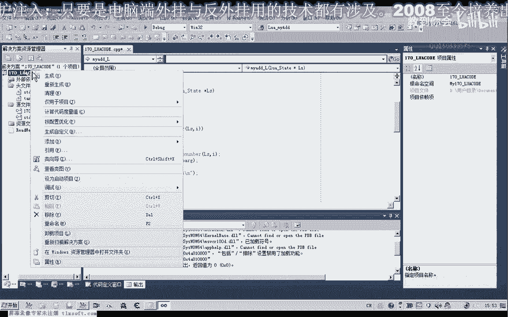

那么这样的话就能够有效地把我们的参数来进行一个传递哈。

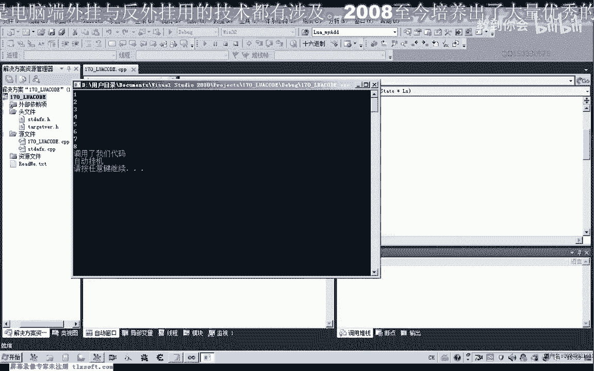

那么这是所有数字类型的这个呃参数的一个传递，那么当船那么比如说我们另外的啊，比如说寻路啊这一类的函数，那么肯定另外的还有一个寻路的一个扩，那么我们也可以在这里来直接把我们的这个参数啊进行转换之后呢。

再调用我们其他的啊非注册函数来实现嗯，比如说我们另外再写一个函数，就是一个做加法的一个函数，嗯，那么这里呢我们最后来输出这个最终的这个计算的一个数值，那么存放在这个栏目里边。

那么这里的话实际上呢我们就可以了，通过这个接口来调用我们其他比如说游戏里面的这些函数都可以，当然最终呢我们后边的话还要结合这个游戏的例子，来来探讨这些呃问题。

那么现在这个阶段呢我们主要是了解一下这个lua，它相应的呃一些基础的这些知识，好的，那么这节课的话我们就探讨到到这个地方。

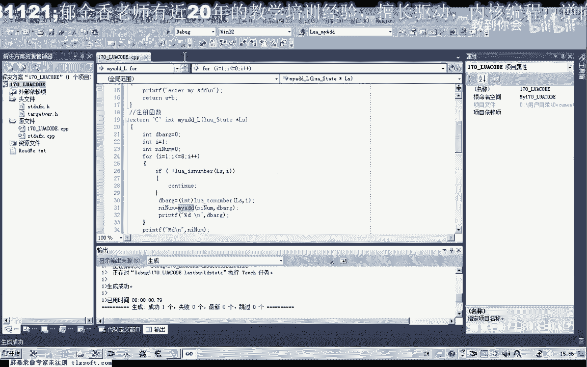

那么下去之后呢，大家可以查一下我们怎么去接受它的一个返回的一个数值，那么居中呢，这里12345678啊啊加起来的值是36来计算出来的啊，但是究竟是不是啊。

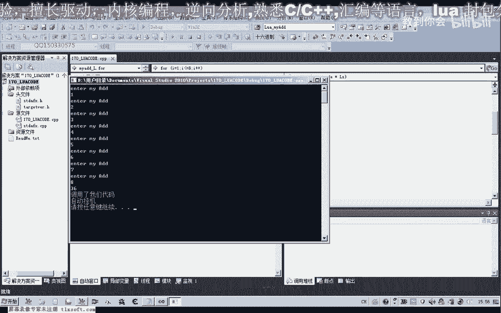

这个我们就不用去过于纠结，它1~8好像是36啊，那么下一节课呢我们再来探讨一下，我们怎么来取得那么这个函数的一个啊，比如说它最终有一个返回的一个数值，那么我们这个函数怎么来取得这个返回的一个数值，好。

好的，那么我们下一节课啊再见，那么这里的话最初呢因为当时返回了我们的这个number，这样才对，好那么这节课的作业呢，我们就是那查一查微信，这个如果不是转一次相关资料，那比如说我们在这个地方呢。

我们就是要找到啊，怎么去取出这个my i d d l这个函数的一个返回值，我们怎么去获取好的。

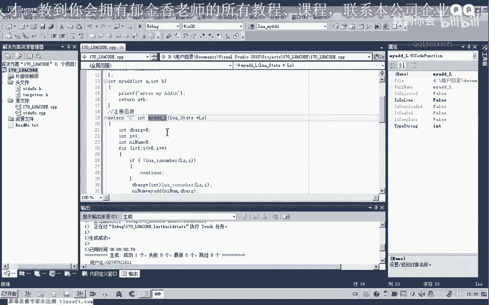