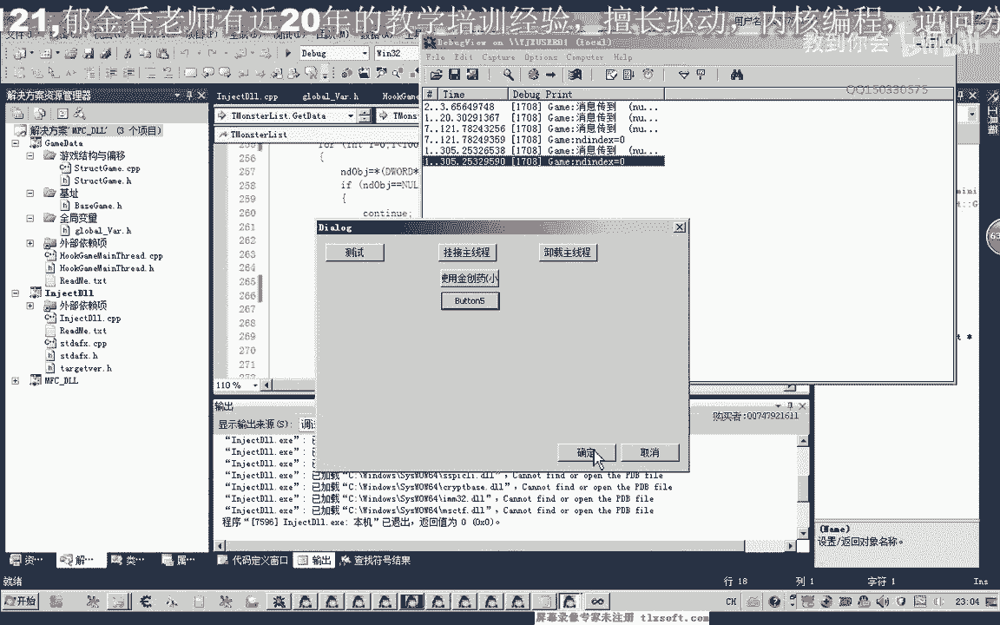
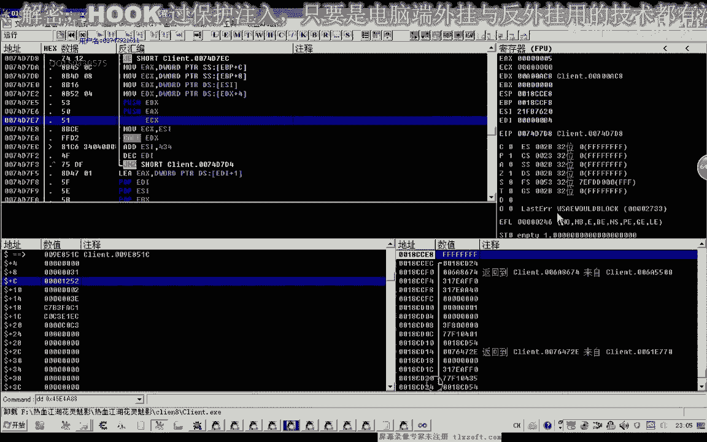

# 郁金香老师C／C++纯干货 - P15：026-封装选怪功能-写代码 - 教到你会 - BV1DS4y1n7qF

大家好，我是瑞金香老師，客風15033的永秀，今天這集我們就一起來對選外的功能來進行一下封裝，我們打開第23顆的代碼，打開之後我們先添加機子，下面我們在這裡添加一個分類，然後我們再加一個結構的分類。

塞進去，這樣我們看出來可能要清晰一些，那麼首先我們是一個玩家對象的機制，殺對象的，那麼另外一個是我們的所有對象的數據，我們可以把這個公司來進行一下封裝的方式，我們可以把公司粘在後面，那麼機子就這兩個。

後面的是它相關的一個偏移，那麼這裡我們管理機制，那麼偏移我們添加在後面的遊戲結構，那麼我們先封裝玩家的對象，複製一下，代碼最後，嗯，~ 前方大魔王生物中的大魔王 - 蜂巢 ~。

~ 前方大魔王生物中的大魔王 - 蜂巢 ~，~ 前方大魔王生物中的大魔王 - 蜂巢 ~，~ 前方大魔王生物中的大魔王 - 蜂巢 ~，~ 前方大魔王生物中的大魔王 - 蜂巢 ~。

~ 前方大魔王生物中的大魔王 - 蜂巢 ~，~ 前方大魔王生物中的大魔王 - 蜂巢 ~，~ 前方大魔王生物中的大魔王 - 蜂巢 ~，~ 前方大魔王生物中的大魔王 - 蜂巢 ~。

~ 前方大魔王生物中的大魔王 - 蜂巢 ~，~ 前方大魔王生物中的大魔王 - 蜂巢 ~，~ 前方大魔王生物中的大魔王 - 蜂巢 ~，~ 前方大魔王生物中的大魔王 - 蜂巢 ~。

~ 前方大魔王生物中的大魔王 - 蜂巢 ~，~ 前方大魔王生物中的大魔王 - 蜂巢 ~，~ 前方大魔王生物中的大魔王 - 蜂巢 ~，~ 前方大魔王生物中的大魔王 - 蜂巢 ~。

~ 前方大魔王生物中的大魔王 - 蜂巢 ~，~ 前方大魔王生物中的大魔王 - 蜂巢 ~，~ 前方大魔王生物中的大魔王 - 蜂巢 ~，~ 前方大魔王生物中的大魔王 - 蜂巢 ~。

~ 前方大魔王生物中的大魔王 - 蜂巢 ~，~ 前方大魔王生物中的大魔王 - 蜂巢 ~，~ 前方大魔王生物中的大魔王 - 蜂巢 ~，~ 前方大魔王生物中的大魔王 - 蜂巢 ~。

~ 前方大魔王生物中的大魔王 - 蜂巢 ~，~ 前方大魔王生物中的大魔王 - 蜂巢 ~，~ 前方大魔王生物中的大魔王 - 蜂巢 ~，~ 前方大魔王生物中的大魔王 - 蜂巢 ~。

~ 前方大魔王生物中的大魔王 - 蜂巢 ~，~ 前方大魔王生物中的大魔王 - 蜂巢 ~，~ 前方大魔王生物中的大魔王 - 蜂巢 ~，~ 前方大魔王生物中的大魔王 - 蜂巢 ~。

~ 前方大魔王生物中的大魔王 - 蜂巢 ~，~ 前方大魔王生物中的大魔王 - 蜂巢 ~，~ 前方大魔王生物中的大魔王 - 蜂巢 ~，~ 前方大魔王生物中的大魔王 - 蜂巢 ~。

~ 前方大魔王生物中的大魔王 - 蜂巢 ~，~ 前方大魔王生物中的大魔王 - 蜂巢 ~，~ 前方大魔王生物中的大魔王 - 蜂巢 ~，~ 前方大魔王生物中的大魔王 - 蜂巢 ~。

~ 前方大魔王生物中的大魔王 - 蜂巢 ~，~ 前方大魔王生物中的大魔王 - 蜂巢 ~，~ 前方大魔王生物中的大魔王 - 蜂巢 ~，~ 前方大魔王生物中的大魔王 - 蜂巢 ~。

~ 前方大魔王生物中的大魔王 - 蜂巢 ~，缺少一個封號，我們這裡把我們添加一個封號，看一下這個口號延伸到哪裡，出來，這裡，這個標籤我們應該建在前面，這個地方，長亮區，這裡多了一個封號，我們寫好了之後。

我們進行一個相應的測試，在測試的時候，我們就以測試ID的話，我們就用我們對象列表裏面的，就是怪物列表裏面的第一個，做一個測試，我們移到Hook的單元，然後在測試，注射掉之前，那麼同樣的這個玩家對象。

我們添加到一個全局變量裏，那麼這些全局變量的一個聲明，我們應該是放在這個CPP的一個單元，然後我們再到這個全局變量的圖文件，這裡加一個，表示要套出，加上這樣一個前綴，不然的話在包含的時候。

有可能會出現一個重建意義，那麼我們在這裡，我們就可以標用這個玩家的對象，然後選中某個對象，那麼這個對象的話，我們又可以從怪物列表裏面，然後我們取到怪物列表裏面的第一個怪物，然後取得它的一個下標。

下標成員，之前我們沒有添加到怪物列表的屬性裏面，那麼所以說我們要回過頭來，在怪物列表裏面添加相應的成員，怪物對象，那麼我們在之前添加一個，那是0x01z這個地方，它有一個ID，ID。

那麼它有這樣一個數字，同樣的這個數字，我們需要轉到Getty裡面來進行一個初始化，那麼這個數字的話，它的偏移是0x04，取出來，後面可以添加備註，那麼我們取出這個下標，然後我們再轉到這個單元來。

這裡取得這個相應的下標的一個數字，那麼給它傳進去，那麼我們就可以選中一個相應的一個怪物，好，偏移我們先執行一下，對了，這個時候，執行到這裡，我們進入到最後一個窗口，所以說我們要改一下，測試點上。

當然您的窗口名叫什麽就改回，好，那麼再次運行，掛接到主線上，然後我們開一下調試信息的查看器，看有沒有異常，我們看是否選中了怪物，如果選中了怪物的話，我們按這個空氣的話，它就是攻擊這個強力的怪物。

那麽證明我們的這個選擇沒有成功，沒有成功，我們看一下，重新在這裏打印一下相應的調試信息，看是不是執行到了這裡，或者我們在這個Sale Object裏面去打印一下調試的一個信息，我們先看一下。

它是否執行到了這裡，再重新編譯一下，對了，這裏我們這個標槍可能是跳過了，我們是標槍的位置，應該是在前面，在這裏之後，它才會有這個寫入的一個動作寫進去，可能是在這裏，好了，我們再次輸入到遊戲裏面。

掛接主線上，然後我們選中，那麼我們傳入了勝離，來這裏，我們看一下問題出在哪裏，為什麽會傳入勝離，然後我們移到這個地方，看一下該體代替裏面它有沒有初始化，我們是在這個地方初始化，我們把這個數字移到這裏。

那麼這個數字我們來看看，是大一把，它的大小我們在這裏改一下，或者你可以把這個數字定義成紅，我們再編譯一下，再進去看一下，在這裏定義的話，我們這個值可能沒有寫進去，如果出現這種情況的話，無空，繼續，繼續。

如果這個邏輯的話應該是沒有錯的，那麼我們在這裏把它的音響改一下，改成我們綠色的這個音響，這個音響，繼續，繼續，那麼這裏它傳入的數字還是可能是相應的位置，它沒有怪物對象。

那麼我們用OB進遊戲先查看一下。

我們先查看相應的數據，這裏它是有對象的，然後進去的話，加設這個位置應該是1252才對，那是為什麽剛才沒有，我們退出一下。

再來檢查一下我們的代碼，首先我們打印一下這個數字是多少，再轉到這個單元，我們去看一下，從0開始，取出來之後判斷它是不是怪物，加上偏移，加上零色的偏移，轉出來，然後我們再測試一下。

那麼這裏我們取得的數字就是零，為什麽我們沒有初始化成功，那麼我們再檢查一下初始化單元，在這裏的時候，我們打印出相應的價標，那麼，一個是打印出這個I的數字，那麼，另外是打印出相應的寫入的數字。

我們來看一下，還是拿了出來錯，那麼我們再用一下，化成出現詞，然後我們來看一下，它是從1開始，然後沒有重新開始，我們再來看一下，它執行了兩次，它的下標都是從1開始，它沒有從0開始，這個下標。

我們再推到裏面來看一下，為什麽這裏它是從1開始，到這個位置的話就1了，這裏應該是從0開始，難道它是第一格，它取出來的時候，這個數字它為空了，或者說第一個對象，它不是我們的怪物，可能第一個對象是玩家。

那麼我們可以把這一行取消掉，我們就知道結果了，那麼這裏我們看到一個1252，1252的話，這個應該是玩家的一個對象，可能就是我們自己或者是其他的玩家，所以說它沒有選中，這個時候就能夠傳進來了。

就能夠傳進來，那麼我們在怪物這裏，但是我們有需要，所以說我們當時沒有做一個相應的判斷，在這裏，好的，那麼我們再把上面的代碼再改一下，那麼這個地方，我們就改為1，做測試的時候，當然後面我們在選怪的時候。

肯定要增加相應的一個條件判斷，在騙你這個數值的時候，好的，我們再重新來測試。

掛接出現成，然後我們選中，選中了之後，我們按一下相應的技能，這個時候它就會跑去來攻擊選中的怪物，當然我們選中的怪物來有點遠，好，那麼我們再次選中，看一下，當然這個時候再次選中的話。

我們又是選中的剛才怪物，這個時候另外選了一個怪物，刷新了，死掉的怪物了，沒有在這個地標裏，好，那麼這個時候我們就基本上就解決了，選中了這個女人，那麼如果我們是選中這個怪物的話，再來選中一下。

看看能不能夠正常，選中這個，再按進一下我們的選中按鈕，看選到哪裏去，選中了這個女人，再選中一下，再選中，這個時候它能夠取消這個選項的一個顯示，也能夠選中我們相應的怪物，好的，那麼測試是成功的。

那麼這期我們就講到這裏，那麼下一期看到我們再見。