# 郁金香老师C／C++纯干货 - P160：171-了解Lua栈及相关操作函数 - 教到你会 - BV1DS4y1n7qF

大家好，我是郁金香老师，那么这节课呢我们一起来对努尔的战略来进行一些了解，那么如果这个站的话，它是一个虚拟的站啊，那么这个站呢主要用来与我们的这个呃函数与函数之间传递参数。

或者是我们的很多我的这个脚本啊，与我们的这个c之间的一个数值数据的一些传递，那么这个站上面的数据的话，它可以是多种类型的啊，也可以是空类型或者是数字啊，字符串啊，或者是呃其他的一些类型啊。

那么我们在后边的这个课程里面呢，我们逐渐的来了解它，那么这个站的话，无论什么时候来，他都是在调用一个函数的时候，它都会产生一个新的站，那么这个的话由于我们呃之前这个d里面的或者是汇编啊。

所以家乡里面的这个站的话也有一些类似啊，每一个空它都是有一个独立的这个账，那么这个站呢它独立于我们的c函数啊，那么也独立于我们以前的这个站，那么所有的这个站的这个操作呢。

它都通过一个索引啊来指向这个战场的任何元素，那么正的这个索引值的话是指站上了一个绝对地址，从一开始，那么获得了的事情是从我们的战警开始的一个偏移量，好的，那么就是说他这个地址的话，一个是从站点开始吧。

一个是从战地开始，那么我们的，这个负数，按照他的这个说法的话，就是从站点开始的一个编号啊，那么我们的正数，那么就是从占比，开始了一个编号，那么而且呢我们每一个哈，每一个这个空或者是函数啊。

都有一个哈呃唯一的，都有一个独立的吧，应该是独立的，在那么我们也有一些相关的操作指令，那么比如说我们它也是一个push指令啊，push number或者复习英特尔，或者是我们复习的字符串这一类的话。

那么这节课呢我们主要是对数字类型的一个入站以及出站啊，进行一个操作，还有就是取得我们站里面的呃相关元素的这个数值啊，好的那么我们先打开我们的vs 2010。

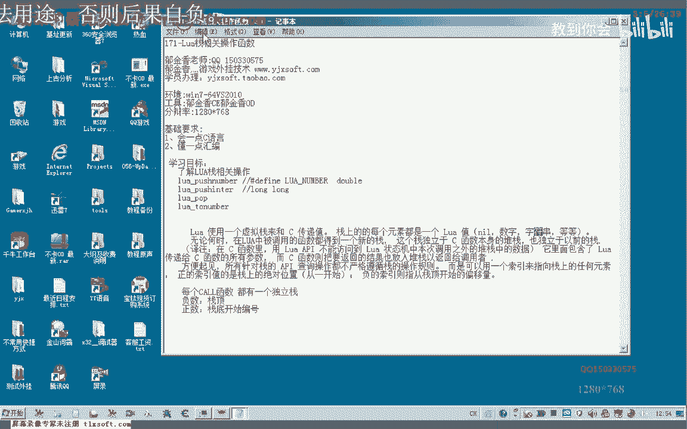

那么我们来做一些与战相关的一些测试。

嗯。

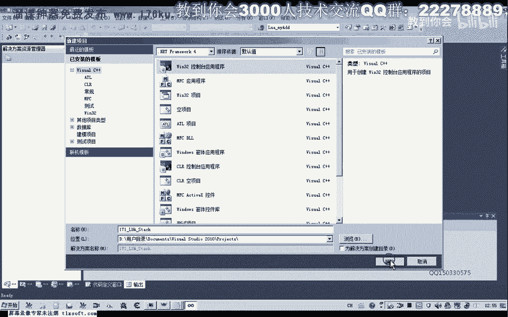

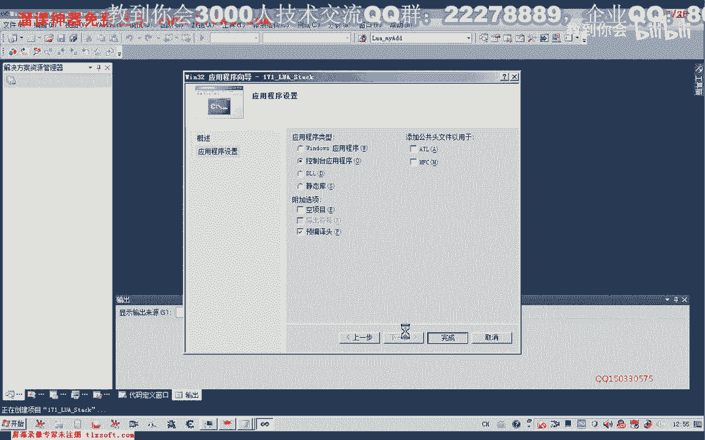

哈哈，那么我们也是先包含相应的头文件啊，要做测试之前呢，我们也是需要在我们相应的这个函数这里的，要注册我们的函数啊，然后呢再开始我们的测试，那么先呢我们可以先写一个啊相应的这个函数。

那么这里呢我们就是在相关的一个测试，那么在这里的话我们来看一下这节课呢，我们主要来看一下这四个与这个站操作啊相关的这个指定，那么我们之前的话应当都学过汇编啊，那么我们知道这个户型是压战啊。

这个pp是出战啊，所以说这前面的这两个的话都是入站的一个操作啊，那么这个呢是一个出战的一个操作，那么最后这一个人呢他是我们的嗯，这个取某一个站里边的啊，数据好的，那么我们先来做一些测试。

那么比如说我们先现在的话这个站呢相当于是一个空的站啊，你这什么都没有，那么我们先往这个站里面呢啊放一些数据进去，传入他的这个支撑啊，比如说我们第一个要战斗，我们编号呢就是集体抗，然后呢我们依次给它编号。

六个啊，1234，六那么我们用这个压战之后，我们怎么来查看这个站里面的这个数据，那么我们如果是呃在不考虑其他的这个啊数值的情况下，不考虑这个数据的这个类型的这个情况下。

我们可以直接就取它的这个相应的这个元素出来，那么因为我们这里全部都是呃右上的是数字类型啊，没有字串，那么所以说我们就不用去判断了，那么直接呢我们就可以了，嗯，把里面的这个相应的数据来取出来。

那么我们取出来之后打印出来看一下，那么注意他这里的类型的话，呃，这个number的这个类型呢，它返回的是我们的double类型啊，是佛典类型，那么我们取它的这个占点的这个元素来看一下，我们看一下啊。

正数正数是从战地开始的啊，这个时候那么我们看一下它占比的这个元素，那么这个先最先入账啊，那么这个呢就是所谓的占比好的，那么我们来看一下这个，当然我们要测试的话，我们还需要呢先要注册这个函数，好。

然后呢我们还要用ui z h的注册一下，那么后边这个呢跟的是我们函数所在的这个地址，那么平时写的时候的话，这个带l的啊，你这个不带l的这两个函数呢，嗯要注意一下啊，那么有时候呢如果是写错了。

编译通不过好，那么注册这个函数之后呢，接下来呢我们就可以以往都是存的方式来来调用它，注意这后面要加上括号，最后呢我们关掉，释放这个相应的这个环境，好的，那么我们来看一下，当然最后呢我们还需要让他暂停啊。

咳咳咳咳咳。

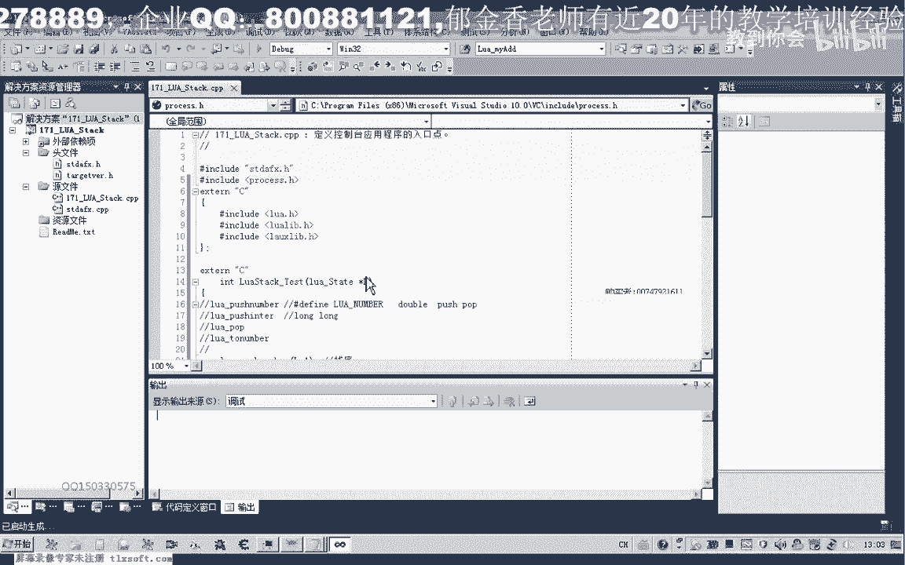

那么这个时候取出来的数字呢是一啊。

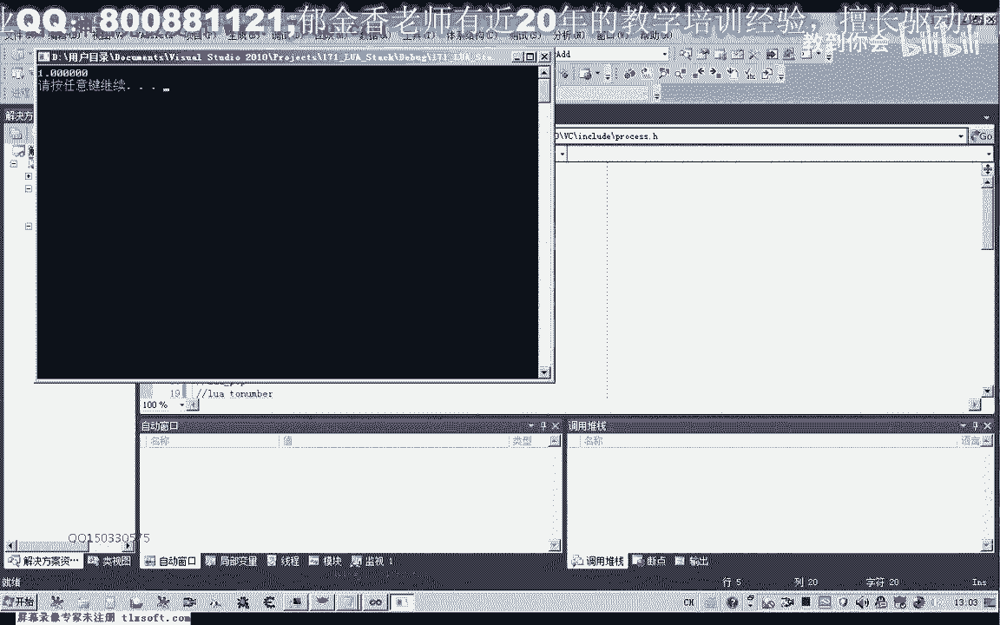

也就是我们最先压榨的这个参数，因为最后压榨的啊这个形成了我们的一个啊暂停，这个是在顶端的，那么也就是说他放的这个顺序的话，最后压战的因为是在占顶端，就是64321这样的一个顺序啊，第二战之后的话。

最后呢再占比的就是六啊，然后呢这是4321，那么就是这样的一个存放的一个序列，那么如果我们这里取-1呢，我们再来看一下。

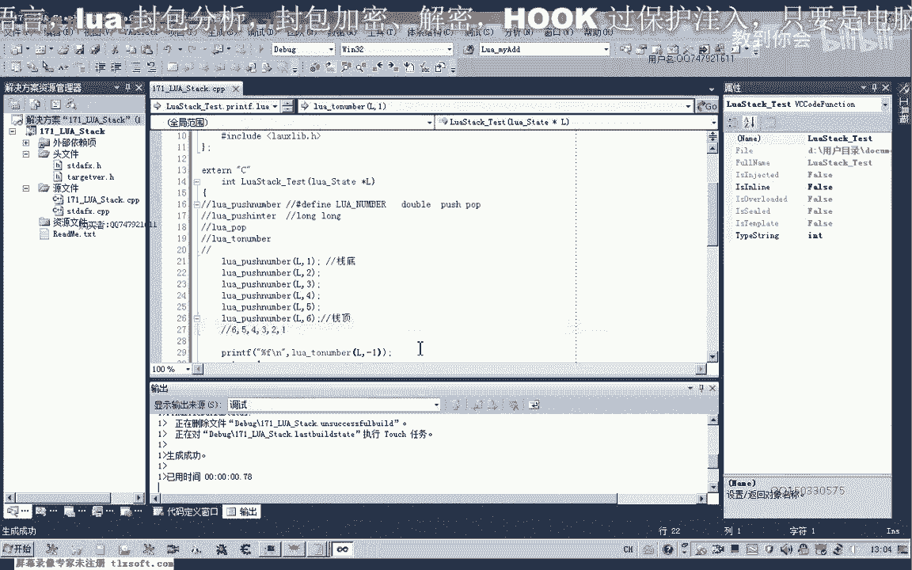

那么这个时候的话-1的话就为六啊。

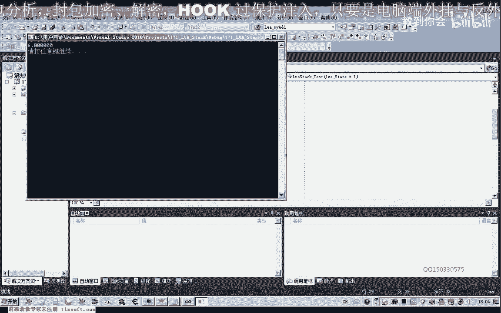

那么-1的话就是取得占比占点啊，而我们的这个证书的话就是取得我们的呃占比，那么这个是我们就去占据元素，那么取占占点，也就是说我们的可以这样这样说啊，就是说啊倒数的第一个这个或者是从占比开始的第一个参数。

这样好理解，好嘞，在下边呢就是从我们战局开始的啊，第一个元素，那么这个取值的方向它不一样，那么要取值其他的数据呢，我们可以呃依次比如说我们要取这个四，那么从占比开始的话，就是1234，它的序号就是四呃。

那么如果是从栈顶开始呢，就是123，所以说这两个取的都是四，那么我们把上面这个这两句了啊，复制一下，那么这个时候呢我们就是说从栈底开始的话，第四个元素的话就是趋势，而我们反过来说从我们的站点开始的话。

就是第三个元素，1231234，好的，那么我们来看一下，一起。

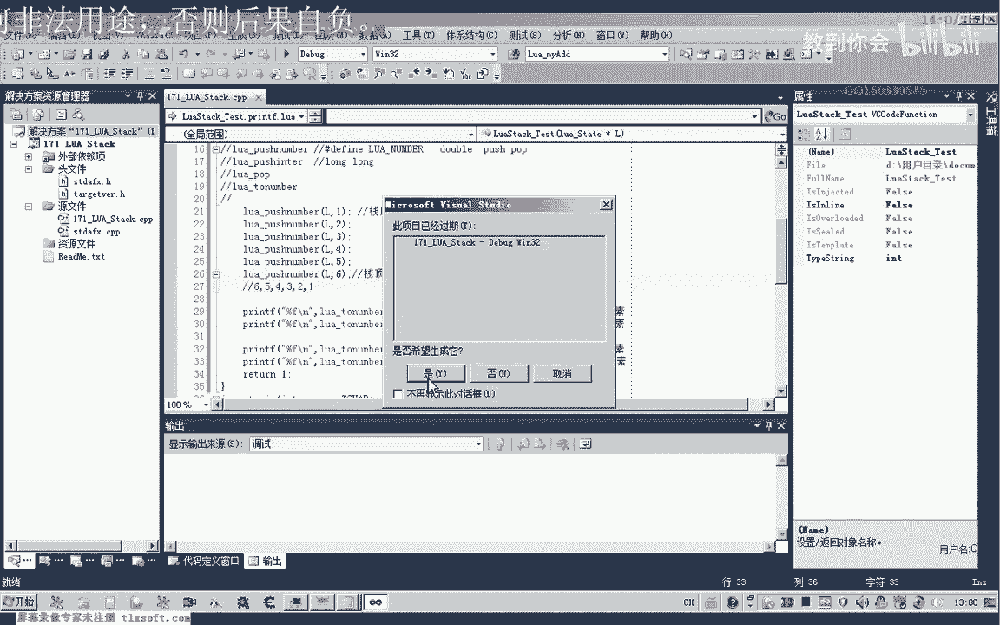

这两个我们取出来的数字呢啊都是v4 啊。

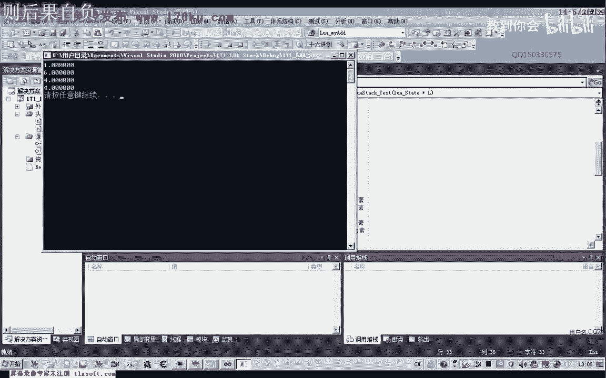

最后这两个，那么比如说我们要取这个参数，那么这个参数的话我们呢可以了，直接取二或者是负的，1234或者是负，那么这两个数值取出来了。

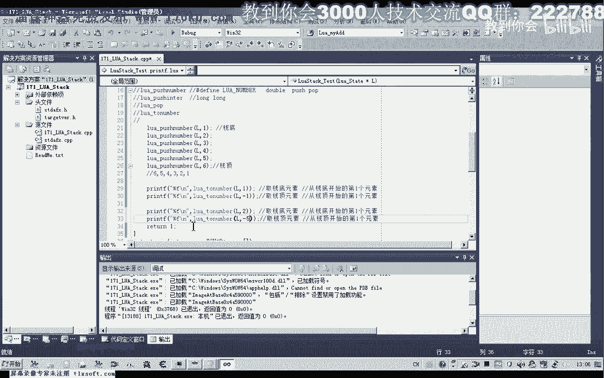

它都是指向同一个地址，啊都是取出的是数字的二流啊。

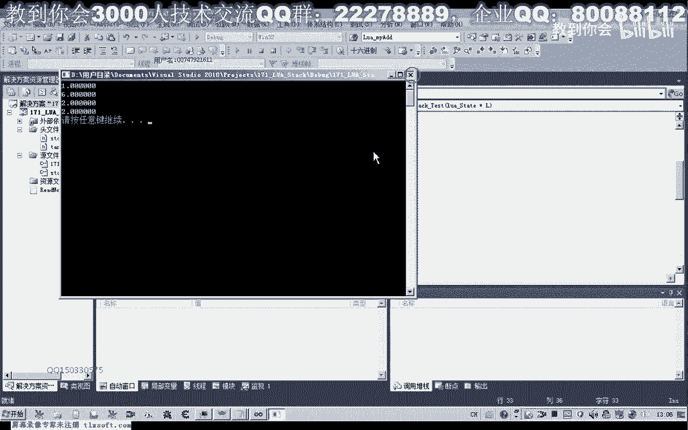

那么这里是从我们站点开始的呃，第二个元素，那么这里呢是从我们暂停开始的第五个元素啊，那么这就是我们的站的一个呃元素的一个取值，那么另外呢还有一个出战啊，coco啊出战。

那么出站的话就是把我们占领的这个元素呢弹出去，那么我们就来看一下出战的一个操作啊，啊这一段呢我们就可以先注释掉啊，为了方便测试，那么我们看本来他的这个从战地开始的话是654321，那么我们出战之后。

如果对，那么第一个参数呢同样是它的一个呃这个状态指针，那么第二个呢是要出战的，这个应该是一个个数这个n那么我们出战试一下除在外，然后呢我们再打印出这个占比的元素，看一下是多少，那么暂停的元素的话。

我们说的应该是成都啊，to兰博，然后呢暂停的话我们用-1来表示，啧，好那么我们看一下现在的占比人数是多少，那么现在呢它的元素呢就是四，因为这里弹出了两个元素啊。

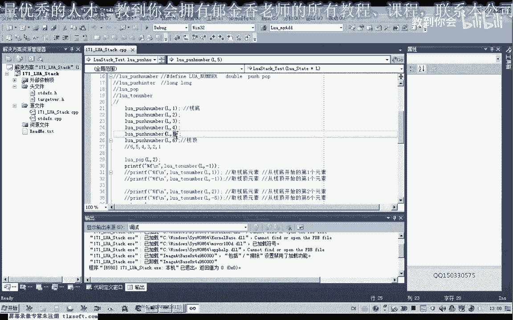

那么如果只弹出这一个元素的话，那么就应该是，啊这个时候就是那么如果是弹出了五个元素啊。

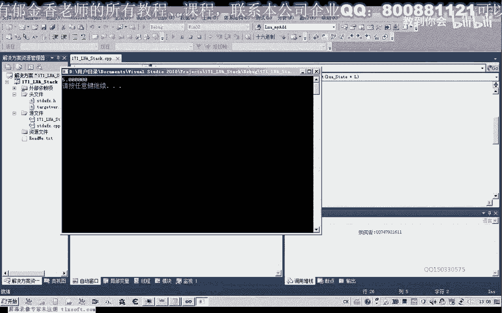

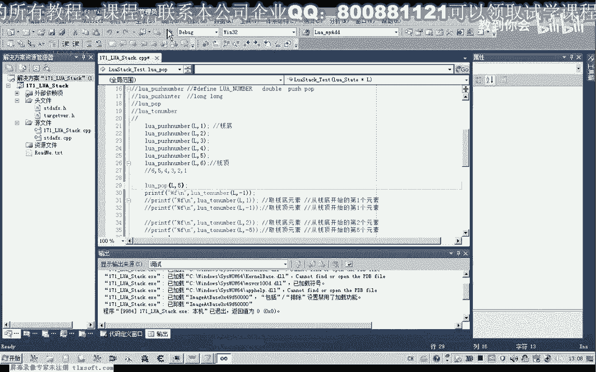

那么最后呢可能取得的这个占比和占比都是一了啊。

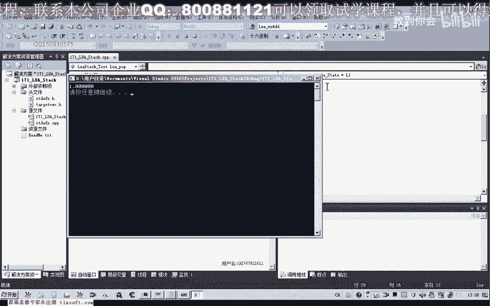

不管是正一还是-1，这个时候呢他们都指向一个值，因为只有一个元素了，这个时候这就是我们站的一个操作，啧啧啧。

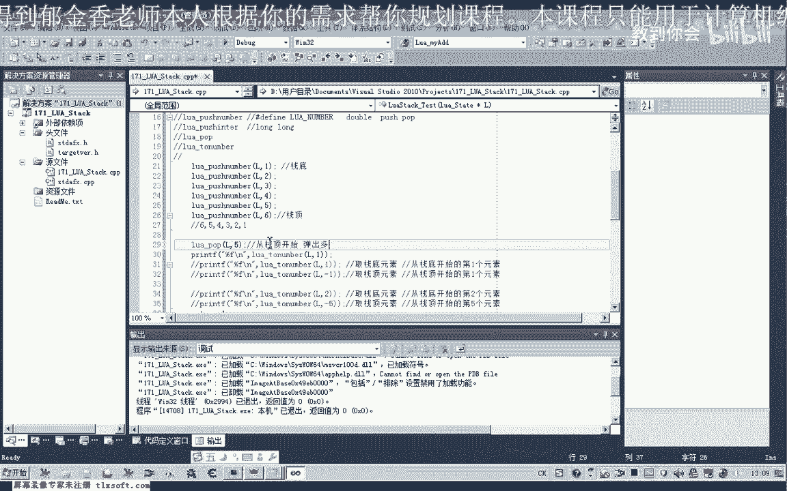

这里的话我们就是弹数五个元素，那么或者是我们呢也可以这样的认为，他把我们的这个战警的这个尺寸改了啊，让它的数值呢减掉了，所以说就指向了这个位置，减掉减1-2-3-4-5就指向了这个位置吧，减掉五个元素。

从这个暂停开始，那么减一的话应该是到这里加2t3 t4 加，那么这是我们的一个啊出战的一个操作，但是出战之后的话，他只对我们的这个占比啊，对整个战有影响，但是如果是没有涉及到我们占领的支撑的话。

他是看不出来是个影响的啊，那么比如说我们这里谈三个，那么它的这个数字能力仍然是一。

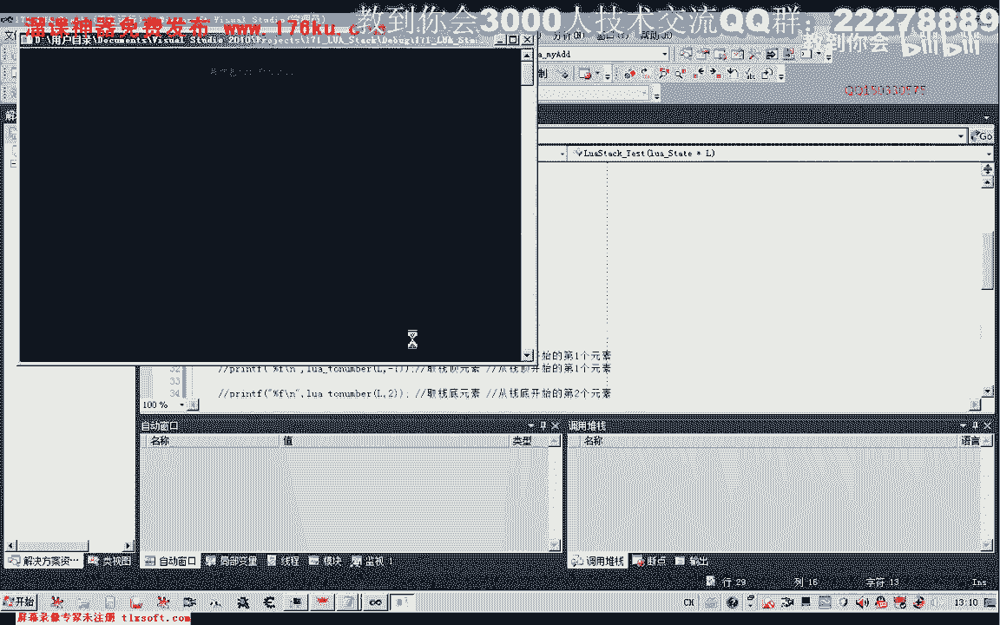

因为它只影响到这三个数据啊，这个占几个呢，他暂时没有影响到我们是弹出一个的时候呢，都不会影响到，这是呃占据的一个数据，当然只有这个相应的这个索引啊，弹出的这个数量的值，他超过了我们的呃这个站的大小之后。

或者是达到了一个占的最大的数字时候，才会影响到这个占比，那么我们来看一下弹出六个数据之后会出现什么样的情况。

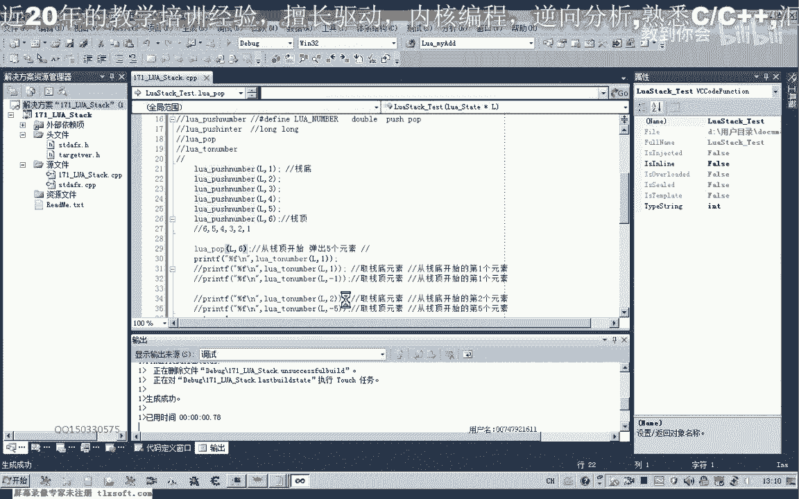

啊那么这个时候呢它取出来的数字呢就是一个就是零啊。

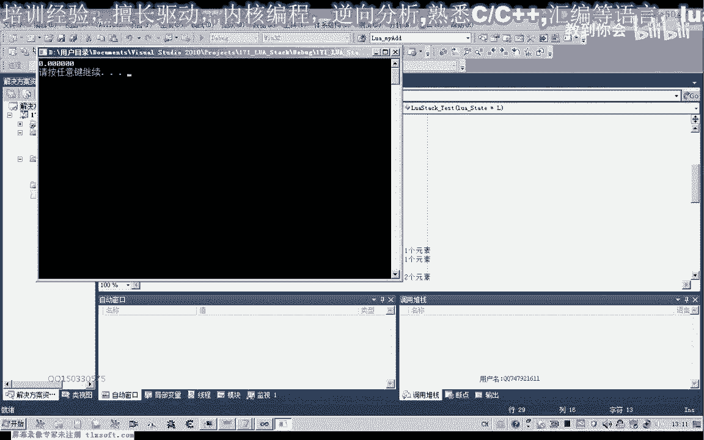

也就是说可能是我们取数字的时候呢，越界了哈，它已经到了一个未知的一个地方，指向了黄的，这个时候我们在取值的时候，这个呃占点的话，它指向一个未知的一个地方，当然我们的站点的话看就是了，这个时候。

这个时候实际上已经溢出了啊，好的，那么这就是我们的常用的几个指令，那么我们来看一下，还有一个指令不行，英特那么只是push ink来与我们的这个类型不太一样。

这个number呢它的类型呢实际上是stle类型的佛典类型，而这个push inter呢它的这个类型的话是long long long的一个类型啊，也就是说我在这这个环境下的话。

实际上也就是一个经过的差不多是这种类型的，但是不同的平台呢它可能有一些差异，但是在我这个平台上，那么这里呢我们也可以把它替换一下啊，n t e记忆，安提，那么这样的话压战的话它就是压的一个整数。

而不是火点数，那么在这里打印格式的时候就要注意，这个时候要用指数来格式化，不然的话这个时候呢他取出来也肯定是不对的，土郎中啊，他也能够转换。

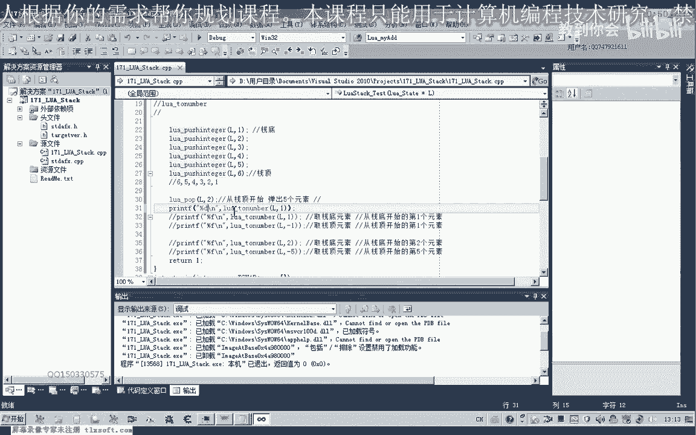

那么我们用整齐来看不见。

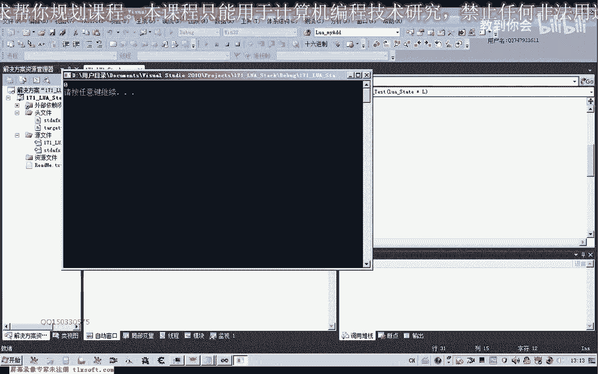

不形成，我这个亚战的时候是压战的一个整数进去，但是呢它沉到了我们的这个佛点站的时候呢，它实际上这个站里面呢它最终转换成了一个数据呢，嗯都是我们的这个打火类型，所以说我们取取值出来的时候的话。

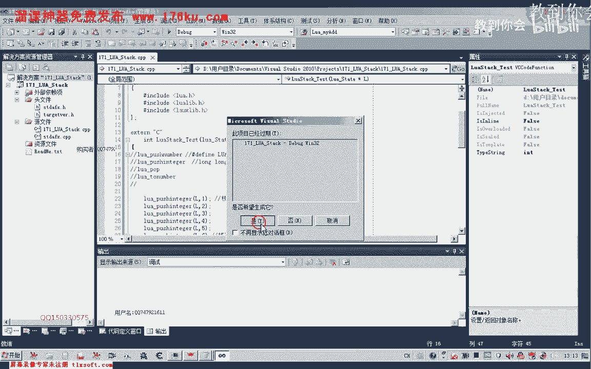

如果是整数的话，必须要强制的转换。

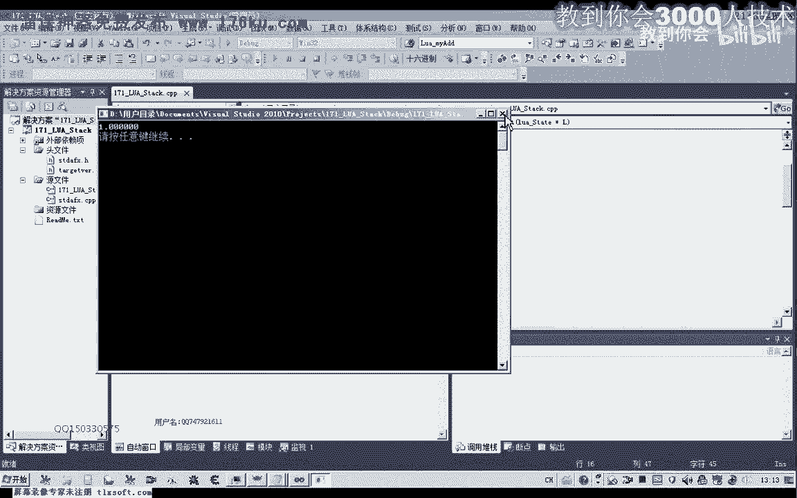

那这个樱桃和这个拉普的话啊，他们都只是说这后面的这个参数的类型不一样，那么这里呢嗯一般呢就不传火点数啊，火点数呢就是呢也会被转换成一个整数的形式进行压战，但是压到站里面的时候呢。

它会有一个自动转换的一个过程，它会最终呢啊转换成这个佛典类型啊，从这里呢我们也能够看到最终的它的呃取出来的这个数值的话啊，他返回了这个数值啊，都是我们的这个打谱类型，那么也有一个整形的啊，to int。

那么这里呢我们可以这样的转换一下，把这个战利品的佛点出来。

最终呢我们转换成我们的这个整数哈。

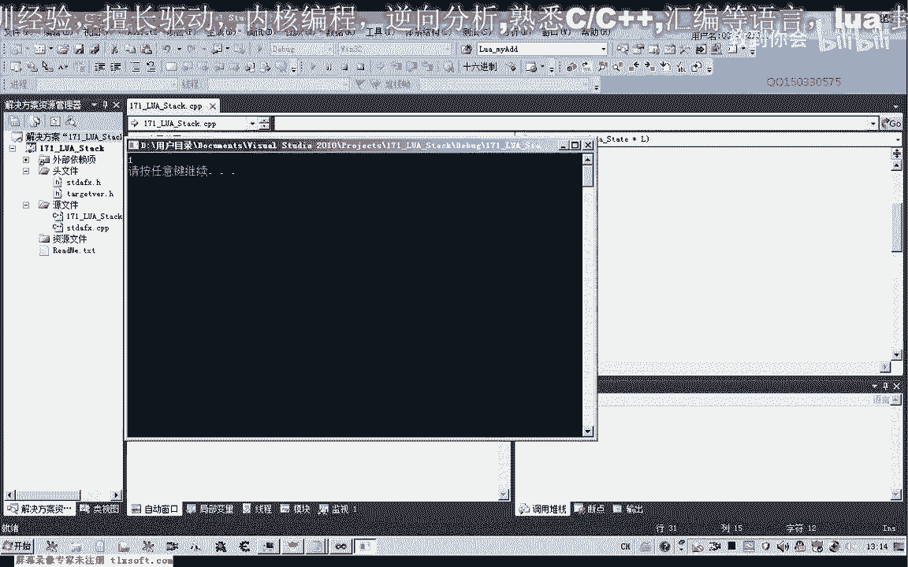

那这个函数呢我们也把它标记一下，图拉姆的，好最后我们总结一下啊，这个呢是去赚一个盐水，能换成w不会起，那么这里呢最终呢是转换成我们的一种类型范围，那么这个呢是把我们整数啊，把整数转换成最终呢。

它是要把它转换成double类型的，入站压战，不就是，那么这个呢是直接把我们的这个大型压榨，哈哈，那么这个呢是从我们的栈顶弹出几个元素，就相当于来改变了我们这个战局的一个指针的指针的一个地址。

那么比如说这里弹出两个元素的话，它本来这个地址的话，它就会指向这个地址了啊，像这个地址，那么它的这个相应的这个占点的只是相当于会做一个改变啊，好的，那么常见的对战的操作呢，大概就是这一些。

当然还有涉及其他类型的，我们直接啊在这个威胁助手里边呢，也能够看到它还有一些复习的指令，好我们见一下复习，那么我们可以从里边还还能够看到很多很多的呼吸这个什么结果呀，还有其他的数字线程字串啊。

或者是一个呃这个n l啊，空的这个尺寸啊这一类的，那么这里还有l s存储这个，但是呢都大同小异啊，那么我们在后面的这个章节呢，我们逐渐的来了解好的，那么这一期看到我们就暂时呢就呃交流到这里。

那么下一节课呢我们来看一下我们的这个函数啊，怎么利用我们的赞来，就是说呃传递我们函数的一个返回值，那么这个下去之后呢，大家可以对这个lover函数啊啊分词相关的这些资料来进行一下了解，啊，好的。

那么这节课呢我们暂时呢就到这里。

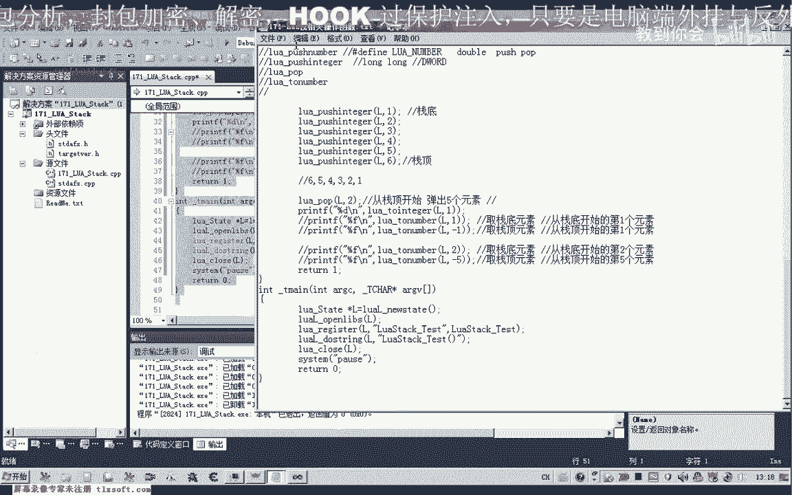