# 郁金香老师C／C++纯干货 - P163：174-LUA中的变量 - 教到你会 - BV1DS4y1n7qF

大家好，我是郁金香老师，那么这节课呢我们一起来认识了解一下呃，la当中啊，la脚本里面的这个变量啊，那么努尔的这个脚本的话呃，它也可以来独立的运行，也可以依附于我们的这个c c加加来运行。

那么它里面呢也可以使用变量以及数组啊这一类的，但是它的这个变量的话，它可以不指定他的类型的，那么而我们c加加的话，所有的这个变量的类型的话都需要来显示的啊，声明给它定义。

而这个lua当中呢它的变量的一个类型呢，它取决于它的一个赋值啊，那么比如说我们的，而且它的语法上来与我们c语言呢有一些区别，那么我们还是通过代码的一个测试来来做一下啊，呃区别啊。

那么我们首先呢可以建立一个相应的文本文件，当然它的后缀名呢我们可以是任意的或者是没有后缀名额都可以，那么我们在这里呢它方便编辑把它取名为lue的这个后缀名，那么只要我们这个不是写在函数里面的话。

那么它这个脚本里面的这个代码在do firever都会被运行啊，那么我们首先呢我们来看一下这一段代码，那么这一段代码呢我们加了一个loc的这样一个关键字，表明了它只是一个局部的一个变量。

不是全局的这个应用啊，那么在函数里面的话呃，它就只有了这个函数里面能够使用到另外的这个函数呢，他就不能够使用这两个变量啊，不能够访问它的一个数值，好的，那么我们先保存一下，然后呢我们打开之后啊。

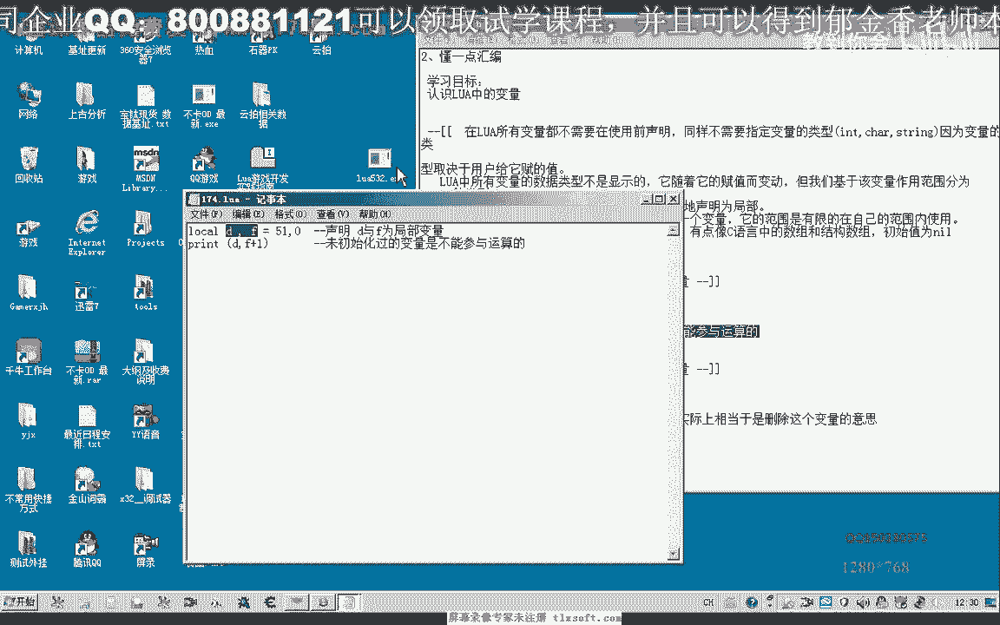

515的这个版本都发一下。

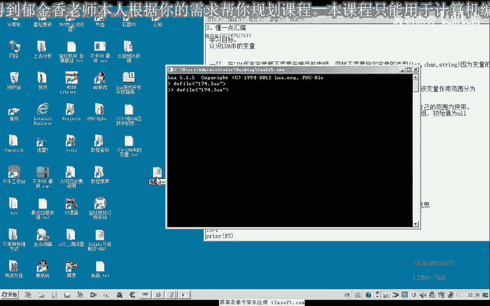

好保存一下，那么我们再次执行一下，后面这个括号好像写错了，do file，然后75，那么第二行的时候，他说那个什么啊，这个时候对的，都坏了，当地好，那么这个时候呢他输出了一个数字啊，551或一啊。

那么实际上呢就是输出的这两个变量的一个数字，那么要注意这里的这个变量呢，如果他在后面的话，它是按照这个顺序来赋值的啊，如果是是与我们的多个变量进行一个赋值的话，它可以来定义，定义之后呢。

可以单独的啊这个进行一个赋值，那么这里如果他不给他付一个初值的话，那么相当于来这个变量就没有定义，实际上因为它的这个变量呢啊默认的话它就会呃为一个啊空子啊，就是有一个数字啊。

n i l l它表示了会复制啊，那么我们再保存一下，看一下他现在的这个情况，那么这个时候呢它就会提示到一个呃这个相应的一个错误啊，就是说这个数值的话它没有赋值的话。

就不能够进行一个相应的一个运算的一个操作，那么如果我们没有进行运算的操作，我们再来看一下它的一个值呢，就是这个n l l l就表示了这个相应的变量，它是未赋值的或者是未定义的啊啊那么如果我们不定义的话。

它也是一样的，直接使用，那么他的情况啊，结果呢都是一样的，那么所以说呢我们一般在定义的时候呢，都会给它赋予一个初值，那么如果我们不加这个loker，直接给它赋值了，它就是一个全局的一个变量啊。

这个时候表示的啊就是一个全局的一个变量，它的作用预览不一样啊，这个时候那么当然当这个局部变量和全局变量的这个概念呢，呃与我们的这个c语言当中呢呃是类似的，那么所有的这个变量呢。

它默认的这个情况下默认都试了，全局变量都是全局的，那么除非除非让我们用这个loco这个关键字啊放在前面，那么这样的定义的变量呢，它才是一个局部的变量，那么另外呢除了这两种啊变量之外呢。

我们还有一种呢变量的关键字呢就是table，那么这个table的话它有一点类似了我们的这个数组啊，等一会儿我们一一的来测试，那么我们先测试一下这一段代码，好那么我们把保把它保存一下哈。

然后呢再来做一下测试，那么这个时候呢我们都会输出它相应的一个数值，再保存一下，那么在后面的这个数值呢，这里面没有输出啊，那么我们把下面这段代码给他改进一下，加一下，加上我们相应的一个输出。

那么这里的数值呢我们也可以改一下，嗯，嗯。

那么这里呢我们就是一输出的这几个point输出的一个数值，那么我们来对比啊看一下，那么首先呢我们是输出了一个df的一个数值，就是一个局部变量的五幺和一个全局变量的一好，那么这个呢它都没有定义它的类型。

因为它的类型呢就根据它的一个赋值的一个情况呢，来决定了我们这个变量的一个类型，那么我们继续往后边看啊，那么这个时候呢我们再一次输出的啊，同样是这个类似的一个语句，pd或f。

那么这个时候呢输出的就是幺幺或二三，因为在这里定义的话，那么前边的这个地啊，这个地呢它本身就是一个局部变量，那么在这里重新定义之后呢，就相当于它的生命周期了，就已经结束了啊，就结束了。

那么这个f呢是一个全局变量，那么按理说的话，这个f呢在这里呢它是有用的，但是呢这里我们输出的为什么是二三呢，因为这里的局部变量哈，它的一个定义呢离我们这个语句呢最近，那么所以说它有一个就近的一个原则。

那么来说一说它最终输出的一个数据的会是23，是这个局部变量f的一个数值，那么后边呢这个df呢又重新的呃进行了一个复制啊，那么重新进行复制之后呢，我们再次输出啊，就是我们的二或三三啊。

那么最后来这里这里呢又占一次的给他复制，那么这个d啊就赋值为1333f呢，因为后边呢没有一个负值的语句啊，那么所以说呢相当于把这个f呢删除掉了啊，所以说这个f呢在这里呢他最后呢是一个n i l l啊。

表示了它没有进行一个复制，或者说这个变量它已经不存在了啊，已经被删掉了，大致是这样的一个意思，好的，那么我们再来看一下他其他的一个类型呃，那么类型的话它除了前面的我们的一个整形的一个数字啊。

那么它还有呢也有一个布尔的一个类型，那么比如说我们这一段啊，那么这里是注释的一个语句哈，他不会参与运行，然后我们把这一段哈保存保存一下，那么同样的前边这一段呢我们也可以拿出死掉，啊把这个整个块注释掉。

那么他最后输出的结果来将是这一段，那么我们再用光标键移动啊，再次do file，那么这里呢他说出现了一个括号的这个问题，在第11行应当是在这个地方，哦这里有一个括号的一个声明。

那么我们把这个删掉再保存一下咳，那么这个时候呢它会输出啊相应的这个数值啊，就是一个增值和一个假值，那么在这里呢我们首先呢呃这个f一它赋值为增值，这里复制为假值啊，然后呢在这里呢我们先输出的是f3 。

但是f3 他后边呢改变了它的类型，改变为整齐了，所以说输出的第一个是一，然后呢我们再把这个f3 呢又复制为f2 ，因为f2 呢它本身的类型呢是布尔值。

那么所以说这里呢就相当于把他的f3 的这个类型的强制转换，然后呢f3 的输出的最终的输出了就是fs啊，那么这里呢f一或f2 啊，这就是最新的一个数字改成一个奖啊，那么这是我们的一个不能类型啊。

当然所有的变量呢它都是不用显示的生命，它的类型，它的类型的话，都要看它最终的由它的这个呃赋值的这个常量，来决定了一个变量的一个呃最终的一个类型。

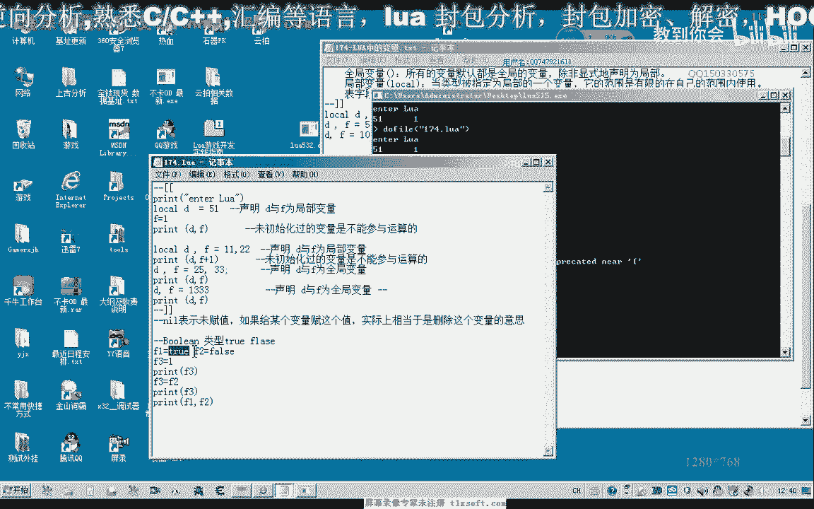

那么还有一种类型呢，我们就是呃比如我们的这个数字类型，那么数字类型除了整形之未来，还有我们的佛典类型，还有双精度佛点数这一类的，那么我们来测试一下，那么把前面的这一段啊嗯注释掉。

那么我们测试一下数字的这个类型，保存一下。

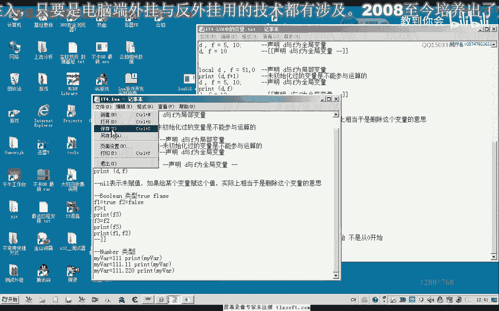

我没有建议移动啊，那么这个时候呢我们可以看到它输出的一个数值，首先呢这个my where are，这个变量它首先呢是相当于是一个整形的，那么然后呢打印出这个整形的数值，然后这一行呢他复制为可能是保存的。

按照他的这个路网里面的这个数据存储的方式的话，它应该是把它保存为一个双精度的一个类型的double，好那么这里呢它是一个double的类型，然后来打印出来，那么这里呢他也是这样的一个类型啊。

那么所以说这个变量的话，我们也可以这样的理解哈，呃就是说这个定义定义了一个整形的一个变量，存放了111这个数字，然后呢在这里呢他删除了之前的这个变量，然后呢重新又申请了一个同名的变量。

那么也可以说呢就是说同一个变量，它的这个呃它的类型呢可以不断的和自动的转换，这个关关键在于自己的一个理解，那那么这是一种数字的一种类型，那么当然它还有了我们的，也可以是我们的字串的一个类型，那么都可以。

那么一旦呢它这里的话复制为一个字串的话，那么前面的这几个变量的生命周期呢也都相当于啊结束掉了，而且呢这几个变量呢它都没有加我们的这个loco呃，这个关键字表明了它都是一个全局的一个变量。

那么在后面这个它的类型改变之后呢，那么前面的这个空间呢也就相当于释放掉了，好的，那么我们再来看一下，保存一下，输出一下它的数值，那么最后呢这里是一个字串人啊，一个类型。

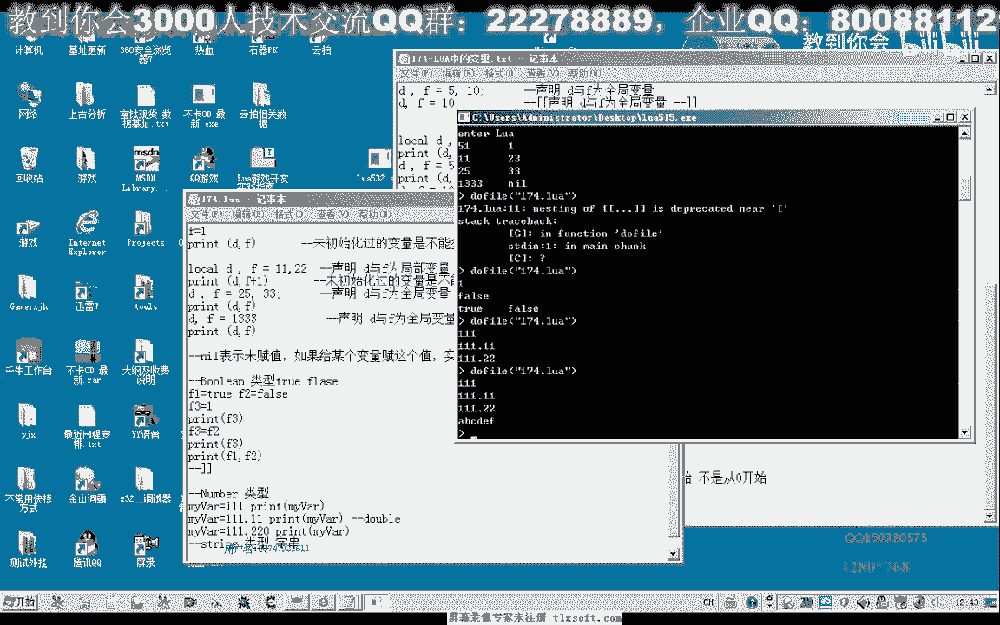

那么另外呢它还有一种，因为它这个la这个语言里面呢，它没有数组的这个类型，但是呢它有一种类似的一个类型叫做table，而这个table类型的话，它的赋值的方式呢也与我们c语来一些相似。

但是呢它的功能的话比我们的这个数组的话还要强大一些啊，也要复杂一些，那么我们现在现阶段的话，我们暂时来就可以把它当成是一个数组来使用啊，这个table好的。

我们把这个tab相关的数据啊移到里边啊啊这个注释这里加到最后边，那么前面这段代码呢都成了这个注释，就没有相应的这个不会被运行。

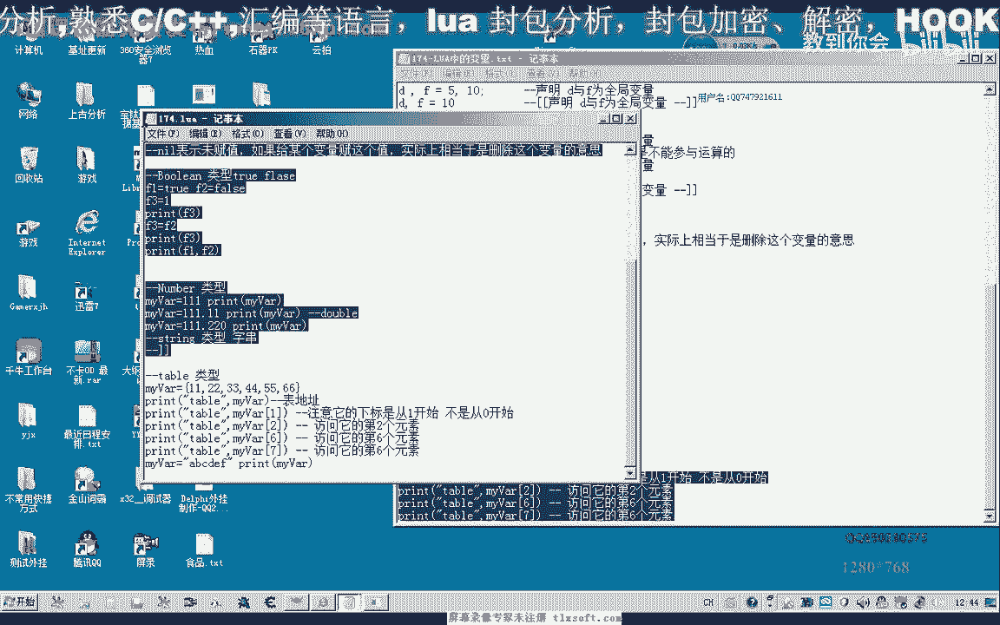

然后再保存一下，再到这个控制台下执行一下好多file，那么这个时候我们来看一下它所嗯它的一个意义，那么首先呢我们这里呢这个my vr，那么这里呢也就相当于是我们c语言当中这个数组的指针的哈，守地址啊。

这里那么当他访问第一个元素的时候，一啊这里打印出来贴补，那那么这里呢取的是他这个元素里面第一个数字幺幺，然后呢我们的下标为二的时候呢，是取的第二个数值，那么下标为六的时候取出来就是665啊。

但下跌为期的时候呢，它下标越界了哈，相当于这个数值呢并不存在不存在呢，那么呢就是说这个呢为父子未初始化，他最终输出的是ni a l啊，他是不认识这个相应的这个变量，因为没有做相应的一个赋值啊，是这样的。

而且呢还要注意一点，它的这个下标的话是从一开始，而不是从零开始，那么如果大家对这个lua语言不是很熟悉的话，那么大家呢呃可以了，就是经常的写一些代码，然后呢在我们的控制台下面呢进行一下测试啊。

当然这个这一段呢相应的这个代码的话，也可以在我们这个呃c加加的这个平台下啊，运行在他的控制台里面输出相应的这个代码也是可以的，那么还有一点呢就是我们的比如说我们用这个记事本啊，上一节课我们也说了。

用这个记事本来编译这个脚本的话，就是显得了呃很复杂，那么有很多关键字来看到我们嗯记不了。

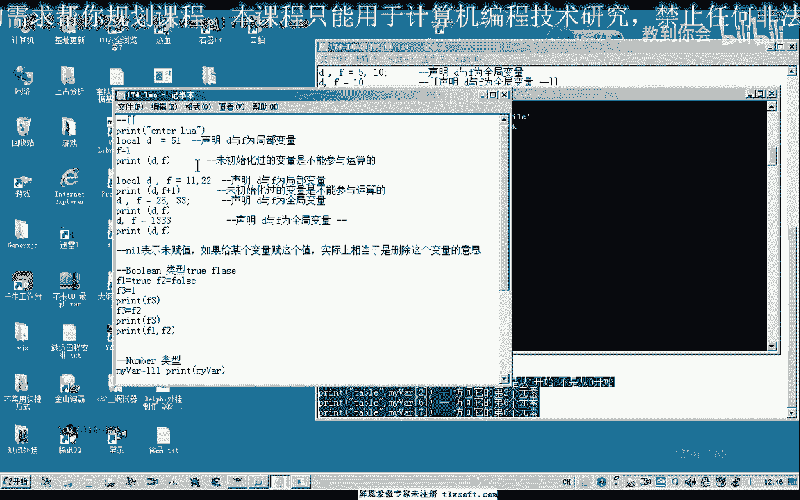

那么可以，所以说我们这个卢瓦脚本的话，它实际上也有很多这个集成开发的环境啊。

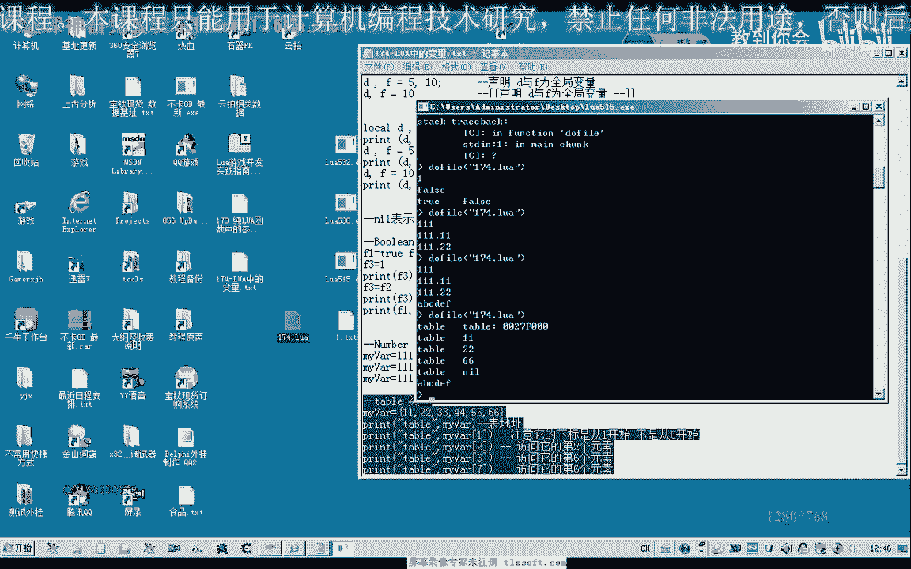

类似于我们的这个vc加加的这样一个开发环境，那么呢它有大量的提示，也可以直接的呃直接的进行一些简单的语法的一个检测啊和调试。

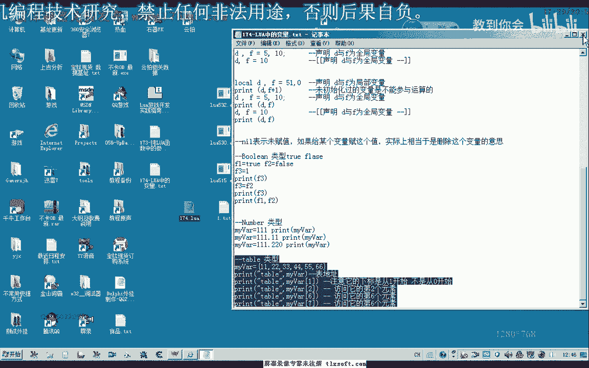

那么比如说我在这里呢也安装了一个啊，在网上下载了一个这个啊破解版的这个lua studio啊，studio，那么这个环境的话它就可以了呃。

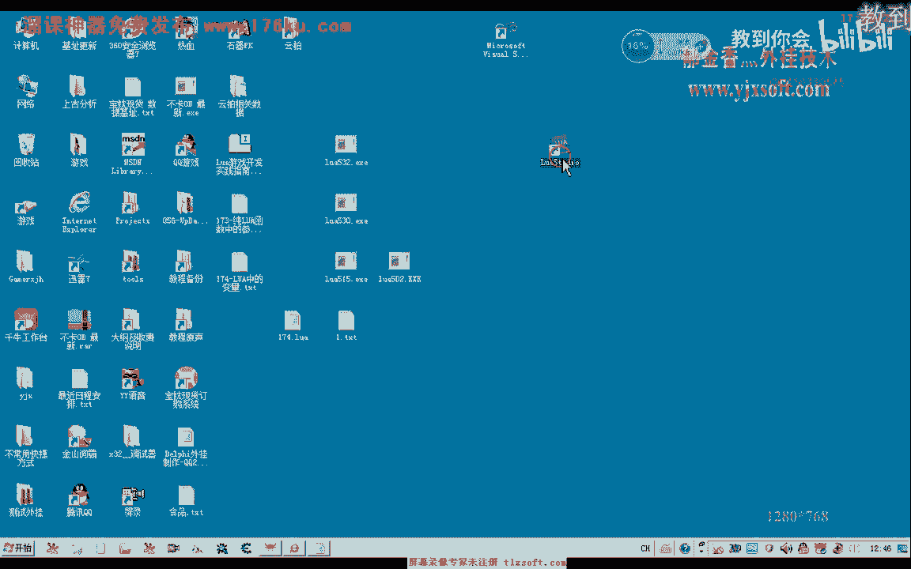

提供了一个集成的开发环境，那么同样的我们把刚才的这个脚本打开。

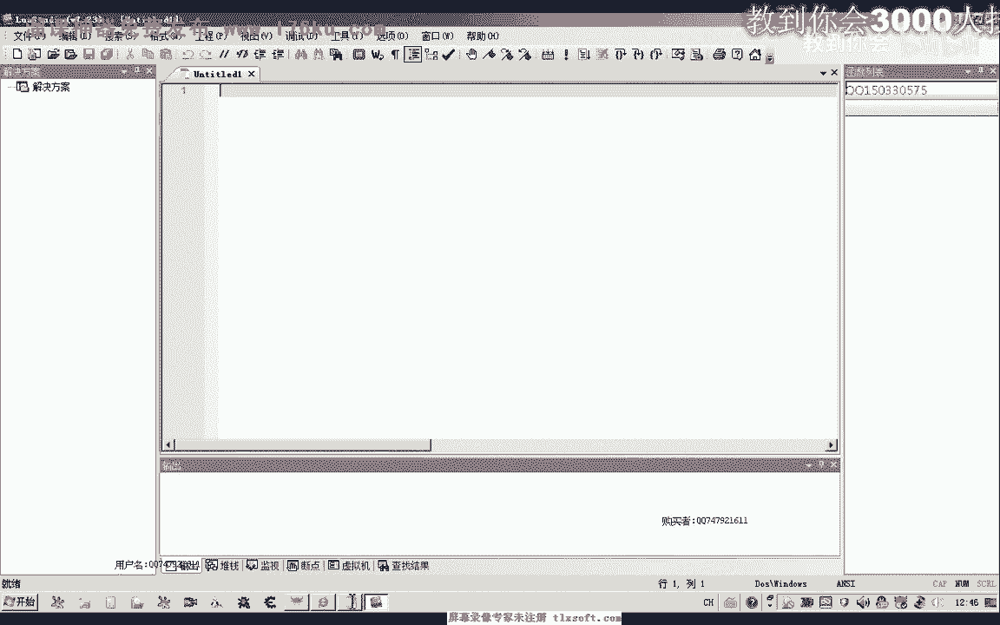

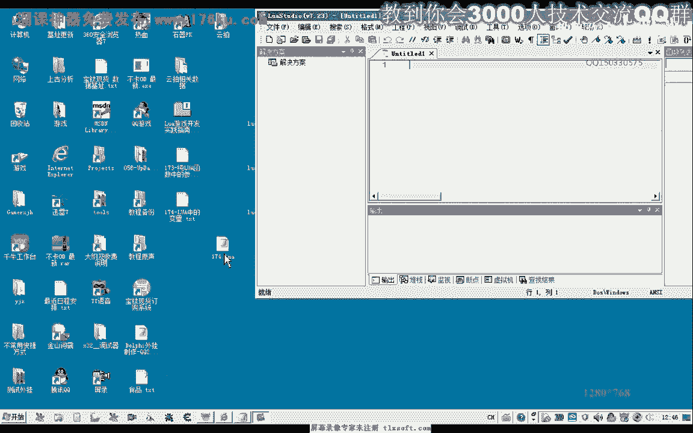

它也可以在里面的这个集成环境下面啊，直接就运行，然后我们把这两个选项啊加上。

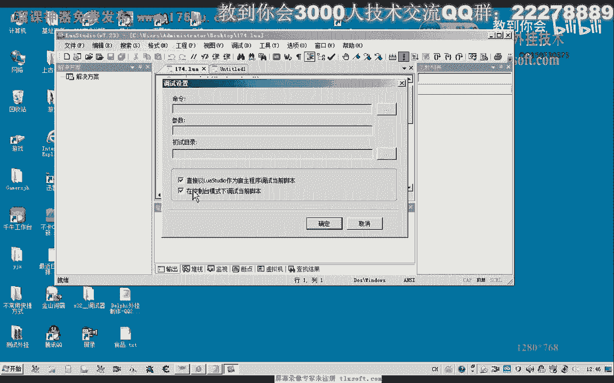

然后的话我们可以看到啊，这里的话他也可以有一个它的一个控制台，但是我们要注意它的这个控制台版本的话，最好呢我们在vc加加编译的，为了方便哈同步的话，因为它的这个版本的话，这里呢是515的这个版本。

那么所以说呢在这里呢我用控制台测试的时候呢。

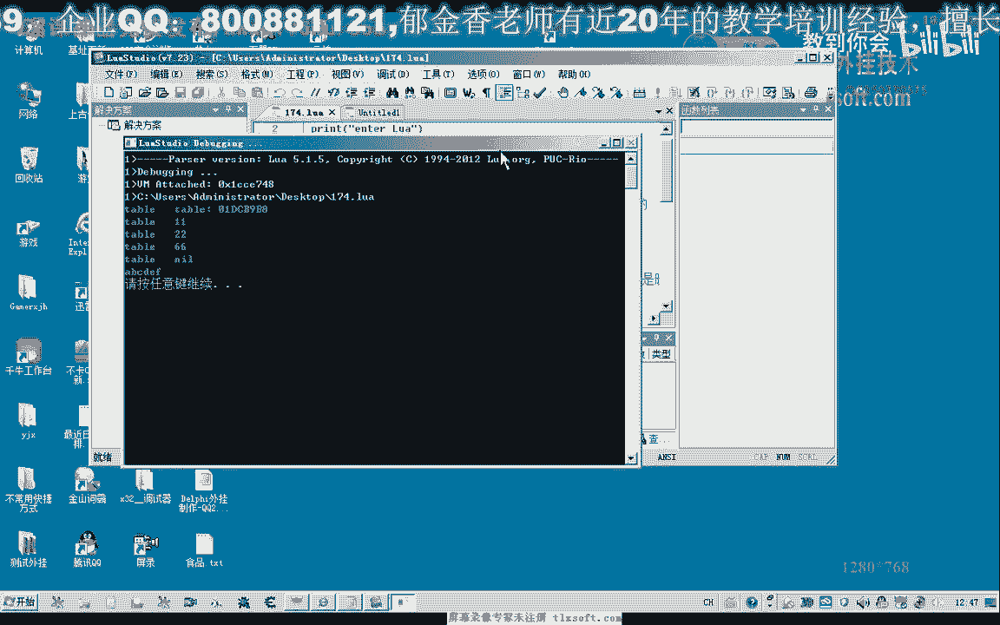

也是用的这个515的这个版本，而不是用的最新最新的这个5320或者四五个三零，那么因为这里的话它有一些区别啊，所以说这一点在这个平台的话，它不是越新越好嘛，是够用就好，还有呢就说我们515这个版本的话。

5。1版本的话。

网上的资料是最全的啊，那么在这个集成环境下面开发的话，那么他很多呢都是也可以就是批量的哈，注释也可以去掉注释，啊，那么这里呢所以说它的也有提示啊，它也有一些提示符，那么这样的话我们编辑起来了啊。

最终我们保存之后呢，也可以保存它最最后啊，那么这样的话我们比较容易呃来编辑我们的这个脚本，以及检测它的这个语法，那么也可以来直接啊运行。

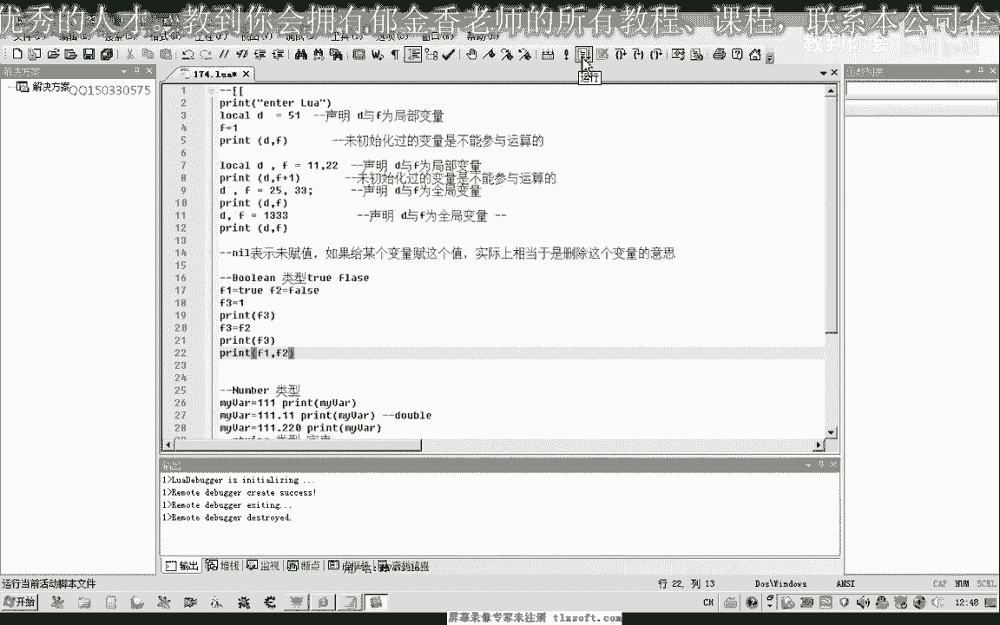

但是呢我这个版本因为是它也有一些毛病啊。

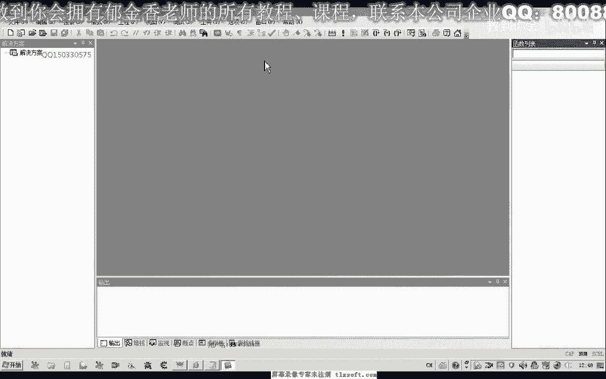

有时候呢无缘无故的就退出。

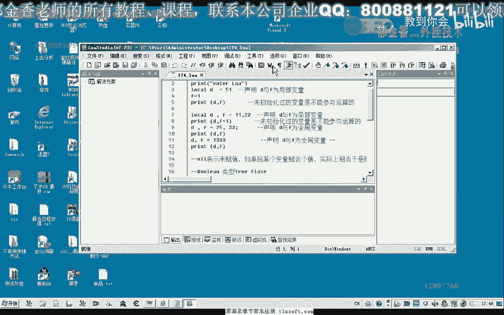

那么答案也可以直接在这下边的输出结果啊，让他说一说，非常的方便我们的这个调试，那么大家呢可以到论坛去下载一个，那么这个版本呢我也传到了论坛，是一个绿色的一个版本，那么我日出一点小错误了。

他也不会影响我们的使用，好的，那么我们关掉这个环境。

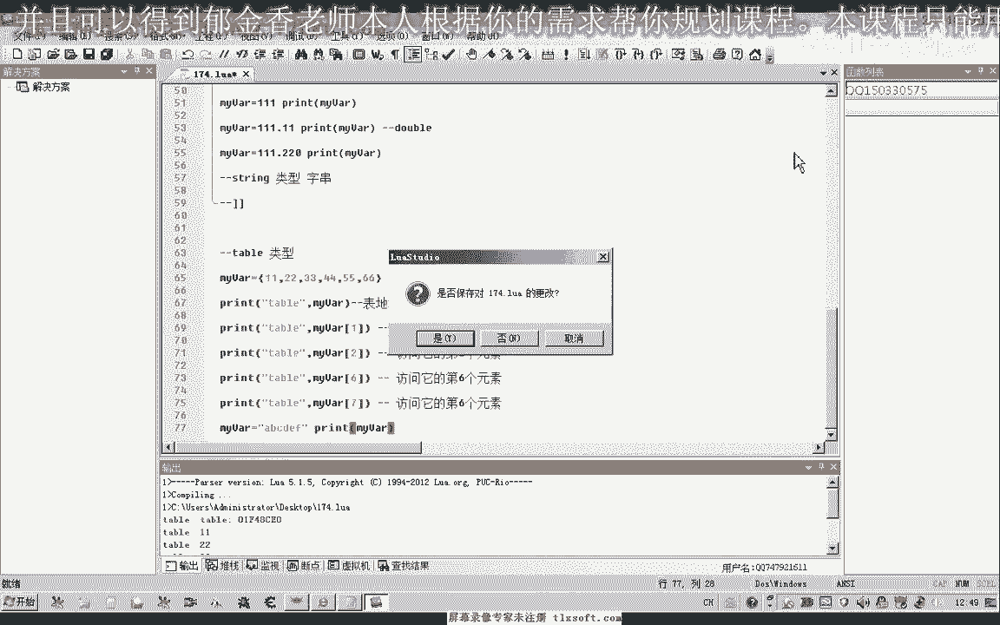

那么这一节课我们的这个测试呢就到这里。

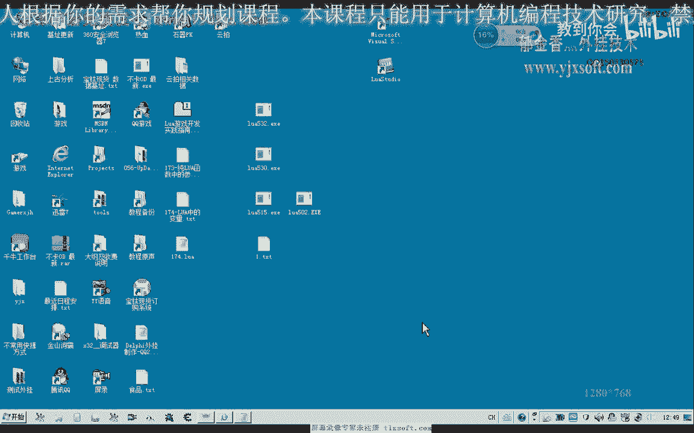