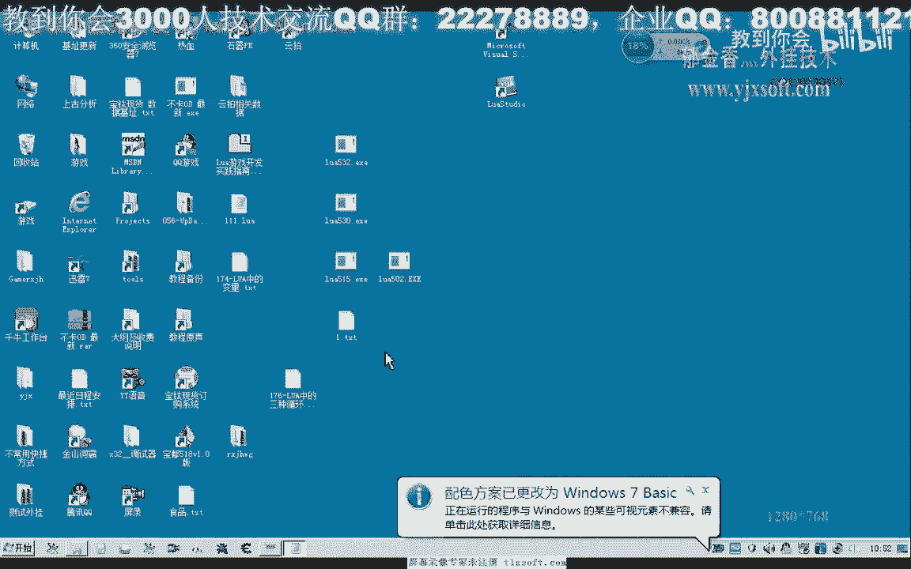
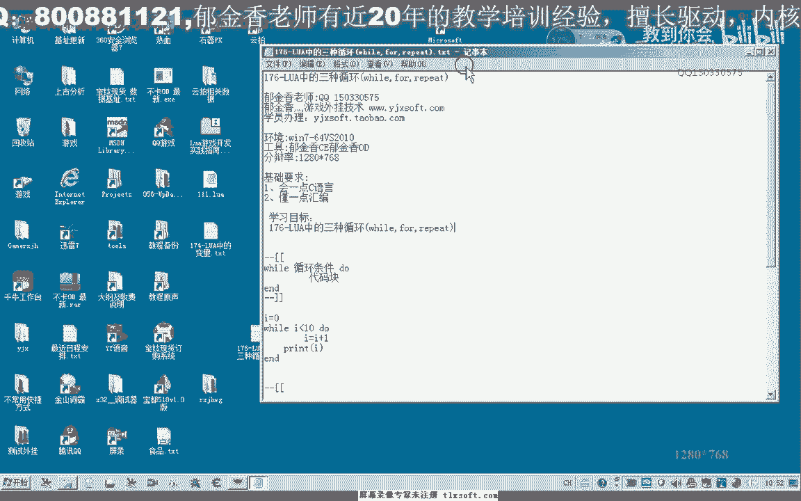
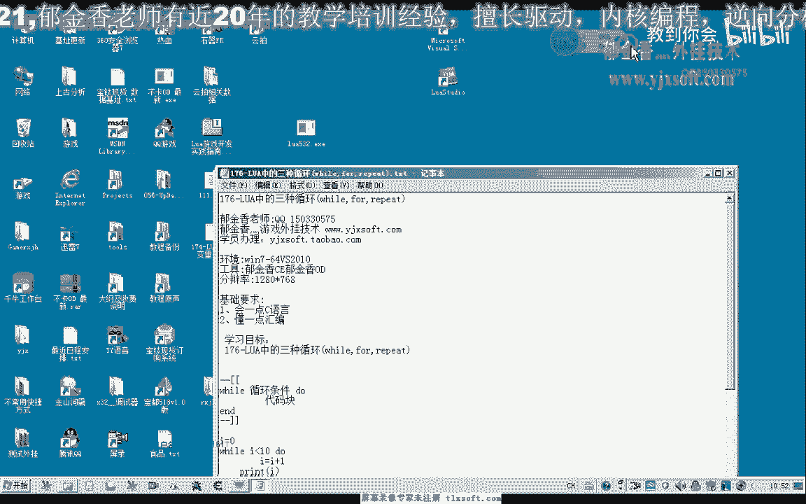
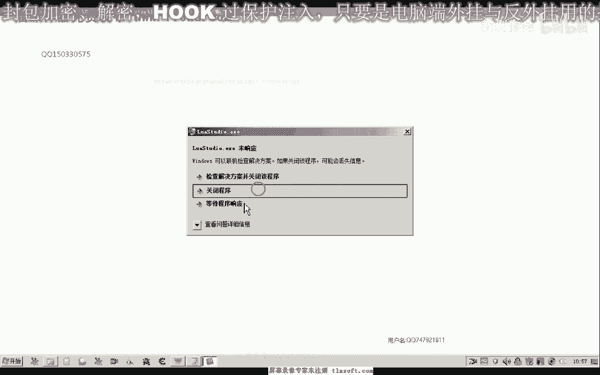
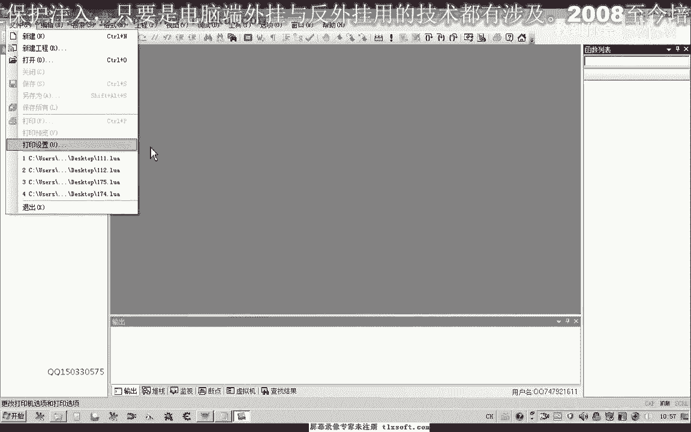
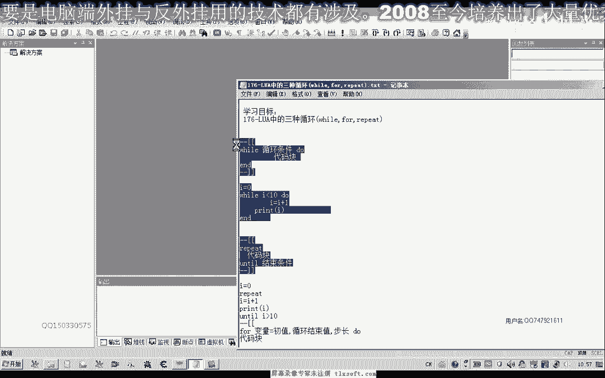
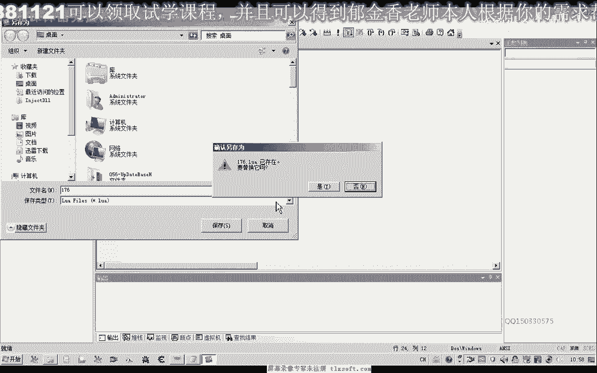
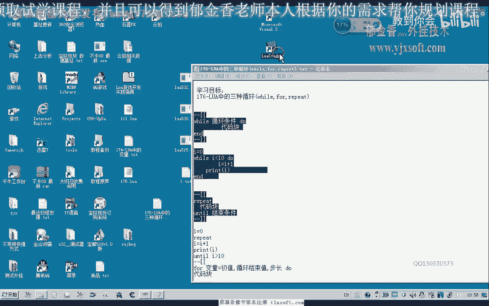
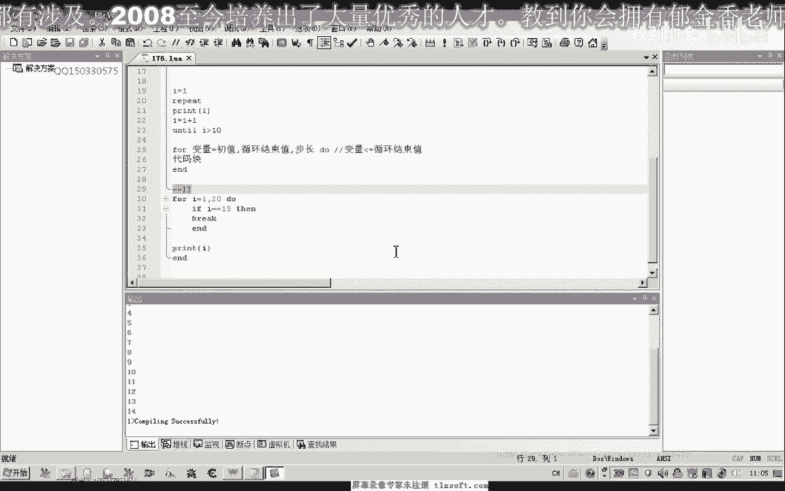
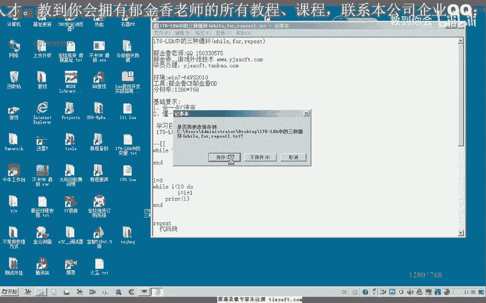

# 郁金香老师C／C++纯干货 - P165：176-LUA中的三种循环(while,for,repeat) - 教到你会 - BV1DS4y1n7qF

大家好，我是郁金香老师。

那么这节课呢我们一起来了解一下ra当中的循环，呃，它的这个循环呢与我们c语言里面的这个循环的话基本上是一致的，呃但是在语法上呢。

这个规则上呢有一点点不同啊，呃那么这节课呢我们借助这个卢瓦的这个集成环境。

来测试一下它的三种循环，那么首先第一种呢我们测试一下啊，这个vision循环，那么y的循环呢首先呢它是一个循环的条件，那么这个条件的话为真的时候啊，那么这个循环的条件呢，它等于我们的出啊。

为一个增值的时候呢，它执行下边的一个代码块，那么如果当这个条件呢它为一个价值的时候呢，则退出这个循环，那么比如说我们这一个循环，首先定义一个变量，它的初始值为零，那么在小于等于的时候呢，我们执行它啊。

那么也就是说它会输出呃，如果我们这个改变它这个变量数值的语句在后边的话，它应当是要输出一道一时的啊，这个整数啊，quantic好的，那么我们来看一下嗯嗯，那么这里呢我们能够看到一个调试的一个输出哈。

呃一到意识，那么如果他的这个条件我们是呃大于等于一时的时候才执行，那么这个时候为零的话，他一次都不会不执行啊，一次都不会再去执行，那么比如说我们在这个时候呢，我们可以写一下啊，小于等于三。

那么它就会执行四次，这个时候01234，那么这个就是我们的这个y2 的循环，那么这里呢是它的一个条件啊，这里是一个代码块啊，那么我们都相信大家对c语言的这个y循环呢都有一定的了解。

那么这里呢我们就过多的做这个研究，那么我们再来看一下第二种啊，循环repa，那么这个repeat的这个循环的话，那么这里的这个循环呢它至少呢会被执行一次，因为他的这个条件呢为真的时候呢，它就结束了哈。

就结束，那么这一点呢有一点不一样啊，结束的一个条件，好的，那么我们来看一下，那么同样是要输出呃，一到十的这个整数的话，我们可以这样的写，那么复制一个初值repeat，那么中间呢这里是代码块啊。

最后呢这里我们要给它加一个条件，i小于再进行历时的时候呢，我们才执行，那因为他最后呢至少会被执行一次的，在这里头我们哒哒哒哒哒打印，变量i的这个数值好，那么我们执行一下，那么我们要注意的一点呢。

就是它这个条件与我们之前的这个挖掘这个条件呢它不一样啊，它是一个结束的一个条件，当这个一啊，所以说它这里呢只会循环一次，因为这个一呢它小于等于一时，这个条件成立了，他直接就退出这个循环了。

那么所以说我们这里呢应该用大鱼啊，大于等于一时的时候呢，我们才退出，但是呢这里呢它会一直的这个执行，因为我没有去改变它的一个数值，所以说这里成了一个呃这个死循环语。

他。

嗯。

好那么我们再来测试一下，那么这样呢他输出最后呢会输出1~10的这个序列啊，最后呢当这个等于一时的时候呢，他就退出这个循环，我们保存一下。

那么实际上呢只输输出了1~9，因为我们的这个相应的初值呢它是放在后边的，那么我们需要放到前边啊，或者说在这里呢我们把它的条件呢改为大于一时的时候呢才退出，那么这样的才是输出的。

最终来输出的数字呢是1~10，那么所以说这两个条件它是不一样的，这里是条件为真的时候呢，呃它结束啊，那么前面这个循环条件的话，它是条件为增值的时候了，继续地执行我们的循环体啊，代码块啊。

而这个下面这个条件成立呢，他就退出这个循环体啊，代码块，那么所以说这两点啊是不一样的，那么还有第三种循环是最常见的，也就是我们的一个for循环啊，哈哈哈，那么这个for循环的话。

它首先呢变量初值循环的结束的一个数值，那么这个循环的结束的数字呢是指的这个变量的这个数值，在大禹等于这个数字的时候，好像就会结束啊，我们具体呢我们来测试一下。

因为它与我们的c语言里面的这个格式了有一些不同，啊那么这种格式的话，我们要算一下，这种呢是有关这个表的一种循环啊，暂时来说设计，那么在这里呢初值，然后呢是它的最终的一个数值，这个呢是不长啊。

那么我们测试一下，那么这个时候呢我们就输出的是1~10的这个数值，那么这个部长怎么理解的啊，以前我们应当也有用过，在david点啊，嗯这里的话就是说i的质量它每次加二啊，就相当于。

那我每次增加到这个数值，那么如果这里是五的话，我们呢就执行两次哈，执行两次，因为i的初值呢是一，那么他第一次来输入一，第二次加五之后呢，就等于六啊，那么第三次6+5的话就等于幺幺。

那么幺幺呢它大于大于一四之后呢，所以说他就退出了，他最多也只能等于等于它的时候呢，大于等于它的呃，应该说是大于它的时候就结束了，只有小于等于的时候呢才执行好，那么这个数值的话。

也就是说最终它要执行循环体的条件呢，是这个变量要小于等于我们的循环，那么这个部长呢就是每次这个变量增加到这个数值补偿就行，好我们再来测试一下，那么比如说这里为三啊，那么幺八的时候呢就会结束啊。

因为二幺的话它超出了啊，这个时候呢我们每次的步长呢会是三，当然我们这一个最终的步长呢也可以省略掉啊，省略掉，我们看一下会是什么样的情况，那么那么省略掉了，实际上它就与我们这种形式相等的。

就相当于步长是一啊，相当于我们的补偿信息这种情况，那么这个是一的情况下呢，我们一般可以省略掉，那么另外呢我们还有一种呃在循环体里面呢，我们还有一个呃break关键字。

那break呢比如说现在本来是可以呃运行20次，啊21次应当是双方，那么我们可以给它加一个条件，判断逆，那么i的值如果大于一时，那么就不k那么我们再来执行看一下哈，那么等于一时的时候呢，它就可以执行。

那么大于的时候呢，他就不会执行啊，就不会实现了，那么或者说我们可以嗯，就是条件成立的时候呢，他就啊退出了我们整个循环体不会被执行的，这个与我们c语言当中的break，它的意义呢也是一样的啊，也是一样的。

那么我们也可以呢呃在大于它的时候来才打印啊，嗯，不太卡，嗯嗯那么我们也可以再等于某一个数字的时候呢才退出也是可以的，不知道，但是这里边的话好像它是没有这个卡片，好像也有这个关键词，看一下。

他们有这个继续的这个执行的，只有用我们的这个衣服语句来来进行一个控制日，好的，那么这节课呢关于我们这个几种循环的这个形式啊，那么我们就讨论到这里，那么如果还有不清楚的地方呢，建议大家下去之后呢。

呃多做一些测试啊，多做一些测试，好的，那么我们下一节课再见。

