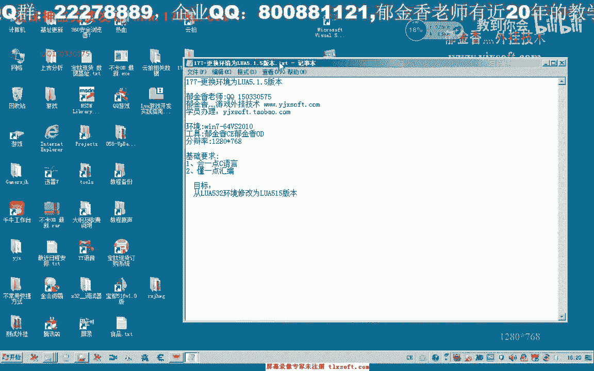
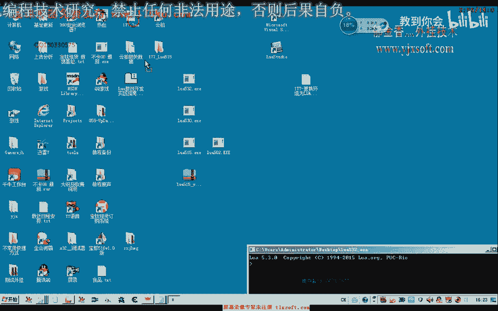
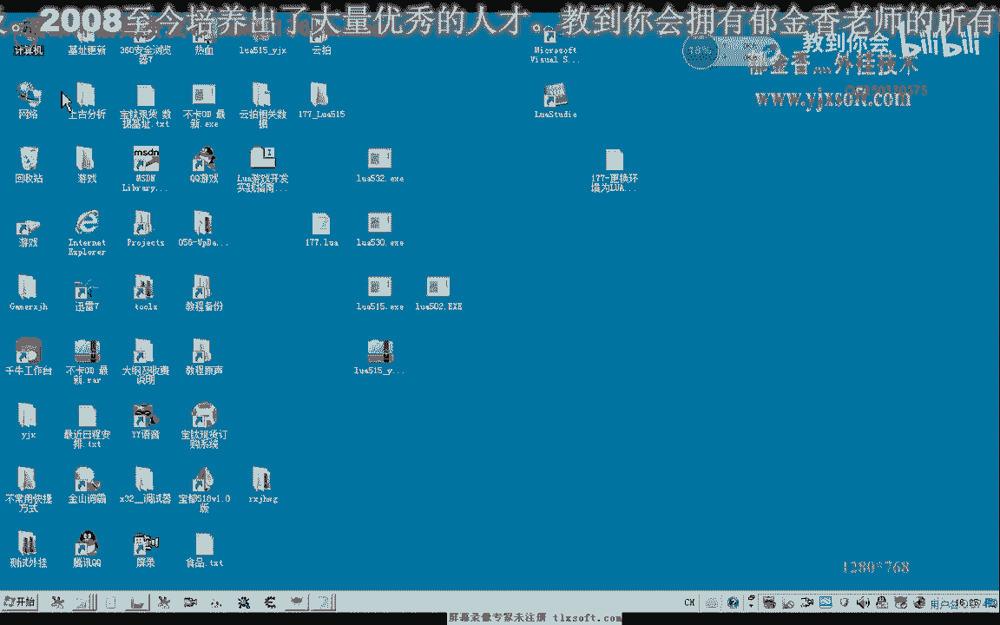
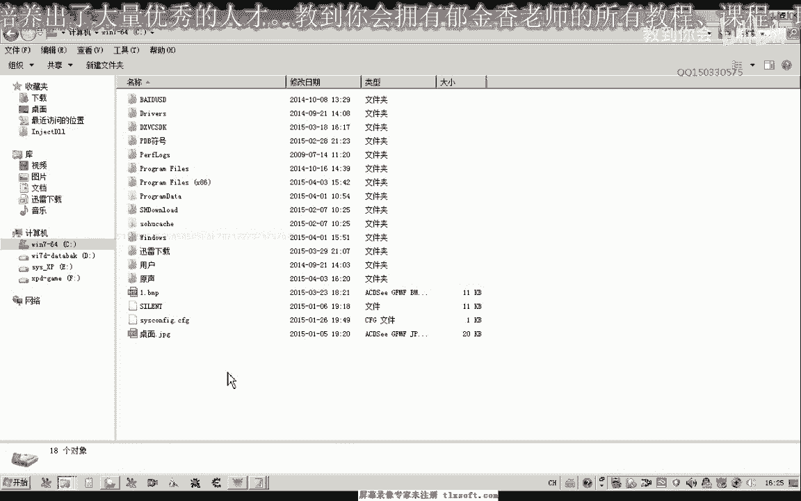
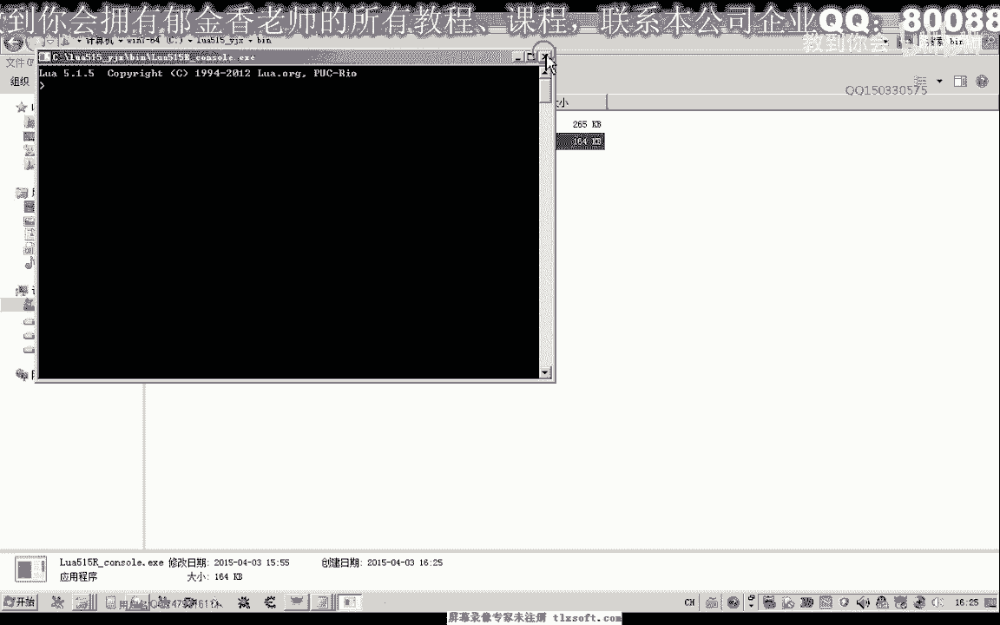
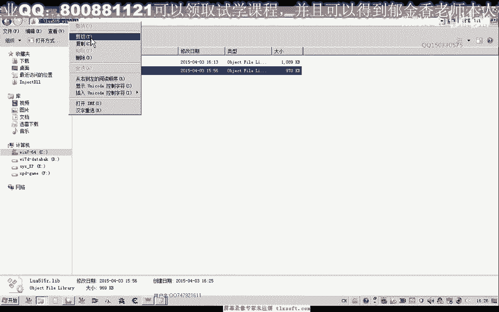
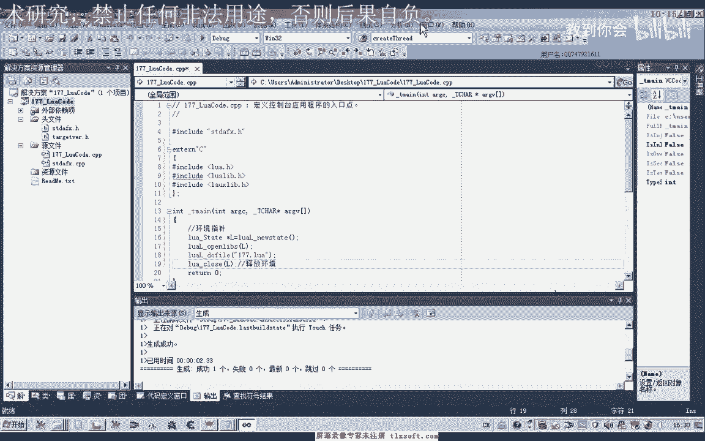
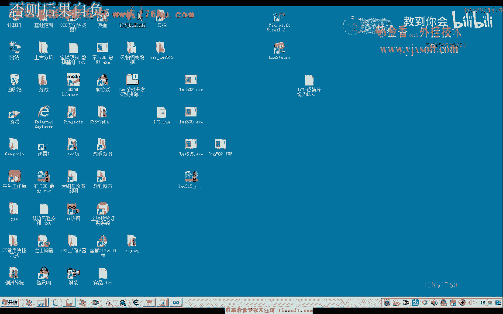
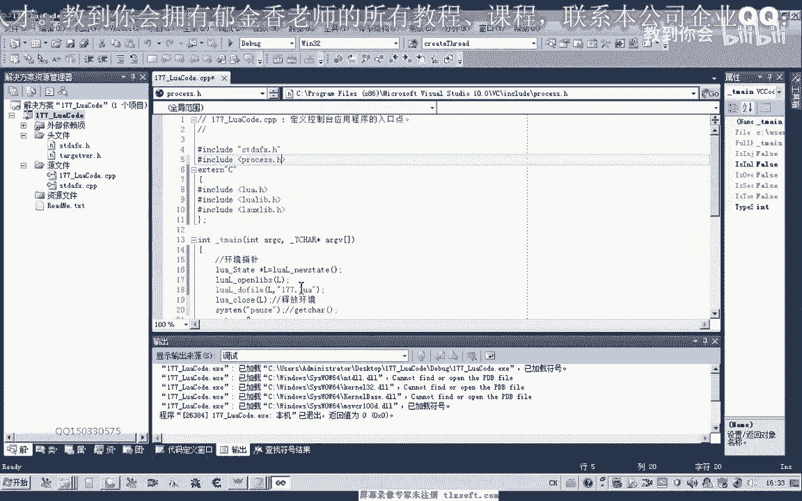
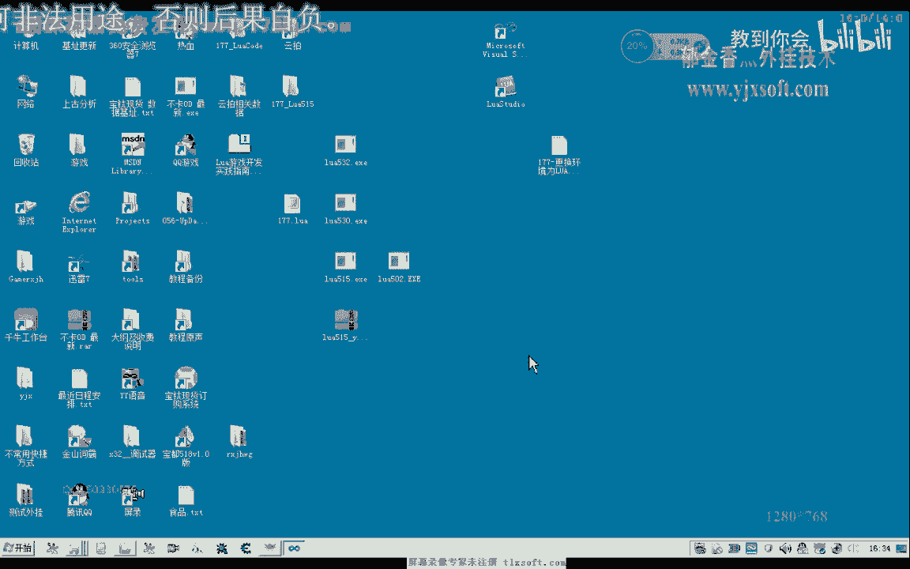

# 郁金香老师C／C++纯干货 - P166：177-更换环境为LUA5.1.5版本 - 教到你会 - BV1DS4y1n7qF

大家好，我是郁金香老师，那么这节课呢，我们把532的这个卢瓦的这个版本来改为我们有五的版本啊。

呃因为532的这个新版的话，它对我们嗯就是一些脚本的支持呢不是很完善，那么也可能是他升级之后呢有了一些大的修改，那么比如说我们能随意的写上一段脚本，那么主要是对我们一个便餐的一个支持的感觉。

不是很完善，哈哈哈哈哈。

那么我们还是习惯性的用我们的这个集成开发环境，来写一段我们的代码。

那么比如说我们写一个累加的，那么这是一个支持变仓的一个函数，那么这里呢我们上一节课呢学了这个for循环，那么这里呢我们也设置一个循环啊，一到我们a r g。

那么这个a i g n呢表示获取它变成的这个参数的一个数量，那么获取到这个数量之后呢，它打印出每一个变参的值，那么这个变成了它是一张表，我们可以把它认为是一个数组，一个隐藏的一个数组。

然后呢我们另外定义一个number，来进行有效，number就只为，加上我们传进来的这些参数，那么最后呢我们返回这个数字啊，好那么在这个主程序里边呢，我们就打印出相应的这个结果，电脑板。

然后比如说我们在这里幺三这几个数字相加，然后我们执行一下，最后呢就是1359，那么最终的这个结果，把你家的接过来，就是这一个，就是我们的数字9135相加，那么但是恰好这段代码的话。

在我们的呃五三日的版本上呢，它就不能够运行啊，比如说我们在五三日的版本来运行我们的刚才的这个脚本，在这个地方啊。

177in fire，要七七，那么这个时候呢它会提示出错啊，它会提示一个语法的一个错误，好的，那么我们再来看一下5。5的这个版本，那么同样的是哦对了，这里我们刚才输入的时候也有一些错误，17768。

那么我们来看一下5。5的这个版本，177，那么这个这个呢它就能够输出正常的结果，而且我们在c加加里面调用这个脚本的时候，如果我们用的这个呃。

相应的静态库是52的这个版本之前的这个版本的话，那么同样的他不能够得到正常的结果好，那么所以说我们在这里呢就用把它改为5。5的这个版本，那么网上关于这个5。1的这个版本里头的话。

它的相关的资料呢也是最多的，新版的他改动了之后呢，我们暂时还找不到相关的资料好，那么这个大家可以到我们的论坛下载，这个已经啊已经编译好的这个相应，的静态链接库包。

那么我们可以在这里搜索一下啊。

然后呢在这里呢我们下载啊，那么下载下来之后呢，就是这个文件，这个文件呢我们把它解压出来，然后解压出来之后，我们把它放到一个固定的一个目录下边，那么解压出来就是这一刻啊。

那么我们可以把它放到c盘或者d盘任意的一个位置嗯。

那么我一般一般呢选择呢是把它放在c盘下面。

放在下边下边之后呢，我们看一下它的目录构成，那么这里是两个版本的控制台编译升级的，这个是我们发布版本的。

发布版本的要小一点啊，这个是第八个版本的呃，功能都差不多，但是静态库呢我们也分了两个版本，一个是第八个的啊，以d结尾的是第八个版本，那么这个是release的这个版本好，那么有了这些相关的数据之后呢。

我们再进行相关的设置。

那么打开我们的vs 2010。

那么在这里呢我们也也已运行这个171撸啊哈。

明目地呃，所以说我们把它建在桌面上，这个项目。

好的，那么现在建立好了之后呢，我们呃把它切换到属性管理器这里哈，展开他的第八个这个项目一定要展开，展开之后呢，我们选择这个win 32 user啊，这然后呢再改变它的这个c夹角的这个目录。

这个目录呢我们进行一下编辑，删掉之前的这个所有的这个目录，然后呢这个包含目录的话就是头文件的啊，第二个h的这个目录我们把它设置啊设置好，然后呢在这下面来库的这个目录。

我们也把它进行一下重新的设置这个level啊，这里面包含的是库啊，然后呢点一下应用，那么我们看一下，是不是这样的一个结构，那么这里面呢我们主要是包含这些头文件啊，需要把它包含进了。

那么这是我们第八个的这个版本，当然我们还有一个链接器啊，这里的我们一个常规输入啊，那么在这里呢我们，需要如果是这里没有这个logo要逮捕的话，我们需要在这里编辑给他加上啊，这里需要加上点确定。

然后呢我们再展开release的这个版本，那么如果这里呢它没有这个nova 515 r2 的话，那么我们在这里点编辑了，给它加上加上，那么另外我们的vc加加这个目录，这里呢我们也需要来做一下更改啊。

包含的这个目录现在已经更改过来了啊，停下啊，确定再来看一下，好的，那么这样的话我们基本上就可以编译生成，没大，然后呢我们可以写代码来运行我们177的这个脚脚本，好，首先是相应的库函数的。

你的支持nova的头文件，然后再是小米的附加库，打，lil库，然后最后再是我们的国家库，好那么这三个库包含了之后呢，我们首先呢也是呃环境支撑创建，初始化我们的一个环境。

然后呢我们再打开我们的一个库的一个支持，然后再是我们的do file，最后呢我们关掉，网，好的。

那么我们看一下我们的177啊，卢瓦，那么这个时候呢我们需要放到他的第八个目录下面啊。

生存在这个地方，让它保存在同一个目录，ex一哦，这个啊，然后我们再重新编译生成一下，那么这里呢我们还差一个环境指针啊，做这个变量，对，那么注意这里的是低版本啊，反正不是。

那么如果是我们的r2 版本与这个debug debug的这个环境下面编译的话，那么它就会出现下面这些警告的一些信息，那么所以说我们这里呢刚才改的时候没有注意，那么我们需要在这个地方呢再重新编辑一下。

还有我们第八个的这个版本，然后再应用一些，再重新编译生成，好的，那么这个时候呢我们执行一下，但是这个时候呢我们呢的控制台呢会一闪而过，那么我们需要停下来的话，可以用pos指令让他站起来，或者是用gtp。

那么一般来说用gta还要简单一些，不用去，另外还要包含一个头文件，那么另外一个原因呢，他没有找到这个文件啊。

他实际上没有找到文件的话，也不能够正常的呃执行。

那么这里没有任何的信息，因为我们的这个exe所在的这个调试目录与我们文件生成的目录呢，它不在同一个目录啊，所以说我们要把这个输出目录的路径呢呃更改为我们的这个调试的啊，工作目录这样。

的话我们才能够让它生成啊。

那么在这个时候呢它就能够出来正确的一个结果，那么如果我们是用之前的52的版本的话，它就不能够出来正确的啊一个结果，那么好的，那么这节课呢我们就讲到这里。

