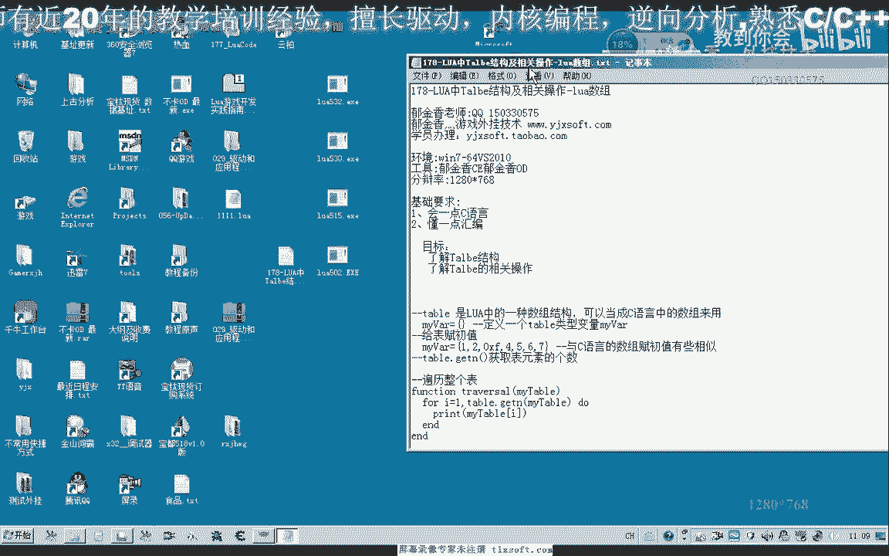
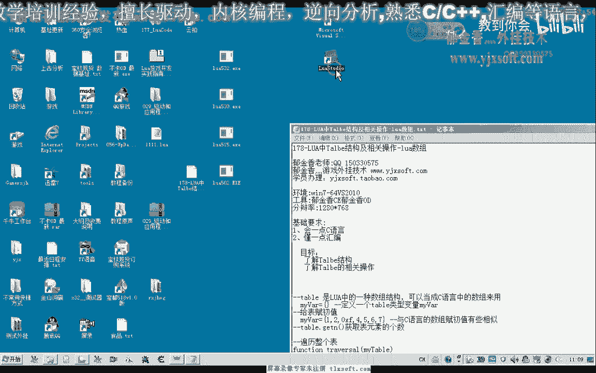
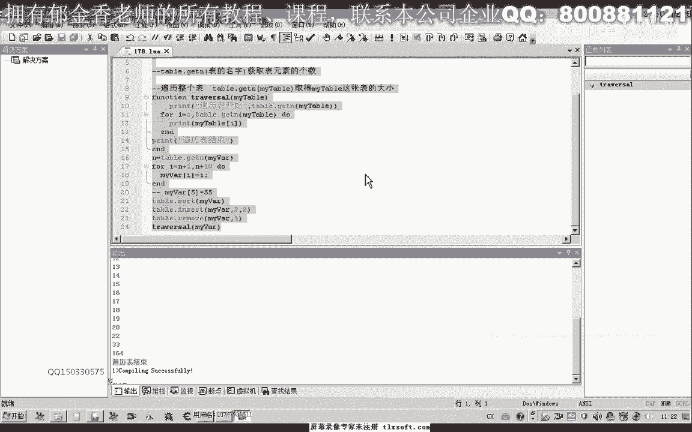

# P167：178-LUA中Talbe结构及相关操作-lua数组 - 教到你会 - BV1DS4y1n7qF

大家好，我是郁金香老师，那么这节课呢我们一起来探讨一下lua当中撸a当中的这个数组啊，那么实际上我们是探讨的一个这个table结构，它与我们的数组呢有一些类似啊，但是呢他提供的这个功能和操作呢呃更多啊。

以及它的存储方式呢也有一些不一样，好的，那么我们这一节课呢作为一些了解。

那么首先呢我们也打开这个word啊。

集成开发环境呃，在这里呢创建一个项目啊，保存一下，啊，那么首先我们来看一下啊这个表的一个定义，那么表的定义的话很简单哈，那么这一段呢我们就是定义一个表，那么这是定义一个呃空表。

相当于那么这里呢我们把它重新给它赋一个初值啊，这里那么负了这个数值之后呢，我们要这里边它就比如说我们可以做一下小小的测试，那么第一个元素我们就可以以数，类似于c加加里边这个数组的方式来对它进行访问。

为什么说类似呢，因为它的这个下标的话是从一开始的，而不是从零开始，那么我们看一下它的一个结果就是一啊，那么如果我们访问它的第二个元素，那么就是二，那么第三个元素呢，我们这里用16进制来表示的就是一五啊。

那么我们也可以来写一段代码，或者是写一个函数来偏离它的整张表啊，那么比如说我们可以写一个啊这样的函数，好把前面这段代码去掉，因为它其中有一个table啊，它本身这个有一点像我们的c加加里面的瑞克啊。

实际上呢它也是一张表，那么这个table这张表里面呢它包含了一个函数啊，我们就可以简单的把这个整体当成是一个函数来使用，那么这个函数的参数呢就是我们的这个表的名字，那么比如说我们的table啊。

get n，那么在整个这一段呢就表示了啊，取得我们这个my table这张鸟的大小啊，它的元素的个数啊，那么当当在这个my table呢是参数啊，相当于传进来的，那么我们要这样写了一个函数之后呢。

它的作用呢就是呃从一到这个元素的个数啊，偏离我们整张表，把元素里边的表里面的这个数字来打印出来，那么比如说我们刚才定义的这张表，my where，那么我们就可以在他的这个主程序里边啊。

相当于是我们的c加加林的这段代码呢将会被执行啊，海vs，然后呢偏离我们的这张表，把我们的这个表的名字那么传进去，那么这样呢就能够达到一个偏离整个表的作用，我们可以看到12154567啊。

这就对我们整张表进行一个操作，那么这个呢我们可以改一下啊，啊这样看起来的话可能更加的清晰啊，这样的我们就偏离了我们的整张表，那么这里呢我们还可以给他加一个啊，偏离表结束，那么前面呢是偏离整个表的开始。

那么主要是要理解啊这个函数啊，gp嗯，然后呢他是获得我们表的一个大小，那么这里的大小呢他肯定是七啊，这个表的大小就是1~7啊，当然我们也可以把这个表的大小也可以打印出来看一下。

然后我们可以在这里呢可以看到就是我们表的大小的数值器，当然后边呢我们可以呃再给它增加相应的这个元素啊，那么这样那么这是一种方式来对它进行一个初始化，那么另外还有一种初始化的方式。

当然如果是按照前面这个初始化的话，它就是一个公子表的大小就为零，我们也可以用一个循环来对它进行一个初始化，比如说我们要像这个元素里面啊写入一些数值或者增加一些数值的话，我们都可以来进行讨论。

就说1~10啊，然后呢我们对这个表进行复制，i war下标，复制为我们i的这个数值，然后我们再次偏离的时候，就能够看到它元素里面的数字呢是一时啊，那么我们也可以在后边呢来改变它当中的一个数字。

好这是偏离之后，那么我们也可以来在这张表的基础上来增加啊，或者是改变，比如说这里面的可能是这个数字，那么我们也可以按照这这里一到十之后呢，我们可以把这张整个表格数字来给他改变掉啊。

就是说这里面的数字呢没有作用，或者是在它的基础上呢来增加，那么我们可以来可以先获得它表的一个大小，在这个循环之前，我们用一个参数n来获得这个表的大小，然后呢我们i的数字呢从n加一啊到n加十，这样开始。

然后我们再来骗你，看是多少，n等于t啊，这里是my war，这样才可以，那么这样的话我们表里面的元素呢它将有20个这个商，因为我们这里来对它进行了改变啊，这个我们改变去掉，然后我们再来看一下。

啊1233就是在前面的数字呢它不会改变啊，就是12345678~20，这是后面增加的一个序列，那么这是一些表的基本的一个操作啊，那么呢我们这个表的话，它还提供了其他的一些函数来对它进行操作。

比如说这个排序排序呢，它能够来这个sht，能够把整个表的元素呢按照从小到大的这个顺序来排列它啊，那么我们这边呢也可以进行一个测试，然后比如说现在的话你看一下本来应该是12233，那么如果排列之后的话。

这个2233可能就会移到后边去，我们可以进行一下测试推广说的，那么我，好那么我们再重新输出一下，那么我们可以看到前面的这两个较大的数值呢，就移到最后边去了啊，二二或三三啊。

那么这个时候呢实行了一个我们的排序，那么我们整张表呢，它它还可以用你这个因子呢在某个位置啊插入某个元素，那么比如说我们在第二个位置插入二哈，本来他是二和三，这个元素是没有的，那么我们再来排序之后。

我们再来进行一个操作，试一下，table their insert，然后表的名字，那么我们在第二个位置插入元素三啊，或者是操作元素二的，那么我们再试一下，那么我们可以看到这里的元素呢会多出一个二出来哈。

后面的元素呢会继续的往后移动啊，后面的元素呢也是存在的，那么这是插入，那么插入之后，比如说我们要把这个第九个元素哈，把它移除掉，那么第九个，那么实际上呢我们这里序列的它是它的下标的应当是排序之后的话。

应当是八啊，排序之后如果是未排序之前呢，他应当是啊第九课啊，所以说我们在排序之后对它进行一个这里插入之后，看到了之前的这个基础，我们table那么人物我们也可以移动移除掉某一个元素，那么比如说我们把嗯。

这个元素我们数一下它的下标1234567，应当是第八个元素，我们把它移除掉好，那么我们再来看一下，也就是这个数字九会不会已经出掉，那这个时候我们就不能够发现这个数字九它就不存在了。

那么也可以移除掉其他的元素，比如说移除掉哈，第一个元素，那么我们在输出的时候啊，这个第一个元素来就没有了，那么我们可以在某个位置插入一个新元素，也可以在某个位置来啊删除掉哈某个元素啊。

那么这就是我们表的一些啊最基本的一个操作，而且他的一个访问方式就跟我们的数组的访问方式一样啊，啊但是这个表呢也可以是多维的啊，它还有一些呃不常用的这个操作啊，那么我们就在下一节课我们再来继续的讨论。

当然这个表的类型的话，因为它都有一个特点，它的这个类型的话，它里边的这个类型呢也可以包含我们的字串啊，这一类系统都是考虑的，嗯这个如果是比较的，这个字符如果包含了字符的话，这个说他他就不能够工作了。

啊啊啊，这样工作还是没有问题的好那么这一点呢要注意一下，如果所有的元素都是数字类型的，那么呢它可以工作啊，比如说这里我们是16进制的，那么呢它是可以工作的，这个说的。

那么所以说这个使用这个sort排序的这个函数要注意，那么所有的这个呢都需要是数字的，就用这个s等于164好的，那么这节课呢我们就。

就讨论到这里。