# 郁金香老师C／C++纯干货 - P169：180-Lua文件读写操作 - 教到你会 - BV1DS4y1n7qF

大家好，我是郁其鑫老师。

这一节课我们一起来看一下，Lua里面它内置了一些函数，可以来对我们文件来进行操作，我们这一节课主要是探讨一下，Lua对文件的一个读和写的一个操作。

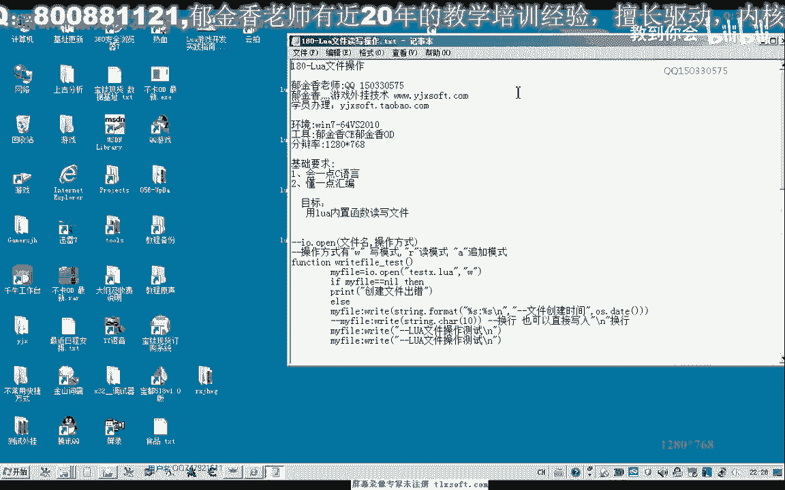

好的，那么我们可以用即是本来编辑，也可以用一些集成开发环境来测试。

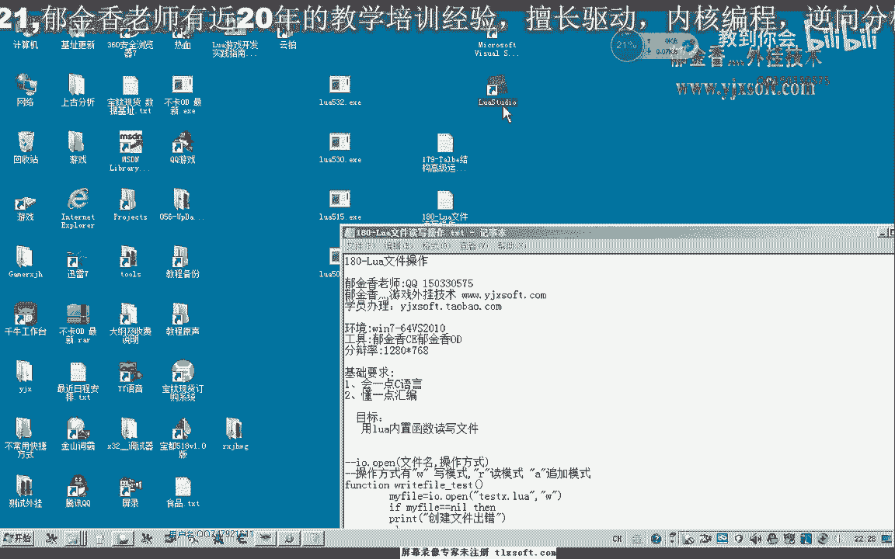

这个脚本，那么首先我们来看一下，Lua当中它怎么来创建一个文件，那么实际上它创建一个文件的话，相当的简单，它有一个内置的函数，在IO这张表里面，那么用IO open来打开一个文件名。

那么后面的操作方式如果是W的话，那么它就会检测这个文件是否存在，如果是存在的话，它就覆盖它，如果是不存在，它会创建一个新的空文件，以方便我们写入，那么我们来看一下这段代码，那么我写了一个函数。

那么保存一下，然后发明，那么这个函数在这里，我们首先用这一段代码来创建一个，TestX Lua的文件，那么如果是创建成功的话，它肯定就不等于我们的空，不等于NIL这个标记，那么如果是创建失败。

那么肯定就等于NIL这个标记，表示了就是说未创建成功，它会返回一个NIL的标记，空标记，那么另外一种情况，如果是不等于标记的话，就证明了创建成功了，我们就可以用write，向里面写入我们的字串。

那么比如说我们在这里的，当然这里我们它另外有一个OS的表里面，有一个data的函数，它是返回的一个时间的这样的一个数值，那么后边这里我们写入了两行文本数据，其中我们也可以用转译字符，斜杠加N来进行换行。

那么也可以用这一段代码来进行一个换行的操作，它另外这个串这张表里面，它内置了一些对字符串的一个操作，那么这个腰顶它也等价于换行，那么好的，那么我们在这里运行这一段函数的代码，来看一下保存一下。

然后执行脚本，那么执行完了之后，我们到桌面上看一下，因为这个时候它调试目录是在桌面上的。

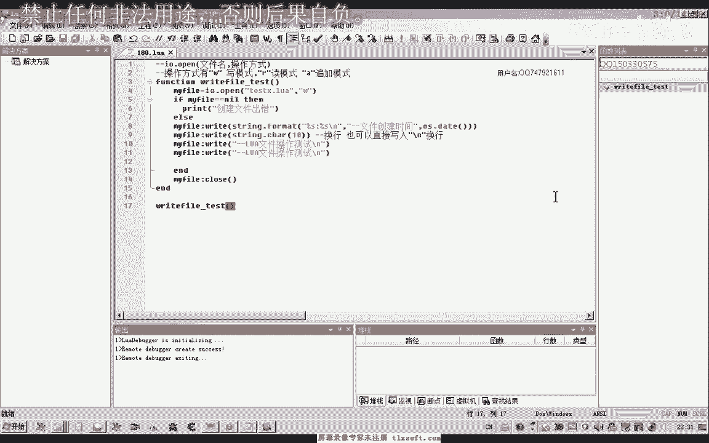

这个时候我们看到这里，它有两个换行，这里换了一个行，这里换了一个行，然后把我们的相应的字串写进去了。

如果我们把这一行注释掉，那么它就只有一个标准的换行。

那么我们再次执行它，那么我们也可以在控制台下边来执行。

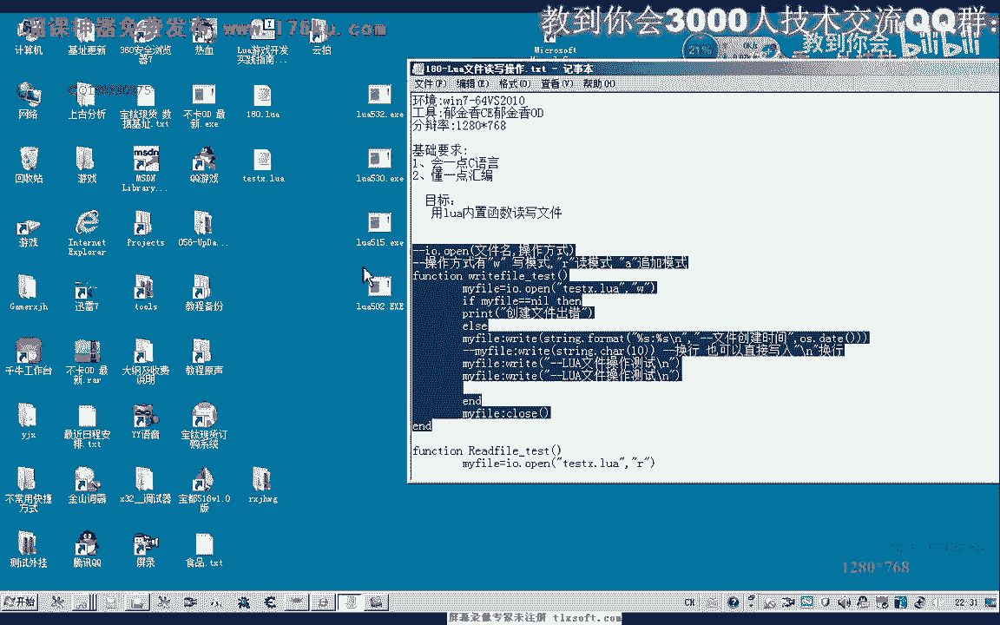

或者是在我们的C：里面，好的，我们先把这个文件来删除掉，Defile。

那么我们可以看到这个时候，它马上创建了这样的一个文件，那么这是我们一个很简单的对我们。

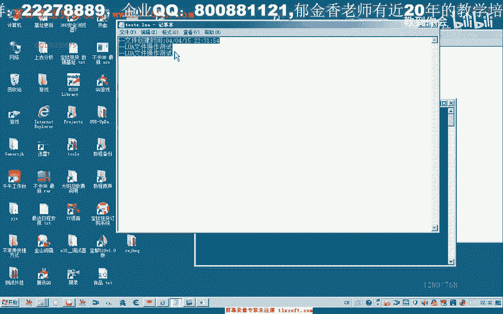

这个Rule对文件的一个写的操作。

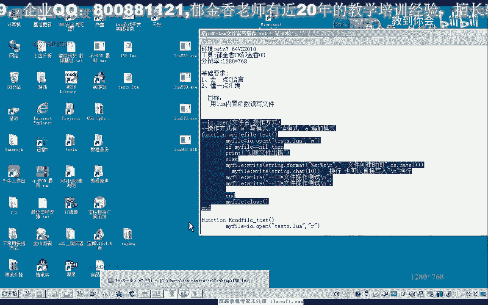

那么当然我们还可以写，写完了之后，一般我们要用它里面的相当于是一个对象的，一个成员函数的一个形式，实际上它是一张表，这里面它用close这个函数来关掉文件，那么这里的话。

它返回的MyFile相当于是文件句，或者是文件指针的这样的一个变量，那么我们除了对文件的一个写入的操作之外，我们也需要来对它进行一个读取的操作，那么读的话，我们一般会用这样的方式来读取。

那么首先我们也是要打开，但是我们读取的话，这里的后边我们用R这个模式，写入来我们用W这个模式，那么如果是追加的话，这里用A这个模式，好的，那么我们打开成功之后，这下边我们就是打开成功，那么成功之后。

我们在这里我们就可以设置一个循环，那么我们循环读取里面的数据，那么后边这个是一个格式化的一个支撑，那么L的话就相当于读取一行，那么我们也可以在论坛上搜一下，牛网文件操作相关的，那么我们能够找到一些资料。

这里面，那么这里面它也有说用N是读取一个数字，用CN是读取整个文件，用CNL，我认识读取下一行的一个内容，如果文件尾不到文件尾的话，它仿佛一个NIL的一个标记，那么Number是读取指定字节的一个字符。

那么如果是直接是数字的话，就是表示一次性读取多少个字节，那么读到文件尾，它也会仿佛一个空，那么如果这里它为空，我们就退出循环，那么这是一种方式用来读取我们的文件，那么这里文件也是这一个文件名。

当然如果我们都对这个文件名进行操作的话，我们可以把它设置一个File Name，在前面我们可以设置一个全体的一个变量，那么这里我们直接对发热链这个变量做一个相应的操作，好的，那么打开成功了之后。

这里我们它读取一行之后，也相当于是一个支串类型的，那么我们打印出这一行，最后循环退出，好的，那么我们看一下读出来的数据是什么，那么前面的我们就可以把它关掉，注释掉，Eof，那么我们这里多了一个End。

我们看一下，这里是Endive相当于是，那么这里应该是Endwhile，那么while循环之前的话，我们看一下应该是这个地方是我们的Endwhile，那么我们把它这里有一个是里面的一个锐嵌的一个E。

然后是Endwhile，我们把它锁定一下这个地方，设置一下它的格式，然后这个是外层的E，这里是End，这里我们少了一个括号，所以说其实这个语法一个错误，好的。

那么我们再来看一下，读取这个文件的一个内容，那么我们也可以自己添加几行内容在里面，让他来读取，然后我们可以运行控制台。

也可以直接的读取，读取，Eof，那么直到了最后来读取为空，当空这个我们可以更改它的代码。

在为空的时候，我们就不进行输出，我们可以把这个Contentline写在UnderEf的后边，这样我们也可以直接运行。

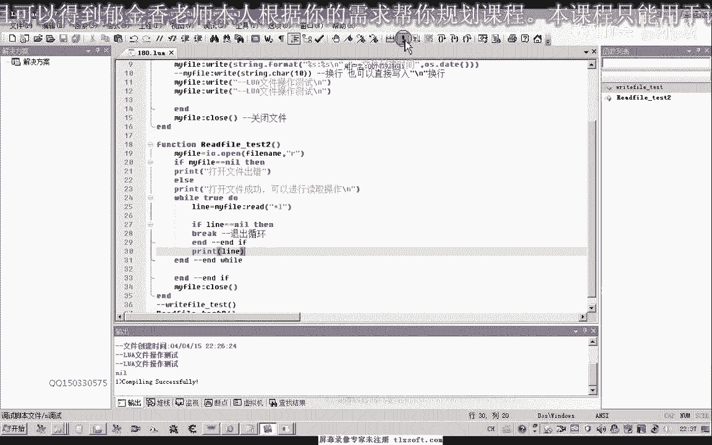

那么我们可以看到最后空它就不会被读取出来。

那么这是一种操作的方式，那么还有另外的一种方式，那么另外一种，我们一般就是你另外写一个函数，你的test看一下，这个它也能够读取整个这个函数，那么这里是我们的发热类，直接用全球变量来表示。

那么这里打开文件输出，这里我们打开成功，那么成功之后，我们也可以用这个FOR循环来对它进行处理，那么这个FOR这里我们可以整行的读取它，这个None，那么这里也有这个None函数的，相关的一个介绍。

我们来看一下，那么返回一个迭代函数，它叫每次调用户的文件中的一行内容，当文件，当到文件尾的时候返回空，那么这是一个迭代的一个文件，那么I，我们的这个None，那么用这种格式来写，那么读到文件尾的时候。

它自动会退出循环，那么用这种模式，它也能够读取我们的文件，好了，那么我们调用一下，这个，Webfire Test，那么我们直接用Webfire的方式。

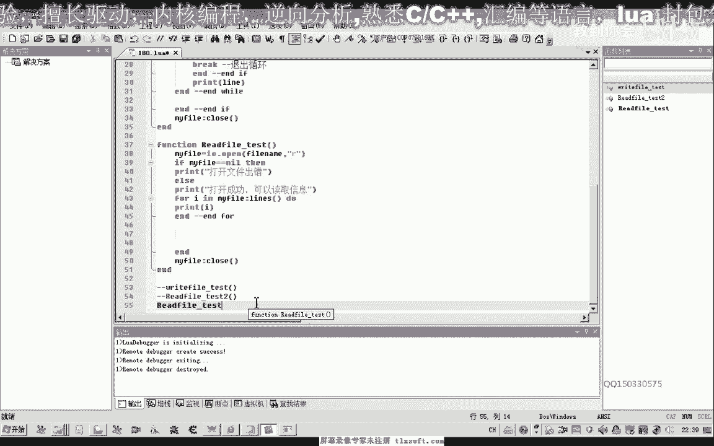

这个时候我们可以发现了，它也能够成功的读取。

当然我们也可以直接修改这一段代码，可以在计时本里面进行一些修改，比如说我们可以给它加上一些调试信息，然后我们可以用这个Webfire的方式来输入这个文件，好的。

那么我们保存一下，然后我们再用Webfire可以来看一下，它会多出一行信息，这个时候更方便我们的一个调试。

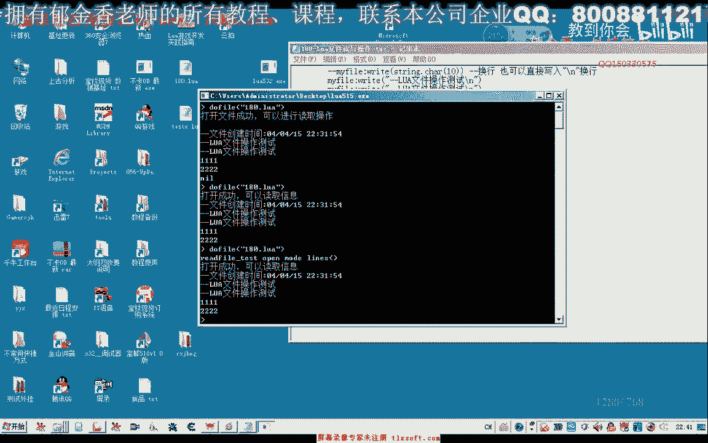

那么我们也可以这两个一起来调用，然后我们可以看到这里是Test。

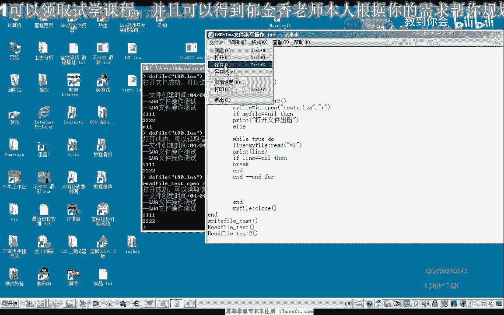

两个Test，我们再看一下。

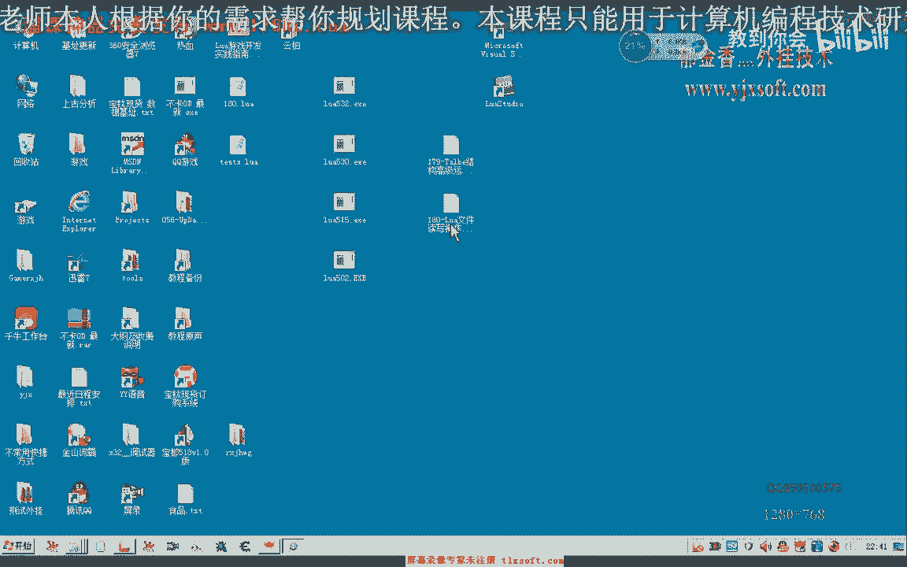

这里是注释掉的，那么我们可以把这一行取消掉，用一个风格线来风格区分一下。

然后我们再次运行读取，测试一下，好的，那么我们可以看到这种两种方式，它实际上读取的一个效果，都是一样的。

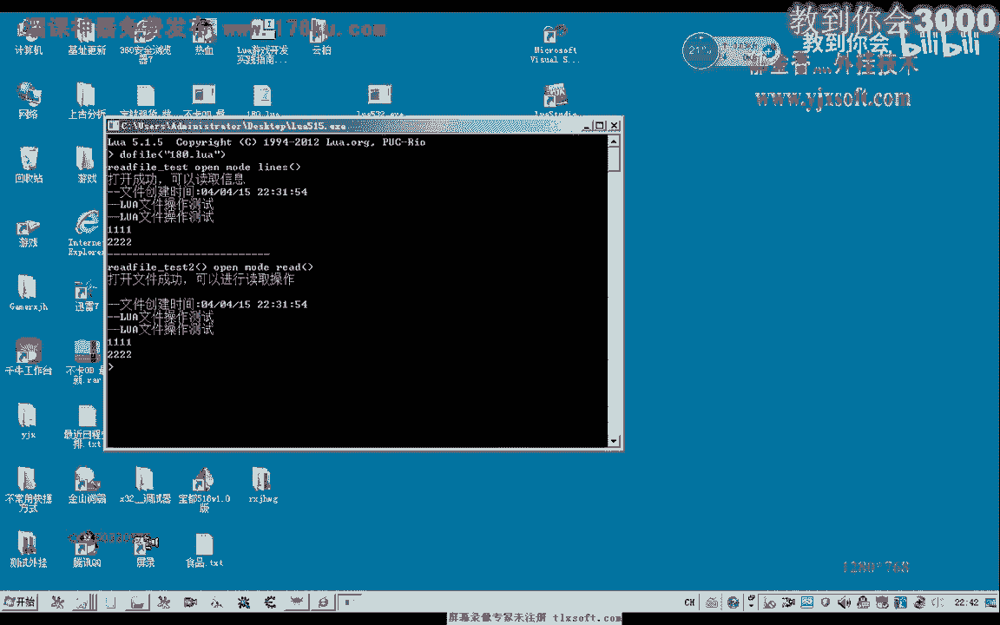

当然读写的这两个操作是最常用，那么其他它也有一些另外的一些函数。

那么这些函数我们在以后的时候如果用到的话，那么我们再来做一个相应的了解，好的，那么这一节课我们就暂时谈到这里，下一节课我们再见。

(音量)，謝謝。