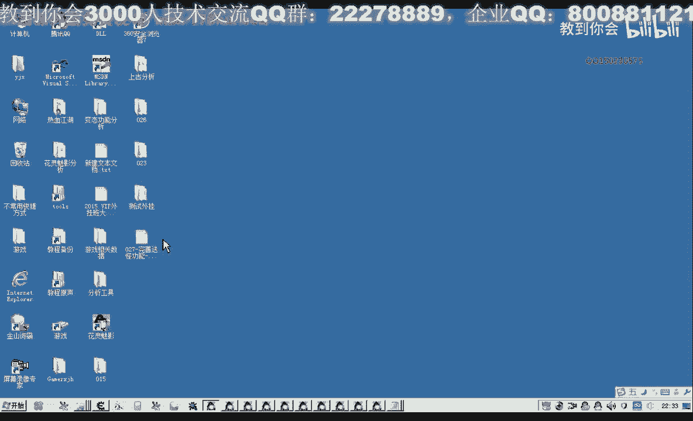
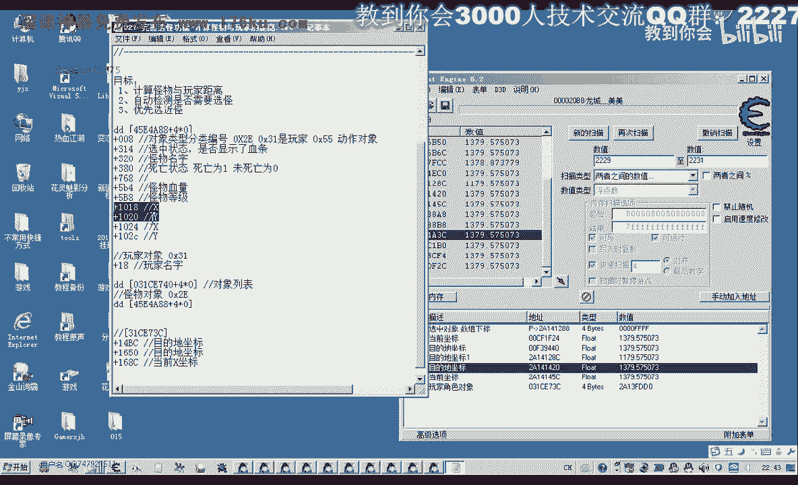
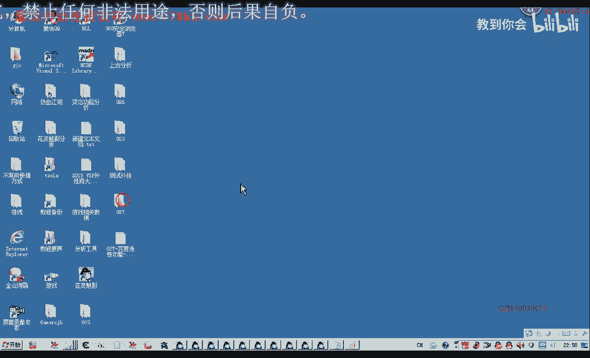

# 郁金香老师C／C++纯干货 - P16：027-完善选怪功能-计算怪物与玩家的距离 - 教到你会 - BV1DS4y1n7qF

大家好，我是郁金香老师。

初中1533057，那么在我们选怪的时候呢，为了让我们的外观呢更加的效率，那么我们会考虑到优先的选离我们最近的怪物，那么这个的话我们就需要嗯得到一个怪物的属性，是与玩家之间的一个距离。

但是这个游戏里面他没有这样的一个属性，但是呢我们可以通过怪物的坐标，有玩家的这个坐标呢来计算出怪不到我们之间的一个距离，那么今天我们这节课的那目的呢就是计算出怪物与玩家的距离。

那么下一节课呢我们在优化完善我们的选快功，能好的，那么这个玩家的坐标的话，我们还没有分析过，那么首先呢我们先分析一下啊，先分析一下怪物和玩家的一个坐标。

那么我们先打开我们的4g，看一下我们现在的坐标是多少，2197啊，那么我们先搜一下不一样，所以这里呢我们要选火点数，因为浮点数的话，它小数后面呢有一部分被省略掉了，那么可能呢我们就比如说二幺。

他可能是2194点多少多少，所以说我们在这里修的时候呢，我们收两个字是一个范围，数值2。93比它稍微小一点，这边应该要比它稍微大一点，还要求，那么我们这样呢就能够保证我们收到的数据呢没有行动。

然后收费变动的数字，然后我们再改变一下坐标，2211就是2210，那我们就是212，这个就是重新搜一下，可能这个数值呢他在下正在变动啊啊，那我们再改变一下2204，204的话，我们是20320，再。

看一下啊，21926912+93，好这里有两个坐标已经出来了，很可能就是我们所要找的一个坐标了，我们把游戏移到边上，走到了看见，那么这个数值呢它不断的在变化，这个数值呢它只变了一下，然后就没有动了。

那么这个坐标的话，可能它是目的进展应该是比较贵，因为这个的话可能才是当前的作用，当然这只是一个猜测啊，然后呢我们再跑动一下，现在是2263个一个列举方，二七子好，那么这个还是比较多。

之前我们分析过幺八开头的话，还是堆栈删掉，这个在不断变化的删掉，这个要关掉，那么你留下来就是这一片啊，去那么我们再动一下230，怎么230，这229231，搜索，慢慢搜出来还有这么多，那么我们看一下。

这是我们玩家对象，它的一个地址的话是多少，是d d02 a13 f d精灵啊，这个地址，那么也就是说玩家这一片有相关的是从二类一开始，那么这一片是我一个玩家离得比较近的，这次我们把它拖进来。

那么其他的与我们的关系可能就不大了，就大了，那么拖进来之后呢，我们看一下314173c啊，这个我们之前分析，这是玩家的对象，这是玩家的对象的一个起始地址，2031gd 0，好的，那么我们再点一下小地图。

去个比较远的地方，那么我们看一下这个时候在变动的，没有变动的呢，这个它是应该是目的地的一个坐标，那么在变动的这几个的话，应该是当前的作品，这几个是当前做，那么这个呢也是固定解读，啊一下子就跳到了目的地。

跳到这里，那么呢我们当前的坐标呢还会不断的变，目的阶段，它不会变啊，那么然后我们再找一下它相关的偏移，那么这两个呢是全局的，是机制，那么最好的我们是在它的一个对象的相对偏移里面找，但是他这个呢是2。

14开，如果收到这个比可能离得较远一点，不要上，那么我们找一下目的地的，我们先来看看当前的坐标，我们先看看。

这个时候呢我们得到一个偏移是1658c，让我们看一下他的e si呢恰好是f d t0 ，也就是我们的玩家对象，那么这个属性呢我们先把它记录下来，那么这也是玩家对象的一个机子的一个指针。

加上16834当前坐标的当前x坐标准确的时候，那么它的目的这个坐标呢再来看一下，刚才我们是找到好像是这个在讲卷法完全做过，第二个的话，我们看一下它这个1a x的话啊，嗯这个的话不是我们这个对象把它删掉。

这个对象不一样了，那我们再来看一下这个，这个呢也也不是我们这个对象ex ex它是2014多少多少，那么不是的，我们这个呢也把它删掉，那么目的地的坐标呢，我们从未来要是这里来看一下。

这个呢要点了小地图才有这，啊点了小地图之后呢，这个是小地图的一个目的地的一个坐标，那么我们看一下e d i的值是多少，e d x子弹恰恰是这个2a13 f d t0 是我们对象的玩家角色。

那么幺四bc呢我们也接触一下，进去会看见我看直播，一是平时啊，这个我们先分析过程，那么第二个坐标我们再来看一下，幺六，那么这个1650呢也是一个目的地的一个坐标，我们看一下它的对象。

e d i恰好也是我们这个对象，我们把1650这个也切一下，好的，那么有了这一个坐标以及我们怪物里面的啊相应的一个坐标，那么我们在有了这两个坐标之后呢。

我们也用上就可以，那么理论上来我们就可以来计算出它的一个距离。

那么实际上这个计算距离的方法呢，在之前的教程呢啊以前的外挂教室里面我有说过，那么我们做一个假设啊，那么这里有一个点，这里的一个坐标点二，这两个地方有两个点，这是一个点。

就是那么我们要计算这两个点的一个距离的话，就是这两点之间的一个连线，这就是它们之间的一个距离，但是我们没有直接的一个办法能够把这个数据计算出来，但是我们可以通过一个相关的公式，那么我们先做两条辅助线。

那我们把这个点稍微把它更改一下，这里有一个点，那么这个点呢我们设在这个地方，这样可能好看一些，这是它的一个距离，那么我们先做两条直线出，那么这里呢是一个直角直角。

那么比如说这个点我们表示他如果表示成作为表示成x1 y1 ，那么点呢我们表示成x2 y2 ，那么它们之间的一个距离的话啊，就是这两个数来相减相减，它们之间的一个这一段这一条边。

比如说我们把它叫做a b这条评，b a这条边呢我们把它叫做b b这条鞋跟来就是我们要求的距离，c，那么如果我们要求这个ba的这个距离的话，我们就可以了，用p s取决对值，x一呢减掉x2 来表示。

那么我们做个假设啊，这个作格的话，比如说它等于x在第二象限呢，它是一个负数，比如说-30啊，那y的值比如是22个，那么如果这个坐标等于，x呢它应该是一个看一下这里的x的话，这一点的x还是正常正确。

就是幺七，那么y坐标比如是复读啊，因为在第四象限呢，y坐标呢为负，那么这里的话它就等于a b s，x也就-38减掉我们的x317 ，那么实际上最后的结果呢就是f p s负的55，那么最后呢他就等于55。

那么实际上就是上面这个三八啊，应该是这样来算的，应该是这一段的距离加上正面这一段的一个距离，这里三发加上这么一个腰鼓这个距离，那么如果我们是这一点到这一点一个距离的话，他也是这样来算的。

那么如果我们不是在另外一个象限啊，如果是在这里，那么它的算法也是相同的，是相同的，那么同样的它也是啊，比如说这一段ba的一个距离的话，同样的是一个y一呢减掉y2 ，减掉这下面一段。

那么在这个象限盘全部是为正的，所以说这个公式的话，同样是使用的这一段的距离呢，同样是这个x2 减掉这个x1 ，在第一象限的话，两个指南它都是为正，所以说无论他是在哪个象限的话，大家可以去做一个事例。

那么这个公司呢它最终都是成立的，那么这是我们标配的一个啊，这应该是db的一个距离，等于我们x一减x2 ，那么对a的一个距离等于aj s y一减y2 ，而且它这个公式也是在无论在哪一个象限的都是成立的。

那么y一现在的值的话是二二，它减多少呢，减的是-5，那么实际上最终的结果呢它也是ap 2负负得正是加五，最后的那么等于二对17，那么a b和b格的距离求出来了，我们就可以勾勾股定律啊。

a的平方加上b的平方等于c的平方，于是这个色的话就等于sq r t q r t呢代表一个开放的函数，n c a加上b sb那么最后呢就是斜边的距离，写为了强度好了，那么我们既然知道了这个常数。

那么我们就打开第26课的代码。

那么我们就把这个函数来把它封装好。

这里要说一点的是哈嗯它3d游戏呢它还有一个什么呢，除了这个x坐标和y坐标之外呢，他还有一个z坐标啊，有的是这样表示的x y z啊，这样来表示，但这个游戏呢它是这样来表示的x z然后呢y啊这样来表示的啊。

它z坐标来放在了中间啊，但是一般的这个a坐标呢我们可以约掉，那么如果他是真的啊，嗯怪物和我们玩家都有这些坐标的话，那么他最终的结果，这条斜杠的结果就是sq r t，b c a加上b乘b。

然后呢再加上我们save乘以c啊，然后呢再开一次哈，我把小说看好，那么最终的结果呢，它实际上就等于是拖拉t开方a的平方加上b的平方，加上我应该是热的，还有一条z z轴z轴，那么这里呢我们我们跟c跟z啊。

那么这个z的话等于多少呢，就是那个z坐标就等于a b s就这一批减掉z2 把手表，这样就能够求出来了，这个这个长度的话就是这样的，好的，那么我们来看一下，当然一般这个z z坐标的话都是被忽略掉了。

那么首先呢我们要在，玩家这个角色里面呢添加我们的坐标，这个属性，在这里呢我们添加一个坐标，但这个坐标呢我们是当前的坐标，所以说我们是开始先把当前的作用，那么另外还有一个坐标呢是有这对的，但是钢琴坐标的。

那么另外那呃另外的目的地的坐标呢，暂时呢我们还用不到，那么用不到呢，我们先进先不添加，那么我们先把这两个数字呢进行一个初始化，在个体代替，然后把上面这一段啊都进行。

那么这里的类型呢我们要改为了flog多点数，还有后面的偏移，我们要改偏移就要改成我们所找到的这个偏移，当前的坐标168c，那么在前面呢我们也可以定义一个红，当前做表。

那么在这里呢偏移我们进入这一套来加上，如果是z坐标是加四，那么y坐标呢这里呢要加八，它的偏移，好了，这样呢我们就把它相应的数值呢读出来了，那么读出来之后呢，我们再，我们看一下后边。

还有没有其他的打印信息，这个呢我们都有为集成相应的这个单元，接下来呢我们就是怪物的这个坐标，我们看有没有读出来在相应的结构领域，在怪物的对象里面这一页，那么有的话我们看它有没有在里面进行初始化。

他说不要好，这前面这个坐标是初始化的，后面一个坐标没有初始化，嗯所以说我们暂时把后面这个座位坐标先注释掉，因为它没有初始化，没有用，如果我们去用的话就会出问题，到时候，先编一下。

来计算两点之间的一个距离，听到了，那么这也为了我们表达的方便面呢，我们就把它写成两个坐标，x1 y1 sy 2这两个坐标，然后呢在这里呢提一个变量可以，雾呢最后用来返回我们两者之间的一个距离啊。

那么零的话就表示的是最近啊，这个距离，那么我们可以把它写大一点，t s f写大一点，表示的距离比较远，然后接下来的话我们就是嗯进行一个相应的计算，先求它的a b，那么a b的话就等于我们的搜索的那条杆。

等于我们的y1 n p s1 y一减掉y2 ，那么另外一条线呢我们叫做b加b x减掉x2 的绝对值，那么第四的话我们就是要返回的距离，实际上，但是呢我们就等于excel tec开放a的平方加上b的平方。

这就是我们的这个b边，那么最后返回这里呢，我们实际上进行返回这个c当然这里未来可拼高级的，就给他录下值，这样返回，但返回的话这个是否点类型的，这个是我们整形的啊，无符号整型的，所以说这一点的话。

它会有一个产生一个警告，而，这一题多了一个更好，那么这个时候a abs的话好了，p s y一角啊，那么这个时候呢它这个函数呢它不认识，数学单元，must，好那么生成成功了之后呢。

我们这个距离的话还要修改一个单元，就是我们的这个怪物列表的这个单元，那么在这里呢我们怪物坐标之后呢，我们还要给它添加一个怪物的一个属性，叫做距离，这里是哪个版本，那么这里距离玩家有多远。

那么这个数字呢我们需要的就在这个get data里面初始化，初始化的时候我们就要调用我们刚才的这个函数，当然这个函数呢它写到后面去了，那么写到后面去了，我们要调用它的话，我们需要先前置一下。

那我们就在这个头文件里面去前置前置声明一下吧，或者我们把它放到这个全局变量单元里看，但在那样的话可能不是很方便管理，那么我们就放到这个这个地方，那么在这里呢我们给它添加相应的属性。

首先呢怪物列表的数组里面的某一个动物，那么我们要跟它计算距离，那么就用刚才我们的这个公式，然后呢把相应的坐标来给它传进进，那么首先呢我们获得人物的啊，这个，相应的数字相应的坐标跟fat对，当前坐标。

这是第一个作品，然后是第二个坐标，就是要看，关注，然后呢我们为了方便看呢，我们给他换一个好，在这里我们也可以进行一个画画，嗯然后是怪物的，自己曾经的，好那么这两个坐标传进去之后呢。

我们就能够把这个相应的距离呢，嗯给它计算出来，那么计算出来之后呢，最后我们把这个属性呢给它打印出来，我们写了一个相应的打印单元，添加到最后，那么在最后呢我们写成一个距离，把这两个属性呢啊挑一下。

好再编译一下，那么编译成功了之后呢，我们还需要添加到相应的测试单元，接收消息这里，那么接收消息这里呢我们需要把前面的先注释掉，那么直接这样调用的话是不对的，他没有初始化数据，这点要注意。

要先初始化数据格局，带他们后来用尺寸来调用，好的这样理论上这样的话就能够打印出来了，那么我们还要做一下，就是把注入单元的价，那么我们可以开始数列，那么注入之后我们用相应的工具来看一下调试信息。

嗯那么这个时候的距离就出来了，这是距离哪一个怪物，距离我们最近的，那么这个编号这里我们看不到啊，这里我们知道是12346，七啊就最后一个，最后一个的话，他的i d呢这里有感应是1356，然后360。

动作这样，这才是怪物列表，再来看一下大屏清晰，他应该是在这里哈，之前这里打印了一个怪物的hp，这是之前的，这里打开了到这个位置，那么我们可以把这样请注释掉，那么怪物的i d的话，我们也可以把它打印在这。

这个坐标啊，然后id我们可以选择电脑i d d i c，好，那么我们再编译一下，然后我们在这里呢在附加到游戏可以进行一个相应的测试，那么这里我们添加相应的指针标40，这是我们选中的怪物。

选中对象应该说当然这个时候没有选中对象呢，为f f，那么我们再确定一下最近的怪物，选一个知识，那么最近的关注我们看一下126的话，幺八这个野猫，那我们看一下它的i d i t为什么没有出来。

应该是没有编辑，我们要重新编辑一下，好再重新点，看一下哪一个最近110，这个102，这个134b它离我们最近，那么在这里呢可以1347全部转，当然这个选中它不会显示血条啊。

因为没有用我们自己写的那个函数来选中，那么选中了这个i d之后呢，我们在这里呢，在这里边，那么在这里边我们去攻击它，我们看一下啊，这个离我们就算是最近的东西，那么我们再找一个比较远的，最近的。

那么找一个比较远的，这个是302，它的ip是1352，no 12，那么这个时候呢跑的距离就比较远，他选中了这个怪物啊，一直到这个地方才选中好，那我们再选选中一个比较近的怪物，再试一下。

那我把这里的信息清理掉，这个距离呢它也是发生变化的，哈哈好，那么现在距离最近的就是这个距离八的这个1341，我们看一下老子写字，这个距离比较近，但是呢他也可能在变化，在走动，看看是不是这个腰线细。

一那刚才那个已经被打掉了，134b啊，中间四个这个离得最近，在创新的机会，龙山四天这个时候又离得比较远了，因为他都是在变动的相对比较近，啊应该就是这这个怪物有的比较细好的。

那么我们这个预期的目的也达到了啊，那么这节课呢我们暂时讲到这里，那么下一节课呢我们在对这个相应的这个过来，让它有一个自动啊筛选的一个功能，自动选怪的一个部分，那么今天我们就讲到这里。

