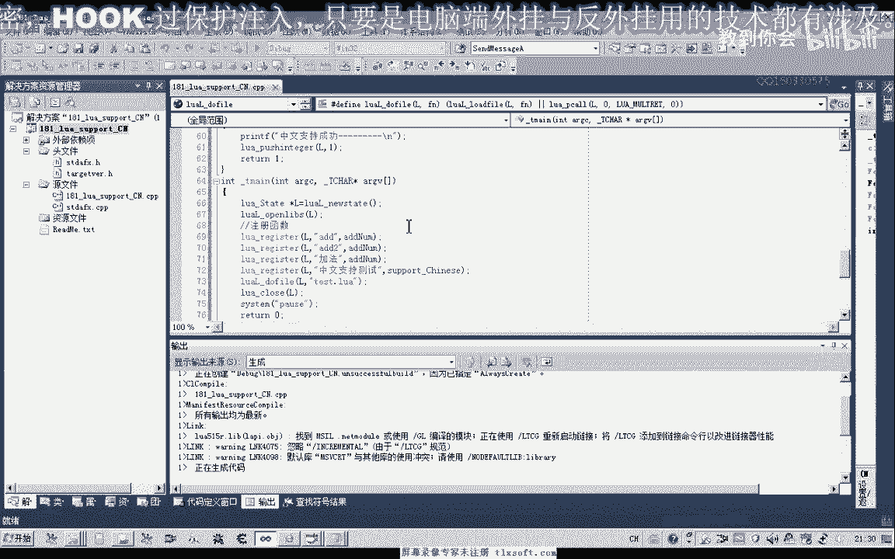
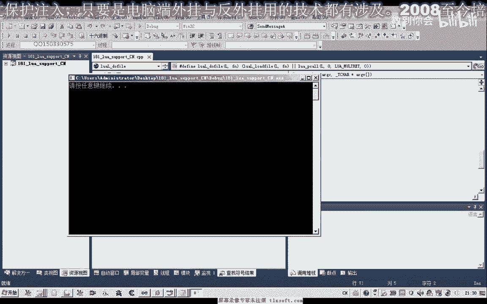
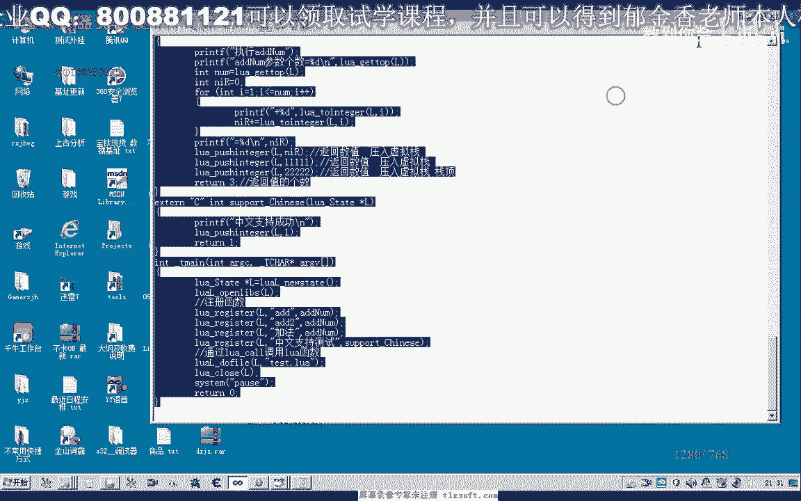
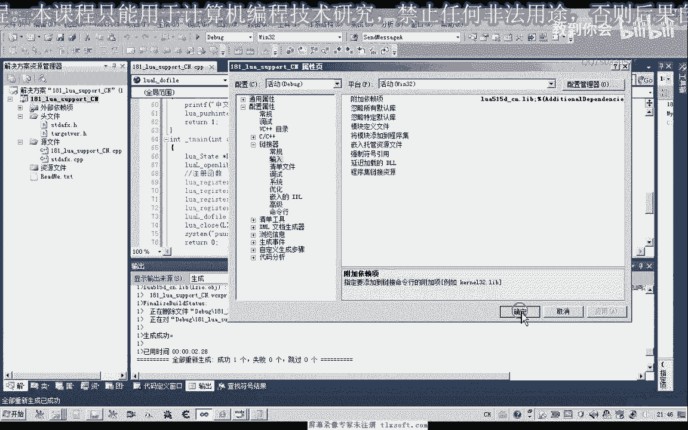
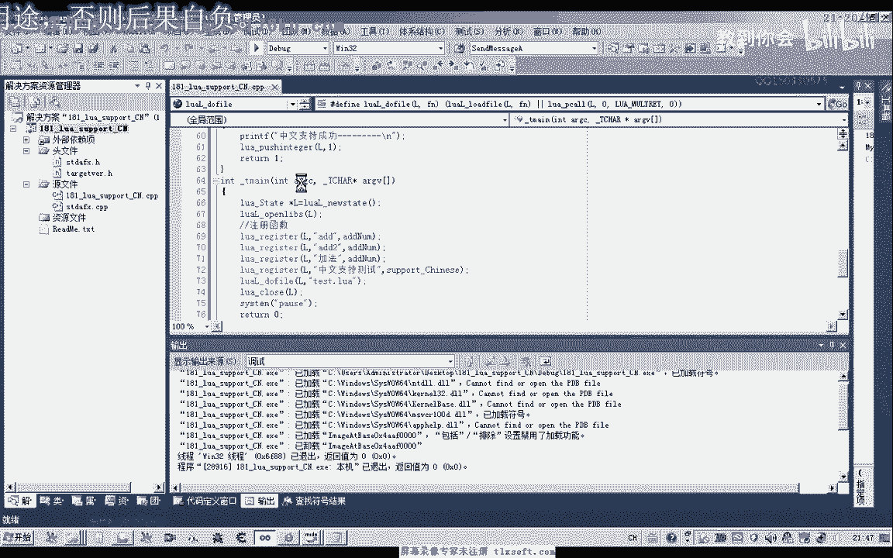
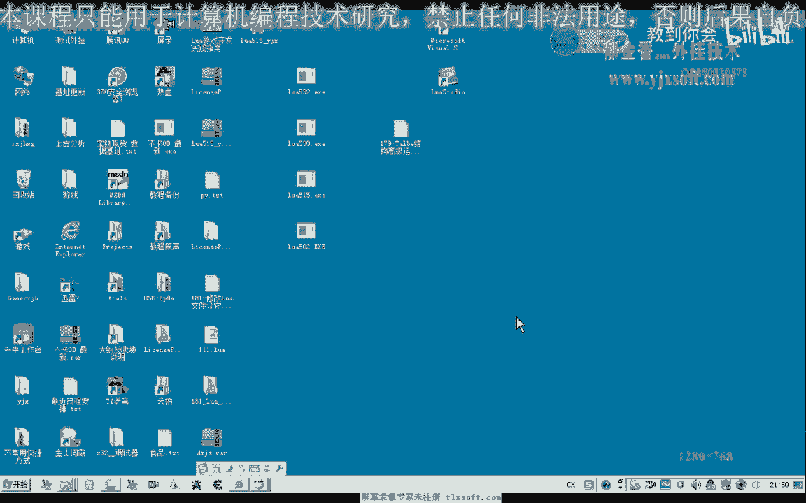

# P170：181-修改Lua文件让它支持中文函数 - 教到你会 - BV1DS4y1n7qF

大家好，我是郁金香老师，那么在这个我们来探讨一下。

让我们的路由网脚本支持一个中文，函数的注册，那么我们说到中文函数的注册，也就是说它的，比如说我们在注册的时候，这个Register，那么我们注册为英文的这种函数的话，它能够正常的编译执行。

如果是脚本里面这样写，那么但是如果我们是注册的是一个中文的，那么我们的脚本，它将不会被正常的编译执行，那么所以说我们这样用起来的话不是很方便，那么这节课我们就通过修改它的一个源代码。

来增加一个中文的一个支持，好的，那么我们先建一个。

打开VS2010来建立一个工程。

来做一下相应的测试，嗯，嗯，嗯，嗯，嗯，嗯，嗯，嗯，嗯，嗯，那么我们把这一段写好的测试代码添加到里面去，我们再说一下，它大致的一个拼音，那么这一段我们就在这里，首先是这个ID的number。

那么同一个函数的话，我们在注册的时候，我们可以注册了几个不同的名字，那么但是现在的话，我们没有修改之前，它是不支持下面的中文的，那么像现在这种情况，那么这两个注册名的话，它都能够正常的调用。

然后会转到我们的ID的number这里来，执行一个累加的操作，那么我们在172之前的代码我们有写过，那么现在的话我们打个比方，那么现在如果在下面有一个相关的脚本的话，它调用了它。

比如说叫做test-new，这样的一个脚本文件，那么它里面无论是APP123，或者是APP2，那么实际上最终，它调用的这个函数的话，都将是同一个函数，那么这个时候都会被正常的执行，好的。

我们来连接生成一下，那么这个时候这两个函数。

我们实际上123和345，这两个脚本的话都会被正常的执行。

计算出一个正常的结果，但是如果我们在这里把它注册了成中文的，比如说这个ID的number，我们把它注册为+法，或者是累加这一类的，那么比如说我们后面中文支持测试，那么这个函数它就是打印这样的一段信息。

那么如果它测试成功的话，我们直接调用函数，它就会打印出这段信息，好的，我们也来进行测试一下，Defile Nuantest，然后我们改一下它相应的脚本，一个是执行一个+法，好，我们保存一下。

再次编译执行，那么这个时候它将不会有任何的信息输出。

因为它里面的话，它在编译的时候，这两个中文的函数，它就认不了，还有中文的变量这一类的，好像它也不会认识，那么我们把它注册之后的话。

它再次编译了，又能够正常的执行，但是这样我们在写脚本的时候的话。

就非常的不方便，那么所以说在这里的话，我们自己通过修改它的一个源代码。

来添加一些中文支持的一个功能，好的。

那么我们找到它的相应的一个源代码。

那么我们之前把它放到了Separate，然后Lua不要无底，这里我们建立了一个工程，我们打开它，那么打开它，我们一会主要是修改这个原文件，那么我们把要修改的源代码，先进行一个备份，防止我们修改错误。

那么我们先找一下，那么我们一会修改的是这个原文件，我们先把它备份一个副本出来，然后我们就可以了找到它相应的文件，进行修改，那么我们双击打开这个文件，然后我们在里边搜索LilaXR这个函数，那么向上搜索。

那么最终将搜索到这样的一个函数，那么这个函数我们在里边的话，它就有关于制服的一个处理，在这里，Divide，那么在这里的话，首先它会判断它是否是一个空字母，然后判断是否是数字。

那么这个地方判断是否是字母，或一个下滑线，那么我们要添加的处理的话，就应该是修改了它的这一段代码，那么因为这一段代码就是我们的函数的，这一类的一个关键字的一个处理，它这里边也叫做我们的保留字，标识。

那么这里也就是我们的中文函数名，要支持它的话就要修改这里的代码，因为它这里有一个Save and Next，那么这个处理的话，因为我们的中文好像是两个字节，它要占的字节数。

那么这里它每次来只处理一个字节，那么如果是中文的话，我们应该是处理两个字节，好像是，当然这一段代码我也看的不是很懂，在这里我自己来参照网上的收集的代码，把它进行了一些修改，那么首先我们要自己写一个函数。

来读取我们的一个中文的字符的处理，那么首先在这里用一个红来对它进行了一个判断，如果 X大于了80的，我们就把它认为是一个0X80的，那么我们就把它认为是一个中文，好的，我们先把这一段函数先把它复制进去。

那么这段函数复制进去之后，我们把它添加到这个函数的前边的任意位置都可以，只要是独立在函数之外就可以了，好，那么我们先编译生成一下，看这个函数的代码有没有问题，那么添加进去之后。

前面的函数的功能就是处理一个中文的字符，那么实际上如果是中文的字符的话，这里我们就要执行两个SELF和NEXT，这样一个处理，那么如果是另外一种情况，我们只需要执行一次，那么如果不是中文。

这里对它进行一个判断，处理下滑线是中文的话，我们需要，需要调用两次，那么如果是英文和下滑线的，只需要调用一次，这个函数，那么这里它的一个结束一个条件的话，就是，循环的一个条件。

那么必须是这种三种情况之一，一个是它是一个下滑线，或者是一个我们的一个数字，那么或者在这里，它是一个我们的中文，好的，那么我们来看一下我们需要在什么地方，进行修改，那么这里一直往下找。

找到这个Define，那么这里我们说了，这里是空字符的一个处理，比如说我们的空格，还有退稿这类的隐藏字符，还有我们的对齐键，还是这个Table这一类的字符，我们看不见，不会显示的。

那么我们就在这里进行一个处理，那么这里是一个数字的一个处理，那么关键我们就是这里，这里我们要添加一个，那么这里我们都是进行的一个，过运算，那么这里来添加一个，Challenge Code。

那么取得它当前的一个相当于可能是一个字符，这一类的，那么添加了这个判断之后，添加中文，那么添加了之后，我们这里还需要对它进行处理，那么我们看到了我们刚才在上面有一个类似的一个处理。

写在我们的自己的函数里面也有这样的一个处理，那么只是我们这里边，它加了一个中文的一个判断的一个处理，还有这里的它的一个字符处理的一个形式，有一点不同，这里我们说的要掉两次。

那么既然我们在这个函数里面已经进行处理了，那么这里的读文就是一个多余的，那么我们就需要把这一行先把它注释掉，注释掉之后，我们把它替换成我们上面的函数，然后我们把LOS传进去，那么因为这个函数里面的话。

它就已经包含了这个功能，在我们之前的这里，它用了一个红来替换，因为红它又分为两种形式，它又分为两种形式，它通过预编译中文的这里的一个判断，然后写了两个条件分支，那么如果是不支持中文的话。

那么就直接是它以前的代码相当于给它还原了，那么这一段代码也就是我们这里注释掉的这一段代码，这两段代码是等价的，我们可以看到一个是下划线，一个是这里数字的一个判断，然后我们再看一下，这里是一个括号，好的。

那么我们首先来生成一下，看有没有错误，那么没有错误的话，大致上可能就应当是可以了，那么我们再来看一下我们前面的代码对焦一下，那么从前面的代码来看的话，应当是可以的，那么只是我们在这里已经判断了一次。

那么这一次判断我们已经在函数里面有一个判断了，那么判断的话实际上我们可以不要，应当是可以不要的，那么直接在这里把这一段代码替换成函数，应当就可以了，应当还是要添加上，那么是中文的时候才会执行到这里。

好的，我们再次的变异生成，那么生成的时候，我们在里面这里写一下中文的字词，给他加一个下滑线，然后我们看一下，静态库生成到，是到这个levelD的下面，那么我们把这里他设置的一个环境，电量复制到这里。

表示在我们的工程下面有一个levelD，然后我们重新生成一下，好的，然后我们打开这个levelD，那么打开之后，我们把这一个文件复制到我们的levelD里面，然后我们在release下面，这个配置下面。

我们这里给他改一下，点击调试这里，工作目录，我们用调试的工作目录，再加上这个levelR，表示是发布的版本，然后再重新生成一下，让他也支持中文的变量，好的，生成之后，我们再次打开，levelD。

插一个levelR，这里我们选择release，再重新变异生成一下，那么再次，我们切换到他的目录下面，这个levelR，下面我们这里加上一个CN，复制一下，复制到他的相应的目录下面，CN我们表示在这里。

我们表示中文，那么之前的这两个版本可以要也可以不要，这是一个中文的一个支持，那么改好了之后，我们进行保存，然后我们再切换到我们刚才的环境下面，对输入里面进行一下修改。

那么最好我们是切换到他的属性管理器里面，然后首先第8个这里，然后我们选他的链接器输入，R CN，这里是D CN，那么我们进行一下保存，那么再展开release，U132这里。

这里我们改成R CN附加像这里，那么其他的地方都可以不改，点应用，我发现这里好像是输入这里，改了之后，这个地方它会跟着变，所以说这个时候我们需要自己手动的再改一下，切换到解决方案这里。

那么我们在这里把它调为D的这个版本，重新再升级一下。

好的，然后我们再切换到它的目录下边，把它改为中文的脚本，再进行测试，这个时候我们发现中文的支持的话。

已经成功了，中文支持，这个时候，那么说明我们修改的代码起了相应的作用。

那么这期我们就讲到这个地方，那么我们下一期再见，拜拜，请大家以后在网上发表新的视频，我们会把新的视频和网站放在一起，大家可以去订阅我们的网站，我们会把新的视频和网站放在一起，大家可以去订阅我们的网站。

我们会把新的视频和网站放在一起，我们会把新的视频和网站放在一起，大家可以去订阅我们的网站，我们会把新的视频和网站放在一起，我们会把新的视频和网站放在一起，我们会把新的视频和网站放在一起。

我们会把新的视频和网站放在一起，我们会把新的视频和网站放在一起，我们会把新的视频和网站放在一起，我们会把新的视频和网站放在一起，我们会把新的视频和网站放在一起，我们会把新的视频和网站放在一起。

我们会把新的视频和网站放在一起，我们会把新的视频和网站放在一起，我们会把新的视频和网站放在一起，我们会把新的视频和网站放在一起，我们会把新的视频和网站放在一起，我们会把新的视频和网站放在一起。

我们会把新的视频和网站放在一起，我们会把新的视频和网站放在一起，我们会把新的视频和网站放在一起，我们会把新的视频和网站放在一起，我们会把新的视频和网站放在一起，我们会把新的视频和网站放在一起。

我们会把新的视频和网站放在一起，我们会把新的视频和网站放在一起，我们会把新的视频和网站放在一起，我们会把新的视频和网站放在一起，我们会把新的视频和网站放在一起，我们会把新的视频和网站放在一起。

我们会把新的视频和网站放在一起，我们会把新的视频和网站放在一起，我们会把新的视频和网站放在一起，我们会把新的视频和网站放在一起，我们会把新的视频和网站放在一起，我们会把新的视频和网站放在一起。

我们会把新的视频和网站放在一起，我们会把新的视频和网站放在一起，我们会把新的视频和网站放在一起，我们会把新的视频和网站放在一起，我们会把新的视频和网站放在一起，我们会把新的视频和网站放在一起。

我们会把新的视频和网站放在一起，我们会把新的视频和网站放在一起，我们会把新的视频和网站放在一起，我们会把新的视频和网站放在一起，我们会把新的视频和网站放在一起，我们会把新的视频和网站放在一起。

我们会把新的视频和网站放在一起，我们会把新的视频和网站放在一起，我们会把新的视频和网站放在一起，我们会把新的视频和网站放在一起，我们会把新的视频和网站放在一起，我们会把新的视频和网站放在一起。

我们会把新的视频和网站放在一起，我们会把新的视频和网站放在一起，我们会把新的视频和网站放在一起，我们会把新的视频和网站放在一起，我们会把新的视频和网站放在一起，我们会把新的视频和网站放在一起。

我们会把新的视频和网站放在一起，我们会把新的视频和网站放在一起，我们会把新的视频和网站放在一起，我们会把新的视频和网站放在一起，我们会把新的视频和网站放在一起，我们会把新的视频和网站放在一起。

我们会把新的视频和网站放在一起，我们会把新的视频和网站放在一起，我们会把新的视频和网站放在一起，我们会把新的视频和网站放在一起，我们会把新的视频和网站放在一起，我们会把新的视频和网站放在一起。

我们会把新的视频和网站放在一起，我们会把新的视频和网站放在一起。

我们会把新的视频和网站放在一起，我们会把新的视频和网站放在一起，我们会把新的视频和网站放在一起。

我们会把新的视频和网站放在一起，我们会把新的视频和网站放在一起。

我们会把新的视频和网站放在一起，我们会把新的视频和网站放在一起。

