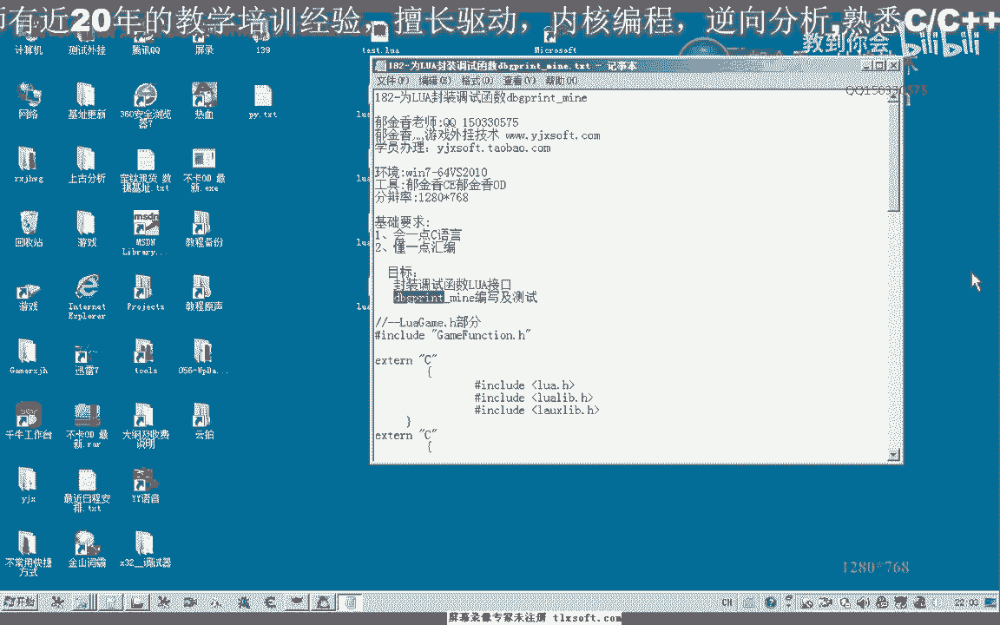
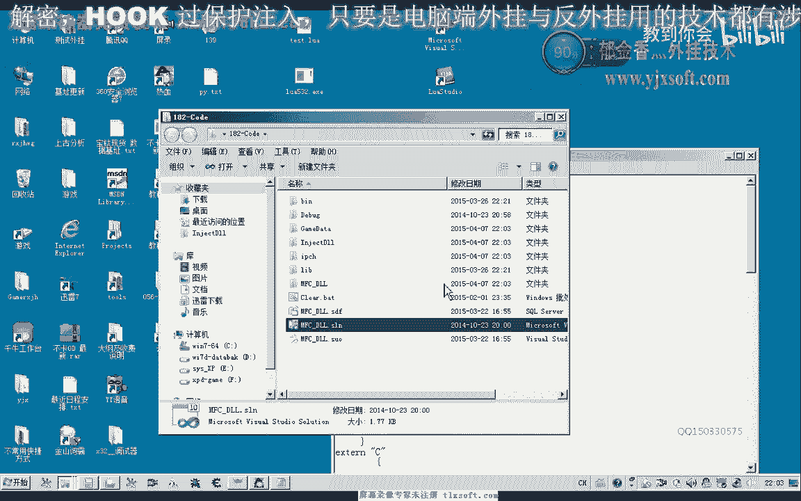
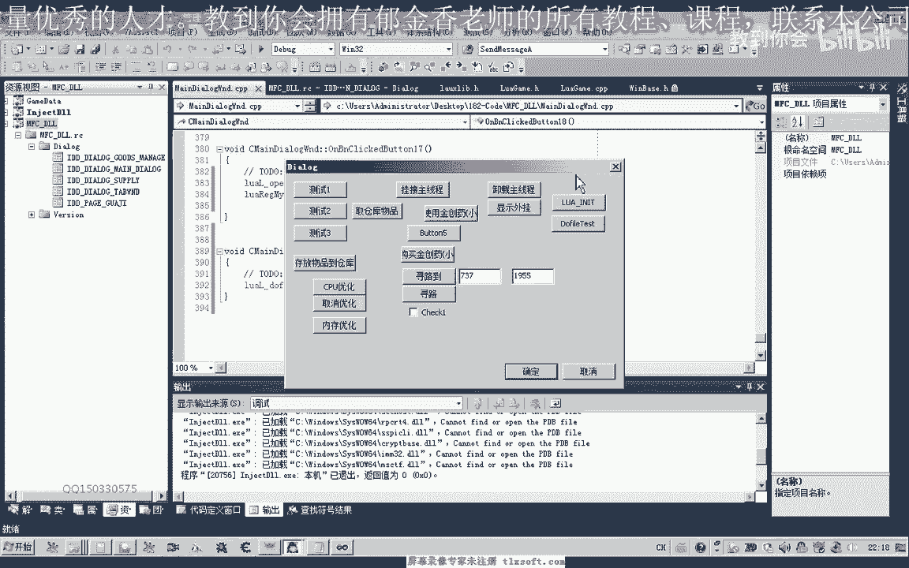
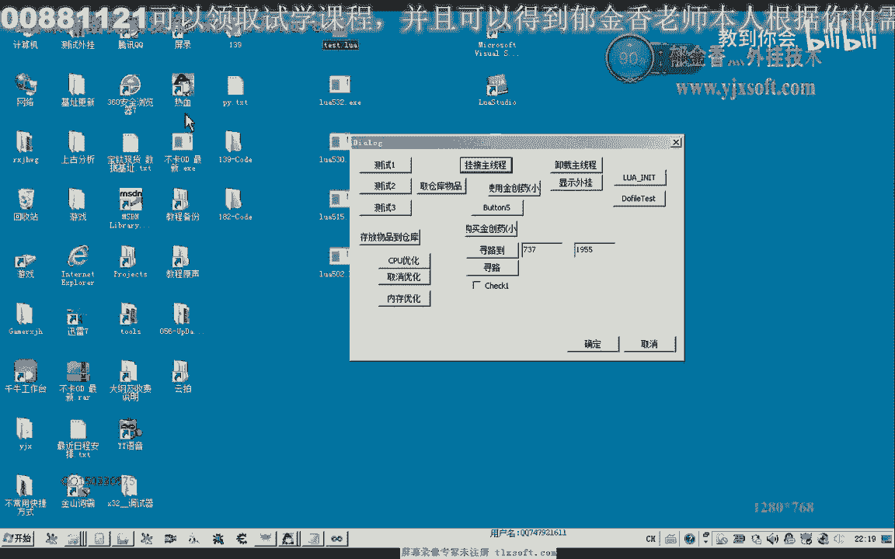
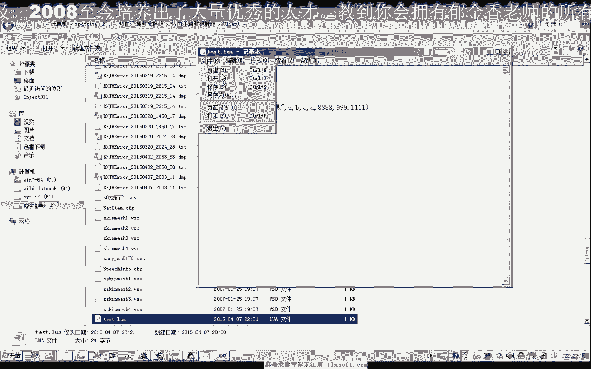
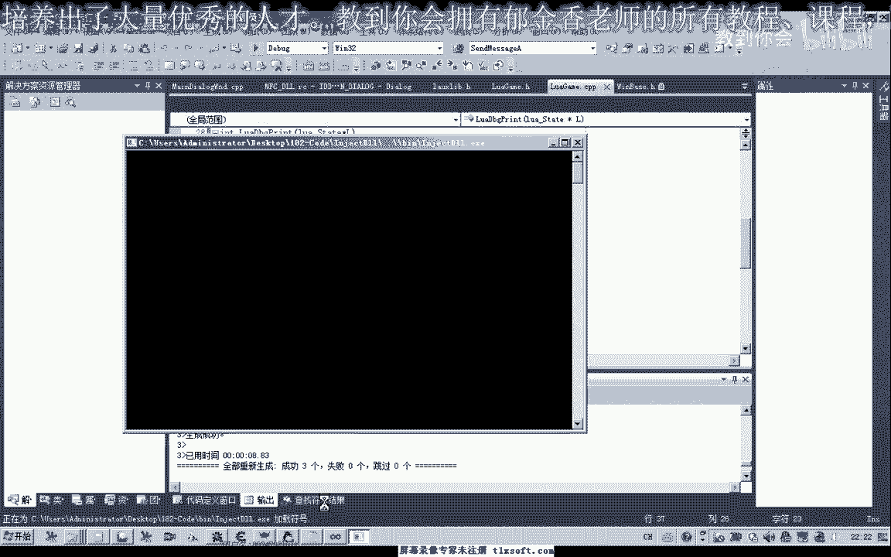
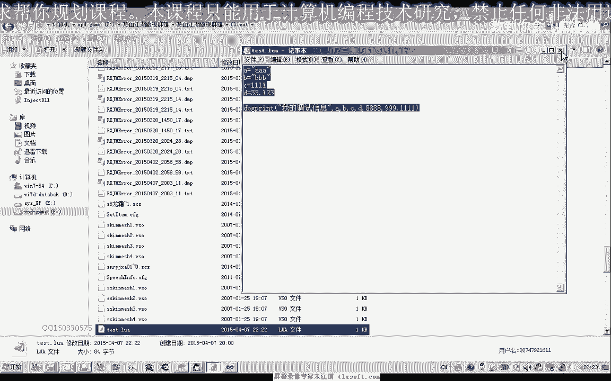
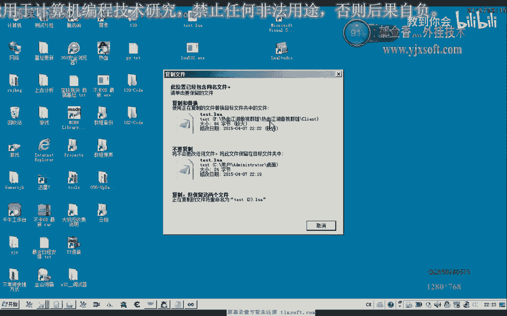
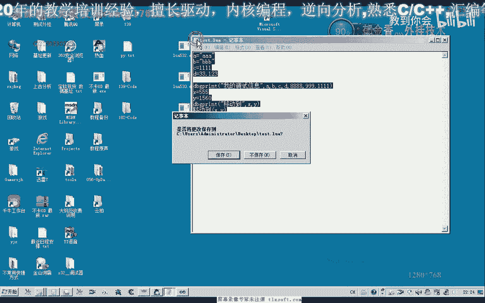

# 郁金香老师C／C++纯干货 - P171：182-为LUA封装调试函数dbgprint_mine - 教到你会 - BV1DS4y1n7qF

大家好，我是郁金香老师，那么这节课呢，我们嗯先注册一个调试函数啊，那么让我们的这个脚本呢，也能够打印一些调试信息，在这个第八个第八个view啊，里边呢来显示这些调试信息，那么之前的话我们也写个。

写过一个这个debug啊，point挺慢，但是呢，它是在这个动态链接库里面来调用的。

那么首先呢这一节课，我们先打开之前139克的代码。

那么打开之后呢，我们在这个跟代替单元栏，这里添加一个新的筛选器呃，取名为我们的ua脚本或者是脚本相关的，那么我们就在里面来实现，然后呢我们添加一个新建的项，摩根，然后呢再添加一个新建项图文件的，好的。

那么这两个添加进来之后呢，头文件里面当然我们也包含它相关的呃，一个头文件，啵啵，那么我们把之前的这个相关的这个，头文件呢，也包含到这个头文件的这一部分里面来，然后呢我们要写的这个函数呢。

我们也可以在前边呢把它前置一下，然后就是代码的这一部分呢，我们把这一段代码直接复制过来，然后呢我们来看一下它的一个大致的意义，好的，我们先编译生成一下，那么首先呢我们后边的这个函数呢。

我们需要呃前置一下哈，我们可以把它放到头文件里面，那么也可以放到前边啊，进行一下前置，那么另外呢我们还需要包含windows这个图文件，啊，好的，包含了windows的这个图文件之后呢。

我们就可以开始写我们的这个嗯，打印的这个信息啊，调试信息，lol的ur debug好换，那么在打印之前呢，我们，嗯需要先注册一个啊，环境变量，那在这里呢，我们把它写成一个全局的一个变量，好。

那么我们首先来看我们的这个打印信息的，呃，谈调试信息的这个函数额是怎么写的，那么首先呢我们取得它参数的一个个数啊，通过这个moon gt，获得参数的一个做数码传进来的，那么获取这个参数的个数之后呢。

如果参数的个数为零的话，我们就不用打印这个调试信息呃，那么如果这个参数的个数大于零的话，那么那么我们首先呢，把它转化成这个字符串啊，那么这这里注意，我们那这个脚本文件里边的这个传进来的，所有数据呢。

我们都是可以通过这个路啊，图出来进行一个转换的，无论它是否点类型还是整数还是自创啊，那么呢，我们都可以用这种方式来来进行一个转换，那么转换我们注意他，最后来返回到这个类型的话。

是一个concept恰的一个类型啊，这里，那么如果我们这里不用这个constant标记，那么呢这里是编译通过的啊，所以要注意这个标记，那么这个字串我们取出来之后呢，这里我们分配了一款这个缓冲区啊，嗯。

那么这个就是我们调试，调试信息计算的一个冲区，那么这个呢嗯可以把它定义的大一些啊，那么这里呢我定义为1000个，16进制的100个字节，那么我们取出来之后呢，我们就把它放到这个size啊。

s t r这个缓冲区里边，然后呢我们再从这个啊再定一个for循环哈，因为我们之前已经取了一个这个参数，数据了出去，那么这里呢我们从下边来从二开始循环，那么直接呢呃循环它的这个次数呢。

最终取决于它参数的一个个数啊，那么每次来只要它里边有这个参数啊，是这个数字的，或者是嗯这个字串类型的，那么我们在这里呢都给它，进行一个转换啊，那么转换了之后呢，我们放到这个csp这个指针。

指向这个缓冲区，然后呢，我们在后边呢给他追加一个字串，到缓冲区的地方，这里呢再把我们取得的参数来进行，追加到这个字串的后边啊，当然这里呢就有一点，类似于我们的40寸的一个操作啊。

就是复制路再次t2 加上我们的c s p r，相当于有这样的一个操作，那么这里呢添加了一个逗号的一个分隔符，好那么这个函数我们写好了之后呢，嗯我们还需要，当然它也需要有一个返回值啊，那么在这里呢。

我们最后来给他复习一个返回值，那么这里呢返回一个参数啊，这里给它一个返回值，那么这里呢用我们的alt或t8 个尺寸呢，打印出我们的这个调试字串，当然这个函数我们要使用的话。

我们还需要用这个lua regic，来进行一个注册，那么这里呢我们为了后边啊，其他的函数来方便注册了，我们定义了一个数组，那么这个数组呢，呃前边我们这里注册的是一个这个，ra ring的一个呃结构啊。

结构的一个数组，那么这个结构我们先来看一下，它首先是一个嗯函数的一个注册名，后边呢是一个函数的一个地址啊，是这样的一个结构，那么定义了这个结构之后呢，我们在前面呢我们注，意成呃。

注册为两个名字啊啊都指向同一个函数，当然我们也可以呢，再注册一个中文的也可以，好的，那么这里我们注册好了之后呢，一共有三个注册的函数，那么这里呢通过一个size of呃，这个取得它的一个字节的一个大小。

来除以这个结构的一个大小呢，最终能够获得这里边的，一个元素的一个个数啊，比如说现在的话，它元素的个数呢应该是等于三啊，比如说我们把这一行加上的话，应当是等于三，好编译成功之后呢。

我们实际上这里呢是i9 ，i9 的一个一个的注册方，当然还有一些比较简单的这个方法，比如说这个呢它可以批量的注册，这个结构化，那么这个是5。15的这个版本呢，他没有这个函数啊。

另外呢还有一个这个lol啊，logic他跟也可以来批量的注册啊，那么这一句的话，那么这一个语句呢，就相当于后面的这一个循环的一个注册法，那么现在呢我们就用这种循环的方式。

来一次的调用这个noa register，来一次的注入注册每一个这个函数，那么注册好了之后呢，我们可以来到mf c的这个界面，来进行相应的测试，那么这里呢我们添加两个按钮。

那么一个按钮呢是一个环境的一个初始化，那么另外一个呢我们就是do file，然后在这里呢，我们需要包含我们刚才的这个图文件，那么包含进来之后呢，我们先要做一个初始化，初始化它的一个指针。

那么有一个全局指针，刚才我们有注册，那么打开我们相应的机器库，然后呢我们需要来注册这个函数啊，我们在这里有写一个注册的函数，我们来看一下啊，当然这个注册的函数，我们也需要在头文件里面进行一下前值。

哈哈哈，那么注册好了之后呢，我们接下来呢就可以执行这个do file，那比如说我们这个名字是lua，testing啊啊testing lua，当然这个呢，我们必须要放在一个固定的目录下面。

比如说我们c盘下边的这个文件，那么或者呢，我们因为注入的动态链接库的话，最后呢它是当它的当前目录呢，是我们这个游戏客户端所在的这个目录啊，所以说这个文件呢也会呢，我们需要啊放到这个游戏的客户端。

这个目录下面啊，如果是用的相对路径，那么首先呢我们先编译生成一下，然后呢，他会说找不到这个相应的这些外部符号，那么在这里的话，我们改一下他的这个输入啊，输入，那么重新我们再生成一下，好的成功之后呢。

我们就注入到游戏里边，啊啊进行测试。

那么测试的时候呢，我们先初始化啊，挂接我们的主线程，然后呢do fire之前呢，我们需要切换到我们的性目录下边。

先写一个测试的啊啊，那么我们先写一个简单的，把这个test路过来。

复制到我们的游戏目录下边，当然你启动的是某一个客户端里，就复制在某一个客户端下边好的，那么我们把调试信息查看器啊打开，然后呢我们执行一下do fi，但是这个时候呢，我们看不到不振活的这个信息。

那可能是我们这里的有一个file，那么我们把它取消掉，那么或者我们在编写这个test vr的时候呢，我们在这里的呃，给它加上加上一个过滤头，然后呢我们再来执行to file。

那么这个时候呢我们就能够看到啊，我的调试信息啊，因为必须必须要有前面的这个前缀嗯，当然我们也可以在写这个函数的时候呢，加入我们的这个前缀，那么在这里呢我们可以取消掉，给它加一个统一的前缀。

那么在这里呢我们注意加字串的时候呢，我们嗯首先呢在之前就给他加一个这个，调试信息的前缀，啊然后再保存再重新编译生成，然后我们可以来把这个那调试信息的脚本，能且复杂一点，比如说a1 a和a b负责为。

那么c呢我们这就复制为一个常量，好的我们再次保存一下。

再次注入我们的动态链接库。

然后呢挂接到主线层啊，这个可以不挂机就可以了，初始化，然后呢我们看一下调试信息，那么这个时候的话，我们发现了他所有的这个调试信息的话啊，说出来都是正确的，那么我们再对照一下我们的脚本。

那么首先是这些变量啊的一个字串哈，这两个是字串类型的，这个是整形的，那么这个33123呢是佛点类型的，那么后边呢这里是一个场面哈，那么999这里呢也是一个常量哈，前面这个是整整形的。

那么后后边这个呢是佛点类型好的，那么这节课呢我们就讲到这里，那么这节课呢也给大家布置一个作业啊，大家可以下去之后呢，把这个。

把我们的寻路廓啊进行一下封装。

嗯，那么封装好之后呢，我们要求在我们的这个lua脚本里面呢，我们直接比如说我们写一个啊移动到，啊每一个坐标，那么我们就会直接的去调用，我们的这个寻路库啊，直接就会就会移到我们指，指定的这个坐标啊。

当然我们这里呢也可以用变量来表示，然后我们可以打印出我们的一些调试信息，嗯，好的我们的作业的话就是要求了这一段呃，脚本呢能够会正常的执行。

那么我我们再来看一下我们的这个呃代码，那么首先呢我们是需要了，我们是直接把我们新写的这个函数的话，需要呢在这个地方呢进行一个注册啊，注册之后呢才可以用，那么另外它的这个取我们的这个参数的话。

我们直接用这个撸啊啊，to lab就可以了，嗯，当然这个可以先参考一下，我们前边的代码啊，好的，那么我们下一节课呢将一起来啊，编辑这个寻路的这个函数啊，的这个脚本接口，那么这节课呢我们站起来，就到这里。

