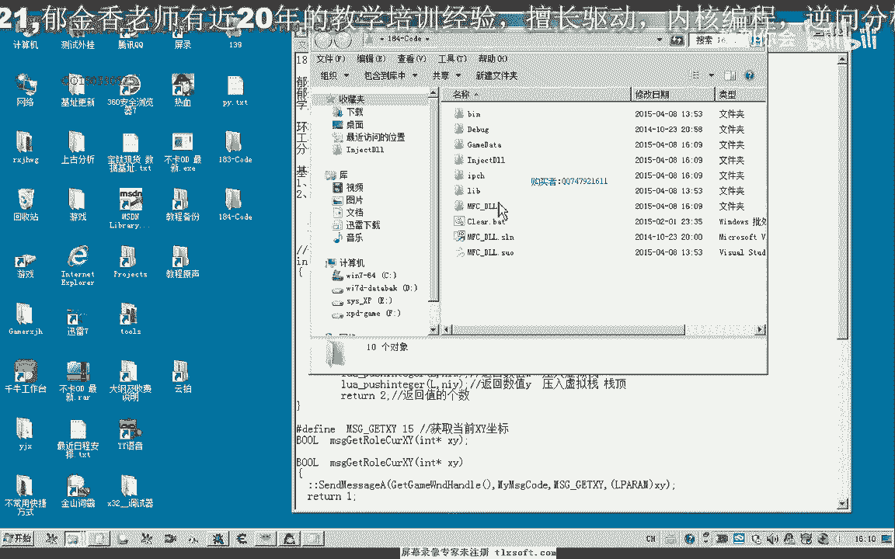
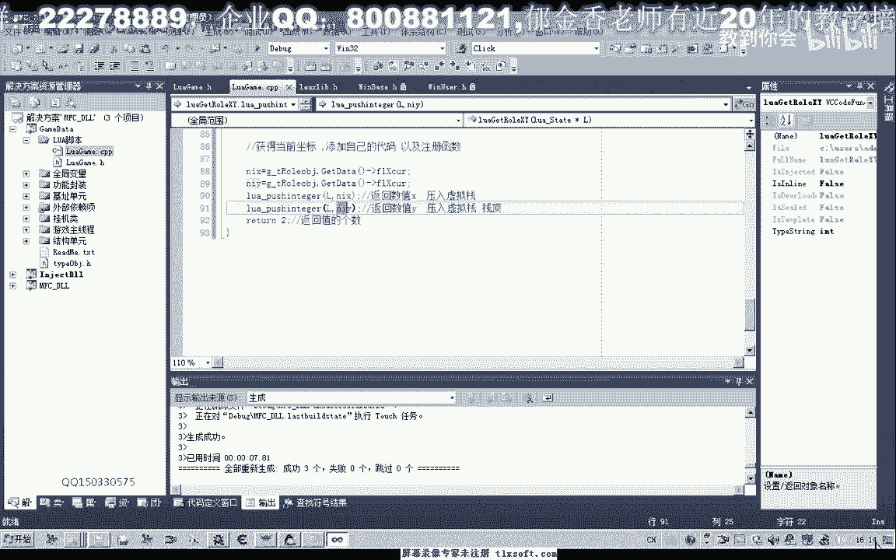
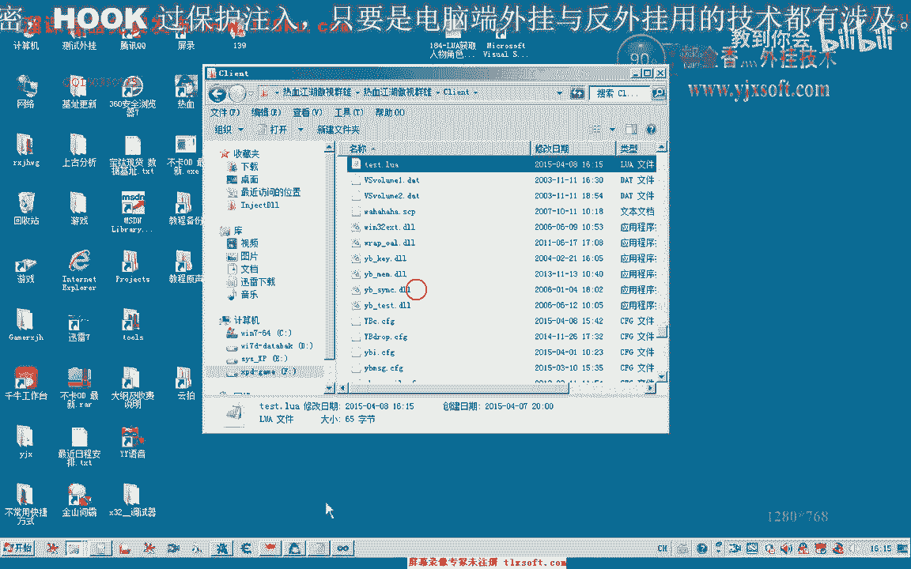
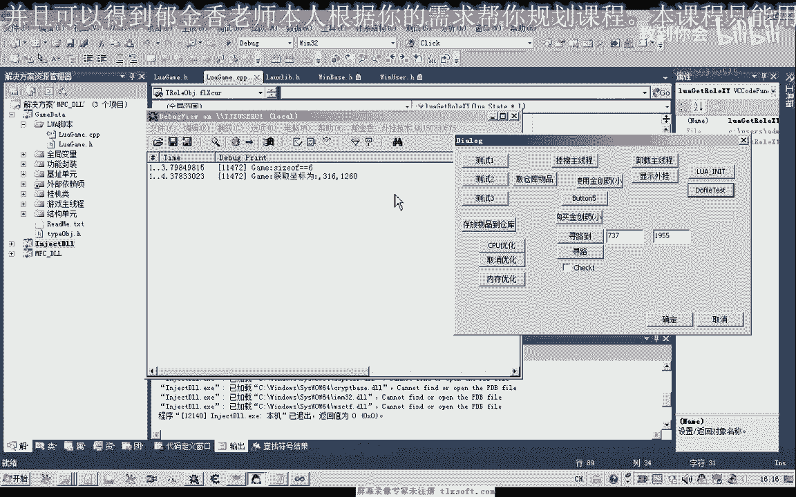
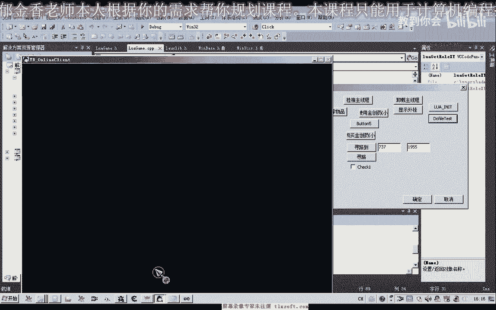
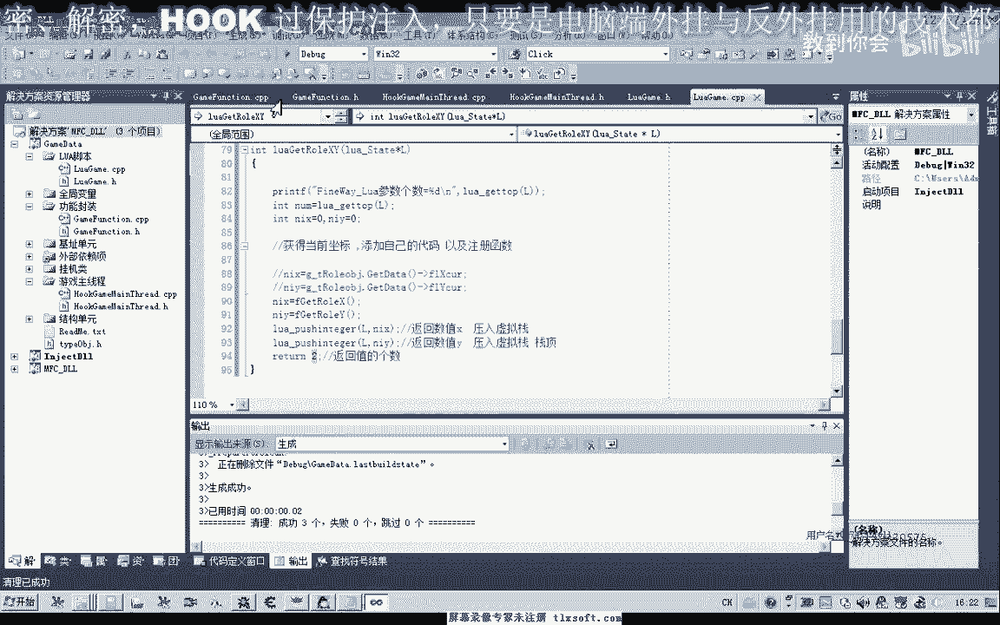
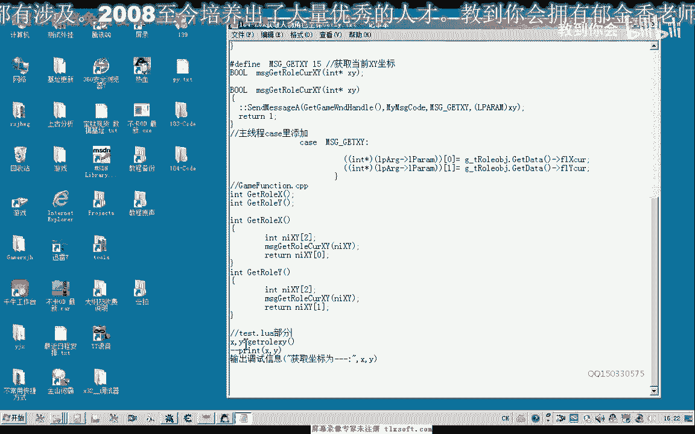

# 郁金香老师C／C++纯干货 - P173：184-LUA获取人物角色坐标GetXy - 教到你会 - BV1DS4y1n7qF

大家好，我是郁金香老师，那么这节课呢我们呃写一个获取人物这个坐标的这个脚本接口，首先呢我们打开183克的代码。

那么首先我们在他的头文件里面进行一下说明，按照统一的一个前缀啊个体，所以我们习惯，那么写好之后呢，我们移到cpp单元添加代码，我们把上一节课的这个代码呢把它复制进去。

当时是需要了在这个位置来添加我们自己的一个代码，当然现在我们这一部分代码呢我们还没有添加，那么我们要添加的话，实际上也非常的容易，我们一种很简单的方法呢，我们就是利用全局变量的变化，这个get代替。

然后呢它里面有一个当前的坐标，那么这是一种很简单的写法，但是这种写法呢它并不是很安全啊，嗯但是出错的几率也很小，也就是呃在因为只要不是挂机，在主线程的话，它都容易产生这种数据的一个冲突。

就是在主线程它还没有更新完这个坐标的时候，我们就去读取它，那么造成了我们读取的这个坐标来就不全，但一般情况下是不会出现的好，那么我们先用这种方法呢，嗯先进行一下测试，等一会让我们再讨论更安全的一种做法。

那么这里写好之后的话，我们就可以了，呃在前边的注册我们的函数，那么这里呢我们最好统一为小写啊，因为在书写脚本的时候的话，这个大小写的这个语法错误，它是根本就检测不到的。

那么所以说这里呢我们最好统一用这个小写，啊这样避免了一个大小写的一个检测，同样的前面这个函数呢我们也可它求一个小写啊，这样的话呃容易了避免一个错误，好那么注册之后呢。

我们也可以来给他注册一个中文的这个脚本函数啊，那么可以参照这前边的方法来进行一个注册，那么注册好了之后，我们就可以编辑申请这个解决方案，然后我们可以看到我们这里呢是给它定义了两个返回的参数。

那么这里呢我们是传入的一个x，这里呢我们传入的是y按照这种格式书写之后呢，我们在编写脚本的时候呢，我们就可以了呃。

与这个数字来对应起来，那么关于这一点的话，我们之前还没有做过相应的尝试，多个返回值，那么我们要获获取多个返回值的话，这里呢我们就可以了啊，直接在这里呢。

它的格式呢就是直接定义两个变量来获取它的一个返回值呃，这个时候就可以了，当然这个是一个全局的变量，我们也可以用一个no ko嗯，加上一个局部的一个变量的一个修饰符，也是可以的。

当然一般来说的话我们不用加这个修饰符，那么因为我们在后边如果是重复的运行，用到这个变量之后的话，我们再次定义的时候呢，前面的这个变量的话，它的作用域呢就相当于已经结束了啊，好的。

我们在这里呢编写了这样的一个脚本，那么我们测试一下啊。

注入到我们的游戏里角，首先呢我们需要挂接我们的主线程初始化啊，然后呢我们可以看一下现在的坐标的话是308308，那么我们看一下这个坐标是正确的还是错误的，那么这个我们发现呢呃他的这个作品的话是316啊。

那么是只获取了这个x坐标，那么y坐标呢没有正常的获取，因为我们这里传入的这个坐标的话啊，都是我们的x坐标，那么我们也就是说我们实际上有嗯也是正确的啊，因为我们这里代码输出的一个错误。

那么我们再重新编译生成一下，好的挂机主线程初始化，do five。

那么3161206啊，我们再移动一下。

再做34276啊，现在是1281bf啊，2761681，那么所以说这个时候我们取得的这个坐标的话，它都是正确的啊，当然这种做法的话也是可以的，从编写这个脚本来说的话肯定是可以的。

但是我们说的我们最好所有的这个代码呢，都要放到我们的主线程里面去呃执行，那么所以说我们在这里的话，最好是来给它在我们的这个功能封装的单元呢，给它封装一个功能函数，那么在主线程单元呢。

我们先跟他呃注册两个相应的这个函数，那么在获取坐标的时候呢，我们可以一次性的把它当成是一个数组啊，把它读取出来，我们可以添加这样的一段代码，那么首先来定义一个相应的，相应的这个消息，那么定义好了之后呢。

我们做一个前置的说明，那么这一段呢是在我们c p p单元里面添加我们的这个函数，那么这里呢它是一个一个智者呃，这个指针的形式传送进来，那么传送过去之后呢，我们需要在开始语句里边来给它添加这样一段代码。

找到主线程代码的一个处理，移到最后，那么这一句呢我们也就是先把它转换成指针，然后取它的第一个元素啊，往它的这个空间来写入我们的x坐标，然后写入我们的y坐标，在这个地方，当然还加上一个break。

好那么我们再次编译生成一下，那么这里我们添加了这个函数之后呢，然后我们到功能封装的这个地方呢，也添加两个函数嗯，可以分别的添加获取我们当前角色的x坐标和y坐标，啊加上我们的f前缀啊。

这个功能单元的我们都给它加上了嗯，然后我们在他cp p单元里面呢添加如下载代码，然后记得他的加上一个f的小写的f的一个前缀，用来进行一个区分，然后这里呢我们是定义一个数组嗯。

进去之后呢获得相应的这个坐标的一个数字，然后呢最后呢返回它相应的，因为这里呢表示的是零呢是我们的x坐票，一的话是存放的我们的y坐标啊，这个地方是按照xy这样来分布的好，那么这样书写之后的话。

我们这个如果单元的我们这两个语句呢，我们就可以另外一种更安全的一个写法，嗯嗯嗯，那么这样呢我们可以获得我们的两个坐标，然后呢把它相应的参数的一个个数呢一定要传送回去啊，这是返回值的一个个数。

因为呢我们获取坐标的话需要有两个返回值啊，那么所以说我们在这里写它这个脚本的时候呢，它这里呢也是用两个变量来获取他的一个反馈值，那么注意这一点的话，与我们的c语言的话是很大的不同。

还有这个point f的话，在我们动态链接库里边做测试的话，它基本上没有用，因为这个point tf呢它是将我们的这个控制台输出我们的信息，那么所以说在这里呢我们另外写了一个调试信息的函数啊。

用来打印我们的一些调试信息啊，这个x y的一个数值好的，然后呢我们再次嗯来进行我们的输出，那么重新编译生成一下，那么再次我们查看一下我们的xy坐标，那么2761281我们再移动一下啊。

现在是2201326，那么我们再来测试一下2201326，那么这个时候呢我们获取的坐标的话都是正确的啊，好的，那么我们这节课呢我们就讨论到这里。

