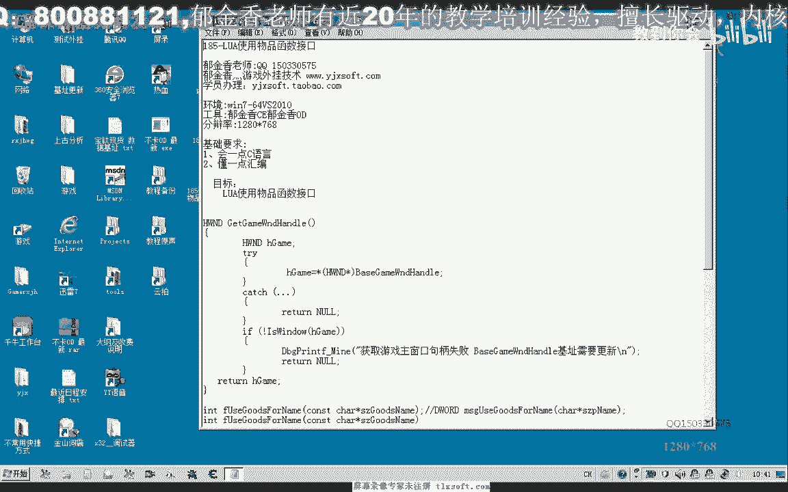
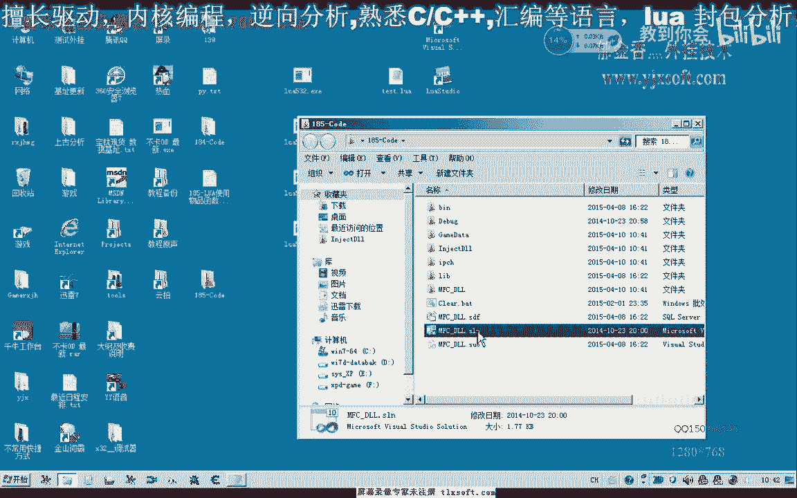
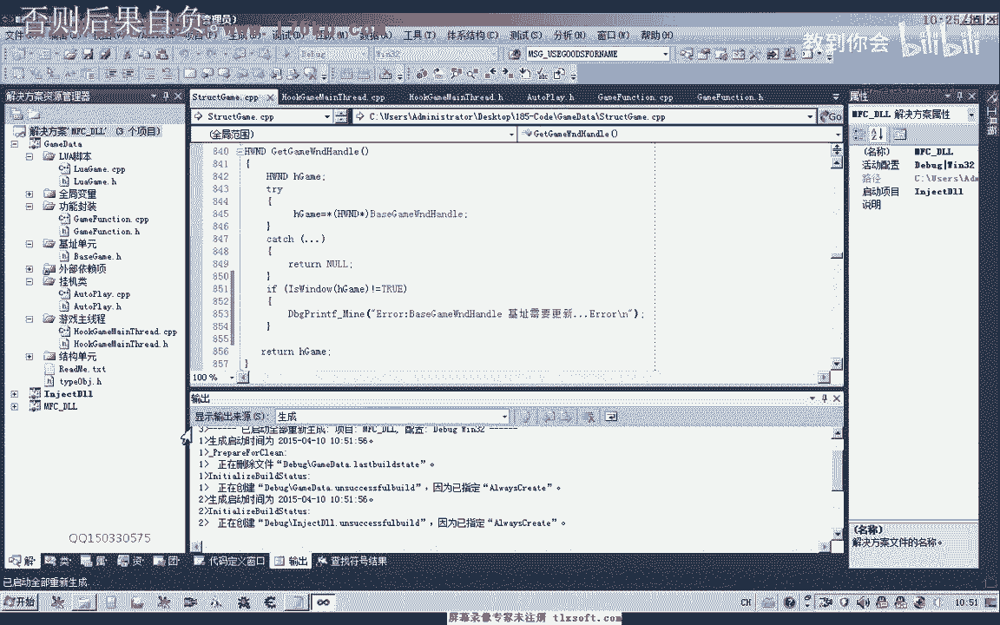
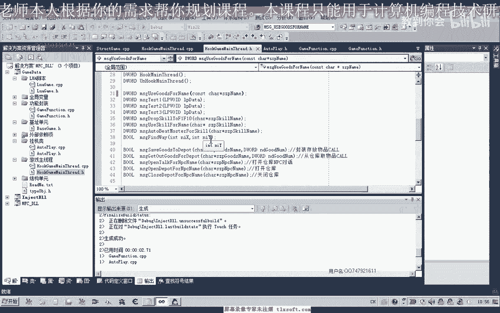
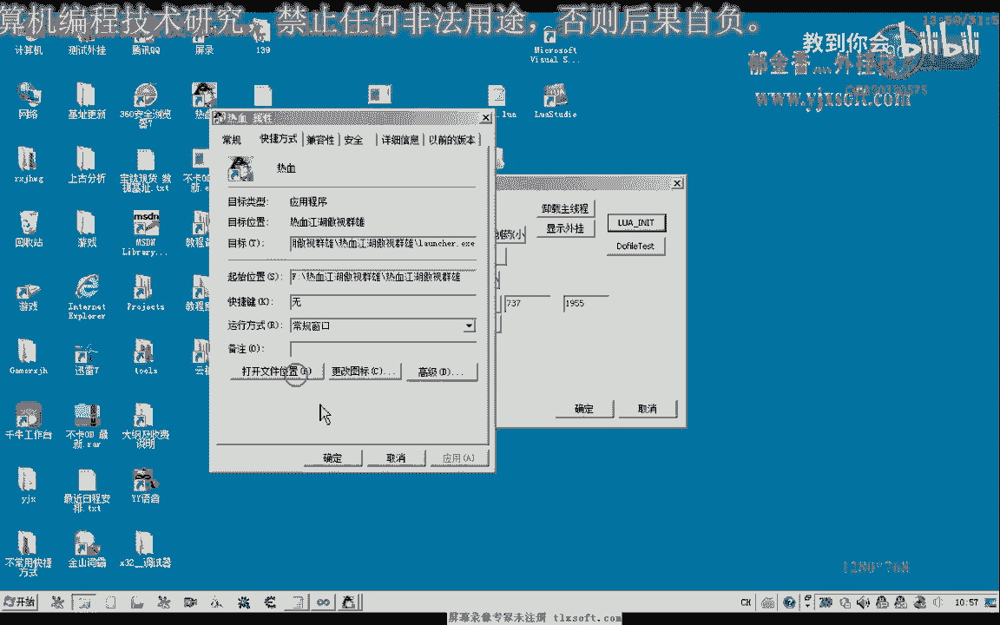
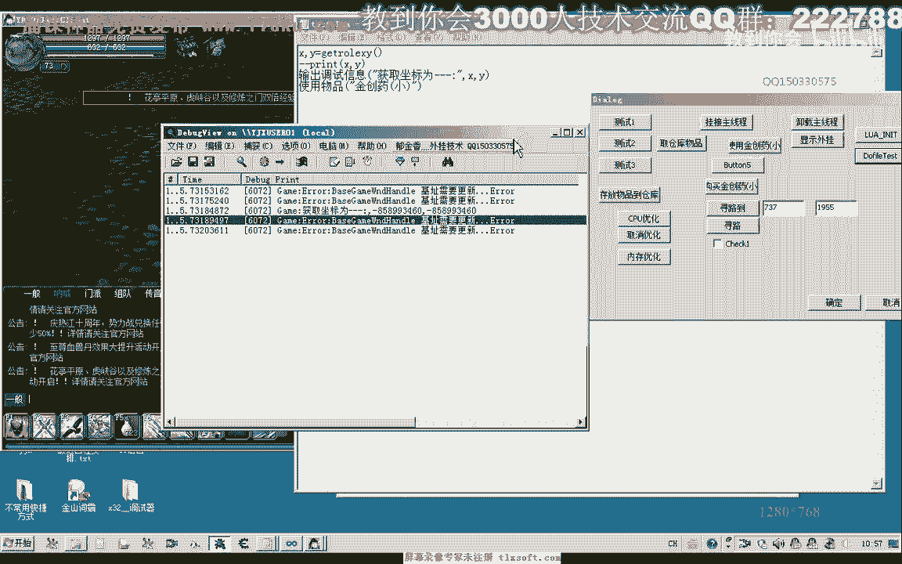
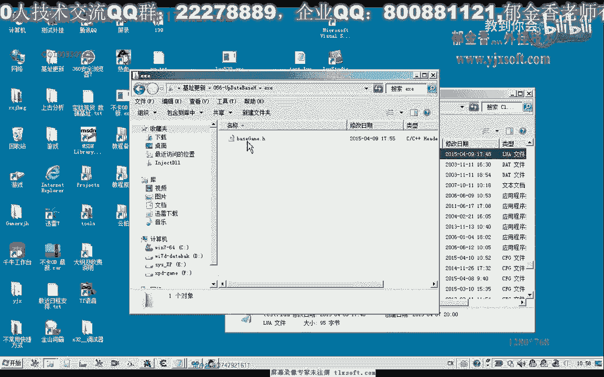
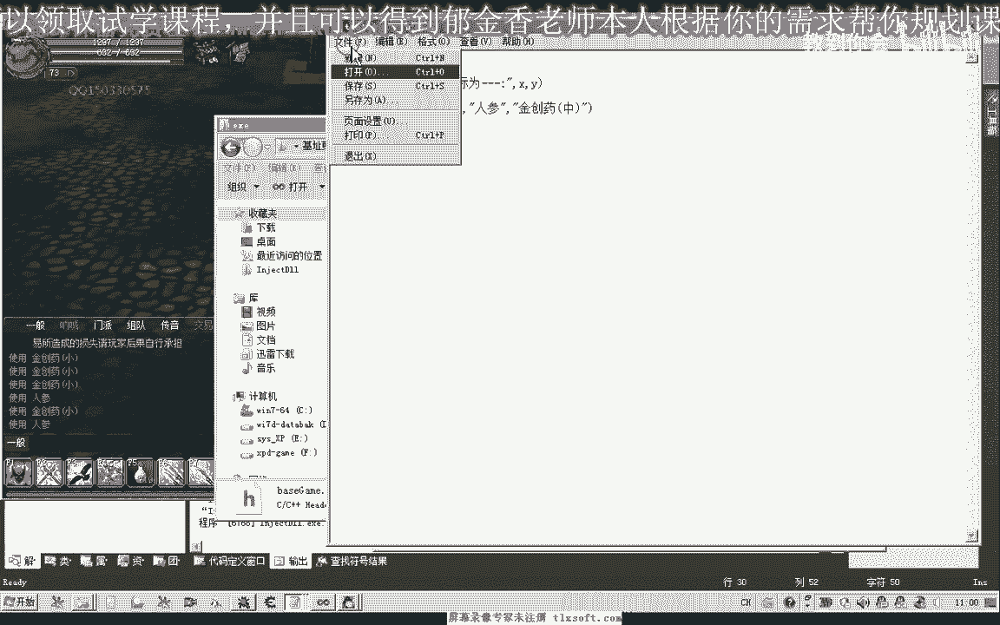
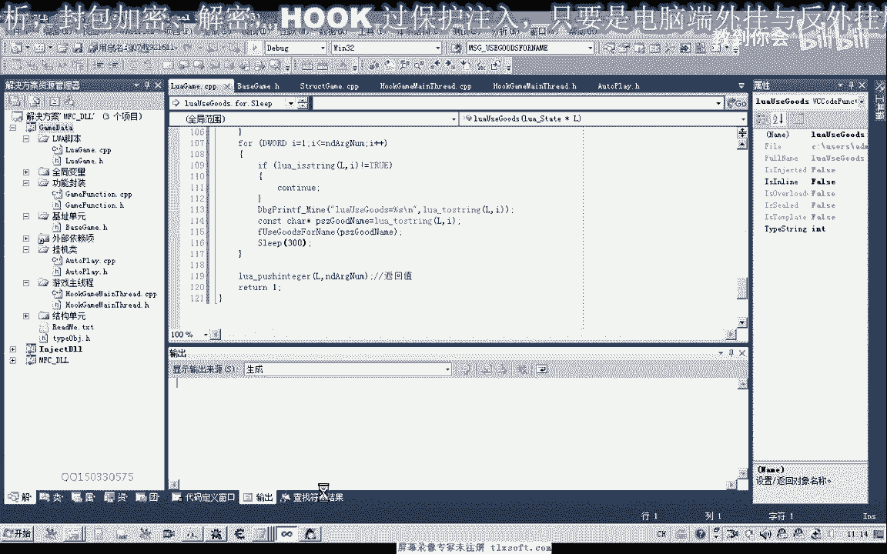

# 郁金香老师C／C++纯干货 - P174：185-LUA使用物品函数接口 - 教到你会 - BV1DS4y1n7qF

啊啊，大家好，我是郁金香老师，那么今天呢我们一起，那么使用这个路修本来编写一个这个使用物品的函数接口，好的，那么我们先打开184克的代码。

那么首先呢我们展开我们的lua脚本的单元，那么在这里呢我们注册呃，先写一个使用物品的函数，哒哒哒，啊哒哒哒，然后我们转到cpp单元哈，添加相应的源代码，那么在这里呢我们需要来调用呃。

我们这个功能封装里面的相应的使用物品的函数，那么我们先给它一个返回值，那么转到我们的功能分状态里啊，在这里呢我们也写一个函数，那么然后在这里呢我们调用我们的m s里边的，因为go的分类。

然后直接返回它相关的呃一个数值，好的，我们先编译生成一下，那么我们在这个时候呢，我们再倒回来到我们的啊路啊脚本这里，那么在这里呢我们先要取得他这个物品的名字，因为我们在写脚本的时候。

肯定是以这样的格式来写啊，比如说我们就可能是使用物品，然后呢这里是物品的名字，咳咳那么一般会这样来调用，但是这个时候的话肯定要传传进来一个字符串啊，那么在这里呢我们需要来把这个字符串来取出来。

那么首先我们也是确定一下它参数的个数啊，ngpp好来决定这个啊函数啊，传进来参数的一个个数，那么如果这个参数个数它小于啊小于一的话，那么肯定呢我们就直接就返回，那么就返回一个参数，出新用途啊。

比如说这个时候呢我们突袭一个数值零或者是-1啊，这一类的，用来表示失败，那最后成功的话，我们也会给他传递一个参数，那么这个时候呢我们常用的参数呢是一个非零的一个数字，那么如果它的这个参数的话啊。

大于一个哈，呃或者一个以上，因为后面的参数呢我们都会忽略掉啊，我们只取第一个参数，那么这个时候呢会传送一个物品的名字进来，那么我们呃在这里呢先取得这个相应的这个名字，啧。

那么这个时候呢我们把参数把取出来，当然也可以就是说如果他有多个参数的话，嗯那么我们也可以来把多个参数来都取出来，连续的它可以一次性的使用几个物品的情况下，这个看怎么设计啊。

比如说我们也可以按照这种设计啊，four five，那么我们也可以依次取出它相关的这个数值，那么这里呢我们就用这个i来表示它，当然我们也可以在之前呢会判断一下它是否是一个字串的一个类型，嗯，咳咳。

那么如果不是字串流类型的话，我们仅记去了下一次的一个循环，那么四字处理的时候才会执行到这里，那么我们把这上取取出来，需要来调用一个功能函数嗯，那么功能函数在前面加一个f在这，好的在这个地方我们调用一下。

那么编译生成影响，好的，那么这个时候的话我们就把我们的这个物品使用的这个接口啊写好了，然后呢我们需要注册一下这个函数，然后我们把它移到前边这个位置，咳咳咳咳，那，么我们也给他注册一个中文的名字。

这样的话中文和英文呢它都是支持的啊，注意这个是英文的符号，所以这个我们注册的英文名字的时候呢，我们全部来呃让它小写，好的，然后再次便申请一下，那么上次之后呢，我们还对另外的一个地方来做一下修改。

来到这个主线程单元，对对这个获获取游戏句柄，这里呢我们增加相应的代码，那么很有可能就是说有时候我们嗯取得了这个游戏的机制，它过期了啊，但是这里呢它同样的能够读出相应的数据。

但是读出来的呢它有可能不是我们的主窗口句柄，那么说明这个时候的话，我们的这个机子的话需要更新，那么判断它是否是这个窗口句柄呢，我们可以用一个windows函数，就是windows啊来进行一个判断。

那么如果他最终获取的一个数值的话，复古为真的话，那么说明呢这个机子已经失效了啊，那么我们这里呢打印出一段调试信息，好的，再次编译生成一下，然后呢我们打开游戏。

8号，那么编译生成之后，我们这里有一个错误，我们看一下无法解释的符号，那么这两个地方的类型啊可能是不一样的，呃这里呢我们需要把它设置一下，那么再重新编译生成一下，好的，这一次呢我们运行。

这里我们要修修改一下它的调试目录，嗯嗯，好的。

好，那么我们再次输入一下代码，那么做了之后的话，我们也要挂接主线程哈，做一个初始化，然后需要到我们的游戏目录下边呢，写一个测试的呃脚本。

啊，那么这里呢我们以这个精装要小啊为例来进行一下使用，那么我们看一下背包里面啊金疮药，然后我们把调试信息打开啊，进行测试，那么这里呢我们发现呢就有一个错误说这个机子呢需要更新啊。

可能是由于我们游戏更新了啊，所以说相关的机制呢我们也需要进行一下更新，那么打开我们的机制更新的呃工具，那么在这里呢我们把最新的这个机制把它复制进。

那么再重新编译生成一下，然后挂机主线程啊初始化，然后呢，我们再次do file，那么这次的话应当是正确的使用了，我们切换到游戏里面，可以看到do file，这个时候呢会成成功的使用，然后我们还可以呃。

因为我们刚才写这个脚本的时候呢，嗯这里的话它是支持这个多个参数的，我刚刚才写的时候，那么后边呢我们还可以跟一个啊啊使用物品啊，人生或者再来一个金疮药中，那么这样呢我们就能够同时的啊同时来使用高物品，好。

那么我们再来看一下在do file，那么这个时候的话，我们看到这个人身和精装要小的话都已经使用了，但是这个金创药中的话没有使用，我们再来看一下，他只使用了一个金疮药小，还有一个人参。

那么我们再来看一下我们的脚本，呃金疮药中啊，呃人生，那么这里的话代码的话我们看起来是没有问题的。

那么我们再来看一下我们路网里边的这个代码，看一下它是怎么写，那么实际上在这里的话，我们返回值的话呃，可以返回为它相应的，这个使用物品的这个个数啊，然后我们再来看一下，看看continue。

那么可能是某一个呢它某一个参数呢他被判断为不是字串，还有它的这个下标的话呃我们应该是从呃一开始才对，因为从零开始的话，他就少执行了一次循环啊，感觉的话，我们再来看一下a接拉，下标应当是从一开始。

好的我们再来重新编译一下，再次来挂机主线程初始化吧，然后我们听到游戏里面看一下do fire之后的一个结果，那么这个时候我们发现了我们的金疮药中还是没有被使用，这个很奇怪啊。

那么我们再来看一下我们的脚本代码，金创药中，那么我们把人生移动到后边来看一下，再保存，在to five，那么可能是我们这个金创药中他的这个名字啊，使用错了，我们单独的使用一下这个金创药宗，看能否使用。

但是很奇怪的是，我们单独的使用这个金疮药菌的话，它也是可以使用的，那为什么在这里它不能够使用呢，大家，那么可能也是这个它中间没有一个时间的缓冲，或者是时间使用的时间的一个间隔太短了。

我们可以把这个金疮要小和金疮药中的位置来给它调整一下，再来试一下吧，那么的确是同一类看来呃，我们这个游戏的话，它对同一类的这个药品的话，可能有一个时间段间隔的一个限制啊，它不能够使用的太频繁。

那么在这里的话，我们需要给它加上一个sleep，再来试一下，金疮药中，那么这个时候的话只执行了第一个啊，第二个的话根本就没有，根本就没有执行，那么我们再来看一下它参数的个数是否对呃。

还有它是否执行到下边这个地方啊，嗯嗯，好那么我们继续再重新生成一下，那么挂机主线程初始化，然后我们执行一次，看一下它的调试信息，那么我们的调试信息的话，发现的话，这个路啊啊，相关的调试信息，既然没有。

那么可能是我们编译的时候呢，编译的不成功，首先我们再编译一次，那么重新生成一下，动态链接库没有卸载掉，我们再次卸载掉我们的动态链接库，啊再重新编译生成，八戒主线程说实话都怪我，然后再看一次精通。

要中精通，要小人生啊，三个都是执行道德，但是呢我们这里的话它只有一个成功，嗯这个是很奇怪的，那么我们再把这个时间给它加大一点，好那么我们再重新输入一下，化解主线成初始化合，那么金创药中和金创要小的话。

实际上呢都运行了，而可能是这个人设呢，现在他没有了，我们没有注意啊，我们到药药店来去买几个这个人生再做测试好的，那么我们再次测试一下，那么这个时候有了延迟之后呢，这三个物品呢它都能够正常的使用。

那么我们再次把这个延迟的时间给它去掉之后，我们看有没有用，那么再次挂接主线程初始化，再执行一次，那么再次执行的时候呢，我们发现这个金创要小的话呃，没有被执行，应当是从这一点来说的话。

他应当呢需要需要一个时间片才可以，而我们再来测试一下，单独的分开写这个脚本，那么在这里呢使用金疮药中，那么下边呢我们使用金疮药小，然后呢我们再使用人声再试一下，那么我们发现这个时候的话精通要小的话。

它依然啊不能够使用嗯，应当还是就是说两个物品在使用的时候呢，它需要有一个时间片，那么如果是执行过多的话，他可能就会呃就会被啊忽略掉一部分，然后比如说我们连续的使用这个人声，应当也是不可以的。

比如说我们连续的使用很多个人生，再来测试一下，那么这个速速度过快的话，它只能使用一个啊，它有一个时间的一个间隔，那么这个间隔的话应当可能通过分析的话，也可能能够呃找出呃相应的解决办法，那么大啊。

关键是看这个物品的一个使用的一个频率，它是本地检测的还是服务器来做的一个检测，那么在这里的话我们发现的话可能就是呃100ms左右的话，它应当应当是可以的，那么我们现在调主线程之后再来看一下。

嗯逛街九线程，然后呢我们再次执行，那么这个时候我们发现的话能够使用三个人生，那么证明的话它的时间的一个间隔的话大概是200ms左右啊，因为我们在这个la tastic里面的话啊，写的是，大概是七个啊。

需要使用七个人生，那么在这里的话，他应该是时间的间隔来，应该是呃服务器简单的时间间隔可能是200ms左右，那么在这样的一个时间间隔的话，它能够来重复的使用，好那么我们再次看一下。

那么这个时候呢我们能够使用四个人生哈，那么说明他的一个时间检测的一个间隔的话还要久一久一些，那么我们是测成300ms再来测试一次，啊。

那么这个时候的话我们发现呢他能够基本上七个人生呢，他是能够呃完整的使用1234567啊，那么在这个时间呢我们暂定为300ms，那么可能的话也可能是在200多到300之间，这个数字需要测试。

那么有空的时候呢，大家可以分析一下啊，这个呃物品是同一类物品的一个使用的一个间隔呃，它究竟是多少时间，看他究竟是本地的检测，还是那我们服务器的简称，那么这个要分析的话，思路也很简单啊。

在这里我可以说一下，那么大家可以直接调用这个呃发包来使用这个物品，就能够做一个相关的一个检测，那么如果发包它还有这个限制的话，说明他的这个检测的话肯定是在服务器上的啊，就过不了，那么如果是在本地的呃。

如果我们通过发包，他没有这个时间限制的话，那么呢我们可以直接利用发包呢来使用这个物品，好的，那么这节课呢我们暂时呢就讨论到这里。

