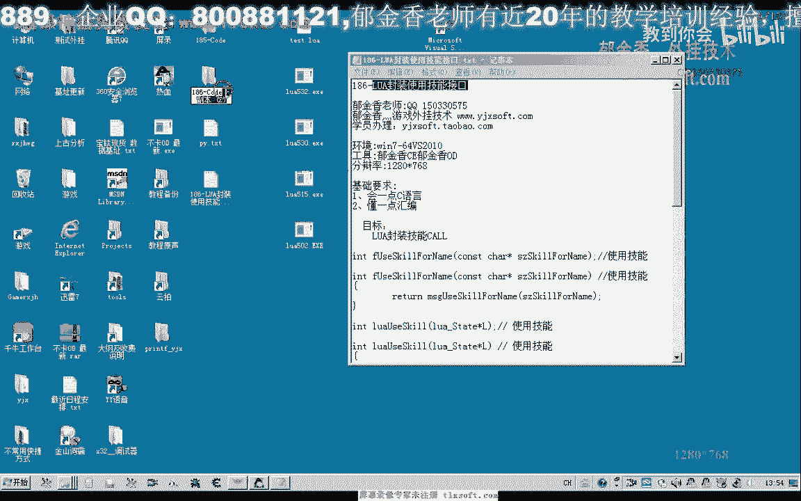
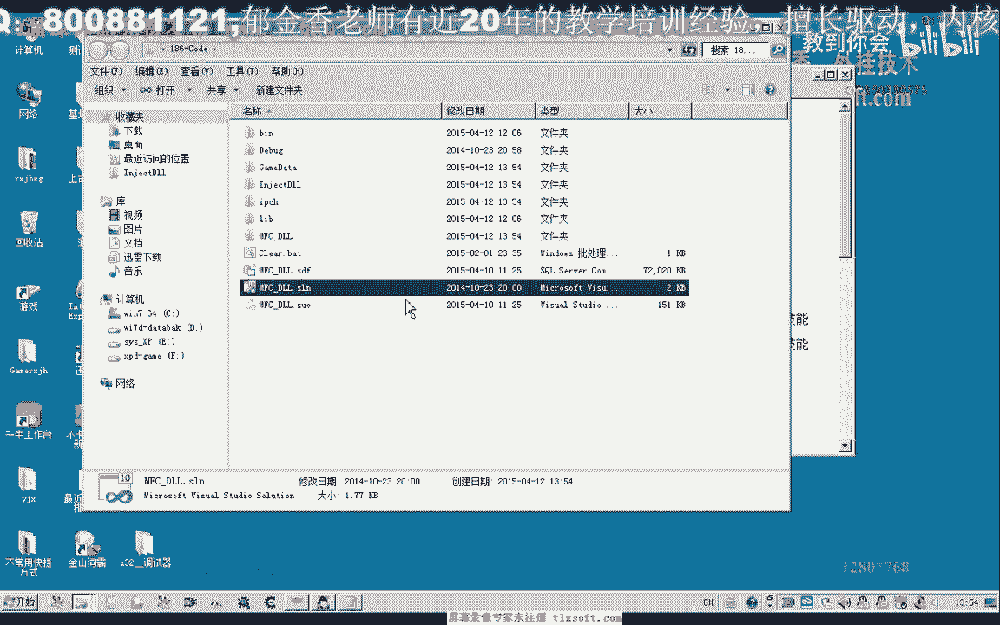
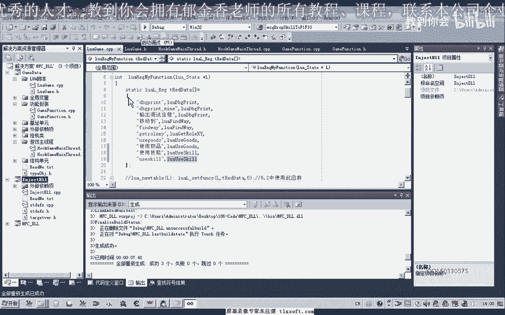
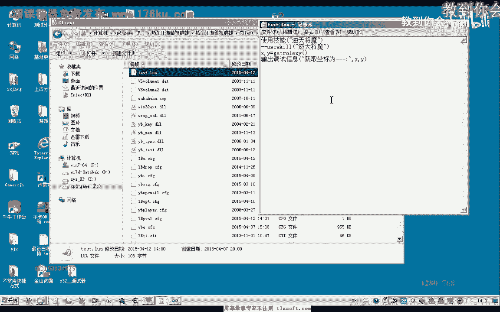
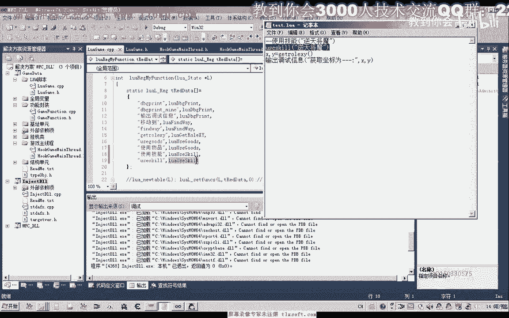
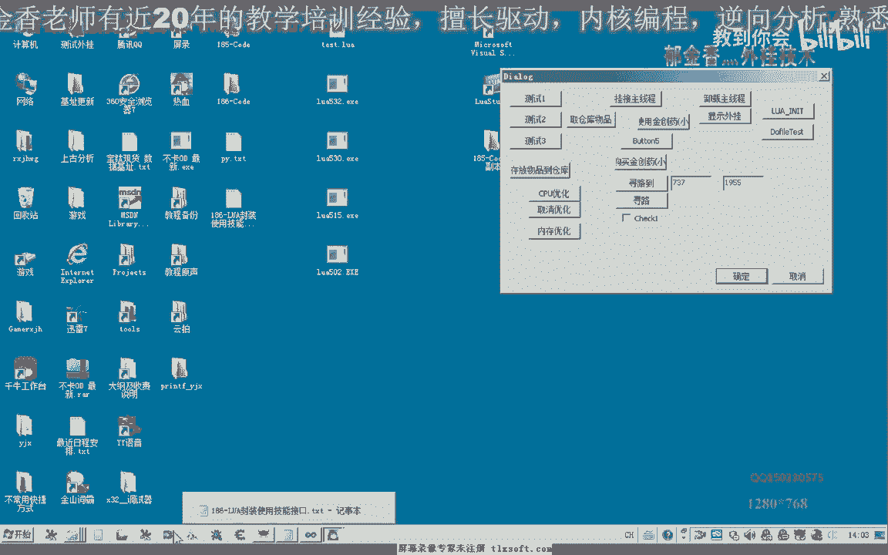
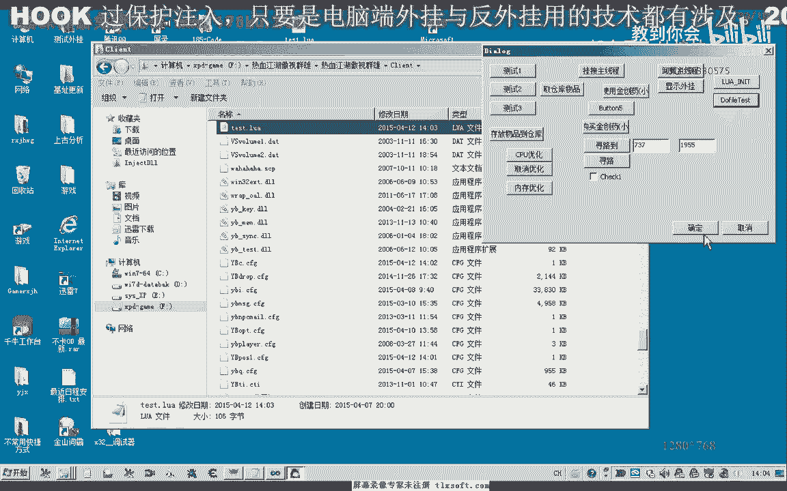
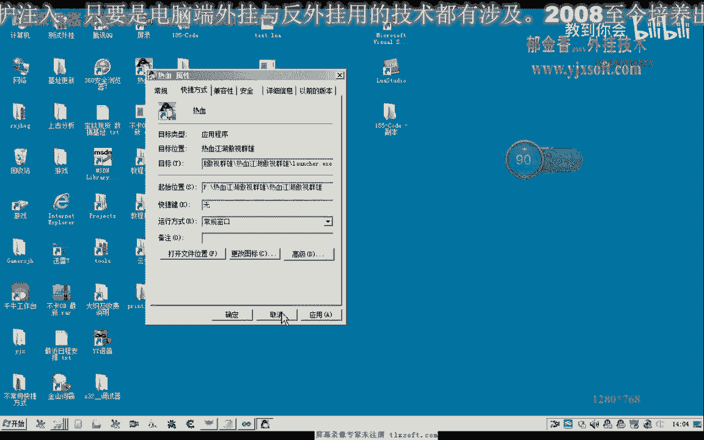
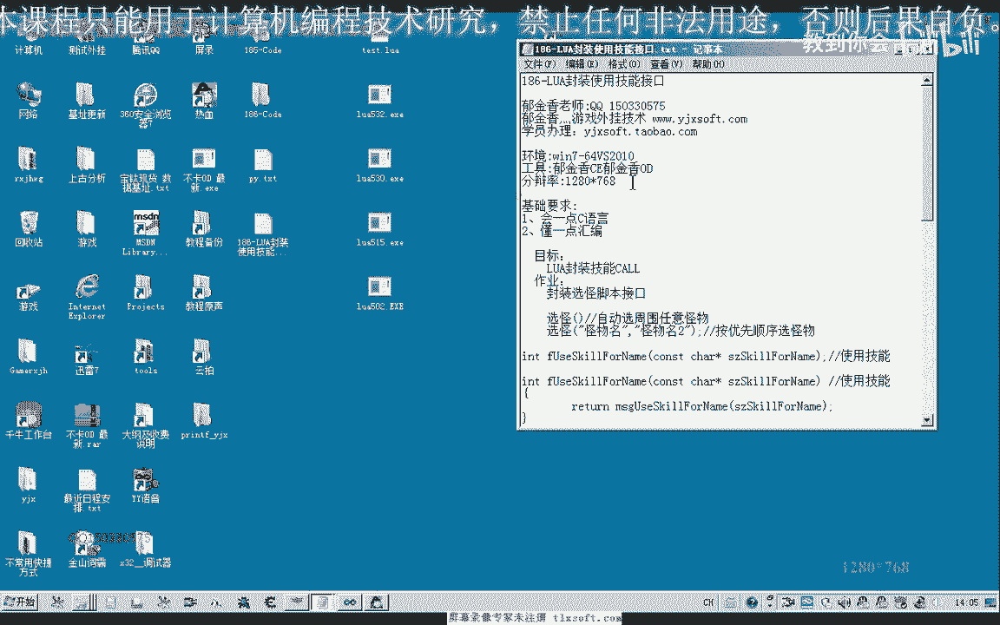

# 郁金香老师C／C++纯干货 - P175：186-LUA封装使用技能接口 - 教到你会 - BV1DS4y1n7qF

大家好，我是郁金香老师，这节课我们一起用这个lua封装一下技能的接口，首先呢我们打开185克的代码，嗯。

打开之后我们先展开我们的这个lua脚本的单元以及功能封装的单元，还有我们的呃主线程单元，这几个单元要添加或修改我们的代码，那么首先呢我们在功能封装的这个单元添加一下相应的说明。

先在他的头文件里面添加一个技能使用的扣啊，在cp里边呢我们进行一个简单的调用，调用下mg qe和雷达这一个函数，那么移动到最后，那么注意了，但是我们这里是const加一个前缀啊。

但是这个过它没有添加我们相应的前缀，所以说在这里的话，我们为了通过编辑的话，正常进行一个编辑，在这里呢我们需要的呃呃进行一个相应的修饰，那么同样的影响到的还有这个函数，它的一个声明。

那么以及在他cpp里边的一个生命，好的，然后我们先编译一下，看有没有什么错误，那么这里呢我们还需要转到他的头文件进行一下修改，不然的话还会有错误，好的，那么这样的话我们在功能单元里面呢就封装好了。

我们的这个fu人scarefully，然后我们就可以在我们的脚本函数里面来进行调用，那么我们在脚本函数里边呢也需要在头文件里边呢给他注册一下啊，使用技能的这个空，当然这个名字的话可以自己修改。

然后呢转到c p p里面呢，我们需需要来添加啊，不下载这个代码，我们来看一下，那么首先呢我们也是与之前的函数来类似，取得参数的个数啊，如果没有这个参数的话，我们直接就返回了，然后返回一个数字零，这里是。

这，里是参数返回的，那么在这里呢我们取得啊如果有参数的话，我们就以字符串的方式来取得相应的这个参数，取出来之后呢，用这个指针的指向它的这个缓冲区啊，然后在这里的话我们呢呃对我们的这个扩了进行一个调用啊。

在这个地方，那么这里呢就调用我们的这个功能库，最后呢我们这里调用完成之后呢，返回我们的数值就可以了，那么实际上这个封装的话很简单啊，也就是我们把这里的参数取出来，然后传递给我们的这个功能参数。

然后这个功能参数呢再转到m s几啊，我们的主线程单元去执行，然后呢再通过我们的这个消息来啊，转发到我们的这个主线成立平去调用我们相应的一个扩，嗯再调用我们的这个f一到f 10里面的这个uk分类啊。

嗯好的，那么我们接下来呢进行一个测试，当然在测试之前的话，我们还需要来帮我们写的这个函数来进行一个注册，需要到我们前边这里这个地方啊，进行我们函数的一个注册，那么在在这里的话。

我们也可以来写一个英文的secure，啊可以注册两个啊，或者是两个以上的啊，当然自己喜欢用哪一种都是可以的，usq，那么写好了之后，我们再次编译生成，那么编译成功之后呢，我们需要了在写相应的一个脚本啊。

比如说我们这个里面的测试脚本呢，就是这个技能啊，逆天降魔好的，我们转到游戏的客户端所在的这个目录，然后在这里找到我们的这个脚本文件啊，进行我们的修改，那么我们在这里来使用这个技能，或者是用这个英文的啊。

uc去瞧瞧，好那么我们先选中一个怪物，然后呢我们注入我们的动态链接库啊，挂机初始化，那么这个时候我们可以看到它会使用这个对这个怪物来使用这个技能，那么我们再换一个，啊，这个时候好像是掉线的啊。

啊掉线断开了，那么实际上我们的测试呢是已经成功的啊，那么我们再次打开游戏之后呢。

再做一下测试，那么这次呢我们把上面这个注释掉啊，使用下面这个英文的usq啊。

注册的名字再来调用名字保存，然后呢再次注入到游戏领域，这个时候已经选中了一个怪物，挂机出现成初始化，那么我们可以看到它自动的啊使用这个技能，那么如果另外的选择一个怪物，在do file。

那么这个时候呢它同样的会使用这个逆天，比如说我们再测试一下这个逆天煞星。

保存一下，好的，那么所有的测试的话都很成功，那么其他的这个函数的话呃，大家自己的啊封装一下啊，这里呢主要是探讨的一个封装这种函数接口的一个方法，好的，那么我们下一节课了再见。

那么这节课呢也给大家留了一个作业嗯。

那么作业的话就是大家分装一个选怪啊，选怪的一个脚本的接口，那么这个函数的话，这个脚本的话要求呢就是我们选块，然后呢他如果是没有参数的情况下来，我们就自动血周围的任意怪物，那么如果是带参数的情况下。

那么比如说这里有挂也不一，那么这个时候呢我们有一个怪物列表，然后呢就需要按照前面的这个顺序来的，看一下优先顺序，那么要求要有这样的一个功能好的，那么这节课呢我们暂时到这里。

