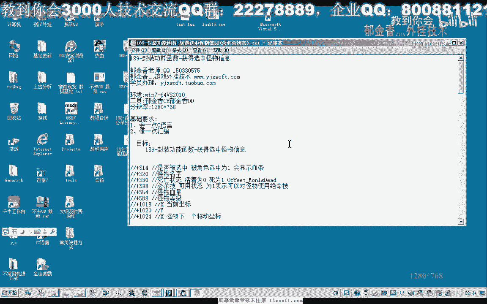
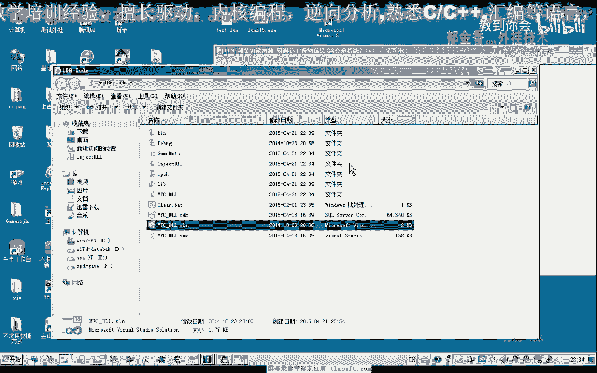
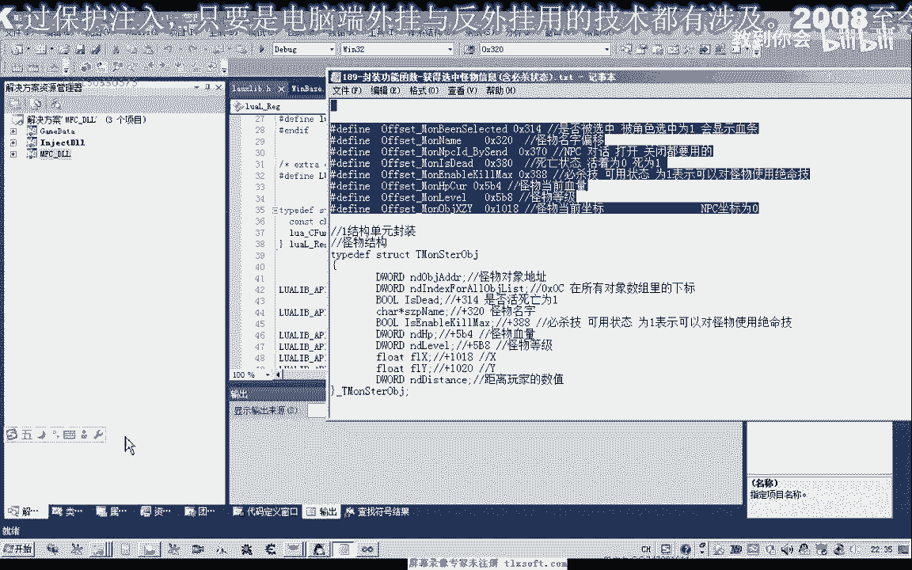
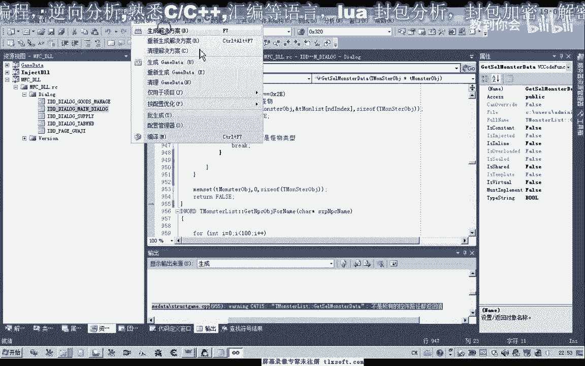
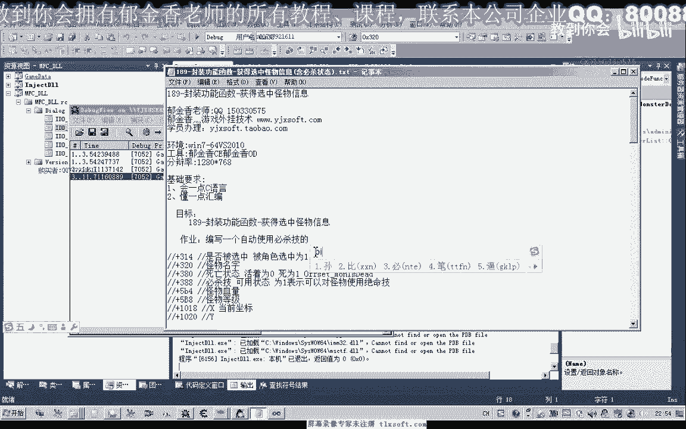

# 郁金香老师C／C++纯干货 - P176：189-封装功能函数-获得选中怪物信息(含必杀状态) - 教到你会 - BV1DS4y1n7qF

大家好，我是郁金香老师，这节课我们一起来封装一个功能函数呃。

获取选中怪物的信息，那么同时呢我们把之前的代码来做一些哈规范或整理，首先呢我们打开187克的代码。

哈。

啊，那么首先呢我们嗯添加这个必杀啊，怪物是否可以使用必杀技的这个状态呢，我们把它添加进去进去，同时我们把之前用到的这些偏移呢都把它定义为红，那么这样修改的时候呢，我们方便修改。

当然这个相应的红呢我们可以放在嗯头文件里面，也可以放在cp p这边，一般呢我们放在这个git代替这展开我们的功能结构单元。

找到，怪物的这个get到体制，怪物列表初始化，这，或者我们把这个红蓝就定义在它的结构的前边啊，这样也是可以的，好那么另外再定义一个这个怪物列表大小的一个红。

六，走，当然这个所谓的怪物列表里面呢，它也包含了其他的对象啊，所以说我们也可以说是呃附近的这个对象列表的一个大小，那么我们暂时把它定义为100，那么定义好了之后呢，我们这节课主要是写一个相应的函数啊。

呃来获取我们选中的这个怪物对象的一个信息，那么首先呢我们在嗯这个怪物列表达呃，里边哪天这个录音里面的结构啊，结构里边我们添加一个呃相应的这个成员函数，添加这个成员函数之后。

然后我们转到它个体代替的后边好先要修改一下呃，get对比这个函数，因为我们首先呢我们要替换这些相应的偏移，那么这个我们要把它改一下啊，那么这里我们全部用人的方式来表示。

那么这里我们要进行替换，同时呢我们还要添加一个层面变量，啊那么这个结构呢我们也把它改一下啊，当然实际上我们只加了一个啊，只是注释来看起来不一样，那么其他都是一样的好，那么这里呢我们添加了一个成员。

用来表示这个必杀技的这个状态啊，怪物是否可以使用这个必杀技，那么我们添加了这些状态之后的话，我们在get gt里面呢，我们已经可以了呃，获取这个使用必杀技的这个状态，那么这个信息我们获取了之后呢。

我们另外再编写一个函数，用来获得一个当前选中怪的呃，相应的一个信息，那么也就是这一段代码把它添加到我们的cp端元，那么我们来看一下思路，首先呢我们需要在头文件里面啊进行一个说明，啊对了。

这里我们用的是引用，这里我们需要用指针，那么首先呢我们是要获得我们当前选中的这个呃对象的i d，那么我们获取这个id之后啊，也就是这个i d，那么如果它是等于0x x f f这个f的话。

表示了我们没有选中任何的对象嗯，那么如果是选中了对象的话，我们继续执行后边的，当然我们还可以加上一个条件嗯，如果是，当然我们这要需要之后来做一个判断，就是看他是否它的这个类型呢，是否是这个怪物的类型。

如果不是怪物的类型的话，嗯我们也不能够也不能够返回正确的这个信息，那么所以说我们在这里的话，取出我们的这个啊，或者我们就是呃如果选中了这个不是怪物的话，我们在这里遍地的时候呢，我们会体现出来。

那么如果我们这里呢我们是对整个这个附近的怪物列表呢，初始化，初始化之后信息会存到这个呃对象数组里面，然后我们就骗你整个数组，看里边呢有没有我们选择的这个，那么如果是在整个列表里面找不到的话。

那么证明他不是啊，那么证明找到的呢不是我们的这个怪物啊，应该是其他的这个对象，当然我们这里还需要做一个判断，应当是要做一个判断才可，那么找到这个对象之后的话，那么这是我们对象的这个地址，那么对象地址呢。

我们家零四这个地方呢，嗯我们可以做一个判断，就是它的一个类型，啊，咳，然后我们把这个地方的数字来取出来，当然如果写的更细致一点的话，我们可以把它写成函数来获取这个类型。

那么这里呢我们也可以直接把它读出来啊，呃读出来之后的话，如果这个地方等于我们的0x或者一，那么这个时候呢我们表明的是怪会，那么否则的话我们就不是怪物，然后我们就返回，当他返回之前呢。

为了呃我们上边的函数啊，方便判断，那么我们在这里呢给他做一个win city，做一个初始化，那么如果他是是这个怪物的话，那么我们直接来复制这个对象啊，那在这个地方复制，好。

那么因为这里呢要读取到这个内存的信息，我们最好是加上一个异常的一个除了嗯，咳咳，222，好的我们再次编译生成一下，那么这里的话基本上我们就封装好了，那么但是呢我们需要在脚本里边啊。

这些进行调用的时候的话，我们肯定要在主线程单元单元啊，封装另外的函数，那么这里呢我们在主线程单元呢也可以进行相应的封装，那么首先呢我们是听一谈相关的这个消息，然后呢再次定义啊相关的函数说明。

然后这里呢我们把消息的传递进去，传到我们的这个窗口过程里面，然后我们需要在窗口过程里边呢来处理我们的这个消息，那我们看一下这段代码怎么写。

那么首先这里涉及到这个结构呢，需要放在这个case的外边啊，放在里边的时候呢，它便一通不过，好那么这个时候呢我们在这个回调函数里边啊，也就是我们的贺口啊，主线程里面呢我们调用呃相关的这个获取选中。

怪不得这个信息，那么这个信息来最终还是需要传递一个结构进来啊，那么在这个信息我们处理完了之后啊，在这里呢我们可以做一个呃相应的判断，那么我们这里呢是通过它的这个对象地址来判断的。

如果没有正常的获得他对象的地址的话，它让这里来返回的将是呃，这个门设计设置的这个数是零啊，那么如果他这里数值不为零的话，证明了我们调用这个函数成功了啊。

因为我们这个sdm message symmessage这个函数的话，它本身的这个返回值的话，不是从我们这个地方来获得的啊，不是不是这个这个地方的返回值，那么所以说我们需要另外的方式来来进行判断，好的。

那么这里我们封装好了之后呢，我们再到我们的功能单元来进行一下封装，那么这个只是写一个简单的接口啊，非常的方便，就直接调用一下我们这个主线程单元的函数就可以了，因为这里呢不需要添加其他的功能。

但是我们在这里写一次之后呢，以后我们要调用的时候呢，全部就到这个图文件里面来找我们所要的这个功能函数，那么就不用去调用其他单元的这个函数啊，那么在这样的话呢，那么甚至呢我们可以把它写成一个内盘啊。

这样的话调用起来的话会更加的方便，那么也可以写成一个静态的类啊，通过一个全局的一个静态类的来访问里面的这些函数嘛，好的，那么编译成功之后呢，我们接下来呢呃先进行测试，那么这里呢我们需要先定义一个结构。

然后把它的这个相应的地址传送进去，你的枪，然后对它进行一个判断，这个时候那么如果调用成功的话，我们就打印出它相应的这个信息，如果没有成功的话，我们打印出另外的一段调试信息，关注，呼呼呼。

好的我们再次编译生成，然后测试一下，二。

那么这个时候呢我没有选中这个怪物对象啊，然后我们选中一个这个时候再测试啊，那么它相关的这个信息呢就会显示出来，当然我们呃上一节课所分析的呢，也就是它的一个呃必杀技的一个状态啊。

那么下一节课呢我们再根据这个呃选中怪物的对象呢，来自动的调用这个必杀技啊，那么这也是这节课的一个作业啊。

大家下去演示一下，就是说加上这个自动使用这个必杀技的人这个函数啊，助力，好。

的。