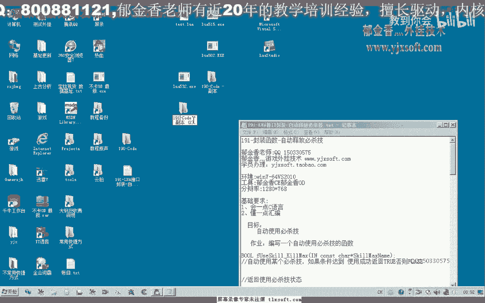
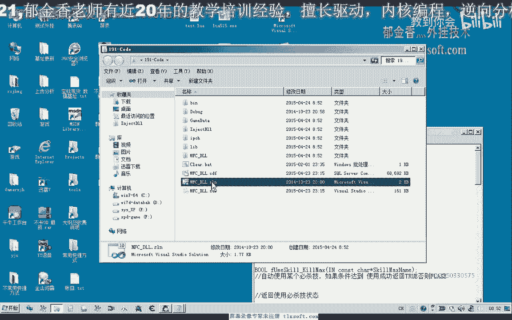
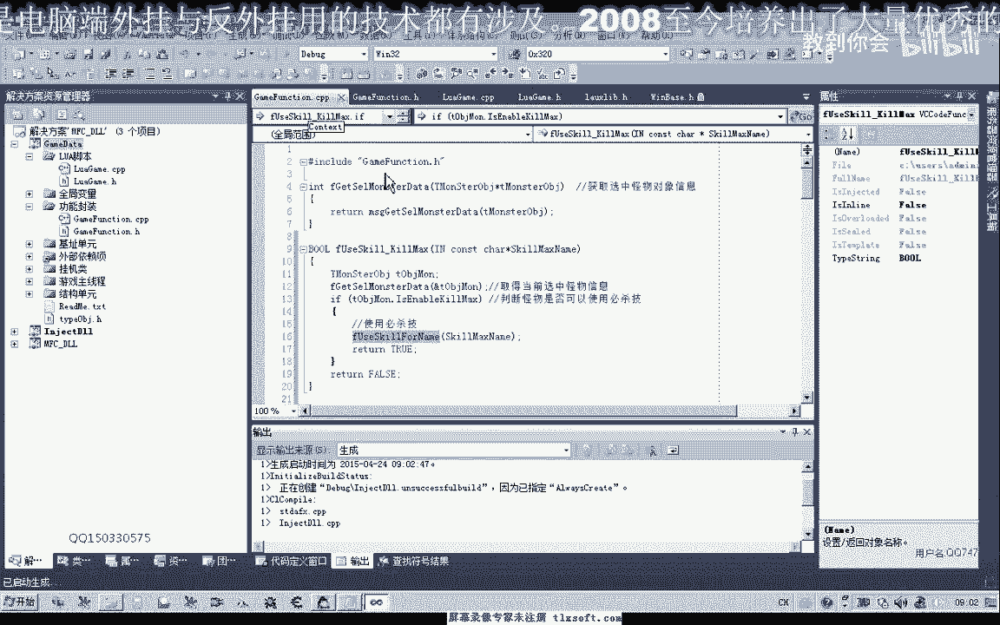
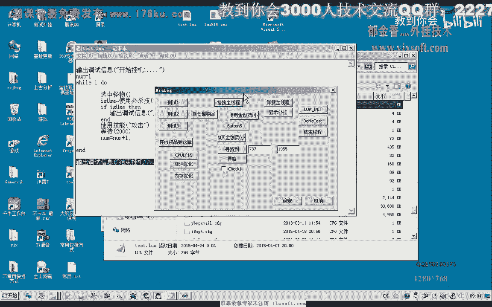
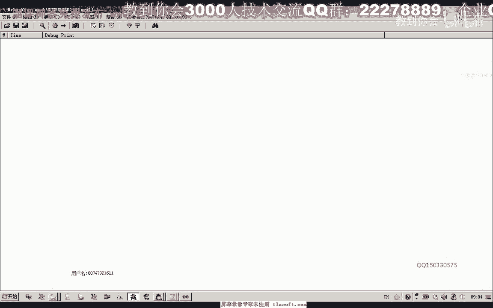
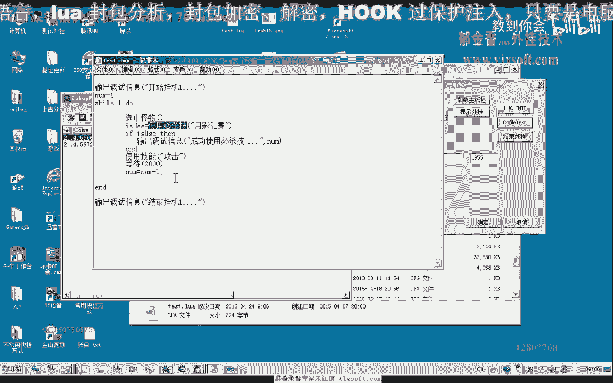
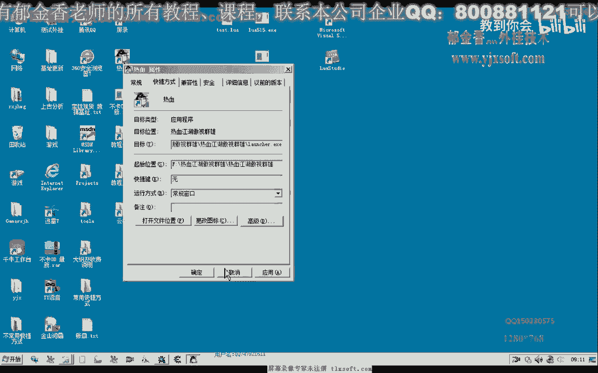
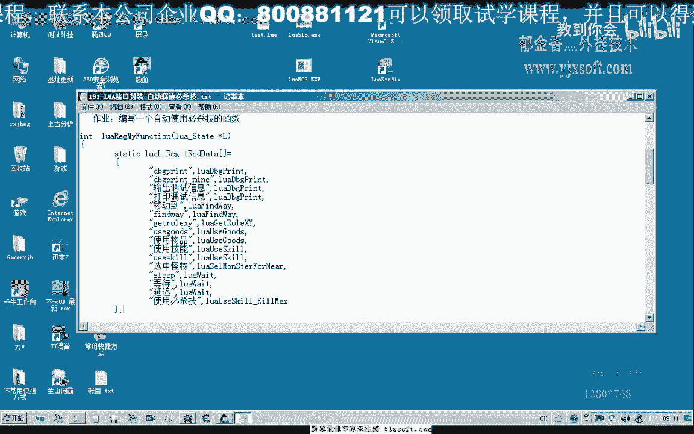

# P178：191-LUA接口封装-自动释放必杀技 - 教到你会 - BV1DS4y1n7qF

大家好，我是俞其鏘老師，這一節課我們一起來工裝自動四方必殺技的函數，首先我們打開190克的代碼。

然後我們展開腳本單元，那麼我們在這裡需要做一些準備，那麼我們上一節課我們編寫了一個自動四方必殺技的這樣的一個函數，那麼這一節課我們主要是封裝一個接口，然後來做一個測試。

那麼首先我們在同文件裡面添加腳本的接口，然後在我們的cpp文件裡面添加我們相應的代碼，那麼我們在這裡需要做一些準備，然後我們在這裡需要做一些準備，那麼在前面我們還需要另外的使用一個功能函數。

在這裡封裝一個簡單的在功能函數的模塊，那麼這個函數我們主要就是通過判斷的一個，先獲取一個當前選中怪物的一個必殺技的一個狀態，那麼如果它狀態可用的話，那麼我們就使用必殺技，然後來返回一個相應的一個數值。

那麼我們現在來看一下這個狀態吧，好的，我們再來看一下我們封裝的代碼的邏輯，那麼首先我們是取得當前選中怪物的信息，然後我們判斷這個怪物是否可以使用必殺技，那麼如果可以使用的話，我們就調用相應的技能。

把必殺技的名字傳進去，這是必殺技的名字，那麼如果使用成功，那麼返回一個真實，好，那麼這裡封裝了這個函數之後，我們接著來看一下我們這個路網接口的函數的封裝，那麼首先它會使用腳本的時候。

它會以這樣的形式來調用，比如說使用必殺技，某一個必殺技的名字，那麼使用之後的話，在這裡的我們就需要來取得它參數的個數，那麼如果參數的沒有傳遞參數進來，那麼在這裡我們就直接就返回一個假，假是吧。

只返回一個參數，那麼如果是另外的情況，我們就取得必殺技的名字，然後在這裡我們調用使用必殺技的功能函數，那麼如果是使用不成功，也就是說或者是沒有選中怪物，或者是怪物沒有達到使用的要求，它沒有提示。

沒有發光，那麼我們就在這裡來返回一個Fans，那麼另外一種情況我們就肯定就是使用成功了，那麼我們返回一個真實，然後這個函數寫好之後，我們在前面這個地方註冊一下，好，然後我們編譯生成，那麼這樣的話。

理論上我們就能夠自動的進行判斷，我們大部分功能都在C++裏面來實行，當然我們也可以有另外的一種方式，把我們的這些條件暴露出去，那麼我們直接來就調用技能使用的函數來調用它。

比如說我們把相應的條件判斷的這些條件的數據暴露給我們的路亞接口註冊成，然後我們在腳本裏面判斷，然後調用我們的技能庫，那麼這也是可以的，那麼但是我們如果是腳本是給一般人使用的話。

我們建議把腳本設計的簡單一點，邏輯部分全部在C++裏面來實現可能要好一些，當然我們現在是為了做一個交流，就是說討論一下這個路亞的這些功能，邏輯的主要是為了探討學習，好的，我們來看一下，那麼註冊好了之後。

接下來我們就進行測試，比如說我們寫了這樣的一個循環，那麼這裡比如說等待兩秒鐘的時間，或者是一秒鐘的時間，這樣可能好一些，那麼我們或者就在上一節課的腳本上面進行一些更改，然後來做一個調試。

那麼這個循環的話肯定也就是我們在路亞腳本裏面來實現的一個自動打怪，但是它有一個弱點，也就是什麽，就是不能夠控制它，暫時不能夠控制它什麽時候結束這個循環，當然這個疑問我們就成是作為一個作例。

大家下去思考一下，那麼我們現在做一下測試。

然後我們到我們的腳本裏面開始進入，那麼在這裏進行一個修改，那麼修改了就是增加一個使用必殺技的這樣的一個功能，那麼首先我們選中怪物之後，我們就首先來判斷一下是否需要使用必殺技。

那麼我們還可以來給它定一個變量，那麼是否成功的使用了必殺技，以下是翼手我們體驗結果，(遊戲畫面)，(遊戲畫面)，(遊戲畫面)，(遊戲畫面)，(遊戲畫面)，(遊戲畫面)，(遊戲畫面)，(遊戲畫面)。

(遊戲畫面)，(遊戲畫面)，當然這段代碼，因為我們現在還沒有跟它設置一個，循環結束的條件，理論上，這段代碼暫時不會被執行到，好的，我們來測試一下我們的腳本有沒有問題，(遊戲畫面)。

從這裡來看的話。

它應當是被執行，但是由於周圍沒有怪物，所以說它沒有，選中怪物，沒有進行打怪，那麼我們找到一個地方，(遊戲畫面)，那麼而且從這裡來看的話，可能我們的，這個腳本，還有一些問題，那麼只是我們執行到。

開始掛機這個地方，但是後邊這裡的話，好像是沒有被執行的，我們可以在這個地方，找到一個地方，(遊戲畫面)，(遊戲畫面)，(遊戲畫面)。

我們來看一下註冊時候的名字，使用B12級，那麼在這個地方，我們增加一個，調試信息的，判斷，(遊戲畫面)，好的我們退出來之後呢，重新，生成一下，(遊戲畫面)，然後再次呢，嘗試，掛機主線程，初始化。

然後讀份，那麼我們看一下有沒有，這個時候好像自動的在，這個時候，自動的在執行，這個時候成功的使用了，一次必殺技，只要怪物的狀態，顯示了就自動的使用了一次，(遊戲畫面)，這個時候我們可以看出來。

它是成功的，使用了必殺技的，當然剛剛才已經把這個，腳本的結束退出了，好的我們來看一下，調試信息，那麼每次它都會，自動的進入我們的，User Skill，自動的使用，必殺技的這個Core裡面。

然後在這裡呢，我們的這個，怪物的，必殺技的狀態呢，它就是有了這個狀態之後呢，使用了一次我們的，必殺技，那麼而且這裡它顯示出了，是在多少次的時候，也就是一個技術，在我們這個，Lua Testbook裡面。

那麼因為它每次會+1，開始掛機，但是沒有，執行到這個，因為這個現成的是被，直接的結束掉了，那麼所以說後邊的這一段代碼，它實際上不會被，執行到 但是這種設計的話，不是很好，那麼所以說我們在這裡來給。

大家一個助力 也就是說，那麼我們怎麼樣來控制，我們Syjia那邊，怎麼樣來控制，這一個循環的，退出 或者說，怎麼給它一個條件，讓它知道我們，需要退出這個現成，需要退出這個循環，好的 那麼我們下一節。

再接著來討論這一類的問題，那麼這一節，我們暫時就到這裡，(音樂)，(音樂)，(音樂)，(音樂)，(音樂)，(音樂)，(音樂)，您bling bling 你bling bling，和您的愿望。

祝愿对藍莓还有大家 过愉快的一年。

愿意 过愉快的一年，祝愿我们的家人 共同渲满，因此希望，祝愿我们的家人 共同渲满，人们选择的良圣的幸福。

祝愿我们的家人 共同享业，祝愿我们的家人 共同享业。

為民主，立法也。