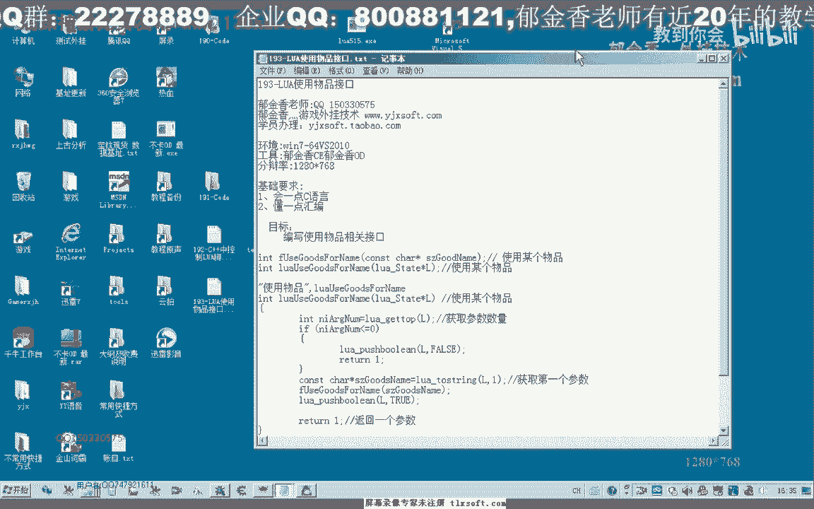
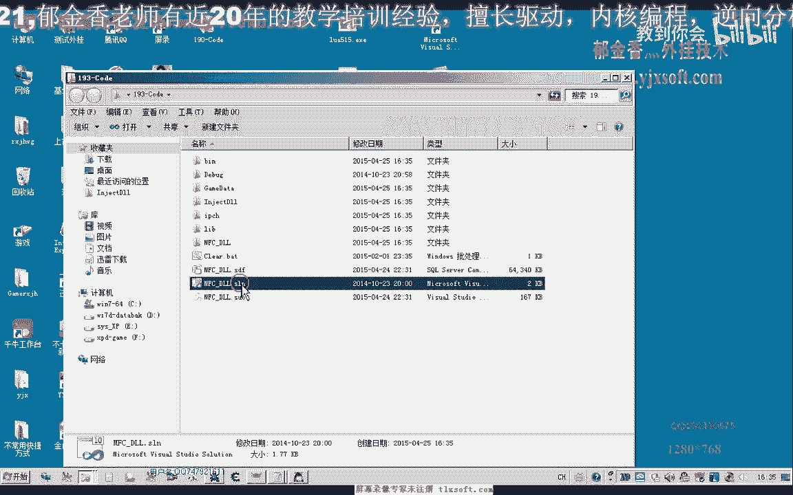
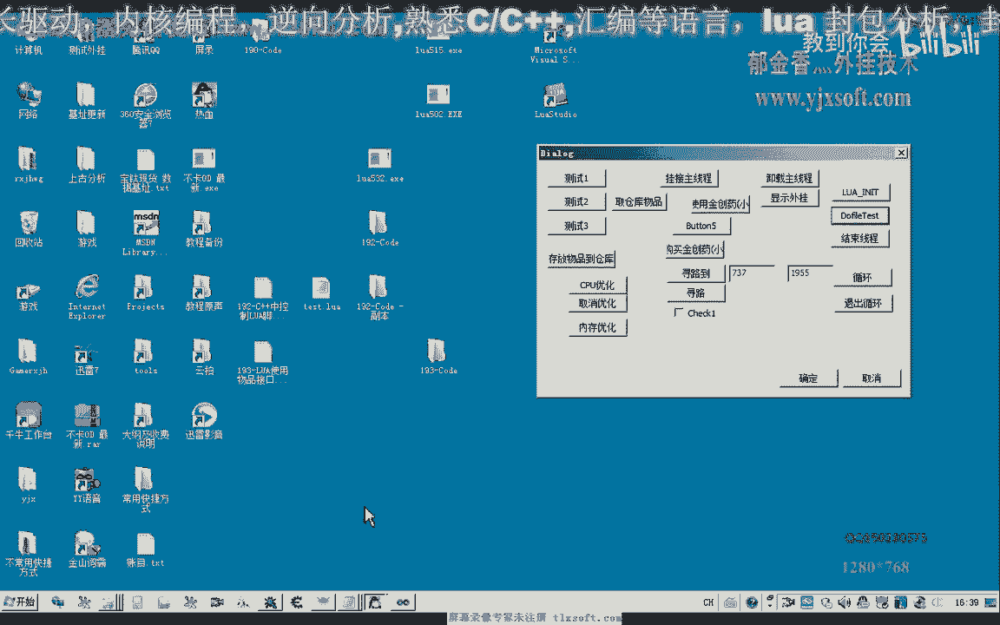
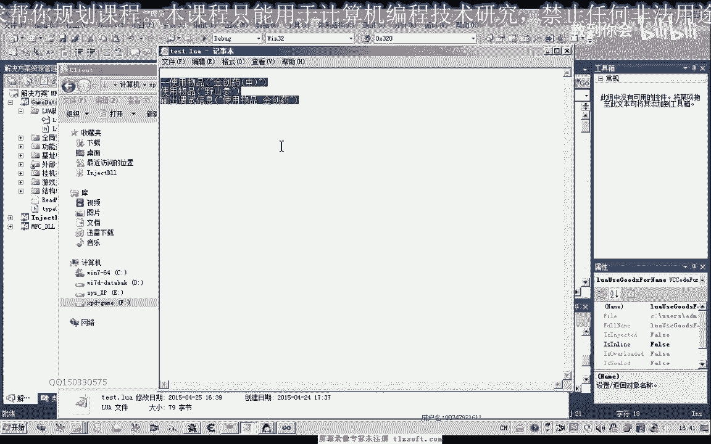

# 郁金香老师C／C++纯干货 - P179：193-封装LUA使用物品的接口 - 教到你会 - BV1DS4y1n7qF

大家好，我是郁金香老师，这一节课我们一起来编写物品使用的接口。

首先我们打开192克的代码。

然后展开我们的lua脚本单元，在这里呢我们添加相应的接口，因为在之前的话我们已经有一个使用物品的函数啊，在功能封装的单元，那么在这里呢我们直接添加相应的接口就可以。

那么首先呢我们在这里呢呃判断我们传进来的参数的数量，然后如果这个数量小于厘米，就是没有传递参数进来的话，那么我们在这里呢就退出啊，那么如果有参数传进来，我们先取得这个参数呃，当然也可以做一下判断。

看它是否是我们的这个字符串类型的嗯，那么在这里呢我们把它转换成我们的字串啊，直接转换啊，然后来调用我们的物品使用的这个功能，那么调用成功之后呢，我们给它返回一个增值啊，如果这里没有传递参数呢。

我们给它啊，我一个呃vs，那么简单的话就是这样啊，然后呢我们需要在这个region reaction这里来添加我们的注册接口，那么这样的话我们就编写好了一个相应的使用物品的一个接口。

那么接下来呢我们就可以进行相应的测试。

那么首先我们转到游戏所在的这个单元啊。

它的这个路径，然后呢在这里呢我们修改和motxt，那么在这里呢我们调用，比如说我们要使用这个金疮药这一个物品，那么我们就在这里来写入相应的这个脚本，然后呢我们做一下测试，跨界主线程啊。

初始化to file，那么这个时候我们看到就能够使用我们相应的这个物品，那么比如说这个野山参啊，在这里呢我们也可以改一下啊，嗯嗯嗯嗯嗯。

然后我们再调用我们的脚本啊，那么每调用一次来，这个时候呢我们就会啊使用一次这个野山参啊，那么实际上很简单。

因为我们之前呢已经把这个相应的接口函数了，已经封装好了，那么这里呢我们只需要给它呃转换一下我们的参数，然后呢嗯把我们的路网脚本里面的这个参数呢把它转换过来，然后调用一下我们的功能函数，那么就可以了。

那么其他的功能函数呢我们都可以用类似的方法来完成，那么但是呢这里另外的一个问题，那么也就是说我们在编写脚本的时候啊，比如说我们在这个写脚本的时候，肯定我们不可能说每一次循环打了怪之后呢。

我们就使用一次这个物品，那么我们需要给它加一个条件，在什么样的情况下才使用这个物品，比如说我们的呃使用金疮药的时候，那么我们的这个呃当我们的hp这个选值低于某个数字。

那么或者是当我们的这个嗯它所占的这个百分比啊，hp也就是它的由我们最大血量的这个百分比低于多少的时候，我们在使用某一个物品，那么我们使用这个野山参的时候呢，我们可能也要做一些判断。

判断了我们的这个当前的呃mp啊，也就是这个蓝的这个数值低于某一个数值，或者是低于某一个百分比的时候呢，呃我们才使用，那么这个的话我们呢嗯可以了。

把另外的函数或者是把本身我们人物角色的这个数据来把它套出来啊，让我们的这个脚本呢呃来访问这些相关的数值，那么这样的话我们的脚本呢将更加的灵活啊，当然这个是针对了比较专业的这个人员呢。

我们才提供这么多的这个数据啊，啊套出到我们的这个la脚本里面，那么如果如果是一般的情况呢。

我们只需要呃把我们这些功能集成在我们的这个函数里边，比如说在这里边我们就给它添加了这个相应的条件啊，但是这样的灵活性没有这么大啊，嗯那么我们下一节课呢再一起来探讨一下啊。

怎么来套出我们人物角色的这些状态啊，比如说我们的h p m p这些数字啊，呃那么这节课呢我们就就到这里。

