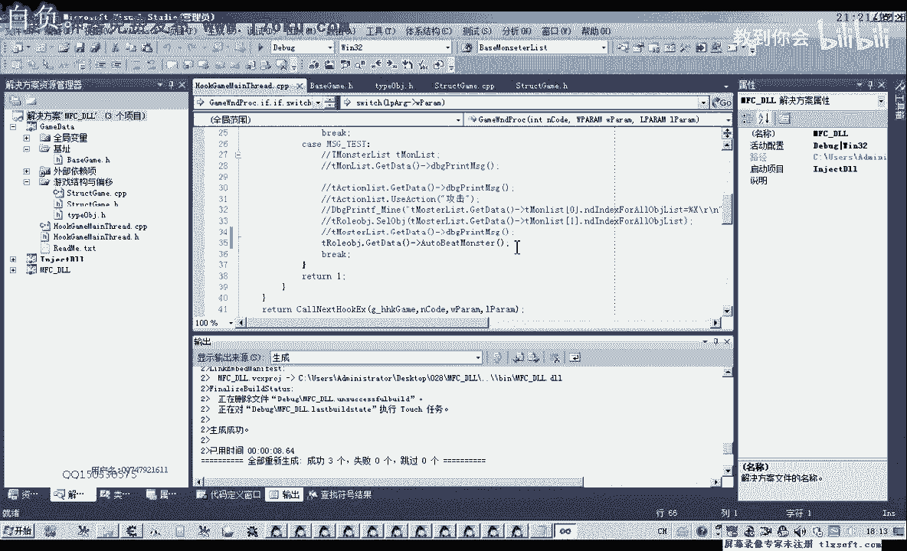
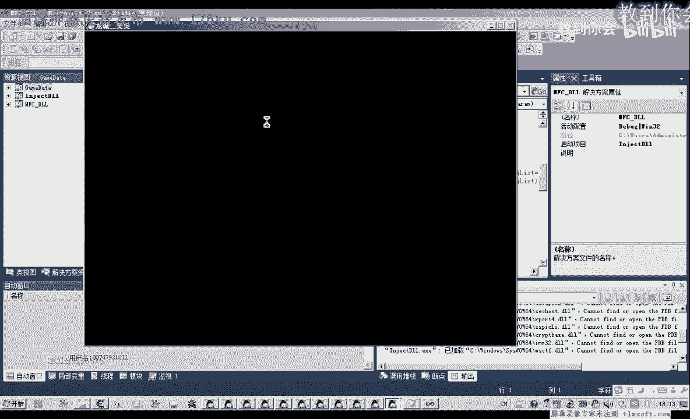
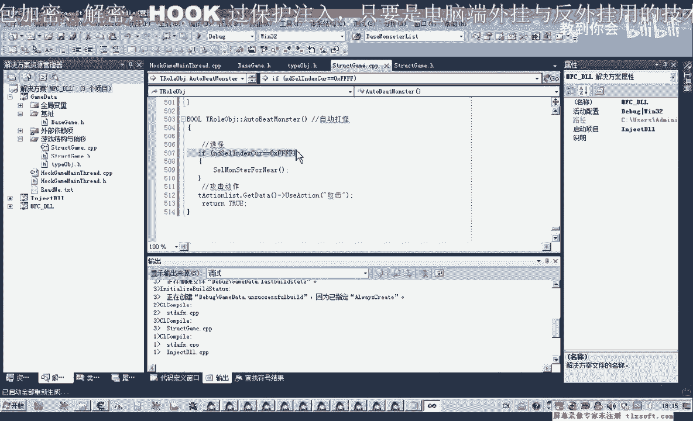

# 郁金香老师C／C++纯干货 - P17：028-封装选怪打怪功能 - 教到你会 - BV1DS4y1n7qF

大家好，我是郁金香老师，qq 1533057，欢迎大家参加滤镜像技术编程的区，那么这节课呢我们对函数和自动选贵的这个函数来进行封装，那么之前呢我们只封装了一个啊，根据他的这个下标来选中相应的一个对象。

那么这节课呢我们另外再封装一个函数，专门用来选中怪物的，而且是选中我们的呃，静观啊，这里呢我们附加参数软件，让它自动的选择一个附近的怪物，离得比较近的，好了，那么我们打开之前27克的代码。

那么这个函数封装好之后的话，我们再加上一个攻击动作，就可以实现自动挂机打怪了。

然后我们先一到这个结构单元，在我们的属性里面啊，呃角色的这个结构里面的添加相应的函数，那么这个呢就是选怪啊，尽管比较近的怪物，啊，嗯哼哼，那么在原文件里面我们遇到最后，嗯。

那么在这里的话我们需要进行两个步骤，一个是偏离整个包含了怪物的一个内容，那么实际上这个怪物列表的话，它也包含了我们的玩家对象，它实际上是一个对象附近的一个对象列表。

那么我们叫他怪物列表的话可能不是很恰当的，那么偏离之后呢，我们要做判断，首先我们要判断是不是怪物，那么是怪物的话啊，才继续，那么如果是怪物的话，我们就判断它的距离，判断距离，那么距离啊选最近距离的。

那么选最近近距离的这个怪物的话，我们就可以调用之前的这个函数，选中对象，那么要经历这几个过程，那么首先呢我们建立起的全局变量，那么第一个全局变量呢它用来存放我们的下标，相应的我们找到。

那么第二个呢我们用来存放的是它的一个去年，都对它进行一下初始化，首先我们把这个距离呢so die，这个下边也行啊，所以那么首先我们判定整个列表，听到这个，那么在偏离这个列表之前呢。

我们先把这个怪物列表的名称给它改一下，因为它这个它不是一个纯粹的怪物列表，它里面呢还包含了其他的对象，在我们之前的测试里面，那么我们就改这里边的一个数据，在获取这个数据的时候，这题这题初始化的时候。

我们把它数据给它过滤一下，这里有一个21，那么这里他执行下一次之后的话，我们还有一个问题就是什么呢，如果这里我们继续下一次循环之后呢，它相应的单元啊，就是问题就没有写入这个数据，这里已经有这个判断了吧。

这个判断等于2g那么这个2g呢我们最好是另外再添加一个新的项，用来定义我们这些对象的一个类型，当然还有一个玩家的类型，其他我们也发现几个被包啊，动作的这些对象的类型，暂时我们用网上的网口进入。

这个13样之前有过分析，那么这里我们就可以改一下，这里我们包含这个相应的零件进，外部的这里类型判断了之后呢，我们还应该有一点看一下这个下标，我们还要还是从这个数组一这里来开始给它添加啊。

这样我们方便判断，那么我们就需要另外还有一个下标，下标这个下面呢我们来表示的是，我们这个对象列表里面看，这里取的是怪物列表，那么我们这个人呢我们需要改一下，那么这个就不是怪物猎人呃。

这个是我们的附近的对象内容，但是没有，我这辈子听不听话，那么替换了之后呢，我们另外再给它准备一个下标接，在这之前我们给它定义一个变量问题，已经借这个来用来计数。

啊这个用的技术用来给这个我们自己的数据进行一个技术，或者我们这样改要容易一些啊，这里改成intel，这里改成int j，那么这里我们只需要改这一个地方就行了，偏离我们附近的一个列表。

那么这个i的这个下标尺呢，它要执行到在后面呢，我们嗯才给它加一这个i才加成，这样改看一下，逻辑上，这是你啊，它跟相应的这个我们的怪物列表了，初始化之后呢，再让它的坐标呢进行加一，那这里的话看一下角色的。

回去再去，编译一下，那么这个j呢它是什么呢，j这里是附近各项数据是，啊这个写好了之后，我们移到最后嗯这里呢我们对它进行相应的一个判断，那么这里因为他之前呢已经有判断了，在那个怪物列表。

那么所以说我们用不着新的判断，首先我们看一下t master，good time，那么这里呢我们需要做一个判断，判断这个数组里面它是否有东西，对了我们要它，它还有一个我们还需要添加一个属性。

也就是它的下标文这一段这个调到一个下面，再看一下请你出什么关系，下调c前面的初始方法，那么我们要先判断一下这个单元呢它是否为零，它的这个数组里面的数据呢是否合理，初始化了，如果他是初始化的话。

我们就不用去学它，就不用取这个值，如果这个数值等于零的话，那么我们继续下一次循环，好，那么下面呢我们先来判断一下它的一个缺点，好在前面阶段呢复制一下，那么取出它距离的一个属性。

那么判断这个距离它是否要小于我们的这个n distance，如果是小于这个距离的话，那么我们就把这个小的这个距离呢写到它就可以了，那么这里面就存放最小的一个距离，并且呢我们这个n n d这个下标啊。

它也存放我们就是最小距离的这个怪物的一个下标，那么在这里呢取出来相应的一个下标尺，蓝处理下表，好那么经过这前面整个循环之后的话，这样不停的比较，那么最终剩下来的话，这个距离呢它就是最小的一个距离。

而这个下标的话就是距离我们最近的那个怪物的id啊，是它的一个下标，那么它取出来了之后啊，嗯这里呢我们就不用判断是否是怪物了，因为在我们之前的初始化当中，它已经有相应的判断。

那么最后呢我们就是执行相应的选中set option，然后呢我们选中达就可以，好然后再编译一下，那么最后这里呢实际上我们还应该要做一个判断，如果它整个这个列表都偏离完了之后啊，如果我们把这个nd啊。

这个下标的值它还没有改变的话，还是等这个0x f f的，那么我们就就相当于是这个选中失败了，我们还需要加上一个题，如果这个值等于这个连x f x的话，那么这里呢我们就返回，但是就调用就相当于失败。

就没有实现损坏的这样一个功能，哈哈哈哈哈，这个我们加错物质，那么加在这个位置，然后再编一下，然后那么选贵的部分，那么我们完成了，那么选贵的部分完成了，接下来我们就调用了它的一个攻击的一个动作啊。

就可以封装成我们这个打怪了啊，自动打怪，那么这里呢我们就做一个自动打怪的一个函数，还是特别，那，么自动打怪呢我们也要经历两个步骤啊，第一呢我们就是要选怪，要自动的一个悬挂。

然后呢我们再调用我们的攻击动作啊，这两个当然选会的话，之前我们空中的这个函数的话就可以实现，但是呢我们也要有一个条件，如果当前的怪物我们还没有把它解决掉的话，我们就去选另外的怪物的话。

这个时候呢也显得很不效率，那么所以说我们还要做一个判断判断就是当前的怪物太适合了，已经被我们就是说判断我们当前没有选中和怪物，那么我们在执行我们的攻击动作，那么在这里呢我们加上一个判断。

那么当前选中的看有没有车，md就是我们这一代属性的玩家选中的，那么这个属性我们取出来之后呢，我们再需要取出它的一个对象，取出来要做一下判断，因为有的时候呢我们可能是选中了自己，也可能选中了其他的玩家。

那么我们选取出当前选中的i t取出，这里我们这个下边我们给他改一下当前这个数字，我们看这个数字有没有初始化，这个数值是初始化的，看在这个在这里在这里我们有读出它，那么我们还需要取这个当前对象的呃。

它的一个类型，我们需要把它取出来，那么如果我们是做一个简单的，我们先做一个简单的判断，然后我们再来完善它，这里我们可以直接这样写，我是说一个简单的判断题，只要这个数值呢它不等于。

如果说它是等于我们的0x f f的话，那么我们才进行一个选换，如果就是怪物被打掉之后呢，他会自动的对这个选中的id来进行一个清零，相当于啊这里呢它会附上这个-1这个数字啊，嗯冲自己的也就是连x f f。

那么如果是这种情况的话，那么我们再进行一个选怪，那么这里选择了我们前面啊，好那么选过之后呢，我们再执行一个相关的动作就行了，这music风气，那么这样的话我们基本上就可以实现一个自动的卡怪。

这个选过这里呢，我们还没有进行更精确的一个判断，那么只有当这种情况下，只有他没有选中我们自己的时候才有效，那么因为我们选中自己的话，这样攻击自己肯定是不正确的，那么先还是来做一下相应的一个测试。

把这个自动档位的函数呢我们添加到测试的代码里面，自动打破它，当然这个不是真正意义上的自动打怪，只是说每次啊呃点击这个按钮呢，它会去选择一个，如果是当前没有选中怪物了。

还会去选中一个怪物，然后去攻击它，那么如果要实现真正意义上的自动打怪啊。

我们还需要嗯加一个定时器或者是一个线程来不断的调用，这个时候呢他们没有错，因为我们选用的是自己，这个时候，啊这个时候呢他可以选，因为就是刚才我们说还要加另外一个判断的话。

就是要判断他当前选中的是否是怪物，这个时候他就可以了，好那我们测试测试是成功的，那么具体要完善的一点呢，就是前面我们这个判断呢，我们还要判断他是否是否选中了玩家，或者是选中了我们自己这一类的。

这里这个选怪的判断，我们需要嗯再细致一些，再细致一些，当然这里不加上这个判断，实际上他也可以选，但是呢他会不断的换怪，当当前怪物还没倒，还没有，就是说把它解决掉的时候呢，它又会继续其他的这个怪物。

那么这个判断呢我们在下一节课再来完善，再分钟啊，关于这个选怪的一个判断，好的，那么这节课我们就讲到这里下。

