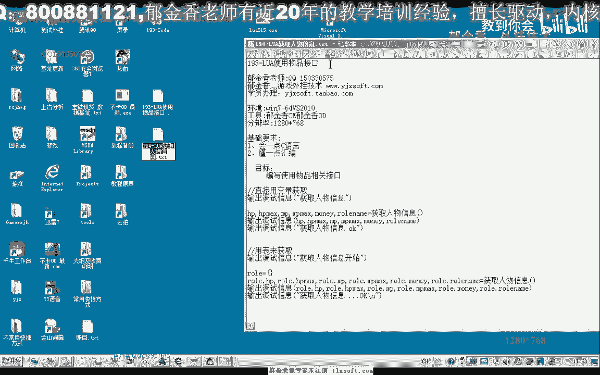
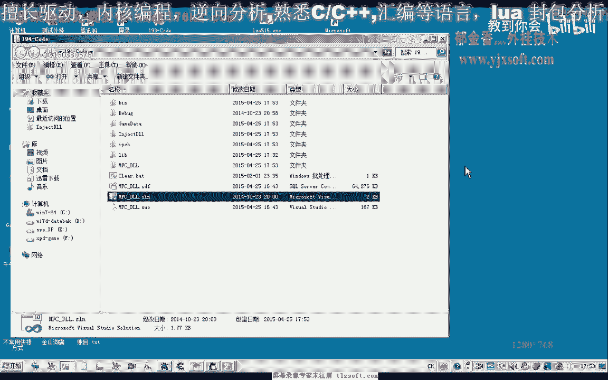
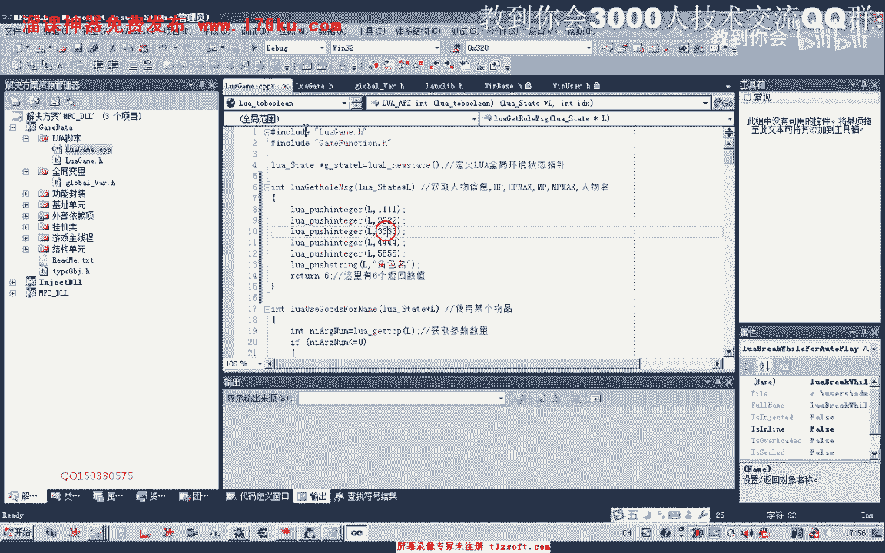
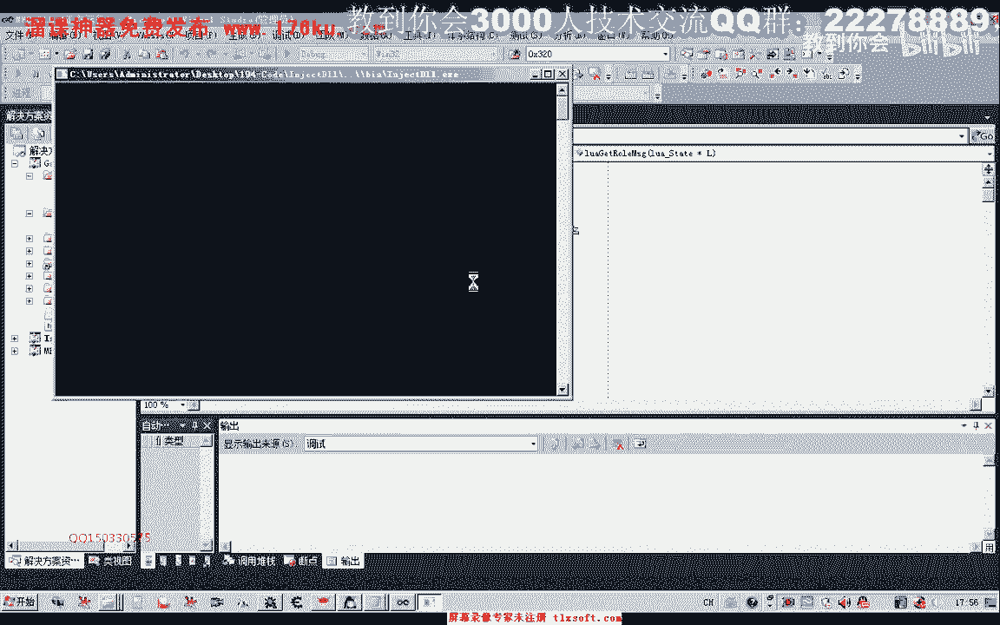
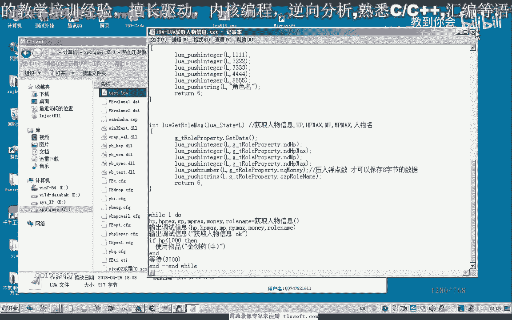

# 郁金香老师C／C++纯干货 - P180：194-LUA获取人物信息 - 教到你会 - BV1DS4y1n7qF

大家好。

我是郁金香老师，那么这节课呢我们来探讨一下，怎么在路网脚本里面获取我们c加加里面的，或者是嗯游戏里边的这个人物的信息。

那么首先我们打开100，93克的代码。

我们在全局变量单元里面呢，我们有一个什么属性的这个全局变量，那么这个变量里边呢，呃这个结构变量里面呢就包含有我们人物的这个属性，那么我们直接在脚本单元里面啊，封装一个这样的函数。

获取我们人物信息的这样一个函数，然后我们在cp p单元添加如下的代码，我们先做一下测试，那么这就是我们返回的一些数据啊，你空了有六个返回值，这里，那么这里返回数值之后，我们需要注册一下，获取人物信息。

获取人物信息，然后注册我们的函数，当然这里呢是先做一下测试啊，那么这里我们套出了这个函数之后呢，我们就可以来编写相应的代码来获取我们的这个信息，那么简单的这个脚本的话，我们可以写成这样的形式啊。

比如说这一行，那么我们这里呢因为返回了返回了六个参数，那么在这里接收我们这个相应的返回数值的时候呢，这里呢也需要六个参数啊，比如说a b c d e f6 个参数就可以了，好的我们把这一段调试信息。

那脚本呢写到我们的游戏所在目录。

然后我们保存一下。

然后化解主线成初始化，我们执行我们的代码，这个时候我们执行代码的时候，我们可以看到了呃，可能是某个地方我们写错了啊，他们造成它没有相应的这个信息的输出，获取人物信息，我们看，这个注册的名字对不对。

获取人物信息，然后我们再重新编译生成一下，1234，456个，初始化我们再来看一下吧，这个时候我们就能够输出我们相关的信息了，呃那么这里接收到的这个信息呢，我们这里从脚本里面可以看到。

那么输出的调试信息呢，分别就是我们的对应的几个参数，123456啊，包括这个角色率，它也就分别的存存放在这几个变量里边，那么在这里的话我们就可以替换为我们的人物的这个相应的属性值。

那么比如说我们也是同样的返回六个数值，那么我们返回的是把这个代码进行一下替换，那么在这里呢我们先初始化，这用个体代替呢初始化我们的人物信息，然后呢返回我们的当前的hp，hp的最大数值m p啊。

还有我们的嗯，这里呢应该是mp魔力的这个相应的数值，下面是金钱啊，以及我们人物的名字，那么注意金钱这一项呢，我们要用number，为什么要用number来，因为这一项的话，我们是八字节的。

那么如果我们不用这个number这个类型的话，我们就当这个钱的数额巨大的时候呢，那么我们就显示不完全，因为它的这个number的话在里边呢，实际上它是定义的double的这个类型，恰出来也是八个字节。

那么所以说只有了啊，不能够用我们的这个樱桃卫星，如果用我们的这个int类型的话，那么它传送信息进去的数据呢就是罗网银头，那么只有四个字节啊，这个路英雄呢只有四个字节，啊这里是w64 的，如果是六四的话。

也也可以直接用这个也是可以的，当时没有注意，那么直接不行，可应当也是可以的，它的这个整形的话是64位的，好像是好的，那么我们继续测试，那么首先呢我们挂机主线程啊，初始化啊，测试一下。

那么这个时候呢我们可以看到最后一个呢是人物的名字，那么这个3294呃，这个就是人物的金钱的数量，那么前面呢这里是当前血量的，当前血量，血量的上限378是我们的相应的这个p的这个数值，我们来对照一下。

对不对，那么我们这里能够看到3229496429了，这个就是我们金钱的数量，那么前面这个10071007，分别是当前局血量和当前的这个呃mp以及mp的这个上限。

那么所以说这样的话我们就能够得到这个相应的信息，那么有了这些信息之后呢，我们上一节课的这个问题呢就可以解决了啊，你们就可以在编写脚本的时候呢，我们可以先获取我们的人物信息，然后呢我们可以的做一个假设啊。

这个时候hp小于1000的时候呢，我们就可以使用，那么我们就可以这个时候就有相应的条件呢可以判断啊，然后我们还可以循环的判断，嗯那么循环的判断呢，这里呢我们可以来等待，比如说三比如说三秒的时间。

那么我们每三秒钟呢，我们就检测一下它的血量，那么如果这个血血量小于1000的时候呢，那么呢我们就给它补充这个金疮药中哈，那么我们可以运行一下这一段代码，是吧，那么这个时候的话。

比如说有有有这个怪物在攻击我们的时候，我们的血量减少之后呢，它就会自动的给我们补充相应的这个血量好，那么这个时候呢就会自动地使用这个金疮药好的，那么这节课我们就讲到这里，那么我们下一节课呢啊再见。

