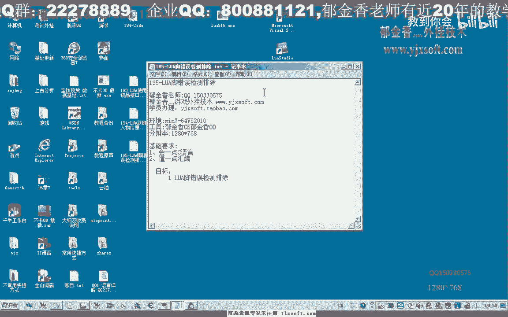
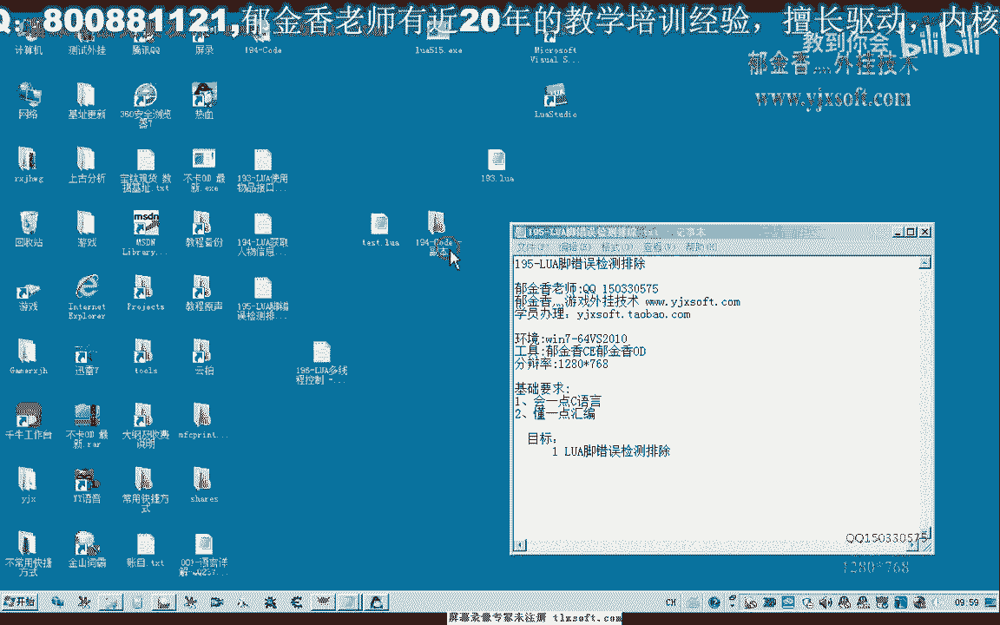
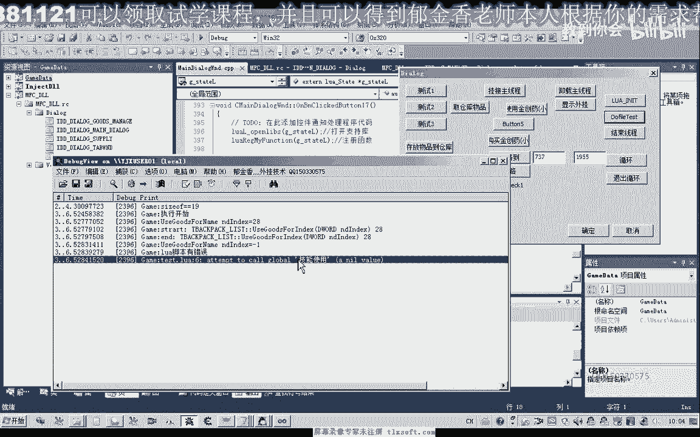
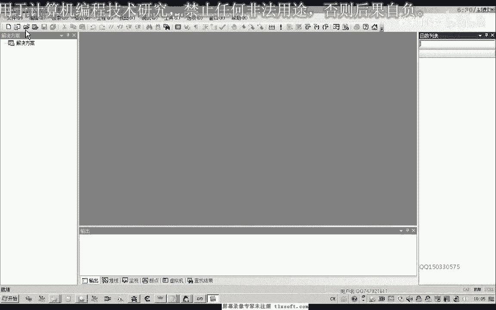
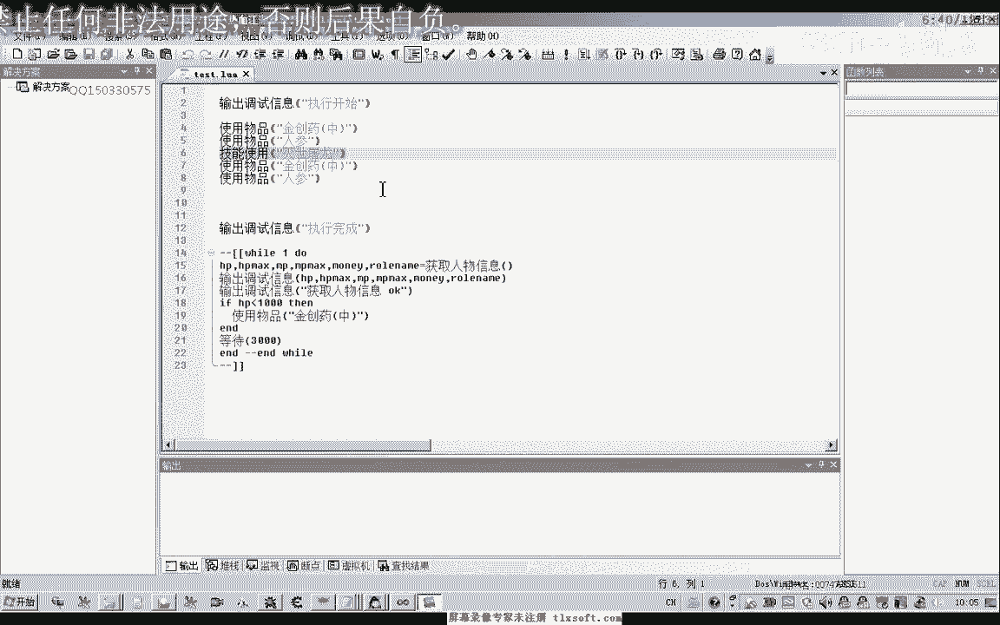
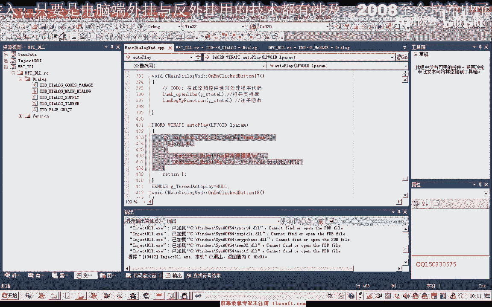

# 郁金香老师C／C++纯干货 - P181：195-LUA脚错误检测排除 - 教到你会 - BV1DS4y1n7qF

大家好，我是郁金香老师，这节课我们一起来探讨一下怎么排除lua脚本当中的错误。

那么首先呢我们打开194克的代码。

如果这个时候我们在这一段路啊，脚本里面哈，我们使用了一个错误的命令啊，或者是我们嗯其他的一些呃运行上的错误，比如说这个技能使用这个如果的函数的话，我们没有注册啊，如果我们去调用它。

随便我们用一个相应的技能，比如说蔑视土龙这个，120，嘟嘟嘟嘟哒哒哒，接下来我们执行一下这段代码，那么如果我们是正常的执行完成的话，应当会执行到这个位置，那么我们看到啊执行到这个执行开始之后呢。

在后面呢我们就不能够确定呃某一个地方出现了问题，那么很多时候呢我们也啊光用我们的眼睛来看的话，很难找出呃这个错误的地方，而且我们当我们写的这个脚本越来越庞大的时候呢，那么我们这种检测错误的话啊。

更加的困难，要要排除这种错误，那么所以说这节课呢我们呃就探讨一下呃，怎么来检测它的某一行出现了这个错误，那么实际上呢这个do file我们这里呢是执行的这个do file。

那么do file呢它本身有一个返回的一个数值，那么如果他的这个返回数值不为零的话，那么就证明它出现了相应的错误，我们可以呃加上这个相应的检测啊，对这个do file哎。

那么我们对它的返回值来做一个判断啊，如果这个返回值不为零的话，这个时候肯定就是不错的，但是光检测到这个错误是不行的啊，我们还需要来定位出这个出错的一些信息，因为在lua里面呢。

它这些数据呢都是用它的一个呃，相当于是在我们这个环境的一个堆栈来进行这些数据数据的传送啊，我们可以呢直接的打印出它相关的突破信息啊，那么出错信息呢它是一个字串类型的啊，在我们的堆栈的一个顶部，好的。

我们再次重新编译生成，这个时候我们再一次呢呃注册我们的lua脚本，然后呢再do file，那么这个时候的话他会有一段信息，test挺多啊，六啊呃一个全局的变量啊，既能使用，那么是一个空的一个指针。

一个参数，那么就说明的话是这个技能使用这一项啊，这个函数或者是这个变量呢它没有注册啊，他找不到，那么出错的地方呢是在我们的第六行。

我们来看一下第六行，1234，零六啊，他说的是第六行，1234对吧，基本使用哈，恰好就是这一行，因为这个空的行业来说算上哈，那么最好是我们能有一个编辑就带行号的一个工具。

比如说我们的这个诺studio啊。

这个这一类的，我们把它放进去就能够看到这里呢是第六行，也就是这个指令码出错了。

而且它这里呢也会显示出相应的调试信息，是基本使用嗯，这个变量的没有注册，那么还有另外一种情况也会出错啊，呃比如说我们重新注册一下啊，重新进去，那么如果我们在没有初始化的时候。

也就是没有注册这个nova脚本的时候，我们就开始执行，那么的话他从第二行开始呢就会出错，然后呢就会终止掉整个脚本的一个执行，因为这个时候我们的呃输出调试信息，这个函数呢它也是没有注册的。

所以说我们必须要经过初始化啊，然后呢我们再执行我们的代码啊，那么这个时候呢我们某一个没有注册呢，它就会显示某一个呃某一行的一个出错的一个信息，好我们再来看一下我们的代码。

那么这个时候我们可以找到相应的这一行，把它改正正确啊，这里呢应该是使用技能或者是这一行呢，那把它取消掉也可以，那么这个时候我们看一下哈，把错误纠正好之后呢，它自动了就完成，就能够顺利的完成度快，那。

老公，我们看一下选中怪物这个，这个函数也没有出错，然，劣势屠龙，我们再来看一下这个技能也没有认错，烈士屠龙，好像是这个时候是释放技能没有成功啊啊没有挂机到主线程，应该是嗯嗯，好的，其他的都应该是没有。

这个没有问题，选择怪物，这里好像有一些问题，那么这里呢我们应当传送的这里应该是一个空的函数，表示了属地的选中一个怪物，好的，这个时候呢是参数和传递错误，那么像这种错误的话，我们呢它是检测不到的。

因为他只是把这个当成是一个怪物名，因为这个怪物名不存在，那么所以说就不会真的选中，所以说它只能够我们的这个do fire的这个返回值的话，它只能够返回我们的一个嗯语法上的一个错误，好的。

那么这一节课呢我们就讨论到这里。

