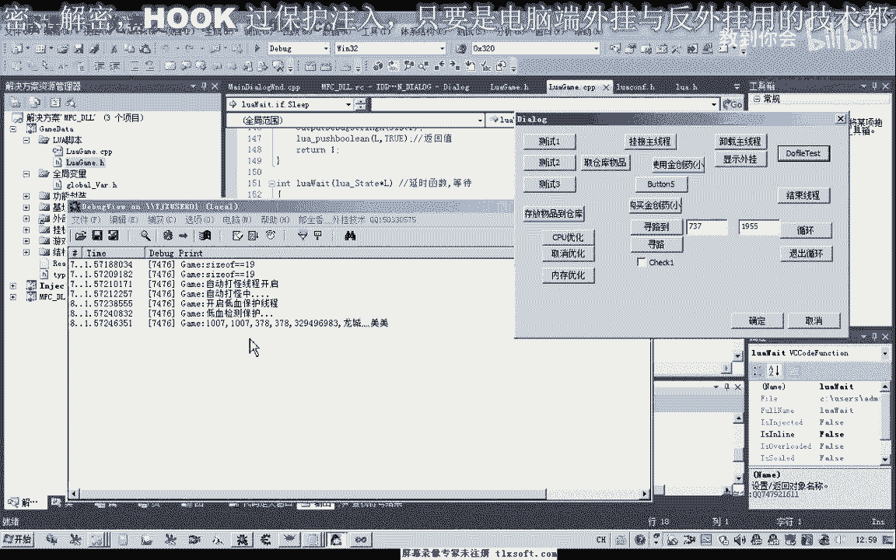

# 郁金香老师C／C++纯干货 - P182：196-LUA多线程控制 - 教到你会 - BV1DS4y1n7qF

大家好。

我是郁金香老師，這一節跟我們一起來討論一下，怎麼在Lua裏面控制我們的多線程。

首先我們打開190克的代碼。

我們做一個假設。

假設我們現在有兩個Lua的腳本，那麼一個腳本是用來循環執行打怪的，那麼另外一個腳本是用來檢測，我們的血量的，然後相當於是自動補血的一個功能，但是這兩個功能的話，放在一個循環裏面的話，我們就不是很好控制。

因為我們檢測血量的等待的時間的話，它可能不一樣，而且條件的話，當然實際上也是可以寫在一個線程裏面，但是我們這樣的設計的話，我們分開寫成兩個線程的話，那麼這樣會更好一些，那麼比如說我們要停止打怪。

或者是退出打怪的時候，我們要讓我們的低血保護和線程繼續作用的話，那麼我們這樣設計是很方便的，把它分開，好的，那麼我們來看一下，怎麼來實現這樣兩個線程運行，那麼首先我們把這一段代碼放到我們的遊戲，下面。

那麼首先我們一個是這裡是一個自動打怪的一個，現場選中怪物，然後使用我們的技能，當然這裡也可以直接攻擊，然後來這裡等待相應的秒數，等待8秒鐘的時間，這裡設置為，那麼第二個線程，我們就另外的建一個腳本文件。

那麼裏邊它是我們的檢測我們的血量，進行一個保護，那麼血量低於某一個數值的時候，我們就使用我們的物品，比如說這裡低於500的時候，HP獲取HP的數字，好的，那麼首先我們在這裡展開我們的Lua單元。

我們需要修改一下我們的這個函數，首先我們轉到我們的Lua。java，那麼在這裡我們打開我們相應的附加庫，那麼我們修改一下所謂的函數，那麼修改之後，那麼之前的全局變量相當於就沒有用了。

那麼我們因為這裡要用到多個Lua的狀態環境，那麼所以說另外我們需要建立兩個線程，先轉到我們的資源，那麼之前的初始化我們就不要了，因為它的初始化工作，我們在註冊函數的時候，我們就已經添加了。

所以說這個我們可以刪掉，那麼我們直接的Defile掉就可以了，然後我們這裡的話，我們讓它相對獨立出來，在這個地方我們建立一個，相應的環境指針，那麼建立好了之後，我們在這裡用LuaV9。

然後我們退出的時候，這裡我們在退出的時候，我們關閉它，當然在這裡我們執行LuaV9，執行Defile的時候，它也是有可能出錯的，那麼所以說在這裡的話，我們也可以加上一些異常的一個處理，那麼在這裡的話。

我們可以在這裡做一些更新的操作，我們可以在這裡做一些更新的操作，那麼在這裡的話，我們可以在這裡做一些更新的操作，那麼在這裡的話，我們可以在這裡做一些更新的操作，那麼在這裡的話。

我們可以在這裡做一些更新的操作，那麼在這裡的話，我們可以在這裡做一些更新的操作，那麼在這裡的話，我們可以在這裡做一些更新的操作，那麼在這裡的話，我們可以在這裡做一些更新的操作，那麼在這裡的話。

我們可以在這裡做一些更新的操作，那麼在這裡的話，我們可以在這裡做一些更新的操作，那麼在這裡的話，我們可以在這裡做一些更新的操作，那麼在這裡的話，我們可以在這裡做一些更新的操作，那麼在這裡的話。

我們可以在這裡做一些更新的操作，那麼在這裡的話，我們可以在這裡做一些更新的操作，那麼在這裡的話，我們可以在這裡做一些更新的操作，那麼在這裡的話，我們可以在這裡做一些更新的操作，那麼在這裡的話。

我們可以在這裡做一些更新的操作，那麼在這裡的話，我們可以在這裡做一些更新的操作，那麼在這裡的話，我們可以在這裡做一些更新的操作，那麼在這裡的話，我們可以在這裡做一些更新的操作，那麼在這裡的話。

我們可以在這裡做一些更新的操作，那麼在這裡的話，我們可以在這裡做一些更新的操作，那麼在這裡的話，我們可以在這裡做一些更新的操作，那麼在這裡的話，我們可以在這裡做一些更新的操作，那麼在這裡的話。

我們可以在這裡做一些更新的操作，那麼在這裡的話，我們可以在這裡做一些更新的操作，那麼在這裡的話，我們可以在這裡做一些更新的操作，那麼在這裡的話，我們可以在這裡做一些更新的操作，那麼在這裡的話。

我們可以在這裡做一些更新的操作，那麼在這裡的話，我們可以在這裡做一些更新的操作，那麼在這裡的話，我們可以在這裡做一些更新的操作，那麼在這裡的話，我們可以在這裡做一些更新的操作，那麼在這裡的話。

我們可以在這裡做一些更新的操作，那麼在這裡的話，我們可以在這裡做一些更新的操作，那麼在這裡的話，我們可以在這裡做一些更新的操作，那麼在這裡的話，我們可以在這裡做一些更新的操作，那麼在這裡的話。

我們可以在這裡做一些更新的操作，那麼在這裡的話，我們可以在這裡做一些更新的操作，那麼在這裡的話，我們可以在這裡做一些更新的操作，那麼在這裡的話，我們可以在這裡做一些更新的操作，那麼在這裡的話。

我們可以在這裡做一些更新的操作，那麼在這裡的話，我們可以在這裡做一些更新的操作，那麼在這裡的話，我們可以在這裡做一些更新的操作，那麼在這裡的話，我們可以在這裡做一些更新的操作，那麼在這裡的話。

我們可以在這裡做一些更新的操作，那麼在這裡的話，我們可以在這裡做一些更新的操作，那麼在這裡的話，我們可以在這裡做一些更新的操作，那麼在這裡的話，我們可以在這裡做一些更新的操作，那麼在這裡的話。

我們可以在這裡做一些更新的操作，那麼在這裡的話，我們可以在這裡做一些更新的操作，那麼在這裡的話，我們可以在這裡做一些更新的操作，那麼在這裡的話，我們可以在這裡做一些更新的操作，那麼在這裡的話。

我們可以在這裡做一些更新的操作，那麼在這裡的話，我們可以在這裡做一些更新的操作，那麼在這裡的話，我們可以在這裡做一些更新的操作，那麼在這裡的話，我們可以在這裡做一些更新的操作，那麼在這裡的話。

我們可以在這裡做一些更新的操作，那麼在這裡的話，我們可以在這裡做一些更新的操作，那麼在這裡的話，我們可以在這裡做一些更新的操作，那麼在這裡的話，我們可以在這裡做一些更新的操作，那麼在這裡的話。

我們可以在這裡做一些更新的操作，那麼在這裡的話。

我們可以在這裡做一些更新的操作，那麼在這裡的話，我們可以在這裡做一些更新的操作，那麼在這裡的話，我們可以在這裡做一些更新的操作，那麼在這裡的話，我們可以在這裡做一些更新的操作，那麼在這裡的話。

我們可以在這裡做一些更新的操作，那麼在這裡的話，我們可以在這裡做一些更新的操作，那麼在這裡的話，我們可以在這裡做一些更新的操作，那麼在這裡的話，我們可以在這裡做一些更新的操作，那麼在這裡的話。

我們可以在這裡做一些更新的操作，那麼在這裡的話，我們可以在這裡做一些更新的操作，那麼在這裡的話，我們可以在這裡做一些更新的操作，那麼在這裡的話，我們可以在這裡做一些更新的操作，那麼在這裡的話。

我們可以在這裡做一些更新的操作，那麼在這裡的話，我們可以在這裡做一些更新的操作，那麼在這裡的話，我們可以在這裡做一些更新的操作，那麼在這裡的話，我們可以在這裡做一些更新的操作，那麼在這裡的話。

我們可以在這裡做一些更新的操作，那麼在這裡的話，我們可以在這裡做一些更新的操作，那麼在這裡的話，我們可以在這裡做一些更新的操作，那麼在這裡的話，我們可以在這裡做一些更新的操作，那麼在這裡的話。

我們可以在這裡做一些更新的操作，那麼在這裡的話，我們可以在這裡做一些更新的操作，那麼在這裡的話，我們可以在這裡做一些更新的操作，那麼在這裡的話，我們可以在這裡做一些更新的操作，那麼在這裡的話。

我們可以在這裡做一些更新的操作，那麼在這裡的話，我們可以在這裡做一些更新的操作，那麼在這裡的話，我們可以在這裡做一些更新的操作，那麼在這裡的話，我們可以在這裡做一些更新的操作，那麼在這裡的話。

我們可以在這裡做一些更新的操作，那麼在這裡的話，我們可以在這裡做一些更新的操作，那麼在這裡的話，我們可以在這裡做一些更新的操作，那麼在這裡的話，我們可以在這裡做一些更新的操作，那麼在這裡的話。

我們可以在這裡做一些更新的操作，那麼在這裡的話，我們可以在這裡做一些更新的操作，那麼在這裡的話，我們可以在這裡做一些更新的操作，那麼在這裡的話，我們可以在這裡做一些更新的操作，那麼在這裡的話。

我們可以在這裡做一些更新的操作，那麼在這裡的話，我們可以在這裡做一些更新的操作，那麼在這裡的話，我們可以在這裡做一些更新的操作，那麼在這裡的話，我們可以在這裡做一些更新的操作，那麼在這裡的話。

我們可以在這裡做一些更新的操作，那麼在這裡的話，我們可以在這裡做一些更新的操作，那麼在這裡的話，我們可以在這裡做一些更新的操作，那麼在這裡的話，我們可以在這裡做一些更新的操作，那麼在這裡的話。

我們可以在這裡做一些更新的操作，那麼在這裡的話，我們可以在這裡做一些更新的操作，那麼在這裡的話，我們可以在這裡做一些更新的操作，那麼在這裡的話，我們可以在這裡做一些更新的操作，那麼在這裡的話。

我們可以在這裡做一些更新的操作，那麼在這裡的話，我們可以在這裡做一些更新的操作，那麼在這裡的話，我們可以在這裡做一些更新的操作，那麼在這裡的話，我們可以在這裡做一些更新的操作，那麼在這裡的話。

我們可以在這裡做一些更新的操作，那麼在這裡的話，我們可以在這裡做一些更新的操作，那麼在這裡的話，我們可以在這裡做一些更新的操作，那麼在這裡的話，我們可以在這裡做一些更新的操作，那麼在這裡的話。

我們可以在這裡做一些更新的操作，那麼在這裡的話，我們可以在這裡做一些更新的操作，那麼在這裡的話，我們可以在這裡做一些更新的操作，那麼在這裡的話，我們可以在這裡做一些更新的操作，那麼在這裡的話。

我們可以在這裡做一些更新的操作，那麼在這裡的話，我們可以在這裡做一些更新的操作，那麼在這裡的話，我們可以在這裡做一些更新的操作，那麼在這裡的話，我們可以在這裡做一些更新的操作，那麼在這裡的話。

我們可以在這裡做一些更新的操作，那麼在這裡的話，我們可以在這裡做一些更新的操作，那麼在這裡的話，我們可以在這裡做一些更新的操作，那麼在這裡的話，我們可以在這裡做一些更新的操作，那麼在這裡的話。

我們可以在這裡做一些更新的操作，那麼在這裡的話，我們可以在這裡做一些更新的操作，那麼在這裡的話，我們可以在這裡做一些更新的操作，那麼在這裡的話，我們可以在這裡做一些更新的操作，那麼在這裡的話。

我們可以在這裡做一些更新的操作，那麼在這裡的話，我們可以在這裡做一些更新的操作，那麼在這裡的話，我們可以在這裡做一些更新的操作，那麼在這裡的話，我們可以在這裡做一些更新的操作，那麼在這裡的話。

我們可以在這裡做一些更新的操作，那麼在這裡的話，我們可以在這裡做一些更新的操作，那麼在這裡的話，我們可以在這裡做一些更新的操作，那麼在這裡的話，我們可以在這裡做一些更新的操作，那麼在這裡的話。

我們可以在這裡做一些更新的操作，那麼在這裡的話，我們可以在這裡做一些更新的操作，那麼在這裡的話，我們可以在這裡做一些更新的操作，那麼在這裡的話，我們可以在這裡做一些更新的操作，那麼在這裡的話。

我們可以在這裡做一些更新的操作，那麼在這裡的話，我們可以在這裡做一些更新的操作，那麼在這裡的話，我們可以在這裡做一些更新的操作，那麼在這裡的話，我們可以在這裡做一些更新的操作，那麼在這裡的話。

我們可以在這裡做一些更新的操作，那麼在這裡的話，我們可以在這裡做一些更新的操作，那麼在這裡的話，我們可以在這裡做一些更新的操作，那麼在這裡的話，我們可以在這裡做一些更新的操作，那麼在這裡的話。

我們可以在這裡做一些更新的操作，那麼在這裡的話，我們可以在這裡做一些更新的操作，那麼在這裡的話，我們可以在這裡做一些更新的操作，那麼在這裡的話，我們可以在這裡做一些更新的操作，那麼在這裡的話。

我們可以在這裡做一些更新的操作，那麼在這裡的話，我們可以在這裡做一些更新的操作，那麼在這裡的話，我們可以在這裡做一些更新的操作，那麼在這裡的話，我們可以在這裡做一些更新的操作，那麼在這裡的話。

我們可以在這裡做一些更新的操作，那麼在這裡的話，我們可以在這裡做一些更新的操作，那麼在這裡的話，我們可以在這裡做一些更新的操作，那麼在這裡的話，我們可以在這裡做一些更新的操作，那麼在這裡的話。

我們可以在這裡做一些更新的操作，那麼在這裡的話，我們可以在這裡做一些更新的操作，那麼在這裡的話，我們可以在這裡做一些更新的操作，那麼在這裡的話，我們可以在這裡做一些更新的操作，那麼在這裡的話。

我們可以在這裡做一些更新的操作，那麼在這裡的話，我們可以在這裡做一些更新的操作，那麼在這裡的話，我們可以在這裡做一些更新的操作，那麼在這裡的話，我們可以在這裡做一些更新的操作，那麼在這裡的話。

我們可以在這裡做一些更新的操作，那麼在這裡的話，我們可以在這裡做一些更新的操作，那麼在這裡的話，我們可以在這裡做一些更新的操作，那麼在這裡的話，我們可以在這裡做一些更新的操作，那麼在這裡的話。

我們可以在這裡做一些更新的操作，那麼在這裡的話，我們可以在這裡做一些更新的操作，那麼在這裡的話，我們可以在這裡做一些更新的操作，那麼在這裡的話，我們可以在這裡做一些更新的操作，那麼在這裡的話。

我們可以在這裡做一些更新的操作，那麼在這裡的話，我們可以在這裡做一些更新的操作，那麼在這裡的話，我們可以在這裡做一些更新的操作，那麼在這裡的話，我們可以在這裡做一些更新的操作，那麼在這裡的話。

我們可以在這裡做一些更新的操作，那麼在這裡的話，我們可以在這裡做一些更新的操作，那麼在這裡的話，我們可以在這裡做一些更新的操作，那麼在這裡的話，我們可以在這裡做一些更新的操作，那麼在這裡的話。

我們可以在這裡做一些更新的操作，那麼在這裡的話，我們可以在這裡做一些更新的操作，那麼在這裡的話，我們可以在這裡做一些更新的操作。

