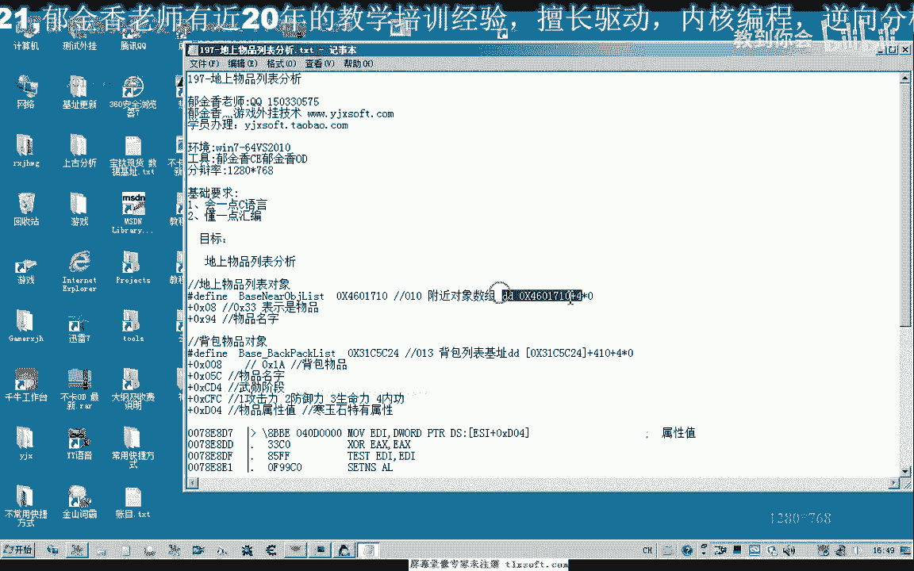
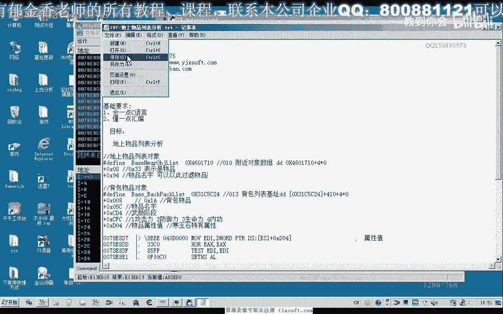
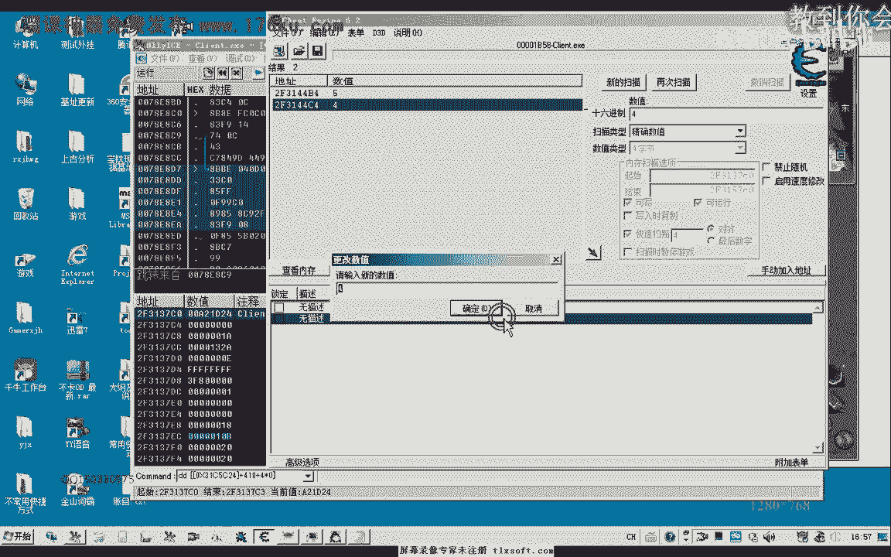

# 郁金香老师C／C++纯干货 - P183：197-地上物品列表分析 - 教到你会 - BV1DS4y1n7qF

大家好，我是郁金香老师，这节课我们一起来分析一下地上物品列表嗯，属性哇，那么首先呢我们准备一个是地上物物品列表的一个机制啊，那么这个的话就是我们以前的附近对象的一个列表，那么首先我们进到ot里面看一下。

那么这个时候呢我们的附近的对象的话有三个，分别是310d20490 ，那么这个时候我们，扔掉啊，比如说我们把这个含义十分到我们的地上，那么这个时候呢我们可以看到呃，d10 好像是d10 这一个。

是新增加的，好像是，那么我们看一下里面的这个字串的形式上来看一下，那么我们发现的话，这里有四个小点，大概在，九四的这个位置是它的名字加0x94 ，那么我们可以看到啊，dc。

那么这是我们这个地上物品对象的一个呃名字，那么往往呢我们就需要来通过这个物品的名字来来进行一个物品过滤，真的，因为这个时候的话他只能看到这个物品的名字。

它的属性的话呃需要呢需要捡起这个物品到了背包里边之后呢，我们才有相应的属性，比如说攻击嗯，或者是呃其他的一些属性值，那么我们需要来捡到背包里给你之后呢，才会出出现，那么第二个我们加八这个位置呢。

我们看到它的这个属性值呢为33v33 ，那么我们再看一下，最好我们走到一个呃人少的地方，因为现在的话它也会显示周围的这个npc也会显示，或者是怪物的话，它也会显示，我们也可以走到一个人比较少的地方啊。

周围没有这个怪物的地方，那么这个时候呢我们这个呃对象列表里面呢，它就会只有一个或者是两个这个对象，好的，在这个地方呢我们停下，那么这个时候的话，我们这个对象的话就是我们的人物角色对象。

啊就是我们的人物角色对象，那么另外的这个对象的话，进来的话就应当是我们的，另外的对象进来的话，就应当是我们的这个物品，那么我们扔掉一个物品在地上，那么这个的话就将是我们的物体对象，那么我们再来分析一下。

那么首先33还有加九，是这个地方呢，是我们物品的名字，那么那另外这个物品的话呃，它应当然有一些属性，但是这个时候我们是看不到的，啊，那么我们节目的时候的话是只有通过这个名字来来过滤它。

我们不能够确定它的属性，因为只有捡到了我们的背包里边呢，我们的属性呢才才能够确定啊，那么有一些垃圾物品呢，我们可以呃捡上来，捡到背包之后呢，我们可以到一个地方去把它扔掉，那么这个是这个时候呢。

我们需要对背包里面的这些垃圾物品呢作为一个判断，那么我们接下来来分析一下我们背包物品对象的属性，啊那么这个是我们背包里面的物品对象，那么第一个呢是这个寒铁刀，因为他没有其他的什么属性。

它的这个寒铁刀的话，他的这个攻击力的话就是固定的，那么所以说这这一类的话我们不用做判断，那么强化石的话它也没有属性，那么我们需要做判断的一般呢是含义时呃，另外是金刚石这个啊。

那么我们就来看一下这个防御力是增加好四这个属性在什么地方，那么我们一起来看一下，好的，我们这个时候呢可以到这个列表里面找一下这个数值四，那么最简单的方法呢我们是可以的，用c一来搜一下。

那么这里起始范围我们就是这个对象的起始地址，2f313740 ，那么这里的话我们把它改一下，改为，大概是呃这里来加二，那么这样一个范围的话，应当是足够用的，那么我们搜一下数值四，那么这里有两个地方。

我们来看一下这个地方，第一个地方我们改一下它的这个属性值，看有没有效果，这个数字没有效果，我们改一下这第二个。

那么这个时候我们看到它的防御力的话就有变化了啊，那么这个的话就就应当是他防御力的这个属性的，那么我们来看一下这两个地址相差的距离有多远，那么相差的地址的话恰好是d04 啊。

那么所以说我们在这里呢把它备注一下，物品的属性值是低于四，那么这个属性值周围的的还有一些呃，还有一些属性啊，这里呢还有一些属性我们可以进行修改，看一下它的一个变化，比如说现在这里是防御寒玉石。

那么我们修改这里的话，可以修改它的一个防御力，那么我们看一下cfc这个地方有什么用，那么这个时候呢变成了攻击力啊，那么我们再修改一下，那么这个时候呢变成了生命力啊，那么所以说呢我们cfc这个地方呢。

它也是一个这种带属性物品的啊，一对属性啊，比如说这个含义式，但是金刚石的话我们不知道有没有这一类的属性，我们可以试一下嗯，金刚石的话是第二个物品，加上一个e c f c，那么二的话是防御力。

我们可以看到嗯，三的话同样的是生命力依赖才是我们的攻击力，当然这个的话暂时呢我们可能还没有多大的用处，我们弄出最大的呢是这个背包里边的这个呃带属性，物品的这个属性的这个数值。

那么我们就可以通过呃物品的名字啊，以及它的这个属性值，比如说这个攻击力啊，或者是法律御力低于某一个，比如说它是含韵呃这个含义时，那么另外呢这个含义时的属性呢，我们可以通过这里来判断哈。

应当哦这里应该是它的一个属性是金刚石啊，是海韵石的话，生命力，那么我们可以通过这里来判断啊，如果是含义时的话，他的攻击力啊，如果是小于某一个，因为这里它相当于是一个分类，1234。

如果他的攻击力小于某一个数值，那么我们就可以把它扔掉，或者是防御力小于某一个数值，或者是生命力啊，小于某一个数值，那么我们再修改一下，看数字是什么，那么数字五呢是命中率啊。

那么我们再来看一下数字六的话是什么，那么这个是b，那么我们再来看一下数字七，那么这个是武功攻击力，那么这个是全部气功等级，嗯，这是物品升级成功概率，当然我们可以通过这里来判断。

另外的话他应该还有一个还有一个字串的类型可以进行判断，那么我们来看一下吧，武器合成材料，那么在，他只是在这个位置的，它有一个物品的描述加230，这个位置，我们看一下7230。

那么我们再来看一下第一个物品加热三零，那么生命力意义增加啊，那么第三个物品我们再看一下防御力三增加，那么第四个物品，那么第四个物品呢，它这里呢呃应该是没有好，这里没有，这个是空位，攻击力十增加负。

那么我们也可以通过这个位置的字串来判断也是可以的，那么除了通过刚才的这个属性，那么两种判断方式都是可以的，那么所以再加230，这个地方，那么我们也可以通过这个地方呢来过滤。

或者是扔掉我们的这个垃圾的这个物品，那么我们再来看一下，这个是1212的话，40x，啊这个是戊神单啊，这个才是腰，那么我们这个是678，我看一下啊，像这种不带属性的话，它就没有啊，只有带属性的了。

我们才能够看到它的这个名字，零，那么不带属性的话，我们只有来看到它的呃，这个名字看不到他的这个去制造材料，加c，那么加f一这个地方呢，还有一个这是这是不带属性的啊，那么包括后面这个睡眠，还有这个青玉珠。

那么不带属性的是0f一这个地方来描述它，好知道哦，你f一这个地方呢它本身有本身呢就有一个这个物品的一个介绍啊，武器合成材料啊，这一类的应该是f一这个地，那么上面这个呢应该是一个物品的一个简单的一个说明。

对上面这个地方很相似，物品属性的啊，描述描述啊，说明这个更详细一些啊，相关属性的这个只是一个简单的一个说明，那么都是一个字串，那么这里呢还有一个cd 4，这个地方呢还有一个群的一个阶段嗯嗯。

那么这个呢暂时不知道有什么用啊，好的，那么这节课呢我们就暂时分析到这个地方，那下一节课我们来讨论一下呃，怎么来自动捡物品啊，你就怎么来设计我们的呃物品的一个过滤的一个思路，好的。

