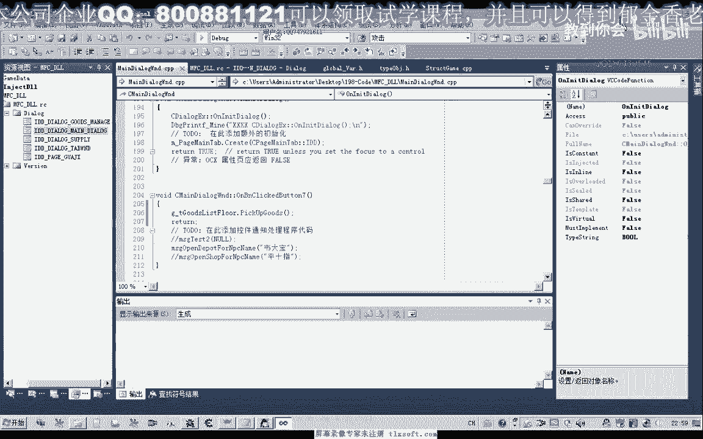

# P184：198-捡物过滤+自动捡物封装 - 教到你会 - BV1DS4y1n7qF

大家好，我是郁金香老师，这节课呢我们单独的封装一下简木的这个功能。

那么节目的话之前呢我们动作里面呢有一个节目的动作，但是我们用这个减物的功能的话，我们就不能够达到一个呃过滤节目的功能，也就是说这个节目的话，它会顺序的把我们地上的东西全部捡起来啊，比如说我们按f9 。

那么这个时候呢它就会把地上的物品呢，依次的把它捡到我们的背包里面去，但是有有的时候呢，比如说我们这个金刚石，我们不想要它，那么我们金刚石呢我们不捡，只捡其他的物品。

那么这个时候呢我们就需要来单独的写一个这个功能函数，来达到一个过滤的一个目的，那么我们在选择这个物品的时候呢，呃就要做一些过滤，比如说我们的嗯这个衣服这一类的我们都可以的，不检查，或者是某一类的石头。

或者是只剪我们这个强化石这一类的，那么这就需要我们自己写代码，那么实际上的话我们有一个功能这个供给啊，这个功能在我们选中这个物品的基础上呢，我们用这个工体这个技能的话。

实际上就能够达到这个过滤的这个物体，好的，那么我们先打开196克的代码。

太酷，那么首先呢我们展开我们的结构单元，那么在结构里边呢，我们添加啊留下的一个结构，那么首先呢我们也是像定义我们的怪物对象一样，在这里呢我们定义一个物品的一个对象，那么这个对象结构呢。

最终呢它实际上还是用来骗离我们的附近的这个对象数组啊，这个bb miss啊，这附近的用来骗你这里边的对象数组，因为我们的地上的物品和地上的怪物，还有我们周围的这个玩家npc都是在这个附近对象列表里面。

当然我们也可以在所有对象列表里去偏移它都是可以的，那么只要它里边呢嗯它的这个分类这里加八，这个位置呢是三三，那么就表示我们的地上的物品，那么这个加零次这个呢是我们呃物品的这个下标。

在所有对象数组里面的好的，那么这是我们的对象，那么对象里面呢它包含这几项，包含我们的物品名字嗯，那么物品信息这个呢是没有的，那么这个呢只有我们背包里边才有，那么它实际上只有这几项啊。

当然类型的话它就是你x3 的这个类型，那么实际上对我们最有用的呢就是这两个，一个是在我们所有对象数组里面的下标，这个我们是用来选中物品的时候用。

那么另外一个呢就是物品的名字用来过滤我们简录功能的时候用好，那么下面呢我们会给它封装几个函数，那么首先呢我们偏离所有的这个数据呢，放在这个数组里边啊，放在这个物品对象数组里面。

然后呢我们用这个get代替来初始化，说实话，这个t估值list，物品类的，这个时候呢我们把附近的这个所有对象的里边呢，提取出我们的物品啊，物品信息，然后存放在这个数组里边。

然后这个呢我们可以打印一些信息，好，那么这个呢是选中我们这个物品列表里面的第一个物品，当然要实现过滤的一个功能呢，到时候呢我们也可以修改这个函数，好，那么这个呢是我们的一个自动型的功能，好的。

我们先把这一段放到我们的头文件里面，那么这里呢它的一个大小来与我们的这个因为是与我们所有呃，附近的这个列表的一个大小，实际上就是那么这是最极端的情况下，一般来说呢它不会周围的这个物品个数的话。

一般不会超出这个100个啊，那几个可能就是只有好，那么这里我们建好了之后呢，我们再添加相应的成员函数的代码，那么我们把这段代码呢添加到我们的cp p里边，移动到最后，那么我们先来看一下第一个函数。

第一个函数值是个体代替的，用来初始化这个数组的，那么先这里来清理初始化哈，给一个干净的数据，然后这里有一个type估值for flow，那么这个表示什么呢，表示实际上就是地上物品的这个类型就是三三。

那么也就是我们之前所说的啊，这里是三三呢才表示物品，如果是二一的话，就表示是怪物，是三幺呢表示玩家，那么所以我们要在这里来添加这些物品的类型，那么我们这个卦其中一点我们看一下，这里有一个type好。

那么我们在这里添加一下，一个是怪物，这个是玩家啊，我们一起添加，这是周围的怪物类型，周围的玩家类型的地上物品，那么这个是背包里面的这个物品是1a啊，这里呢我们也顺便把它定义一下，好。

再回到我们的c p p t v那里，那么在这里呢我们取0x08 这个地方啊，也就是把这里这个对象偏移加零八，这里的数据取出来，与这个三三做一个比较，那么如果是等于三三的话。

那么我们才进行后面的数据的一个添加，那么如果他这里是不等于零，那么可能就是怪物或者是npc或者是其他的玩家，这对的，那么我们就继续循环啊，那么只有走到这个位置的时候呢。

我们才添加我们这个地上物品的信息到这个列表里面，那么这里是最重要的一个啊，90这个地方是物品的名字，那么这个呢可以不要，那么后边呢还有一个是它的一个下标啊，那么这个下标呢它的位置的话。

实际上就是我们之前用的这个零售这个偏移啊，也就是把对象的这个下标取出来读出来，那么这个偏移呢他之前呢没有定义过啊，那么这里我们把它定义一下，没有定义的话，我们把它定义到我们的结构单元头部。

那么这个呢等于0x0 c，物品下不了，真的，好的，那么这样添加进去之后呢，我们就把物品的信息呢进行了一个初始化，初始化之后呢，我们在这里呢我们就可以打印出它相关的啊，地上的这些信息，通过这个循环好。

那么在这里呢我们再次啊每次的选目之前呢，我们进行初始化，初始化之后呢，我们对它进行判例，那么如果呃这个因为我们在这里呢用了一个win设进行一个清明的操作，对这个物品列表，那么如果我们在这里的话。

他这个对象的名字为空的话，那么我们就直接退出这个循环了，就证明了我们地上的没有这个物品，那么如果找到了物品的话，我们呢在一四比八这个偏移来进行写入，写入它的下标表示选中这个物品，选中物品。

那么这个看之前的一个分析哈啊，选中物品，我选中怪物实际上都是用的同一个偏移，一四比八这个偏移啊，这是人物角色选中物品，那么在这里的话，我们呢可以要实现我们作品过滤的话，我们可以添加其他的代码。

比如说这里我们可以对名字啊进行一个判断或用，当然现在呢我们不讨论这个功能，那么在这里呢我们选中选中物品，然后呢我们自己执行一个攻击的动作呢，实际上它就能够减负啊，好的，我们生成一下进行测试。

对了我们还需要写一部需要写一个测试的，测试的话，我们需要来把这个对象呢先定义一个相应的对象，哈哈，地上物品列表，然后我们需要把这个列表来放到我们的全局变量里面去。

然后我们就可以调用这个相应的全局变量做一个测试，那么后面呢我们不管直接在这里可以看，那么我们可以先来打印出地上物品的信息，然后我们也可以了，在第二个测试这里的实行一个节目，这是节目的功能，可以看测试一。

测试二，好的，我们先从背包里边啊，扔几个物品到地上，好的，然后呢我们输入代码。

首先呢我们建立一下相应的信息，那么这个时候呢它会偏离出它的相应地上物品的名字，我们可以根据这些名字来进行过滤，然后呢我们点测试的时候，点一次测试呢，它会，捡一个物品啊，那么如果要进行过滤的话。

我们可以在这里呢进行一个简单的判断，就这个cl里面，那，么在c的时候，我们在这里呢可以加上呃，加上一个循环的一个判断，可以有很多列表，那么我们举一个例子啊，我们可以在这里呢对这个名字进行一个判断。

我们只剪某一种物品，或者是减某一个循环里面的物品，比如说这个含义时我们就不检查，那么不检查的话，我们直接就躺平了啊，直接就跳过啊，那么这个时候呢我们就是除了韩愈时以外的，其他我们都可以减。

都会呃把这个物品捡到背包里面去，那么如果是含义时的话，他就不会去解好的，我们做一下测试，那么这只是一个简单的过滤，那么实际上过滤呢我们可以过滤很多物品，不止一个名字，好这个时候我们在做测试。

然后不断地捡起我们的物品，那么这个时候我们看到地上还有一个含义是，但是这个时候呢我们点这个节目的话，他就不能把它捡起来，但是其他的物品呢它就会去解，但这个含义式的话它就不会去解了。

那么就能够达到一个过滤我们减负的一个目的，好的那么我们下一节课呢再详细的讨论呃，更多的这个物品的一个过滤，那么这节课呢我们暂时就讨论到这个地方。

