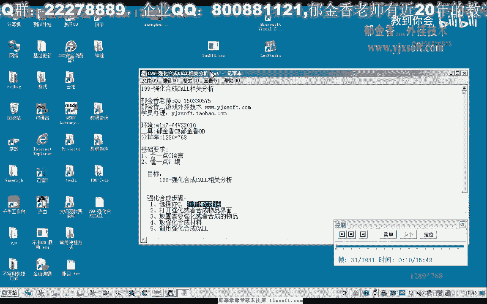
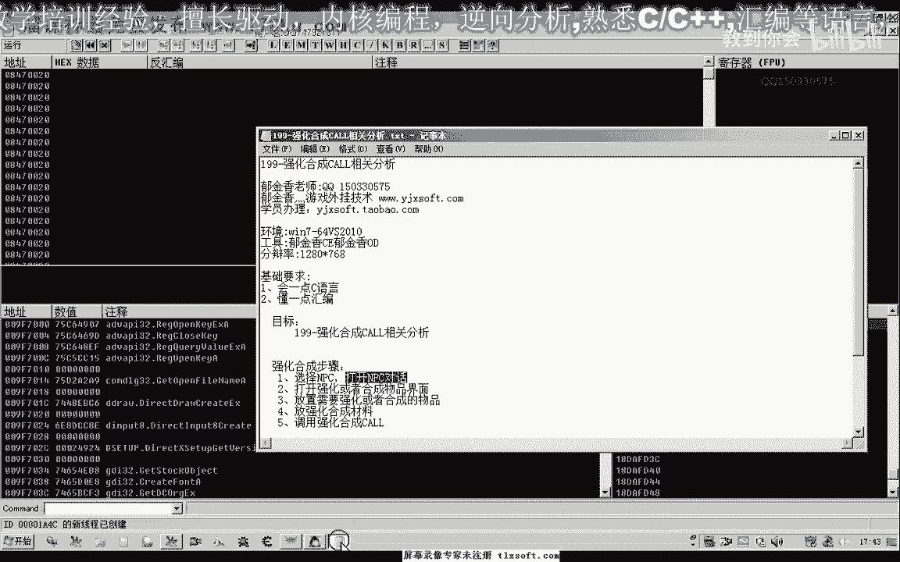
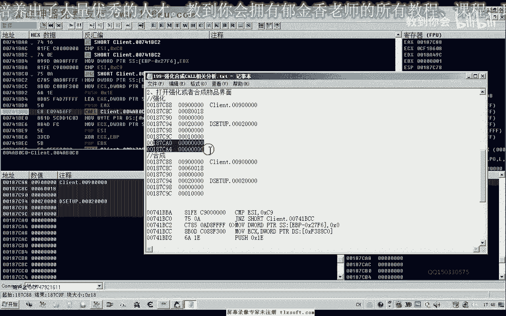
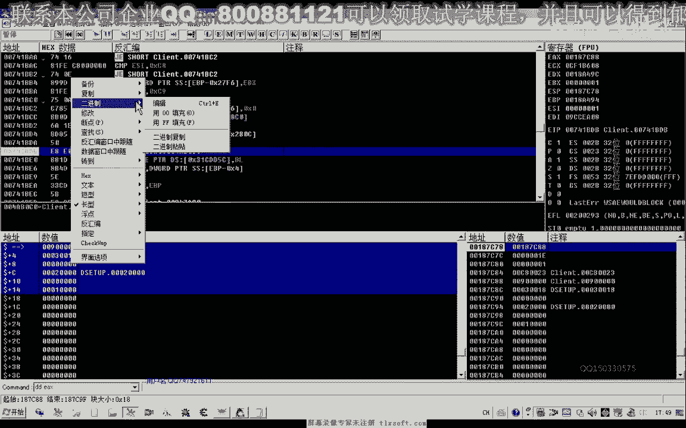
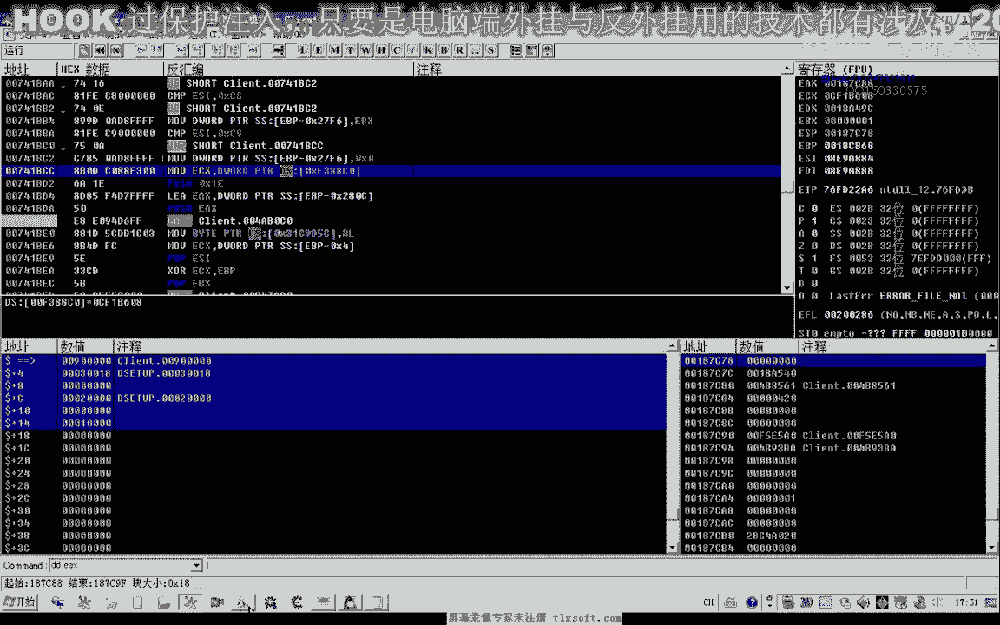
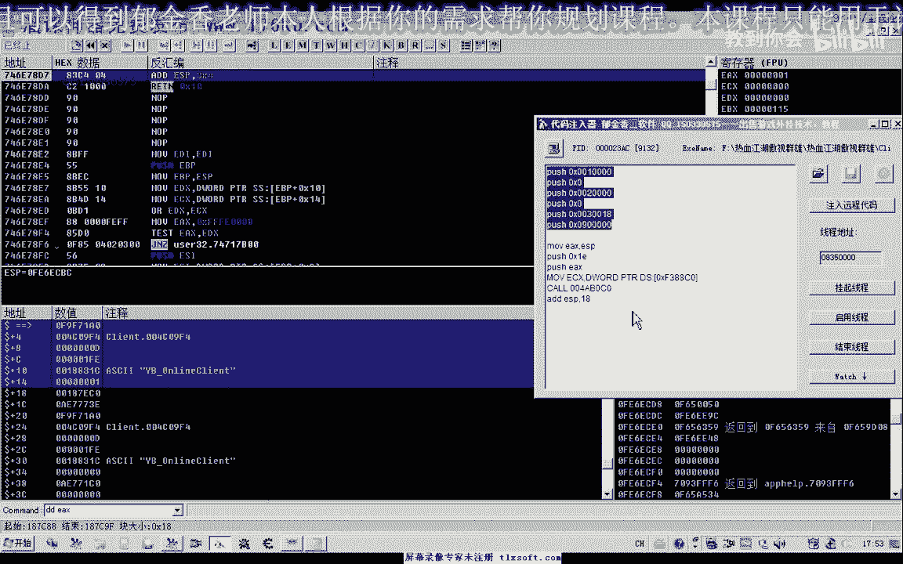
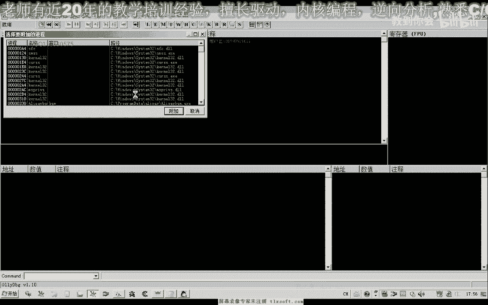
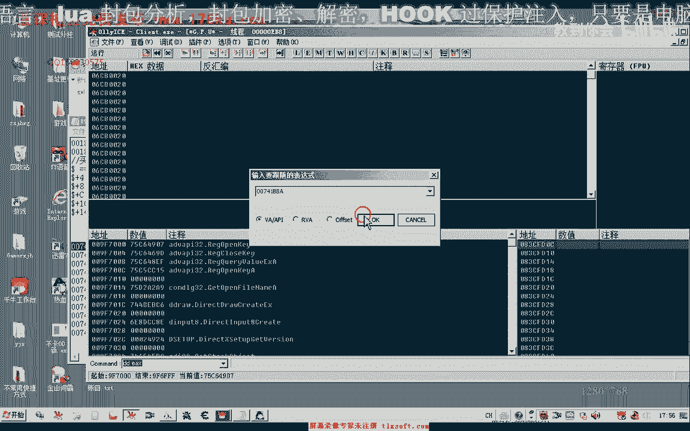

# P185：199-强化合成CALL相关分析0A - 教到你会 - BV1DS4y1n7qF

大家好，我是郁金香老师，这一节课我们一起来分析一下游戏里面的强化合成相关的数据。

那么首先我们打开，落地，附加到游戏里边。

在游戏里边呢我们有有一部分npc呃，选择打开之后可以进行物品的强化与合成，那么我们来以这个刀剑鞘这个npc稳定，那么首先呢我们要经过几个步骤强化，合成的话，首先呢我们肯定要选择一个n p c。

然后打开这个n p c的对话，然后进行菜单的一个选择啊，选择是强化或者是活成我们的物品，第三步呢，然后我们是放置我们需要的这些材料，也就是合成的物品，那第三部应当是首先是呃放置这个物品。

然后呢再次放置材料，最后呢调用我们的强化过程的这个功能函数，那么首先我们来看一下第二个步骤啊，打开强化或者是合成的这个物品界面，那么我们首先呢选择这个n p c，那么这个我们之前已经有过相应的讲解。

在选中npc之后，我们调用功法普通攻击这个库呢，它实际上就能够打开我们的n p c了，比如说这个时候我们是选中npc的，然后我们对它执行一个普通攻击的一个空，那么这个时候呢它就能够打开相应的npc菜单。

然后我们再卖出或者是确确认任务合成物品的时候呢，这个时候也会向我们的服务器发送一个相应的信息，那么所以说我们这个时候呢嗯可以呢，对这个发送数据的api函数来进行下段，下段之后。

然后我们比如比如选择这个强化物品啊，现在还没有开始选择，是其他的地方断下啊，那么我们重新选择一下强化物品，这个时候呢会，断在这个w s s m的这个地方，当然不同的游戏呢它可能发包的这个函数不一样。

有可能其他的它只是调用的是生的啊，这个函数或者是生的to这一类，这个时候我们执行到返回，然后再执行到返回，那么这里呢我们看到它是发包的这个地方，我们通过调用这个发，包括从这个地方的话。

理论上呢就能够实现我们的这个装备强化啊，在这个界面都打开，那么实际上它应当是向我们的服务器发送了这个信息服务器，然后呢发送指令出来到我们的客户端，然后呢打开的这个窗口界面。

那么实际上它应当不止一个地方嗯，可以实现这个功能，当然我们看一下这个缓冲区，那么这个缓冲区的话，我们发现呢非常的简单啊，就是一个9080018，这里是2cm啊，这是缓冲区的一个数据。

那么我们再选择其他的扣啊，再试一下，比如说我们选择合成物品，那么在选择合成的时候，我们再来看一下它的这个数据。

那么这是卧蚕，这呢是强化，他们都是调用的同一个空，那么我们找一下它的区别，这里是八，这里是六。

它只有这一个地方呢有相应的一个变化，我们再选一下其他的菜单，比如说我们是在这里进行买进或者是买出，那么我们来看一下，那么这里呢它是三啊。

只有一个参数不一样，那么所以说我们理论上呢我们可以的在这里，要用这个发包的这个库，应当说能够实现这个功能，好的我们进行一下相应的测试，把代码注入器打开，那么首先呢我们要呃在代码注入器里面呢。

我们需要来给他这样设置一个相应的缓冲区哈，那么这样在代码注入器里面来写的话，实际上它不是很方便，那么我们可以通过一个谱写的一个顺序复习，从这个100这个地方开始给它构建这样一种缓冲区，然后再是图形。

然后再次复习002啊，002上边呢，这里呢接着是零，然后是30018，然后再是一个九五个零，那么这就是构建的一个缓冲区啊，那么他执行的指令的话肯定是最先执行的这个前面这一段。

那么最先压榨的人他肯定会到我们的这个饭点啊，相当于是那么直到我们执行到这个语句的时候呢，我们就构建了这样的一个缓冲区，那么这个时候的话，因为它的这个缓冲区呢最终呢是存放到了1a x里边。

那么我们可以这个时候来把我们的呃e s p啊，也就是我们的这个站点的这个数据呢放到我们的ex里面去啊，这样的话我们就形成了我们的一个缓冲区啊。

当然还有一个这里呢我们还需要对我们的ec x来进行一个复出值。

好接下来我们进入到游戏里面看一下，那么首先我们看一下从买卖这里开始吧。

买卖这里呢是注意现在是一啊，这个地方是一，那么我们重新打开这个菜单，在这里输入代码，这个时候呢它会打开这个商店，但是打开商店之后呢，我们看一下这个时候呢呃出错，虽然说他打开了商店，但是马上来他出错了。

可能的话是因为我们的这里的堆栈呢它没有平衡，因为在这里我们分配了这个空间啊，但是这里呢到最后之后的这段空间呢，我们没有释放，这里呢有一共是每一次复写的是四字节，在这个36位的进程里面。

那么我们的公司六次，最后呢我们这里呢要att e s p呃，加上幺八这样的，我们才能够达到一个堆栈的一个平衡，那么可能是由于这一局输出。

你再按减号退回来，再看一下这个地方，好的，我们再次来重新，进入游戏，再次进入游戏之后呢，我们附加到游戏的进程，然后我们再次打开np c菜单，然后我们在这里呢选择打开打开我们的商店啊，买进买书。

那么这个时候我们做了一个堆栈的一个平衡之后呢，呃相当于这片空间呢它就被释放掉了，那么他就不会出错啊，那么我们接下来看一下怎么打开我们的合成窗口啊，这里是六六百18，这个地方只有这一个参数不一样啊。

这个时候是装备的一个合成，然后我们再看一下，呃窗口的强化，这里是八，那么我们把这个参数来改一下，啊这样呢我们就可以打开我们的强化窗口，好的，那么这节课呢我们分析了主要就是这一部分了。

当然我们还可以呢呃往更上层来找啊，可能它还有更上层的这个空。

刚才我们是。

在这个地方。

我们可以在这个地方下断，然后我们合成物品的时候呢断一下，在这个时候呢我们取消断点继续啊，执行到返回，我们看到这里呢还有一个空啊，我们也可以对这个库来进行操作啊，你们上，我们再看一下这个库能不能够使用嗯。

点一下合成物品，看一下它的参数，一个是e s i，这里呢是4e cx 5，记录下来，这是e4 x的一个数值，看起来呢这一个扩的话，它就只有这一个参数啊，只有这一个参数。

而且它是来源于我们的一个数组里边加174，这个地方看来是这个e s的一个数字，好的我们再来看一下选择其他扩展啊，选择强化物品的时候是多少，那么我们发现强化的时候呢，它的参数呢是六，而ec x呢没有改变。

接下来我们再看一下购买物品，购买物品呢我们发现了这里的参数呢，它是一，146这个扩的参数呢它有些不一样，好的我们来测试一下这个库，不是cx 5574197，146啊，那么我们注意一下。

这个时候呢我们通过一了这个参数呢就可以打开商店，二的话就是装备有合成，还有一个是六，丢了就是我们的装备强化啊，看到每一个npc的话，可能的都可以用类似的方法来分析，那么但是这个扣的话显然要更简单一点。

那么究竟使用了一个框呢，这个主要是看自己的一个思路啊，当然我建议的话实际上用上边这一个发包的这个可能更方便一些，因为我们在更更新这个维护的时候的话，更容易恢复一些，只需要更新这一个扩的地址就可以了啊。

当然从这个库的调用程度和使用简单性上来说的话，我们当然是现在这个货更简单一点，它的参数呢没有上面这个参数这么复杂好的，那么具体用哪一个，后来这个全靠自己去斟酌一下，那么这节课呢我们就暂时到这里。

那么这类的话就是合成物品的时候呢，我们需要放装备啊，还有强化物品的时候，我们也需要也需要放一个装备，到这里还有需要放一个强化石，当然还有这这一个窗口啊，这个窗口，那么这一期我们下一节课呢再接着分析。

这节课呢我们暂时呢就到这里。