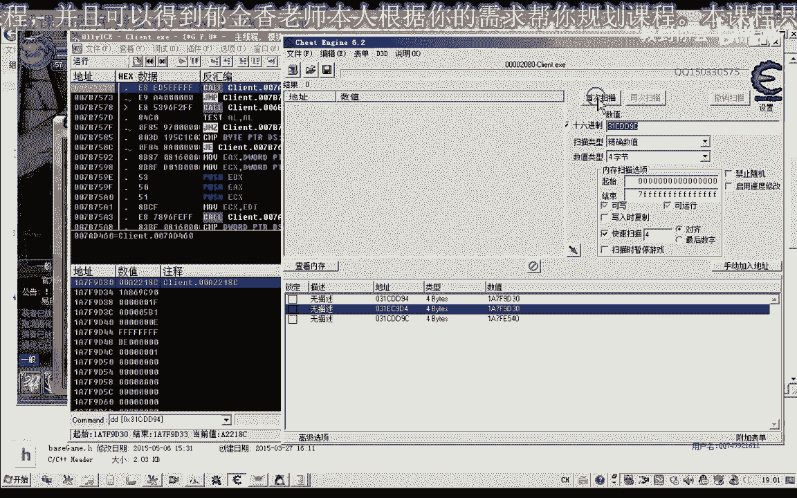

# 郁金香老师C／C++纯干货 - P186：200-强化合成CALL相关分析 - 放置装备和材料 - 教到你会 - BV1DS4y1n7qF

大家好，我是虞书欣老师，这节课我们一起来分析一下放置装备材料，那么在放置装备的时候，我们肯定的第一个步骤是要选择相应的装备或者是材料，实际上我们的第一步应该是选择，选中。

那么这个时候我们需要选中背包里面的，实际上我们可以参考31克与32克里面的选中技能与放置技能到我们的技能栏，那么现在我们只是说要放置的技能是要放置的材料，是要放置到活成的窗口里面去。

那么它的第一步的话实际上与我们31克应该是类似的。

那么31克的时候我们当时来分析了有一个机子，228这个机子我们能够选中选中的物品，那么它有一个ECX在这个地方，那么我们来看一下我们有没有更新相应的机子，找一下228放置技能，那么这是它最新的机子。

228这一个我们来看一下。

那么现在它是一个空的对象。

如果我们选中我们的物品之后，我们来看一下这里它就有一个选中的物品，那么实际上我们是把背包里面的物品，它的对象写到了我们的地址里面去，应该是这样，我们来看，再来看一下，31克，这里它是把410里面的。

你看这个对象写到了里面去，我们再来看一下机子里面背包的数字，背包，这是我们背包的数字，那么我们来看一下背包数字里面，有没有对象59P0的，我们可以在这里找到，它是在它的下标的第二个里面。

是59P0这个对象，那么实际上是把对象写到了我们相应的地址里面去，比如说我们选中强化石，那么肯定这里来写入的就是F0P0，这一个这里我们能够看到，所以说我们的第一步的话实际上已经解决了。

就是在像机子里面来写入我们的物品，地址就可以了，进来的时候用，这是我们的第一步，那么这个也是我们的放置物品，可以把背包对象地址写入，那么这里我们也能够看到它的一个变化，比如说我们要选中的是第一个。

我们再回来看一下，第一个是强化石，当然它另外应该还有一个选中的状态，我们再来看一下31口，我们再来看一下，我们选中的是第一个，我们选中的是强化石，那么我们选中的状态。

我们选中的是第一个，我们选中的是强化石，那么我们选中的是第一个，我们选中的是强化石，这个我们可以暂时的放一下，因为我们的代码里面的话，之前的代码里面已经在CNN里面，已经封装了这样的功能。

那么我们这几个来直接分析下一步，也就是怎么把物品放置到我们的相应的装备里面，放置到这个位置里面去，那么我们首先看一下，当然我们也可以参考，参考第3132课的分析方法，通过数据来去立项，那么另外一个方法。

我们就是看在放置装备的时候，它是否向我们的服务器发送我们的数据，对发包的函数来下段来进行尝试，那么一定要注意是我们放下装备之后，这个包才断下的，那么才有效，如果我们还没有放下的时候就断下。

这个时候分析是无效的，执行到返回，那么这个时候会到6E这里发包的函数，我们会到这个地方，然后我们取消一下，再次把它放上去，那么我们来看一下，这个时候的EDX是什么，那么EDX我们看着比较简单。

那么我们再换一个，对象上去，然后我们再来看一下，这个时候我们发现它的EDX的话就比较复杂一些，那么我们主要是看一下后边这一段数据它有没有用，我们把它清零一下，如果是有用的话。

我们这个包的话可能就显得比较复杂，好像后边这一段数据是没有用的，因为我们发现它也把它放上去了，好像有用的只有前面这一部分数据，那么如果是这样的话，我们可以来考虑了，就直接使用发包的函数。

那么发包我们看一下这个是什么意义，这里有一个注意这个数字，那么恰好是背包里面的数字的下标，那么我们取消一下，下标应当是3，我们能够在这里找到数据3，数据3，好的，那么既然是如此的话。

我们今天就用发包的函数就直接的来解决这个问题，看行不行，那么这样的话可以绕过之前31颗32颗的做法，就可以不选中物品，直接把它放到上面，有可能，那么我们再次来进行测试一下，这是第5个。

那么我们来看一下第5个的时候，我们因为后边这一段数据可能是没有用的，我们分析的话，那么有用的可能注意就是在前面这一段数据，那么首先我们把这前面这一段数据放出去，复制出来，复制出来之后。

我们首先打开我们的代码输入器，首先我们要构建这样一个缓冲区，把这段数据，复制一下。

那么这里来替换成，那么首先，我们也是要做好一个站的平衡，那么这里的4组是10字节，一共是20个字节，那么最后我们选APP ESP，加上2的，好，那么之前的话我们在这里会把我们的，亚站的EDX进行初始化。

也就是来于前边的站的站顶的一个地址，ESP就构建好了缓冲区，然后我们传入参数61，然后我们pushEDX，然后再是这里有一个ECX的数字，复制出来，Core4FB_EXL，好的。

我们先测试一下，有没有用，那么我们再次选择一下，那么这一段的话，要简单一些参数发生了一些变化，那么后面这一段0的话，可能也是有用的，从它的变化来看，那么这个缓冲区可能更大一些。

那么我们看一下它变化的数字是什么，之前的指令的话，这里可能是一个指令，后边加14这个位置，这里变成了1，这个是背包，背包的指定格数，那么这里可能是一个物品的ID，这一类的，122，后边的7没有变化。

那么可能后边还有一大串的0，那么这一大串的0可能也是有用的，我们再次测试一下，加0前缀，那么这个时候依然没有用，可能是我们缓冲区太小，我们再添加几个缓冲区，不行，不行，不行，那么这里要加一个10。

这里因为有16个字节，依然没有效果，加一组，这里要加上4个字节，那么说明的话，这种方法的话可能是没有效果，61，那么也有可能它的缓冲区的话比较大，那么我们看一下61的话，大致是到这个地方。

那么后边的话还有一长串的0，那么我们再加上几个0试一下，这里加20，加4个，好了，这里加上8个0，再试一下，這個，(音樂)，(音樂)，(音樂)，(音樂)，(音樂)，(音樂)，(音樂)，(音樂)。

(音樂)，(音樂)，(音樂)，(音樂)，(音樂)，(音樂)，(音樂)，(音樂)，那麼說明這個發包的話，直接這樣發包了可能是不能夠實現的，那麼這個發包的話，可能是另外的一個動作。

它與我們放置這個物品可能沒有什麼關係，好的，那麼我們可以了，這個時候再找一下它的上層擴，實行到返回，那麼到這個地方，這個地方的話參數比較複雜，我們看一下，取消，然後我們再放置這個物品上去。

那麼注意這裡有一個1，那麼這個1的話可能也是我們背包裡面的物品，這裡有個7A122，這個可能是，但是我們上一層這裡好像還有，這裡也有一個數字1，也有一個這樣的關鍵字，那麼我們可以再從上層再找一下。

有沒有更簡單的擴，那麼找到這個地方，這個地方的話，我們發現了與我們31扣，與我們32扣裡面的這個扣的話非常的相似，那麼也是一個16081B10。

這個是放置我們技能的，之前那麼在這裡的話，可能它也可以放置我們的物品，那麼我們再次看一下，取消，裝備，裝備之後我們看一下18，但是這個時候沒有我們的下標這一類的，那麼下標的話，可能是了。

就是說在選中的時候，已經在對象裡邊去了，那麼它只是一個放置的動作，我們可以先測試一下，現在首先看一下ECX的數字，然後中間這裡是18，那麼這裡是0，這裡是1，這是ECX。

好的，我們再次測試，那麼之前的這個扣暫時就沒有用，不吸泥。

不吸油花，不吸泥，然後ECX12769B30，扣，當然調用這個扣的前提的話，應當是要選中我們的物品才可以，那麼沒有選中的話，我們看一下好像是沒有效果，我們選中一個物品，然後在這個時候。

我們就能夠把它放置到我們的強化裝備裏面去，那麼我們換一下，如果是活塵，可能這種可能會有另外的一個扣，或者是另外的參數，那麼是合成物品，那麼這個時候裝備的合成，我們在剛才的這個位置給它下一個段，放置一下。

那麼我們可以發現，合成的話，這裡它是15，這個參數，那麼強化它是18，ECX好像也有變化，沒有，ECX也有變化，那麼這兩個ECX的話，它也是不相同的，好的，我們繼續回來看一下物品的強化，那麼選中物品。

然後我們調用一下這個扣，這樣我們就能夠把我們的物品放置上去，然後我們再看一下放置強化時的時候，那麼這個時候，它是1A，可能是代表它放置的位置可能是不一樣，然後我們看一下它ECX的一些變化，而且這個時候。

ECX EDI，最終也就是EDI，但是40的數字。

那麼我們大致已經知道了，首先我們第一個應當是向228機制裏面，調用相應的放置物品的一個扣，那麼放置之後，我們再來調用一個放置物品的扣，這個就應當是我們的放置物品的扣，但是放置物品的扣。

它的ECX的參數的話，它來源不太一樣，那麼我們這個是我們關鍵的一個地方，放置物品。

那麼這裡備註一下，1A放置強化材料，強化石，應當是腰，這是活塵，腰包，放置強化裝備，那麼接下來我們就以強化裝備為例，來看一下，它的ECX的參數來源於什麼地方，那麼我們來追一下，它的ECX的話。

實際上就是來源於這一個EPI，好的我們以強化為例，首先是放置物品的ECX，那麼我們可以做一個猜測，ECX會不會就是我們228裏面的物品。

看一下好像是沒有關係，那麼另外我們再看一下背包裏面的物品，那麼這個與我們的背包，我們發現了，它的地址離得比較近，好像是，再來看一下，放置不同物品的時候，它ECX的一個變化，EDI，D30，D30。

這裡也能夠找到，然後我們向上找一下，然後這裡的話，ECX我們先分析一下，這一段代碼，當在342克的時候，我們可能也有分析，當時這裡它有一個機子，好像是直接能夠收到機子，那麼我們再往向上找一下。

找一下EDI的一個來源，向最上層的跳轉，向上找，EDI，那麼這裡有一個EDI，那麼我們發現的話，EDI，它在這裡用的話，有一個EDI加上一個410，它是某一個數字，這個EDI。

那麼有沒有可能就是我們的背包的數字，我們看一下，EDI等於D30，不太像，我們在這裡下一個段，試一下，再次讓它跑起來，再看一下我們的EDI，EDI會在這個地方斷下，那麼我們用EDI來加上410。

看是什麼結果，EDI加上410，那麼這個時候什麼也沒有，我們看下邊一句會不會執行，這一句已經被跳過了，找一下，繼續找一下，它的機子，暫時不去分析它的作用，EDI，那麼從這裡來看的話，EDI它有一個來源。

來源於我們的ex+dc，我們看一下這個來源是否對，正確，然後，EDI又加上了一個ex，從ex裏面的去出來的，這個EDI應當是不對的，那麼我們還有一種方法，我們直接用CE來收一下。

那麼我們直接以輕痛副手裝備為例，EDI我們看一下EDI的數值，這個D30我們把它複製一下，這裡什麼也看不到，然後我們用CE來收一下，它有沒有一個直接的機子，那麼這裡我們能夠找到兩個相關的機子，好的。

我們再來看一下，放置另外一個物品的時候，放置強化石的時候，這個機子會不會變，還是D30，說明它是不會變的，那麼這兩個對象的話，其中有一個，它應當是我們所有全球對象裏面的，所有對象列表，31149。

然後我們在裏面來收一下，那麼另外還有一個，311790，那麼證明的話，這個能夠直接收出來，那麼證明這個的話，它是我們的相應的機子。

在這裡邊，我們也能夠找到這一粒的藏鏈，複製一下。

這裡的話能夠找到很多這樣的場面。

我們就選第一個，這個是我們強化裝備對象，那麼這裡我們也能夠看到228這個數字，在它的附近，先複製一下，那麼我們再做一下測試，再放置物品，再看一下放置裝備的時候，它的ECX都是D30，是沒有變的。

但是我們在放置我們的強化石的時候，好像這個時候它變了，強化石的時候，它是另外一個ECX，那麼有可能是這種情況，從這裡來看的話，那麼也就是說裝備來這裡，它相當於是用的單獨的一個機子，而強化石這裡。

它可能是用的一個宿主的方式來顯示的，所以說它過有過的一個機子，那麼我們暫時我們就把它分開來使用，那麼我們在放置強化石的時候，肯定了，這裡還有另外一個機子，再找一下，中國聲音。

那麼我們剛才測試的是所有對象數，DD94，312，DD94，我們看一下能否找到，那麼證明這個是機子。

直接能夠在裡面找到的，因為它是搜索的時候也是綠色的，然後我們選第一個，那麼第一個，我們發現它也是在228的附近，上面是我們選擇的物品，那麼下面它這裡有個機子，當然我們暫時還不明白，它是什麼的一個作用。

那麼我們暫時把它當成是一個全局變量來使用，這裡是放置強化石，好的放置裝備與放置強化石的ECX，我們都已經有了，那麼接下來我們就可以進行響應的測試，那麼首先我們也是，它先放置強化石是不行的，要先放置裝備。

我們先把它取消掉，再看一下放置裝備的參數，放置強化裝備，這裡是18，那麼我們這裡是放置我們的裝備，然後它的ECX，我們需要放置裝備，強化裝備推向ECX，那麼先調用的是這個Core18，強化裝備。

放到裝備的位置，好的，我們先選中一個裝備，調一下Core18，然後我們再選擇一下強化石，這個時候我們需要改變一下它的ECX參數，強化石是這個，當然我們也可以先不改變它ECX的參數，看是否能夠進行放置。

那麼這裡放置強化材料的時候，它也能夠放置，好像，那麼這個機制的話，我們可以如果是這種情況的話，我們就可以任意的選一個，看來也是可以的，我們再試一下我們另外一個強化的機制，9C這個，取消，那麼這裡是18。

放置裝備，還沒有選擇，那麼我們如果選擇了裝備，放在位置不對的話，它也會取消這個選中，這個時候說在這裡的我們一定要對，是18，然後放裝備，然後再次選中強化石，1A，直接就可以了，看來這個機制的話。

它沒有太大的問題，直接選擇一個機制就可以通用，那麼這幾個機制都可以用，我們來進行一下比較，看裡面有沒有什麼不同的，好像裡面也就是它的地址不一樣，它的結構可能都是類似的，所以說不會出錯，這裡是9C。

一個是94，一個是9C，那麼實際上在這幾個地址的話，它都是挨著的，那麼我們還有一個背包的，這個宿主，它都是挨著的，我們好像再來看一下，背包宿主的話離的比較遠一點，31424。

這個是314DD94，不太一樣，好的，那麼既然能用的話，那麼這幾個我們的分析就到這裡，那麼下一節課，我們開始編寫我們的C++代碼，進行函數的一個封裝，功能的封裝，好，那麼我們下一期課再見，本集完。

