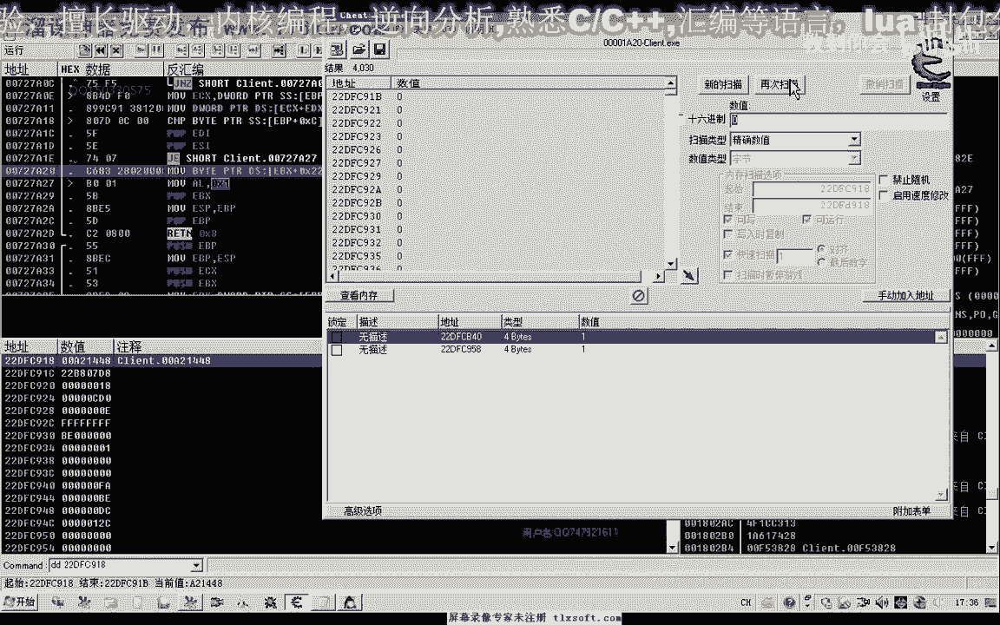

# 郁金香老师C／C++纯干货 - P187：201-强化合成CALL分析-去掉提示窗口 - 教到你会 - BV1DS4y1n7qF

大家好，我是郁金香老师，这一节课我们一起来分析一下怎么样去掉提示窗口，那么这个提示窗口我们主要是针对在强化合成装备的时候呢，它有一个通知的窗口，那么呃这里可以选择一个下次登录前不再提示窗口。

但是我们自己在编写代码的时候，如果我们放置了我们的装备，但是接下来的这个操作了，就有可能不能够进行啊，比如说我们在放置这个强化石的时候，有这个窗口的时候，我们就不能够进行放置。

那么所以所以说我们在这里呢有两种方法嗯，第一个呢我们是放置好这个装备之后呢，关掉这个窗口，那么第二个呢我们是找到这个相关的地址啊，但是这个应该他们有机制呃，应该它是一个地址嗯，那么我们可以那么最有。

最可能的情况呢是这种啊，那么这里呢他这个复选框的话呃，呃对于这个状态在这个对象里边某一个偏一点，那么我们要找到这个开关啊，让他下一次下一次我们放置这个装备的时候呢，不会再弹出这个通知的窗口。

那么像这个分析的话，我们先整理一下思路啊，那么首先呢我们那么我之前呢也尝试过呃，他这个窗口加载的这个背景，通过呃去访问他想问相应的这个文件呢来进行立项啊，但是没有成功。

那么另外呢我们可以从这些文字性的字串啊，比如说这个需要额外的5%强化的合成几率啊，从这个开始触发了，应该可以回溯到，那么另外还有一种情况呢，就是这个窗口呢它的这个显示呃与隐藏呢，它应该是有一个状态啊。

那么多数情况下我们会在c语言里面呢会用这个醋啊，也就是真或这个假这两个数字，也就是一和零这两个数字来表示一个窗口的一个状态，那么我们也可以从这两个状态呢来进行分析，那么我的思路是这样的啊。

首先我们通过肯定找到他，他的话应当来说有多种的方法，那么我们前面的课程里边，我记得呃有一个就是窗口在确定或取消的时候都会调用一个库，那么从那个库那个地方呢应该可以取得这个窗口的对象。

然后呢对它的对象来进行一些数据的搜索，应该能够搜索到，那么这节课呢我们探讨一下另外的方法啊，嗯首先呢我们从这个通知窗口的一个显示状态来判断，那么我们做一个假设哈，应当来说的话，这个窗口对象。

那么这个窗口对象里面有一个偏移，或者是它的这个偏移里面，那么还有一个偏移，那么里边可能会有一或者是零这两种状态来表示我们的窗口是否显示，那么我们通过找找到这这个状态，我们尝试找一下啊，如果能够找到的话。

然后呢，我们再来看一下其他什么地方有开关来控制我们的这个窗口的一个呃，显示与隐藏啊，他肯定还有一个条件的一个开关这一类的，那么我们先搜一下窗口的状态，这个时候窗口呢这个通知窗口呢是显示的。

那么显示的话我们比如说我们这个修window里面，那么它一般呢会用一个非零的一个数值和零来表示，也可能是用激活呢来表示啊，它的这个参数，那那么我们可以尝试来搜一下，那么现在是显示的。

我们就搜一下数值的一，然后我们点取消之后呢，这个时候窗口它隐藏掉了，那我们搜一下数字零，然后我们再次放入我们的这个装备，然后这个时候窗口呢会再次的显示，再次升一下数值的一比。

但是这个时候呢选项呢还相当的多，然后我们再取消掉，这个时候应当是数值的离，那么最后只有这两个数值，那么究竟哪一个数值是真的，或者存不存在这样一个开关，我们输入一来看一下，那么在输入里再看一下。

输入一的时候，我们已经写字了，这个窗口证明我们找到是正确的，那么我们第二个数字，第二个数字我们改一的时候呢，发现它没有任何的反应啊，那么说明的话前边这个数字是我们窗口相关的，然后我们再找一下。

那么既然这个是一个窗口的开关，那么可能的话它是在我们的这个窗口的，某个窗口对象的某一个偏离里面，那么我们找一下它的上一层，上一层的地址，那么在这里呢我们能够找到两个地方哈，呃灵活14228。

这个地方228288，好像我们还有一个地方是，那么这里呢他写入了一个数字一啊，之前可能是这里有个数值定理，那么这里呢我们还能够看到它是一个bt类型的bt类型，好的既然我们找到了，那么这里的bl的话。

我们看到也是负值零，关掉之后呢，它就是像这个228里面写出一个数字零，而这个28的话，e s i，那么接下来呢我们就用og来进行操作，那么这里是显示我们的这个窗口，哈哈哈哈。

好的这个时候我们把c一来退掉，那么接下来呢我们的用我们的o d来打开。

那么我们最终的目的呢，事实上它一直呢不会写出这个提示的窗口。

而不是说要关掉它，要关掉的话，我们从这里来看到，只要把它它的这个显示状态设置为零的话，实际上我们就可以关闭它，那么我们可以直接用这种方法，实际上已经能够实现我们的目的，那么这里呢后边的这这些分析呢。

我们是纯粹的一个技术的一个探讨。

那么我们找一下这里有一个eb x，看一下e bx的来源，那么我们发现的话，它的这个e bx可能是来源于我们上一层的这个参数，我们在这里下一个断点，那么我们发现好像很多地方都调用了这个库啊。

那么我们再来看一下另外一个另外一个孔，这里是显示，但是这个扩的话，它应当是一个类里边的一个公用的一个库，所以说很多地方都会调用它，点取消的时候呢也会掉落，那么我们先取消掉，那么先取消掉之后呢。

我们再次在这里下断再尝试。

那么我们再回过头来看一下，刚才的这个地址上，那是往这个地方写入了数字一。

那么我们对这个地方来下一个写入的断点硬件断点窗口的状态，这里啊这是显示窗口，然后我们再放进去，那么这个时候我们看一下，首先呢它是写入的数值平，但是为什么不是写入的数字一啊，这个我也不太清楚啊。

那么我们转到数字一的时候再断下，那么这个地方呢写入了数字一，那么我们看一下eb x是多少，e b x的话是这个数值，那么这个e b x的话就可能是我们的窗口对象，那么很有抗性。

啊那么这个可能是一个窗口的一个对象，什么什么是gv这一类的，那么在这个窗口对象里边的话，可能就存在一个数值，也就是我们之前的这个复选框的一个状态，就是下次登录前不再提示这个窗口。

那么可能的话在这个里面呢它也有一个灵活一的一个数字啊。

刚才我们分析了它是一个一字节的，那么这个时候呢我们可以呢呃选字节类型，然后从这个地址开始开始进行一个搜索，然后我们怎么搜出来，因为这个时候我没有选中他这个复选框没有选中，没有选中的话。

一般我们会用零来表示，那么我们找一下零。

好取消之后我们再次找零，然后我们再次放入的时候啊，这里我们选一下，点一下这个复选框，让他选中，那么选中的话应该就是一了，我们找一下有没有数值一啊，但是这个时候没有找到，没有找到的话。

我们需要重新的分析哈，那么需要怎么重新分析了，但是这个时候呢，由于我们下次登录之前，它都不会显示这个窗口，所以说我们需要小退一下游戏，再重新开始我们的测试，那么强化物品的时候啊。

我们在这个时候会再次出现这个窗口，我们看一下它的机制啊，这个时候他变了，可能这个地址已经变了，但是我们通过刚才找到这个代码。

看能不能够找到，嗯再按按照刚才的方法在搜一下，去把这里的地址改回来，尝试这个想法，那么首先呢我们也是搜一下窗口的状态，收一，然后呢我们取消掉收离，然后呢我们再一次显示这个窗口啊，再搜一下数值的一。

再取消掉是数字零，我，再搜一下数字一好，最后来出来的两个，我们改一下，第一个，这个时候能够实现我们窗口的一个隐藏，那么我们这次呢我们先把这个对象的一个机子把它搜索出来，看有没有相应的一个机子。

那么我们先把这个显示隐藏的地址下一个访问断点，那么这个时候呢我们可以在这里得到啊，呃是1x加四零，那么与我们上一节课所分析的那个268好像有一些不一样，好的我们找到了第一个偏移，ex加四零。

我们把ex的数字来记录下来，那么这个ex的话有可能是我们的窗口对象，那么也有可能更上一层的这个机子呢才是我们的窗口对象，那么我们找一下ex的来源，那ex的话它来源于我们的e si。

那么我们看一下ei在循环里面有没有变化，那么e si的话，他在这里的话应该是在，在一个对象列表里面啊，这里是它的一个初始地址，9518啊，我们看一下还有没有其他的地方存放了这个e x，让它运行起来。

我们用。

用c来搜一下，选四字节，那么我们这里呢会收到，好几个地方哈，这个的话可能因为我们所有的对象呢，都会存放在一个所有对象机子里边，这里如果只有一个的话，那么证明的话我们这一个对象的话呃，可能不是我们的。

就是说它可能呢存放在另外一个对象里面，那么可能是这里面的某一些像才是我们要找的这个对象，那么我们再重新下一下段进行尝试，那么写入一的时候啊。

我们先把这个窗口关掉，那么在此呢我们对刚才的地址来进行下段写入的时候，我们，下段，然后放入我们的装备，那么我们发现了这个时候呢会向里边写入一个数字的一，那么也就是我们显示窗口化。

那么这里呢既然是这个这个显示窗口的话，那么这个扩的话，那么可能就是一个显示窗口的一个扩，那么我们按ctrl f9 返回到上一层，那么从这里呢我们也能够看到啊，这里谱写了一个一。

那么可能就是这个可能就是类似于我们的修window的这样的一个函数，那么我们把这一段呢给复制一下我们的分析成果啊，就是，那么这个时候我们找到了第一个偏移，实际上也是。

然后我们再按ctrl f9 看一下上一层呃，然后呢会执行到这个地方，这样的一个括号啊，我们在这个地方下一个段，然后把刚才的这个断点呢取消掉，我们再来看一下，那么我们发现每次显示窗口的时候。

它都会调用这个库，这个库进来之后呢，呃才会去调用我们的这个补习一，那么也就是说它在显示这个窗口的时候呢，它会进行一个判断，就是判断我们的那个复选框它是否选中，那么如果是选中的话，它就不会显示这个窗口。

只有在没有选中啊，也就是复选框的状态，500的时候，你发的时候它才会执行这个修温的，那么在这之前呢，这里呢它有一个判断，那么有可能是这个地方接一会跳到上面来执行，那么我们在这个库的同步啊进行一下判断。

那么可能一个关键的一个数据的判断可能就在这里边，那么也可能是在上一层库，是上一层扣的，可能性可能还不是很大，那么我们点取消，再次我们放置装备的时候呢，他肯定会去判断一下那个复选框。

我们f7 跟进去跟进去看一下它的一个走向，那么这里呢我们发现了它就跳转到这下面来执行，那么如果是不跳转的话，一直会执行到这个地方，就不会调用这个新window好，那么就是走的另一种状态。

好我们按减号退出来，那么这里呢极有可能就是一个关键的位置啊，这个地方，那么是不是关键的位置呢，我们可以再次啊在这里来选择，下次登录的时候无提示啊，该窗口，那么也就是选中这个复选框再取消。

那么下次的时候我们看它也会调用这个显示的调用这个库，然后来进来进行一个判断，但是我们发现他判断的时候还没有执行到我们刚才这个问号这里，他从这里呢就直接跳转到后边去了，那么这一段呢就没有被执行。

再来看一下，重新执行，f7 进来，然后这里的跳转呢他直接呃跳转的条件呢就成立了，那么这里呢我们看它是这个29c这个地方呢等于厘米，那么说明的话这个状态呢它被改变了，那么极有可能这个r9 c嗯。

这个状态一致觉得就是我们的那个复选框啊，因为他这个时候为零了啊，我们看一下，dcx加二九，29c啊，这个地方，哦它是唯一了啊，这个地方呃，唯一的话是选中，选中之后呢，他表示不显示窗口，这个地方唯一。

那么我们把它改为零试一下吧，改为零的话，也就是说没有选中这个复选框，要显示这个窗口好，我们再次，啊的确这个时候呢我们的，但是这个复选框呢这里也是选中的，但是呢这个窗口呢它又显示了，应当是来说的话呃。

这个状态复选框的这个选中状态与他的呃关联的话，另外还有一个偏移，可能还有一个变量，但是呢我们找到的这个29c的话，它可能就是我们啊一当就是我们控制的这个标志啊，那么如果我们这里呃选过一了，那么他都不会。

那么下次的时候呢，它都不会显示这个窗口，相当于这个窗口呢就会取消调动啊，不会显示好的，那么我们来找一下这个29c的机体，那么29c的话它来源于ex，那么ex我们按减号退回来，来源于这个是ex加31c啊。

那么这个呢就是它的机制，加上三角c加上29c，那么既然是加上这个r9 c，这里它是我们的这个窗口的复选框的一个关联关联变量的话，那么加上314，这里可能就是我们的窗口对象，那么极有可能这个就是窗口对象。

好的我们再看一下，那么这里呢它的类型呢为零，e我们把它的这个数据来复制一下。

那么这是窗口对象，29c呢，这里是嗯，下次是在写字时窗口工，那么可能是这样的一个标志，那么真正的我们看一下，那么另外我们还刚才分析的时候呢，有一个一或零，那么它与这个一和零有什么关系呢。

那么是窗口对象的话，它的地地址的话，2002。8，那么这里的话他们相相比有一些远。

加上90，那么我们不选中啊，我们把窗口显示出来看一下，看一下两者是一个什么关系，那么这里呢我们暂时不用下断点，让它运行起来，那么在这个时候的窗口是显示的，那么这个是窗口的显示关闭。

那么我们对这个r9 c来下一个断点看一下，看一下ex，那么ex的话等于我们这个数值，2。8，但是我们刚才的删掉删掉我们的端点，看起来两者之间的话，暂时我们还找不到有什么关系啊。

但是理论上这两个应当是有关系的，他们相相离太远了，但是我们注意到这里这个地方有一个2。8什么什么的，我们看一下，这里有个2。8，七比428，这两个数字好像离得比较近，再看一下前面，那么我们直接找一下。

我们再看一下它的上一层。

那这里很奇怪啊，好像他们之前两个找不到什么信息啊，我们再再从刚才的这个地方下一个段试一下。

那么这里是选显示我们的窗口来自于ec x的280，而e4 x来来源于我们的上一场，那么我们从这个地方回去看一下，ex，014x加280，那么找一下他的机子吧，可能就能够找到它们之间相应的关系，二。

那么按ctrl f9 ，那么我们看一下它的ex是多少，那么这里的话好像他的e c x呢，就是我们之前的这个29c什么什么的，那么再回来好像他们之间就有关系了，嗯这个就是来源于ex加31c。

那么我们替换一下，0t和69680好。

那么这样的话我们就能够找到他们之间的关系了，这样的话它引用外的一个机制出现，那么这个是窗口对象加314，那么从这里来看的话，好像这个280呢才是我们的这个窗口对象，那么我们窗口对象的上一层呢。

它这个29c这个地方呢才控制它呃，是否能显示我们的这个窗口，这是我们窗口的上上上层对象啊相隔，那么也就是说在它前边，像280这个地方才是真正的我们的窗口对象，那么这是窗口对象的一个，附录附对象。

啊然后呢它的这个这里呢加四零啊，这个窗口对象里边再加我们的4年才是窗口显示窗口，好的大致了，这就是我们这一节课来分析的成果，那么我们可以通过它负对象三要塞这个地方。

3c加29c这个地方来控制这个窗口的一个显示状态，321。

好的，那么这节课呢我们暂时来就讨论到这里，那么下一节课呢我们继续编编写我们的代码来进行测试，嗯对了，我们下一节课应当是要分析这个确认的时候啊，才是真正的调用我们的强化啊，合成装备的这个括号。

那么我们下一节课呢就分析这一个括号，强化啊，强化我们的装备，好的，那么这节课呢我们暂时就到这里，下一节课我们再见，哈哈，算了挺好吃。

