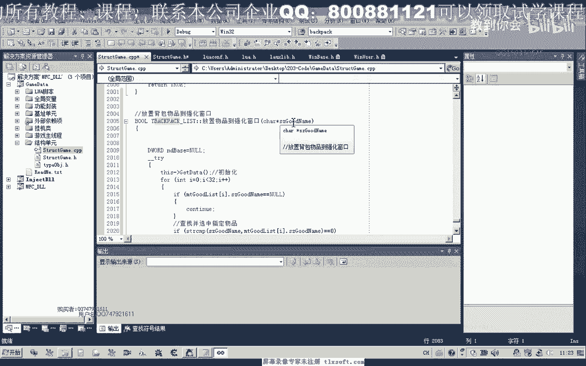
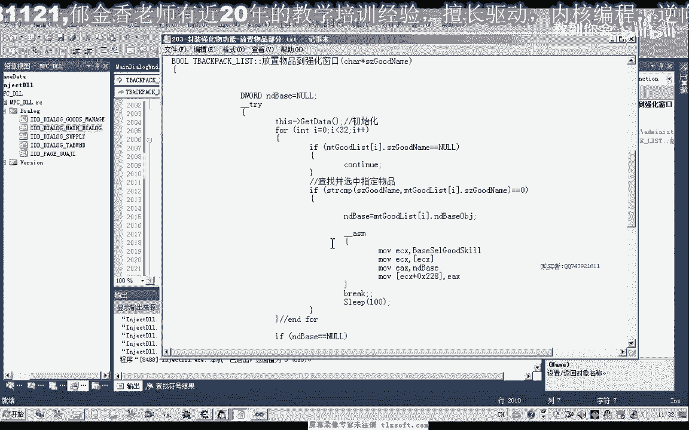

# 郁金香老师C／C++纯干货 - P188：203-封装强化物功能-放置物品部分 - 教到你会 - BV1DS4y1n7qF

大家好，我是郁金香老师，这节课呢我们封装强化啊物品的功能，那么首先呢我们封装的是放置物品部分。

那么我们打开198克的代码。

咳。

那么首先呢我们展开我们的结构单元，在我们的背包单元里面的添加相应的函数，嗯嗯嗯，二那么放置在这里之后呢，呃声明了这个前置的函数之后，我们在cpp单元来添加相应的代码，到最后，那么代码了。

这里我已经为了节省这个时间呢，我已经把它写好了，嗯我们一起来看一下这部分代码的逻辑，那么首先呢我们也是呃会传递一个参数性能。

那么我们这的强化窗口呢，它只能放置两类物品，三对啊，一个是幸运符，一个是装备，另外就是强化石啊这三类，那么我们之前分析的时候呢。

它这里有一些区别，那么也就是我们在传递参数的时候呢，这两个都是零，那么中间这个参数呢有区别呃，如果是放置强化石的时候呢，这个参数呢是1a那么如果呢放置强化装备的时候呢，这里是16进制的0x18 。

那么实际上这两个参数的话，它是来源于我们的这个对象列表的一个机制啊，那么我们之前的一个分析的话，比如说我们呃放置技能到我们的f一到f 10窗口呃，这个技能栏上面的话。

那么实际上就是我们的这个技能栏的这个数组的机制，那么实际上我们嗯把这个装备放到这里边的话，这里呢一共有五个，它可能也是一个数组的形式，就是这个数组的机子，但是呢我们这里的话呃可以了，去找一下他的机子。

这个很简单啊，直接搜一下，在c一里面呢，他的机子应当就出来了，当然每次这个是变动的啊，里边的机子的这个数字呢不会变动，那么另外一种偷懒的办法呢，就是我们呢呃可以替换掉款。

就用以前的这个f一到f 10的这个机制来做它的啊，但是这两个参数的话，我们就不能从这个f一到f 10的这个对象列表的机制里边取，取出来的话，肯定它就不是1a或者是幺五。

那么所以说这两个地址呢我们就需要自己来写，当然如果我们是按照这种方法来写的话，我们就需要来更新更多的机制啊，这个究竟怎么决策的话啊，全看你自己啊。

那么我这里呢是直接就用的呃f一到f 10的这个机制来进行替换的，那么这里的话我们就用的这个f一到f 10的那个机子，然后呢但是这两个呢中间这个数值呢我是自己控制的啊，另外呢我们对它做了一个判断。

那么如果是强化石来放，放置的物品是强化石，我们这里的滤芯呢就是传递的1a那么如果是放置的不是强化石，可能就是装备啊，那么我们就是幺八这里传入的数字，它来源于我们的tab退出来进行一个压榨。

那么在之前的话，我们肯定还需要取得一些呃信息，也就是在我们的呃这个选中物品的时候，当然我们这里的话还需要来为我们的这个呃背包啊，背包的物品的话添加一个属性，也就是对象的地址。

因为我们在我们知道我们在这个选中物品的时候啊，那么呢需要写入像288这个地方呢，写入我们对象的地址，那么所以说在这里呢我们需要修改一下结构单元这个背包的属性，这里哈我们需要添加一个，嗯背包对象地址。

那么需要添加这样一段，那么在初始化的时候呢，我们就把它写在里边，在get到里面来修改，好在这个地方的话，我们需要来认识，关注，那么在这里呢我们就赋值为这里取出来对象的数值，这就是我们对象的地址。

那么有了这个对象地址的话，我们呢就可以尝试编译生成我们的代码啊，移到最后再来看一下我们的待遇，那么在这里的话，实际上这个扩了最下面的代码就是我们的放置物品，而这里的话这个参数呢就是放置物体的一个趋向。

啊这里呢就是我们放置物品的一个类型，相当于，在这里呢我们是先啊查找并选中指定的物品，那么他也是来通过这个判断物品的名字，便于我们整个背包列表找到之后呢，然后呢我们先选中这个物品啊，也就是相当于这一步啊。

那么第二步呢我们才是旺到这个这个这装备强化的这个列表里边的，放置这个物品，好的，我们接下来来进行测试一下，好调整工作目录之后啊，然后我们调用一下这个放置物品到强化窗口的后，那我直接在这里。

你看看后面的代码就不会被执行嗯，首先呢我们是放直装备，那么我们看放置一个什么装备，比如说我们先找到这个青铜护手，好然后呢我们再放置第二个装备呢，就是我们的强化石，这支线呢我们给它一定的反应时间。

那么我们先尝试一下，不加实力，咳咳，点一下测试，那么但是呢这个时候它会弹出这个窗口化，我们可以不管它，但是这个时候我们的这个装备和强化石呢，已经被放置到我们的这个强化装备列表里面去了，好的。

我们再来尝试一次，那么我们可以做一些更改，把这个相应的对话框呢给它取消掉，那么之前的话我们有分析出一个机子在这个地址啊，这里呢我们写入一，那么下次呢它将不再显示这个窗口，二。

那么首先我们看一下这个机子是否还能够用，那么我们发现的话，这个机子的话，他现在已经不能够使用，这个是字节的，好像还是，那么我们再来找一下这个地方。

哦还要加上一个四零看一下，显示窗口，31428040314，284246应该是这个吧，这个机子还能够弄，那么我们选一再来试一下，那么这个只是我们复选框的显示窗口，应该是复选框状态，314280。

那么我们再来看一下另外的判断是29c这个地方应该是vc x，290，我们再来看一下314294，那么这里呢应该写入一好像就是不显示，我们写入零的话，就会显示这个窗口，29c我们把它接入一下，a，八。

那么经过测试的话，这个唯一最下边的这个为零的时候呢，表示不显示啊，一明确，它是互相思维，确实，那么零毕竟这个组合的话是显示，哇这个是窗口的一个显示，应当是不是负选框啊，这个这个问题的话。

窗口它就不显示了啊，那么最重要的应当是第一个发现啊，第一个一定要为一好的，那么我们写一下呃，顺便看一下在机子单元是否有这个机子，啊那么这个机子呢是存在的。

那么这个机子的话就是我们之前的f一到f 10的这个ex啊，这个也很奇怪啊，嗯那么可能我们的这个取名呢有一些错误啊，那么我们把它替换一下，啊，那么后边这个的话是无关紧要的，可以不行啊。

那么我们先这样做一下测试，把它移到我们的日常处理里面，好再次编译生成一下，哈。

哈哈，好的，那么这节课呢我们暂时就写到这个地方，那么下一节课呢我们再来呃，封装这个强暴国产的这个库啊。

