# 郁金香老师C／C++纯干货 - P190：205-完善强化函数 - 教到你会 - BV1DS4y1n7qF

大家好，我是郁金香老师，那么这节课呢我们来玩，完善一下我们的强化函数，那么上一节课呢，我们的基本功能已经完善了，但是呢我们就是强化的次数呢，我们需要判断啊控制，那么之前呢我们有分析一个属性。

在之前的课程里面，那么之前里边在300这个地方呢，它有一个物品强化了几次。

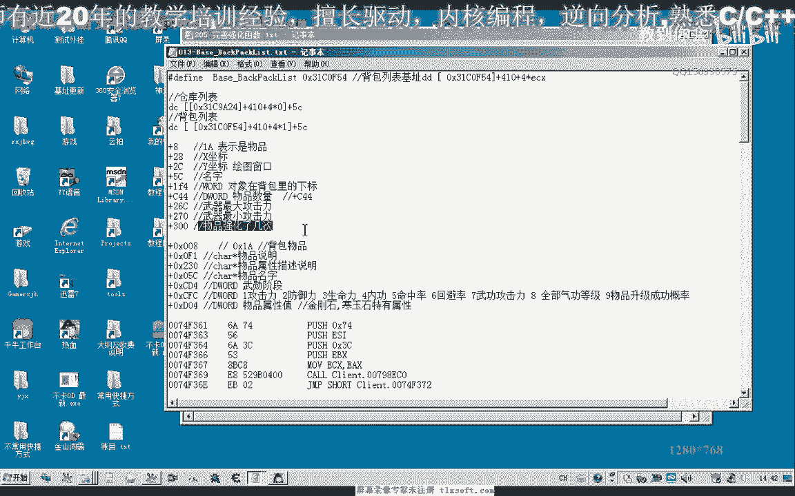

那么但是现在300这个地方的话呃，它已经不能够显示出物品强化的次数了，也就是说这个偏移呢已经发生了变化，那么这节课呢我们重新的呃，重新来搜索一下，那么首先呢我们以呃第一格的物品为例。

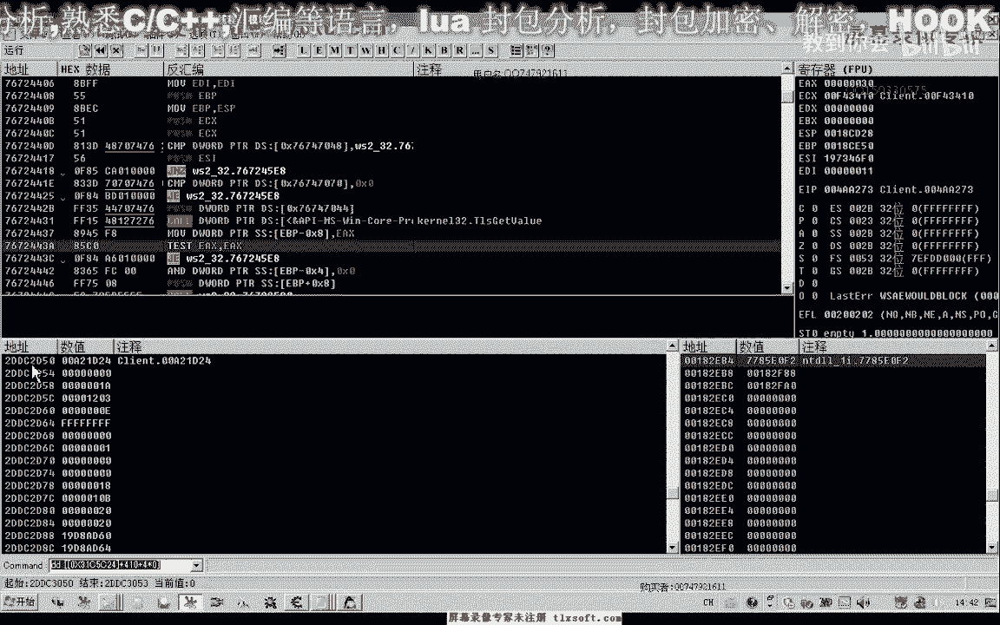

那么搜索的时候我们附加到进程首地址二，dtc 2 df 0，然后呢这里我们，也福利啊，或者是加上六啊，嗯16进制的4000字节的话应该是够啊，400字节，那么这个时候我们看一下，第一格的物品的话。

它强化的状态呢是一，那么我们是不是字节类型的就可以，然后我们再一次把它强化一次，那么这个时候呢，嗯强化的数值为二。

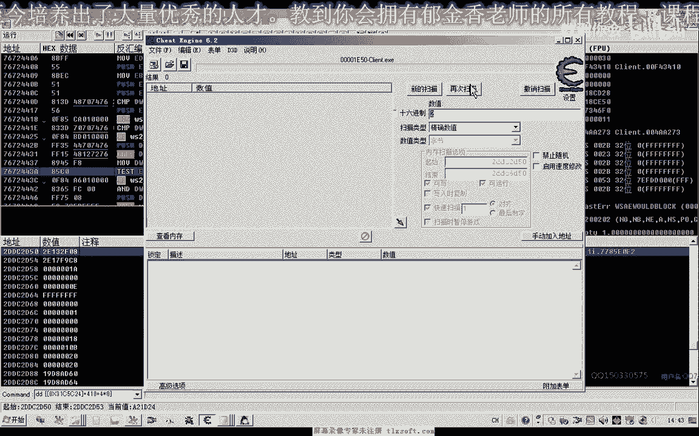

再看一下，加上四，清除过手。

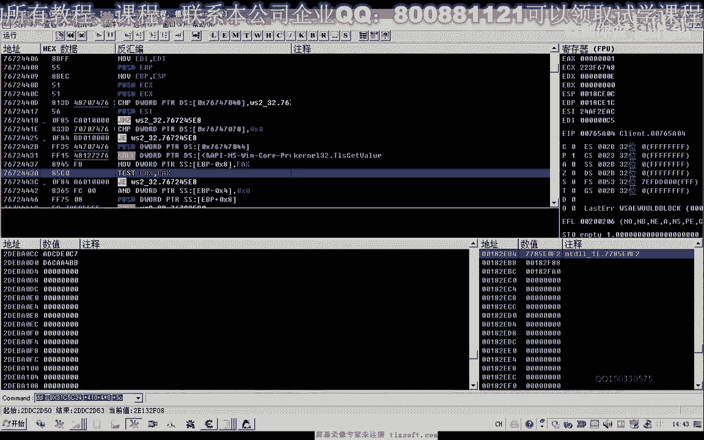

再看一下我们的，对象地址，2d1 b，201p n070 a0 ，那么这个才是正确的，搜一下数值的二，然后我们再次强化法，呃搜索数字三，那么这个时候只有两个数字啊，我们就可以画成两个数字了。

添加修改一下，然后呢查看，那么这个时候呢，我们显示的强化阶段呢是八啊，那么证明这个是它的这个。

我们再来查看一下，那么计计算出它的偏移的话是d04 ，那么最新的偏移我们把它修改一下。

第零四，那么实际上就是这个物品的一个属性值，也是在这个位置的啊，发现，那么我们看一下其他的呃这一类的物品。

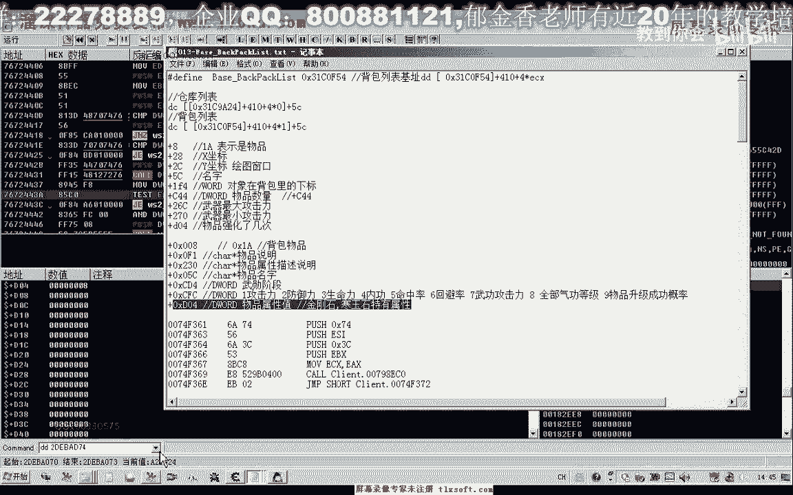

它又是怎么来表示的，那么这里呢他应当也有一个属性值，那么这里比如说防御力47啊这一类的，我们来看一下它是怎么来表示的，第二个，加上b04 ，那么这里呢他也是强化四阶段，然后呢这里我们能够看到一个七。

两个七啊，三个七四个七，那么这个七的话应当就是它的呃，这个合成的这个物品，我想的这个是房区，那么这个二的话应当是这个防御啊，他应该是它的类型的话，应该是这个指的这个含义时啊啊，而且是防御力期。

那是可能是这这样两两个绿的，后面的这里也是挨着的，那么从精灵四这个地方开始是啊，那么后边这个二的话，应当是表示的是它附加的这个属性的，石头啊，石头的类型，比如说是含义时，那么呃而且是防御类型的。

那么这里呢因为它是七，那么我们可以改一下，那么如果我们改为三的话，看有什么效果，那么这个肯定是防御力等于六，我们试一下，那么第一个的话就是生命力流了，我们看一下，那么这个三的话就应该是表示了生命力。

那么我们改改变为复试一下，那么五的话是命中率啊，我们能够看到，那么这里的话这两个它相当于是一个数组，一个四字节的数组啊，我们看一下是几次九呃，那么这里的话三四十12，那么前面这是强化的属性。

强化属性从这里开始来算的话，呃，3644 16，然后到这里，那么这里应当有七个字节啊，每一段，那么这这七个字节来，用来描述它的这个属性，那么前面这里的话我们就可以嗯，我们也把它记录一下。

那么这里应当是一个数组啊，从这后边来开始，那么这个数组的第一个位置的话，就从这个位置开始，我们来看一下，那么这里从d10 这里开始来，是一个属性数组，加上我们的d10 。

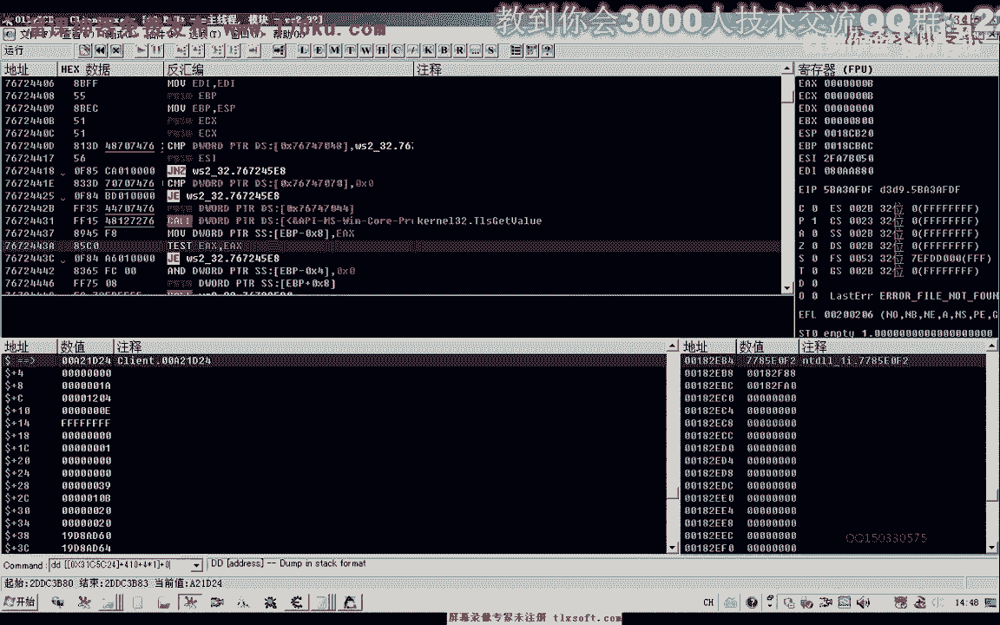

那么这里是它的一个属性数组，那么这个数组呢一共有是dw，word类型的一个数组，那么我们如果用t来表示的话，那么这个数组呢它一共是它的大小呢是七，那么这个t一这个位置呢啊应该是t0 。

这个位置来用来表示它的属性，那么t3 这个位置呢用来表示它的呃，这个属性值啊。

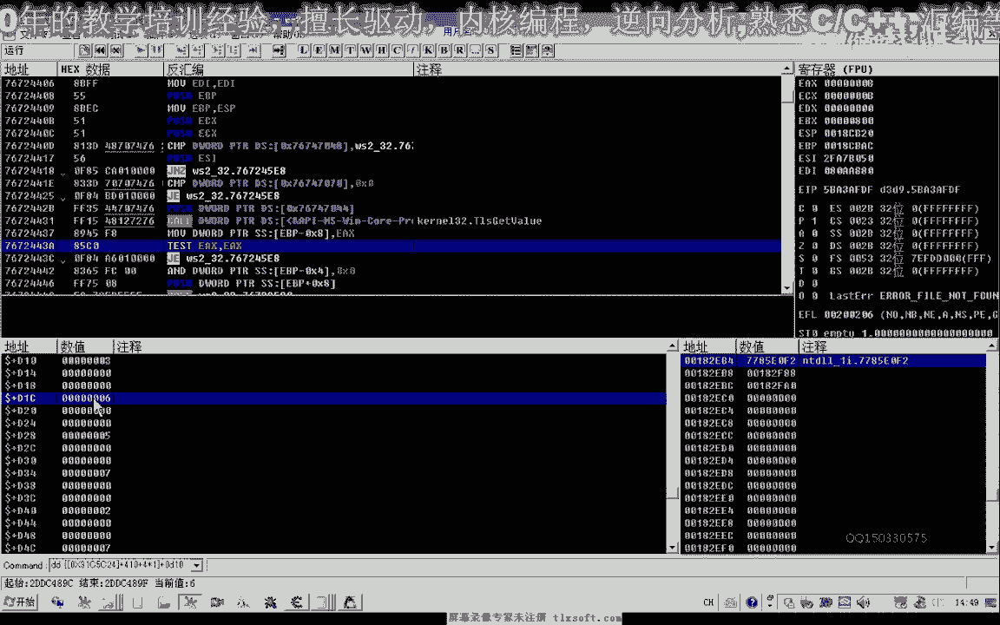

这里是它的类型，这下面是它的属性值，t0 ，那么表示的表示不信卫星，那么t3 这个地方呢表示不幸是。

那么我们可以找一个没有任何属性的装备，来改一下，那么这里是五六啊，我们以这个下边六这个来改一下，那么下边六的话，我们看一下，这个时候呢它是没有任何属性的，那么我们可以跟他改一下。

那么首先我们改为防御力的啊，他是就是防御力，然后三这个位置我们改为啊方方这个说法，那么这个时候我们再来看一下，这个时候呢它就是一个防御力八增加好，那么接下来我们再改好，然后是12347啊。

从这个位置开始搞。

它只有这里应该是六啊。

它的这个数组的大小应当是六，那么我们从这里开始改的话，我们又改为二呃，再数下来一二十提升这个意思，比如说我们这这一颗石头，或者是防10 16哈，这里边就是防御力16正向，然后我们再往下数，这个位置啊。

如果我们再跟他合成，也是防御力的，或者是三，好像是生命力，生命力我们比如说100增加，再来看一下，那么100的话，这里是这个100的话，16进制的35 六，那么我们再来看一下，那么这里的生命力啊。

增加稳定，当然我们也可以，一般来说的话，这个数字呢我们会改为统一的啊，过程的时候，那么最后呢我们还可以添加一个啊，这里呢也是二啊，然后呢应该是这里的标注，那么这样的话我们就可以把这个装备来改。

为了活成了四颗和这个防防御力16的，那么另外的话我们还有一个第一名四，这个地方，它也是一个属性的描述。

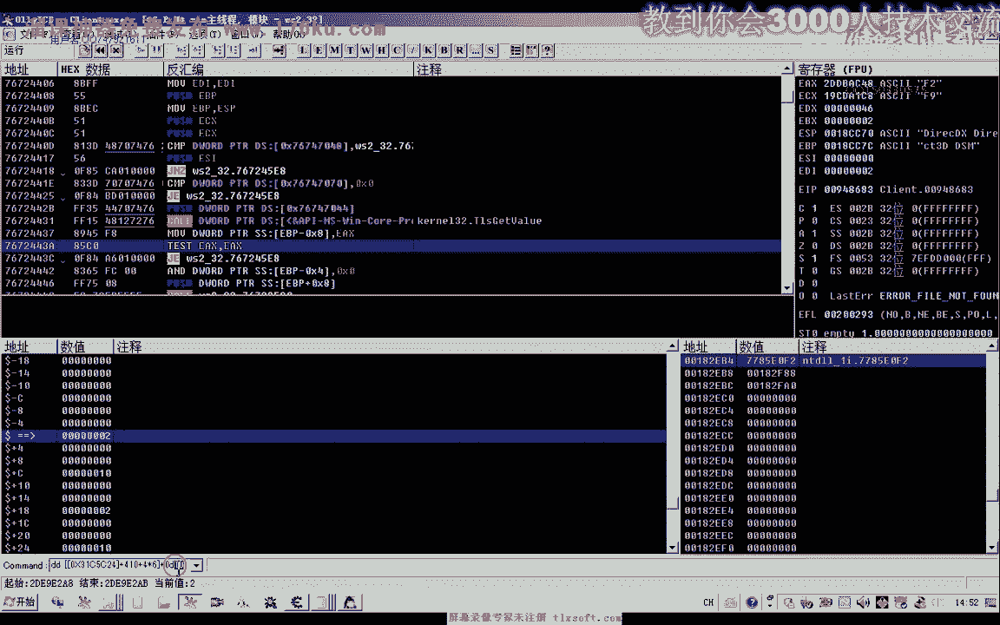

那么零四我们看一下，那么这个地方是指强化了几次啊，我看一下，d04 。

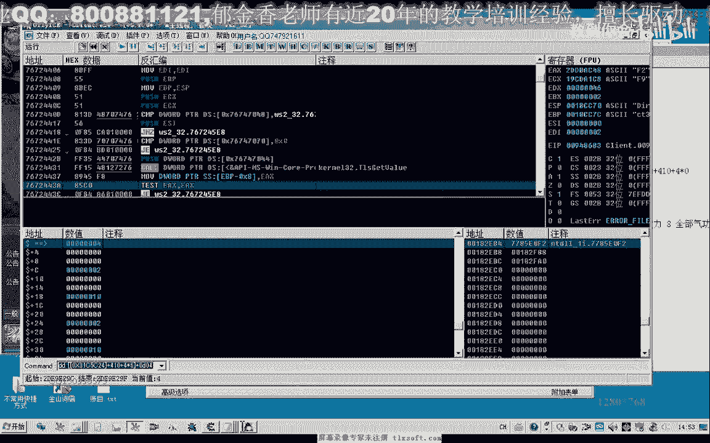

物品属性质，那么我们再来看一下第一个这个题，这里为八，那么第二个呢，那么这个四的话，前面还有一个，这里有个二啊，这里有一个是，然后再是两个，那么它的实际属性应该都是一样的，那么这前面还有一个二啊。

应当是，那么我们再看一下第六个，那么在这个位置呢再改一个二，这个时候呢是强化世界到底啊，那么如果我们这里改三点一下是什么情况，我生命力增加多少多少，这后边会有一个，那么我们这个改为一了。

嗯防御力增加24，那么这里它必须要有一个数字，表示有没有强化，可能是这样的一个意思，那么这个数数值只要是大于零的话，可能就是已经强化了啊，强化了几阶段啊，一般是这里是二，再来看一下，又是四。

那么这个数值的应当是必须是二啊，这两个月需要配合使用，那么这里是强化的阶段数啊，那么这个二呢可能有另外的意义呃，表示强化增加了一个什么属性值这一类的，那么它的这个结构的话，我们看一下。

从这个地方实际上开始，它都是一个属性描述的一个结构啊，这个二呢，第一个它可能是表示的是强化阶段，那么第二个呢就是后者后边啊，附加的一个属性，那么我们看一下这个偏移是从多少开始的，那么实际上这个位置的话。

应当是从这个cf 8这个位置开始的，cf 8从这样来分析的话，那么这是它的第一个属性，那么每个属性呢它占的应当是嗯七个单位，六个单位好像是看一下再看一下，123，123，应该是六个单位的的。

这样一个结构来描述的话，那么我们把它完善一下的话，这个呃这个结构我们，那么我们随便下定义的结构，比如说tp，那么这样的一个结构的话，它实际上有一点类似于还在，二那么有有两项呢是未知的，那么第一项呢。

那么是这个它的一个属性值，那么后边这两项的话，是一个未知的一个数值，那么这里呢是它的一个属性词，那么后边这两项呢可能也是预留的啊，一些未知的一些数字，那么可能就是这样的一个结构。

那么这里的话我们可以看到第一个呢，热量表示表示防御力增加，那么也表示强化，那么大概是这样的一个结构，那么实际上我们把这个强化的话，应该把它分出来，那么这个强化的结构呢。

可能是与这个类似的，但是我们后边的话，这个二呢我们明显的表示的是防御力，那么我们第一个二呢，他这里的话表示的是强化啊，在这里好像是有一些不一样，那么这里的话它强化的数值就不会增加了，一也会增加。

那么这个数值呢必须为一或者是二塔强化，一阶段，二阶段可能是这样的一个意思，啊，啊那么这个强化的强化21的话，那这个呢它还会增加一些，其他的一些属性，它都是通过这里来计算出来的，好的，那么我们最主要的。

实际上就是需要的这一个属性值啊，就是要加上的cf 8 d04 这个地方，104这个这个属性。

好那么我们既然分析清楚了之后呢，呃我们接下来呢就来完善我们的这个函数，那么打开我们之前的，拜拜。

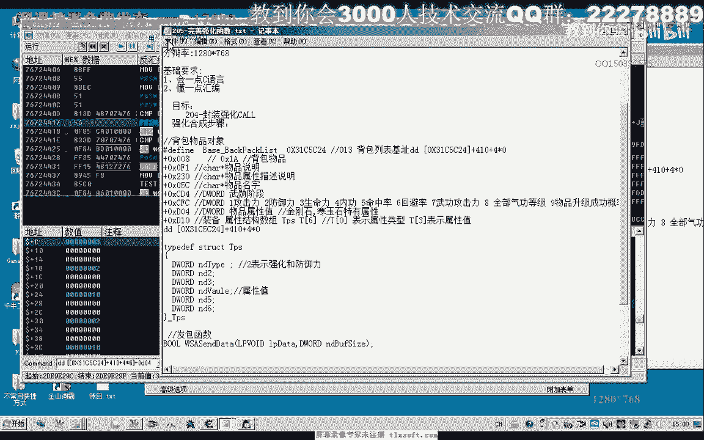

打开我们之前的代码，那么我们在这里呢，我们再分装一个单独的函数，在功能单元，你当时在主线程单元，还是我们先在结构单元里面碰撞，那么这个呢我们是指的强化解释，如果已经达到这个次序了。

他就不会不会再再次强化这个物品，那么我们相当于啊存在一下这个函数，那么你到最后，把上一节课我们的测试代码复制证明，那么这里的话替换成我们的相应的名字，放置要强化的物品，然后呢再放置我们的强化石啊。

最后呢强化我们的物品，那么在强化之前呢，我们先要做一个判断，在这里是否达到指定的这个次数，那么这个判断是否达到强化次数的，应当是在放置物品的时候呃，这个框里面的判断，那么在这里的话。

我们判断了我们需要对这个物品的话，需要添加一个属性，在这个地方，那么我们这个属性呢，就是我们刚才所分析的呃d04 ，嗯行，然后我们需要在gttt里面呢，来添加物这个属性的进行赋值，嗯嗯嗯，嗯。

好那么我们再次编译生成一下，那么我们在偏离这个物品的时候呢，我们就需要多加一个判断，那么我们选的时候呢就需要了呃，这个数值来小于这个强化的这个数值，那么如果是大于等于这个传递进来的，强化次数了。

那么我们继续找下一个要强化的这个目标，或者是直接退出啊，那么我们再来看一下。

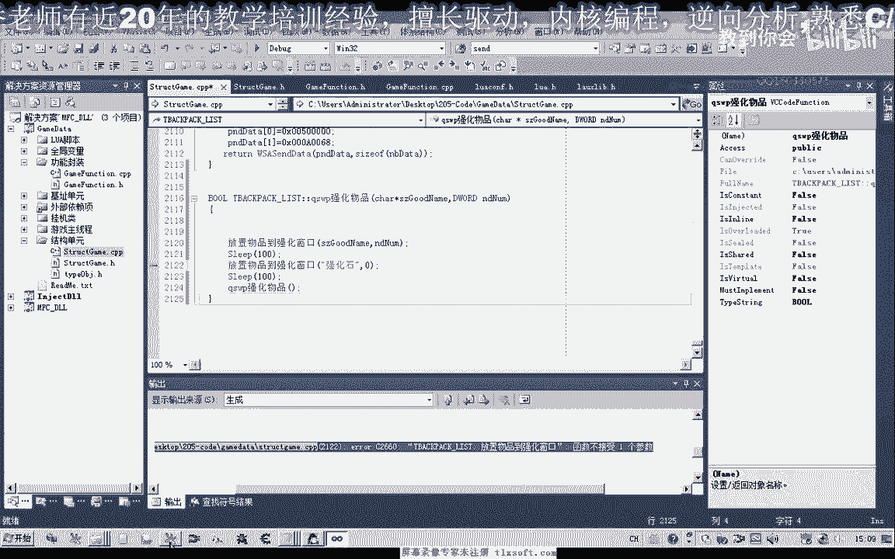

这个强化石的这个属性。

四，那么它本身是零啊，那么默认的情况下呢，我们就呃传入这个数字，零在这个地方，好的我们再次测试一下，那么我们刚才在这个代码里面呢，我们测试的都是强化四阶段啊，每个物品，那青铜护手或者是我们的靴子，如同。

好的我们测试一下，但是这个时候呢，我们发现我们的这个强化石没有放上去啊，因为我们的这个判断呢不对，还需要修改一下我们的代码，在放置物品的时候强化次数啊，我们再来看一下，那么并且呢。

我们这里呢还要加上另外的一个条件，它的这个物品名字呢，不能够等于这个强化石，嗯嗯。

嗯，那么这个不是强化石的时候呢，我们才需要进行这个判断，那么我们在外层给它加上一个e，那么我们再来试一下靴，靴子啊，那么这个呢它已经强强化了四次，他就不会去强化啊，那么还要注意一点呢。

我们需要添加这个相应的延延迟啊，等待这个地方我们可能需要再添加，让他等待一段时间，好吧好的，那么这节课呢我们就讨论到这个地方。

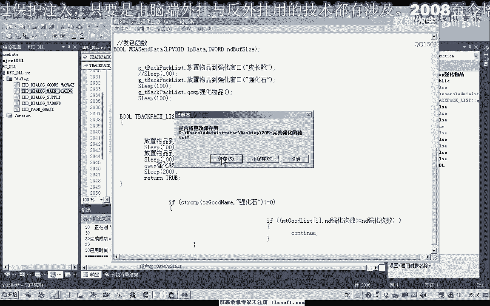

