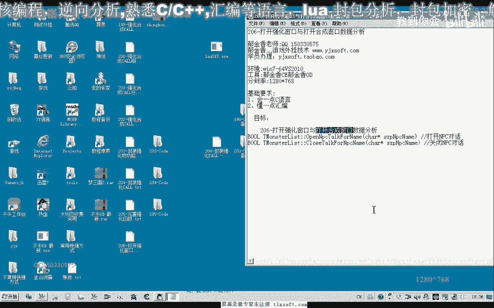
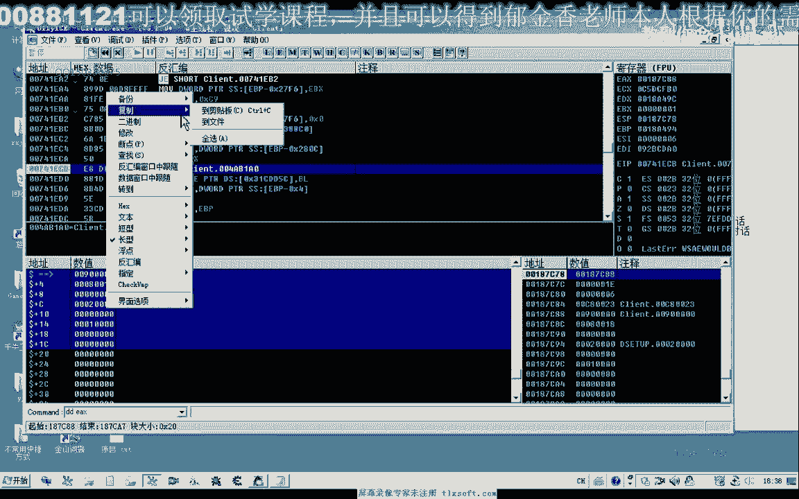
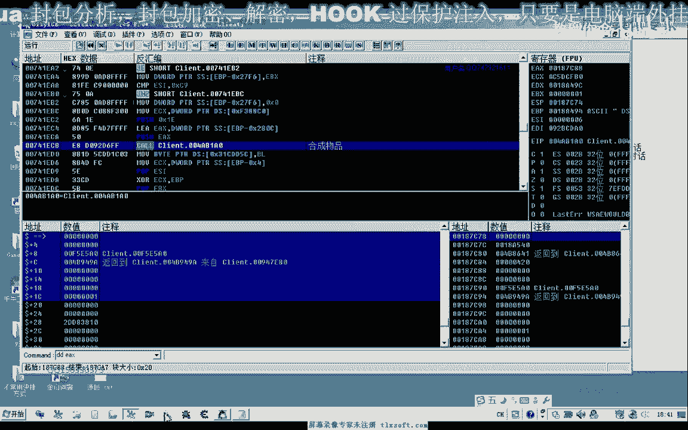
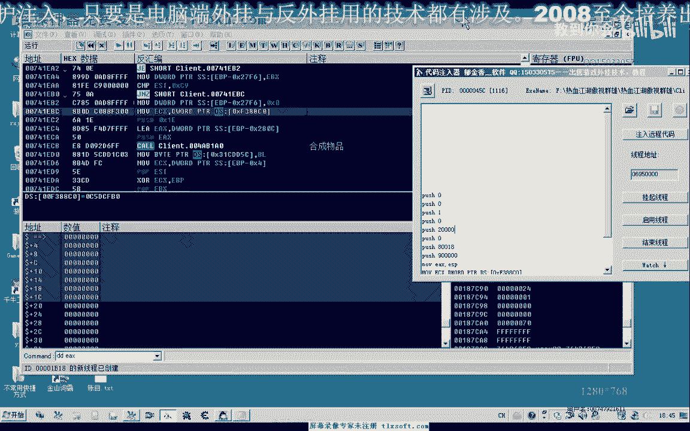

# P191：206-打开强化窗口与打开合成窗口数据分析 - 教到你会 - BV1DS4y1n7qF

大家好。

我是俞慶湘老師，那麼之前我們已經分析了強化活程的關鍵的數據，放置我們的物品以及我們活程裝備，那麼我們還差一些步驟，就是打開強化與活程的窗口，還有以及關閉我們的強化活程窗口，但是我們的打開NPC對話。

以及來關閉NPC對話，我們都已經安裝好了相應的函數，那麼我們所缺少的也就是打開強化，以及我們合成裝備的這兩個窗口的一個數據。

那麼這幾個我們一起來分析一下，那麼首先我們之前已經分析過，打開NPC這一步的話，我們已經分析過，主要是怎麼打開強化的窗口，以及活程的窗口，那麼根據我們之前的分析經驗的遊戲的話，那麼在打開窗口之前。

他都會向服務器發送數據，然後由服務器回傳的數據來打開了窗口，那麼所以說我們只需要向我們的服務器，發送一個相應的指令就行，那麼我們可以在，把包的函數上面的下斷點，打開我們的強化窗口。

所以一定是要按下了之後才斷下的才有效，如果是沒有按下數然後就斷下的，那麼可能是其他的心跳包這一類的動作，那麼我們回溯兩層，跳到這個地方，下一個斷點，然後重新我們關掉窗口之後，再來打開一次，強化。

看一下它的緩衝區，那麼我們根據以往的經驗的話，我們只需要把緩衝區的數據放進去，另外我們已經封裝好了發包的函數，那麼這一段需要複製下來。

那麼這就是我們的強化，這個的話應該是我們NPC的ID，我們之前複習的，這可能是NPC的ID，不同的NPC的數據可能是不相同的，那麼它的緩衝區大小應該是X1E，我們只需要把這個緩衝區，的D大一些就行。

那麼在這個緩衝區的話是20個字節，應該是20個字節才對，36個字節，好，那麼這是我們的強化窗口的一個數據。

等不容測試，那麼我們在關掉之後再來看一下，那麼如果是活成物品的時候，我們看一下會是在什麼地方，點活成物品，然後回到上一層，看出F9，好像也是在同一個地方，在這個地方下段，那麼我們再重新關掉，再次測試。

好成物品，看一下它的緩衝區的結構，類似的。

那麼我們記錄下來，這個是我們的活成物品窗口，那麼我們注意NPC這裡是相同的，後邊也是相同的，不同的它只有一位，就是這個地方，不同的，這裡是，活成，那麼這裡是強化，好的，那麼接下來我們進行一下相關的測試。

那麼另外我們發現的話，強化和活成的話，應該是同一個地方，經過的，強化物品，那麼首先我們用代碼輸入器先來測試一下。

那麼首先我們也是要給它構建這樣一個緩衝區，那麼我們可以這個緩衝區小的話，我們可以直接用我們的Push指令來構造緩衝區，如果緩衝區大了，我們可以直接在C++那邊編輯我們的代碼。

那麼首先我們最下邊的開始壓榨，我們先測試我們的強化，那麼先是4個0，我們全部改成0，一共是8個，那麼首先兩個0，這裡倒數第三個是1萬，那麼這裡有個2000，那麼這裡有一個8018，那麼這裡來有一個指令。

9是個0，那麼接下來就是ECX參數，那麼第一個壓榨的參數，我們在第一個壓榨之前，我們先把EX的地址先獲得，不然的話等一會我們壓榨的時候，它改變了我們ESP的地址，好，那麼壓榨第一個，Push EX。

Push EX，Core，Mini4FB，BAN，NTT，ESP20，那麼注意我們這裡一共是20個字體，那麼這裡為了實現一個對戰的平衡，我們必須要加上這20個字體，首先我們打開NPC的對話。

這個我們已經有封存，然後注入我們的代碼，那麼現在注入代碼的話，我們看一下沒有效，我們再來看一下，好像是我們封裝的數據有問題，那麼我們應該是先壓在下面的，這個次序我們放反，這個應該放在最下邊。

那我們再來看一下，還有一個8010，那麼最先壓占的應當是0，然後再是0，001，再改一下，001，然後再是0，這裡是2，1234，過之後再是一個0，8018，然後再是9。

好的，我們應該是這樣到處壓占，回去才可以。

好的，我們再次注入代碼，那麼這個時候我們就能夠打開我們的強化窗口，那麼另外還有一個關閉我們的NPC的窗口，我們已經有封裝了，下面的這個函數直接把NPC的名字輸入進去就可以了。

好的，那麼接下來我們再打開一下活程窗口，那麼合成窗口的話，它只有一個參數不一樣，那麼這裡是6，注入的就是一個裝備活程的窗口，那麼到這裡為止的話，我們自動強化活程裝備的所有的數據就已經找齊了。

那麼這下面的這裡需要改成6，這上面的這裡是8，當然我們寫代碼的時候，我們會更加的方便，因為我們另外封裝了一個發包的框，那麼下一期可能我們進行相關代碼的封裝，那麼這一期可能我們暫時就討論到這裡。

下一期我們再見。