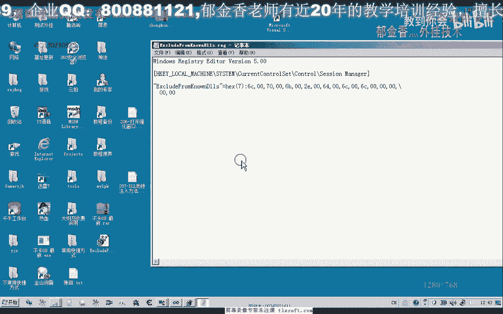

# 郁金香老师C／C++纯干货 - P192：207-DLL劫持注入方法-Xp-Win7_64位通用 - 教到你会 - BV1DS4y1n7qF

大家好，我是郁金香老师，那么这节课呢我们一起来看一下劫持注入的方法，动态链接不节制注入的方法，那么我们以这个来到pk t l啊为例，那么因为我们这些游戏啊，基本上还有这些相应的软件呢。

我们在运行的时候，它一般呢我们都可以看到，它都会去加载这个l p q这个图层里面。

然后我们在考试前，我的观点你可以看到暂停一下，在这个位置我们可以看到它在我们的这个s系统目录下啊，把pk点体验了，这是我们36的基本上都会调用，还有这个什么m s f c这类它都会调用。

那么一般我们用这个l pk嗯的这个截止注入人比较多一些，因为它涉及到的相关函数比较少，那么我们可以一起来看一下它相应的资源目录啊，这就是我们在系统目录下搜索到了这个函数。

那么这个这里边呢它一共有11个函数，就是这11个函数，那么这是一个函数，我们就是说要来写它的话就比较方便，因为它涉及的函数呢比较少，那么我们简单的说一下这个劫持注入的原理啊。

因为比如说他要调用这个来pk啊，这个动态链接库的时候呢，它一般是先搜索啊，比如说我们这个游戏为例，那么在执行这个ex e的时候呢，它会先在这个目录下面找是否有这个l pk的这个动态链接库，如果有的话。

他就会直接来自动的加载这个目录下的l pk，那么所以说我们要向游戏注入的话，当然就是在这个地方这个目录下面放一个pk的动态链接库，比如说我也写了一个动态链接库，然后呢写了之后呢。

把我们的这个啊游戏的动态链也不写正确的，这样他就能够实现自动的注入，我们先来看一下效果，那么这个时候我们可以看到，它在自动启动的时候呢，这两个工作文件的话实际上就已经注入到了我们的这个游戏窗口。

这时候截止函数运行之后就加载了这个代码，从而来实现了一个及时的注入，那么实际上呢嗯我就是在这个游戏的目录下面把自己写了一段代码，然后呢再在下面放了一个lpk，把替换掉了系统这个pk当然如果把它删掉之后。

它就不会再断代码，然后我通过这个l lpk呢，然后呢来载入了这个my deer，这就是信息的这个代理，那么我们先把这两个文件删掉，那么我们一起来看一下它实现的一个过，程代码具具体要怎么写。

那么首先我们就是说我们写了一个l l pk的这个动态链接库呃，因为要提供一个有游戏调用，那么所以说我们肯定要实现相同的功能，那么这些功能呢它就会通过这些套出符号表现出来，因为它会进动态的调用。

这些套出了不好的定义卡，那么我们先用vs 2010啊，建一个动态链接库来写我们的代码，那么在这里呢我们选项目同样的选工商人控制栏，然后取了名字，取名为卡拉pk或者是其他三名字的特点。

但是最终我们生成的时候呢，我们要把它改他pk的dl，那比如说我们改名为i l p p，然后我们在这里呢选动态链接库就完成，原有的这个动态链接库呢，我们可以把它移除掉。

因为我们要自己写一个这个相应的这个主函数啊，你看你这个函数来替换掉，然后呢我们在这里建一个啊shift的文件，就这也叫mmp，然后在这个图文件里面呢，我们需要添加一些初始化代码，就是这一段。

那么这一段我们就不详细的说了，这个是我们cp p里面的，就是我们要注入的代码，还有，那么接下来我们看一下my pk的平台，那么就是下边这段，让我们一起来看一下它搭建一个一个基层。

那么首先呢我们也要注册我们的这里进行包含我们的图文件，图文件来看这个图文件接口，这放在前面的话，那他他也需要用到windows这些通讯啊，又给你们直接就行，那么在这里呢我们另外的套出了。

也就是我们刚才所复制出来的，这是一个函数，要实现一个与它相同的一个功能，我们可以看一下，在这些没意思的函数在这里来实现了，只是排列的数据可以吗，那么实现后面呢这里呢是一个套出一个编号啊。

那这个应该是可以的，那么在这里的话，它原有的这个函数呢就被替换成这个根啊，就是游戏的一个后排的一个函数啊，自己写这个函数，那么我们可以在后面找到我们这个，函数，那么前面我们注意这里的卡带个下划线。

但是后边呢它会带，因为我们的这一组申请了这个c d e c l，他套取的这个符号呢会有一个下划线在前面啊，那么那么实际上在这里呢，我们就会去获得它本身的以前的这个函数的这个地址。

那么我们来看一下这个函数是怎么来获取它的进程，那么实际上呢我们在这里呢，他也会去找啊，现在怎么某一个动态链接库里面去找到，他看一下这个模块，其实初始化这里有个load mod，初始化的这个函数。

那么实际上呢它就会先获得一个系统的目录，那么系统目录啊，然后系统路径获取一次之后呢，然后这里在后面呢加上一个pk就pk gl，然后呢他才会到我们的这个动态链接库所在的这个这个目录呢。

然后呢再用这个真实的lpk加dl这个文件，最后呢在这里啊啊大概就是这样分析，那么在这里的话，它实际上也就是说一个跳转，比如说我们第一个函数的地方，它这里，因为我们购买一个带。

它实际上就是从路边的一个方式，那么也就是这一句他调用了之后呢，它实际上它的一个反应就是法国的一个他说的这些，这是我们真实的系统来pk，贴了里面的这个来pk初始化的这个函数，把这个符号的地址。

然后呢实际上这里的话这两句命令呢，它实际上就相当于啊调用到我们的这个系统，来到pk函数释放的这个函数，那么后后边的也是一样的，它也是相当有快加入到参数方面呢，这里他不管，因为它是从右边的这一点。

我们是用qq，原来我们看一下这个很好的定义，有耐克nike，他前面的是这一句话，说的是一个初步编的事情，就好好，那么大致就是这样一个呃一个结构，那么后边的这些一次呢，我们都按，照这种模式来写。

那么这样呢就实现了一个跳板，也就是说我们这个跟他做的这个假的这个pk的这些函数的话，它都会跳到这个真实的函数上面去执行，那么这样就确保了这个动态链接扩大的功能不会出错啊，不会出错。

那么我们自己的代码在哪里，那么我们自己的代码呢，实际上就在我们的这个截止的这个动态链接库，它的这个函数入口啊，动态面积和这个函数入口这里来完成，那么如果这个dna的l它加载的时候。

它会产生一个消息在这个变化，那么我们在这个消息我就直接的，来进行明白这个logo啊，这里logo呢是初始化，看看这初始化做一个初始化的操作，那么另外还有这个pk e d i t方程呢，这个呢比较特殊。

它是一个数字，那么所以说这里我们要用零破皮了啊，不是啊，我说个事情这样一个数，这个这里边因为这个a p p e t i t当中它不是一个函数，它掏出的是一个数字，是这那么在这个位置呢就是开始。

有先进文化去看自己就在这个i t的分层，那么最终呢是这个地方，比如说我们在这里的话，我们可以就直接加入我们的mfc，这也就是我们游戏的这个动态民族在这个地方来载入。

当然在后边呢我们还可以是还可以添加上其他的一些信息啊，比如我们的中单用户啊，就成功了，这个例子好了，我们再次编辑申请一下，这里我们选择了历史，而不管你帮帮忙这些黑木生产，那么编译生成之后。

我们最后呢在这里只提一个最近的目录，好再生成一下，然后我们在资源管理器打开，找到我们的ml p q，那么这个时候的话我们的这个替换的啊，要截止的这个函数就写好了，但是这个函数写好之后呢。

它注入的代码是这一段啊，相当于就是这两句或者是整个函数，那么而我们真正的游戏的代码是放在这个动态链接库里面啊，所以说关键还在这里，关键在这里好的，那么这里这个时候呢。

我们就可以把我们的这个来lpk这个文件，放到我们的这个客户端目录下，那么这个时候我们需要证明把它改成系统下面的这个来pk的啊，一模一样的这个名字，那么因为呢他会先搜索这个目录。

然后呢如果这个目录它不存在这个pk的这个动态链结构，才会去搜索系统目录下，那么在搜索他的时候呢，我们看到了里边呢他也会去调用这个mfc的dl的，那么这个dl就是系统，那么我们把，就把你扣。

这个mf c接的话过去，这就是比较注意的这个pl，你放到这里，右下看到这种图形，然后呢我们再来运行的游戏，当运行到我们点游戏开始啊，当我们的客户端运行的时候，看到他就会。

这个人就会显示出来我们的动态链接不了，就会被载入，就不在意，就是这里了，他也不行事了，这节奏的还是成功了，当然以后的这个注入的话，我们可以把这一段可以把它去掉，这只是我们的一个测试。

那么后边呢我们先生成一些，然后再把这个系统算进去，因为已经进入到游戏，所以说我要退出一线才能够删掉，好的，那么这个时候呢我们在这里，好的，那么这个时候来到gk我们这里呢把它改名，改名之后呢。

他就只是会更新这个文件，那么我们保存一下，那么我们看一下是不是我们的动态链接库真的被注入进去，我们可以通过修改这个动态命令的界面，或者是置于一些其他的信息来做一个确定，然后比如说我们在界面上加一段信息。

我们就可以看出来，然后测试一这里，比如说我们就可以了，ul坚持，然后保存一下，心情，好的，我们再等一下哈，这个时候呢生存好了之后呢，我们可以等下一次的时候。

我们就可以直接把这个代码到游戏下边进行切换就可，好那么下次呢我们再打开游戏的时候，它就会自动的投入，而且是优先的检查，还要给我们的这个界面，好像还有流星一起用，是系统，那么我们在这里会看到小米。

而且我们每天都看到一个作品的这个进程，这个他说的进程就是这个游戏的进程，有些同学他有一，那么要注意的一点呢，就是我们win 7下边呃的注意的话。

还需要一个地方做一个修改才可，聘礼是说直接这样就可以了，那么我们在运行里面或者是开始努力，这里所有提示建筑r n g e d i t打开我们的注册。

那么需要在这个路径看到这个路径，那么这个路径下面呢，我们需要在这，个建一个多字节的啊，多字节字符串，我这回设置窗口用这种类型，然后呢在这里面呢加上我们的这个lpk这个动态链接库。

这样的话经过这样的一个注册了，我们才能够照顾win 7它本身的一个保护啊，才能够注意到，好了我们把它设置一下，那么实际上我们还有更简单的方法，那么我们可以把这一段把它掏出，这项套出套出到我们的桌面上。

但是呢这个套路的话，它是包含所有位置等，我们把它删除掉，但是在这个时候他是靠出的是一个所谓的工资比较多，那么我们只需要找到我们的这个公司就可这段信息就行了，后面的这些信息呢我全部给它删掉。

还有前面的这些信息呢，他们也可以删掉，最后只保留这一项，就可能也就是这个路径，最后我们只需要保留这一项。

然后呢我们可以直接点击文件输入进去就可以了，我们在我认识的主体，再到这个文件里面看到同样的可以看到这一项，那么这样的话会比较简单啊，那么我们可以看到只要注入之后，双击进入之后，那么这里就这一项。

最后这种方式来较简单，更明显，就，好的还有这是我们的代码。

那么大，大家注意啊，这个注入之后呢，最好是重启一下电脑再来测试，那么一般就ok了，那么这节课呢我们就探讨到这嗯。

