# 郁金香老师C／C++纯干货 - P193：208-外挂控制台设计原理_old - 教到你会 - BV1DS4y1n7qF

大家好，我是郁金香老师，那么这一节课我们一起来探讨一下，这个游戏辅助控制台的一个设计原理，那么游戏的控制台的话，它可以通过一个窗口界面或者是一个进程，那么控制我们多个游戏和窗口。

那么可以实现我们啊多个游戏窗口的这个自动挡打怪啊，这个可以从一个界面啊来设置，那么它的原理的话，实际上也就是一个进程间的一个通信，那么进程间的通信呢，我们可以用之前的或者是远程调用户，或者是用套接字啊。

呃或者是用我们的管道啊，这一类的都可以，还有我们的这个共享内存这一类的，那么我们之前呢在这个c加加在这个过程里面，我们也有讲到过进程的通信啊，那么其中呢我们有一种方法来到这么一个涉及到了。

也就是我们用这个呃copy代替啊，这个这个消息来实现一个简单的进行通讯啊，那么我们控制台的话，我们也可以用这个呃cop对体来实现啊，好的，那么我们这节课呢我们先来看一下啊。

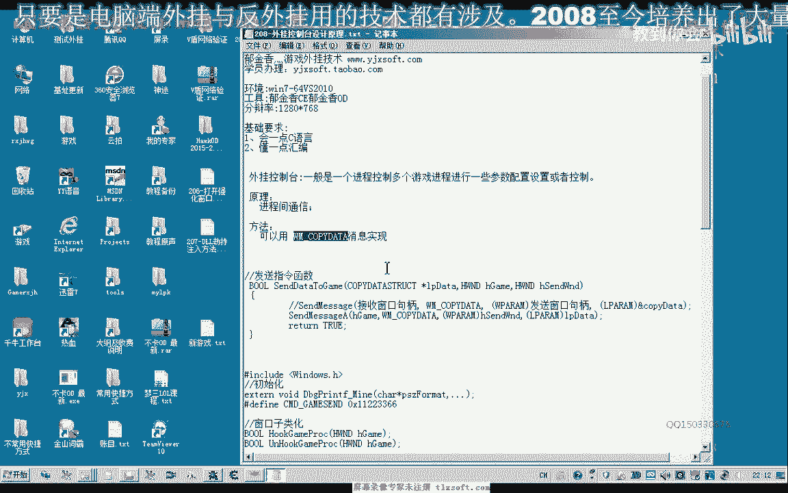

先来看一个例子。

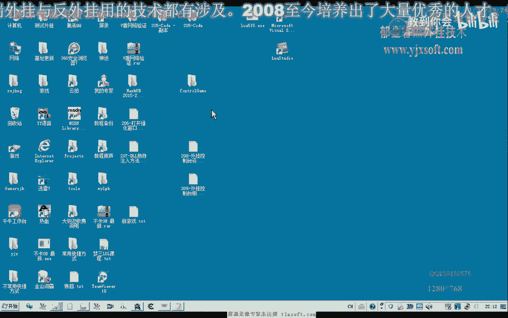

那么我们先来看一下只有一个游戏的情况，那么我们设计好了之后呢，这个控制台呢它肯定是可以控制多个游戏进程。

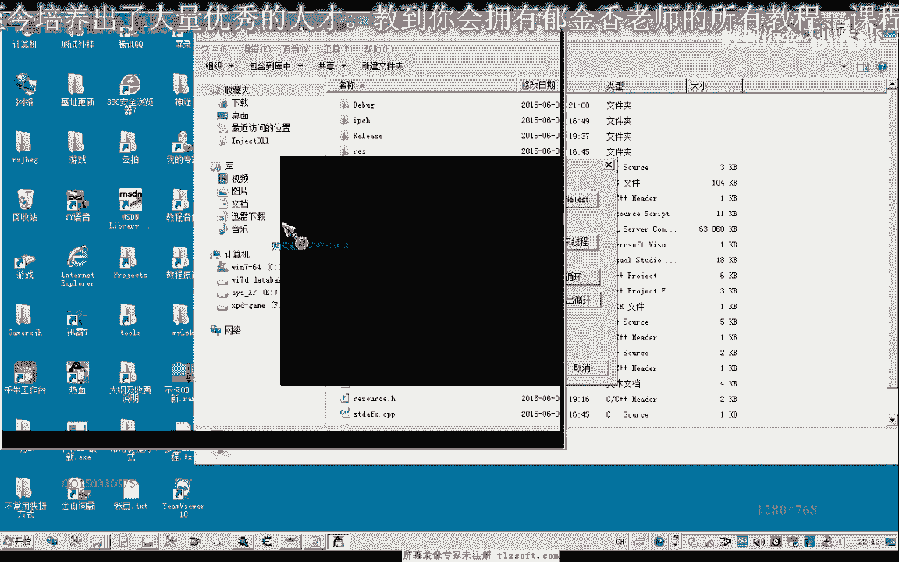

那么这里呢我们编写了一段一段代码啊，用我们的这个游戏来进行一个通信。

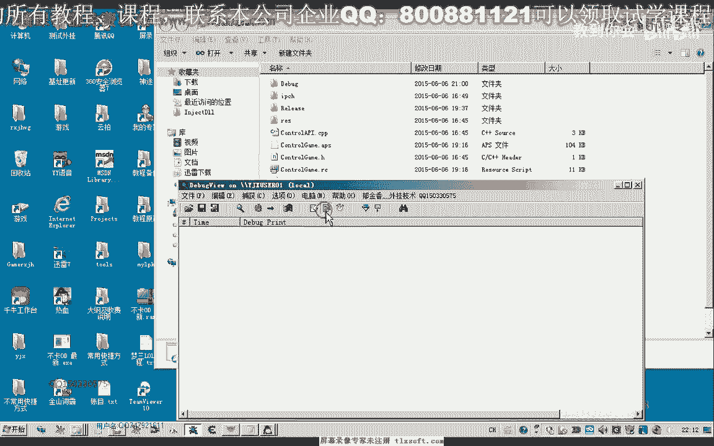

那么在这里呢我们会发现一段这个指令过去，那么我们的游戏进程呢，他会得到这个指令，当然这个指令的话，我们在这里呢也可以自定义了，也是我们测12这里，那么在这里的话就是我们可以看到有关信息的话。

实际上这段信息呢就是我们的发送进去的，然后从这里的话你都看出来，当然我们这里呢还另外还设计了其他的一个代码，我们可以把其他的这个代码注释掉，那么我们再来看一下，这样会清晰一些。

那么这样呢我们实际上就是像我们的游戏里面呃，发送到我们的这个在这里，那么这里的话是游戏进程，它接触到的相应的一个指令，那么我们就可以通过这些不同的指令来实现，比如说我们的呃挂机的一个操作，开始挂机。

或者是获取我们这个游戏里面的人物的一些信息，有个金币啊，或者是我们当前的血量啊，这些信息，或者是呃用来控制我们的游戏进程的运行某个脚本，或者是运行它自动打怪啊这一类的，那么它可以实现进行控制好的。

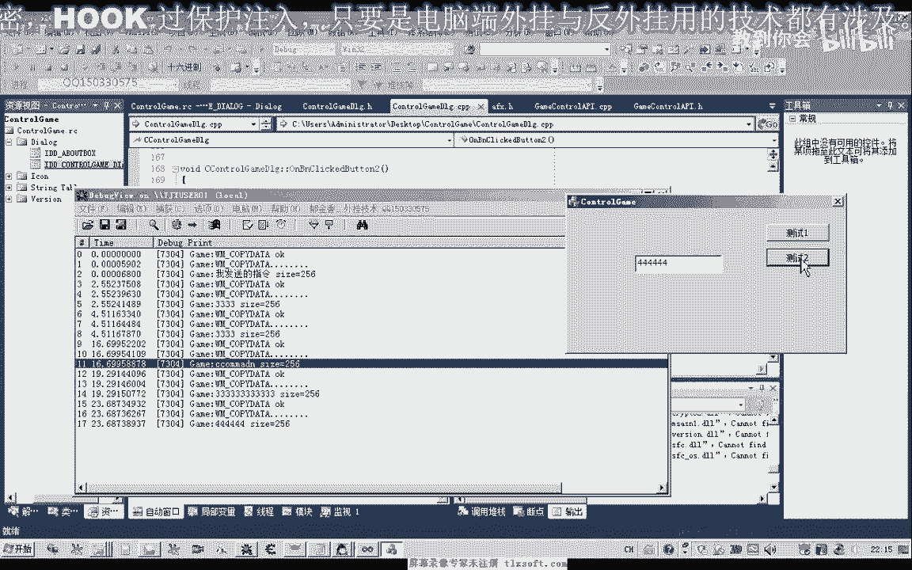

那么这节课我们还是具体来看一下这个代码应该怎么写，那么这个代码呢它分为两部分，那么一部分呢是我们游戏进程的一个代码，那么另一部分呢是我们就是说呃发送指令这一段的一个代码。

那么我们首先呢打开我们的vs 2010。

那么我们建一个新的项目，我们还是选择mmc，那么发送数据线上来，就新的背景，然后我们改一下，这里呢我们还是选多字节的字符值，那么在这里呢我们给他写一个相应的接口，那么在这里呢我们添加一个筛选器啊。

就叫做，游戏控制的一个接口，然后在这里面呢我们添加两个形象，一个是c p p的一个图文件，就叫做a p i，这，完全，哈哈，那么另外再添加一个头文件，新建项，那么我们就把这个相应的哈发送数据的这个接口。

来封装在这两个图文件里面，那么它最关键的地方我们说了，它实际上就是发送数据的话，就是用一个新的message来发发送，必须是send message这个函数啊，那么他发送消息的类型呢。

就是这个w o p代替，那么我们再来看一下它的格子，那么我们用这个copy代替的话，它在我们msd里面有一些要求，那么我们一起来看一下，那么它的第二个参数啊，在这里啊。

popularity的话它有一个参数项啊，也就是我们的嗯，这个呢它要求是我们发送这个消息的一个窗口啊，那么在这里的话，我们未来就用这个资源里面这个窗口的ip了，作为它的倒数第二个参数，就用他的ip嗯。

那么最后一个这个参数啊是message，最后这个参数呢它是一个populate的一个结构，这个结构，那么这个结构的话就是指的我们最后的这个参数来看一下，就是这最后的一个参数就是copy。

那么这个呢是我们发送窗口一个拒绝需要出，那么这，个是接收窗口的这个句柄，那么在这里呢我们就是一部戏窗口句柄，哈哈哈哈，就说我们要发送消息，那么我们要传递的消息呢就会存放在这个结构。

那么我们就来看一下这个结构，那么这个结构呢这里呢这个d w对体呢它是一个36的程序，可以是一个任意的一个数值，那么在这里呢我们可以通过这个数字呢来区分我们不同的命令，而这个cb代替呢。

它是指的我们这个下边的这个尺寸的缓冲区的大小，是指的这这一个结构的大小，那么这个结构可以是一个我们任意的你的自定义的结构啊，也可以是字串或者是其他的人物信息啊，人物属性任，意的一个结构。

它是没有一个固定类型在这里啊，那么这里呢就是用来指定下面这个结构的一个大小，那么这个是一个任意的数值啊，关键的是这两个，那么这两个都没有的话，这里呢我们可以有空可以有空，通过我们的这个大货币代替的话。

它会自动的把我们当前这个控制台的这个进程，这数据能传递到啊，传递到我们的这个目标进程，它会自动的有一个传递的一个动作，这个是由新的面试题啊，它内部来实现的，我们可以不去去关心他，好的。

那么我们先来看一下我们应该怎么写，那么首先呢我们对这个函数来进行一个简化，工装，那么首先呢我们这里呢这个是我们游戏窗口的一个具体，那么我们发送的数据呢就会投递到这个指定的窗口句柄素材的进程。

那么第二个呢就是我们发送的这个窗口具体生的啊，这个，好那么第三个的话就是我们的数据库标签，那么这里呢我们是它的一个地址啊，直接串，然后我们就调用这个cd message这个函数到底到底到底到。

所以这里一定要是深的message，而不是boss king mac，因为我们的这些数据的话啊，他可能是不是全局变量啊，那么我们必须要用深圳message的用处赛的模式啊，等它返回。

那么才能够保证了我们的呃接收端，那这个数据呢是完整的，那不然的话我们直接gucd mac之后的话，这个cp代替的数据它变化了，那么就造成我们的这个通讯的话不成功。

所以说这里我们就不能用posting的事情的土地啊，那么这是我们的第一个参数，第二个参数当然就是我们的codate，那么第三个参数呢我们要求的是啊发送端的车，具体发送端的一个窗口的具体。

那么最后一个呢就是考虑代替，需要进行一个强制的一个转化好的，那么简单的这样封装一下的话，我们进一步了，那么这样简单的运作的话，我们就能够向目标的一个窗口进行一个数据的统计了。

那么接下来呢我们写一个测试的一个程序，那么测试的程序呢我们可以这样写，ok，那么在这里呢我们呃直接，只需要一个这个发动中的一个，具体是的没问题，那么第二个呢我们就是一个字串。

那么其他两个呢我们可以通过查询这个游戏窗口的一个决定的呃，来实现，那么首先呢我们要获得一个游戏的一个窗口，一个具体，啧。

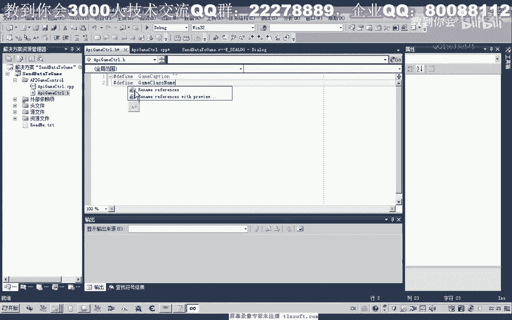

那么我们先取得一下游戏的一个窗口标题或录音。

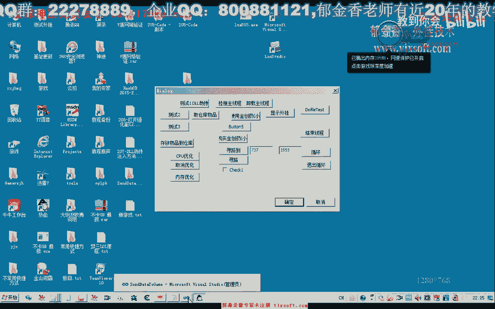

然后复制一下，那么有了这个这个标题和内容的话，我们就可以做接下来的一个测试，那么在这里呢我们首先要获得一些窗口，喜欢的温柔，in class，当然我们做测试的时候这样做。

那么我们呃最后呢我们可以用媒体来获取我们所有开启了这个模式，实现一个多个游戏窗口，一个控制，那么最后的话，好那么测试的时候呢，我们先当个游戏窗口进行一个测试，那么获得这个对比之后。

那么我们还需要创建我们的这个串进去来，那么这幅画的话我们就需要来定义一个这个空我们的题目和结构，然后呢我们需要对这个程度来进行一个初始化，那么首先是它的一个dw代替。

那么这里呢我们可以给它定义一个相应的标记，最好是进行成一道题，然后呢第二个呢是它的一个要发送的一个计算的一个大型，那么在这里的话我们是字符类型cd。

那么我们可以用这个string name来获取他的一个大型，然后呢它有一个最后呢它有一个解释的一个词，要加上一个自己，那么这就是一个大型的，这样能确定，然后我们这里它的指针的话就是呃计算的时间。

啊然后呢我们可以加入你们的心理问题，从根，这就是我们的地址下载的，那么这样的话你们上来我们就能够发生一个四串发送到我，那么我们就来看一下我们该怎么来调用这个函数，首先我们把这个函数来进行一下前置的声明。

放在同一界面，好的，那么我们就生成一下，那么我们需要一个一个，好的，那么这样呢我们的代码解决写了，那么接下来我们一个请调用，那么比如说我们在这个窗口这里调用，那么我们把天气放到六发送到到我们的游戏进程。

那么我们可以取的是这个，一种创造一个历史，我们看一下这个我们一方的一个单体c，真想不通，那么我们需要一个工具，那么它还需要来一个窗口，这里呢我们直接，这是在窗口。

那么这样的话我们的数据呢它就会发送到我们这个系数，这个这个进程的一个方法，那么我们另外需要在这个游戏进行窗口里面，写一段接收这个信息的代码。

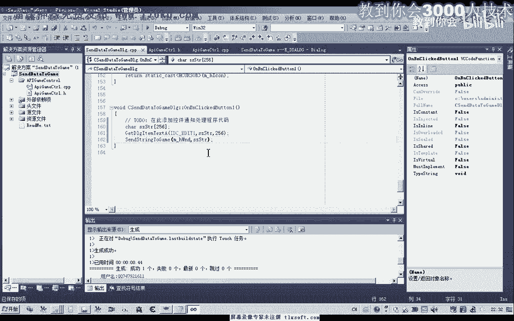

就是结束了这个指令才能够进行一个相应动作，那么我们打开日本理科里面，打开，那么这这段代码呢会相对的要复杂一些。

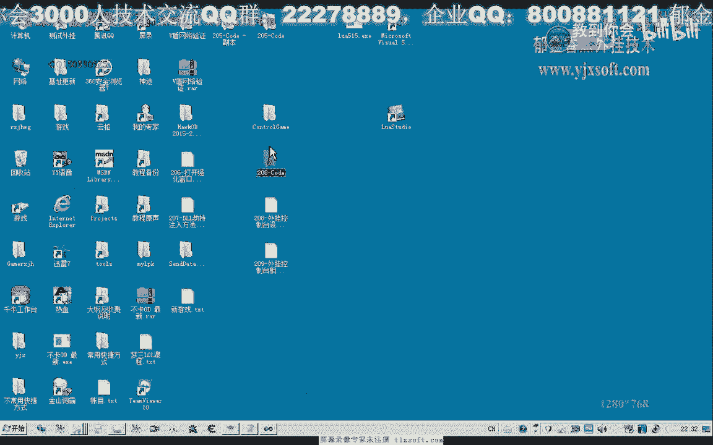

这里呢我们还需要安装一个钩子，把这个相应的信息呢把它指挥换啊啊，相应的这个窗口，那么我们在这里再添加一个塞进去，塞进去用的接收我们的信息，哈哈哈，再添加一个相应的图文件，那么在这里我们要做什么呢。

我们要用这个，我们把下段代码先加进来，大致我们是要写这样的一段代码，那么这段代码呢我们就是能把这个游戏窗口来直接换，好，那么我们来看一下，首先呢我们只规划到我们需要了。

用这个city love来给我们的这个游戏窗口安装一个新的窗口过程，那么首先呢我们要取得他之前的用gt英特纳呢，来取得游戏窗口之前的一个窗口过程，然后我们把这个新的主调函数来安装进去。

那么这个呢是我们一个新的游戏的窗口处理过程，那么这个呢有点类似于我们的之前的这个游戏主线程，当然这个挂件之后呢，它也是在游戏主线程里面呃，执行的这个操作，那么它因为我们之前的这个主线程度啊，是对视的。

实际上那么这里呢我们为了把它区分开了另外的挂机一下，这个线程用来处理我们的这个接收了我们的cp对这个消息，那么接收到之后呢，那么在这个地方呢，我们把这一段啊就是指令字错的把它打印出来。

这个指令这个字串啊，这是它的一个大小啊，这是他，的字串这个字串，然后这里呢我们有一个come on更新的呃，这个呢实际上是一个标志，我们在这里随意的定义到，我就可以，这是错的地方，我们把它配置在这里。

那么在这里呢我们需要定一个相应的就可以，那么在这里呢可以是一个任意的一个数字，用来主要是用来区分我们的指定语，好那么我们来看一下啊，首先呢我们需要纸的话啊，安装我们的这个新的一个窗口过程啊，用来替换。

那么这是它的一个大致的一个格式，接收到信息之后呢，那么在这里呢如果不是我们自己的信息的话，那么我们还需要调用它之前的一个窗口处理过程来处理它相应的消息，那么如果是我们自己的信息呢。

我们直接从这里啊处理之后呢，就用不出就问他之前的这个过程来处理消息，那么我们就可以直接返回，好了我们编辑先生成一下，还有不少的错误，这里我们需要停止一下，嗯，好的，这个时候编译通过了。

那么这里呢我们是需要的，安装一个后壳啊，也就是我们的窗口直接扩挂，建一个线程，那么这里呢我们是呃恢复，相当于是我们恢复以前的一个状态，恢复到没有安装这个没有指令化之前的一个状态啊。

因为在这里我们实际上是用这个swindler，替换掉了我们的游戏的窗口的一个过程，好的，那么我们来看一下怎么来接受这个消息，那么在这里的话，我们在这个地方也需要进行一个初始化，在挂件出现在这里了。

控制了一个接口，那么在这里呢它也需要了只进一个我们的窗口具体，那么这个窗口具体就是我们p的一个窗口，那么这样呢我们就为我们的游戏进程这个窗口呢啊，安装了一个新的一个窗口。

用来处理我们的这个pp代替这个指令，那么我们在这里边的话啊，比如说我们接收到的是我们相应的指令，我就可以用它来控制我们的这个游戏的一些操作啊，比如说挂机啊，停止挂机啊，或者是执行脚本啊。

或者是退出游戏啊，或者是信息这一类，那么我们首先呢把它编译它，重新编辑，升级一下，好的，然后我们把这个新申请的动态链接库来复制到我们的游戏，游戏目录下面，因为我们之前已经写了这个动态链接库截止的代码。

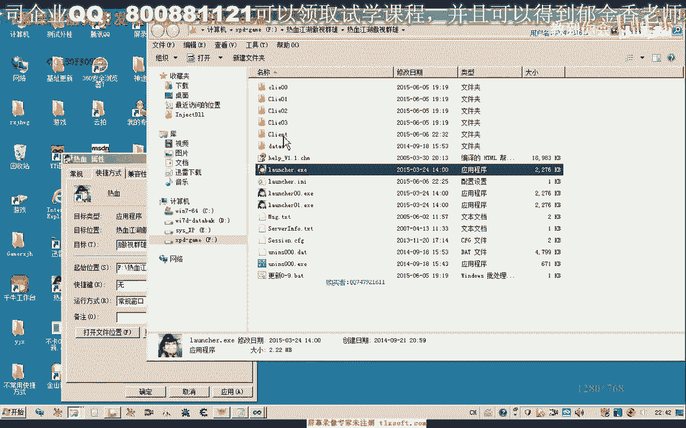

好的，然后呢我们再开启一个游戏，那么完善的话，也可以配合一下之前的这个游戏的自动登录啊，来实现。

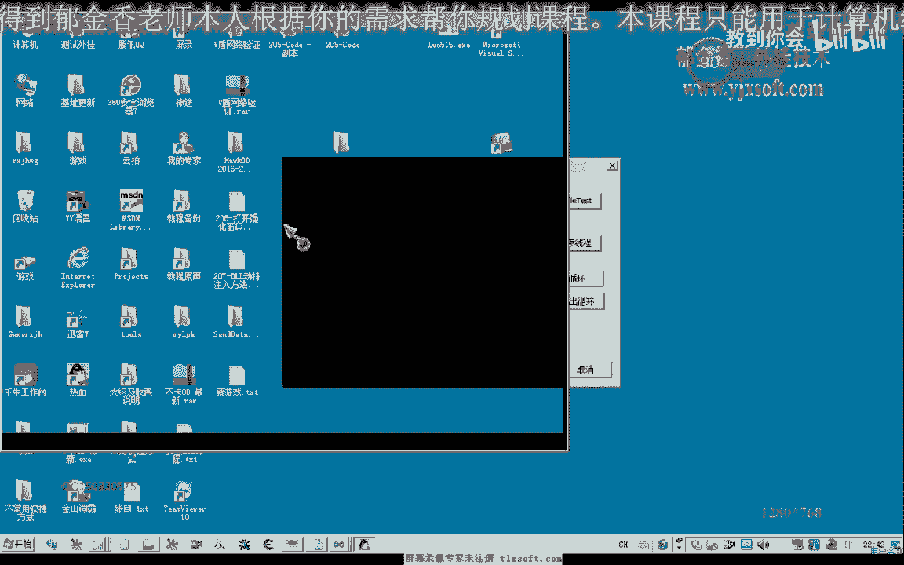

那么在这里呢我们先挂解一下主线层，然后呢比如说这个就是我们的控制台，那么我们的控制台来就可以像我们的游戏就可以给他发送一个数据，这里边不容易问题，但是我们可以看到啊，这个时候呢虽然他接收到了信息啊。

但是呢他们又把我们的这个指令显示出来，那么我们来看一下是什么地方出错了，那么它执执执执行到了这个地方，那我们看一下，因为我们的这个come on，这里的比较的时候不一致。

那么这两个地方呢我们最好呢是一致，然后我们可以把它的这个发现的类型写成我们的这个come on这个类型，或者是我们在这里，另外性格问题也就他们能胜利，就和你，那么在这里我们看一下它的位置。

这里能为我们之前讲的，用这个呢，我们把它改成了这个东西，好的，反正这里也就是这两个数值，这个数值要与我们接触的这个数值来一致，这样的话我们发行的这个数据最终才会对他接触到，这个是我的。

在游戏里就接触到了，那比如说我们让它实现一下我们的这个操作啊，那么我们重新改动一下这个代码，那么这两个指令呢，最后呢我们把它定义为一致的方，那么如果是其他的这个指令呢，那么我们进行其他的一些操作，看。

那么还要注意一点，我们在这里呢呃cindy message，我们发送信息过去的时候，那么如果我们这个进程啊，游戏的这个进程，他这里的代码没有执行完的话，那么这边呢会产生一个阻塞啊，在我们这边。

那么比如说我们举个例子，比如说我们在这个位置呢，啊弹出了一个message box。

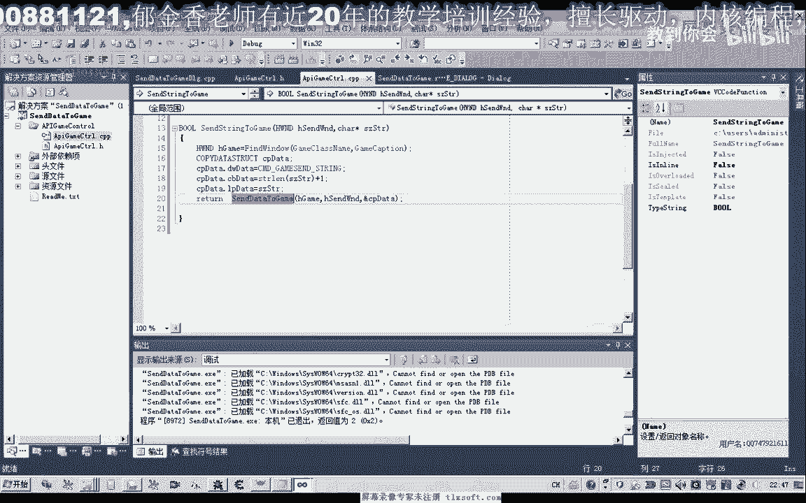

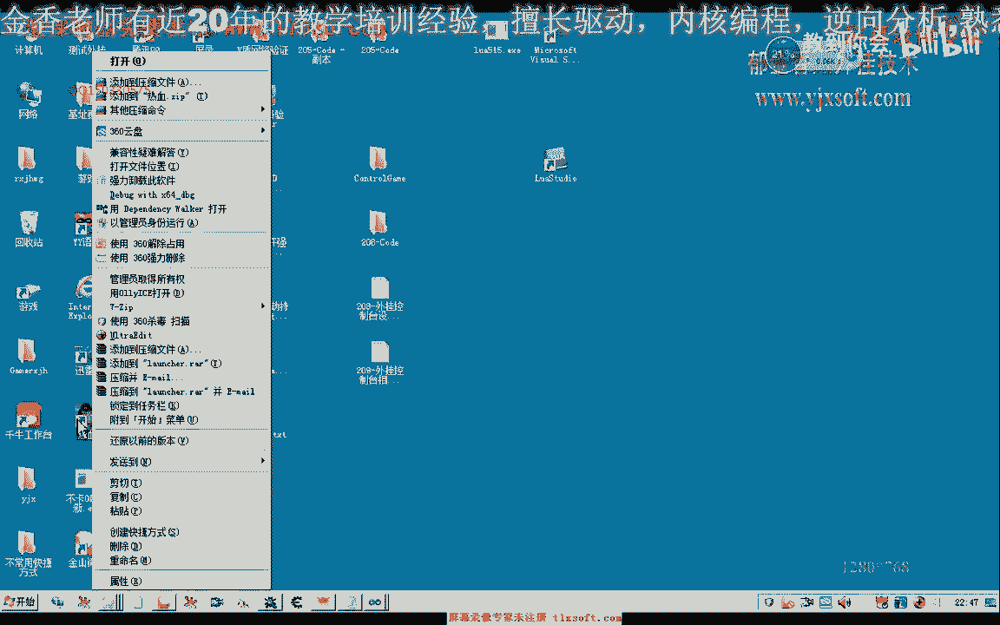

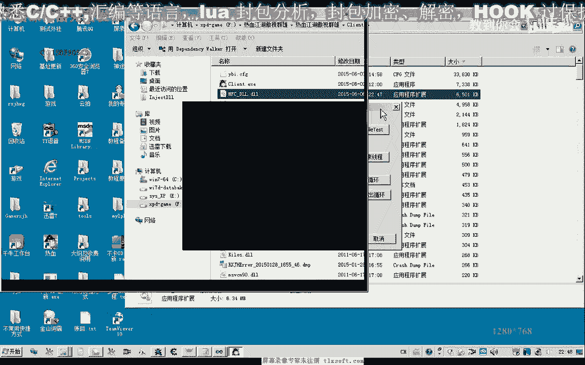

好的，那么我们再来运行这个控制台这一段，那么我们发送指令获取，那么这个时候发现发送指令过去呢。

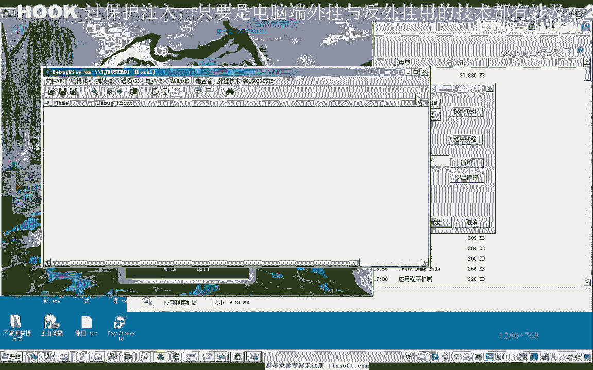

他没有处理，我们还有挂机这个属性成好的，化解了之后呢，那么这个时候呢我们看一下。

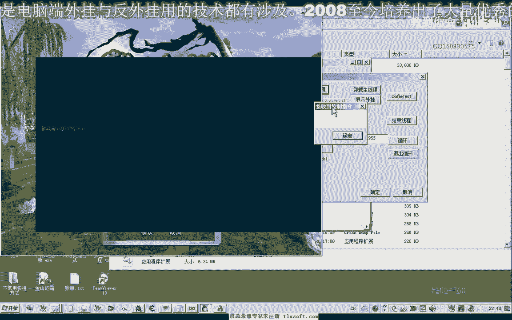

因为他后面的这个代码还没有执行完，没有retur，那么只有你看之后呢，那么我们这边的这个代码呢，他才会继续执行，那么这个时候我们点这个窗口呢，它是没有反应的。

那么我们只有人把这个message boss去掉，那么之后呢这里它才会有反应，比如说这个时候我们来控制它的话，它会有反应，因为在这里他出塞掉，这个时候他才会有那么这一点呢，我们需要做一个了解，好的。

那么这节课呢我们呃就讨论到这里，那么下一节课呢我们再来讨论怎么把我们的这个，我们的数据呢呃我们游戏端的一个数据啊，怎么把它传回到我们的这个控制台，那么我们实现一个交互双向的一个通信。

那么现在呢我们之前呢呃只实现了一个单向的一个通知，只是我们的这个控制台的这个接口，像我们的游戏的发出一个控制的一个词缀啊，好的，那么我们下一节课呢再继续讨论这一节课。

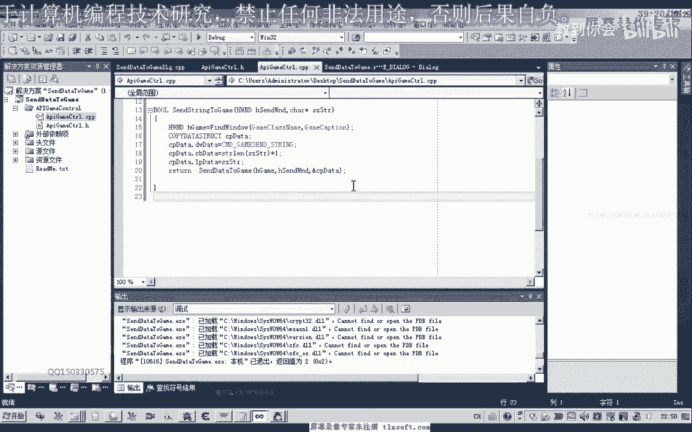