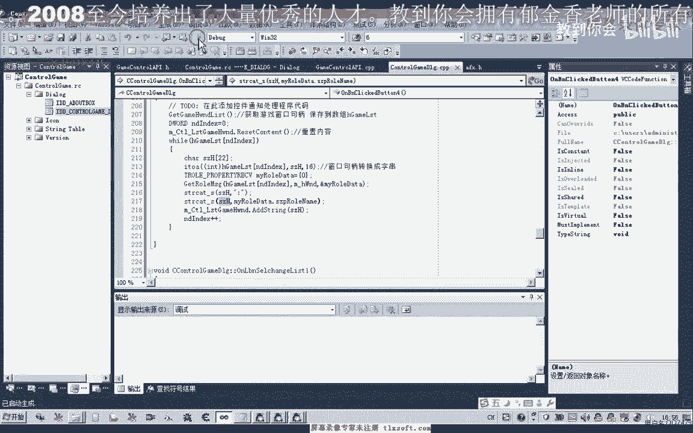
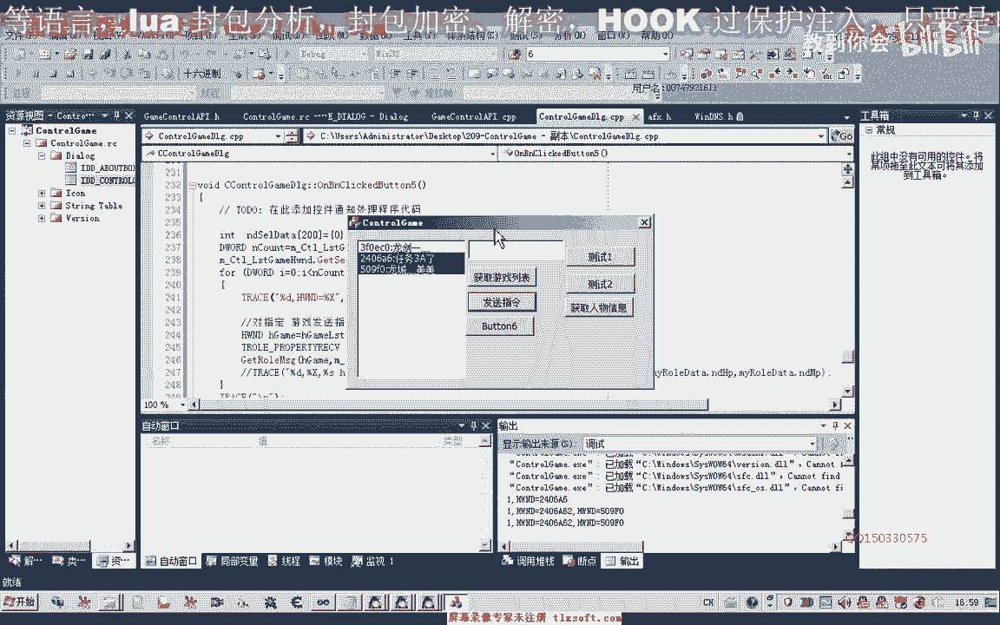
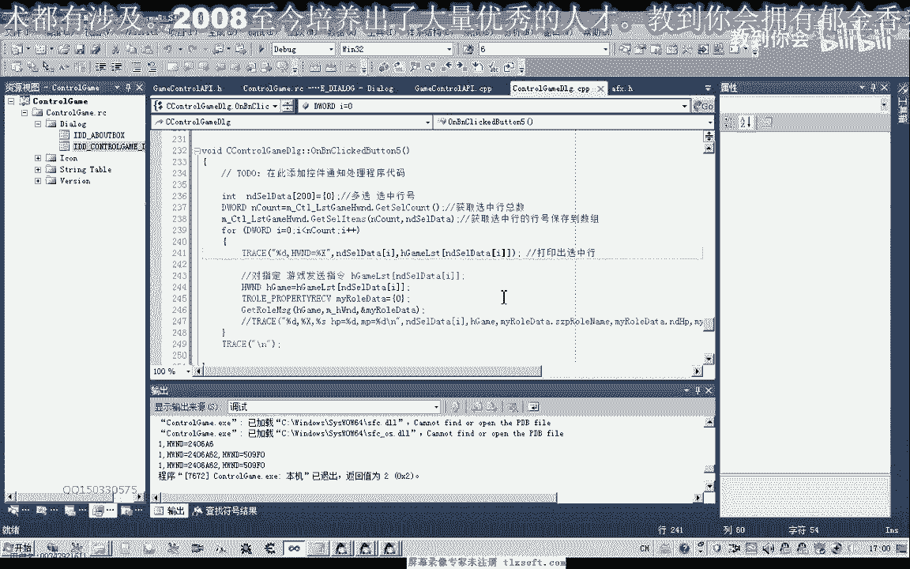

# P195：210-控制台相关接口设计(控制多个游戏)_old - 教到你会 - BV1DS4y1n7qF

大家好，我是郁金香老师，那么这节课我们一起来讨论，我们有控制台控制多个游戏的这样的情况，那么首先呢我们来看下一段代码的一个测试。

那么这是我们的控制台阶段的，那么呢我们可以通过片名来获取运行当中的这个游戏啊，那么获取它相应的列表之后呢，我们可以的在选中的这个呃游戏来发送我们的指令，或者是这个指令的话呢。

我们可以在另一端的代码进行封装，接收到指令之后进行作死，我们可以在另一端进行相应代码的编写，那么这里呢我们只是做了一个例子，比如说我们在这里，那么这个时候我们用三个角色都是选定。

那么在这里呢他发现了什么之后呢，就把它的这个血量啊，其他的这个名字啊这一类，那么比如说我们只选择第三个发送指令之后，这里呢它只会取第三个相应的一个信息，当然也可以通过这个指令呢呃其他的形式来进行区分。

让它进行挂机啊，或者是知识的脚本啊，或者是取得其他的一些信息都是可以，那么接下来我们来看一下，那么接下来我们来看一下它相关的代码的一个编辑。

那么首先我们看一下获取我们的游戏列表，实际上很简单，全部是通通在这一个函数里面，那么这里呢我们写了一个函数，通过这个windows的hr函数来领取所有的方程。

然后这个媒体的窗口呢它会跳到这个相应的回调函数里面去执行，那么我们再回调函数里边呢，我们对它进行判断，对它进行判断，那么判断这个标题以及我们的窗口能力是否是我们的游戏啊，窗口具体，那么如果是游戏窗口。

具体会把它存到这个全局的嗯，全局的数字，那么这个数字呢就是关键的这么一个，那么我们的根据呢就是根据我们的这个容器决定的内容，来进行一个指令的一个操作啊。

也就是所有的数据呢相当于我们的这个游戏的局面呢进行了一个绑定，一个比一系，那么我们取得了这个作品之后呢，那么这个全局的这个作品啊，进入了它就有了一个列表，比说我们这里三个武器，它会存放了三个距离。

在这个全局的变量，然后我们在这里来取得了这个全局变量之后呢，我们这里是对这个控件的操作，那么这个定价是，就是我们的是明白了这个这个名字，那么首先呢我们进行内容的一个形式。

然后呢开始来骗离我们这个窗口列表，发到我们之前也做了一个初始化，在你直片面的时候啊，这里面会对它进行的是初始方法，那么也就是说这个窗口推平它为零的时候，我们这个循环就结束了，或者我们这里呢也可以。

然后用一个疑问的，进行判断也是可以的，那么判断这里面呢它是否是一个有效窗口的具体，那么这样呢我们可以防止一个窗口游戏或者完毕之后呢，就不会下场发生相应的这种信息，那么这样的也不是很好。

因为它可能是中间的某个游戏，中间的某个窗口关掉了，那么后面的我们还会继续的控制，通过最好的一次调用，这个把dgame谈到历史来重新的把这个数据更新一下，然后更新之后呢。

我们会把这个窗口的距离会把它转换成一个字串，保存到这个字串里，这里面是，那么转换成计算之后呢，然后呢，我们开始了取得这个绑定窗口的一个相关的一些人物的一个信息，去调用了这个函数，发送相应的思路。

然后取得人物的信息之后呢，我们在这里呢把这个人物的信息添加到这个计算的末尾，那么所以说就有了这一段。

那么我们执行之后呢，游戏更新呢就更新到这个列表里面。

那么我们再来看一下发送指令这段是怎么实现，然后发送指令的，实际上它也是对，主要是对我们的呃，这个h game类似对相应的方法进行一个操作，那么有了这个窗口句柄之后呢，我们对它选中的这个行业进行一个操作。

那么这一段呢之前我们有结束过好这一段呢我们就是这个定价，这里呢我们需要设置一下，设置为多选，那么有多选的时候呢，嗯我们需要来获得他选中的这个下标，那么这个下标呢它最终返回之后呢。

会保存到一个整形的列表里，那么这个呢就是保存的，咳血对中好的，然后保存在这个n p c对他，那么如果是选中的行为，我们在这里再来执行一个循环，那么这里呢这个nt count是获取的呃。

多行选中的一个组成一个函数，然后取得了数据的显示在这这里，那么实际上我们能够看到嗯，这里有一行就是我们选父母，如果我们把这横竖的竖，然后我们发出指令的时候，我们可以看一下，n p c对。

这个时候呢我们是没有选不能行啊，所以说它不会有相应的形式，比如说我们选中了某个行，那么这里呢它会显示出它相应的行，以及它相应的这个窗口的一个具体，那么我们这里可以看一下，那么比如说我们选中这个。

这个是让我们开会的检测到银行备注，那如果是选重点好，那么呢它这里面也会有一个相应的形式。

那么这里的话我们跟下边的话应该是一或二，它是在日本，这里肯定有没有相应的一个，这两个的四个零和一，后面的数字是我想对你再进行一下。

看起来像是有一个超，那么在后面的我现在就在后面，因为他没有放行这里，所以就看不出，这是一波这所有的推品质能让他，那么所以说我们就可以通过了这样的一个骗流量，来控制的很多的这个游戏。

那么这就是一个控制台的一个原理。

好的，那么这节课呢它的原理呢，我们暂时呢我们就讨论到这个地，那么更多的细细节大家可以参考这个相应的，嗯那么这是我们重建，那么这里呢就是想你们这种代码在这个上节课就写了，那么另外呢就是一些配件的一些设计。

那么这里呢我们给它添加了一个出现了一个变量，这是一个真正的一个变量，好的，那么这节课呢我们就就到这了，如果你不理解。

