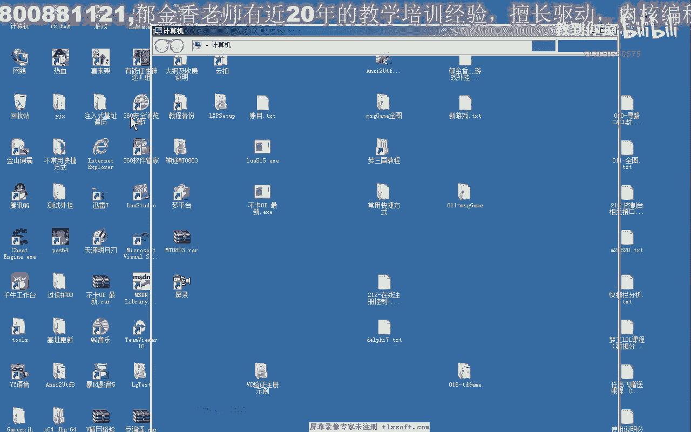

# P196：212-在线注册控制-实例 - 教到你会 - BV1DS4y1n7qF

大家好，我是郁金香老师，那么这节课呢我们一起来编写代码，实现我们登录验证的。

那么我们继续打开我们的微单系统。

那么上一节课呢我们一起来了解了这个，键板的这个例子哈，我们编译通过了，那么这节课呢我们一起来使用一下这个纯动态链接库的这个版本啊，而不是现在这个版本，那么这个版本的话它没有写相关的例子。

但是接口函数的话都是一致的，那么我们把这里面的所要用到的啊，它拷出来，那么我们可以把这几个这一部分呢需要考出来啊。

先复制一下找到，然后呢我们先建一个新的工程，用来做登录的测试。

那么在这里呢字符起呢我们还是会选多字体的这个棋，然后在这里呢我们添加一个标签用来显示信息，那么另外呢我们来添加一个登录按钮，好的，然后呢我们所要做的话，首先呢我们是保存一下，保存之后呢。

我们打开源代码所在的目录，把我们刚才复制的这个洞啊，这个lil啊，以及这个头文件把它停止过来，然后呢我们需要用到的这些函数呢都在这个铜镜里面，然后呢它会同时呢我们需要包含一下这个lib文件。

然后我们再设置一下输出的目录，那么我们需要把这个服务器的相关信息的文件，要放到我们ex啊所在的目录下面，那么同时呢我们还需要做一步，把我们的动态链接库就是到我们的本身就有下跌。

从这里我是想，复制之后呢，这样我们就把动态链接复制到windows的下面啊。

接着我们就可以把，编写相关的代码，在这里我们添加一下线下，把我们刚才添加的这个level文件，这个文件我们添加进来，然后我们在，这个窗口初始化的时候呢，我们要做一个相应的初始化。

注意这里要做一个全局的一个标识符，那么我们复制一下初始化相关代理，那么注意啊，这里呢实际上也就是我们啊之前的这个产品编号的一个初始化，因为我们组建的初始化是一样的啊。

那么组件呢它是用对象的方式调用这个初始化的这个函数，那么在这里呢初始化函数呢它会返回一个数值，那么如果是返回的是v一-1，表示呢表示我们的链接这个注册登录器啊会成功，那也就是你们认证的表示没有连上。

那么这个时候的话可以了，就退出我们的程序，那么如果是啊，只要这个数值呢不视为-0啊，一般我们经常反馈的数值应该是零，表示问题成功，那么当然这里还可以评价其他的代码，那么我们运行一下，对了。

这里面需要包含我们的图文件，好那么我们运行一下，那么首先呢我们一定把这里呢要服务器连接成功，如果这里呢服务器没有零链接成功的话啊，表明了我们的可能是我们的动态链接库没有放到我们的windows目录下边。

那么也可能是其他的情况，那么链接成功了之后，那么接下来我们就可以做相应的验证了，登录的验证，那么登录验证的代码年年上一节课实际上已经有过接触了，那么在这里呢我们就需要一个运营和密码。

那么这个用户名我们密码是发给我们的用户的，这是用户的，当然我们需要了，在这里我们作者端哈需要在这个用，户里面创建相应的用户和密码，在这里用户名密码双击这里，当然这里也可以修改啊，修改它的用户名。

或者是修改这个密码，那么用户密码有了之后的话，我们就可以了，用这个ba模型啊，这个函数来进行验证，那么如果返回零的话，表示呢验证成功，验证成功可以使用，那么其他的情况啊，-1呢是注册码存在。

那么富裕的话是被禁用的，那么-3的话是绑定的机器啊，超限当然看你有相应的限制内容啊，做事的话表明了注册码啊，在线路本来表示过期，-6的话表示你要布局好的，那么我们再次来测试一下。

那么我们在这里可以看到啊，我们的这个链接的话是成功的，那么如果我们的密码输错了，就说我们做数码页面看一下，那么他会告诉你啊，啊返回的错误了，是注册吗，不存在，或者是你用不明这一类的啊，输错了。

那么实际上这里呢是密码错了，那么密码错了之后呢，他也会高速这个注册码不存在啊，密码错，那么如果我们的用户啊，这里是错，我们看一下是什么情况，那么这个时候呢他也会告诉他出售码不存在或者是密码错误啊。

不过实际上都是一样的，密码错误，那么账号不存在这里，它都会保存一个错误，比如说我们在这里呢再创建一个内部，那么这个创建的用户的话，实际上的话，现在他呃没有测有效期啊，不能够使用。

那么我们来看一下实际情况，这个时候呢它会显示的是余额不足，侵蚀的是幼儿病，那么余额不足的话，也就是这个剩余的天数，这里面有，因为这里没有启动，那么我们在这里呢需要给它增加相应的天数。

那么这个时候呢链接才能够通过，这个时候呢我们就可以登录成功，就可以登录成功，当然它还有一些其他的功能，比如说我们可以有一些触点的功能啊，触点和这个函数，还有一些其他相关函数的一个接口。

那么我们在呃后边的课程呢，我们再继续的探讨，那么这节课呢我们暂时就到这个地方。

