# 郁金香老师C／C++纯干货 - P197：213-在线注册控制-注册充值激活_old - 教到你会 - BV1DS4y1n7qF

大家好，我是郁金香老师。

那么这一节课我们继续来了了解微分的注册系统，那么首先我们了解一下用户的注册，它需要用到the resist这个函数，还有我们开卡的时候，网充值我们需要用到a t t t这个函数，那修改运输密码的话。

就需要这个呃亲戚passwor，那么另外一个用户的验证啊，这个我们在上一节课嗯，已经有过了解好的。

我们先打开212课的代码。

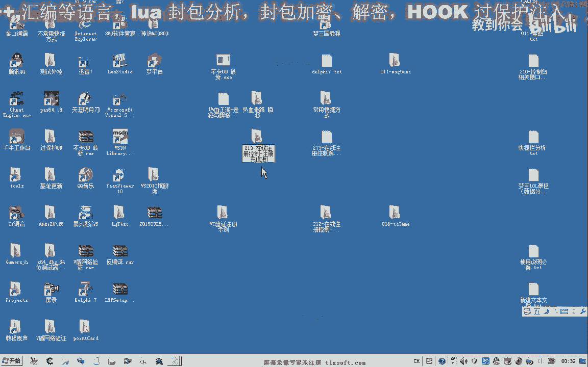

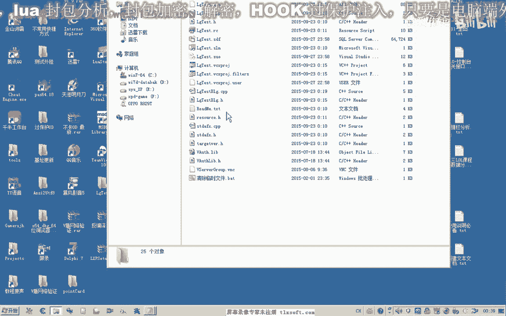

那么我们添加几个按钮，就是注册，注册，然后一个是充值，那么另外还有一个呢是修改密码，那么登录修改密码的，我们在下一节课呢再进行了解，注册充值跟，那么我们需要添加几个编辑框，一个是用户名的，一个是密码。

那么另外呢充值这里呢我们还需要一个充值的卡号，注册登录充值，好的，然后我们在为用户屏与p码关联一个相应的字串变量。

这个是密码的。

然后这个是我们充值卡。

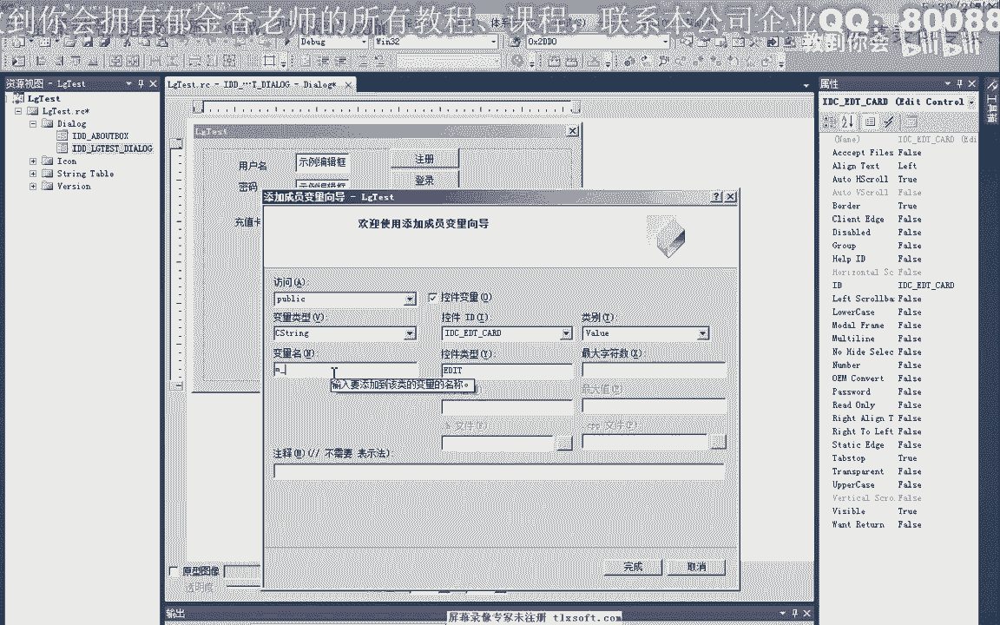

好的完成之后，首先我们来实现用户的一个注册。

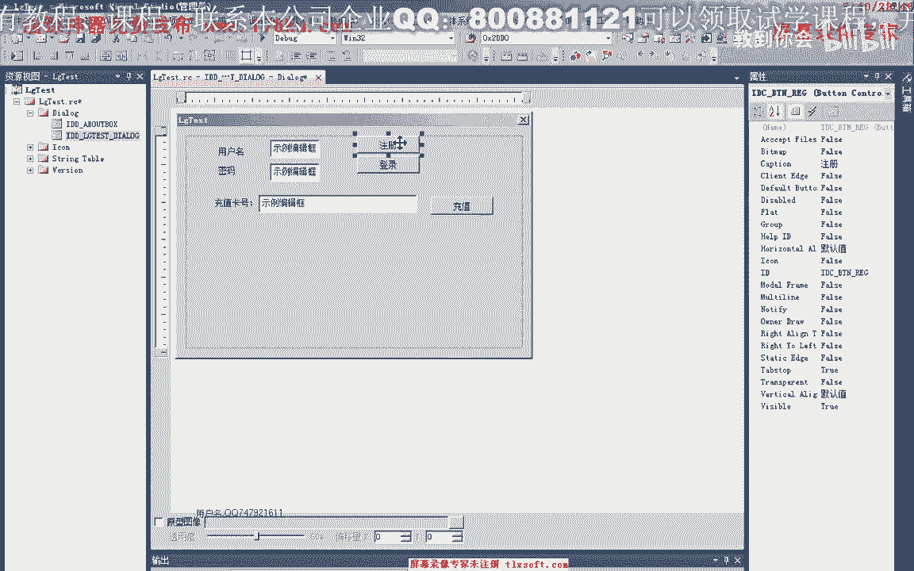

那么用户的注册我们可以，可以看到哈他有第一个参数是用户名，第二个是密码，那么它都要求的是恰类型的指针啊，那么后边这个类型我们呃可以试看一下它的帮助文件。

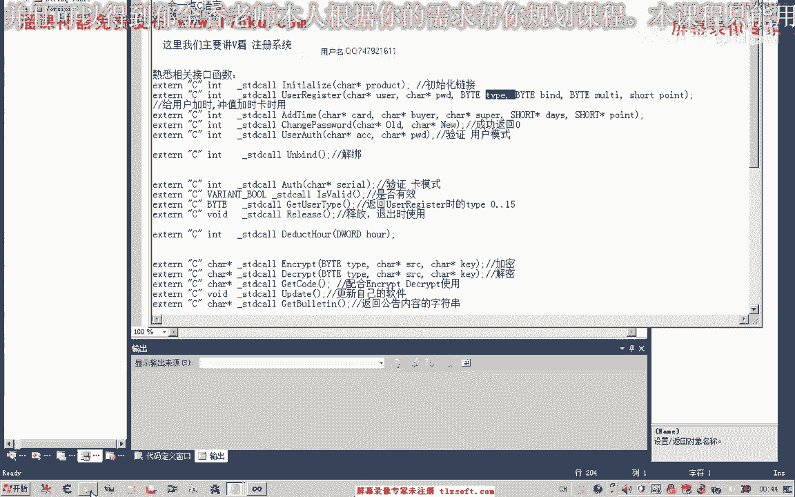

当然我们要使用这个注册的功能，必须是先通过这个初始化的函数调用成功之后。

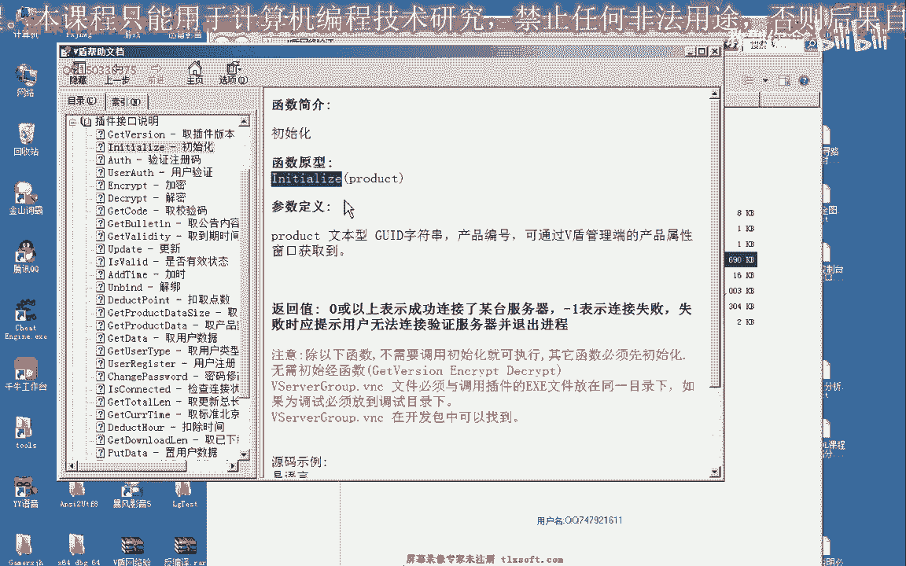

我们才能够实现注册，那么这里呢他有他想你的意义。

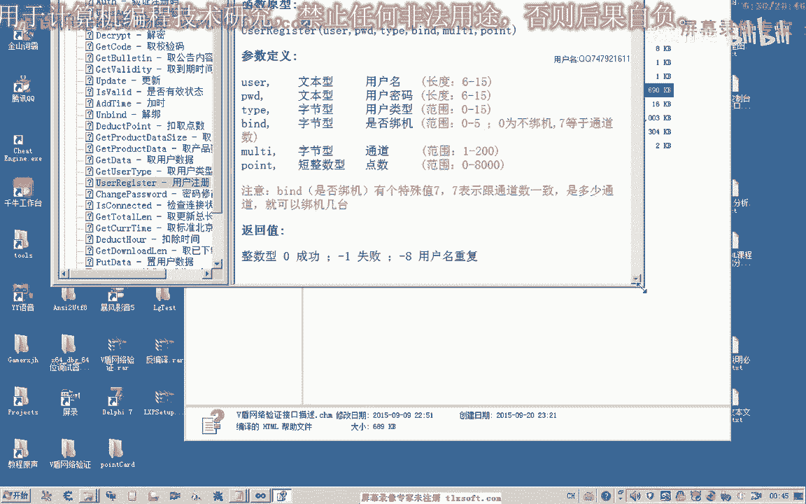

当然最重要的就是一个用户名封密码，那么其他的话理论上都可以省略掉啊，那么这里呢呃通道，当然了，通道的这个数字必须是1~200之间啊，通道的话表示这个呃用户和密码来可以在几台电脑上登录啊。

那么你就是多开的时候用这个丈夫相当于是好的。

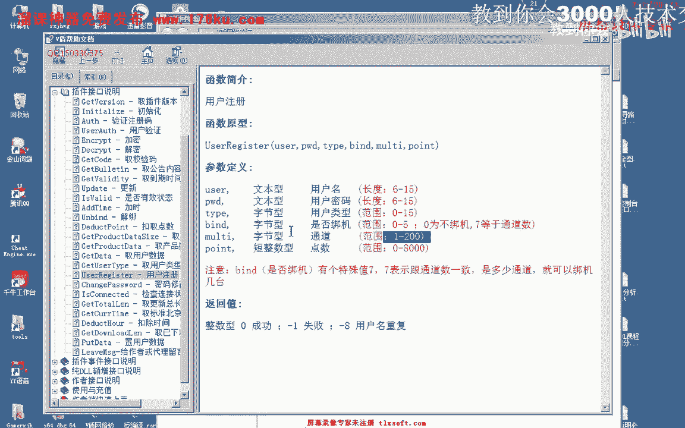

那么我们知道它的运行之后呢，我们直接使用相应的应，首先我们把窗口的数据呢更新到我们的变量里面，然后我们调用相应的函数，锐减，那么首先呢我们取得他的程序get it 8分200个字节的话，肯定是个。

那么然后呢是它的命运，那么也需要取得他的缓冲区啊，不然的话类型的话会有致，那么后面这个类型的话，我们直接填零，因为它的这个类型的话是我们用户自定义的啊，那么后边呢这里是否绑定电脑，我们也填零。

那么通道这里呢我们就只在同时只在一台电脑上使用，一般呢我们选择一啊，那么后边这个初始化的点数，当然你自己给它规定一个相应的数值，比如说我们1000 1890初始化，当然它也有仅有它的相应的一个返回值。

那么如果是零的话，是成功啊，一个呢是失败，八呢是用户名啊重复，那么我们可以进行一些主题，然后呢把这个数字打印出来，那么还有这个缓冲区，使用完了之后呢，我们最好是把这个缓存去释放一下。

等一会我们再做代码的修改，那么在这之前呢，我们先登录我们的后台管理系统啊，先看一下，那么我们看一下现在的用户只有这三个，那么在这里呢我们就是一个新的用户，那么为六个一，那么注册一下。

那么这里呢就会出现一个新的用户，那么我们再注册一个，那么这个时候呢会再多出一个用户，那么这里是它的通道数啊，呃这里呢是点数啊，对应我们别相应的参数，我们可以看到这里的1800点，这里是通道之一。

那么都与我们的参数来相对应，还有是否绑机运行，那么就有这两个参数对应在我们的管理端呢也能够看到啊，我们都看到啊，当然刚才我们的登录失败了，登录失败之后呢，它会自动的退出这个进程。

那么现在我们的用户注册成功之后，要使用的话，我们就需要给他充值，那么加时卡里的这些卡号我们就需要用到啊，那么我们在出售的时候呢，也是出售这个相应的卡号，那么这个卡号的点数的话啊，嗯自己可以创建。

创建的时候多少个多少天，多少多少点创建的数量，那么在这里呢可以统一的进行创建好的，比如说这张充值卡我们还没有用过，那么或者是最后一张我们复制一下，那么要激活这个用户的话，我们就需要充值。

那么充值的话我们需要用到另外一个函数，首先我们也是把我们的数据更新到变量里面，然后调用该充值的函数，那么第一个呢是需要我们的卡号，好多，那么除了这个卡号之外呢，我们需要一个购买者，那么购买者的话。

我们就用之前的这个用户啊，这12个字体的话也够了啊，中区，然后呢后边这里是一个推荐人，我们可以了嗯，忽略掉这个参数，后面呢就是我们的一个天数呃，或一个点数，那么这个呢我们来建两个变量。

这两个是用来返回相应的数值，需要传一个相应的指针地址进去，好的，那么我们也来看一下它的房间，啊，我知道，当然最后我们使用完之后呢，对这个字串的缓冲区空间进行一下释放，去，那么这里是释放相应的存储空间。

好的这段代码我们写好之后呢，我们就是通过这个编辑框里边的这个卡号啊，给我们上面的这一个用户来进行一个充值激活的一个操作，那么我们来看一下，那么首先嗯这里呢我们需要用一个用户名。

比如说我们刚才需要激活的账户是这个郁金香啊，888啊这种，那么我们就需要在这个地方进行充值。

当然就这样充值的话，肯定他会出错的啊，返回后期啊，就表示这个卡号是无效的。

那么我们需要在这里呢重置一下没有用过的啊，加思考，然后呢到这个地方，然后进行充值啊，那么我们点一下充值，在这里我们就能够看到充值的购买者是哪一个用户，充值成功之后，那么这里的话它也发生发生了相应的变化。

首先呢这里我们它的点数加了600点，那么剩余的天数呢变成了30，因为我们这里的加时卡啊，它就是啊一个天数，30天，点数是600点，它就就会增加相应的一个数值，那么这里完成之后呢，接下来我们可以了。

就可以登录这个账号了，因为这个造出来已经进行了激活，因为他的天赋和我们的点数的话啊，都是一个正数，都是大于零的，那么我们就可以进行登录了，那么接下来我们修改一下登录的代码。

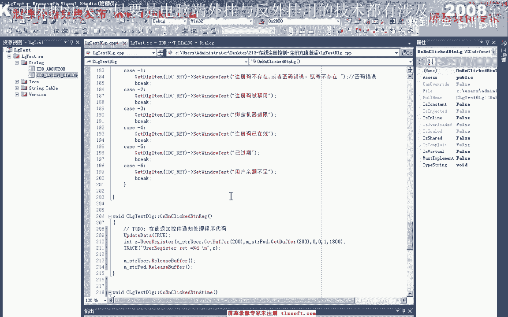

把上一节课啊跟录的这一段代码记一下。

那么复制之后啊，这一串啊我们需要进行修改，啊账户名关闭吗，还是进展，那么替换掉之前的这两个字串，当然使用完了之后，我们也需要释放相应的空间，好的，那么我们再次。

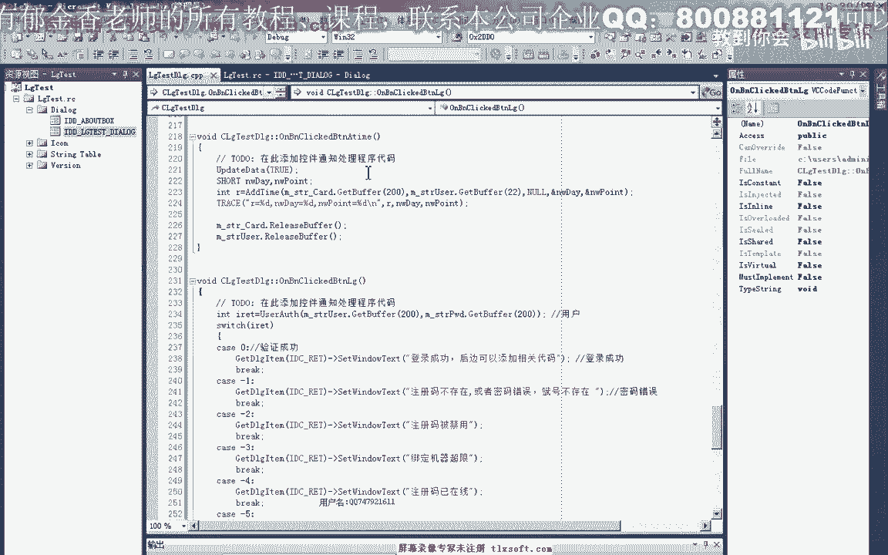

一起看一下。

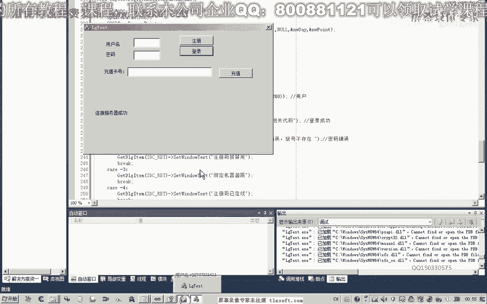

那么因为这个账号已经激活了，我们就可以进行登录，1233等呃，那么这个时候密码啊，密码错了啊，刚才我们注册的是，那么我们在这里重置一下，把小米的那个，再更新一下，那么我们再重新来看一下11122。

把我们的用户名和密码记一下，68万，然后呢我们点一下登录，那么我们首先看一下这段代码是否有执行到，那么我们发现我们的登录代码的话根本就没有执行到呃，这是由于什么原因造成的呢。

因为它可能是关联到我们之前的这个函数里边来了，那么我们可以在这里加一段调试信息，看一下，因为我们之前更改了这个按钮的，那么他登录的这里的用户名和密码的话。

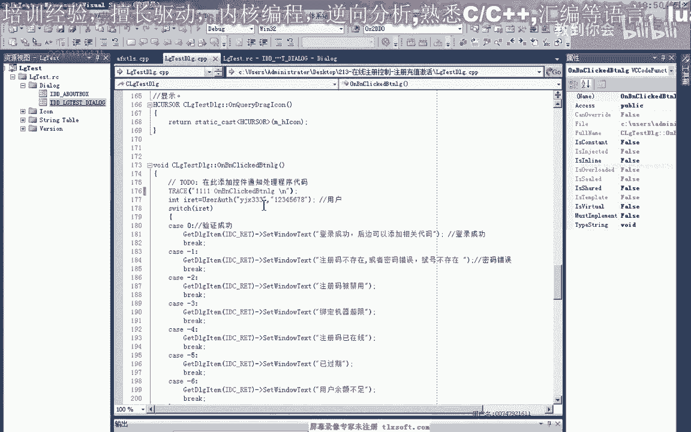

肯定就是错误的，那么我们可以看一下，它的确是在按登录按钮的时候，执行的是这段代码。

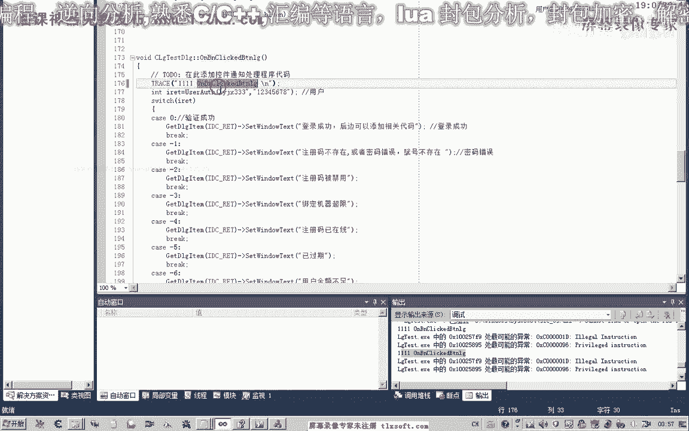

那么所以说我们这个时候呢，我们需要在关联出来修改它关联的这一个函数，那么我们发现这两个函数名好像是一样的啊，那么我们重新生成一下，那么我们可以先尝试把这一段代码删除掉，再进行编辑，看一下。

再看一下我们登录的代码，那么可能是某一个字串它是一样的，那么我们再来看一下他们相遇，再看一下他消息的一个应税对了，这是我们之前的，那么我们后边呢这里给他加了一个i d来给他加了一个下划线。

所以说造成了他两个按钮了，消息的传递了不一致，那么我们看一下这个数字，这个数字的话它不一样，我们需要把这个删掉，那么前面这个是小写，后边这一个是大写，那么实际上这两个的话就是一个大写与小写。

小写字母的一个区分，从这里能够看到，所以说这两个函数的话实际上它是不一样的，但是这两个数字的话它是一样的，所以说造成了我们刚才的一个冲突或错误，好的我们再次进行测试，看一下它的密码，11122。

好的我们进行一下针对。

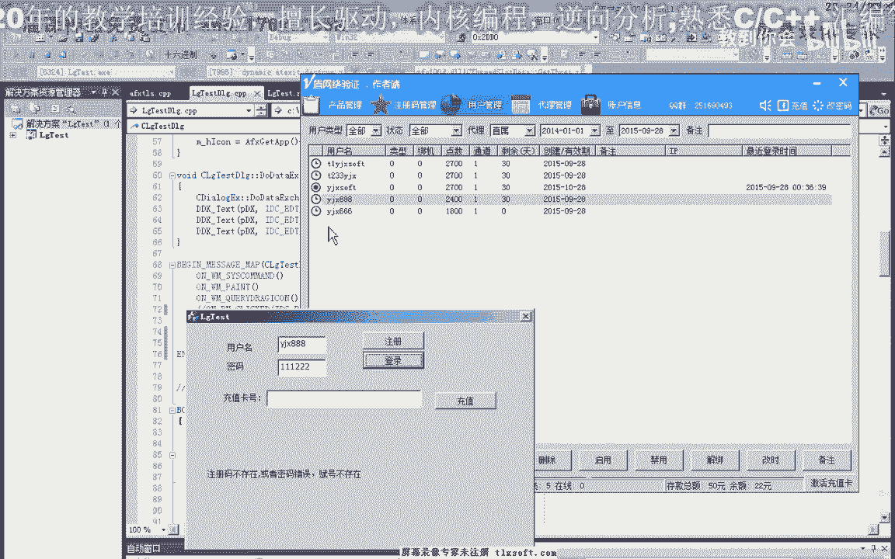

那么有这个账户名存在，我们在注册的时候呢，它会显示复发，并不能重复，那么我们再来看一下我们相关的代码，那么这段代码的话应该是已经被执行了啊，但是他在，登录的时候啊，这里出现了相应的错误，那么这里的话。

应当是我们的密码可能是错了，我们再来，重新登录一下，那么刚才呢我们发现在这里呢我们少了一个步骤啊，就是没有把我们窗口的字符串了嗯，更新到我们的这个变量里边去，那么所以说造成它是一个空的字符串。

那么在登录的时候肯定就会出错。

好的我们再重新看一下。

那么这个时候我们可以看到啊，这里呢登录的ip地址，以及我们最后的这个时间啊，这一类，好的，那么我们再进行一下完整的测试啊，那么这里173111注册一个账户，然后呢我们在这里呢嗯复制一下。

对它进行一个充值。

那么充值之后呢，然后呢我们就可以了呃，进行登录这个新的用途，当然我们刚才好像有听登录到这个预期将888啊，这个我们不能够同时登录两个账户，所以说我们在这里的话。

第二次的时候呢，我们那只有重新登录登录一下。

看这里，来来来来好看，登录我们可以看到这里可以进行一个登录的操作，好的，那么最后还有一张卡。

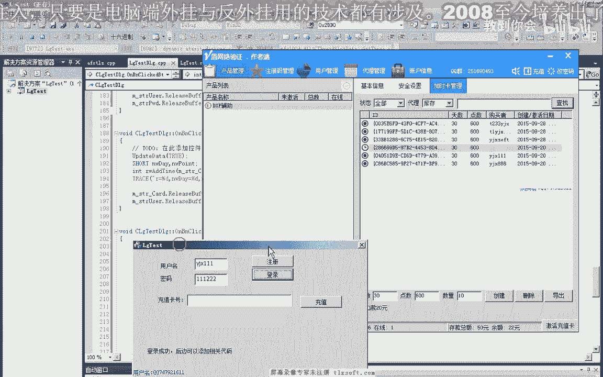

那我们再做一下相关的测试，好，首先我们创建一个用户，然后呢我们注册啊，这里面会多出一个账号，然后我们呃如果是使用者的话，就去作者那里啊，或者是代理那里呃，购买我们的初值卡啊，加思考，然后呢进行充值。

那么充值之后的话，这里会看到的是相应的使用者，那么这里呢也能够看到啊，增加了一个天数，那么充值成功之后呢，我们就可以了，登录最后登录，那么登录之后的话，我们可以呢就可以使用我们的相应的开启一些。

通过这个数字的一个判断啊，添加一个我们相应的而代码在这里，在这一个问题好的，那么这节课呢我们暂时呢就讨论到这里，那么后边的话我们可以再讨论一下呃，它内置于密码的一些修改，还有我们可以解除绑定。

还有当然它还有一些呃安全的一些功能。

啊还有一些安全的机制啊，那么这些呢大家可以下去看一下他相应帮助人的好的，那么这一节课我们就到这里。

